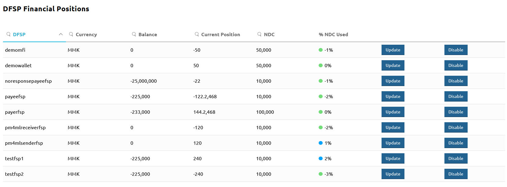

# Surveillance des détails financiers des DFSP

La page **DFSP Financial Positions** vous permet de surveiller les détails financiers des DFSP tels que le solde, la [Position](settlement-basic-concepts#position) actuelle, le [Net Debit Cap](settlement-basic-concepts#liquidity-management-net-debit-cap), le pourcentage de NDC utilisé.

Pour accéder à la page **DFSP Financial Positions**, allez dans **Participants** > **DFSP Financial Positions**.

Les détails suivants sont affichés pour chaque DFSP :

* **Balance** : Reflète le solde du compte de liquidité du DFSP auprès de la banque de règlement.
* **Current Position** : La Position actuelle du DFSP. \
\
La Position d'un DFSP reflète — à un moment donné — le total des montants de transfert envoyés et reçus par le DFSP. La Position est la somme de toutes les transactions sortantes moins les transactions entrantes depuis le début de la fenêtre de règlement, ainsi que tous les transferts provisoires qui n'ont pas encore été réglés. \
\
Chaque tentative de transfert sortant entraîne le recalcul de la Position par le Hub Mojaloop en temps réel, qui est ensuite comparée au Net Debit Cap. \
\
Une fois la fenêtre de règlement fermée, les Positions sont ajustées en fonction du règlement — la Position change pour correspondre au montant net des transferts qui n'étaient pas initiés ou pas encore exécutés lorsque la fenêtre de règlement a été fermée.
* **NDC** : Le Net Debit Cap défini pour le DFSP. \
\
Lors du pré-financement de leur compte de liquidité, les DFSP définissent le montant maximum qu'ils peuvent « devoir » aux autres DFSP, c'est ce qu'on appelle le Net Debit Cap (NDC). Le NDC agit comme une limite ou un plafond sur les fonds disponibles pour les transactions d'un DFSP, et il ne peut jamais dépasser le solde du compte de liquidité. Cela est nécessaire pour garantir que les obligations d'un DFSP peuvent être honorées avec les fonds immédiatement disponibles auprès de la banque de règlement. \
\
La Position est continuellement vérifiée par rapport au Net Debit Cap ((MontantTransfert + Position) < = NDC) et si un transfert devait faire dépasser le montant de la Position par rapport au montant du NDC, le transfert est bloqué.
* **% NDC Used** : Un indicateur Position/NDC pour montrer le pourcentage de NDC utilisé.
