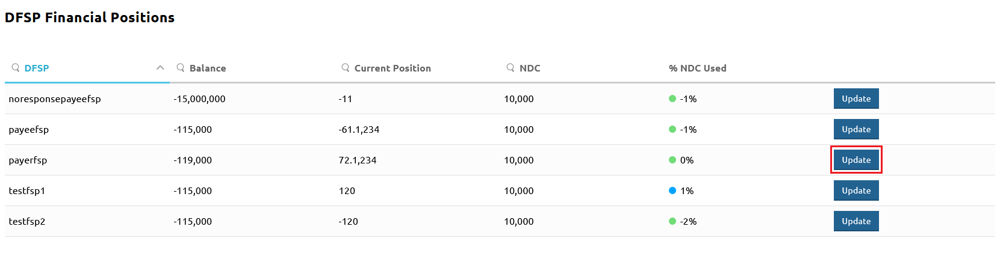
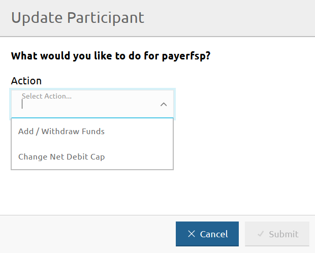
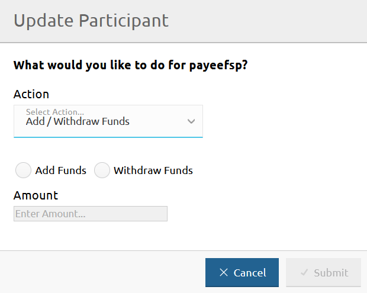
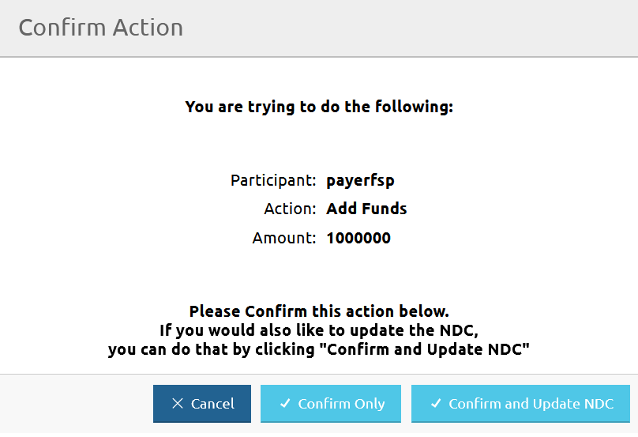
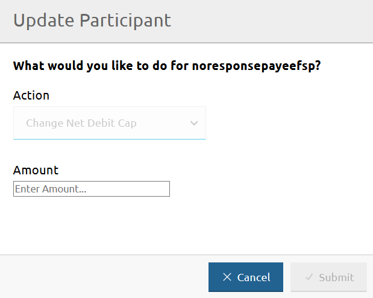

# Enregistrement des entrées et sorties de fonds pour un DFSP

La page **DFSP Financial Positions** vous permet d'enregistrer les entrées ou sorties de fonds dans les registres du Hub en cas de mouvement de fonds initié par le DFSP : un DFSP dépose des fonds sur son compte de liquidité ou retire des fonds de son compte de liquidité.

Pour accéder à la page **DFSP Financial Positions**, allez dans **Participants** > **DFSP Financial Positions**.

Pour enregistrer des entrées ou sorties de fonds pour un DFSP, effectuez les étapes suivantes :

1. Cliquez sur le bouton **Update** à côté du DFSP pour lequel vous souhaitez enregistrer des entrées/sorties de fonds. \
 \
La fenêtre **Update Participant** apparaît.
1. Sélectionnez **Add / Withdraw Funds** dans le menu déroulant **Action**. \

1. Sélectionnez l'option **Add Funds** ou **Withdraw Funds** selon l'action que vous souhaitez effectuer. \
Pour enregistrer un dépôt, utilisez **Add Funds**. \
Pour enregistrer un retrait, utilisez **Withdraw Funds**. \

1. Saisissez le montant ajouté ou retiré par le DFSP dans le champ **Amount**. \
Ne spécifiez pas de signe plus ou moins lors de la saisie du montant. Assurez-vous plutôt d'avoir sélectionné la bonne action à l'étape précédente.
1. Cliquez sur **Submit**.
1. En cliquant sur **Submit**, une fenêtre de confirmation apparaît vous demandant de confirmer l'action, ou de confirmer et également mettre à jour le Net Debit Cap du DFSP. \

1. Cliquez sur **Confirm Only** ou **Confirm and Update NDC**. \
\
En cliquant sur **Confirm Only**, la valeur **Balance** sur la page **DFSP Financial Positions** est mise à jour et le Hub ajuste les registres. \
\
En cliquant sur **Confirm and Update NDC**, la fenêtre **Update Participant** change et vous permet de mettre à jour le Net Debit Cap (NDC). \

