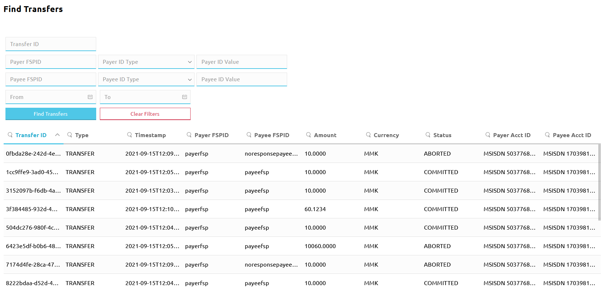
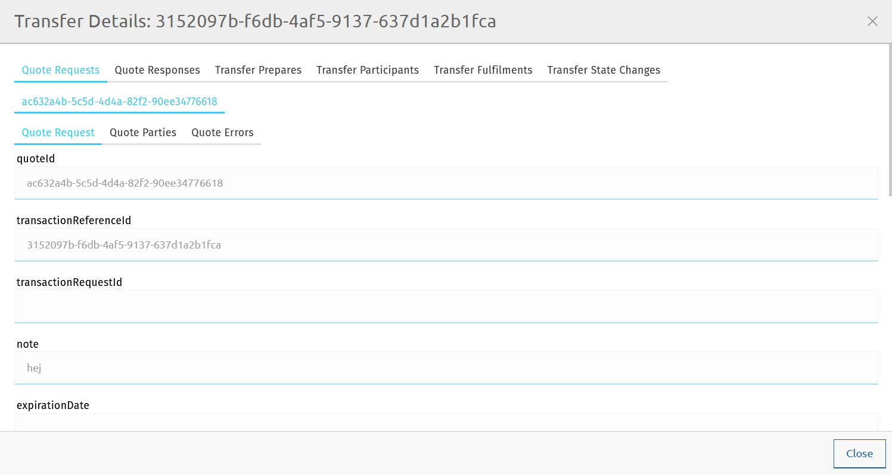
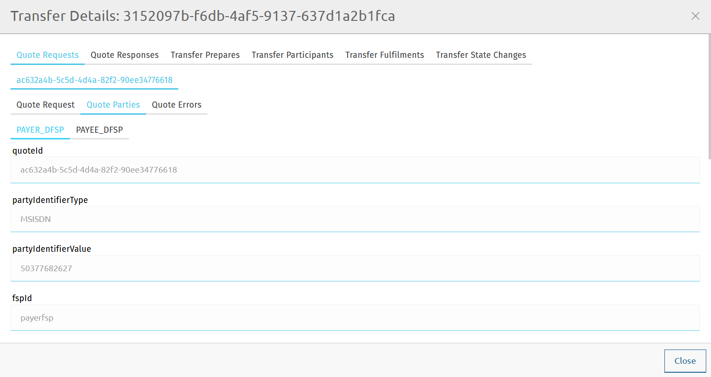
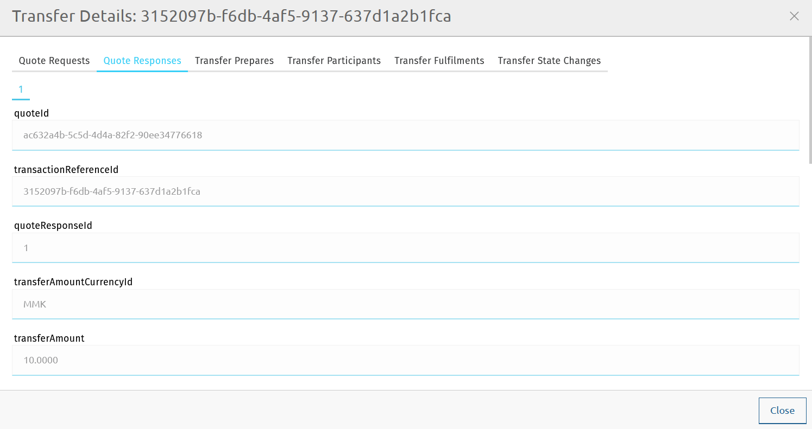
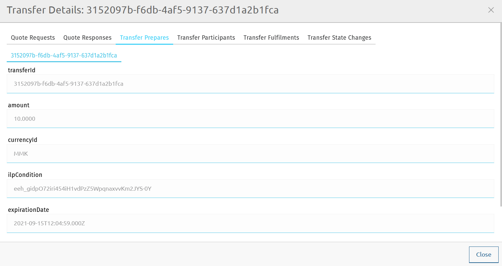
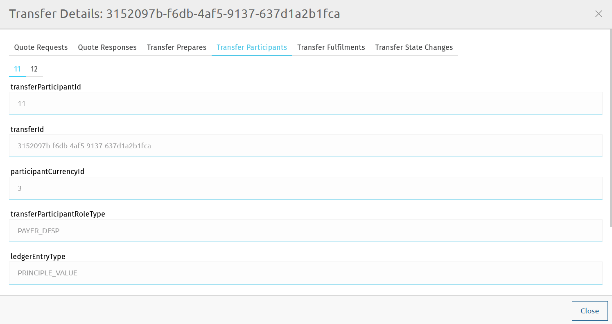
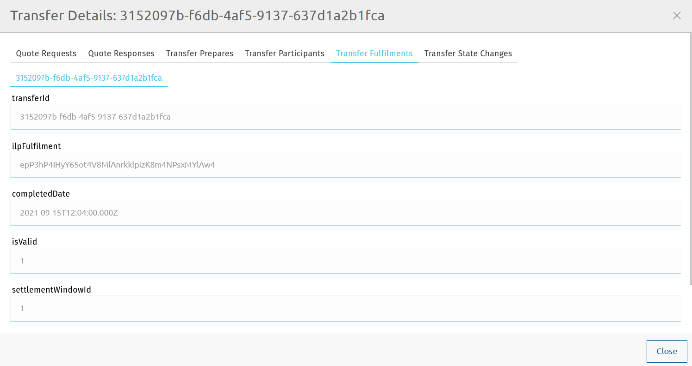
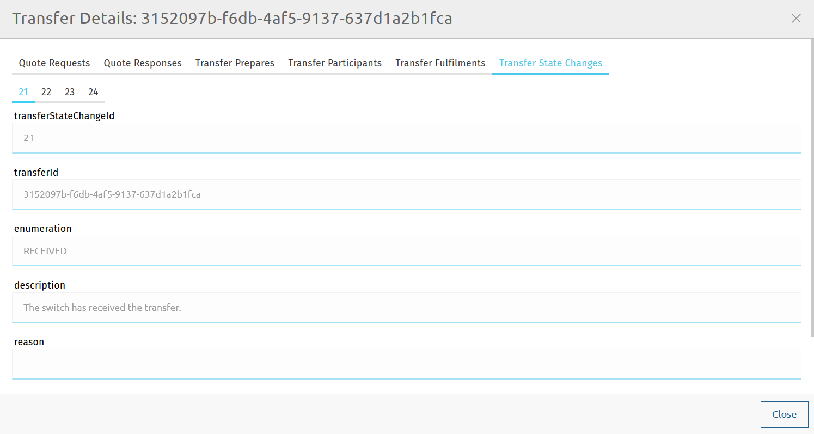

# Recherche de données de transfert

Le Finance Portal fournit une page de recherche de transferts, qui vous permet de trouver des données de transfert en fonction des identifiants DFSP, des identifiants d'utilisateur final ou des identifiants de transfert. Cela est utile lors de la résolution de problèmes.

::: tip REMARQUE
Les valeurs affichées sur la page **Find Transfers** proviennent de la base de données central-ledger du Hub.
:::

## Recherche de transferts

Pour rechercher des transferts, effectuez les étapes suivantes :

1. Allez dans **Transfers** > **Find Transfers**. La page **Find Transfers** s'affiche. \

1. Utilisez les filtres de recherche pour spécifier ce que vous recherchez. Vous pouvez remplir n'importe quel nombre de champs de recherche, dans n'importe quelle combinaison.
    * **Transfer ID** : Saisissez un `transferId` complet ou un fragment d'un `transferId`.
    * **Payer FSP ID** : Saisissez le `fspId` complet ou un fragment du `fspId` du DFSP Payeur.
    * **Payer ID Type** : À l'aide de la liste déroulante, sélectionnez le type d'identifiant utilisé pour identifier le Payeur (par exemple, **MSISDN** ou **ACCOUNT_ID**).
    * **Payer ID Value** : Saisissez l'identifiant complet ou un fragment de l'identifiant utilisé pour identifier le Payeur (par exemple, un numéro de téléphone ou un numéro de compte bancaire).
    * **Payee FSPID** : Saisissez le `fspId` complet ou un fragment du `fspId` du DFSP Bénéficiaire.
    * **Payee ID Type** : À l'aide de la liste déroulante, sélectionnez le type d'identifiant utilisé pour identifier le Bénéficiaire.
    * **Payee ID Value** : Saisissez l'identifiant complet ou un fragment de l'identifiant utilisé pour identifier le Bénéficiaire.
    * **From** et **To** : Saisissez l'heure de début et l'heure de fin de la plage horaire pendant laquelle le ou les transferts que vous recherchez ont eu lieu.
1. Une fois vos filtres de recherche définis, cliquez sur **Find Transfers**. La liste des résultats de recherche correspondant aux critères s'affiche.

Utilisez les boutons de navigation de page en bas de l'écran pour naviguer entre les pages de résultats de recherche.

Vous pouvez supprimer tous les filtres que vous avez appliqués et recommencer votre recherche à zéro en cliquant sur **Clear Filters**.

Les résultats de recherche sont affichés en colonnes. Toutes les colonnes sont triables :

* Cliquez sur un en-tête de colonne pour modifier l'ordre de tri des valeurs affichées dans la colonne.
* Cliquez sur l'icône de loupe dans l'en-tête de colonne et saisissez une valeur que vous recherchez.

::: tip
Le nombre total de transferts retournés est limité à mille (1000) (ceci pour limiter la charge sur le backend). Si vous ne parvenez pas à trouver le transfert que vous recherchez parmi les mille premiers résultats, commencez à affiner votre recherche en utilisant les filtres de recherche. \
 \
Si votre recherche retourne plus de cinq cents (500) résultats, la page affichera un message d'information pour que vous sachiez que vous ne voyez pas nécessairement tous les résultats correspondant à vos critères de recherche initiaux et que vous devriez affiner davantage.
:::

Les détails suivants sont affichés pour un transfert :

::: tip REMARQUE
Les transferts sans devis (c'est-à-dire les transferts « ajout/retrait de fonds » et les transferts de règlement) n'afficheront des détails que pour les champs suivants : **Transfer ID**, **Timestamp**, **Amount**, **Currency**, **Status**.
:::

* **Transfer ID** : L'identifiant unique du transfert (correspond à `transferId`).
* **Type** : Le type de transfert (correspond à `transactionType` dans Payment Manager et `transactionScenario` dans l'API Mojaloop FSPIOP).
* **Timestamp** : La date et l'heure de création de la demande de transfert, sous forme d'horodatage au format [ISO-8601](https://www.iso.org/iso-8601-date-and-time-format.html).
* **Payer FSPID** : Le `fspId` du DFSP Payeur.
* **Payee FSPID** : Le `fspId` du DFSP Bénéficiaire.
* **Amount** : Le montant du transfert.
* **Currency** : La devise du transfert.
* **Status** : L'état du transfert (correspond à `transferState` dans Payment Manager et l'API Mojaloop FSPIOP).
* **Payer Acct ID** : Le type d'identifiant et la valeur d'identifiant du compte du Payeur.
* **Payee Acct ID** : Le type d'identifiant et la valeur d'identifiant du compte du Bénéficiaire.

## Détails du transfert

Pour obtenir plus de détails sur un résultat de recherche particulier, cliquez sur son entrée dans la liste des résultats de recherche. Une fenêtre contextuelle **Transfer Details** apparaît. Cette section fournit des informations sur les détails affichés pour un transfert.

### Demandes de devis

L'onglet **Quote Requests** affiche le `quoteId` et des informations supplémentaires dans des sous-onglets.

#### Sous-onglet Quote Request

Le sous-onglet **Quote Request** affiche les détails suivants concernant la demande de devis :

* **quoteId** : L'identifiant unique du devis, décidé par le DFSP Payeur.
* **transactionReferenceId** : Correspond au `transactionId` spécifié dans la demande de devis.
* **transactionRequestId** : Facultatif. Identifiant commun entre les DFSP pour l'objet de demande de transaction, décidé par le DFSP Bénéficiaire.
* **note** : Un mémo facultatif attaché au transfert.
* **expirationDate** : Une date d'expiration facultative de la demande de devis, sous forme d'horodatage au format [ISO-8601](https://www.iso.org/iso-8601-date-and-time-format.html).
* **amount** : Le montant pour lequel le devis est demandé.
* **createdDate** : La date et l'heure de création de la demande de devis, sous forme d'horodatage au format [ISO-8601](https://www.iso.org/iso-8601-date-and-time-format.html).
* **transactionInitiator** : Indique si l'initiateur du transfert est le **PAYER** (Payeur) ou le **PAYEE** (Bénéficiaire).
* **transactionInitiatorType** : Indique le type de l'initiateur :
    * **CONSUMER** : Le consommateur est l'initiateur de la transaction. Par exemple : transfert de personne à personne ou remboursement de prêt depuis un portefeuille.
    * **AGENT** : L'agent est l'initiateur de la transaction. Par exemple : remboursement de prêt via un agent.
    * **BUSINESS** : L'entreprise est l'initiateur de la transaction. Par exemple : décaissement de prêt.
    * **DEVICE** : L'appareil est l'initiateur de la transaction. Par exemple : paiement marchand initié par le commerçant et autorisé sur un TPE.
* **transactionScenario** : Indique le scénario de transaction (correspond à `transactionType` dans Payment Manager).
* **transactionSubScenario** : Indique le sous-scénario de transaction défini par le schéma.
* **balanceOfPaymentsType** : Le code BdP tel que défini dans [le Système de codification de la balance des paiements du FMI](https://www.imf.org/external/np/sta/bopcode/).
* **amountType** : **SEND** pour le montant envoyé, **RECEIVE** pour le montant reçu.
* **currency** : La devise du montant pour lequel le devis est demandé. Un code alphabétique de trois lettres conforme à [ISO 4217](https://www.iso.org/iso-4217-currency-codes.html).

#### Sous-onglet Quote Parties

Le sous-onglet **Quote Parties** affiche les détails suivants concernant le DFSP Payeur et le DFSP Bénéficiaire :

* **quoteId** : L'identifiant unique du devis, décidé par le DFSP Payeur.
* **partyIdentifierType** : Le type d'identifiant utilisé pour identifier la partie (par exemple, **MSISDN** ou **ACCOUNT_ID**).
* **partyIdentifierValue** : La valeur de l'identifiant utilisé pour identifier la partie (par exemple, un numéro de téléphone ou un numéro de compte bancaire).
* **fspId** : L'identifiant unique du DFSP enregistré dans le Hub (correspond à `fspId`) - tel que fourni dans le devis.
* **merchantClassificationCode** : Utilisé lorsque le Bénéficiaire est un commerçant acceptant les paiements marchands.
* **partyName** : Le nom d'affichage de la partie.
* **transferParticipantRoleType** : Le rôle que le DFSP joue dans le transfert.
* **ledgerEntryType** : Le type d'écriture financière que cette partie présente — valeur principale (c'est-à-dire le montant d'argent que le Payeur souhaite que le Bénéficiaire reçoive) ou commission d'interchange.
* **amount** : Le montant pour lequel le devis est demandé.
* **currency** : La devise du montant pour lequel le devis est demandé. Un code alphabétique de trois lettres conforme à [ISO 4217](https://www.iso.org/iso-4217-currency-codes.html).
* **createdDate** : La date et l'heure de création de la demande de devis, sous forme d'horodatage au format [ISO-8601](https://www.iso.org/iso-8601-date-and-time-format.html).
* **partySubIdOrTypeId** : Un sous-identifiant ou sous-type pour la partie.
* **participant** : Référence au `fspId` résolu (si fourni/connu).

#### Sous-onglet Quote Errors

Le sous-onglet **Quote Errors** n'affiche des informations que s'il y a eu une erreur lors de l'étape des devis.

### Réponses aux devis

L'onglet **Quote Responses** affiche les détails concernant la réponse au devis :

* **quoteId** : L'identifiant unique du devis, décidé par le DFSP Payeur.
* **transactionReferenceId** : Correspond au `transactionId` spécifié dans la demande de devis.
* **quoteResponseId** : L'identifiant unique de la réponse au devis.
* **transferAmountCurrencyId** : La devise du montant du transfert. Un code alphabétique de trois lettres conforme à [ISO 4217](https://www.iso.org/iso-4217-currency-codes.html).
* **transferAmount** : Le montant que le DFSP Payeur doit transférer au DFSP Bénéficiaire.
* **payeeReceiveAmountCurrencyId** : La devise du montant que le Bénéficiaire doit recevoir dans la transaction de bout en bout.
* **payeeReceiveAmount** : Le montant que le Bénéficiaire doit recevoir dans la transaction de bout en bout.
* **payeeFspFeeCurrencyId** : La devise de la part des frais de transaction du DFSP Bénéficiaire (le cas échéant). Un code alphabétique de trois lettres conforme à [ISO 4217](https://www.iso.org/iso-4217-currency-codes.html).
* **payeeFspFeeAmount** : La part des frais de transaction du DFSP Bénéficiaire (le cas échéant).
* **payeeFspCommissionCurrencyId** : La devise de la commission de transaction du DFSP Bénéficiaire (le cas échéant). Un code alphabétique de trois lettres conforme à [ISO 4217](https://www.iso.org/iso-4217-currency-codes.html).
* **payeeFspCommissionAmount** : La commission de transaction du DFSP Bénéficiaire (le cas échéant).
* **ilpCondition** : La condition ILP qui doit être jointe au transfert par le côté Payeur.
* **responseExpirationDate** : La date d'expiration du devis sous forme d'horodatage au format [ISO-8601](https://www.iso.org/iso-8601-date-and-time-format.html).
* **isValid** : Un indicateur indiquant si la réponse au devis a passé la validation de la demande et les vérifications de doublons.
* **createdDate** : La date et l'heure de création de la demande de devis, sous forme d'horodatage au format [ISO-8601](https://www.iso.org/iso-8601-date-and-time-format.html).
* **ilpPacket** : Le paquet ILP retourné par le côté Bénéficiaire en réponse à la demande de devis.

### Préparations de transfert

L'onglet **Transfer Prepares** affiche les détails concernant la demande de transfert :

* **transferId** : L'identifiant unique du transfert.
* **amount** : Le montant que le DFSP Payeur doit transférer au DFSP Bénéficiaire.
* **currencyId** : La devise du montant du transfert. Un code alphabétique de trois lettres conforme à [ISO 4217](https://www.iso.org/iso-4217-currency-codes.html).
* **ilpCondition** : La condition ILP qui doit être remplie pour valider le transfert.
* **expirationDate** : La date d'expiration du transfert sous forme d'horodatage au format [ISO-8601](https://www.iso.org/iso-8601-date-and-time-format.html).
* **createdDate** : La date et l'heure de création de la demande de transfert, sous forme d'horodatage au format [ISO-8601](https://www.iso.org/iso-8601-date-and-time-format.html).

### Participants au transfert

L'onglet **Transfer Participants** affiche les détails suivants concernant les participants au transfert :

* **transferParticipantId** : L'identifiant interne du participant au schéma (DFSP) pour lequel le rapport est demandé, correspond à `participantId` tel qu'enregistré dans le Hub.
* **transferId** : L'identifiant unique du transfert.
* **participantCurrencyId** : La devise dans laquelle le participant (DFSP) effectue ses transactions. Un code alphabétique de trois lettres conforme à [ISO 4217](https://www.iso.org/iso-4217-currency-codes.html).
* **transferParticipantRoleType** : Le rôle que le DFSP joue dans le transfert.
* **ledgerEntryType** : Le type d'écriture financière que cette partie présente — valeur principale (c'est-à-dire le montant d'argent que le Payeur souhaite que le Bénéficiaire reçoive) ou commission d'interchange.
* **amount** : Le montant du transfert.
* **createdDate** : La date et l'heure de création de la demande de transfert, sous forme d'horodatage au format [ISO-8601](https://www.iso.org/iso-8601-date-and-time-format.html).

### Exécutions de transfert

L'onglet **Transfer Fulfilments** affiche les détails suivants concernant la réponse au transfert :

* **transferId** : L'identifiant unique du transfert.
* **ilpFulfilment** : L'exécution de la condition ILP spécifiée dans la demande de transfert.
* **completedDate** : La date et l'heure d'achèvement du transfert, sous forme d'horodatage au format [ISO-8601](https://www.iso.org/iso-8601-date-and-time-format.html).
* **isValid** : Un indicateur indiquant si l'exécution du transfert est valide.
* **settlementWindowId** : L'identifiant de la fenêtre de règlement à laquelle ce transfert a été assigné.
* **createdDate** : La date et l'heure de création de la réponse au transfert, sous forme d'horodatage au format [ISO-8601](https://www.iso.org/iso-8601-date-and-time-format.html).

### Changements d'état du transfert

L'onglet **Transfer State Changes** affiche les détails suivants concernant les états par lesquels passe un transfert :

* **transferStateChangeId** : L'identifiant unique de l'état du transfert.
* **transferId** : L'identifiant unique du transfert.
* **enumeration** : L'état du transfert (correspond à `transferState` dans Payment Manager et l'API Mojaloop FSPIOP).
* **description** : La description de la signification de l'état.
* **reason** : La raison pour laquelle le transfert est passé dans un état particulier.
* **createdDate** : La date et l'heure auxquelles le transfert a atteint un état particulier, sous forme d'horodatage au format [ISO-8601](https://www.iso.org/iso-8601-date-and-time-format.html).
