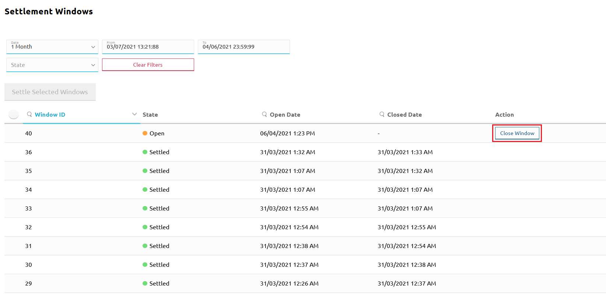
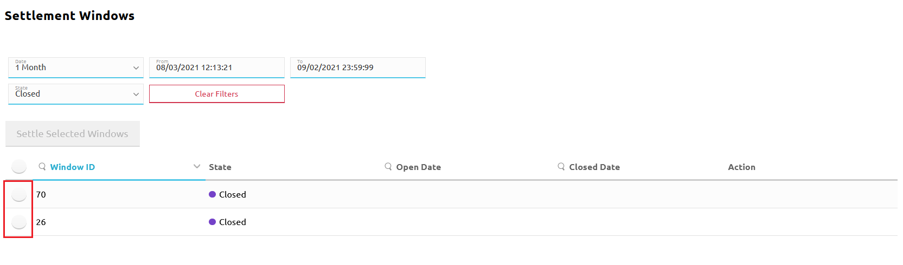
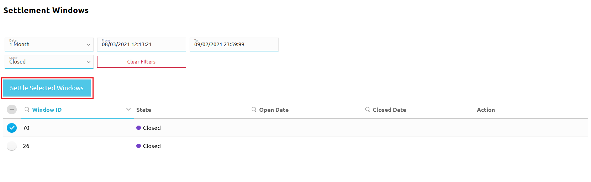
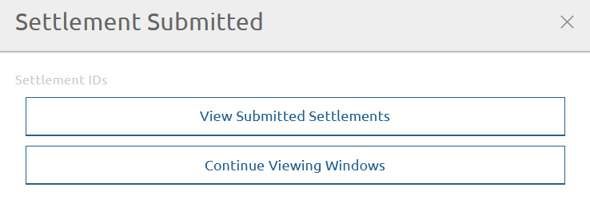
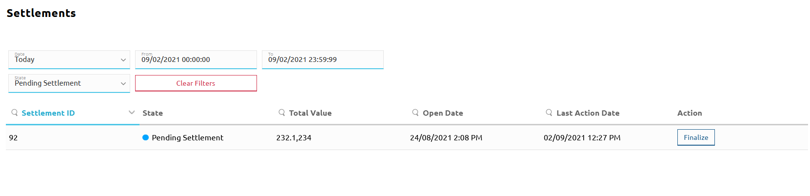
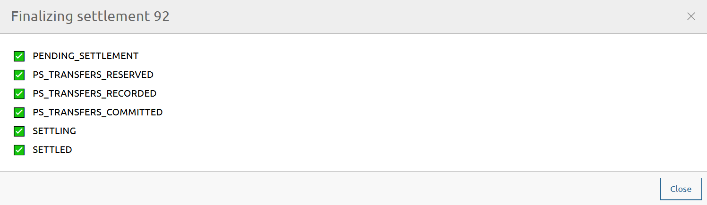

# Règlement

1. [Fermez la fenêtre de règlement](#closing-a-settlement-window) que vous souhaitez régler.
1. [Réglez la ou les fenêtres fermées de votre choix](#settling-a-closed-settlement-window). Cela crée un nouveau règlement.
1. Envoyez les rapports de règlement aux DFSP et à la banque de règlement, puis obtenez une confirmation de la banque attestant qu'elle a transféré les fonds conformément au rapport.
1. [Finalisez le nouveau règlement](#finalizing-a-settlement) créé à l'étape 2.

Cette section décrit les étapes du processus (étapes 1, 2 et 4) que vous effectuez via le portail.

## Fermeture d'une fenêtre de règlement

Pour fermer une fenêtre de règlement ouverte, effectuez les étapes suivantes :

1. Allez dans **Settlement** > **Settlement Windows**. La page **Settlement Windows** s'affiche.
1. Trouvez la fenêtre de règlement que vous recherchez, [en utilisant les filtres de recherche](managing-windows.md).
1. La fenêtre ouverte aura un bouton **Close Window** affiché à côté d'elle dans la colonne **Action**. Cliquez sur le bouton **Close Window**.

La fermeture d'une fenêtre ouvrira automatiquement une nouvelle fenêtre avec l'état **Open**.

## Règlement d'une fenêtre de règlement fermée

Pour régler une ou plusieurs fenêtres de règlement, effectuez les étapes suivantes :

1. Allez dans **Settlement** > **Settlement Windows**. La page **Settlement Windows** s'affiche.
1. Trouvez la fenêtre de règlement que vous recherchez, [en utilisant les filtres de recherche](managing-windows.md). La fenêtre de règlement doit être à l'état **Closed**.
1. Cliquez sur le sélecteur de fenêtre à côté de la ou des fenêtres de règlement que vous souhaitez régler. \
\
 \
\
Cela active le bouton **Settle Selected Windows**. Cliquez sur le bouton **Settle Selected Windows**. \
\
 
1. Une fenêtre **Settlement Submitted** apparaît, où vous avez les options suivantes :

* Afficher les règlements soumis
* Continuer à afficher les fenêtres \
\
 \
\
Si vous souhaitez afficher le nouveau règlement que vous venez de créer, cliquez sur le bouton **View Submitted Settlements**. Cela vous amène à la page **Settlements**, où vous pouvez rechercher le nouveau règlement, [en utilisant les filtres de recherche](checking-settlement-details.md). Le règlement sera à l'état **Pending Settlement**.

## Finalisation d'un règlement

Pour finaliser le règlement, effectuez les étapes suivantes :

**Prérequis :**

* La banque de règlement a confirmé que toutes les Positions MLNS des DFSP ont été réglées.

**Étapes :**

1. Allez dans **Settlement** > **Settlements**. La page **Settlements** s'affiche.
1. Trouvez le règlement que vous recherchez, en utilisant les [filtres de recherche](checking-settlement-details.md). Le règlement doit être à l'état **Pending Settlement**. \
\
 
1. Cliquez sur le bouton **Finalize** à côté du règlement. Une fenêtre de statut apparaît et affiche les états du règlement avec des coches ajoutées au fur et à mesure que le processus de règlement progresse. \
\
Lorsque le règlement est finalisé, vous verrez tous les états affichés avec des coches à côté. Le dernier état indiquera **State: SETTLED.** De plus, le bouton **Close** sera activé, vous permettant de revenir à la page **Settlements**. \
\
 
1. De retour sur la page **Settlements**, en recherchant le règlement, vous devriez voir l'état du règlement affiché comme **Settled**.

::: tip
Si l'état du règlement est autre que **Settled**, cela signifie que le règlement ne s'est pas terminé pour une raison quelconque. Cliquez à nouveau sur **Finalize** pour terminer le processus de règlement inachevé.
:::
