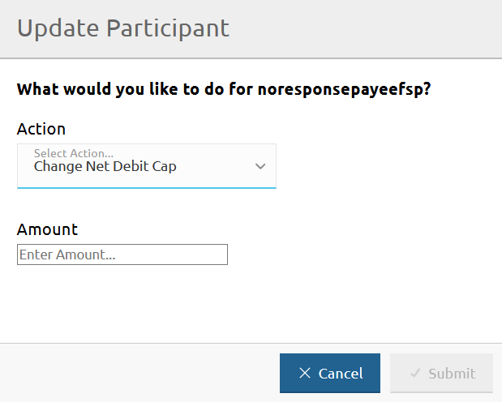
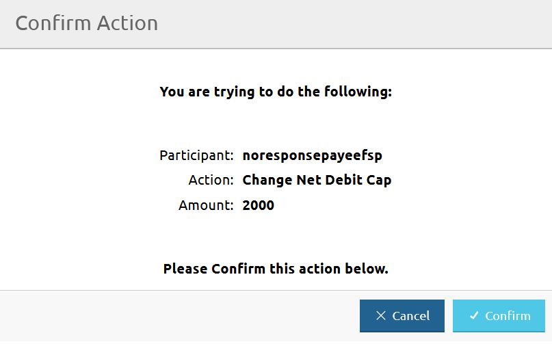

# Mise à jour du Net Debit Cap d'un DFSP

La page **DFSP Financial Positions** vous permet de mettre à jour le Net Debit Cap (NDC) d'un DFSP.

Pour accéder à la page **DFSP Financial Positions**, allez dans **Participants** > **DFSP Financial Positions**.

Pour mettre à jour le Net Debit Cap d'un DFSP, effectuez les étapes suivantes :

1. Cliquez sur le bouton **Update** à côté du DFSP pour lequel vous souhaitez mettre à jour le NDC. \

La fenêtre **Update Participant** apparaît.
1. Sélectionnez **Change Net Debit Cap** dans le menu déroulant **Action**. \

1. Saisissez le nouveau montant du NDC dans le champ **Amount**. \

1. Cliquez sur **Submit**.
1. En cliquant sur **Submit**, une fenêtre de confirmation apparaît vous demandant de confirmer l'action. \

1. Cliquez sur **Confirm**. \
En cliquant sur **Confirm**, la valeur **NDC** sur la page **DFSP Financial Positions** est mise à jour et affiche le nouveau montant du NDC.
