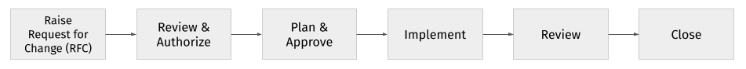
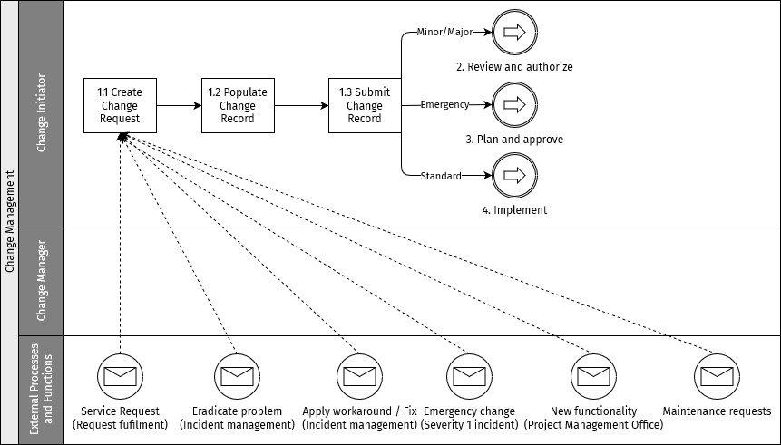
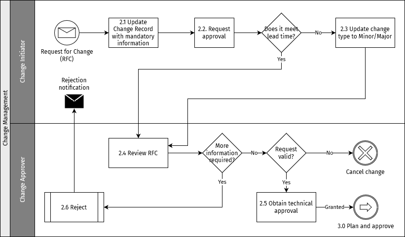
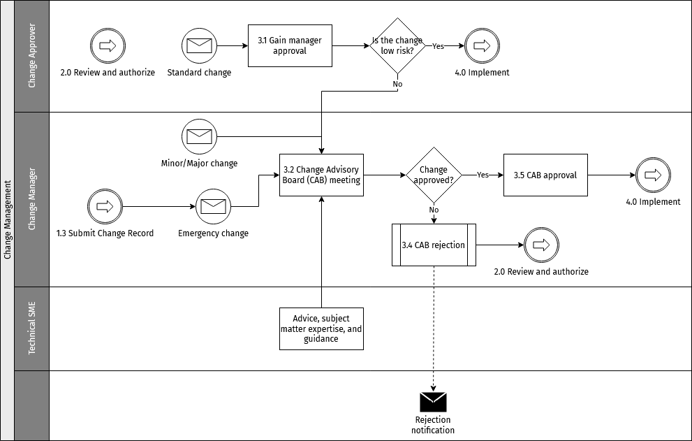
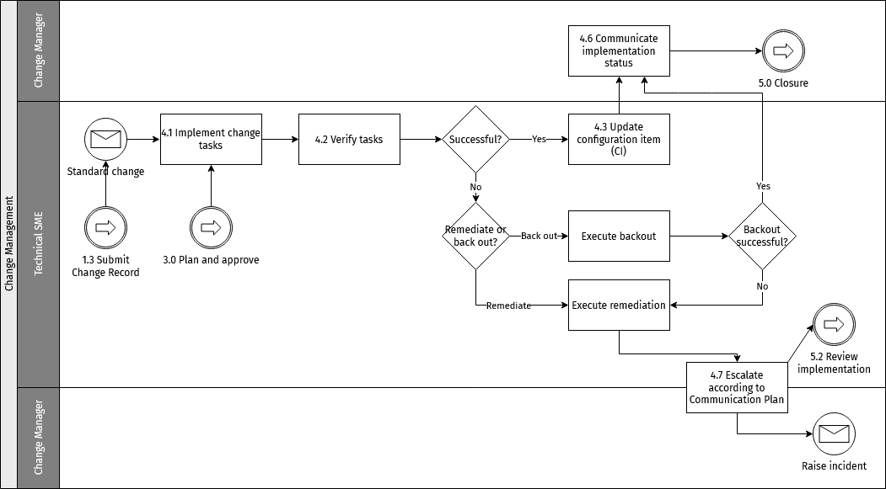
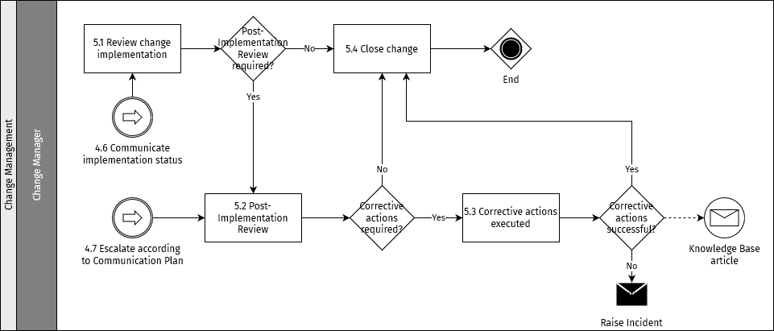

# Gestion des changements

L'objectif du processus de gestion des changements est de contrôler le cycle de vie de tous les changements, permettant d'effectuer des modifications avec un minimum de perturbation des services informatiques.

::: tip NOTE
Les processus décrits dans cette section représentent les bonnes pratiques et servent de recommandations pour les organisations remplissant un rôle d'opérateur du Hub.
:::

## Objectifs

Les objectifs de la gestion des changements sont de :

* Répondre aux exigences métier changeantes tout en maximisant la valeur et en réduisant les incidents et les reprises de travail
* Répondre aux demandes de changement (RFC) qui aligneront les services sur les besoins métier
* S'assurer que les changements sont enregistrés et évalués, et que les changements autorisés sont gérés de manière contrôlée
* Optimiser le risque métier global

## Périmètre

Le périmètre de la gestion des changements doit inclure les changements apportés à toutes les architectures, processus, outils, métriques et documentation, ainsi que les changements apportés à tous les éléments de configuration (CI) tout au long du cycle de vie du service.

Tous les changements doivent être enregistrés et gérés dans un environnement contrôlé pour tous les CI. Il peut s'agir d'actifs physiques tels que des serveurs ou des réseaux, d'actifs virtuels tels que des serveurs virtuels ou du stockage, ou d'autres types d'actifs tels que des accords ou des contrats.

La gestion des changements n'est pas responsable de la coordination de tous les processus de gestion des services pour assurer la mise en œuvre fluide des projets.

## Rôles et responsabilités

Les rôles énumérés ci-dessous indiquent certaines des parties prenantes essentielles nécessaires pour rendre le processus de gestion des changements efficace.

### Responsable des changements

Le responsable des changements agit en tant que chef de file, responsable du processus global de gestion des changements.

Les principales responsabilités du responsable des changements sont :

* Piloter l'efficience et l'efficacité du processus de gestion des changements
* Produire des informations de gestion
* Surveiller l'efficacité de la gestion des changements et formuler des recommandations d'amélioration
* Adhésion au processus de gestion des changements
* Planifier et gérer le support des outils et processus de gestion des changements
* Vérifier que les RFC sont correctement complétées et attribuées aux autorités de changement (le cas échéant)
* Communiquer les décisions des autorités de changement aux parties concernées
* Activités de surveillance et de révision
* Publier le calendrier des changements et les interruptions de service prévues
* Mener des revues post-implémentation pour valider les résultats des demandes de changement
* Déterminer la satisfaction métier concernant les demandes de changement

### Coordinateur des changements

Les coordinateurs des changements sont des membres du personnel de support qui gèrent les détails d'une demande de changement.

Les responsabilités d'un coordinateur des changements comprennent :

* Rassembler les informations appropriées en fonction du type de changement faisant l'objet d'une investigation
* Associer les éléments de configuration, incidents et services connexes à la demande de changement
* Fournir des mises à jour de statut aux demandeurs
* Examiner les plans et calendriers de changement. Les activités de planification comprennent la programmation de la demande de changement, l'évaluation des risques et de l'impact, la création de plans, la définition et le séquencement des tâches nécessaires à l'accomplissement de la demande de changement, et la planification des personnes et des ressources pour chaque tâche.
* Examiner toutes les tâches terminées. À l'étape de [mise en œuvre](#step-4-implement), au moins une tâche liée à la demande de changement est en cours.
* Mener des revues post-implémentation pour valider les résultats de la demande de changement
* Déterminer la satisfaction du demandeur concernant la demande de changement

### Initiateur du changement

Un initiateur du changement est une personne qui initie ou demande un changement, depuis un rôle métier ou technique. Différentes personnes peuvent initier un changement, ce rôle n'est pas exclusif à une seule personne. L'initiateur/demandeur du changement est tenu de fournir toutes les informations et justifications nécessaires pour le changement.

Les autres responsabilités d'un initiateur du changement comprennent :

* Compléter et soumettre une proposition de changement (si nécessaire)
* Compléter et soumettre une demande de changement (RFC)
* Assister aux réunions du comité consultatif des changements (CAB) pour fournir des informations complémentaires
* Examiner les changements lorsque cela est demandé par la gestion des changements

### Exécutant du changement

Il s'agit de la personne désignée comme propriétaire de la demande de changement tout au long du cycle de vie de la demande. La mise en œuvre d'un changement nécessite une approbation de type réalisateur/vérificateur, c'est-à-dire que tous les changements nécessitent une personne pour effectuer le changement et une autre pour le valider.

Les responsabilités d'un exécutant du changement comprennent :

* Assurer la liaison avec le demandeur du changement pour les questions et problèmes métier et techniques, le cas échéant
* Créer une RFC et mettre à jour son statut chaque fois que nécessaire
* Vérifier et décider d'une date de mise en œuvre, en s'assurant qu'elle n'entre pas en conflit avec d'autres activités, par exemple, les délais, les fenêtres de changement, etc.
* Évaluer et gérer les risques impliqués pendant le cycle de vie de la demande de changement
* Tester et mettre en œuvre le changement
* Coordonner et communiquer avec toute autre équipe impactée avant de soumettre le changement (en l'absence du coordinateur des changements)
* Une fois le changement approuvé, créer un cas de remédiation pour le changement programmé
* Exécuter le changement à la date et à l'heure programmées
* Fournir le statut de clôture après l'achèvement réussi
* Documenter la procédure de changement après sa mise en œuvre

### Approbateur du changement

Il s'agit d'une personne qui fournit l'approbation de premier niveau à une demande de changement avant qu'elle ne passe en revue au comité consultatif des changements. Les approbateurs des changements sont définis pour différents changements du Hub, ce qui signifie que ce rôle peut être occupé par différentes personnes à divers niveaux hiérarchiques du cadre de gestion des changements, chacune avec son propre domaine où elle agit en tant qu'approbateur.

Les responsabilités d'un approbateur du changement comprennent :

* Examiner toutes les RFC soumises par les initiateurs/demandeurs de changement
* S'assurer que la demande de changement a atteint le niveau de préparation nécessaire pour justifier une décision du responsable des changements et du CAB
* Examiner et commenter le contenu de l'enregistrement de changement, à savoir : plan de changement, mise en œuvre, plan de test et de remédiation, et calendrier
* Accorder l'approbation une fois satisfait que tous les critères pertinents ont été remplis et les préoccupations traitées OU rejeter l'approbation en donnant des préoccupations et réserves claires concernant le contenu de l'enregistrement de changement
* Le résultat des changements échoués lorsque le résultat négatif est le résultat d'une approbation non déterminée

### Expert technique (SME)

L'expert technique en la matière (SME) est une personne qui fait autorité dans un domaine ou sujet technique particulier. En relation avec la gestion des changements, le SME est responsable de :

* Fournir les plans détaillés de mise en œuvre, de test et de remédiation
* Assister à la réunion du CAB pour répondre aux questions et préoccupations concernant le changement auprès des approbateurs et de la gestion des changements (si invité)
* La mise en œuvre des tâches de changement et la mise à jour des enregistrements pertinents dans l'outil de gestion des changements en ce qui concerne le statut de mise en œuvre
* Examiner et retravailler un changement comme demandé, et contribuer à la revue d'un changement post-implémentation

### Membre du CAB

Le comité consultatif des changements (CAB) implique des membres de différents domaines, y compris la sécurité de l'information, les opérations, le développement, les réseaux, le Service Desk et les relations commerciales, entre autres. Un membre du CAB a les responsabilités suivantes :

* Diffuser les RFC dans son domaine de responsabilité et coordonner les retours
* Examiner les RFC et recommander si elles doivent être autorisées
* Examiner les changements réussis, échoués et non autorisés
* Examiner le calendrier des changements et les interruptions de service prévues

### Président du CAB

Le président du CAB est responsable de :

* Convoquer et présider les réunions du CAB
* Superviser le processus global de gestion des changements
* S'assurer que le CAB remplit la charte sur les politiques et procédures relatives aux changements

## Types de changements

Le processus de gestion des changements traite les types de changements suivants.

### Changements standard

Un changement standard est un changement apporté à un service ou à un autre élément de configuration qui a été pré-autorisé et n'a donc pas besoin de passer par le processus d'approbation. Pour être considéré comme candidat à devenir un changement standard, au moins trois changements mineurs réussis doivent avoir été mis en œuvre. Une demande de changement standard doit ensuite être soumise au comité consultatif des changements pour approbation.

Le risque d'un changement standard doit être faible et bien compris, les tâches doivent être bien connues, documentées et éprouvées, et il doit y avoir un déclencheur défini pour l'initier, tel qu'un événement ou une demande de service.

Exemples de changements standard : mise à niveau du système d'exploitation (OS), déploiement de correctifs, etc.

### Changements mineurs

Un changement mineur est un changement non trivial qui a un impact faible et un risque faible. Ce sont des changements non triviaux qui ne se produisent pas fréquemment mais qui passent néanmoins par chaque étape du cycle de vie du changement, y compris l'approbation du CAB. Il est important de documenter les informations pertinentes pour référence future. Au fil du temps, un changement mineur peut être converti en changement standard.

Exemples de changements mineurs : modifications de site web, améliorations de performance.

Pour qu'un changement soit classé comme changement mineur, il doit avoir un délai de préparation inférieur à 3 jours.

### Changements majeurs

Un changement majeur est un changement à haut risque et à fort impact qui pourrait interrompre les environnements de production en direct s'il n'est pas correctement planifié. L'évaluation du changement est cruciale pour déterminer le calendrier et le flux d'approbation. Un changement majeur nécessite l'approbation de la direction en plus de l'approbation du CAB. La demande de changement (RFC) d'un changement majeur doit contenir une proposition détaillée sur l'analyse coût-bénéfice, l'analyse risque-impact et les implications financières, le cas échéant.

En pratique, tous les changements qui impliquent un temps d'arrêt, en particulier un temps d'arrêt qui affecte l'intégration des DFSP et les activités de test sur les environnements inférieurs, doivent être classés comme changements majeurs et doivent être examinés par le CAB. Ces changements doivent être mis en œuvre en coordination avec le chef de projet technique.

Pour qu'un changement soit classé comme changement majeur, il doit avoir un délai de préparation de 5 jours ou plus.

### Changements d'urgence

Un changement d'urgence est un changement qui doit être effectué dès que possible. Un changement d'urgence ne sera accepté que s'il est lié à un incident de sévérité 1, qui a un ticket S1 correspondant dans l'outil Service Desk. Le responsable de service initiera l'ouverture d'un changement d'urgence et demandera à l'expert technique de le créer.

### Résumé des délais de préparation et matrice d'approbation

<table>
<colgroup>
<col style="width: 33%" />
<col style="width: 33%" />
<col style="width: 33%" />
</colgroup>
<thead>
<tr class="header">
<th>Type de changement</th>
<th>Délai de mise en œuvre</th>
<th>Revue et approbation</th>
</tr>
</thead>
<tbody>
<tr class="odd">
<td>
Changement standard
</td>
<td>
3 jours ouvrés
</td>
<td>
Pré-approuvé
</td>
</tr>
<tr class="even">
<td>
Changement mineur
</td>
<td>
3 jours ouvrés
</td>
<td><ol type="1">
<li>
CAB
</li>
<li>
Approbateurs métier (le cas échéant)
</li>
</ol></td>
</tr>
<tr class="odd">
<td>
Changement majeur
</td>
<td>
5 jours ouvrés
</td>
<td><ol type="1">
<li>
CAB
</li>
<li>
Approbateurs métier (le cas échéant)
</li>
</ol></td>
</tr>
<tr class="even">
<td>
Changement d'urgence
</td>
<td>
Dès que possible
</td>
<td>
CAB d'urgence ou propriétaire métier
</td>
</tr>
</tbody>
</table>

## Comité consultatif des changements

Le comité consultatif des changements (CAB) soutient la gestion des changements dans l'évaluation, la priorisation et la programmation des changements. Le CAB doit avoir une visibilité complète sur tous les changements qui pourraient présenter un risque modéré ou plus élevé pour les services et les éléments de configuration. Il est important qu'au sein du CAB, il y ait des membres qui peuvent fournir une expertise adéquate pour évaluer tous les changements tant du point de vue métier que technique.

Il y a des membres permanents du CAB qui sont invités à toutes les réunions, mais pour s'assurer qu'il y a une compréhension claire de tous les besoins des parties prenantes, d'autres personnes seront invitées à participer en raison de leur expertise pour un changement qui doit être discuté. Le cas échéant, le fournisseur externe peut également être invité.

### Réunion du CAB

La réunion du CAB peut se tenir en personne ou par voie électronique. Il peut être plus pratique de tenir des réunions électroniques, cependant il peut être plus difficile de traiter les questions de cette façon. Ce sera la responsabilité du président du CAB de décider en fonction de la situation. Il est prévu que les réunions du CAB soient électroniques en raison des contraintes de délais.

Une réunion du CAB est une réunion formelle avec une structure désignée. Avant toute réunion du CAB, les changements à discuter doivent être distribués à tous les membres. Le président du CAB est responsable de s'assurer que cela est effectué, mais peut déléguer la tâche au vice-président du CAB ou à tout membre du CAB.

Tous les représentants des changements doivent assister ou envoyer un délégué. En cas d'absence, le changement ne sera pas discuté et donc pas approuvé. Tous les participants au CAB doivent venir à la réunion préparés à discuter des changements qu'ils représentent et à exprimer des opinions et avis basés sur le domaine particulier qu'ils représentent.

La réunion du CAB est le forum pour discuter des changements précédents, réussis et échoués, et examiner les leçons apprises.

Un ordre du jour pour la réunion du CAB doit être distribué avant la réunion. Le président du CAB est responsable de s'assurer que la structure est respectée, que les procès-verbaux sont pris et que les points d'action sont rassemblés pour être distribués après la réunion.

## Processus de gestion des changements

Cette section fournit un résumé des activités clés du processus de gestion des changements. Des instructions spécifiques sur la façon d'effectuer les activités du processus dans le contexte d'un service ou d'une fonction peuvent être fournies par des procédures opérationnelles locales dans un manuel de procédures.

Tous les changements doivent être créés dans l'outil Service Desk.

La figure suivante fournit un résumé de haut niveau du processus de gestion des changements avec les activités clés :

### Étape 1 : Créer une demande de changement (RFC)

#### Objectif

L'objectif de cette activité est de s'assurer que les types de demandes de changement sont respectés afin que le processus puisse répondre et gérer l'environnement tout en protégeant l'activité.

La figure suivante fournit un résumé de la première étape du processus de gestion des changements.

#### Prérequis

Les prérequis pour les changements doivent être alignés sur les exigences des mises en production telles que décrites dans le [processus de gestion des mises en production](release-management.md). Les éléments suivants doivent être clairement capturés dans l'outil Service Desk lors de la préparation de l'enregistrement de changement :

* Transfert de l'équipe concernée à l'équipe des opérations, y compris une revue complète des éléments suivants :
    * Ticket de changement ou enregistrement de changement : Raison du changement incluant l'impact, les risques, les limitations. La matrice de catégorisation du changement peut être la même que celle des incidents. Pour les détails sur la matrice de catégorisation des incidents, voir [Matrice de catégorisation des incidents](incident-management.md#incident-categorization-matrix).
    * Runbook de changement : Étapes requises pour effectuer le changement et annuler le changement si nécessaire
    * Résultats de tests de l'environnement inférieur : Preuve que le changement a été testé avec succès et ne cause pas de régression
    * Plan de test pour l'environnement supérieur : Quels tests spécifiques doivent être exécutés pour valider le changement
    * Toute la documentation connexe, y compris l'architecture, les diagrammes de flux, les informations de configuration/paramétrage, etc., a été mise à jour
* Tests pré-changement : Vérifier la stabilité de l'environnement en examinant les derniers résultats de test du parcours de référence (GP)
* Tests post-changement : Exécution des tests convenus pour valider le changement, et exécution des tests GP complets pour confirmer l'absence de régression sur l'environnement

#### Entrées

Les entrées de la RFC sont :

* Demandes de service
* Demandes de la [gestion des incidents](incident-management.md) pour appliquer des solutions de contournement/correctifs
* Demandes de la [gestion des incidents](incident-management.md) pour effectuer des changements d'urgence afin de résoudre les incidents de sévérité 1
* Demandes de nouvelles fonctionnalités du bureau de gestion de projet
* Demandes de maintenance pour changement

#### Sorties

Enregistrements de changement contenant les détails des RFC pour examen.

### Étape 2 : Examiner et autoriser

#### Objectif

Les changements sont examinés, et une étape d'approbation technique détermine si les informations minimales obligatoires requises sont capturées pour permettre une phase de planification et de programmation efficace.

La figure suivante fournit un résumé de l'étape « examiner et autoriser » du processus de gestion des changements.

#### Entrées

Enregistrement de changement pour examen.

#### Sorties

Enregistrement de changement avec approbation technique.

### Étape 3 : Planifier et approuver

#### Objectif

Les enregistrements de changement qualifiés qui ont passé une évaluation initiale dans les étapes précédentes du processus sont planifiés et approuvés. Le niveau de risque du changement orientera le chemin d'approbation.

La figure suivante fournit un résumé de l'étape « planifier et approuver » du processus de gestion des changements.

#### Entrées

Enregistrement de changement initialement autorisé.

#### Sorties

Enregistrement de changement entièrement planifié et approuvé.

### Étape 4 : Mettre en œuvre

#### Objectif

Les experts techniques concernés exécutent les activités planifiées, enregistrent tout écart et entreprennent des activités de remédiation le cas échéant, conformément aux plans de changement, pour mettre en œuvre les changements demandés.

La figure suivante fournit un résumé de l'étape « mettre en œuvre » du processus de gestion des changements.

#### Entrées

Enregistrement de changement approuvé.

#### Sorties

Changement mis en œuvre, changement échoué, changement annulé, changement échoué remédié.

### Étape 5 : Clôturer

L'activité finale du processus garantit que les changements soumis à une revue post-implémentation reçoivent l'attention nécessaire et que les activités de remédiation sont comprises et exécutées.

La figure suivante fournit un résumé de l'étape « clôturer » du processus de gestion des changements.

#### Entrées

Changements réussis, changements échoués, changements échoués avec remédiation.

#### Sorties

Changements clôturés.

## Gouvernance

**Nom de la réunion :** Réunion du comité consultatif des changements

**Fréquence de la réunion :** Hebdomadaire

**Objectif de la réunion :**

* Examiner et approuver/rejeter les changements proposés dans un contexte métier et technique
* Prioriser les changements proposés selon les besoins métier
* Effectuer une revue post-implémentation des changements terminés et déterminer/documenter les leçons apprises
* Examiner les changements précédemment approuvés mais non mis en œuvre dans la fenêtre de changement précédente et recommander des actions de suivi

**Président de la réunion (rôle dans le processus) :** Président du CAB

**Participants recommandés (rôles dans le processus) :**

* Membres permanents du CAB
* Représentants métier
* Initiateur/exécutant du changement

**Entrées :**

* Calendrier des changements
* Enregistrement de changement

**Sorties :**

* Approbation/rejet
* Enregistrements de changement mis à jour
* Points d'action

### Gouvernance pour la communication des changements

Les directives suivantes s'appliquent à la communication des changements :

* Les changements standard seront communiqués aux parties prenantes internes.
* Les changements majeurs, mineurs et d'urgence seront communiqués à toutes les parties prenantes métier et techniques concernées.
* Les changements seront communiqués après les approbations du CAB.
* Au début de la fenêtre de changement approuvée, une mise à jour par courriel et une notification Slack (ou similaire) doivent être envoyées aux parties prenantes concernées.
* À la fin de la fenêtre de changement approuvée, une mise à jour par courriel et une notification Slack (ou similaire) doivent être envoyées aux parties prenantes concernées.
* La communication externe aux clients (DFSP) et aux partenaires du Hub sera effectuée par le responsable de service.

La notification doit inclure les détails suivants :

* Titre et description du changement
* Impact sur l'activité
* Fenêtre de changement
* Contacts/Coordinateur des changements
