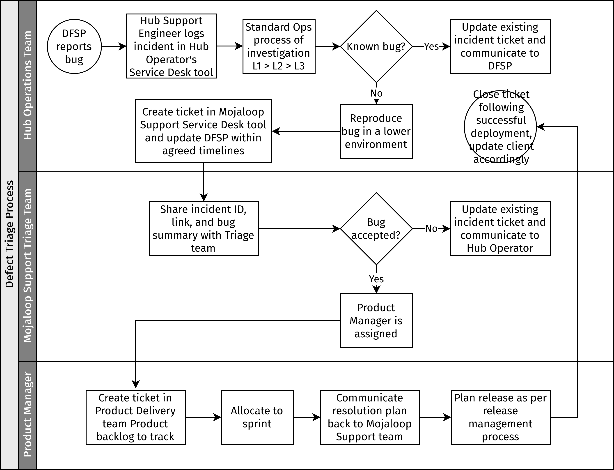

# Triage des défauts

L'objectif du processus de triage des défauts est de garantir que tous les bogues identifiés dans l'environnement de production de l'opérateur du Hub sont capturés, évalués et soumis à une équipe de support Mojaloop, une équipe dédiée à l'exécution des services de support pour les opérations techniques d'un Hub Mojaloop. Cette équipe peut être internalisée ou externalisée (ou même partiellement internalisée et partiellement externalisée), selon le niveau d'expertise ou de capacité au sein de l'organisation d'hébergement du schéma. S'il est décidé d'externaliser cette fonction, il existe des organisations au sein de la communauté Mojaloop qui fournissent différents niveaux de support en tant que service. (Pour plus d'informations et des recommandations, contactez la Fondation Mojaloop.)

::: tip NOTE 
Les processus décrits dans cette section représentent les bonnes pratiques et servent de recommandations pour les organisations remplissant un rôle d'opérateur du Hub. 
:::

::: tip NOTE
Le processus proposé ici s'applique aux bogues identifiés dans l'environnement de production de l'opérateur du Hub, et les nouvelles fonctionnalités ou améliorations sont hors de son périmètre. Cependant, pour faciliter les conversations commerciales, les opérateurs du Hub peuvent soumettre des demandes de nouvelles fonctionnalités ou d'améliorations, et celles-ci seront transmises aux équipes produit de la communauté.
:::

Il doit y avoir une équipe spécifique responsable de l'évaluation et de la planification de la résolution de chaque bogue signalé dans les différents environnements (Production, Pré-production, QA, Développement, etc.). Il peut s'agir d'une équipe de support ou d'une équipe QA/Développement. Dans le reste de cette section, cette équipe est appelée « équipe de triage du support Mojaloop ».

L'équipe de triage est composée des membres suivants :

* Chef de produit Mojaloop (Mojaloop principal)
* Chef de produit des extensions ou autres composants implémentés dans le Hub - Payment Manager, PortX, etc.
* Expert technique du Hub (livraison produit, c'est-à-dire développement et QA)
* Représentant des opérations (opérations techniques et infrastructure)

## Bogues identifiés dans un environnement de production de l'opérateur du Hub

*Étapes de l'opérateur du Hub :*

1. Un ticket d'incident est créé dans l'outil [Service Desk](key-terms-kpis.md#key-terms) de l'opérateur du Hub par un ingénieur de support L1 du Hub, conformément au [processus de gestion des incidents](incident-management.md).
1. Le ticket est escaladé vers l'équipe L2/L3 du Hub pour une investigation et une analyse approfondies, selon les besoins.
1. L'équipe L2/L3 du Hub évalue si le comportement est un nouveau bogue ou un problème connu, et si un ticket/enregistrement de bogue existe déjà. S'il s'agit d'un bogue connu et qu'un ticket de support Mojaloop existe déjà, alors l'ingénieur L1 doit mettre à jour le ticket existant avec les nouveaux détails et informations, et la priorité et l'impact/sévérité (niveau d'impact sur le Hub ou ses utilisateurs) peuvent être ajustés en conséquence. L'ingénieur L1 doit communiquer cela au rapporteur/client DFSP (comme mentionné au point 6). Les nouveaux bogues suivront le reste du processus ci-dessous.
1. L'équipe L2/L3 du Hub confirme que le problème de production peut être reproduit dans les environnements inférieurs exécutant la même version que l'environnement de production (PRD). C'est-à-dire que le bogue n'est pas une erreur utilisateur ou un problème environnemental.
1. L'équipe L3 du Hub peut escalader vers le responsable des opérations techniques du Hub et signaler le bogue via l'outil Service Desk du support Mojaloop, en ajoutant tous les détails de leur analyse (y compris les étapes claires pour reproduire le bogue, le comportement attendu, le comportement réel et tous les fichiers journaux et détails des investigations L2/L3), en plus de l'identifiant du ticket d'incident créé à l'étape 1 pour un suivi facile.
1. La réponse/accusé de réception/communication est renvoyée au client DFSP dans les délais convenus.

*Étapes de l'équipe de support Mojaloop :*

1. L'équipe de support Mojaloop examine, attribue un membre de l'équipe comme propriétaire et accuse réception du bogue.
1. Suite à un examen initial du problème soulevé, le membre de l'équipe de support Mojaloop transmet le problème à l'équipe de triage pour une évaluation plus approfondie. \
L'examen du ticket est effectué pour a) établir une bonne compréhension du problème soulevé, y compris le niveau de sévérité et la priorité définis par l'opérateur du Hub ; b) confirmer l'exhaustivité des informations fournies, y compris les fichiers journaux, la description claire, les étapes de reproduction, les captures d'écran, etc.
1. L'équipe de triage évalue le bogue : les améliorations/demandes de nouvelles fonctionnalités sont transmises aux équipes produit de la communauté. L'impact opérationnel, la sévérité et la priorité sont examinés et la résolution du bogue est attribuée au chef de produit concerné. Pour les détails sur la priorisation, voir [Priorisation des bogues](#prioritization-of-bugs).
1. Le chef de produit clone le bogue dans le backlog produit de son équipe de livraison produit, ce qui lie les deux problèmes pour référence et suivi de la progression. Le chef de produit examine et définit également la priorité par rapport aux autres éléments de son backlog produit.
1. L'ingénieur de support Mojaloop assigné au ticket de bogue du support Mojaloop surveille le ticket cloné et gère toute la communication entre le chef de produit et l'opérateur du Hub sur la progression des bogues, y compris le partage de toute mesure corrective (par exemple, solutions de contournement ou façons alternatives d'utiliser la fonctionnalité affectée). Chaque mise à jour ultérieure de l'équipe de livraison produit doit également être partagée dans le ticket de bogue du chef de produit pour la visibilité de l'opérateur du Hub. Le chef de produit assigné doit rester le propriétaire du ticket de bogue du chef de produit jusqu'à ce que le bogue soit résolu.
1. Le chef de produit communique le plan de résolution et les délais à l'équipe de support via le ticket de bogue original du chef de produit. Le plan de résolution est ensuite communiqué à l'opérateur du Hub. \
\
Pour les détails sur ce qui se passe si l'opérateur du Hub n'est pas d'accord avec la priorisation et le plan de résolution proposés, voir [Processus d'escalade](#escalation-process). 
1. Le bogue est résolu suivant le processus de développement standard de l'équipe de livraison produit assignée et est inclus dans une version, qui sera mise à disposition de l'opérateur du Hub ou peut être proposée comme une version ad hoc (correctif), si nécessaire.
1. Le ticket de support Mojaloop est clôturé une fois que la version de correction du bogue est déployée et validée dans l'environnement de l'opérateur du Hub.

## Bogues identifiés pendant la fenêtre de déploiement/changement dans l'environnement du Hub

Les déploiements dans les environnements du Hub sont de la responsabilité de l'équipe de l'opérateur du Hub, et les bogues identifiés pendant le déploiement doivent être signalés via le processus standard (c'est-à-dire qu'un ticket est créé conformément au processus de gestion des incidents du Hub, puis escaladé vers l'équipe de support Mojaloop si nécessaire). De plus :

* L'équipe du Hub évaluera si le comportement est un problème connu ou un nouveau défaut. Pour les problèmes connus, la mise en production doit se poursuivre et être complétée comme prévu, le bogue connu étant signalé dans le rapport post-déploiement.
* Pour les nouveaux défauts identifiés, la mise en production/le changement peut être annulé en fonction de la sévérité. Cette décision peut être prise par l'équipe de déploiement. En cas d'annulation, les tests de régression doivent être exécutés pour confirmer que la version précédente fonctionnelle est stable dans l'environnement, et le bogue est signalé dans le rapport post-déploiement.
* Le bogue est capturé via l'outil Service Desk du support Mojaloop et sera traité via le processus décrit ci-dessus.

## Processus d'escalade

S'il y a un écart entre la priorité attribuée ou les attentes du client (opérateur du Hub) et le plan de résolution fourni par l'équipe de support Mojaloop, la [matrice d'escalade de la gestion des incidents](incident-management-escalation-matrix.md) régit la suite des événements. En conséquence, l'incident sera défini comme priorité P1 ou tout autre type de priorité inférieure et les parties prenantes seront informées.

Le chef d'équipe du support Mojaloop et le responsable de programme de l'opérateur du Hub doivent être informés immédiatement. Le responsable de programme de l'opérateur du Hub est un responsable au sein de l'organisation du Hub qui est chargé de traduire les besoins commerciaux du schéma en directives d'opérations techniques.

## Propriété et responsabilité

Le créateur du ticket Service Desk (l'ingénieur de support de l'opérateur du Hub) reste le propriétaire jusqu'à ce que le ticket soit résolu.

La priorité et la sévérité doivent être alignées, discutées et négociées entre l'équipe de triage du support Mojaloop et l'équipe des opérations de l'opérateur du Hub.

Les informations issues des discussions de triage et de l'équipe de livraison produit doivent être partagées dans le ticket Service Desk par l'ingénieur de support Mojaloop.

Le chef de produit à qui le bogue est assigné doit s'assurer que le référencement croisé et le suivi sont en place pour garantir le flux d'informations requises ou produites par l'évaluation de l'équipe de livraison produit.

Le chef de produit à qui le bogue est assigné doit déterminer et communiquer le plan de résolution à l'équipe/ingénieur de support Mojaloop, via le ticket uniquement.

### Priorisation des bogues

La priorisation des bogues est de la responsabilité des experts en la matière (SME) de l'équipe de triage du support Mojaloop.

Tous les bogues sont évalués en fonction du comportement attendu du système et du comportement réel observé (et reproduit). L'impact opérationnel et l'urgence du bogue doivent être capturés par l'équipe des opérations de l'opérateur du Hub afin que cela soit pris en compte par l'équipe de triage dans la priorisation.

Chaque bogue est évalué par rapport à la feuille de route et au backlog du produit.

Les demandes de nouvelles fonctionnalités ou d'améliorations sont acheminées vers l'équipe produit et ne sont pas traitées par ce processus. Cela est communiqué au demandeur via l'équipe des opérations.

::: tip
La priorité est l'ordre dans lequel le bogue sera corrigé. Plus la priorité est élevée, plus le bogue sera résolu rapidement. \
\
La sévérité est le niveau d'impact sur le Hub ou sur ses utilisateurs. \
\
Ces deux facteurs fonctionnent de concert. Par exemple, un bogue cosmétique comme une faute de frappe sur une page web sera probablement classé comme de faible sévérité mais pourrait être une correction rapide et facile et classé comme de haute priorité. Il est donc important de définir ces valeurs avec le soin nécessaire.
:::

## Diagramme de flux du processus

