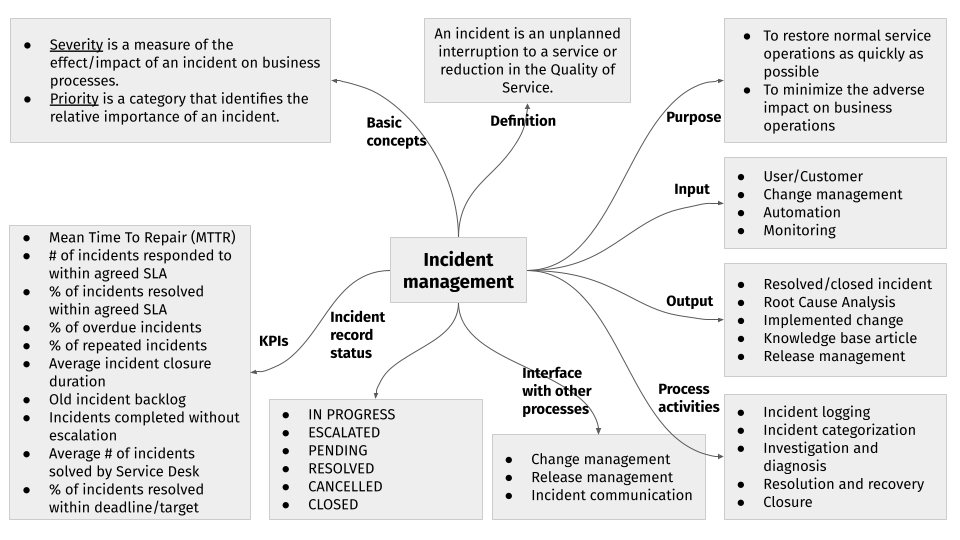
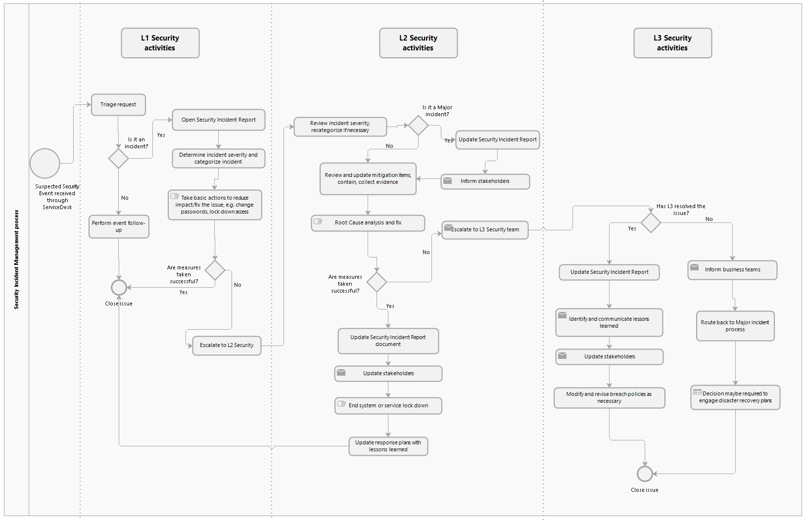

# Gestion des incidents

L'objectif principal de la gestion des incidents est de restaurer le fonctionnement normal du service aussi rapidement que possible et de minimiser l'impact sur les opérations métier, garantissant ainsi que les meilleurs niveaux possibles de qualité et de disponibilité de service sont maintenus. Le « fonctionnement normal du service » est défini ici comme le fonctionnement du service dans le cadre des [accords de niveau de service (SLA)](service-level-agreements.md).

Cela est réalisé grâce à un processus de gestion des incidents robuste et bien aligné, guidé par un système de Service Desk qui aide à capturer tous les problèmes et à suivre le délai de traitement (TAT) depuis le moment où un problème est signalé jusqu'au moment de la résolution et de la clôture.

Le processus de gestion des incidents implique la détection d'un incident, son enregistrement avec toutes les informations appropriées, l'analyse du problème, la correction des défauts et la restauration du service conformément au TAT stipulé.

Cette section rassemble les principaux processus, concepts et principes relatifs à la gestion des incidents.

::: tip NOTE
Les processus décrits dans cette section représentent les bonnes pratiques et servent de recommandations pour les organisations remplissant un rôle d'opérateur du Hub.
:::

::: tip NOTE
Tout au long de cette section, les termes « client », « consommateur », « utilisateur final » et « utilisateur » désignent tous un employé de DFSP. Lorsque ces mots sont utilisés dans un autre sens, la signification du mot est précisée et expliquée en détail.
:::

## La gestion des incidents en une seule image

La figure suivante définit le flux de processus et les concepts clés de la gestion des incidents en une seule image.

<!---->

## Limites du processus

Le processus de gestion des incidents commence lorsque :

* un incident est déclenché par un appel téléphonique/courriel/interaction avec le Service Desk de la part des utilisateurs ou des clients
* un incident est découvert par le biais d'un processus ou d'un outil interne, par exemple, il y a une alerte d'événement provenant de l'un des outils d'alerte ou des systèmes de surveillance
* le personnel de support à tous les niveaux (ingénieurs de support L1, L2, L3) ou le responsable de service signale directement un incident

Le processus de gestion des incidents se termine :

* pour le client : lorsque le statut du ticket dans l'outil Service Desk est changé en « Clôturé »
* pour l'équipe du Service Desk : lorsque l'incident est résolu et que la validation de clôture est envoyée au client

Les limites de la gestion des incidents stipulent que le processus prend en compte les prérequis suivants :

* Un accord de niveau de service (SLA) entre la communauté (par exemple, Mojaloop), les sociétés holding (par exemple, le Hub) et les prestataires de services financiers numériques (DFSP) est en place.
* Un SLA entre le partenaire d'implémentation (le Hub) et les fournisseurs de logiciels tiers (par exemple, Microsoft, Oracle, etc.) est en place.
* Il existe un accord de niveau opérationnel (OLA) existant. Cet accord décrit les responsabilités de chaque groupe de support interne envers les autres groupes de support, y compris le processus et le délai de livraison de leurs services.

## Gestion des incidents étape par étape

Cette section fournit une description détaillée du processus de gestion des incidents. Tous les incidents signalés passent par les étapes principales suivantes.

### Étape 1 : Signaler et enregistrer l'incident, la demande de changement ou la question

Les problèmes, demandes de changement ou questions peuvent être signalés et enregistrés via l'outil Service Desk dès qu'ils surviennent. L'outil Service Desk est le canal principal pour recevoir les requêtes liées aux incidents. Les courriels, appels téléphoniques et messagerie instantanée peuvent être utilisés comme canaux secondaires.

Le statut des tickets tels que capturés dans le système Service Desk peut prendre les valeurs suivantes :

* **En cours** : Un incident qui a été reçu via le Service Desk et assigné à un ingénieur de support. Les efforts de résolution ont commencé.
* **Escaladé** : Un incident qui a été escaladé vers toute partie extérieure à l'équipe des opérations, y compris l'équipe de livraison produit ou les fournisseurs de services externes L4.
* **En attente** : Un incident qui a été temporairement mis en attente ou en attente de retour de l'utilisateur ou d'un autre ticket qui doit être résolu avant que ce ticket puisse être résolu. \
\
Gardant à l'esprit que l'utilisation du statut « En attente » arrête le chronomètre SLA, la seule raison qui justifie l'utilisation de « En attente » est lorsqu'une action du client est requise. Il doit s'agir d'une action qui est de la responsabilité du client/consommateur ou de son fournisseur et qui est un prérequis à la continuation du processus ; par exemple, demander des informations essentielles ou l'approbation pour résoudre la demande. Les tickets de sévérité 1 et 2 ne doivent pas être mis au statut « En attente ». La restauration d'un service ou d'une fonction d'un service dépend rarement de l'action du client. La seule exception est lorsque le client arrête l'investigation ou la mise en œuvre d'une solution ou refuse une approbation nécessaire. Dans tous les cas, la décision du client doit être documentée.
* **Annulé** : Un incident qui a été annulé. Un incident ne peut être annulé que lorsque le client en fait la demande.
* **Résolu** : Un incident qui a été traité par un ingénieur de support et a été corrigé, et une alerte a été déclenchée à l'utilisateur pour réouvrir si non satisfait.
* **Clôturé** : Un incident qui a été clôturé une fois que la résolution a été reconnue par l'utilisateur final.

Toutes les informations pertinentes relatives aux incidents doivent être enregistrées afin qu'un historique complet soit maintenu. En maintenant des enregistrements d'incidents précis et complets, le personnel des groupes de support assignés est mieux en mesure de résoudre les incidents enregistrés.

### Étape 2 : Catégoriser et prioriser

L'utilisateur final/demandeur se voit attribuer un numéro de ticket pour référence et facilité d'accès lorsque le problème est reconnu et pris en charge par l'équipe de support. Le ticket doit être visible par le demandeur (l'employé DFSP qui a soulevé le problème) à tous les niveaux de support.

Le demandeur sera automatiquement notifié par courriel de tout changement, mise à jour de statut, demande d'informations supplémentaires, disponibilité pour test ou résolution finale concernant le ticket.

Nous classifions généralement les demandes de support en :

* Incident
* Demande de service
* Demande de changement ou Request for Change (RFC, tels que fonctionnalités, améliorations)

Les incidents sont catégorisés et sous-catégorisés en fonction du service informatique ou du domaine métier pour lequel l'incident cause une perturbation.

Voici quelques exemples de catégories de service :

* Infrastructure
* Mojaloop
* Sécurité
* Règlements
* Intégration

La sévérité d'un incident peut être déterminée à l'aide d'une [matrice de catégorisation](#incident-categorization-matrix). En fonction de leur sévérité, les incidents peuvent être catégorisés comme :

* Critique = S1
* Grave = S2
* Moyen = S3
* Mineur = S4

Une fois l'incident catégorisé, il est automatiquement acheminé vers un ingénieur de support L1 possédant l'expertise pertinente.

### Étape 3 : Investiguer et résoudre

La ressource de support assignée sera chargée d'investiguer le problème, ainsi que de préparer l'enregistrement de l'incident et de communiquer avec le client sur la façon de résoudre le problème.

L'investigation d'un incident peut inclure l'une des actions suivantes :

* Collecte et analyse d'informations
* Recherche, y compris la reproduction du problème
* Acquisition d'informations supplémentaires auprès d'autres sources

La résolution d'un incident peut inclure l'une des actions suivantes :

* Fournir une résolution ou des étapes vers une résolution
* Modifications de configuration

En fonction de la complexité de l'incident, il peut être nécessaire de le décomposer en sous-tâches ou tâches. Les tâches sont généralement créées lorsque la résolution d'un incident nécessite la contribution de plusieurs techniciens de différents départements.

Pendant le traitement de l'incident, l'ingénieur de support doit s'assurer que l'accord de niveau de service n'est pas violé. Un SLA est le délai acceptable dans lequel un incident nécessite une réponse (SLA de réponse) ou une résolution (SLA de résolution). Les SLA peuvent être attribués aux incidents en fonction de leurs paramètres comme la catégorie de service, le demandeur, l'impact, l'urgence, etc. Dans les cas où un SLA est sur le point d'être violé ou a déjà été violé, l'incident peut être escaladé fonctionnellement ou hiérarchiquement pour garantir qu'il soit résolu au plus tôt.

Un incident est considéré comme résolu lorsque l'équipe de support L1/L2/L3 a trouvé une solution de contournement temporaire ou une solution permanente au problème. Les solutions de contournement peuvent être :

* des instructions fournies au client sur la façon d'accomplir son travail en utilisant une méthode alternative
* des correctifs temporaires qui aident un système à fonctionner comme prévu mais qui ne résolvent pas le problème de manière permanente

Les solutions de contournement doivent être documentées et communiquées au Service Desk afin qu'elles puissent être ajoutées à la base de connaissances. (Il est recommandé de maintenir un référentiel d'articles de base de connaissances, décrivant la solution de contournement ou les étapes de résolution des incidents survenus par le passé.) Cela garantira que les solutions de contournement sont accessibles au Service Desk pour faciliter la résolution lors de récurrences futures de l'incident.

### Étape 4 : Escalader

L'escalade d'un incident est la reconnaissance qu'il existe la possibilité qu'un incident dépasse les délais de résolution convenus à chaque niveau de support. Une gestion claire de l'escalade permet à l'équipe de support d'identifier, de suivre, de surveiller et de gérer les situations nécessitant une sensibilisation accrue et une action rapide.

Il existe deux types d'escalade :

* **Escalade fonctionnelle** : Ce type d'escalade intervient lorsqu'une équipe de niveau de support (par exemple, L1) est incapable de résoudre le problème ou de respecter le délai convenu (ce qui signifie que le temps ciblé pour la résolution est dépassé). Par conséquent, le cas est proactivement assigné au niveau de service suivant (par exemple, L2).
* **Escalade hiérarchique** : Ce type d'escalade sert de moyen pour informer toutes les parties impliquées, de manière proactive, d'une violation potentielle du SLA. Cela aide à apporter de l'ordre, de la structure, de la responsabilité, de l'appropriation, une gestion ciblée et une mobilisation des ressources dans le but de fournir des services efficaces et efficients.

### Étape 5 : Clôturer l'incident

Un incident peut être clôturé une fois que le problème est résolu et que l'utilisateur reconnaît la résolution et en est satisfait.

## Matrice de catégorisation des incidents

L'une des étapes les plus importantes de la gestion des incidents est la catégorisation des incidents. Cela aide non seulement à trier les tickets entrants, mais garantit également que les tickets sont acheminés vers les ingénieurs de support les plus qualifiés pour traiter le problème. La catégorisation des incidents aide également le système de Service Desk à appliquer les SLA les plus appropriés aux incidents et à communiquer ces priorités aux utilisateurs finaux. Une fois qu'un incident est catégorisé, les ingénieurs de support peuvent diagnostiquer l'incident et fournir à l'utilisateur final une résolution.

Le tableau suivant fournit des orientations sur la façon de classifier la sévérité d'un incident.

<table>
<caption><strong>Matrice de catégorisation des incidents</strong></caption>
<colgroup>
<col style="width: 16%" />
<col style="width: 83%" />
</colgroup>
<thead>
<tr class="header">
<th>Code de sévérité</th>
<th>Critères</th>
</tr>
</thead>
<tbody>
<tr class="odd">
<td>
Sévérité 1
</td>
<td><ul>
<li>
Impact étendu sur l'activité, panne du système de production, le fonctionnement normal n'est pas possible.
</li>
<li>
Tout incident ayant entraîné une panne majeure du Hub, y compris la connectivité de plusieurs partenaires/DFSP.
</li>
<li>
Tout incident présentant des risques financiers majeurs et ayant des implications contractuelles.
</li>
<li>
Un incident de sécurité ayant un impact majeur sur la confidentialité ou la disponibilité du Hub, des partenaires/DFSP ou des données clients.
</li>
</ul></td>
</tr>
<tr class="even">
<td>
Sévérité 2
</td>
<td><ul>
<li>
Panne partielle du Hub.
</li>
<li>
Une fonctionnalité clé est altérée sans solution de contournement disponible.
</li>
</ul></td>
</tr>
<tr class="odd">
<td>
Sévérité 3
</td>
<td><ul>
<li>
Impact fonctionnel mineur/modéré sur un seul utilisateur ou un petit groupe d'utilisateurs. Une solution de contournement existe.
</li>
</ul></td>
</tr>
<tr class="even">
<td>
Sévérité 4
</td>
<td><ul>
<li>
Un incident mineur avec (presque) aucun impact ou préjudice sur la fonctionnalité du système mais néanmoins un bogue valide.
</li>
</ul></td>
</tr>
</tbody>
</table>

Légende :

* Sévérité 1 = Critique
* Sévérité 2 = Grave
* Sévérité 3 = Moyen
* Sévérité 4 = Mineur

Le code de sévérité attribué à un incident déterminera le temps de résolution et sera utilisé par le Service Desk pour attribuer des ressources à la demande.

En plus de la sévérité, dans certains cas, la priorité d'un incident peut également devoir être prise en compte. La priorité est attribuée par l'opérateur du Hub (plutôt que par le client) et représente l'ordre dans lequel l'incident sera corrigé. Plus la priorité est élevée, plus l'incident sera résolu rapidement. Considérez l'exemple suivant : un bogue cosmétique comme une faute de frappe sur une page web sera probablement classé comme de faible sévérité mais pourrait être une correction rapide et facile et classé comme de haute priorité. Il est donc important d'accorder à la sévérité et à la priorité la considération nécessaire.

Le tableau suivant fournit des orientations sur la façon d'attribuer une priorité à un incident.

<table>
<caption><strong>Matrice de priorité</strong></caption>
<colgroup>
<col style="width: 16%" />
<col style="width: 83%" />
</colgroup>
<thead>
<tr class="header">
<th>Code de priorité</th>
<th>Critères</th>
</tr>
</thead>
<tbody>
<tr class="odd">
<td>
Priorité 1
</td>
<td>Un problème grave est survenu affectant plusieurs utilisateurs au sein d'un bénéficiaire de service (&gt;50% des utilisateurs du bénéficiaire de service) dans la mesure où ils sont incapables d'exécuter leurs fonctions de travail assignées, OU le bénéficiaire de service ou des domaines extérieurs au bénéficiaire de service sont affectés.</td>
</tr>
<tr class="even">
<td>
Priorité 2
</td>
<td>Un problème est survenu affectant soit plusieurs utilisateurs (affecte &gt;10 mais pas plus de 50% de tous les utilisateurs du bénéficiaire de service) SOIT un utilisateur clé nommé du service dans la mesure où ils sont incapables d'exécuter leurs fonctions de travail assignées et une unité métier est affectée.</td>
</tr>
<tr class="odd">
<td>
Priorité 3
</td>
<td>Un problème est survenu affectant un seul utilisateur OU (affecte &lt;10 utilisateurs OU pas plus de 25% de tous les utilisateurs) dans la mesure où ils sont incapables d'exécuter leurs fonctions de travail assignées.</td>
</tr>
<tr class="even">
<td>
Priorité 4
</td>
<td>Un problème est survenu affectant un seul utilisateur, causant une fonctionnalité réduite d'une seule application. Il existe une solution de contournement pour que l'utilisateur puisse exécuter ses fonctions de travail assignées, mais la panne entraîne une diminution de sa productivité.</td>
</tr>
</tbody>
</table>

## Incidents de sécurité

Cette section décrit la procédure qu'il est recommandé à un opérateur du Hub de mettre en œuvre pour le traitement des événements/incidents de sécurité. Les incidents de sécurité peuvent être classés comme incidents de sévérité 1, sévérité 2, sévérité 3 ou sévérité 4. Quelle que soit sa catégorisation, suivez les étapes décrites dans le tableau ci-dessous si un incident est lié à la sécurité.

<table>
<caption><strong>Gestion des incidents de sécurité</strong></caption>
<colgroup>
<col style="width: 25%" />
<col style="width: 25%" />
<col style="width: 25%" />
<col style="width: 25%" />
</colgroup>
<thead>
<tr class="header">
<th colspan="2">Étape</th>
<th>Action ou information supplémentaire</th>
<th>Rôle</th>
</tr>
</thead>
<tbody>
<tr class="odd">
<td>
<strong>Étape 1</strong> : Un événement/incident de sécurité suspecté est reçu via le Service Desk par le biais d'un ticket assigné à l'équipe de sécurité (L1) pour examen initial et triage.
</td>
<td></td>
<td></td>
<td></td>
</tr>
<tr class="even">
<td>
<strong>Étape 2</strong> : Invoquer le processus de triage.
</td>
<td>
<strong>Étape 2a</strong> :

<ul>
<li>
Identifier les artefacts de l'incident.
</li>
<li>
Identifier les appareils, systèmes ou utilisateurs affectés.
</li>
</ul></td>
<td><ul>
<li>
Rassembler les indicateurs clés d'une menace.
</li>
<li>
Récupérer les journaux.
</li>
<li>
Rechercher les artefacts (adresses IP, noms d'utilisateurs, URL, noms d'hôtes, etc.).
</li>
<li>
Examiner les journaux pour déterminer s'il y a une loi/réglementation violée par l'incident (s'il s'agit d'un incident grave, il pourrait nuire à la réputation de l'organisation).
</li>
</ul></td>
<td>
L1 Responsable de la sécurité de l'information (ISO)
</td>
</tr>
<tr class="odd">
<td>

</td>
<td>
<strong>Étape 2b</strong> :

<ul>
<li>
Évaluer la situation : évaluation de l'impact.
</li>
<li>
Estimer l'effet potentiel de l'événement ou de l'incident.
</li>
</ul></td>
<td><ul>
<li>
Examiner les indicateurs de compromission disponibles.
</li>
<li>
Évaluer l'impact en fonction de la criticité du système affecté.
</li>
<li>
Examiner les journaux d'audit.
</li>
<li>
Établir une chronologie des événements.
</li>
</ul></td>
<td>
L1 ISO
</td>
</tr>
<tr class="even">
<td>

</td>
<td>
<strong>Étape 2c</strong> :

Collecter les preuves.
</td>
<td><ul>
<li>
Collecter et rassembler toutes les informations disponibles pour permettre la catégorisation.
</li>
</ul></td>
<td>
L1 ISO
</td>
</tr>
<tr class="odd">
<td>

</td>
<td>
<strong>Étape 2d</strong> :

Déterminer la catégorisation.
</td>
<td><ul>
<li>
Sur la base des informations collectées, attribuer une catégorie au ticket.
</li>
<li>
La sécurité L1 mettra à jour les catégorisations selon les besoins.
</li>
</ul>

Les exemples de catégories sont :

<ul>
<li>
Déni de service (DOS)
</li>
<li>
Code malveillant
</li>
<li>
Accès non autorisé
</li>
<li>
Fuite/perte de données
</li>
<li>
Violation de données (violation de la réglementation relative à la protection des données)
</li>
<li>
Utilisation inappropriée
</li>
</ul></td>
<td>
L1 ISO
</td>
</tr>
<tr class="even">
<td>

</td>
<td>
<strong>Étape 2e</strong> :

Prendre les mesures de base pour atténuer l'effet sur l'environnement.
</td>
<td>Les mesures de base peuvent inclure des tâches telles que :
<ul>
<li>
Verrouiller un point de terminaison.
</li>
<li>
Déployer un anti-malware si nécessaire.
</li>
<li>
Examiner les procédures opérationnelles standard de sécurité (SOP) (le cas échéant) pour toute étape supplémentaire qui pourrait être nécessaire.
</li>
</ul>

Si les mesures d'atténuation prises réussissent à résoudre le problème signalé, la sécurité L1 mettra à jour le ticket et passera à l'étape 8 (Clôturer le problème).
</td>
<td>
L1/L2 ISO
</td>
</tr>
<tr class="odd">
<td>
<strong>Étape 3</strong> : Évaluer si le problème signalé est un événement ou un incident.
</td>
<td>

</td>
<td>
La décision d'évaluation est prise par l'équipe de sécurité L1 en collaboration avec la sécurité L2.
</td>
<td>
L1/L2 ISO
</td>
</tr>
<tr class="even">
<td>
<strong>Étape 4.1</strong> : Si le problème signalé est catégorisé comme un « événement », suivre ces étapes :
</td>
<td>
<strong>Étape 4.1a</strong> :

Effectuer le suivi de l'événement.
</td>
<td>Les exemples de suivi d'événement incluent :
<ul>
<li>
Vérifier et installer un anti-malware sur tous les hôtes.
</li>
<li>
Déclencher des tickets demandant la correction des systèmes et/ou la révision de l'événement par l'équipe des opérations.
</li>
</ul></td>
<td>
L1/L2 ISO
</td>
</tr>
<tr class="odd">
<td>

</td>
<td>
<strong>Étape 4.1b</strong> :

Passer à l'étape 8.
</td>
<td></td>
<td>
L1 ISO
</td>
</tr>
<tr class="even">
<td>
<strong>Étape 4.2</strong> : Si le problème signalé est catégorisé comme un « incident », suivre ces étapes :
</td>
<td>
<strong>Étape 4.2a</strong> :

L'ISO L1 escalade vers l'ISO L2 pour une investigation plus approfondie en réattribuant le ticket au groupe de sécurité L2 pour suivi.
</td>
<td></td>
<td>
L1 ISO
</td>
</tr>
<tr class="odd">
<td>

</td>
<td>
<strong>Étape 4.2b</strong> :

L'ISO L2 accuse réception du ticket de L1 et procède à l'ouverture du rapport d'incident de sécurité.
</td>
<td></td>
<td>
L2 ISO
</td>
</tr>
<tr class="even">
<td>

</td>
<td>
<strong>Étape 4.2c</strong> :

L'ISO L2 examine et vérifie la sévérité et la catégorisation de l'incident.
</td>
<td><ul>
<li>
Pour les définitions de sévérité des incidents, voir la <a href="incident-management.html#incident-categorization-matrix">matrice de catégorisation</a>.
</li>
<li>
Passer à l'étape 5.
</li>
</ul></td>
<td>
L2 ISO
</td>
</tr>
<tr class="odd">
<td>
<strong>Étape 5.1</strong> : Si l'incident signalé est catégorisé comme un incident « S1 », suivre ces étapes :
</td>
<td>
<strong>Étape 5.1a</strong> :

Mettre à jour le rapport d'incident de sécurité.
</td>
<td></td>
<td>
L2 ISO
</td>
</tr>
<tr class="even">
<td></td>
<td>
<strong>Étape 5.1b</strong> :

Informer les parties prenantes par courriel sécurisé.
</td>
<td>
Les parties prenantes sont documentées dans l'<a href="incident-management-escalation-matrix.html">Annexe A : Matrice d'escalade de la gestion des incidents</a>.
</td>
<td>
L2 ISO
</td>
</tr>
<tr class="odd">
<td></td>
<td>
<strong>Étape 5.1c</strong> :

Passer à l'étape 6.
</td>
<td></td>
<td>
L2 ISO
</td>
</tr>
<tr class="even">
<td>
<strong>Étape 5.2</strong> : Si l'incident signalé est catégorisé comme un incident « S4 », suivre ces étapes :
</td>
<td>
<strong>Étape 5.2a</strong> :

Passer à l'étape 6.
</td>
<td></td>
<td>
L2 ISO
</td>
</tr>
<tr class="odd">
<td>
<strong>Étape 6</strong> : Contenir et éradiquer.
</td>
<td>
<strong>Étape 6a</strong> :

Examiner et mettre à jour les actions d'atténuation pour réduire l'impact.
</td>
<td>
Les exemples d'actions d'atténuation incluent :

<ul>
<li>
Changer les mots de passe.
</li>
<li>
Verrouiller l'accès.
</li>
</ul></td>
<td>
L2 ISO
</td>
</tr>
<tr class="even">
<td></td>
<td>
<strong>Étape 6b</strong> :

Collecter les preuves.
</td>
<td></td>
<td>
L2 ISO
</td>
</tr>
<tr class="odd">
<td></td>
<td>
<strong>Étape 6c</strong> :

Effectuer l'analyse des causes premières et identifier/mettre en œuvre un correctif.
</td>
<td></td>
<td>
L2 ISO
</td>
</tr>
<tr class="even">
<td></td>
<td>
<strong>Étape 6d</strong> :

Mettre à jour les procédures opérationnelles standard (SOP) de l'incident selon les besoins.
</td>
<td>
Les mises à jour des SOP sont examinées par L3 avant adoption.
</td>
<td>
L2 ISO
</td>
</tr>
<tr class="odd">
<td>
<strong>Étape 6.1</strong> : Si l'étape 6 est réussie, suivre ces étapes :
</td>
<td>
<strong>Étape 6.1a</strong> :

Mettre à jour le rapport d'incident de sécurité et le ticket.
</td>
<td>
S'assurer que le ticket ne contient pas d'informations de sécurité sensibles.
</td>
<td>
L2 ISO
</td>
</tr>
<tr class="even">
<td></td>
<td>
<strong>Étape 6.1b</strong> :

Communiquer avec les parties prenantes par courriel sécurisé.
</td>
<td>
Les parties prenantes sont documentées dans l'<a href="incident-management-escalation-matrix.html">Annexe A : Matrice d'escalade de la gestion des incidents</a>.
</td>
<td>
L2 ISO
</td>
</tr>
<tr class="odd">
<td></td>
<td>
<strong>Étape 6.1c</strong> :

Mettre fin au verrouillage du système ou du service.
</td>
<td></td>
<td>
L2 ISO
</td>
</tr>
<tr class="even">
<td></td>
<td>
<strong>Étape 6.1d</strong> :

Passer à l'étape 8.
</td>
<td></td>
<td>
L2 ISO
</td>
</tr>
<tr class="odd">
<td>
<strong>Étape 6.2</strong> : Si l'étape 6 échoue, suivre ces étapes :
</td>
<td>
<strong>Étape 6.2a</strong> :

Escalader vers l'équipe de sécurité L3.
</td>
<td></td>
<td>
L2 ISO
</td>
</tr>
<tr class="even">
<td></td>
<td>
Étape <strong>6.2b</strong> :

Informer l'équipe métier.
</td>
<td></td>
<td>
L2 ISO
</td>
</tr>
<tr class="odd">
<td></td>
<td>
<strong>Étape 6.2c</strong> :

L3 procède à l'étape 7.
</td>
<td></td>
<td>
L3 ISO
</td>
</tr>
<tr class="even">
<td>
<strong>Étape 7</strong> : L3 examine et résout le problème.
</td>
<td>
<strong>Étape 7a</strong> :

Examiner les activités et l'historique de l'incident documentés par L1 et L2.
</td>
<td></td>
<td>
L3 ISO
</td>
</tr>
<tr class="odd">
<td></td>
<td>
<strong>Étape 7b</strong> :

Fournir des orientations pour des actions de confinement supplémentaires.
</td>
<td></td>
<td>
L3 ISO
</td>
</tr>
<tr class="even">
<td></td>
<td>
<strong>Étape 7c</strong> :

Si L3 résout le problème, passer à l'étape 8.
</td>
<td></td>
<td>
L3 ISO
</td>
</tr>
<tr class="odd">
<td></td>
<td>
<strong>Étape 7d</strong> :

Si L3 ne peut pas résoudre le problème, il peut escalader vers l'OEM du système/logiciel ou obtenir des services spécialisés (sous réserve d'approbation) pour le support.
</td>
<td>
Si L3 ne peut pas résoudre le problème, il peut escalader vers l'OEM du système/logiciel ou obtenir des services spécialisés (sous réserve d'approbation) pour le support. Une décision peut être nécessaire sur le déclenchement du plan de reprise après sinistre, y compris la formation d'une « cellule de crise ».

Un plan de reprise après sinistre (DRP) est un arrangement sur mesure, basé sur les capacités techniques de l'opérateur du Hub, ainsi que sur l'appétit pour le risque. Il fait partie des politiques de sécurité informatique d'un opérateur du Hub. Il est nécessaire d'évaluer les détails de la politique et des attentes du DRP de l'opérateur du Hub, et d'affiner le déploiement pour répondre à ses besoins. Les détails doivent être élaborés pendant la mise en œuvre (de préférence pendant la phase de conception) car les différentes options disponibles peuvent avoir des implications financières.
</td>
<td>
L3 ISO
</td>
</tr>
<tr class="even">
<td>
<strong>Étape 8</strong> : Clôturer le problème.
</td>
<td>
<strong>Étape 8a</strong> :

Restaurer les systèmes affectés.
</td>
<td></td>
<td>
L1 / L2 / L3 ISO
</td>
</tr>
<tr class="odd">
<td></td>
<td>
<strong>Étape 8b</strong> :

Mettre à jour le rapport d'incident de sécurité.
</td>
<td></td>
<td>
L2 / L3 ISO
</td>
</tr>
<tr class="even">
<td></td>
<td>
<strong>Étape 8c</strong> :

Identifier et communiquer les leçons apprises.
</td>
<td></td>
<td>
L2 / L3 ISO
</td>
</tr>
<tr class="odd">
<td></td>
<td>
<strong>Étape 8d</strong> :

L'équipe de réponse aux incidents examine les recommandations pertinentes pour une adoption éventuelle.
</td>
<td>
Cette session de revue peut inclure les équipes des opérations techniques et de gestion des services, selon la sévérité.
</td>
<td>
L1 / L2 / L3 ISO
</td>
</tr>
<tr class="even">
<td></td>
<td>
<strong>Étape 8e</strong> :

Informer les parties prenantes.
</td>
<td></td>
<td>
L2 / L3 ISO
</td>
</tr>
<tr class="odd">
<td></td>
<td>
<strong>Étape 8f</strong> :

Clôturer le problème.
</td>
<td></td>
<td>
L1 / L2 / L3 ISO
</td>
</tr>
<tr class="even">
<td>
<strong>Étape 9</strong> : L'ISO L3 modifie et révise les politiques et procédures relatives aux violations.
</td>
<td></td>
<td></td>
<td>
L3 ISO
</td>
</tr>
</tbody>
</table>

La figure suivante présente un résumé du processus décrit ci-dessus.

### Modèle de rapport d'incident de sécurité

Lors de la rédaction d'un rapport d'incident de sécurité, il est recommandé d'utiliser un modèle créé à cet effet.

## Rôles et responsabilités

Cette section fournit des directives génériques sur les rôles et responsabilités proposés au sein du processus de gestion des incidents.

::: tip NOTE
Il est pratique de décrire le support continu pour les opérations techniques du Hub Mojaloop en niveaux. Ce document décrit quatre niveaux. Les niveaux sont pratiques car chaque niveau de support nécessite un degré différent de connaissance et d'accès au système. En d'autres termes, les niveaux font référence à différents rôles/équipes de support au sein de votre organisation.

Certaines de ces équipes peuvent éventuellement être externalisées, selon le niveau d'expertise ou de capacité au sein de votre organisation. Si vous décidez d'externaliser des fonctions de support, il existe des organisations au sein de la communauté Mojaloop qui fournissent différents niveaux de support en tant que service. (Pour plus d'informations et des recommandations, contactez la Fondation Mojaloop.)
:::

### Utilisateur final/utilisateur/demandeur/L0

*Rôle*

Il s'agit de la partie prenante qui subit une perturbation de service et crée un ticket d'incident pour initier le processus de gestion des incidents.

*Responsabilités*

* Contacter le Service Desk pour créer une nouvelle demande d'incident.
* Suivre une demande existante.
* Surveiller le canal de communication pour tout retour des ingénieurs de support.
* Communiquer clairement toutes les informations requises ou demandées aux ingénieurs de support.
* Reconnaître la restauration du service et l'achèvement du ticket.
* Répondre aux enquêtes de suivi après la résolution du ticket en complétant la boucle de rétroaction.

### Équipe niveau 1/Service Desk

*Rôle*

Il s'agit du premier point de contact (support niveau 1) pour les demandeurs ou les utilisateurs finaux lorsqu'ils souhaitent créer une demande ou un incident. Ce rôle est responsable de la résolution de base au Service Desk, des diagnostics initiaux et de l'investigation des tickets du Service Desk.

*Responsabilités*

* Enregistrer toutes les demandes d'incident entrantes avec les paramètres appropriés, tels que la sévérité et la priorité (si cette dernière est applicable).
* Attribuer les tickets aux ingénieurs de support en fonction des paramètres ci-dessus (sévérité et priorité).
* Analyser et résoudre l'incident pour restaurer le service.
* Escalader les incidents non résolus vers l'équipe niveau 2.
* Rassembler toutes les informations requises auprès des demandeurs et leur envoyer des mises à jour régulières sur le statut de leur demande.
* Agir comme point de contact pour les demandeurs et, si nécessaire, coordonner entre l'équipe niveau 2 et les utilisateurs finaux.
* Vérifier la résolution avec l'utilisateur final et recueillir les retours tout en mettant à jour les tickets.
* Surveiller les retours et enquêtes liés aux actions que L1 a prises pour résoudre le problème dans le but d'analyser la qualité du service offert.

### Équipe niveau 2 (Support application, infrastructure, sécurité et opérations métier L2) (Équipe de support client)

*Rôles*

Cette fonction de support est composée d'ingénieurs ou d'experts métier en la matière (SME) ayant une connaissance approfondie du Hub. L'équipe L2 est censée fournir un dépannage approfondi, une analyse technique, une analyse des transactions et un support pour résoudre les incidents signalés. Ils reçoivent généralement des demandes plus complexes des utilisateurs finaux ; ils reçoivent également des demandes sous forme d'escalades de l'équipe L1.

*Responsabilités*

* Effectuer le diagnostic de l'incident.
* Documenter les étapes suivies pour résoudre l'incident et soumettre des articles de base de connaissances. (Pour chaque incident, l'équipe de support met à jour la base de connaissances. L'objectif des articles de base de connaissances est de permettre aux utilisateurs finaux et au personnel de support de résoudre les problèmes par eux-mêmes.)
* Traiter les incidents intermédiaires, par exemple les incidents liés aux applications, à l'infrastructure, à l'analyse des journaux, à l'analyse des transactions, etc.
* Si l'incident est résolu, confirmer la résolution avec l'utilisateur final.
* Soutenir l'intégration des DFSP.

### Équipe niveau 3 (Support application, infrastructure et sécurité L3) (Équipe de support technique)

*Rôles*

Ce niveau est généralement composé d'ingénieurs spécialisés ayant une connaissance approfondie de domaines particuliers du Hub – par exemple, connaissance des composants d'infrastructure ou des applications système, ou expertise en ingénierie de sécurité.

*Responsabilités*

* Effectuer une analyse approfondie et/ou reproduire le problème dans un environnement de test afin de diagnostiquer correctement le problème et de tester la solution.
* Interpréter et analyser le code et les données en utilisant les informations triées depuis L1 et L2.
* Si non résolu, escalader l'incident vers les partenaires de support « L4 » pour identifier le problème sous-jacent ou vers les fournisseurs externes, DFSP ou banque de règlement (requêtes de transactions ou rapports de transferts) selon le cas.
* Fournir une expertise en la matière.
* Documenter l'incident et mettre à jour la base de connaissances. (Pour chaque incident, l'équipe de support met à jour la base de connaissances. L'objectif des articles de base de connaissances est de permettre aux utilisateurs finaux et au personnel de support de résoudre les problèmes par eux-mêmes.)

### Responsable des incidents/Responsable de service

*Rôle*

Le responsable de service surveille l'efficacité du processus. Le responsable de service gère le processus pour restaurer le fonctionnement normal du service aussi rapidement que possible et pour minimiser l'impact sur les opérations métier.

*Responsabilités*

* Servir de point de contact pour tous les incidents S1 signalés.
* Planifier et faciliter toutes les activités impliquées dans le processus de gestion des incidents.
* S'assurer que le processus correct est suivi pour tous les tickets et corriger tout écart.
* Coordonner et communiquer avec le propriétaire du processus.
* Aligner les attentes des clients avec les SLA en étant l'interface entre les clients et l'équipe des opérations.
* Identifier les incidents qui doivent être examinés et effectuer l'examen.

### Propriétaire du processus : Responsable des opérations techniques

*Rôle*

Il s'agit du propriétaire du processus suivi pour la gestion des incidents. Ce rôle agit également comme coordinateur entre les équipes et les organisations. Le responsable des opérations techniques analyse, modifie et améliore le processus pour s'assurer qu'il sert au mieux les intérêts de l'organisation.

*Responsabilités*

* Responsable de la qualité globale du processus. Supervise la gestion et la conformité aux procédures, modèles de données, politiques et technologies associés au processus.
* Propriétaire du processus et de la documentation de soutien pour le processus d'un point de vue stratégique et tactique.
* S'assure que le processus de gestion des incidents s'aligne sur les autres politiques de l'organisation, par exemple la politique RH, la politique de sécurité, les principes directeurs de niveau un, etc.
* Définit les [indicateurs clés de performance (KPI)](key-terms-kpis.md) et les aligne sur les facteurs critiques de succès (CSF), et s'assure que ces objectifs sont atteints.
* Conçoit, documente, examine et améliore les processus.
* Établit l'amélioration continue du service (CSI) et s'assure que les procédures, politiques, rôles, technologies et autres aspects du processus de gestion des incidents sont examinés et améliorés.
* Se tient informé des bonnes pratiques de l'industrie et les intègre dans le processus de gestion des incidents.

## Résultats du processus de gestion des incidents

Le processus de gestion des incidents produit les résultats suivants. Notez que le seul résultat obligatoire pour les incidents de sécurité ou S1 est l'analyse des causes premières (RCA), et tous les autres résultats énumérés ci-dessous peuvent alimenter la RCA.

* Incidents résolus ou clôturés. Il s'agit du résultat le plus souhaité du processus de gestion des incidents. L'enregistrement d'incident clôturé contient des détails précis sur les attributs de l'incident et les étapes prises pour la résolution ou la solution de contournement.
* Demandes de changement (RFC).
* Métriques de résolution (temps moyen entre les pannes, temps moyen de réparation, temps moyen d'accusé de réception et temps moyen jusqu'à la défaillance). Pour les détails sur les KPI, voir le [Glossaire](key-terms-kpis.md).
* Changement mis en œuvre avec succès à travers le processus de gestion des changements.
* Document RCA conforme au modèle RCA.
* Service restauré.
* Base de données de la base de connaissances mise à jour.
* Notification par divers canaux (Service Desk, courriel, appel, etc.) sur l'initiation, la résolution et la clôture d'un incident S1 aux différentes parties prenantes.
* Rapport d'opérations quotidiennes et rapport de gestion mis à jour pour vérifier les décisions prises concernant les améliorations de service, l'allocation/réaffectation des ressources.
* Détails d'interruption de service et/ou de composant enregistrés avec précision (par exemple, début, fin, durée, classification de l'interruption, etc.).

## Impact sur les autres processus

Le processus de gestion des incidents interagit avec un certain nombre d'autres processus, alimentant et impactant chacun d'entre eux :

* **Processus de gestion des changements** : L'objectif du processus de gestion des changements est de s'assurer que des méthodes et procédures standardisées sont utilisées pour le traitement efficace et rapide de tous les changements, afin de minimiser l'impact des incidents liés aux changements sur la disponibilité ou la qualité du service, et par conséquent d'améliorer les opérations quotidiennes de l'organisation.
* **Processus de gestion des mises en production** : La gestion des mises en production et du déploiement est définie comme le processus de gestion, de planification et de programmation du déploiement des services informatiques, des mises à jour et des versions dans l'environnement de production. L'objectif principal de ce processus est de s'assurer que l'intégrité de l'environnement de production est protégée et que les composants corrects et les fonctionnalités validées sont mis à disposition pour l'utilisation par les clients.
* **Processus de communication des incidents** : La communication des incidents est le processus d'alerte des utilisateurs qu'un service connaît un type d'interruption ou une performance dégradée. Cela est particulièrement important pour les services où une disponibilité 24h/24 et 7j/7 est attendue. La communication des incidents est importante pour tous les partenaires, clients et leurs clients.
