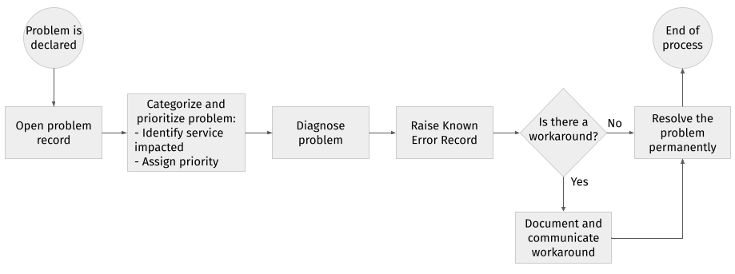

# Gestion des problèmes

L'objectif global de la gestion des problèmes est d'identifier la cause première des incidents (incidents de sévérité 1 ou incidents survenus plus d'une fois) ou les causes potentielles des incidents, puis de mettre en œuvre immédiatement des actions pour améliorer ou corriger la situation.

La procédure de gestion des problèmes garantit que :

* les problèmes sont correctement enregistrés
* les problèmes sont correctement acheminés
* le statut des problèmes est rapporté avec précision
* la file d'attente des problèmes non résolus est visible et rapportée
* les problèmes sont correctement priorisés et traités dans l'ordre approprié
* la résolution fournie répond aux exigences de l'accord de niveau de service (SLA) convenu
* la résolution des causes premières ou des problèmes est effectuée

## Identification des problèmes

Un problème est déclaré par la partie prenante concernée de la gestion des services dans les situations suivantes :

* lorsqu'il y a un incident dont le propriétaire de l'incident ne peut pas établir la cause dans le cadre de l'accord de niveau de service défini
* lorsqu'il y a des occurrences répétées d'un incident avec un impact considérable sur l'activité
* lorsqu'il y a une dégradation du service ou un écart par rapport au comportement attendu susceptible d'affecter l'activité à l'avenir s'il n'est pas atténué, et dont l'atténuation n'est pas bien établie

Dans l'un des scénarios ci-dessus, ou tout autre scénario que le responsable des problèmes peut juger applicable, un enregistrement de problème sera ouvert et le processus de gestion des problèmes sera lancé.

Si un problème s'avère être causé par un défaut du produit, un bogue est signalé conformément au [processus de triage des défauts](defect-triage.md).

## Catégorisation et priorisation des problèmes

Afin de déterminer si les SLA sont respectés, il est nécessaire de catégoriser et prioriser les problèmes rapidement et correctement.

L'objectif d'une catégorisation appropriée est de :

* identifier le service impacté
* associer les problèmes aux incidents connexes
* indiquer quels groupes de support doivent être impliqués
* fournir des métriques significatives sur la fiabilité du système

Pour chaque problème, le service spécifique sera identifié.

La priorité attribuée à un problème déterminera la rapidité avec laquelle il sera programmé pour résolution. La priorité est définie en fonction d'une combinaison de la sévérité et de l'impact des incidents associés.

Le tableau ci-dessous fournit des orientations sur la façon de classifier un problème. Pour savoir comment lire ce tableau, voir les exemples suivants :

* Un problème de sévérité élevée et d'impact faible sera classé comme un problème de priorité moyenne (vérifier la cellule à l'intersection de sévérité élevée et impact faible).
* Un problème de sévérité moyenne et d'impact élevé sera classé comme un problème de priorité élevée (vérifier la cellule à l'intersection de sévérité moyenne et impact élevé).

<table>
<caption><strong>Matrice de priorité des problèmes</strong></caption>
<colgroup>
<col style="width: 20%" />
<col style="width: 20%" />
<col style="width: 20%" />
<col style="width: 20%" />
<col style="width: 20%" />
</colgroup>
<thead>
<tr class="header">
<th></th>
<th colspan="4"><strong>SÉVÉRITÉ</strong></th>
</tr>
</thead>
<tbody>
<tr class="odd">
<td></td>
<td></td>
<td>
<strong>Faible</strong> 
 
Le problème empêche l'utilisateur d'accomplir une partie de ses tâches.
</td>
<td>
<strong>Moyenne</strong> 
 
Le problème empêche l'utilisateur d'exécuter des fonctions critiques sensibles au temps.
</td>
<td>
<strong>Élevée</strong> 
 
Un service ou une partie majeure d'un service est indisponible.
</td>
</tr>
<tr class="even">
<td rowspan="3">
<strong>IMPACT</strong>
</td>
<td>
<strong>Faible</strong> 
 
Le problème affecte un ou deux membres du personnel.

Niveaux de service dégradés mais toujours dans les limites des SLA.
</td>
<td>
Faible
</td>
<td>
Faible
</td>
<td>
Moyenne
</td>
</tr>
<tr class="odd">
<td>
<strong>Moyen</strong> 
 
Niveaux de service dégradés mais ne respectant pas les contraintes SLA ou ne pouvant fournir qu'un niveau minimum de service.

La cause du problème semble affecter plusieurs domaines fonctionnels.
</td>
<td>
Moyenne
</td>
<td>
Moyenne
</td>
<td>
Élevée
</td>
</tr>
<tr class="even">
<td>
<strong>Élevé</strong> 
 
Tous les utilisateurs d'un service spécifique sont affectés.

Un service destiné aux clients est indisponible.
</td>
<td>
Élevée
</td>
<td>
Élevée
</td>
<td>
Élevée
</td>
</tr>
</tbody>
</table>

## Documentation des solutions de contournement

Une solution de contournement définit un moyen temporaire de surmonter les effets négatifs d'un problème. Les solutions de contournement peuvent être :

* des instructions fournies au client sur la façon d'accomplir son travail en utilisant une méthode alternative
* des correctifs temporaires qui aident un système à fonctionner comme prévu mais qui ne résolvent pas le problème de manière permanente

Les solutions de contournement doivent être documentées et communiquées au Service Desk afin qu'elles puissent être ajoutées à la base de connaissances. Cela garantira que les solutions de contournement sont accessibles au Service Desk pour faciliter la résolution lors de récurrences futures de l'incident.

Dans les cas où une solution de contournement est trouvée, il est important de documenter tous les détails de la solution de contournement dans l'enregistrement du problème et que l'enregistrement du problème reste ouvert.

## Documentation des erreurs connues

Lorsqu'un diagnostic est établi pour identifier un problème et ses symptômes, un enregistrement d'erreur connue doit être créé et placé dans la documentation des erreurs connues. Si des incidents ou des problèmes récurrents surviennent, ils peuvent être identifiés et le service restauré plus rapidement. Toute solution de contournement ou résolution doit également être documentée dans l'enregistrement d'erreur connue du problème concerné.

Dans certains cas, il peut être avantageux de créer un enregistrement d'erreur connue encore plus tôt dans le processus global – à titre informatif par exemple – même si le diagnostic n'est pas terminé ou qu'une solution de contournement n'a pas encore été trouvée.

L'enregistrement d'erreur connue doit contenir tous les symptômes connus afin que, lorsqu'un nouvel incident survient, une recherche dans les erreurs connues puisse être effectuée et la correspondance appropriée trouvée.

## Processus

La figure suivante présente un résumé du processus décrit ci-dessus.

