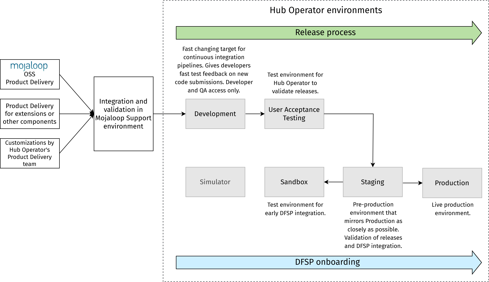
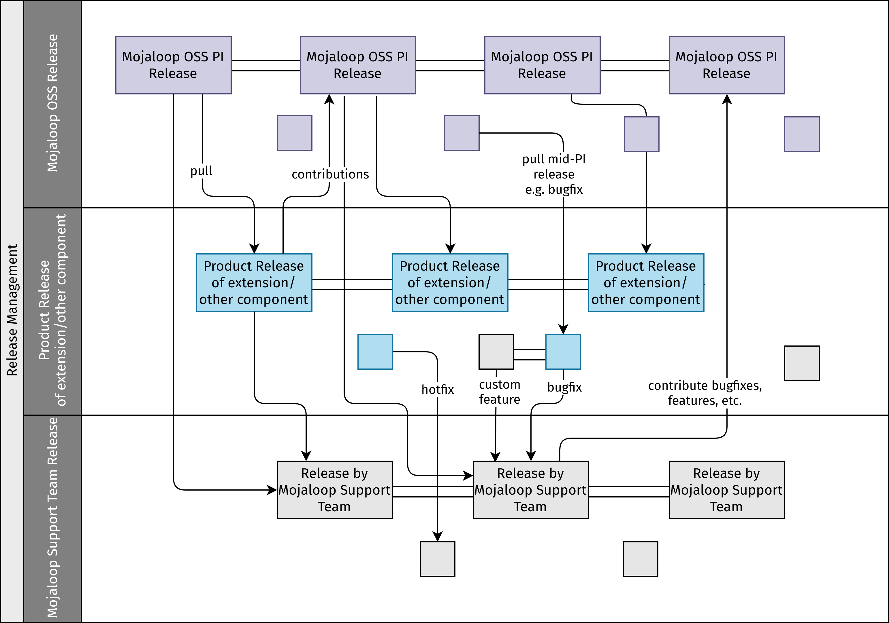
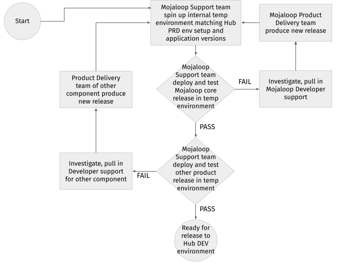

# Gestion des mises en production

La gestion des mises en production gère les processus de gestion, de planification, de programmation et de contrôle d'une modification logicielle à travers le déploiement et les tests dans divers environnements.

::: tip NOTE
Les processus décrits dans cette section représentent les bonnes pratiques et servent de recommandations pour les organisations remplissant un rôle d'opérateur du Hub.
:::

::: tip NOTE
Cette section fait référence à une « équipe de support Mojaloop » : une équipe dédiée à l'exécution des services de support pour les opérations techniques d'un Hub Mojaloop. Notez que cette équipe peut être une unité internalisée ou externalisée, selon le niveau d'expertise ou de capacité au sein de votre organisation. Si vous décidez d'externaliser les fonctions de support, il existe des organisations au sein de la communauté Mojaloop qui fournissent différents niveaux de support en tant que service. (Pour plus d'informations et des recommandations, contactez la Fondation Mojaloop.)
:::

## Composants de mise en production et environnements

Lors de l'acceptation de nouvelles versions de Mojaloop Open Source pour les services Switch et autres composants nécessaires, les versions passent par une série d'activités de test dans des environnements progressivement plus élevés, en commençant par les environnements de développement/QA et en terminant par les tests de niveau production.

La configuration d'environnement recommandée comprend plusieurs environnements servant tous des objectifs différents, comme illustré dans le diagramme ci-dessous.

Une implémentation spécifique au Hub de Mojaloop est construite sur un certain nombre de composants de service (Mojaloop OSS, extensions ou autres composants, personnalisations potentielles), et les versions incluront de nouvelles fonctionnalités, des améliorations ou des corrections de bogues de tous ces composants.

## Développement et tests (Définition de terminé)

Les pratiques standard de développement et de QA – suivies par l'équipe de développement/livraison produit Mojaloop – incluent les éléments suivants dans le cadre de la définition de terminé. La recommandation est que l'opérateur du Hub adopte une stratégie similaire.

* Tests unitaires développés pour chaque morceau de code écrit.
* Le code, les tests unitaires et la documentation ont été revus par les pairs.
* Les tests d'intégration ont été développés et exécutés.
* Les tests de régression complets ont été exécutés avec succès lors du commit (fusion dans la branche master).
* Les notes de version ont été créées avec les détails suivants :
    * Description des changements
    * Liste des composants/services modifiés
    * Liste des user stories et bogues dans la version
    * Mise en évidence de tout changement fondamental (rupture) impactant toute fonctionnalité, solution API ou architecture système
* Runbook de déploiement créé, avec les instructions de déploiement et de retour en arrière, y compris les variables d'environnement, les scripts de mise à jour de base de données et les prérequis de déploiement.
* Maintenance des définitions de tests de régression, des résultats de tests de référence de Mojaloop OSS et des critères de validation spécifiques au schéma (tests) ajoutés en complément.
* Maintenance d'une base de connaissances sur tout changement nouveau ou significatif concernant les fonctionnalités, produits, architecture, etc., relatifs à Mojaloop OSS et autres composants, ainsi que les personnalisations effectuées pour le schéma. La base de connaissances sert de base pour le transfert de connaissances à l'équipe des opérations. Ce transfert comprend un examen complet du runbook de déploiement et d'autres artefacts de version, tels que les packages de version et les scripts de base de données, qui aideront grandement l'équipe des opérations dans les opérations quotidiennes, la validation, le débogage des problèmes et la maintenance.

## Versions de Mojaloop

La pratique standard pour les versions de Mojaloop est la suivante :

* Toutes les nouvelles versions des applications individuelles, composants et microservices qui composent Mojaloop sont disponibles via les charts Helm dans les dépôts publics ici : <https://github.com/mojaloop/helm/releases>
* Les tests unitaires et certains tests d'intégration fonctionnels sont produits avec chaque version de composant.
* La version de Mojaloop inclut également des tests de régression automatisés de bout en bout. Les suites de tests sont versionnées, le numéro de version correspondant au numéro de version de la version de Mojaloop.
* Un package de version est produit, une fois par incrément de programme (PI), pour les nouvelles versions de Mojaloop. Cela inclut les mises à niveau des applications individuelles, composants et microservices au sein de Mojaloop. \
\
Un incrément de programme est un intervalle limité dans le temps pendant lequel une équipe Agile livre une valeur incrémentale.
* Toutes les mises à jour de maintenance de Mojaloop, les nouvelles fonctionnalités et les corrections de bogues sont mises à disposition des utilisateurs de Mojaloop dans le cadre des cycles de publication, une fois par période PI.

## Versions de produits d'extensions/composants supplémentaires

Il est recommandé que la pratique standard pour les versions de produits d'extensions/composants supplémentaires soit alignée sur le processus de publication de Mojaloop [ci-dessus](release-management.md#mojaloop-releases) :

* Toutes les nouvelles versions de produits sont mises à disposition via des packages de version et décrites dans les notes de version.
* Un package de version inclut des tests automatisés de bout en bout pour chaque version de produit. Les suites de tests sont versionnées, le numéro de version correspondant au numéro de version de la version du produit.
* Les versions de produits sont alignées sur la cadence de publication de Mojaloop, une fois par période PI.
* Toutes les mises à jour de maintenance des produits, les nouvelles fonctionnalités et les corrections de bogues sont mises à disposition des DFSP clients des extensions/produits supplémentaires dans le cadre du cycle de publication, une fois par période PI.

## Bogues et correctifs urgents

Les bogues et correctifs urgents sont traités de la manière suivante :

* Toutes les corrections de bogues (à la fois Mojaloop et autres produits) sont incluses dans les packages de version.
* De même, les correctifs urgents sont également fournis via une version. Il n'est pas recommandé de déployer des correctifs urgents directement à partir des versions de packages d'applications spécifiques, car le déploiement d'un seul composant d'une version (par opposition au déploiement de la version qui inclut le composant mis à jour) peut entraîner une désynchronisation du Hub avec la version du package d'application.
* Les bogues sont suivis, gérés et priorisés comme défini dans le [processus de triage des défauts](defect-triage.md) :
    * L'outil Service Desk est utilisé pour la gestion de tous les bogues.
    * Une équipe de triage du support Mojaloop avec des représentants des équipes de livraison produit et de gestion de produit de Mojaloop et d'autres produits est impliquée dans l'analyse de l'urgence et de l'impact pour déterminer la priorisation des bogues, y compris la planification/programmation de la résolution et la communication à l'opérateur du Hub.

## Environnements et stratégie QA

Afin de valider un déploiement d'une version nouvellement publiée de Mojaloop par rapport aux derniers autres produits (extensions/composants supplémentaires), un environnement doit être mis en place par le schéma avec tous les composants nécessaires ainsi que la configuration spécifique que le schéma utilise. Cela permet aux équipes de QA/validation et/ou de support Mojaloop (une équipe dédiée à l'exécution des services de support pour les opérations techniques d'un Hub Mojaloop) d'effectuer le déploiement et les tests des versions de Mojaloop par rapport aux dernières versions des autres produits.

::: tip NOTE
L'environnement mis en place par l'équipe de support Mojaloop pour la validation doit suivre une infrastructure standard, reproduisant ou simulant une configuration de production correspondante autant que possible, afin que tout problème ou bogue puisse être identifié tôt dans le processus. Une configuration de production comprend généralement des passerelles API, des DMZ, une configuration de cluster basée sur des zones de sécurité, ainsi que tous les composants et personnalisations nécessaires (y compris les règles du schéma) effectuées par le schéma. L'opérateur du Hub doit s'assurer que son infrastructure de production est entièrement synchronisée avec les normes d'infrastructure de l'équipe de support Mojaloop.
::: 

Suite au déploiement et à la validation réussis d'une version sur l'infrastructure et l'architecture standard, et après avoir exécuté avec succès la dernière version de Mojaloop et des autres produits, la version est approuvée et peut être partagée/mise à disposition (via le serveur/dépôt client de l'équipe de support). L'équipe du Hub peut alors programmer le déploiement dans l'environnement (potentiellement personnalisé) de l'opérateur du Hub.

La stratégie QA employée par les équipes de livraison produit de Mojaloop et des produits d'extension garantit que le nouveau code de chaque composant de service a subi des tests complets avant sa publication. La stratégie QA de l'équipe de support Mojaloop, en revanche, doit se concentrer sur la validation de la déployabilité des composants de service intégrés et l'interopérabilité des produits, garantissant qu'il existe un Switch Mojaloop fonctionnel, qui peut ensuite être déployé dans l'environnement d'un opérateur du Hub.

## Processus de mise en production

La recommandation pour les implémentations de Hub est de rester alignée sur la cadence de publication de Mojaloop d'une version par période PI et d'éviter de déployer des changements individuels directement depuis la branche master d'applications, composants ou services spécifiques au sein de Mojaloop. Cette recommandation garantit que l'intégrité des applications reste plus propre et alignée sur les dépôts sources.

Pour chaque version, il est recommandé que l'équipe de support Mojaloop suive les étapes suivantes :

::: tip NOTE
Les opérateurs du Hub doivent être informés de la date de publication cible bien à l'avance.
:::

1. L'équipe de support Mojaloop examine tous les artefacts de version, y compris les notes de version et la documentation associée, et crée ou améliore le runbook de déploiement dès que la version est disponible.
1. L'équipe de support Mojaloop effectue le déploiement et la validation des versions planifiées de Mojaloop et d'autres produits dans un environnement de support Mojaloop temporaire (utilisant l'infrastructure de support Mojaloop standard mais correspondant aux versions d'applications du client – c'est-à-dire de l'opérateur du Hub).
1. Suite au déploiement et à la validation réussis d'une version sur l'infrastructure et l'architecture de support Mojaloop standard, et après avoir testé avec succès la dernière version de Mojaloop et des autres produits, la version est approuvée et mise à disposition de l'opérateur du Hub.
1. L'équipe de l'opérateur du Hub confirme la disponibilité (et éventuellement, la fenêtre de déploiement cible) pour le déploiement dans l'environnement de développement de l'opérateur du Hub. \
\
Il est de la responsabilité de l'opérateur du Hub d'effectuer le déploiement dans l'environnement de développement et la validation ultérieure. Alternativement, il peut demander au support Mojaloop d'effectuer ces activités en son nom.

### Déploiements par l'équipe de support Mojaloop

Si l'opérateur du Hub demande à l'équipe de support Mojaloop d'effectuer le déploiement dans l'environnement de développement de l'opérateur du Hub, alors l'équipe de support Mojaloop envoie un courriel (ou toute autre forme de communication selon les préférences de l'opérateur du Hub) avec des informations sur la date de publication cible, l'éventail des fonctionnalités incluses dans la version et la fenêtre de déploiement. Suite au déploiement, une communication supplémentaire est envoyée pour confirmer que le déploiement a été effectué, validé et que la fenêtre de déploiement est fermée.

## Diagramme de flux du processus

