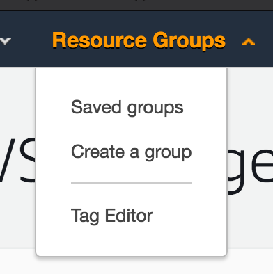
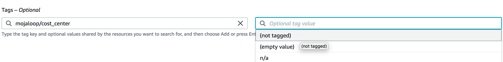
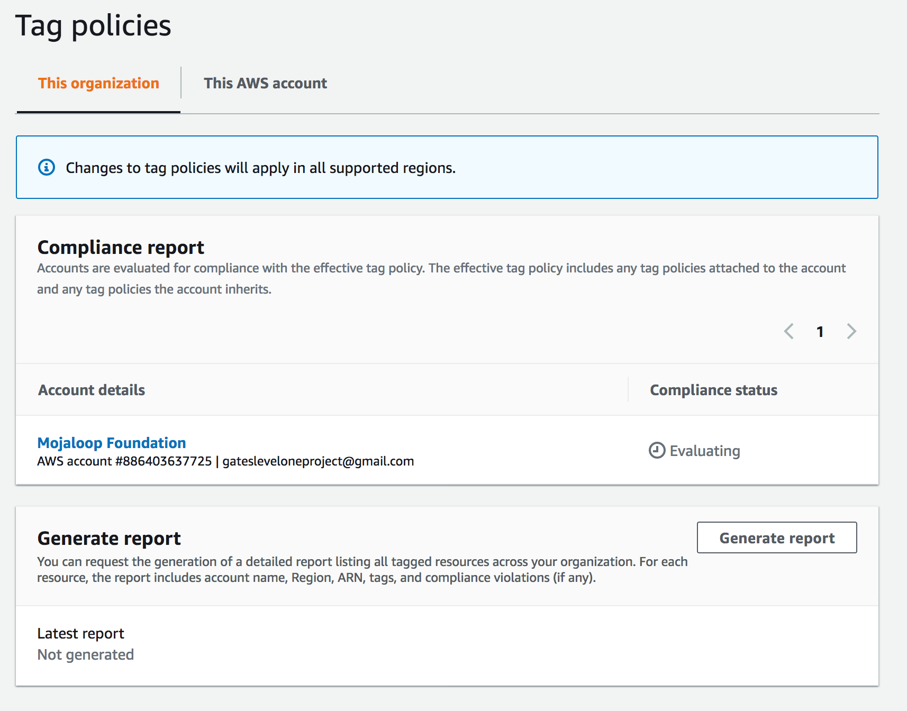
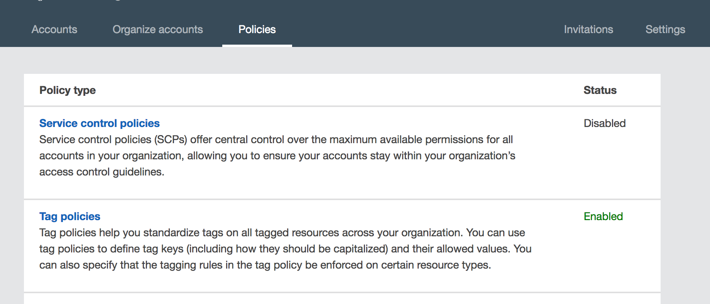
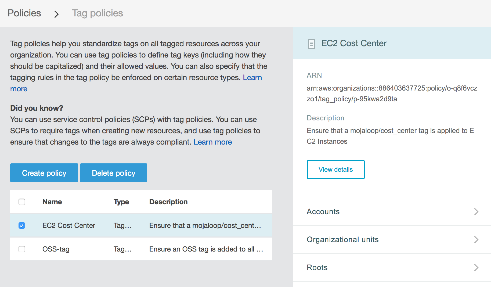
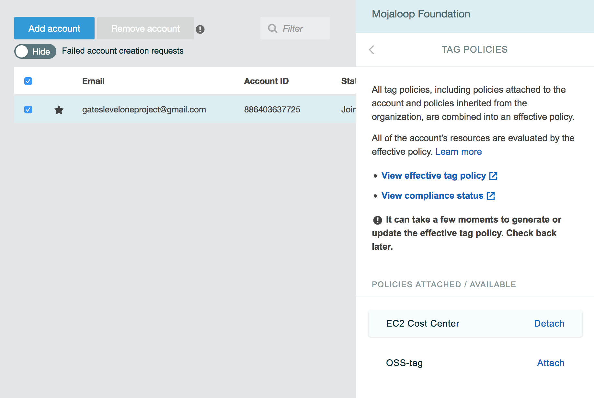

# Lignes directrices et politiques d’étiquetage AWS

> **Note :** Ces lignes directrices concernent l’environnement AWS de la communauté Mojaloop pour les tests et la validation des installations Mojaloop ; elles sont surtout internes. Elles peuvent toutefois servir de référence pour des stratégies d’étiquetage similaires dans d’autres organisations.

Pour mieux gérer et comprendre notre usage et nos dépenses AWS, nous appliquons les règles d’étiquetage suivantes.

## Sommaire
- [Étiquettes proposées et signification](#proposed-tags)
    - [mojaloop/cost_center](#tag-cost-center)
    - [mojaloop/owner](#tag-owner)
- [Étiquetage manuel](#manual-tagging)
- [Étiquetage automatisé](#automated-tagging)
- [Politiques d’étiquetage AWS](#aws-tagging-policies)
    - [Rapports de conformité des étiquettes](#tag-reports-compliance)
    - [Modifier les politiques d’étiquetage](#editing-tag-policies)
    - [Attacher / détacher des politiques d’étiquetage](#attach-detach-tag-policies)

## Étiquettes proposées et signification

Nous proposons les deux clés d’étiquette suivantes :

- `mojaloop/cost_center`
- `mojaloop/owner`

### `mojaloop/cost_center`

`mojaloop/cost_center` ventile les ressources AWS par fil de travail ou projet qui génère les coûts associés.

Le format suit approximativement `<compte>-<objectif>[-sous-objectif]`, où le compte est par ex. `oss`, `tips` ou `woccu`.
> Note : la plupart des ressources seront probablement sous le « compte » `oss` ; des ressources plus anciennes peuvent relever de `tips` ou `woccu`. Prévoir aussi de futurs types de ressources.

Exemples de valeurs pour `mojaloop/cost_center` :

- `oss-qa` : travail QA open source (environnements dev1, dev2 existants)
- `oss-perf` : performance open source (fil performance en cours)
- `oss-perf-poc` : POC performance / architecture

Valeurs spéciales réservées :
- `unknown` : la ressource a été évaluée (manuellement ou par outil) et aucun `cost_center` approprié n’a pu être déterminé.
  - Permet de filtrer `mojaloop/cost_center:unknown` et d’éditer un rapport.
- `n/a` : la ressource ne génère pas de coût ; l’assignation d’un `cost_center` importe peu.
  - Utile pour étiqueter en masse des ressources difficiles à classer (ex. groupes de sécurité EC2).

### `mojaloop/owner`

`mojaloop/owner` désigne la personne responsable de la gestion et de l’arrêt d’une ressource donnée.

L’objectif est d’éviter les ressources longues durée que tout le monde croit connues alors qu’elles ne sont plus nécessaires. Cette étiquette indique à qui s’adresser pour des questions sur la ressource.

La valeur est le nom de la personne, tout en minuscules :
- `lewis`
- `miguel`
- etc.

Valeurs réservées :
- `unknown` : la ressource a été évaluée et aucun propriétaire approprié n’a pu être déterminé (à noter : dans l’original anglais, le texte répétait par erreur « cost_center » au lieu de « owner » pour cette puce).
  - Permet de filtrer `mojaloop/owner:unknown` et d’identifier les ressources « orphelines ».

## Étiquetage manuel

Utiliser le « Tag Editor » dans la console AWS pour rechercher les ressources non étiquetées.

1. Connexion à la console AWS
2. Sous Resource Groups, sélectionner « Tag Editor »

3. Choisir une région (souvent « All regions ») et un type de ressource (souvent « All resource types »)
4. Cliquer sur « Search Resources » et attendre la liste

On peut aussi rechercher par étiquettes ou par absence d’étiquettes.

5. Une fois la liste obtenue, sélectionner et modifier les étiquettes pour plusieurs ressources à la fois
6. Exporter un fichier `.csv` des ressources trouvées

## Étiquetage automatisé

Nous automatisons l’étiquetage pour les éléments suivants (liste évolutive).

À mesure que les règles se stabilisent, il faut les intégrer dans l’outillage pour limiter l’étiquetage manuel.

Pour l’instant, cela inclut notamment :
1. Rancher — gestion des clusters Kubernetes QA et performance
2. IaC — code IaC à venir pour les environnements de développement

## Politiques d’étiquetage AWS

Depuis le 3 août 2020, nous introduisons les [politiques d’étiquetage AWS](https://docs.aws.amazon.com/organizations/latest/userguide/orgs_manage_policies_tag-policies.html) pour renforcer les étiquettes et le suivi des ressources (notamment les coûts).

### Rapports de conformité des étiquettes

1. Connexion à la console AWS
2. « Resource Groups » > « Tag Editor »
3. Dans la barre latérale gauche, « Tag Policies »

On y voit le rapport de conformité des politiques d’étiquettes.

### Modifier les politiques d’étiquetage

> Note : peut nécessiter des droits administrateur.

1. Connexion à la console AWS
2. En haut à droite : « username@mojaloop » > « My Organization »
3. « Policies » > « Tag Policies »

4. Consulter les politiques d’étiquetage en vigueur

5. Dans la barre latérale : « View details » > « Edit policy » pour modifier

### Attacher / détacher des politiques d’étiquetage

1. Page « My Organization »
2. Sélectionner le compte concerné > « Tag policies » dans la barre latérale
3. Attacher ou détacher les politiques d’étiquetage

