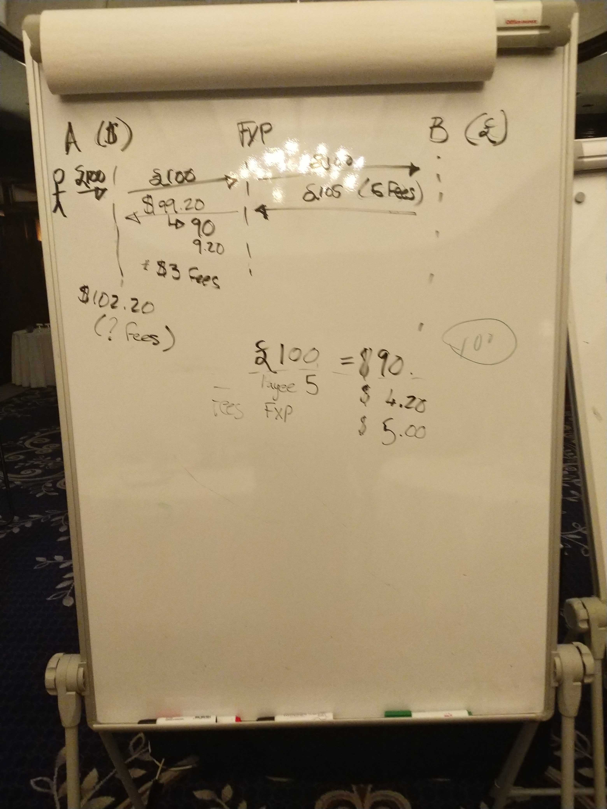

# Discussion transfrontalière — jour 1

>**Liens**
>- [Notes du jour 2](./cross-border-day-2.md)
>- [Ticket pertinent sur le tableau DA](https://github.com/mojaloop/design-authority/issues/32)
>- [Pull request sur la spec Mojaloop](https://github.com/mojaloop/mojaloop-specification/pull/22)

## Participants :

Présents sur place
- Lewis, Crosslake
- Adrian, Coil
- Nico, MB
- Sam, MB
- Miguel, MB
- Carol Benson, Glenbrook
- Michael Richards, MB
- Henrik Karlsson, Ericsson
- Rob Reeve, MB
- Vanburn, Terra Pay
- Razin, Terra Pay
- Ram, Terra Pay
- JJ, Google
- Matt Bohan, Gates Foundation
- David Power, EY
- James Bush, MB
- Warren, MB
- Judit, MB
- Bart-Jan et Bruno de la GSMA — jour n°2

Téléphone
- Kim Walters, Crosslake
- Istvan Molnar, DPC
- Innocent Ephraim, MB

## Session 1

**Objectif : mettre à jour les définitions d’API**

- Confidentialité :
  - Puis-je envoyer des USD ? _oui/non_
  - Que puis-je envoyer ? _liste des devises_

Accords commerciaux : plusieurs possibilités
- Schéma global, composé d’accords schéma à schéma
- Accords schéma bilatéraux
- Schéma à schéma
- Région

Définitions :
- Gateway FSP : un FSP qui « fait le pont » entre 2 réseaux
ex. Mowali
  - 2 réseaux logiques (USD, XOF ?)
  - un seul réseau Mojaloop

- Cross Network Provider (CNP)
  - FXP, la même chose ?

Michael :
- il y a une raison à cette hypothèse
- autres implications juridiques ici…

- entité unique, juridiquement dans 2 juridictions différentes
  - proche analogie d’un schéma sans juridiction

- participant :
  - a un compte de transaction qui peut être débité ou crédité
  - banque, fxp, etc.

>Q : Peut-on avoir un participant qui ne règle pas ? Ou est-ce couvert par un CNP qui est partie
>ex. Visa, ne règle pas toujours sur un marché donné, mais détient un compte

- Résident vs non-résident
  - exigences de reporting différentes

- quelles exigences techniques pour les reporters ?

- règlement
  - pas trop d’inquiétude à ce stade (focus sur les changements d’API)
  - on suppose que le règlement est possible, mais il faut d’abord cadrer le périmètre avec l’API

- Pas seulement Mojaloop
  - il faut permettre les transferts non-Mojaloop → Mojaloop et l’inverse (entrant et sortant)
  - doit rester interopérable

- qui fournit le routage ?
  - switch ?
  - ALS ?
  - CNP ?

>*Suivi :* Besoin d’une définition formelle des rôles FXP et CNP, avec exigences et responsabilités

Au niveau schéma
  - le schéma doit-il tenir une liste des autres schémas avec lesquels il autorise ses FSP à se connecter ?
  - ou le CNP s’en charge-t-il ?

- pas schéma → schéma, mais partie du processus d’onboarding CNP
- mais le schéma peut / doit toujours maintenir des règles

- comment fonctionnera le devis ? Un FSP envoie-t-il plusieurs devis, un par CNP ? Ou le switch a-t-il un moteur de règles pour déterminer vers qui envoyer ?

James : Nous voulons de la flexibilité. On peut imaginer les deux cas ; ne pas trop présumer à ce stade.

Option la plus simple : le switch parle à l’ALS, détermine que le transfert n’est pas dans notre réseau, puis obtient une liste de CNP

CNP + FXP → essentiellement la même chose
- ce sont des *rôles*, et un DFSP peut en assumer plusieurs
- les fxps peuvent aussi exister dans plusieurs zones (ex. cas Mowali)
  - fxp sur un seul réseau = juste un fxp,
  - fxp multi-réseaux est probablement aussi un CNP

## Session 2 

- débat sur recherche unique ou multiples
  - on ne devrait jamais renvoyer un « résultat vide »

- les portefeuilles sont-ils adressables par MSISDN ?
  - un seul compte pour l’instant
  - mais c’est interne au switch
  - le rôle de l’oracle est de convertir MSISDN → adresse Mojaloop

- à l’avenir : MSISDN + comptes seront moins liés
  - ce sujet touche à l’adressage

- « sortir » de Mojaloop pour l’adressage sera un peu délicat
- Standardiser l’adressage ?
  - pas quelque chose que nous voulons

Ram : Il existe déjà des outils (pas besoin de réinventer la roue), hors schéma Mojaloop

- envoi vers devise inconnue
  - actuellement : 1 réponse de table de routage
  - futur : plusieurs réponses

- confidentialité :
  - pas besoin de règles strictes pour l’instant (au moins pas au niveau API ; les règles viennent avec les schémas)
  - il nous faut une méthode pour médiatiser les informations qu’un switch exige d’un autre (et refuser les devis si les prérequis ne sont pas remplis)

---
- Domestique vs transfrontalier : l’utilisateur a / a besoin d’informations différentes
  - ex. voulons-nous limiter la découverte au cas domestique ?
---

Adrian : Beaucoup de choses relèvent des règles métier et du schéma spécifique
- maintient l’espace concurrentiel
- Quelle quantité d’information dans le :
  - lookup ?
  - devis ?

---
- Proposition : recherche d’adresse → renvoie plusieurs réponses ?
- MSISDN → ID, pas une adresse. Quelqu’un, pas un compte

- il ne devrait y avoir qu’une seule réponse de l’ALS
- Michael n’est pas d’accord

- il faut séparer *l’adressage* du *routage*

- il faut réfléchir aux effets en aval sur les tests
  - trouver un moyen clair de tester ces recherches

Par exemple, le cas Airtel UPI (où des MSISDN existants ont été remplacés lors du passage des clients mobiles vers l’argent mobile)
  - il faut éviter une situation de ce type

---

Revenir aux principes L1P
- les transferts doivent s’apurer immédiatement
- pas de « futur »

- Pour le domestique : on peut garantir la livraison, mais le transfrontalier est beaucoup plus difficile
- il faut maintenir l’exigence de transparence sur les CNP
  - cela revient aux règles métier

- Transactions réversibles ou règles sur les problèmes en aval
  - ILP gère *la plupart* de cela pour nous

- dans le cas TIPS : 1 ID mappe vers 1 compte
- comme toujours, compromis entre confidentialité et fonctionnalités (et c’est acceptable !)

---

À la fin d’un devis :
- ValueDate
- combien sera reçu
- quels sont les frais ? (détail par étape et devise)

---

Comment prendre en charge les protocoles qui ne supportent pas les devis (question pour les systèmes moja vers non-moja)

Risque : CNP : ils portent le risque dans ce type de transaction

CNP comme participant ?
 - détient un compte chez un participant
 - approche directe vs indirecte
 - cela n’affecte pas les exigences techniques (hors périmètre de cette discussion)

---

- envoi fixe et réception fixe :
  - Dans quel sens faut-il ajouter les données au devis ? Cela dépend du fait qu’on fixe l’envoi ou la réception

- Soit : « A envoie 20 USD à B » OU « B reçoit 1000 PHP »

- traduire les frais pour l’utilisateur : le FXP __doit__ appliquer le même taux aux frais qu’au transfert principal

- Du point de vue L1P : __l’objectif est la transparence__

- et les devis hors Mojaloop ?
  - le CNP doit s’en charger — c’est le dernier bastion de « mojaloopitude »

---

- Objet Participant
  - Attaché aux devis, une entrée par saut ?
  - Donc les devis multi-sauts contiennent _n_ objets participant, où _n_ = nombre de sauts + 1

Pour cela il nous faut :
- morceaux de données interopérables (définitions communes)
- schéma pour le chiffrement
- un endroit pour les données (dans l’objet devis)

Devons-nous nous préoccuper du chiffrement pour l’instant ?
- peut-être pas, mais il faut tout de même le prévoir dans l’API

Le chiffrement ajoute un défi d’intégration
- quel besoin d’avoir les données en clair ?
  - perspective technique : utiliser une clé de chiffrement vide

Devons-nous chiffrer pour que le(s) switch ne voie pas les données ?
  - peut-être pas à ce stade

>### Décision :
>- Pas de chiffrement pour l’instant
>- dans la requête de devis sortant : liste de données requises
>- pour la requête de devis entrant : les participants remplissent ces exigences
>- si les exigences ne sont pas remplies : abandonner le devis
>- Ne pas coder en dur les exigences de données ; utiliser les normes existantes

- il faut préciser si les champs _ont_ été vérifiés ou non
  - lié aux processus KYC par niveaux

- besoin d’un dictionnaire commun des données pouvant / devant être demandées

## Tableaux :

_tableau 1 : flux envoi fixe_

_tableau 2 : flux réception fixe_

