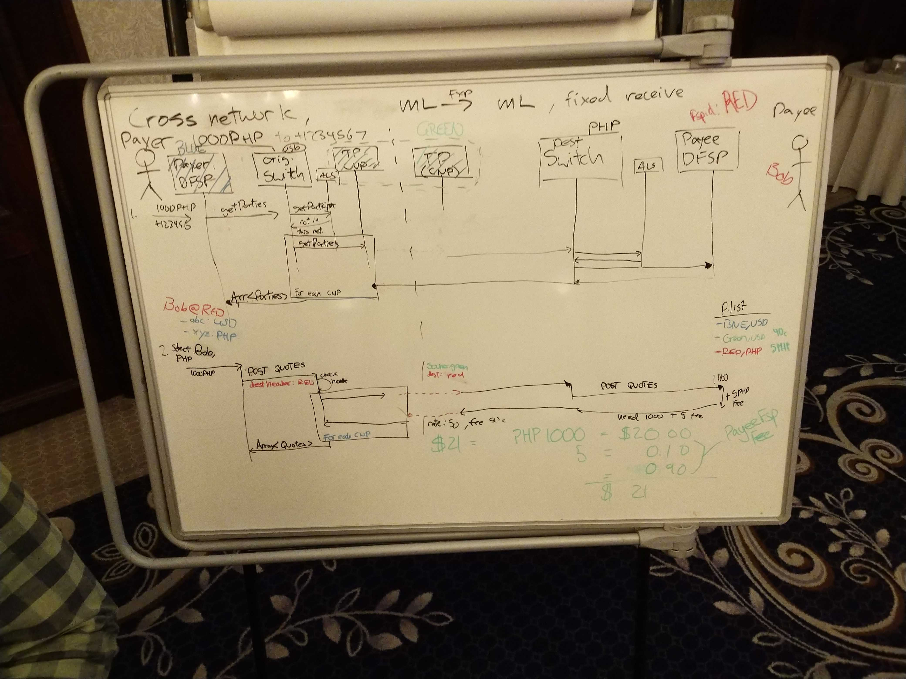

# Discussion transfrontalière — jour 2

>**Liens**
>- [Notes du jour 1](./cross-border-day-1.md)
>- [Ticket pertinent sur le tableau DA](https://github.com/mojaloop/design-authority/issues/32)
>- [Pull request sur la spec Mojaloop](https://github.com/mojaloop/mojaloop-specification/pull/22)

## Prochaines étapes :

- Mettre à jour les API proposées
- Présenter le changement consolidé au CCB par écrit
- Quelques semaines pour assembler les changements (Michael / Adrian de partager le travail)
- Appel CCB mi-novembre
 

## Session 1

Questions sans réponse :
- adressage
  - le décomposer ?
  - inter-mojaloop
  - que fait un PayerFSP avec une adresse ?

- ALS + routage
  - quelles optimisations l’API doit-elle faire / permettre ?

- identifiants DFSP locaux vs distants

- Défaillances en aval
  - Quand le paiement s’apure, le payeur reçoit-il une notification (surtout avec des paiements « retardés » qui peuvent interfacer avec des systèmes non Mojaloop)
  - Un CNP peut-il envoyer un `PATCH` de la transaction pour mettre à jour le bénéficiaire ?

---

- plusieurs devis et réponses de route :
  - comment les afficher à l’utilisateur ?
  - Il faut des règles de filtrage des routes
    - difficile : ex. blacklist d’un switch ? ou préférence pour certaines routes

- comment le DFSP émetteur découvre-t-il les règles du système du bénéficiaire ?
- le DFSP émetteur doit-il « connaître » le switch final ? Ou seulement le suivant ?

---

Tensions entre hypothèses ML et non-ML
- cela signifie-t-il que le CNP doit faire plus de travail en se connectant au non-ML ?
  - ex. connaître le schéma / switch résultant ?
    - pourquoi ? Gestion des échecs
    - selon la décision d’hier : le CNP doit-il faire ce travail ici ?

- Tirer une leçon de SWIFT :
  - la banque ne sait pas où va l’argent
  - peut-on éviter cela dans ML ?

---

CNP : objectif de « se comporter » comme un membre normal du réseau
  - Cela minimise les responsabilités que le schéma assume

Quand la transaction est-elle considérée comme terminée ?
  - Il peut y avoir des cas où le schéma la considère faite mais ce n’est pas techniquement fini bout à bout

Comment gérer la dégradation de service ?
  - Règles du schéma

---

Retour aux devis :

- comment exprimer l’information de devis ?
  - devis et routes séparés ? Probablement oui

- Les devis sont l’étape la plus coûteuse
  - Peut-on fournir des informations QOS ici dans le cadre du lookup ?

Adressage :
- Besoin d’une adresse globalement unique
  - Permettre un espace d’adresse pour les DFSP et les personnes / comptes uniques
- le schéma dit « ce n’est pas dans mon espace »
- le CNP détermine les routes pour atteindre cet espace

---

### Digression de Michael :

- avons-nous fait les mauvaises hypothèses sur le CNP ?

**switch :** connaît les CNP + FXP
**CNP :** détient la table de routage et le lookup

- si l’émetteur ou le bénéficiaire est un FXP, la transaction *n’est pas* une transaction multi-devises

--- 

## Session 2

*Décision :*
- la valeur d’en-tête est l’id CNP
- l’objet partId est le FSP final

valueDate
- sous-entendu que les fonds doivent s’apurer avant la valueDate
- on peut encore avoir des durées de vie courtes sur la transaction

- CNP :
  - renvoie un ensemble de frais obfusqué
  - s’intègre à notre modèle actuel

- condition :
  - objet existant lié cryptographiquement à l’objet transaction
    - mais pour multi-sauts, on ne connaît pas seulement cela
    - la réception fixe complique (ce que les données echo cherchent à résoudre)

  - Nous voulons **une seule condition pour tous les sauts**
  - l’idée de conditions multiples est une « perversion » (selon certains)

## Tableaux :

_tableau 3 : flux de recherche et devis inter-réseaux, réception fixe de 1000 PHP depuis USD_

