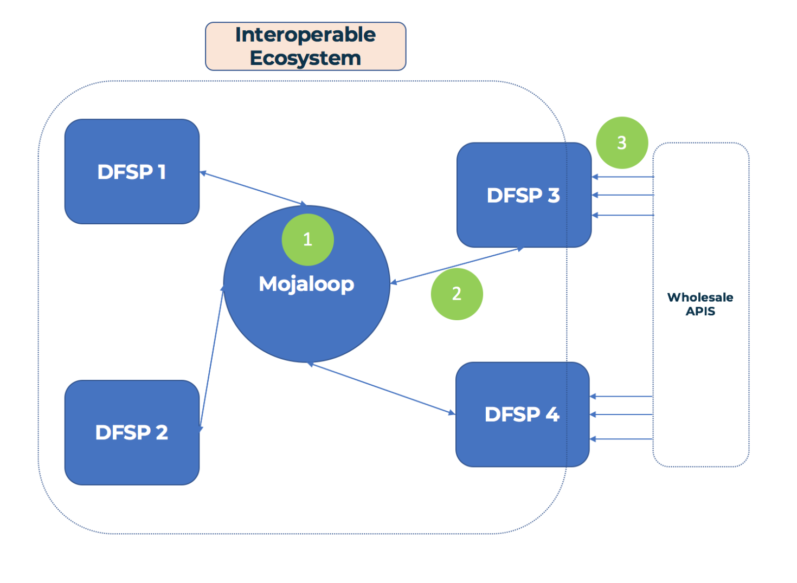

# Discussion Lab / établi Mojaloop

___Objectif :__ Ce document de discussion vise à exposer les arguments et à aligner la communauté autour du développement d’un environnement Lab Mojaloop à vocation pédagogique._

## 1. Objectifs de la réunion PI8

1. Définir les termes et poser les hypothèses
2. Dresser l’état des efforts existants et la manière dont la communauté OSS s’aligne (GSMA, MIFOS, ModusBox)
3. Définir les utilisateurs et cas d’usage, et exclure ceux dont on ne s’occupera pas
4. Recommandations pour plusieurs pistes de solution au « problème du Lab »
	- Documentation sur les cas métier et personas développés par Dan
	- Implémentation de base du configurateur de Lab, pour aider à construire des labs avec différentes fonctionnalités
    - Démo simple Mojaloop-sur-tableur, pour faire utiliser Mojaloop sans Postman
5. Implémentation et démo de base
6. Poser les questions importantes et discuter des prochaines étapes

## 2. Nomenclature

**1. Outils :**
- 1.1 Un dispositif utilisé pour accomplir une fonction
- 1.2 Des outils différents pour des fonctions différentes : on n’utilise pas un tournevis pour enfoncer un clou.
- 1.3 Dans le contexte Mojaloop, un exemple d’outil est la Bank Oracle
  - La Bank Oracle est un outil qui se branche sur le Account Lookup Service et permet à Mojaloop de se connecter à des comptes bancaires existants avec un IBAN

**2. Établi (Workbench) :**
- 2.1 Regroupe plusieurs outils au même endroit
- 2.2 Par exemple, rabot, scie sur table et ciseau constituent un établi de menuiserie, alors que scie à métaux, lime et meuleuse d’angle peuvent constituer un établi de métallerie
- 2.3 En langage Mojaloop, les outils pour tester les clés JWS de mon DFSP sont dans un autre établi que les outils qui montrent à une fintech comment les API de gros peuvent fonctionner au-dessus de Mojaloop

**3. Lab :**
- 3.1 Un lab est un lieu où l’on mène des expériences
- 3.2 On mène des expériences pour apprendre et tester nos hypothèses
  - Par exemple, un DFSP peut mettre en place et exécuter une _expérience_ où il envoie et reçoit des Quotes via une API en cours de développement
- 3.3 Un seul lab combine plusieurs établis au même endroit

**4. Simulateur :**
- 4.1 Un outil qui simplifie ou abstrait une fonction pour tester une chose à la fois
- 4.2 Les pilotes s’entraînent sur simulateur _avant_ de piloter un avion réel, dangereux et coûteux.
- 4.3 Dans Mojaloop : un simulateur peut simuler l’interaction avec un composant du système
  - Remplacer tout un switch pour tester une implémentation DFSP
  - Simuler 2 DFSP pour tester un déploiement de switch
  - Un simulateur réduit aussi le besoin qu’une personne accompagne celle qui teste. Un DFSP peut ainsi envoyer et recevoir via le switch sans interaction avec l’opérateur de hub.

## 3. Hypothèses

>_Certaines semblent évidentes, mais on les note quand même._

- 1\. La Gates Foundation souhaite encourager l’adoption de Mojaloop à tous les niveaux (pas seulement les switches)
- 2\. Nous n’avons pas besoin d’un lab pour couvrir le déploiement d’un Switch ou l’implémentation DFSP — ces besoins seront couverts ailleurs
- 3\. La communauté OSS Mojaloop veut se rendre attractive
  - Cela ne signifie pas supprimer toutes les barrières à l’entrée ; il s’agit d’identifier lesquelles lever

## 4. Utilisateurs

Nous distinguons deux groupes : utilisateurs primaires et secondaires.

### 4.1 Utilisateurs primaires
1. DFSP qui doivent s’intégrer à Mojaloop (raccourci : DFSP en implémentation)
2. Organisations / personnes souhaitant découvrir Mojaloop et construire ou tester des fonctionnalités ou cas d’usage en tant que DFSP (raccourci : DFSP en évaluation)
3. Organisations / personnes souhaitant découvrir Mojaloop et construire ou tester en tant qu’opérateur de hub (raccourci : opérateurs de hub en évaluation)
4. Régulateurs, organisations ou personnes souhaitant comprendre et évaluer Mojaloop et son impact sur leurs services existants (raccourci : évaluateurs généraux)

### 4.2 Utilisateurs secondaires
5. Intégrateurs souhaitant proposer Mojaloop as a Service ou des briques d’intégration (intégrateur système)
6. Contributeurs individuels (y compris chasseurs de primes ?) (contributeur individuel)
7. Fintechs opérant ou qui opéreront au-dessus d’un switch activé Mojaloop (fintech propulsée par Mojaloop)
8. Fournisseur d’applications tiers interagissant avec les API wholesale de l’argent mobile, vendant des intégrations aux fintechs, etc. (fournisseur d’apps tiers)
9. Acteurs de l’inclusion financière intéressés à promouvoir Mojaloop et d’autres technologies favorisant l’inclusion (défenseurs de l’inclusion financière)

En plus de chaque profil ci-dessus, il importe de situer le niveau auquel ces utilisateurs se rapportent à un déploiement Mojaloop. Nous empruntons à Dan Kleinbaum son article [_Fintech primer on Mojaloop_](https://medium.com/dfs-lab/what-the-fintech-a-primer-on-mojaloop-50ae1c0ccafb)

>_Les 3 niveaux de Mojaloopitude, https://medium.com/dfs-lab/what-the-fintech-a-primer-on-mojaloop-50ae1c0ccafb par Dan Kleinbaum_

**Niveau 1 :** Exploiter un switch Mojaloop (ex. opérateurs de hub)  
**Niveau 2 :** Interagir directement avec un switch Mojaloop (ex. DFSP, intégrateurs)  
**Niveau 3 :** Interagir avec un DFSP via un switch Mojaloop (ex. fintechs)  

## 5. Cas d’usage

__a.__ Tester une implémentation DFSP compatible Mojaloop  
__b.__ Valider des hypothèses sur Mojaloop  
__c.__ Consulter et utiliser une implémentation de référence  
__d.__ Comprendre les mécanismes internes de Mojaloop  
__e.__ Comprendre les switches activés Mojaloop et les cas d’usage associés (technologie)  
__f.__ Évaluer l’impact de Mojaloop sur le paysage des fintechs  
__g.__ Pouvoir démontrer une proposition de valeur pour les DFSP / fintech / etc. d’utiliser Mojaloop (plutôt qu’une technologie _x_)

## 6. Matrice utilisateurs / cas d’usage

Nous pouvons croiser utilisateurs et cas d’usage :

|  __Cas d’usage :__                    | a. Test impl. DFSP | b. Valider hypothèses | c. Impl. réf. | d. Internes | e. Tech | f. Cas métier  | g. Démontrer valeur ML |
| :----------------------------------- | :---: | :---: | :---: | :---: | :---: | :---: | :---: |
| __Utilisateur :__                            |       |       |       |       |       |       |       |
| __1. DFSP en implémentation__             |   X   |       |   X   |       |       |       |       | 
| __2. DFSP en évaluation__              |       |   X   |   X   |       |   X   |   X   |       |
| __3. Opérateur de hub en évaluation__       |       |       |   X   |       |   X   |   X   |       |
| __4. Évaluateur général__             |       |       |       |       |   X   |   X   |       |
| __5. Intégrateur système__            |   X   |   X   |   X   |   X   |       |       |   X   |
| __6. Contributeur individuel__        |       |   X   |   X   |   X   |       |       |       |
| __7. Fintech propulsée Mojaloop__      |       |   X   |       |       |   X   |   X   |   X   |
| __8. Fournisseur d’app tiers__        |       |       |       |   X   |       |       |   X   |
| __9. Défenseurs inclusion financière__ |       |   X   |       |       |       |   X   |   X   |

## 7. Entrées et sorties par cas d’usage

>_Choisir 2 ou 3 couples utilisateur / cas d’usage et détailler les entrées et sorties pour répondre à leurs besoins_
>>_Comme souvent, une partie des profils et conclusions reste floue et pourrait être reclasseée. Nous essayons néanmoins de les définir au mieux._

### 7.1 Opérateur de hub en évaluation + DFSP en implémentation
Comme indiqué dans nos hypothèses, nous ne traitons pas ici les opérateurs de hub ni les DFSP en implémentation.

### 7.2 DFSP en évaluation

>_Un DFSP en évaluation n’est pas forcément déjà rattaché à un switch ; c’est un acteur curieux de Mojaloop, candidat à l’évangélisation — sans objectif tangible de déploiement switch à court terme._

**7.2.1 Cas d’usage :**
- 1\. Valider des hypothèses sur Mojaloop (fonctionnement, périmètre, ce qu’il _ne_ fait pas)
- 2\. Explorer une implémentation de référence
- 3\. Comprendre les hubs activés Mojaloop et les cas d’usage (angle technique)
- 4\. Évaluer l’impact futur sur leur activité

**7.2.2 Exemples issus des personas :**
- 1\. Carbon — Encaissements et envois de fonds OTC via leur réseau d’agents
- 2\. Ssnapp — Paiements multi payeur / payé et points de fidélité sur Mojaloop
- 3\. Oneload — Simplifier l’onboarding d’autres DFSP vers le réseau d’agents OneLoad
- 4\. Juvo — Se brancher à un switch Mojaloop pour un marché du crédit et du scoring

**7.2.3 Sorties : (comment la communauté OSS Mojaloop peut mieux servir ces acteurs ?)**
- 1\. Aider à rejoindre l’écosystème Mojaloop
- 2\. Aider à comprendre la technologie, où elle excelle et les pièges possibles
- 3\. Minimiser l’investissement pour obtenir quelque chose qui tourne, afin de se concentrer sur des prototypes de cas d’usage
- 4\. Les faire passer de peu ou pas de connaissance Mojaloop à des prototypes réels

**7.2.4 Entrées : (ce qu’il faut faire pour atteindre ces objectifs)**
- 1\. Documentation Mojaloop améliorée pour ce rôle.
  - 1.1 Concevoir le parcours doc et d’onboarding pour les *DFSP en évaluation*
  - 1.2 Documentation accessible aux profils produit, etc., avec peu de bagage technique
- 2\. Plongée technique sur le « pourquoi » et le « comment » (réutiliser éventuellement le démonstrateur JS en parcours interactif bout en bout)
- 3\. Guides pour monter l’environnement sur 2–3 fournisseurs Kubernetes majeurs, self-service et scripts d’installation
- 4\. Charts Helm pour 1–2 simulateurs / labs déployables à côté d’un switch, avec réglages préconfigurés

### 7.3 Fintech propulsée par Mojaloop

>_Une fintech « Mojaloop-powered » opère ou souhaite opérer au-dessus d’un switch Mojaloop. Il existera inévitablement un chevauchement entre les fintechs et les DFSP dans cette classification, mais nous nous concentrons sur les fintechs au troisième niveau des « Mojaloop Spokes »._

**7.3.1 Cas d’usage :**
- 1\. Valider des hypothèses sur Mojaloop
- 2\. Comprendre l’alignement avec les API wholesale et ce qu’il faut pour qu’un DFSP les utilise via un switch Mojaloop
- 3\. Comprendre les hubs activés Mojaloop et les cas d’usage (technique)
- 4\. Évaluer l’impact futur sur leur activité

**7.3.2 Exemples issus des personas :**
- 1\. EastPay — Comparer et choisir banques / prestataires selon la structure de frais ouverte de Mojaloop
- 2\. Jumo — Ouvrir des marchés du crédit plus transparents au-dessus d’un switch Mojaloop ?

**7.3.3 Sorties :**
- 1\. Comprendre comment Mojaloop et les API wholesale s’articulent (ou non)
- 2\. Permettre aux fintechs d’interagir avec Mojaloop via 1 ou 2 API wholesale (ex. API MM GSMA)
- 3\. Passer de peu de connaissance à des prototypes réels

**7.3.4 Entrées :**
- 1\. Documentation Mojaloop adaptée à ce rôle.
- 2\. Documentation ou document de travail sur Mojaloop et les API wholesale
- 3\. Lab auto-déployé avec DFSP exposant des API wholesale de base pour tests fintech

## 8. Efforts OSS Lab / établi aux côtés d’autres acteurs

D’autres travaillent déjà sur une partie de ces besoins. Comment s’aligner pour : (1) ne pas dupliquer les efforts (ni se marcher sur les pieds) et (2) maximiser l’impact pour les utilisateurs finaux et la communauté ?

Consensus général :
- tout effort OSS Lab doit cibler un utilisateur final précis
- notre focus doit être plus loin sur les « spokes » (DFSP, fintechs, fournisseurs d’apps tiers)

### 8.1 MIFOS
- 1\. Travail déjà important avec Fineract, solution clé en main pour DFSP activés Mojaloop
- 2\. Travail sur des implémentations Open API
- 3\. Réduction des barrières pour DFSP et fintechs
- 4\. Mifos Innovation Lab : « La locomotion sur les rails Mojaloop »
  - 4.1 Démontrer des systèmes Mojaloop bout en bout avec intégration DFSP
  - 4.2 Construire et contribuer des outils OS
- 5\. Déploiements réels en cours
- 6\. Besoin d’un « point d’entrée unique » vers l’écosystème Mojaloop
- 7\. Déploiement Lab existant avec Mojaloop, en cours de mise à niveau vers les derniers charts Helm

### 8.2 GSMA
- 1\. API mobile money ; souhait d’une solution bout en bout fintech / DFSP via un switch Mojaloop
- 2\. Le Lab GSMA a une portée large ; Mojaloop n’en est qu’une facette
- 3\. Objectif majeur : API mobile money — standard par défaut pour l’intégration tiers
- 4\. Où se place Mojaloop ?
	- 4.1 Une des branches du Lab GSMA
	- 4.2 Où GSMA apporte-t-elle le plus de valeur à Mojaloop ?
		- 4.2.1 Répondre à un besoin marché pour maximiser l’impact
    - 4.2.2 Prototype bout en bout de l’API MM au-dessus d’un switch Mojaloop

### 8.3 ModusBox
- 1\. Perspective intégrateur : nombreux outils pour faciliter dev et onboarding switches / DFSP
- 2\. Mojaloop JS SDK open source
- 3\. Montrer « comment le moteur fonctionne » pour rassurer partenaires et clients
- 4\. Intérêt (notamment WOCCU) pour un lab où les fintechs apprennent et testent au-dessus des switches Mojaloop
  - 4.1 Une fois connecté, les cas d’usage intéressants dépassent les transferts A vers B
  - 4.2 Les IMF (surtout PME) ont peu de capacité d’expérimentation ; les fintechs peuvent porter les nouveaux cas
- 5\. Comment aider les org. peu techniques à gagner confiance avec Mojaloop ?
  - 5.1 Un lab technique ne suffit pas seul
  - 5.2 Mojaloop sur tableur ? Les tableurs sont universels.

## 9. Questions

- 1\. Beaucoup revient au cycle de vente proposé par la Gates Foundation pour l’adoption Mojaloop
  - 1.1 Les briefs techniques du hackathon montrent des acteurs __majeurs__ (Famoco, Ethiopay, GrameenPhone) qui pourraient emporter Mojaloop
  - 1.2 Comment franchir le premier obstacle pour accélérer l’adoption et l’open source ?
  - 1.3 À quoi ressemble le point d’entrée industrie pour les opérateurs de hub ?

- 2\. Pour les DFSP en évaluation, quel est leur arbitrage ressources / risque ?
  - 2.1 S’ils jugent Mojaloop viable pour un futur produit, quel investissement temps / ressources ?
  - 2.2 Quelles alternatives ? (cas par cas)

- 3\. Un certain niveau de contrôle d’accès technique est-il souhaitable ou non ? (question plus philosophique)
  - 3.1 Si démarrer est trop difficile, seuls les acteurs intéressés et déterminés utilisent Mojaloop — ce qui crée une auto-sélection vers une meilleure communauté (en quelque sorte)
  - 3.2 Mais cela exclut des profils peu à l’aise avec Kubernetes, Docker, etc., pourtant expérimentés en services financiers

- 4\. Problème œuf / poule entre DFSP et opérateurs de hub : d’abord les DFSP ou d’abord les hubs ?

## 10. Recommandations

- 1\. Identifier un utilisateur cible pour construire un lab avec / pour
  - 1.1 Peut-être une équipe hackathon sérieuse ?
- 2\. Combler et améliorer les lacunes documentaires : angle par rôle (DFSP, fintech, opérateur de hub)
- 3\. Démo Mojaloop sur tableur
- 4\. Prototype de lab en self-service
  - 4.1 Jeu de charts Helm opinionné déployable à côté d’un switch générique
  - 4.2 Collecter les retours communauté et observer les usages
