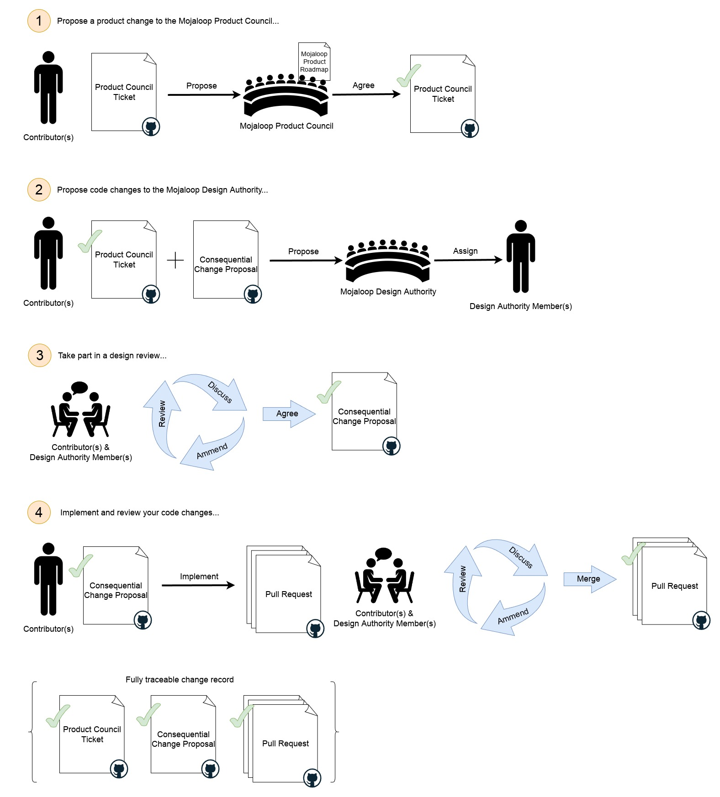

# Processus des changements conséquents

Pour les changements couverts par la [définition de changement conséquent](./design-review.md#consequential-changes), suivez ce processus :

1. Proposer un changement produit au Product Council Mojaloop :
    1. Créez une « Product Change Proposal » dans le dépôt GitHub `product-council`
       [ici](https://github.com/mojaloop/product-council-project/issues).
        1. Remplissez le modèle au maximum pour un traitement rapide.
    2. Envoyez un message sur le canal Slack [#product-council](https://mojaloop.slack.com/archives/C01FF8AQUAK) pour demander une revue de votre proposition.
    3. Le Product Council discutera avec vous pour situer la proposition dans la feuille de route produit Mojaloop.
2. Proposer les changements de code à la Design Authority Mojaloop :
    1. Créez un ticket « Consequential Change Proposal » dans le dépôt `design-authority-project`
       [ici](https://github.com/mojaloop/design-authority-project/issues).
        1. Remplissez le modèle au maximum pour un traitement rapide.
    2. Envoyez un message sur [#design-authority](https://mojaloop.slack.com/archives/CARJFMH3Q) pour demander une revue.
    3. La design authority assignera un ou plusieurs membres pour travailler avec vous.
3. Participer à une revue de conception :
    1. Les membres assignés vous guident dans un processus itératif de revue de conception.
    2. À l’issue, vous pouvez poursuivre le changement.
4. Implémenter et faire revue du code :
    1. Créez et traitez les tickets GitHub/Zenhub dans votre
       [processus de workstream](./product-engineering-process.md#mojaloop-workstreams) ; référencez les tickets Product Council et Consequential Change pour la traçabilité.
    2. Lorsque vous ouvrez des pull requests, contactez les membres assignés pour lancer la phase de revue de code.
    3. Répondez aux questions et ajustez si nécessaire.
    4. Après approbation des PR par les membres assignés, la fonctionnalité peut entrer dans le processus de release officiel.
    5. Toute évolution de la conception pendant l’implémentation doit être consignée sur le ticket de proposition.

## À quoi s’attendre pendant la revue de conception

_La Design Authority Mojaloop veille à identifier et atténuer les risques et à respecter nos normes d’outils, de motifs et de pratiques. Les membres assignés sont là pour vous aider à obtenir le meilleur résultat pour vous et la communauté._

Ils vous aident à identifier et réduire les risques et à aligner la conception sur les pratiques établies.

1. Vous expliquerez les raisons du changement, l’objectif et la méthode.
    1. Vous devez pouvoir vous référer à un ticket GitHub du Product Council montrant que le travail a été discuté et que le changement est accepté. Le Product Council maintient une feuille de route cohérente et peut consulter la Design Authority.
    2. Vous expliquerez l’implémentation, les composants impactés, les évolutions et les nouveaux composants. Présentez au minimum :
        1. Des diagrammes de séquence UML pour chaque composant significatif et les interactions (cas nominaux et erreurs).
        2. Le détail des composants tiers utilisés.
        3. Le détail des changements sur les composants existants (comportement actuel vs souhaité).
    3. Les membres poseront probablement de nombreuses questions pour comprendre la proposition et son contexte.
2. Ils vous aideront à identifier d’autres contributeurs, équipes ou parties prenantes à impliquer pour éviter des effets de bord en amont ou en aval et tenir compte d’évolutions ailleurs dans le système.
3. L’objectif principal est d’identifier et d’atténuer les risques que vous auriez pu manquer.
    1. Ils peuvent suggérer des atténuations ou des modifications pour respecter les contraintes Mojaloop.

