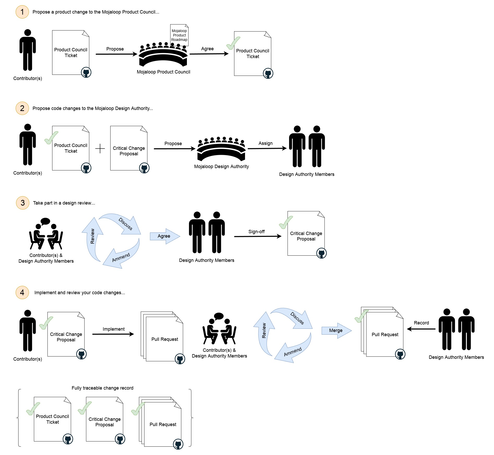

# Processus des changements critiques

_**Pour Mojaloop, le « processus des changements critiques » est proche du processus des changements conséquents, mais avec une supervision supplémentaire et une exigence de validation formelle, compte tenu de la nature hautement risquée de ces changements dans notre environnement d’exploitation.**_

Pour les changements couverts par la [définition de changement critique](./design-review.md#critical-changes), suivez ce processus :

1. Proposer un changement produit au Product Council Mojaloop :
    1. Créez une « Product Change Proposal » dans le dépôt GitHub `product-council`
       [ici](https://github.com/mojaloop/product-council-project/issues).
        1. Remplissez le modèle aussi complètement et rigoureusement que possible afin de garantir un traitement rapide.
    2. Envoyez un message sur le canal Slack [#product-council](https://mojaloop.slack.com/archives/C01FF8AQUAK) pour demander une revue de votre proposition.
    3. Le Product Council discutera avec vous afin de comprendre où votre proposition s'inscrit dans la feuille de route produit Mojaloop.
2. Proposer les changements de code à la Design Authority Mojaloop :
    1. Créez un ticket « Critical Change Proposal » dans le dépôt `design-authority-project`
       [ici](https://github.com/mojaloop/design-authority-project/issues).
        1. Remplissez le modèle aussi complètement et rigoureusement que possible afin de garantir un traitement rapide.
    2. Envoyez un message sur [#design-authority](https://mojaloop.slack.com/archives/CARJFMH3Q) pour demander une revue.
    3. La design authority assignera au moins deux membres pour travailler avec vous.
3. Participer à une revue de conception :
    1. Les membres assignés vous guident dans un processus itératif de revue de conception.
    2. À l’issue du processus de revue de conception, les membres assignés procèdent à la validation formelle (sign-off) de votre conception, ce qui autorise le démarrage de l’implémentation.
    3. Après cette validation formelle, vous pouvez poursuivre le changement.
4. Implémenter et faire revue du code :
    1. Créez et traitez les tickets GitHub/Zenhub dans votre
       [processus de workstream](./product-engineering-process.md#mojaloop-workstreams) ; référencez les tickets Product Council et Critical Change pour la traçabilité.
    2. Lorsque vous ouvrez des pull requests, contactez les membres assignés de la Design Authority et demandez-leur de lancer la phase de revue de code.
    3. Soyez prêt à répondre aux questions et à effectuer des ajustements au cours de cette étape.
    4. Une fois les PR approuvées par les membres assignés, la fonctionnalité est prête à être intégrée dans le processus de release officiel Mojaloop.
    5. Les membres assignés enregistrent formellement leur revue d'approbation de votre ou vos pull requests.
    6. Tout changement apporté à la conception pendant l’implémentation doit être consigné sur le ticket de proposition.

## À quoi s’attendre pendant la revue de conception

_La Design Authority Mojaloop a la responsabilité de s’assurer que les risques sont identifiés et atténués de manière appropriée, et que nos normes établies en matière d’outils, de motifs et de pratiques sont respectées. Les membres assignés sont là pour vous aider à obtenir le meilleur résultat possible pour vous-même et pour l’ensemble de la communauté Mojaloop._

Ils vous aident à identifier et réduire les risques et à aligner la conception sur les pratiques établies.

1. Il vous sera demandé d’exposer les raisons de votre changement proposé, d’expliquer ce que vous souhaitez atteindre et comment vous entendez y parvenir.
    1. Vous devez pouvoir vous référer à un ticket GitHub du Product Council montrant que le travail a été discuté et que le changement est accepté. Notez que le Product Council a la responsabilité de maintenir une feuille de route cohérente pour notre technologie et vous guidera sur la façon la plus appropriée d’atteindre vos objectifs métier dans le contexte Mojaloop. Le Product Council peut consulter la Design Authority dans le cadre de ce processus.
    2. Vous expliquerez l’implémentation, les composants impactés, les évolutions et les nouveaux composants. Présentez au minimum :
        1. Des diagrammes de séquence UML illustrant chaque composant significatif impliqué dans vos cas d’usage et leurs interactions pour atteindre les résultats souhaités. Veillez à inclure les cas d’erreur ainsi que les comportements nominaux attendus.
        2. Le détail des composants tiers utilisés.
        3. Le détail des changements sur les composants existants (comportement actuel vs souhaité).
    3. Les membres poseront probablement de nombreuses questions pour comprendre la proposition et son contexte.
2. Ils vous aideront à identifier d’autres contributeurs, équipes ou parties prenantes à impliquer pour éviter des effets de bord en amont ou en aval et tenir compte d’évolutions ailleurs dans le système.
    Mojaloop est un système de grande envergure et il est souvent utile de faire appel à des experts d’autres domaines pour apporter leur assistance.
3. L’objectif principal de votre ou vos membres assignés de la Design Authority est d’identifier et d’atténuer les risques que vous n’avez peut-être pas repérés.
    1. Ils peuvent suggérer des atténuations ou des modifications pour respecter les contraintes Mojaloop.

