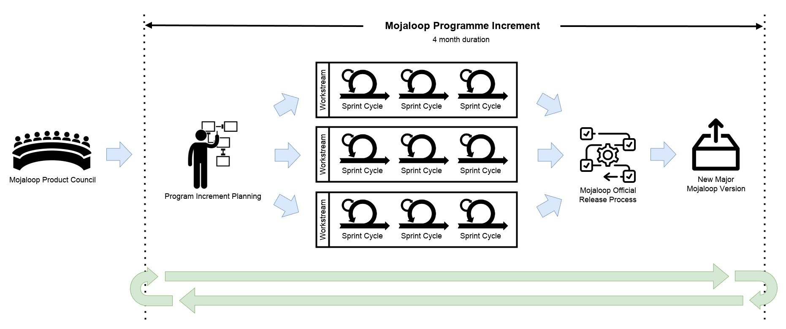
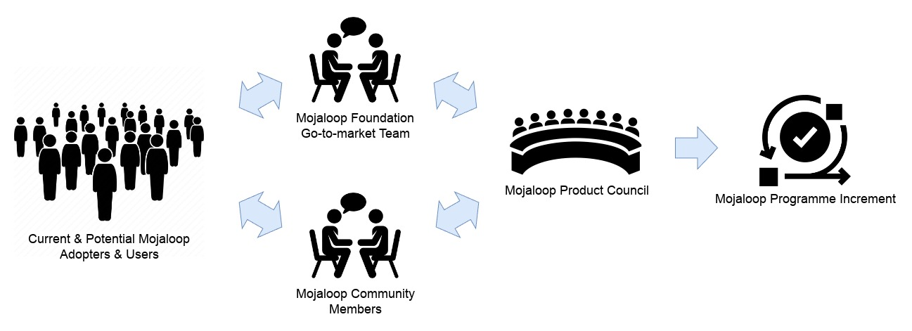
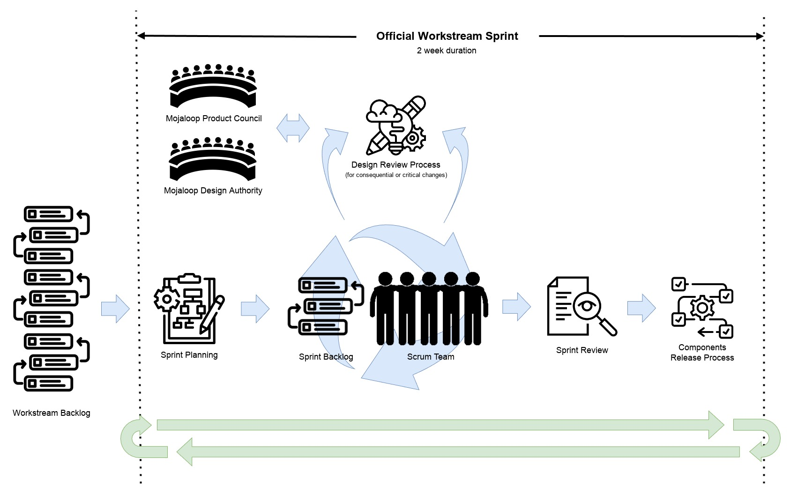

# Processus d’ingénierie produit Mojaloop

## Introduction

Le logiciel Mojaloop est conçu pour constituer l’épine dorsale de schémas de paiements instantanés inclusifs à l’échelle nationale. Ces schémas sont des éléments majeurs d’infrastructure financière nationale réglementée qui soutiennent des activités quotidiennes vitales pour un grand nombre de personnes (achat de nourriture, d’eau potable, etc.). Nos adoptants, leurs régulateurs et les personnes effectuant des transactions via les schémas Mojaloop exigent et méritent un niveau très élevé de qualité, sécurité, fiabilité et résilience.

Pour préserver ces qualités et atténuer les risques métier et techniques, la Fondation Mojaloop applique un processus d’ingénierie produit structuré, fondé sur les meilleures pratiques éprouvées du secteur pour les logiciels financiers réglementés, incluant un contrôle des changements géré et traçable, piloté à la fois par des processus et des mécanismes techniques, revues de conception et de code, seuils de tests élevés et plusieurs niveaux d’assurance qualité.

Ce processus aide les contributeurs à identifier et réduire les risques tout en améliorant les produits, au bénéfice de toute la communauté Mojaloop.

## Évolution du processus

Depuis 2017 et les premières lignes de code, le modèle a évolué pour s’adapter à la transition d’une seule équipe d’ingénierie vers plusieurs fils de travail dotés en ressources par la communauté, chacun centré sur des parties du large portefeuille produit.

Le modèle actuel s’appuie sur le [Scaled Agile Framework](https://scaledagileframework.com/) pour permettre à plusieurs équipes de travailler aussi indépendamment que possible tout en livrant un ensemble coordonné de résultats de feuille de route sur l’ensemble du périmètre produit.

Le cycle repose sur des « [program increments](https://v5.scaledagileframework.com/program-increment/) » d’environ quatre mois. À la fin de chaque incrément, les fils présentent leurs réalisations en réunion communautaire, le nouveau code est publié et la planification du suivant commence.

## Flux des exigences produit

Les demandes de fonctionnalités et nouvelles exigences proviennent de sources variées, par exemple :

- Adoptants Mojaloop actuels et participants au schéma
- Opérateurs de schémas de paiement souhaitant tirer parti de la technologie Mojaloop
- Administrations publiques mettant en place des schémas de paiement inclusifs
- Experts en inclusion financière
- Membres de la communauté Mojaloop

Le conseil produit Mojaloop les recueille et les analyse. S’il existe une demande suffisante et une volonté de contribuer, elles sont intégrées à la feuille de route produit et affectées à un fil de travail officiel Mojaloop. À défaut de fil adapté, un nouveau fil peut être créé et doté en ressources par la communauté.

Les fils ont en général des objectifs fixés au début de chaque incrément de programme ; des demandes prioritaires peuvent toutefois être insérées en cours d’incrément.

Les livrables des fils entrent dans un processus maîtrisé qui publie périodiquement des releases officielles du logiciel Mojaloop. Le processus de release s’aligne souvent sur les incréments de programme ; les releases majeures (nouvelles fonctionnalités) ont lieu en fin d’incrément. Les releases mineures et correctifs sont plus fréquentes (fonctionnalités prioritaires, correctifs de bugs ou correctifs de sécurité, etc.).

## Fils de travail Mojaloop

Les fils officiels sont les « chaînes de production » de la « fabrique » logicielle communautaire Mojaloop ; c’est là que se concentre l’essentiel du développement produit. Plusieurs fils tournent en parallèle, chacun sur des domaines ou fonctionnalités précis de la plateforme.

### Modèle de gouvernance et exigences de fonctionnement

Les fils Mojaloop ont un modèle de gouvernance et des exigences d’exploitation clairs pour limiter les risques pour toutes les parties prenantes :

1. Nom clair et concis reflétant l’objectif du fil.
2. Un responsable désigné en permanence ; dans certains cas, la fonction peut être partagée entre deux personnes si aucune n’a assez de disponibilité.
3. Une personne désignée comme liaison avec la Design Authority Mojaloop (il peut s’agir du ou des responsables du fil, ou d’une autre personne spécifiquement nommée à cet effet).
4. Publication et mise à jour sur Community Central d’une description : objectif, buts et périmètre pour chaque incrément de programme.
5. Au moins deux contributeurs actifs nommés.
6. Au moins une réunion en ligne par semaine.
    1. Les réunions du fil devraient être ouvertes en observation aux autres membres de la communauté.
    2. Les réunions devraient être enregistrées et les enregistrements publiés.
7. Les fils avec plus de deux contributeurs actifs devraient tenir un stand-up de type Scrum en ligne.
    1. Stand-up quotidien sauf si le volume de travail est faible (cadence moindre acceptable).
8. Dépôt GitHub public contenant code, documentation et tickets de travail.
9. Respect de tous les [processus de revue de conception et de code Mojaloop](./design-review.md) avant, pendant et après le travail.
10. Utilisation d’un hashtag dédié sur Community Central pour les publications.
11. Revue par le Product Council Mojaloop avant le début de chaque incrément de programme.
    1. Les objectifs du fil doivent être alignés sur la feuille de route produit Mojaloop.
    2. Les objectifs du fil doivent être alignés sur la mission de la Fondation Mojaloop.

### Critères et responsabilités des responsables de fil

La Fondation Mojaloop désigne des responsables, en général des bénévoles de la communauté avec une forte expertise ou expérience pertinente.

Pour être responsable (ou co-responsable) de fil, une personne devrait :

1. S’engager et pouvoir assumer toutes les responsabilités ci-dessous.
2. Avoir démontré des capacités d’organisation.
3. Avoir démontré des capacités de leadership.
4. Avoir démontré des compétences techniques pertinentes.
5. Connaître l’écosystème Mojaloop.
6. S’engager pour la durée du PI.
7. Respecter le code de conduite Mojaloop.

Les responsables de fil doivent notamment :

1. Servir de point de contact principal pour les questions.
2. Planifier, tenir, enregistrer et publier les enregistrements et comptes rendus des réunions du fil.
3. Faciliter la liaison entre contributeurs du fil, autres fils et le reste de la communauté.
4. Créer, publier sur Community Central et maintenir une charte d’équipe du fil.
5. Rendre compte de l’avancement…
    1. …à la communauté régulièrement sur Community Central avec le hashtag assigné.
    2. …au Product Manager / Product Council.
6. Veiller à ce que tout le travail respecte les [processus de revue de conception et de code Mojaloop](./design-review.md) avant, pendant et après réalisation.
7. Veiller au respect des normes de qualité Mojaloop (style, couverture de tests, documentation).
8. Veiller au suivi dans GitHub/Zenhub et à la mise à jour des échéanciers et de l’avancement.
9. Veiller à ce que toute sortie technique soit testée par l’équipe cœur avant intégration au processus de release officiel. Pour les fils non techniques, revue par le directeur produit de la Fondation Mojaloop.
10. Faciliter le développement de nouvelles fonctionnalités et coder si nécessaire.
11. Trier les contributions et tickets, répondre aux utilisateurs.
12. Déclarer des bugs, proposer des correctifs et résoudre les conflits dans le fil.
13. Gérer proactivement la dette technique et améliorer le code existant, en respectant les [processus de revue de conception et de code Mojaloop](./design-review.md).
14. Veiller à ce que la documentation respecte les normes requises.
15. Orienter stratégiquement le fil avec le directeur produit et le Product Council de la Fondation Mojaloop.
16. Définir des objectifs SMART au début de chaque PI.

### Définir le travail

Les fils doivent définir et enregistrer publiquement (issues GitHub/Zenhub) le travail prévu et l’avancement :

1. Les éléments de travail doivent être des issues GitHub ; L’utilisation de Zenhub n’est pas obligatoire, mais est fortement encouragée.
    1. Chaque fil a son projet GitHub et son espace Zenhub.
2. Les éléments (« user stories ») devraient suivre le style « En tant que… je veux… afin de… » du [développement piloté par le comportement](https://www.agilealliance.org/glossary/user-story-template/).
3. Ils devraient inclure des critères d’acceptation détaillés au format « étant donné, quand, alors » du [BDD](https://www.agilealliance.org/glossary/given-when-then/).
4. La taille doit être telle qu’aucun élément ou sous-élément ne dépasse un sprint de deux semaines.
5. Respect des [processus de revue de conception et de code Mojaloop](./design-review.md) avant, pendant et après. Lorsqu’une revue de conception est requise, utiliser des tickets « spike » pour le design avant les tickets d’implémentation.
    1. Toute la documentation de conception requise doit être approuvée par la Design Authority Mojaloop avant le début du travail.

Modèle de ticket GitHub/Zenhub : [github-work-item-template.docx](github-work-item-template.docx)

### Mener le travail à bien

Les fils Mojaloop suivent par défaut un modèle proche de [Scrum](https://www.scrum.org/resources/what-scrum-module), avec des sprints de deux semaines. Compte tenu des exigences de gestion des risques des utilisateurs, des cadres réglementaires et des pratiques du secteur financier, le fonctionnement quotidien inclut des fonctions de supervision obligatoires et un contrôle des changements plus strict que dans certaines méthodes agiles classiques, comparable aux grandes organisations techniques qui exploitent une infrastructure critique.

Les fils peuvent adapter leurs méthodes dans des limites raisonnables pour la mission et le domaine réglementaire. La Fondation Mojaloop oriente les fils pour qu’ils restent dans les normes d’exploitation requises.

Les fils devraient tenir régulièrement stand-up, affinage de backlog, planification de sprint, revue de sprint et rétrospectives.

Chaque fil doit définir et maintenir une « charte d’équipe » qui fixe clairement les modalités de travail pour tous les contributeurs.

Modèle de charte : [mojaloop-workstream-team-charter-template.pptx](assets/mojaloop-workstream-team-charter-template.pptx)

### Obtenir du soutien

Lorsque les choses ne se déroulent pas comme prévu et qu’aucune résolution ne peut être trouvée au sein des contributeurs du fil, la Fondation Mojaloop met à disposition des mécanismes de soutien. Contactez le directeur communauté de la Fondation Mojaloop pour être orienté vers une résolution.

## Fils non officiels et contributions externes

Lorsqu’aucun fil existant ne convient et que le besoin ne justifie pas un nouveau fil officiel, les contributeurs peuvent travailler en dehors des processus communautaires. Dans ce cas, notre [processus de don externe](../standards/guide.md#adopting-open-source-contributions-into-mojaloop) doit être suivi avant que code, documentation ou autres artefacts ne soient adoptés par la Fondation Mojaloop.

Veuillez noter que tout travail réalisé hors des fils officiels Mojaloop est soumis au [processus de don externe](../standards/guide.md#adopting-open-source-contributions-into-mojaloop). Ceci afin de garantir un niveau de revue rigoureuse approprié et le respect de nos normes avant toute inclusion dans une release officielle Mojaloop.
