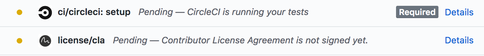
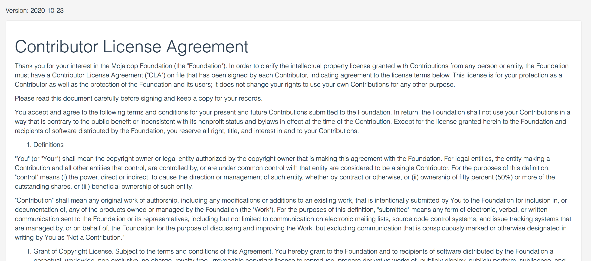
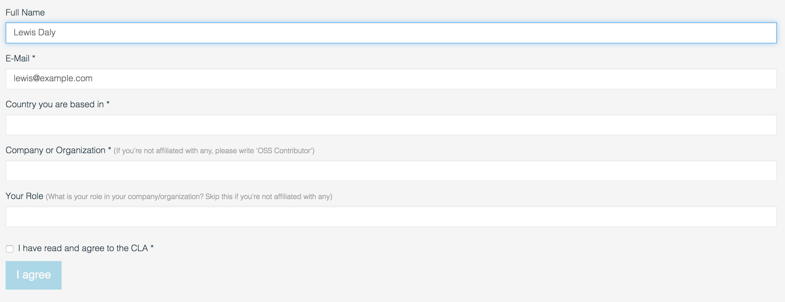
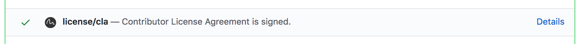
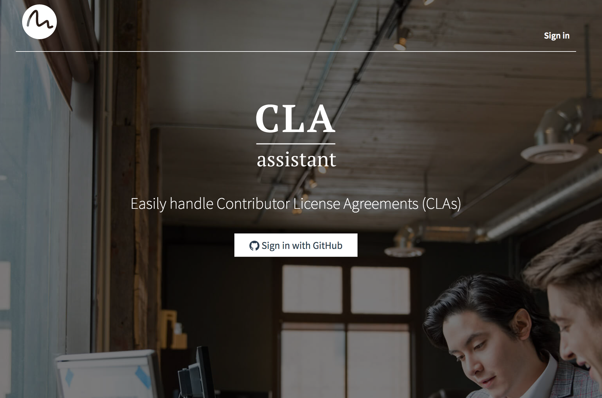
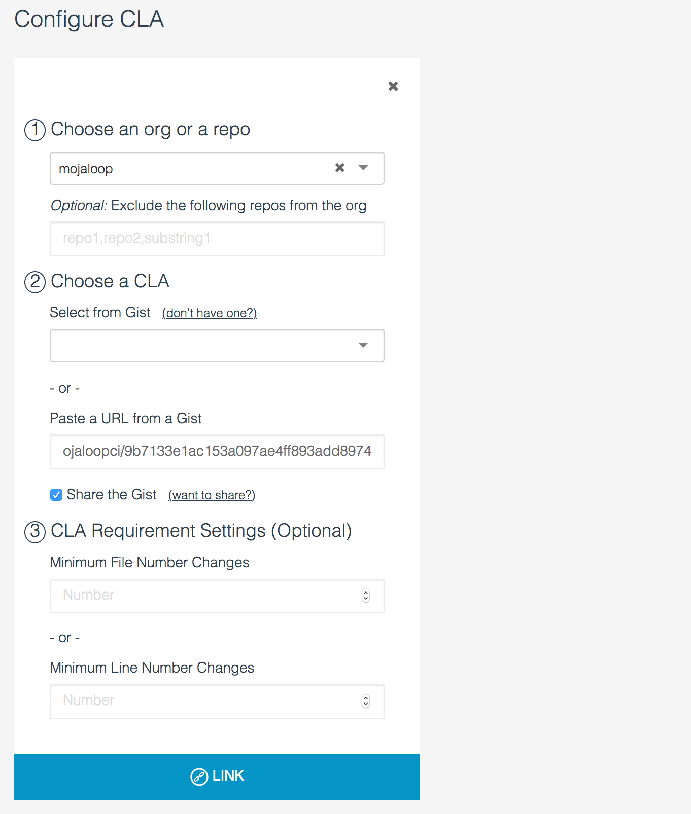

# Signer la CLA

Mojaloop dispose d’une [Contributor License Agreement (CLA)](https://github.com/mojaloop/mojaloop/blob/master/CONTRIBUTOR_LICENSE_AGREEMENT.md) qui précise les droits de propriété intellectuelle sur les contributions des personnes physiques ou morales.

Pour vérifier que chaque développeur a signé la CLA, nous utilisons [CLA Assistant](https://cla-assistant.io/), un outil open source maintenu qui exige la signature de la CLA avant fusion d’une pull request.

## Comment signer la CLA

1. Ouvrez une pull request sur n’importe quel dépôt Mojaloop.
2. Lors des vérifications habituelles, le contrôle `license/cla` s’affiche et invite à signer la CLA :



3. Cliquez sur « Details » : vous accédez à CLA Assistant pour lire la CLA, renseigner vos informations et signer.


</br>



4. Après « I agree », retournez sur la pull request : le contrôle CLA Assistant doit être vert.




### Signature pour une entreprise

La section 3 de la [CLA Mojaloop](https://github.com/mojaloop/mojaloop/blob/master/CONTRIBUTOR_LICENSE_AGREEMENT.md) couvre les contributions individuelles et celles faites pour le compte d’un employeur. Si vous contribuez pour votre employeur, indiquez son nom dans le champ « Company or Organization ». Sinon, vous pouvez indiquer « OSS Contributor » et laisser le champ « role » vide.


## Administration de l’outil CLA

L’outil CLA est simple à installer ; tout administrateur GitHub peut le lier à l’organisation Mojaloop.

1. Créez un nouveau Gist GitHub et y collez le texte de la CLA.
> Comme GitHub n’autorise pas les Gists détenus par des organisations, [notre gist](https://gist.github.com/mojaloopci/9b7133e1ac153a097ae4ff893add8974) appartient à l’utilisateur « mojaloopci ».

2. Allez sur [CLA Assistant](https://cla-assistant.io/) et cliquez sur « Sign in with GitHub ».



3. Vous pouvez ajouter une CLA à un dépôt ou à une organisation. Sélectionnez « Mojaloop », puis le gist créé.



4. Cliquez sur « Link », c’est terminé.


### Demander des informations supplémentaires

> Référence : [request-more-information-from-the-cla-signer](https://github.com/cla-assistant/cla-assistant#request-more-information-from-the-cla-signer)

Vous pouvez ajouter un fichier `metadata` au gist de la CLA pour personnaliser le formulaire :

```json
{
    "name": {
        "title": "Full Name",
        "type": "string",
        "githubKey": "name"
    },
    "email": {
        "title": "E-Mail",
        "type": "string",
        "githubKey": "email",
        "required": true
    },
    "country": {
        "title": "Country you are based in",
        "type": "string",
        "required": true
    },
    "company": {
        "title": "Company or Organization",
        "description": "If you're not affiliated with any, please write 'OSS Contributor'",
        "type": "string",
        "required": true
    },
    "role": {
        "title": "Your Role",
        "description": "What is your role in your company/organization? Skip this if you're not affiliated with any",
        "type": "string",
        "required": false
    },
    "agreement": {
        "title": "I have read and agree to the CLA",
        "type": "boolean",
        "required": true
    }
}
```

Exemple de formulaire obtenu :


