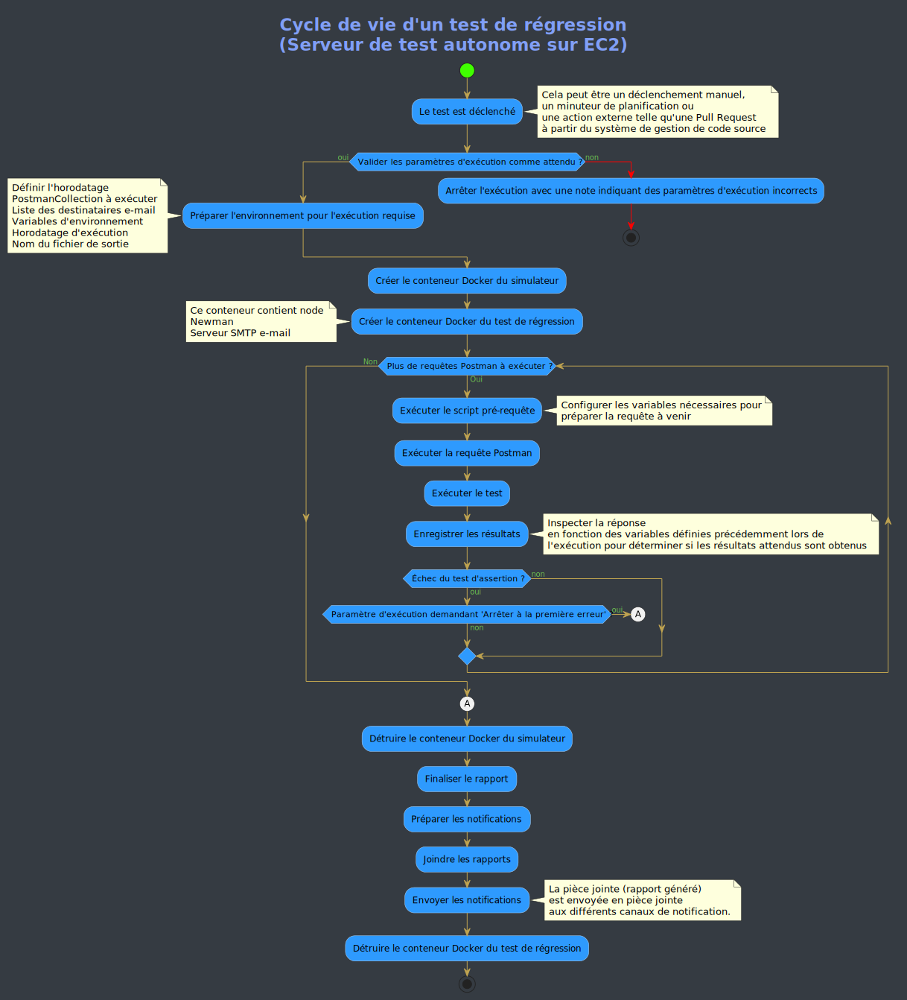

# Tests QA et de régression dans Mojaloop
Vue d’ensemble du cadre de tests mis en place dans Mojaloop

Sommaire :
1. [Exigences de régression](#sujets-de-régression)
2. [Tests développeur](#tests-développeur)
3. [Tests Postman et Newman](#postman-et-newman)
4. [Exécuter les tests de régression](#exécuter-les-tests-de-régression)
5. [Flux d’un test planifié typique](#flux-dun-test-planifié-typique)
6. [Commandes Newman](#commandes-newman)

## Sujets de régression
Pour qu’un système déployé soit robuste, l’un des derniers points de contrôle consiste à vérifier que l’environnement de déploiement est sain et que toutes les fonctionnalités exposées fonctionnent exactement conformément aux spécifications.

Auparavant, on doit mettre en place un certain nombre de disciplines pour garantir un contrôle maximal.

Pour illustrer comment le projet Mojaloop atteint cet objectif, nous présentons les différents points de contrôle mis en place.

### Tests développeur
Pour chaque composant et module, dans la base de code, vous trouverez un dossier nommé « test » qui contient trois types de tests.
+ D’abord, le *test de couverture* qui signale le code inaccessible ou redondant
+ Les tests unitaires, qui vérifient que la fonctionnalité prévue se comporte comme attendu
+ Les tests d’intégration, qui ne testent pas le bout en bout mais les interactions avec les composants adjacents
+ Des vérifications automatiques des normes de code implémentées via des paquets intégrés à la base de code

Ces tests sont exécutés via des instructions en ligne de commande par le développeur pendant le développement. Ils sont également lancés automatiquement à chaque *commit* et lors de l’ouverture d’une pull request GitHub pour intégrer le code au projet.

La procédure décrite ci-dessus sort du périmètre de l’assurance qualité (QA) et des tests de régression, objet du présent document.

Une fois qu’un développeur a écrit une nouvelle fonctionnalité ou étendu une fonctionnalité existante, les tests rigoureux ci-dessus permettent de supposer que le comportement concerné est correct. Comment alors s’assurer que ce nouveau code ne dégrade pas le projet ou le produit dans son ensemble ?

Lorsque le code a passé toutes ces étapes et est déployé dans le cadre des processus CI/CD de notre flux de travail, les nouveaux composants sont acceptés sur les différents hébergeurs, déploiements cloud ou sur site. Ces hébergeurs vont des plateformes de développement jusqu’aux environnements de production.

### Postman et Newman
En parallèle du déploiement, l’entretien et la maintenance du cadre de tests se poursuivent [Postman](https://github.com/mojaloop/postman.git "Postman"). Lors d’une nouvelle release, les notes de version publiées dans le flux de travail listent les fonctionnalités nouvelles ou améliorées. L’équipe QA s’en sert pour étendre et enrichir les collections Postman existantes, où des tests sont écrits dans les scripts requête/réponse pour couvrir les scénarios positifs et négatifs par rapport au comportement attendu. Ces tests sont ensuite exécutés ainsi :
+ Manuellement, pour vérifier que les tests couvrent tous les aspects et angles de la fonctionnalité, les tests positifs pour valider par assertion le comportement attendu, et les tests négatifs pour vérifier que les flux alternatifs corrects s’appliquent en cas de problème imprévu
+ De façon planifiée — dans le cadre de la régression — pour reproduire la même intention que le manuel mais entièrement automatisée (avec le *paquet Newman*), avec rapports et journaux pour signaler tout comportement non voulu et avertir lorsque le comportement connu a changé par rapport à une exécution précédente.

Pour faciliter les tests automatisés et planifiés d’une collection Postman, plusieurs méthodes existent ; celle implémentée pour Mojaloop est expliquée plus bas dans ce document.

Un dépôt complet contient tous les scripts, procédures d’installation et éléments nécessaires pour mettre en place un [cadre automatisé de tests QA et de régression](https://github.com/mojaloop/ml-qa-regression-testing.git "QA and Regression Testing Framework"). Ce cadre permet de cibler n’importe quelle collection Postman, de préciser l’environnement d’exécution et une liste d’adresses e-mail séparées par des virgules pour recevoir le rapport généré. Ce cadre est utilisé quotidiennement par Mojaloop sur une instance EC2 AWS hébergeant Node, Docker, un serveur de messagerie et Newman, ainsi que des scripts Bash et des modèles pour exécuter automatiquement les collections prévues chaque jour. Ce guide permet à tout le monde de déployer son propre cadre.

#### Collections Postman

Plusieurs collections Postman sont utilisées selon les processus :

Pour le simulateur Mojaloop :

+ [MojaloopHub_Setup](https://github.com/mojaloop/postman/blob/master/MojaloopHub_Setup.postman_collection.json) : à exécuter une fois après un nouveau déploiement, en général par le responsable de release. Elle configure un hub Mojaloop vide, notamment la devise du hub et les comptes de règlement.
+ [MojaloopSims_Onboarding](https://github.com/mojaloop/postman/blob/master/MojaloopSims_Onboarding.postman_collection.json) : configure les simulateurs DFSP ainsi que les URLs des points de terminaison pour que le hub Mojaloop sache où envoyer les callbacks de requête.
+ [Golden_Path_Mojaloop](https://github.com/mojaloop/postman/blob/master/Golden_Path_Mojaloop.postman_collection.json) : pack de régression bout en bout qui exerce l’ensemble des fonctionnalités déployées. Peut être lancé manuellement mais est véritablement conçu pour une exécution automatisée du début à la fin, les valeurs de réponse étant transmises de chaque requête à la suivante. (L’équipe cœur s’en sert pour valider releases et déploiements)
    + Remarques : dans certains cas, un délai de `250 ms` à `500 ms` est nécessaire si l’exécution passe par le Test Runner de l’interface Postman, pour laisser le temps aux tests de valider les requêtes contre le simulateur. Ce n’est pas toujours nécessaire.
+ [Bulk_API_Transfers_MojaSims](https://github.com/mojaloop/postman/blob/master/Bulk_API_Transfers_MojaSims.postman_collection.json) : peut servir à tester les transferts de masse ciblant le simulateur Mojaloop.

Pour l’ancien simulateur (il est recommandé d’utiliser le simulateur Mojaloop ; le support s’arrête à partir de PI-12 (oct. 2020)) :

+ [ML_OSS_Setup_LegacySim](https://github.com/mojaloop/postman/blob/master/ML_OSS_Setup_LegacySim.postman_collection.json) : à exécuter une fois après un nouveau déploiement (si l’ancien simulateur est utilisé), en général par le responsable de release. Configure le hub Mojaloop (devise, comptes de règlement) avec l’ancien simulateur (FSP).
+ [ML_OSS_Golden_Path_LegacySim](https://github.com/mojaloop/postman/blob/master/ML_OSS_Golden_Path_LegacySim.postman_collection.json) : pack de régression bout en bout pour l’ensemble des fonctionnalités déployées. Peut être lancé manuellement mais est conçu pour une exécution automatisée du début à la fin avec chaînage des réponses. (L’équipe cœur s’en sert pour valider releases et déploiements)
    + Remarques : dans certains cas, un délai de `250 ms` à `500 ms` peut être nécessaire via le Test Runner Postman. Ce n’est pas toujours nécessaire.
+ [Bulk API Transfers.postman_collection](https://github.com/mojaloop/postman/blob/master/Bulk%20API%20Transfers.postman_collection.json) : peut servir à tester les transferts de masse ciblant l’ancien simulateur.
    
#### Configuration d’environnement

Vous devrez adapter le fichier de configuration d’environnement suivant à votre déploiement :
+ [Configuration locale](https://github.com/mojaloop/postman/blob/master/environments/Mojaloop-Local.postman_environment.json)

_Conseils :_
- _Les paramètres d’hôte sont les plus souvent à modifier pour correspondre à votre environnement, p. ex. `HOST_CENTRAL_LEDGER: http://central-ledger.local`_
- _Reportez-vous aux hôtes d’ingress configurés dans votre `values.yaml` dans le déploiement Helm._

### Exécuter les tests de régression
Pour le cadre QA et de régression Mojaloop spécifiquement, les tests Postman peuvent être exécutés en se connectant en SSH à l’instance EC2 (fichier PEM requis), puis en lançant un ou plusieurs scripts.

En suivant les exigences et instructions détaillées dans le dépôt [QA and Regression Testing Framework](https://github.com/mojaloop/ml-qa-regression-testing.git "QA and Regression Testing Framework"), chacun peut créer son propre cadre et accéder à son instance pour exécuter des tests contre toute collection Postman et tout environnement sous son contrôle.

##### Étapes pour exécuter via l’interface Postman
+ Importer la collection souhaitée dans Postman. Vous pouvez la télécharger depuis le dépôt ou utiliser le lien `RAW` et l’import par **lien d’import**.
+ Importer la configuration d’environnement dans Postman via la configuration d’environnement. Téléchargez le fichier sur votre machine et adaptez-le à votre environnement.
+ Préchargez toutes les données de test nécessaires avant d’exécuter les transactions (parties, devis, transferts), comme dans la collection d’exemple [OSS-New-Deployment-FSP-Setup](https://github.com/mojaloop/postman/blob/master/OSS-New-Deployment-FSP-Setup.postman_collection.json) :
  + Comptes du hub
  + Intégration FSP
  + Données de test sur le simulateur (le cas échéant)
  + Intégration des oracles
+ Les cas de test `p2p_money_transfer` de la collection [Golden_Path](https://github.com/mojaloop/postman/blob/master/Golden_Path.postman_collection.json) sont un bon point de départ.

##### Étapes pour exécuter le script bash qui lance Newman / Postman en CLI
+ Pour cette méthode, vous devez être en possession du fichier PEM du serveur sur lequel le cadre a été déployé sur une instance EC2 sur Amazon Cloud.

+ Connectez-vous en SSH à l’instance EC2 ; l’exécution du script lancera les commandes dans un conteneur Docker instancié.

+ Les URL de la collection Postman et du fichier d’environnement sont des paramètres d’entrée (ainsi qu’une liste d’e-mails pour le rapport), ce qui permet d’exécuter librement la collection de votre choix.

+ Avec un fichier d’environnement, les services Mojaloop ciblés peuvent être sur n’importe quel serveur. Vous pouvez donc exécuter tout test Postman contre toute installation Mojaloop sur le serveur de votre choix.

+ L’instance EC2 utilisée pour ces tests ne fait qu’héberger les outils et processus d’exécution ; elle n’héberge pas les services Mojaloop eux-mêmes.

```
./testMojaloop.sh <URL-collection-postman> <URL-environnement> <liste-e-mails-séparés-par-des-virgules>
```

## Flux d’un test planifié typique




## Commandes Newman
La section suivante est une référence, issue du site du paquet Newman, présentant les commandes utilisables pour accéder à l’environnement Postman via la CLI.
```
Exemple :
+ newman run <URL-collection-postman> -e <postmanEnvironment.json> -n <nombre-d-itérations>1 --<booléen-arrêt-à-la-première-erreur>

Usage : run <collection> [options]

  URL ou chemin vers une collection Postman.

    Options :

    -e, --environment <path>        URL ou chemin vers un environnement Postman.
    -g, --globals <path>            URL ou chemin vers un fichier de globales Postman.
    --folder <path>                 Dossier à exécuter dans une collection. Peut être répété pour plusieurs dossiers (défaut : )
    -r, --reporters [reporters]     Rapporteurs à utiliser pour cette exécution. (défaut : cli)
    -n, --iteration-count <n>       Nombre d’itérations à exécuter.
    -d, --iteration-data <path>     Fichier de données pour les itérations (json ou csv).
    --export-environment <path>     Exporte l’environnement dans un fichier après l’exécution.
    --export-globals <path>         Fichier de sortie pour les globales à la fin.
    --export-collection <path>      Fichier de sortie pour sauvegarder la collection exécutée
    --postman-api-key <apiKey>      Clé API pour charger les ressources depuis l’API Postman.
    --delay-request [n]             Délai entre les requêtes (millisecondes) (défaut : 0)
    --bail [modifiers]              Arrêt propre ou non de l’exécution sur erreur et code de sortie selon le modificateur optionnel.
    -x , --suppress-exit-code       Remplacer ou non le code de sortie par défaut pour cette exécution.
    --silent                        N’affiche pas la sortie Newman dans la CLI.
    --disable-unicode               Remplace les symboles Unicode par du texte brut
    --global-var <value>            Variables globales en ligne de commande, format clé=valeur (défaut : )
    --color <value>                 Activer/désactiver la couleur. (auto|on|off) (défaut : auto)
    --timeout [n]                   Délai d’exécution de la collection (millisecondes) (défaut : 0)
    --timeout-request [n]           Délai pour les requêtes (millisecondes). (défaut : 0)
    --timeout-script [n]            Délai pour les scripts (millisecondes). (défaut : 0)
    --ignore-redirects              Si présent, Newman ne suit pas les redirections HTTP.
    -k, --insecure                  Désactive la validation SSL.
    --ssl-client-cert <path>        Chemin vers le certificat client SSL (.cert ou .pfx).
    --ssl-client-key <path>         Chemin vers la clé client SSL (non nécessaire pour .pfx)
    --ssl-client-passphrase <path>  Passphrase client SSL (optionnel, pour clés protégées).
    -h, --help                      Affiche l’aide
```
