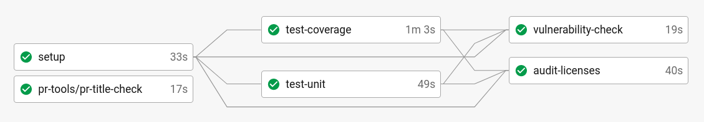
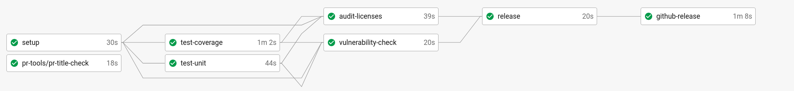
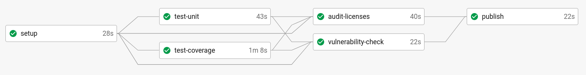
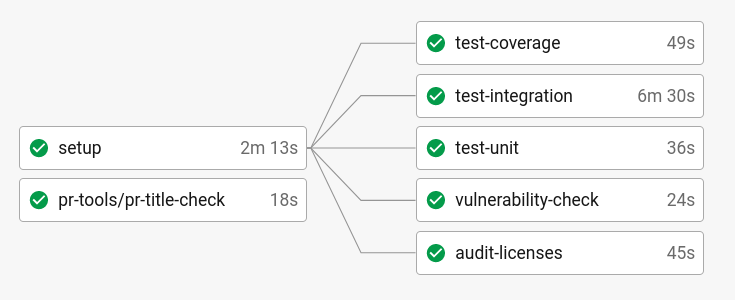
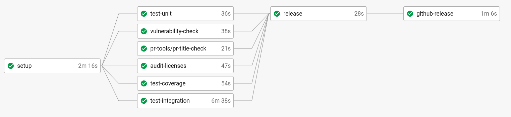
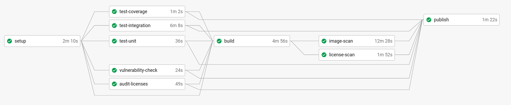

# Pipelines CI/CD

La communauté Mojaloop utilise [CircleCI](https://circleci.com/) pour construire, tester et déployer automatiquement notre logiciel. Ce document décrit comment nous utilisons la CI/CD dans Mojaloop, les différentes vérifications effectuées sur le logiciel et la façon dont nous le distribuons.

Globalement, nous utilisons deux types de flux de travail selon le type de projet :
- Bibliothèque : construire le projet Node → tester → publier sur [npm](https://www.npmjs.com/search?q=%40mojaloop)
- Service : construire l’image Docker → tester → publier sur [Docker Hub](https://hub.docker.com/u/mojaloop)

Nous maintenons également un ensemble de [charts Helm Mojaloop](http://docs.mojaloop.io/helm/), construits à partir du dépôt [mojaloop/helm](https://github.com/mojaloop/helm).

## Bibliothèques

> Pour un bon exemple de ce modèle CI/CD, voir [central-services-shared](https://github.com/mojaloop/central-services-shared/blob/master/.circleci/config.yml)

### Flux des pull requests (PR) :

Le flux PR s’exécute sur les pull requests ; pendant le [processus de revue des PR](https://github.com/mojaloop/documentation/blob/master/contributors-guide/standards/creating-new-features.md#creating-new-features), ces contrôles doivent être satisfaits pour que le code soit fusionné.

| Étape | Description | Plus d’infos |
| ---  | ----------- | --------- |
| pr-title-check  | Vérifie que le titre de la PR respecte la spécification des commits conventionnels | Défini dans un orb CircleCI ici : [mojaloop/ci-config](https://github.com/mojaloop/ci-config) |
| test-coverage   | Lance les tests unitaires et vérifie que la couverture de code dépasse la limite fixée. | En général 90 % |
| test-unit       | Lance les tests unitaires. Échec si un test unitaire échoue. | |
| vulnerability-check | Lance l’outil `npm audit` pour rechercher des vulnérabilités dans les dépendances | `npm audit` comporte beaucoup de faux positifs ou de problèmes de sécurité qui ne s’appliquent pas à notre base de code. Nous utilisons `npm-audit-resolver` pour pouvoir ignorer certaines vulnérabilités, par ex. les `devDependencies` |
| audit-licenses | Lance l’outil Mojaloop `license-scanner-tool` et échoue si une licence trouvée ne figure pas sur la liste autorisée dans `license-scanner-tool` | [Dépôt license-scanner-tool](https://github.com/mojaloop/license-scanner-tool) |

### Flux master et release :

Ce pipeline CI/CD s’exécute sur la branche master/main :

| Étape | Description | Plus d’infos |
| ---  | ----------- | --------- |
| pr-title-check  | Voir ci-dessus | |
| test-coverage   | Voir ci-dessus | |
| test-unit       | Voir ci-dessus | |
| vulnerability-check | Voir ci-dessus | |
| audit-licenses | Voir ci-dessus | |
| release | Exécute une release qui crée une étiquette Git et la pousse | |
| github-release | Ajoute les métadonnées de release (p. ex. changelog) sur GitHub, envoie une alerte Slack sur #announcements | |

### Flux des étiquettes :

Une fois une étiquette Git poussée vers le dépôt, elle déclenche un flux de travail qui se termine par une publication sur `npm`. Les contrôles sont tous relancés pour s’assurer que rien n’a changé (p. ex. dépendances) entre main/master et l’artefact effectivement publié sur `npm`.

| Étape | Description | Plus d’infos |
| ---  | ----------- | --------- |
| pr-title-check  | Voir ci-dessus | |
| test-coverage   | Voir ci-dessus | |
| test-unit       | Voir ci-dessus | |
| vulnerability-check | Voir ci-dessus | |
| audit-licenses | Voir ci-dessus | |
| publish | Publie la dernière version de la bibliothèque selon l’étiquette Git | |

## Services

> Pour un bon exemple de ce modèle CI/CD, voir [central-ledger](https://github.com/mojaloop/central-ledger/blob/master/.circleci/config.yml)

### Flux des pull requests (PR) :

Le flux PR s’exécute sur les pull requests ; pendant la revue des PR, ces contrôles doivent être satisfaits pour que le code soit fusionné.

| Étape | Description | Plus d’infos |
| ---  | ----------- | --------- |
| pr-title-check      | Vérifie que le titre de la PR respecte la spécification des commits conventionnels | Défini dans un orb CircleCI ici : [mojaloop/ci-config](https://github.com/mojaloop/ci-config) |
| test-coverage       | Lance les tests unitaires et vérifie que la couverture de code dépasse la limite fixée. | En général 90 % |
| test-unit           | Lance les tests unitaires. Échec si un test unitaire échoue. | |
| test-integration    | Lance les tests d’intégration. En général en construisant une image Docker localement | |
| vulnerability-check | Lance l’outil `npm audit` pour rechercher des vulnérabilités dans les dépendances | `npm audit` comporte beaucoup de faux positifs ou de problèmes de sécurité qui ne s’appliquent pas à notre base de code. Nous utilisons `npm-audit-resolver` pour pouvoir ignorer certaines vulnérabilités, par ex. les `devDependencies` |
| audit-licenses | Lance l’outil Mojaloop `license-scanner-tool` et échoue si une licence trouvée ne figure pas sur la liste autorisée dans `license-scanner-tool` | [Dépôt license-scanner-tool](https://github.com/mojaloop/license-scanner-tool) |

### Flux master et release :

Ce pipeline CI/CD s’exécute sur la branche master/main :

| Étape | Description | Plus d’infos |
| ---  | ----------- | --------- |
| pr-title-check  | Voir ci-dessus | |
| test-coverage   | Voir ci-dessus | |
| test-unit       | Voir ci-dessus | |
| test-integration | Voir ci-dessus | |
| vulnerability-check | Voir ci-dessus | |
| audit-licenses | Voir ci-dessus | |
| release | Exécute une release qui crée une étiquette Git et la pousse | |
| github-release | Ajoute les métadonnées de release (p. ex. changelog) sur GitHub, envoie une alerte Slack sur #announcements | |

### Flux des étiquettes :

Une fois une étiquette Git poussée vers le dépôt, elle déclenche un flux de travail qui se termine par la publication d’une image Docker sur Docker Hub. Les contrôles sont tous relancés et des analyses supplémentaires sont effectuées sur l’image Docker avant son envoi.

| Étape | Description | Plus d’infos |
| ---  | ----------- | --------- |
| pr-title-check      | Voir ci-dessus | |
| test-coverage       | Voir ci-dessus | |
| test-unit           | Voir ci-dessus | |
| vulnerability-check | Voir ci-dessus | |
| audit-licenses      | Voir ci-dessus | |
| build               | Construit l’image Docker | |
| image-scan          | Lance `anchore/analyze_local_image` pour analyser l’image | Voir l’orb CircleCI [anchore-engine](https://circleci.com/developer/orbs/orb/anchore/anchore-engine) pour plus d’informations. |
| license-scan        | Lance l’outil Mojaloop `license-scanner-tool` sur les licences contenues dans l’image Docker | |
| publish | Publie la dernière version de la bibliothèque selon l’étiquette Git | |
