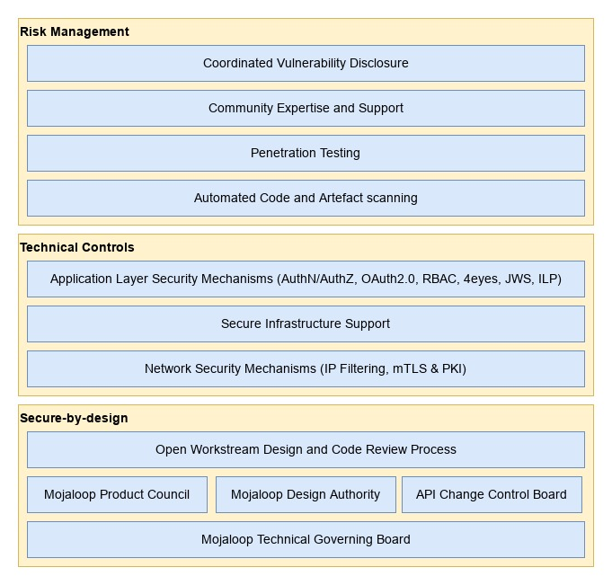

## Architecture de cybersécurité Mojaloop

## Introduction

Mojaloop adopte à la fois une approche sécurisée par conception et une approche fondée sur les risques en matière de cybersécurité : les logiciels open source fournis par la Fondation Mojaloop sont conçus pour être fondamentalement sécurisés et sont évalués en continu par rapport aux risques possibles via plusieurs processus.

Outre les initiatives de cybersécurité gérées par la Fondation Mojaloop, la communauté élargie compte des experts en cybersécurité capables de fournir du conseil et des services pour renforcer encore les capacités des adoptants.

Figure 1 - Couches de l’architecture de cybersécurité Mojaloop

_À noter que bien que la Fondation Mojaloop et la communauté Mojaloop s’efforcent de fournir un logiciel sécurisé par conception et exploitable de manière sécurisée, les adoptants assument la responsabilité ultime de la sécurité de leurs opérations. La Fondation Mojaloop recommande vivement aux adoptants de faire appel à des experts en cybersécurité afin de respecter les bonnes pratiques et l’ensemble des normes et réglementations applicables._

## Sécurisé par conception

### Processus de revue de conception

La Fondation Mojaloop et la communauté gèrent et exploitent plusieurs processus de revue de conception sensibles à la sécurité, qui contribuent aux approches sécurisées par conception et de gestion des risques.

1. Le conseil de gouvernance technique Mojaloop fixe les objectifs techniques de haut niveau en matière de cybersécurité pour le projet Mojaloop ; ils sont mis en œuvre par d’autres instances et processus de la communauté.
2. La communauté Mojaloop exploite une autorité de conception : un groupe structuré d’experts du secteur élus qui se réunissent chaque semaine pour examiner les aspects techniques du logiciel de plateforme, y compris, mais sans s’y limiter, la cybersécurité.
3. La communauté Mojaloop exploite un comité de contrôle des changements d’API : un groupe structuré d’experts du secteur élus qui se réunissent chaque semaine pour examiner les aspects internes et externes des API de la plateforme. Ce groupe a la responsabilité spécifique de veiller à ce que toutes les API Mojaloop soient sécurisées par conception et conformes aux normes industrielles les plus récentes et les plus avancées pour sécuriser les déploiements de la plateforme Mojaloop.
4. La communauté Mojaloop exploite un conseil produit : un groupe structuré d’experts du secteur élus qui se réunissent chaque semaine pour examiner les conceptions de fonctionnalités produit. Ce groupe contribue à l’architecture globale de cybersécurité du ou des produits Mojaloop en examinant et en créant des exigences et spécifications pour la plateforme Mojaloop et sa sécurité.
5. Les normes de la communauté Mojaloop exigent des revues de conception de fonctionnalités et de code par des membres de la communauté et de la fondation experts dans les domaines concernés du système avant que les changements ou le nouveau code soumis par des contributeurs soient acceptés dans les versions officielles.

## Contrôles techniques

La plateforme Mojaloop emploie plusieurs couches techniques de sécurité, détaillées dans les sections suivantes, qui contribuent à une plateforme globalement sécurisée pour les transactions financières.

1. Au niveau du transport réseau, le protocole TLS avec authentification mutuelle X.509 (mTLS) est employé (des recommandations de bonnes pratiques sont fournies pour les suites de chiffrement et algorithmes de hachage appropriés) afin de sécuriser les connexions entre les participants au schéma et le hub Mojaloop. Ce mécanisme, combiné à des processus de gestion des certificats et des clés conformes aux bonnes pratiques, empêche l’écoute et la falsification sur les connexions du schéma. Mojaloop fournit des lignes directrices pour les opérations PKI : [https://docs.mojaloop.io/api/fspiop/pki-best-practices.html](https://docs.mojaloop.io/api/fspiop/pki-best-practices.html).
2. Les signatures Web JSON (JWS) sont utilisées au niveau des messages applicatifs pour garantir l’intégrité des messages et la non-répudiation. Tous les participants au schéma disposent des moyens de détecter si un message entrant a été altéré pendant la transmission. Les participants peuvent également être assurés de l’identité de l’émetteur du message. Les services Mojaloop peuvent utiliser cette même validation de signature pour s’assurer que les messages n’ont pas été altérés avant traitement dans le hub.
3. Mojaloop utilise le [protocole InterLedger](https://docs.mojaloop.io/api/fspiop/v1.1/api-definition.html#interledger-payment-request) (ILP) pendant les phases de devis et de transfert, comme mécanisme cryptographique de type clé-cadenas utilisant la cryptographie asymétrique pour empêcher la falsification des conditions de transfert convenues.
4. Mojaloop applique l’idempotence des requêtes et des contrôles de transition d’état des transactions, ce qui aide à atténuer les attaques par rejeu.
5. La plateforme Mojaloop inclut une couche de passerelle API qui facilite le filtrage par adresse IP, la gestion des identités et des accès OAuth2.0 et les contrôles d’accès par rôles, offrant une protection supplémentaire contre les infiltrations.
6. Les interfaces utilisateur internes et externes (p. ex. pour les participants et les opérateurs du hub, techniques ou métiers) sont sécurisées par OAuth2.0 et des mécanismes de contrôle d’accès par rôles (RBAC), combinés à des processus maker-checker applicables (principe des quatre yeux).
7. Mojaloop prend en charge un modèle de service de gestion de la fraude et des risques (FRMS) à l’échelle du schéma (partagé entre les fournisseurs de services financiers (FSP) et le switch / hub Mojaloop).

Figure 2 - Architecture transactionnelle de cybersécurité du schéma Mojaloop

## Gestion des risques

### Tests de sécurité

#### Analyse automatisée des vulnérabilités

Mojaloop emploie plusieurs mécanismes techniques pour réaliser une évaluation automatisée des vulnérabilités sur tous les dépôts de code source de la plateforme. Ces mécanismes analysent les dépendances du code et les images de conteneur pour détecter les vulnérabilités connues (à partir de bases de données de vulnérabilités mises à jour en continu selon les standards du secteur) de façon périodique et avant l’acceptation des changements ou ajouts sur les branches principales. Cela réduit la probabilité qu’une vulnérabilité connue dans une dépendance Mojaloop atteigne une version officielle.

#### Tests d’intrusion

Des membres de la communauté Mojaloop réalisent périodiquement des tests d’intrusion sur leurs déploiements à l’aide de cadres de test de sécurité courants et partagent les résultats avec la Fondation Mojaloop dans le cadre d’un processus coordonné de divulgation des vulnérabilités, permettant d’atténuer tout nouveau risque identifié par les flux techniques et/ou les adoptants avant que des tiers puissent exploiter les vulnérabilités.

#### Expertise et soutien de la communauté

La communauté Mojaloop, suivant les principes et processus décrits dans ce document, fournit une plateforme logicielle qui intègre de nombreuses fonctionnalités et capacités de cybersécurité. Pour toutefois concrétiser les meilleures opérations sécurisées possibles, les adoptants de la technologie Mojaloop doivent déployer et exploiter le logiciel de manière sécurisée — tâche souvent difficile et intimidante compte tenu des nombreuses normes et réglementations applicables. La communauté Mojaloop comporte des organisations disposant d’une connaissance et d’une expérience approfondies sur ces sujets et pouvant être sollicitées pour de l’assistance.

## Divulgation coordonnée des vulnérabilités

La Fondation Mojaloop applique un processus de divulgation coordonnée des vulnérabilités. Il s’agit d’un modèle dans lequel une vulnérabilité ou un problème n’est rendu public qu’après que les parties responsables ont disposé d’un délai suffisant pour corriger ou remédier au problème.

Cette méthode est recommandée par de nombreux gouvernements et organisations internationales reconnues comme processus privilégié pour gérer les vulnérabilités logicielles, car elle offre une protection contre l’exploitation par des tiers au-delà de ce que permettent d’autres modèles.

## Contrôles organisationnels

Outre les contrôles techniques de cybersécurité décrits ailleurs, Mojaloop fournit un ensemble d’outils pour soutenir les contrôles organisationnels, reflétant le fait que si les attaques par piratage et la fraude perpétrées par des acteurs externes attirent le plus les médias, les attaques les plus « réussies » en valeur totale d’argent détourné sont des actions internes commises par le personnel d’un établissement financier.

Outre les outils fournis dans le cadre de Mojaloop, plusieurs recommandations peuvent être faites concernant les processus métier adoptés par un opérateur de hub, liés à l’exploitation du service.

### Points de contrôle

Mojaloop permet à l’opérateur du hub de définir des points de contrôle où les actions d’un employé sont soumises à des limitations imposées par le hub lui-même. Sous-jacent à cela se trouve la capacité de gestion des identités et des accès de Mojaloop, qui met en œuvre un modèle de contrôle d’accès par rôles (RBAC). Chaque action d’employé au hub n’est autorisée que si l’employé dispose d’un privilège spécifique ; le propriétaire du hub définit un ensemble de rôles, chacun étant une collection de privilèges. Un compte employé est créé et reçoit un rôle (p. ex. responsable financier, administrateur, opérateur, etc.), ce qui contrôle les fonctions qu’il peut exécuter.

Le RBAC est complété par des contrôles maker/checker. Les fonctions sensibles (p. ex. mouvements de fonds) peuvent être définies (« made ») par un opérateur, mais ne sont exécutées qu’après autorisation (« checked ») par, par exemple, un opérateur financier.

Toutes les actions des employés sont enregistrées dans un journal d’audit inviolable. Cela permet aux auditeurs forensiques de consulter toute l’activité et, si nécessaire, de « suivre l’argent » lorsqu’un problème survient, par exemple en cas de collusion employés / direction.

### Contrôles métier

L’exploitation d’un hub Mojaloop est un service financier ; la sécurité du service doit être traitée comme pour tout autre service financier, par exemple une banque ou un switch de paiements international. Les contrôles métier constituent la première ligne de défense et limitent la surface d’attaque avant même que les points de contrôle ne soient accessibles.

Les contrôles métier devraient notamment inclure :

* La cybersécurité peut être compromise par du personnel malveillant. Les opérateurs de hub devraient effectuer des vérifications d’antécédents appropriées lors du recrutement, y compris casier judiciaire et solvabilité pour repérer une dette excessive (vulnérabilité au chantage par des attaquants externes).
* Une attention stricte à la sécurité physique des locaux de l’opérateur du hub (où l’accès au hub Mojaloop est effectué — l’accès à distance, c’est-à-dire le télétravail, ne doit **jamais** être autorisé), notamment :
    * Une seule entrée, strictement contrôlée, vers les locaux de l’opérateur du hub.
    * Les autres entrées sont sécurisées et les issues de secours sont équipées d’alarmes.
    * Toutes les salles sont sécurisées par serrures biométriques, avec entrée **et** sortie enregistrées pour limiter le « tailgating », et l’accès est restreint selon la fonction.
    * Le personnel en contact client ou au service financier ne doit pas avoir de téléphone portable sur les locaux ; les téléphones doivent être rangés dans des casiers métalliques (cages de Faraday) pendant les heures de travail.
    * Vidéosurveillance et enregistrement 24 h/24 de toutes les zones (les caméras doivent être orientées pour ne pas filmer des écrans pouvant afficher des informations sensibles).
    * Vérifier et enregistrer soigneusement l’identité des visiteurs.
    * Ne pas autoriser les visiteurs à apporter du matériel électronique dans les zones opérationnelles.
        * Dans les zones **non** opérationnelles uniquement, téléphones portables et ordinateurs portables peuvent être autorisés. Cependant, les numéros de série des portables doivent être enregistrés et les hôtes doivent **vérifier que les visiteurs repartent avec le même matériel qu’à l’arrivée**. L’échange d’ordinateurs portables est l’un des moyens les plus rapides de voler des données.
    * Veiller à ce que les visiteurs soient accompagnés par un employé responsable de leur comportement.
    * Rester attentivement informé de l’activité des visiteurs :
        * Ne pas laisser les visiteurs se déplacer seuls.
        * Ne pas laisser les visiteurs insérer des clés USB ou autres périphériques dans les ordinateurs portables, imprimantes, etc. de l’entreprise.

Notez qu’il ne s’agit que d’un sous-ensemble des contrôles attendus pour sécuriser les opérations d’un opérateur de hub. Un opérateur de hub potentiel devrait solliciter un avis spécialisé avant de lancer un service.
