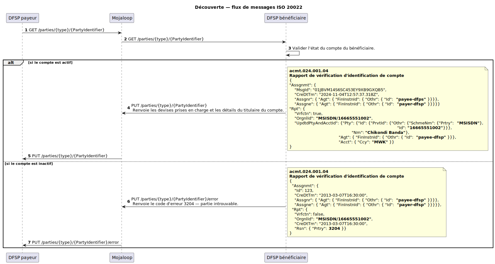
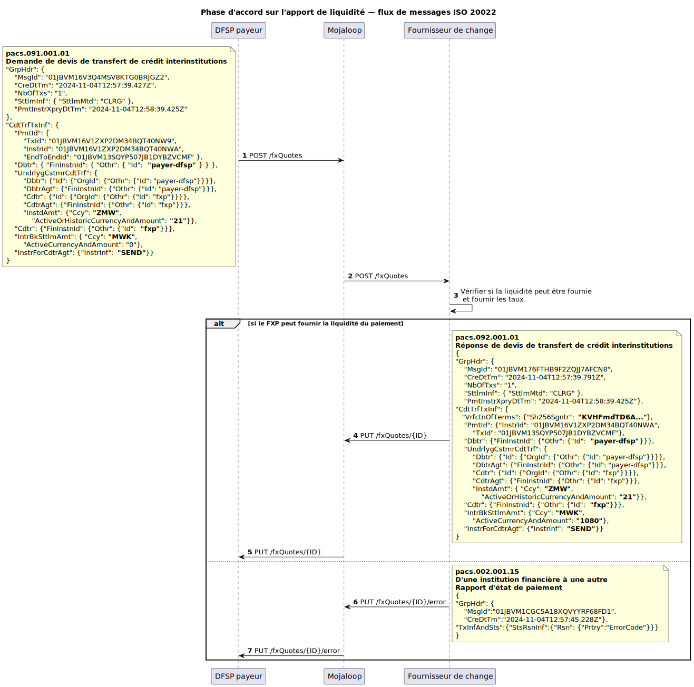
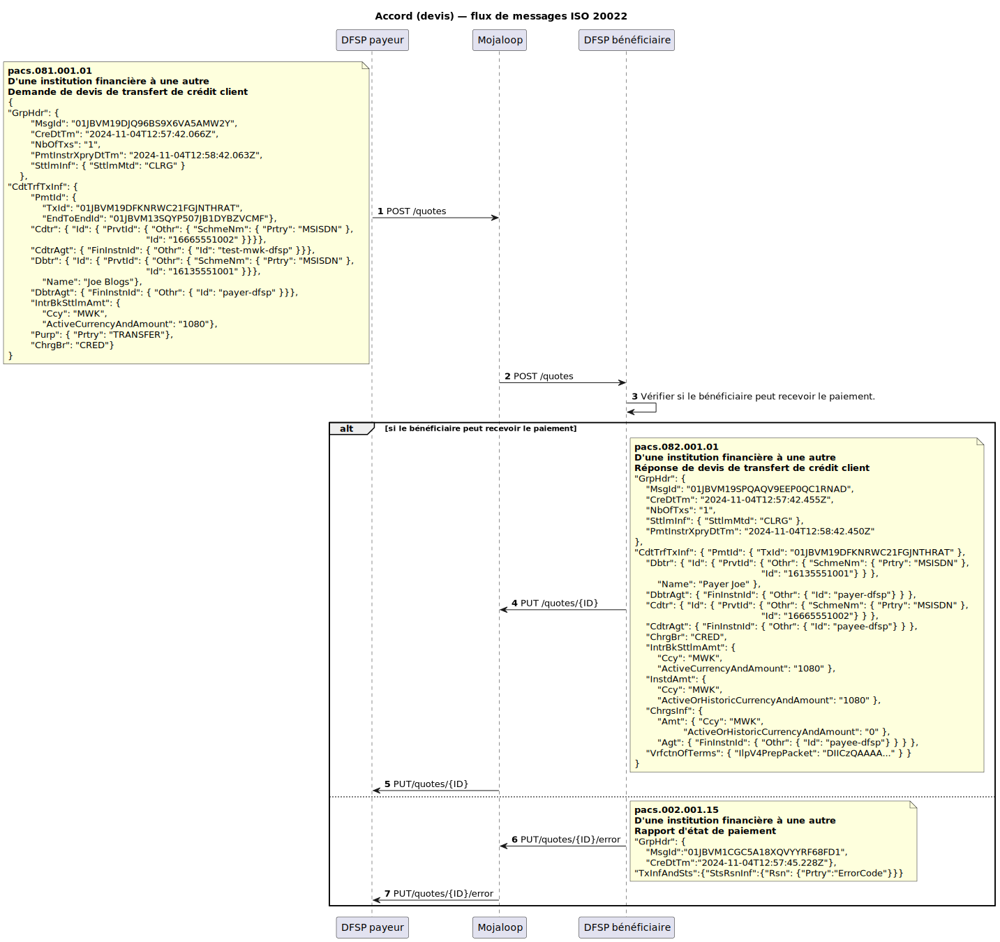
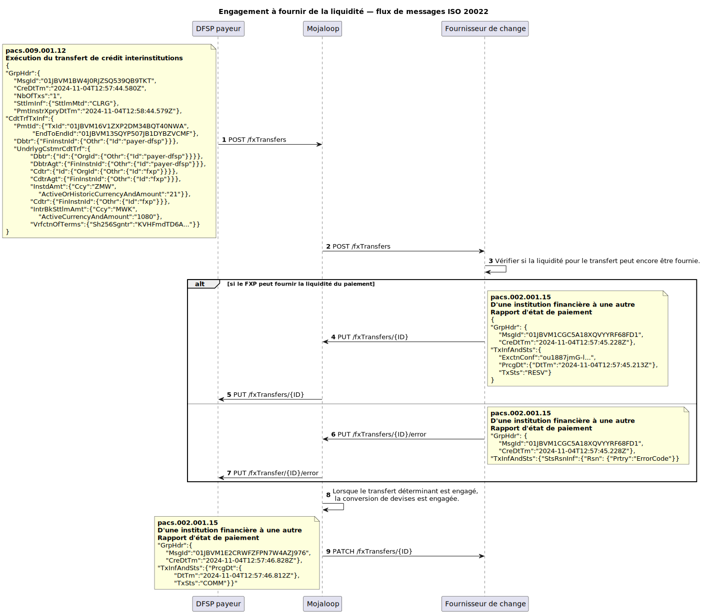
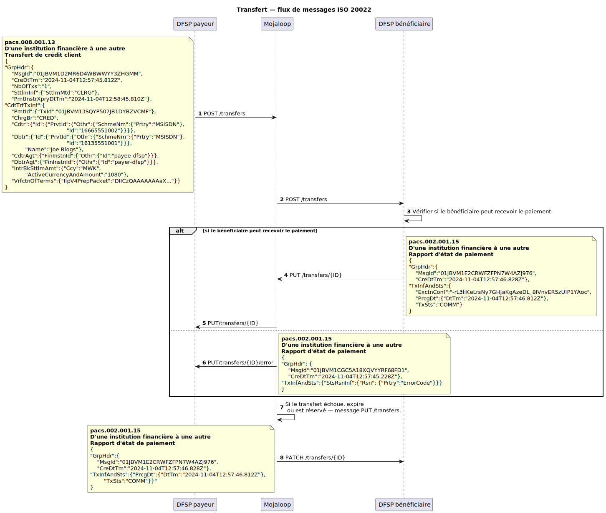

# v1.0 : document de pratique de marché ISO 20022 Mojaloop
 
<!-- TOC depthfrom:1 depthto:3 orderedlist:true -->

- [1. Mojaloop ISO 20022 Market Practice Document](#_1-mojaloop-iso-20022-market-practice-document)
- [2. Introduction](#_2-introduction)
    - [2.1. How to Use This Document?](#_2-1-how-to-use-this-document)
        - [2.1.1. Relationship with Scheme-Specific Rules Documents](#_2-1-1-relationship-with-scheme-specific-rules-documents)
        - [2.1.2. Distinction Between Generic Practices and Scheme-Specific Requirements](#_2-1-2-distinction-between-generic-practices-and-scheme-specific-requirements)
- [3. Message Expectations, Obligations, and Rules](#_3-message-expectations-obligations-and-rules)
    - [3.1. Currency Conversion](#_3-1-currency-conversion)
    - [3.2. JSON Messages](#_3-2-json-messages)
    - [3.3. APIs](#_3-3-apis)
        - [3.3.1. Header Details](#_3-3-1-header-details)
        - [3.3.2. Supported HTTP Responses](#_3-3-2-supported-http-responses)
        - [3.3.3. Common Error Payload](#_3-3-3-common-error-payload)
    - [3.4. ULIDs as Unique Identifiers](#_3-4-ulids-as-unique-identifiers)
    - [3.5. Inter-ledger Protocol v4 to represent the Cryptographic Terms](#_3-5-inter-ledger-protocol-v4-to-represent-the-cryptographic-terms)
    - [3.6. ISO 20022 Supplementary Data Fields](#_3-6-iso-20022-supplementary-data-fields)
- [4. Discovery Phase](#_4-discovery-phase)
    - [4.1. Message flow](#_4-1-message-flow)
    - [4.2. Parties Resource](#_4-2-parties-resource)
- [5. Agreement Phase](#_5-agreement-phase)
    - [5.1. Currency Conversion Agreement Sub-Phase](#_5-1-currency-conversion-agreement-sub-phase)
        - [5.1.1. Message flow](#_5-1-1-message-flow)
        - [5.1.2. fxQuotes Resource](#_5-1-2-fxquotes-resource)
    - [5.2. Transfer Terms Agreement Sub-Phase](#_5-2-transfer-terms-agreement-sub-phase)
        - [5.2.1. Message flow](#_5-2-1-message-flow)
        - [5.2.2. Quotes Resource](#_5-2-2-quotes-resource)
- [6. Transfer Phase](#_6-transfer-phase)
    - [6.1. Accepting Currency Conversion terms](#_6-1-accepting-currency-conversion-terms)
        - [6.1.1. Message flow](#_6-1-1-message-flow)
        - [6.1.2. fxTransfers Resource](#_6-1-2-fxtransfers-resource)
    - [6.2. Transfer Execution and Clearing](#_6-2-transfer-execution-and-clearing)
        - [6.2.1. Message flow](#_6-2-1-message-flow)
        - [6.2.2. Transfers Resource](#_6-2-2-transfers-resource)

<!-- /TOC -->
# 2. Introduction

En combinant les principes d’inclusion financière et les capacités d’ISO 20022, Mojaloop permet aux DFSP et autres parties prenantes de proposer des paiements en temps réel, économiques, sécurisés et évolutifs pour les écosystèmes financiers inclusifs. Ce document est la version 1.0 de la pratique de marché Mojaloop ISO 20022.

## 2.1 Comment utiliser ce document ?
Ce document constitue une référence de base pour mettre en œuvre la messagerie ISO 20022 pour les SIIP dans les schémas basés sur Mojaloop. Il décrit des lignes directrices et pratiques générales communes à tous les schémas Mojaloop, centrées sur les exigences de base. Il doit toutefois être complété par des documents de règles propres au schéma, pouvant définir des champs de message, validations et règles supplémentaires pour répondre aux réglementations et besoins spécifiques. Cette approche par couches permet d’adapter les détails d’implémentation tout en restant aligné sur le cadre Mojaloop.

### 2.1.1 Lien avec les documents de règles propres au schéma
Ce document pose les fondations de l’application d’ISO 20022 dans Mojaloop (principes et pratiques cœur). Il ne prescrit pas les exigences métier détaillées, validations et cadres de gouvernance propres à chaque schéma. Les règles de schéma couvrent ces aspects : champs obligatoires et facultatifs, protocoles de conformité sur mesure, procédures de gestion des erreurs, règles métier sur les flux de messages, rôles et responsabilités des participants. La flexibilité du présent document permet aux administrateurs de schéma d’adapter et d’étendre les orientations selon leurs besoins opérationnels.

### 2.1.2 Distinction entre pratiques génériques et exigences propres au schéma
Le document sépare clairement pratiques génériques et exigences de schéma pour concilier cohérence et adaptabilité des implémentations ISO 20022 dans Mojaloop. Les pratiques génériques établissent les principes fondateurs : attentes sur les structures de messages, champs requis pour le switch, champs supportés et flux transactionnels, ainsi qu’une vue d’ensemble du cycle de vie d’un transfert P2P avec change Mojaloop.

Les exigences propres au schéma, documentées séparément, détaillent mappages de champs supplémentaires, validations renforcées et règles précises de règlement, rapprochement et résolution de litiges, ainsi que politiques de gouvernance et obligations de conformité.

Cette distinction permet aux DFSP d’implémenter un noyau de messagerie cohérent tout en laissant aux administrateurs de schéma la flexibilité sur les détails opérationnels. Les pratiques génériques sont conçues pour être extensibles et s’intégrer aux règles de schéma, conformément aux standards Mojaloop ISO 20022 pour les SIIP.

# 3 Attentes, obligations et règles applicables aux messages
Le processus de transfert Mojaloop comporte trois phases clés pour des transactions sûres et efficaces. Chaque phase s’appuie sur des ressources spécifiques pour les interactions entre participants, assurant communication, accord et exécution. Certaines phases et ressources sont facultatives ; l’objectif reste que chaque transfert soit exact, sécurisé et conforme aux conditions convenues.
1. [Découverte](#_4-discovery-phase)
2. [Accord](#_5-agreement-phase)
3. [Transfert](#_6-transfer-phase)

## 3.1 Conversion de devises
La conversion de devises prend en charge les transactions multi-devises. Comme elle n’est pas toujours nécessaire, les messages et flux associés ne sont utilisés qu’en cas de besoin, pour la flexibilité mono- ou multi-devises.

## 3.2 Messages JSON
Mojaloop adopte une variante JSON des messages ISO 20022 plutôt que le XML traditionnel, pour l’efficacité et la compatibilité avec les API modernes. L’organisation ISO 20022 développe une représentation JSON canonique ; Mojaloop entend s’y aligner à mesure de son évolution.

## 3.3 API
Les messages ISO 20022 sont échangés dans Mojaloop via des appels de type REST. Cela favorise l’interopérabilité, réduit le volume de données grâce au JSON léger et soutient des implémentations modulaires et évolutives. L’intégration d’ISO 20022 avec des API REST offre un cadre robuste et adaptable, entre normes mondiales et contraintes de mise en œuvre.

### 3.3.1 Détails des en-têtes
L’en-tête du message API doit contenir les éléments suivants. Les en-têtes obligatoires sont marqués d’un astérisque `*`.

| Nom&nbsp;&nbsp;&nbsp;&nbsp;&nbsp;&nbsp;&nbsp;&nbsp;&nbsp;&nbsp;&nbsp;&nbsp;&nbsp;&nbsp;&nbsp;&nbsp;&nbsp;&nbsp;&nbsp;&nbsp;&nbsp;&nbsp;&nbsp;&nbsp;&nbsp;&nbsp;&nbsp;&nbsp;&nbsp;&nbsp;&nbsp;&nbsp;| Description |
|--|--|
|**Content-Length** *integer* (header)|The `Content-Length` header field indicates the anticipated size of the payload body. Only sent if there is a body.**Note:** The API supports a maximum size of 5242880 bytes (5 Megabytes).|
| * **Type** *string* (path)|The type of the party identifier. For example, `MSISDN`, `PERSONAL_ID`.|
| * **ID** *string* (path)| The identifier value.|
| * **Content-Type**  *string* (header)|The `Content-Type` header indicates the specific version of the API used to send the payload body.|
| * **Date** *string* (header)|The `Date` header field indicates the date when the request was sent.|
| **X-Forwarded-For**   *string* (header)|The `X-Forwarded-For` header field is an unofficially accepted standard used for informational purposes of the originating client IP address, as a request might pass multiple proxies, firewalls, and so on. Multiple `X-Forwarded-For` values should be expected and supported by implementers of the API.**Note:** An alternative to `X-Forwarded-For` is defined in [RFC 7239](https://tools.ietf.org/html/rfc7239). However, to this point RFC 7239 is less-used and supported than `X-Forwarded-For`.|
| * **FSPIOP-Source**   *string* (header)|The `FSPIOP-Source` header field is a non-HTTP standard field used by the API for identifying the sender of the HTTP request. The field should be set by the original sender of the request. Required for routing and signature verification (see header field `FSPIOP-Signature`).|
| **FSPIOP-Destination**   *string* (header)|The `FSPIOP-Destination` header field is a non-HTTP standard field used by the API for HTTP header based routing of requests and responses to the destination. The field must be set by the original sender of the request if the destination is known (valid for all services except GET /parties) so that any entities between the client and the server do not need to parse the payload for routing purposes. If the destination is not known (valid for service GET /parties), the field should be left empty.|
| **FSPIOP-Encryption**   *string* (header) | The `FSPIOP-Encryption` header field is a non-HTTP standard field used by the API for applying end-to-end encryption of the request.|
| **FSPIOP-Signature**   *string*   (header)| The `FSPIOP-Signature` header field is a non-HTTP standard field used by the API for applying an end-to-end request signature.|
| **FSPIOP-URI**   *string*   (header) | The `FSPIOP-URI` header field is a non-HTTP standard field used by the API for signature verification, should contain the service URI. Required if signature verification is used, for more information, see [the API Signature document](https://docs.mojaloop.io/technical/api/fspiop/).|
| **FSPIOP-HTTP-Method**   *string*   (header) | The `FSPIOP-HTTP-Method` header field is a non-HTTP standard field used by the API for signature verification, should contain the service HTTP method. Required if signature verification is used, for more information, see [the API Signature document](https://docs.mojaloop.io/technical/api/fspiop/).|

### 3.3.2 Réponses HTTP prises en charge

| **Code d’erreur HTTP** | **Description et causes fréquentes** |
|---|----|
|**400 Bad Request** | **Description** : le serveur n’a pas pu interpréter la requête (syntaxe invalide). La requête est mal formée ou contient des paramètres invalides. **Causes fréquentes** : champs obligatoires manquants, valeurs invalides, format incorrect. |
|**401 Unauthorized** | **Description** : le client doit s’authentifier. La requête ne comporte pas d’identifiants valides. **Causes fréquentes** : jeton d’authentification manquant ou invalide. |
|**403 Forbidden** | **Description** : le client n’a pas les droits d’accès. Le serveur a compris la requête mais refuse de l’autoriser. **Causes fréquentes** : permissions insuffisantes sur la ressource. |
|**404 Not Found** | **Description** : la ressource demandée est introuvable. **Causes fréquentes** : identifiant incorrect ou ressource supprimée. |
|**405 Method Not Allowed** | **Description** : la méthode HTTP n’est pas autorisée pour cette ressource. **Causes fréquentes** : méthode non supportée (ex. POST au lieu de PUT). |
|**406 Not Acceptable** | **Description** : le serveur ne peut pas produire une réponse acceptable selon les en-têtes de négociation (Accept, etc.). **Causes fréquentes** : type ou format média non supporté dans Accept. |
|**501 Not Implemented** | **Description** : le serveur ne prend pas en charge la fonctionnalité requise. **Causes fréquentes** : fonctionnalité non implémentée. |
|**503 Service Unavailable** | **Description** : le serveur ne peut pas traiter la requête temporairement (maintenance ou surcharge). **Causes fréquentes** : maintenance, surcharge ou indisponibilité. |

### 3.3.3 Charge utile d’erreur commune

Toutes les réponses d’erreur renvoient une structure commune incluant un message explicite. La charge contient en général :

- **errorCode** : code de l’erreur.
- **errorDescription** : description de l’erreur.
- **extensionList** : liste facultative de paires clé-valeur avec des informations complémentaires.

Cette charge aide les clients à comprendre l’erreur et à réagir de façon appropriée.

## 3.4 ULID comme identifiants uniques
Mojaloop utilise des identifiants uniques lexicographiquement triables (ULID) comme standard d’identifiants dans sa messagerie. Les ULID constituent une alternative solide aux UUID, avec unicité globale et ordre naturel par date de création, ce qui facilite traçabilité, diagnostic et analyses opérationnelles.

## 3.5 Protocole Interledger (v4) pour les termes cryptographiques
Mojaloop s’appuie sur ILP version 4 pour définir et représenter les termes cryptographiques dans les transferts. ILP v4 offre un cadre normalisé pour l’échange sécurisé et interopérable d’instructions de paiement, avec intégrité et non-répudiation. L’intégration des capacités cryptographiques d’ILP permet des accords précis et inviolables entre participants et l’exécution sécurisée de transferts de bout en bout, tout en restant compatible avec les écosystèmes de paiement mondiaux.

## 3.6 Champs de données supplémentaires ISO 20022

Aucun message utilisé ne devrait exiger de champs de données supplémentaires ISO 20022. Si des données supplémentaires sont fournies, le switch ne rejette pas le message mais ignore leur contenu, comme si elles étaient absentes.

# 4. Phase de découverte
La phase de découverte est une étape facultative du transfert, nécessaire uniquement lorsque le bénéficiaire (partie finale) doit être identifié et confirmé avant d’engager un accord. Elle s’appuie sur la ressource *parties*, qui permet d’obtenir et de valider les informations du bénéficiaire pour vérifier son éligibilité au transfert. Les contrôles clés incluent : compte actif, devises pouvant être créditées sur le compte, détails du titulaire. Le payeur peut ainsi vérifier les informations du bénéficiaire, limiter les erreurs et sécuriser les phases suivantes.

## 4.1 Flux de messages

Le diagramme de séquence illustre des messages d’exemple de découverte pour un transfert P2P initié par le payeur.

## 4.2 Ressource Parties
La ressource Parties regroupe les fonctions nécessaires à la phase de découverte. Le flux démarre toujours par un appel GET /parties ; les réponses sont renvoyées à l’initiateur via le rappel PUT /parties. Les erreurs passent par PUT /parties/.../error. Ces points de terminaition prennent en charge un type de sous-identifiant facultatif.

| Point de terminaison | Message |
|--- | --- |
|[GET /parties/{type}/{partyIdentifier}[/{subId}]](./script/parties_GET.md) |  |
|[PUT /parties/{type}/{partyIdentifier}[/{subId}]](./script/parties_PUT.md) | acmt.024.001.04 |
|[PUT /parties/{type}/{partyIdentifier}[/{subId}]/error](./script/parties_error_PUT.md) | acmt.024.001.04 |

# 5. Phase d’accord
La **phase d’accord** est une étape critique : toutes les parties doivent partager la même compréhension des conditions du transfert avant tout engagement de fonds. Elle remplit notamment les objectifs suivants :
1. **Calcul et accord sur les frais** 
Permet de calculer et d’accepter mutuellement les frais applicables, pour la transparence et pour limiter les litiges après le lancement du transfert.
1. **Validation avant engagement** 
Chaque organisation vérifie si le transfert peut avoir lieu, ce qui permet de détecter tôt les problèmes et de réduire erreurs et écarts de rapprochement.
1. **Signature cryptographique des conditions** 
Les conditions du transfert sont signées cryptographiquement, assurant la non-répudiation. Le protocole Interledger est utilisé ; la production de paquets ILP est décrite dans la [documentation API FSPIOP Mojaloop](https://docs.mojaloop.io/technical/api/fspiop/).
1. **Soutien à l’inclusion financière** 
En exposant clairement l’ensemble des conditions en amont, la phase d’accord garantit que les participants décident en connaissance de cause, pour des choix équitables et éclairés.

La phase d’accord renforce fiabilité et efficacité des transferts Mojaloop et la confiance dans les écosystèmes financiers numériques inclusifs.

Elle se subdivise en deux sous-phases.

## 5.1 Sous-phase d’accord sur la conversion de devises
Cette sous-phase est facultative ; elle s’active seulement si le transfert implique une conversion de devises. Le DFSP payeur coordonne alors un fournisseur de change pour sécuriser la liquidité inter-devises nécessaire. Les taux de change et frais associés sont fixés de façon transparente et acceptée par le DFSP et le FXP. Traiter la conversion avant l’engagement du transfert limite retards et écarts, notamment pour les opérations transfrontalières.

### 5.1.1 Flux de messages

Le diagramme de séquence illustre des messages d’exemple pour un transfert P2P initié par le payeur.

### 5.1.2 Ressource fxQuotes

| Point de terminaison | Message |
|--- | --- |
|[POST /fxQuotes/{ID}](./script/fxquotes_POST.md) | **pacs.091.001** |
|[PUT /fxQuotes/{ID}](./script/fxquotes_PUT.md) | **pacs.092.001** |
|[PUT /fxQuotes/{ID}/error](./script/fxquotes_error_PUT.md) | **pacs.002.001.15** |

## 5.2 Sous-phase d’accord sur les conditions de transfert
Cette sous-phase établit de concert les conditions du transfert entre le DFSP payeur et le DFSP bénéficiaire : montant, frais, délais, etc. Elle permet aussi la signature cryptographique de ces conditions pour la non-répudiation et la responsabilité. Finaliser les conditions de façon transparente limite erreurs et litiges et renforce l’efficacité et la confiance dans le processus Mojaloop.

### 5.2.1 Flux de messages

Le diagramme de séquence illustre des messages d’exemple pour un transfert P2P initié par le payeur.

### 5.2.2 Ressource Quotes

| Point de terminaison | Message |
| ------------- | --- |
|[POST /quotes/{ID}](./script/quotes_POST.md) | **pacs.081.001** |
|[PUT /quotes/{ID}](./script/quotes_PUT.md) | **pacs.082.001** |
|[PUT /quotes/{ID}/error](./script/quotes_error_PUT.md) | **pacs.002.001.15** |

# 6. Phase de transfert
Une fois les accords conclus pendant la phase d’accord, leur acceptation déclenche la phase de transfert, où intervient le mouvement effectif des fonds. Elle est exécutée avec précision pour respecter les conditions convenues et les engagements de chaque participant. Elle comporte deux sous-phases : exécution de la conversion de devises et compensation du transfert, en miroir des sous-phases d’accord correspondantes.

## 6.1 Acceptation des conditions de conversion de devises
Cette sous-phase a lieu si le transfert comporte un change. Le fournisseur de change convenu pendant la phase d’accord exécute la conversion ; la liquidité inter-devises est fournie et les fonds convertis sont préparés pour la suite vers le DFSP bénéficiaire. Le FXP vérifie le respect des taux et frais convenus, pour l’intégrité financière et la transparence.

### 6.1.1 Flux de messages

Le diagramme de séquence illustre des messages d’exemple de transfert pour un P2P initié par le payeur.

### 6.1.2 Ressource fxTransfers

| Point de terminaison | Message |
| -------- | --- |
|[POST /fxTransfers/{ID}](./script/fxtransfers_POST.md) | **pacs.009.001** |
|[PUT /fxTransfers/{ID}](./script/fxtransfers_PUT.md) | **pacs.002.001.15** |
|[PUT /fxTransfers/{ID}/error](./script/fxtransfers_error_PUT.md) | **pacs.002.001.15** |
|[PATCH /fxTransfers/{ID}/error](./script/fxtransfers_PATCH.md) | **pacs.002.001.15** |

## 6.2 Exécution et compensation du transfert
Cette sous-phase couvre le transfert effectif des fonds entre le DFSP payeur et le DFSP bénéficiaire : le montant convenu, y compris les frais, est compensé sur les comptes appropriés. Elle achève l’opération financière et honore les engagements de la phase d’accord, via des mécanismes de mouvement de fonds sécurisés et efficaces.

### 6.2.1 Flux de messages

Le diagramme de séquence illustre des messages d’exemple pour un transfert P2P initié par le payeur.

### 6.2.2 Ressource Transfers

| Point de terminaison | Message |
| --------- | --- |
|[POST /transfers/{ID}](./script/transfers_POST.md) | **pacs.008.001** |
|[PUT /transfers/{ID}](./script/transfers_PUT.md) | **pacs.002.001.15** |
|[PUT /transfers/{ID}/error](./script/transfers_error_PUT.md) | **pacs.002.001.15** |
|[PATCH /transfers/{ID}/error](./script/transfers_PATCH.md) | **pacs.002.001.15** |

