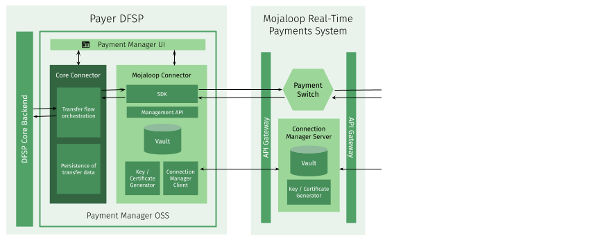
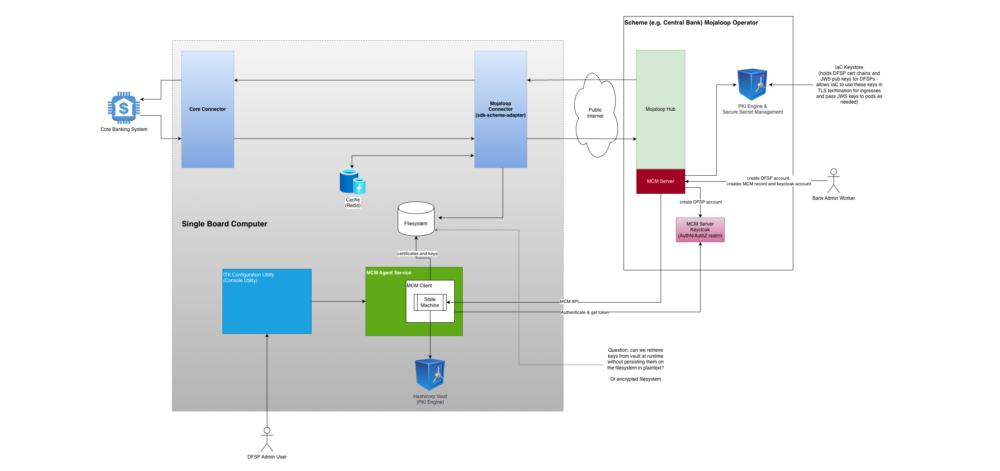

# Guide de sélection et d’utilisation des outils de participation

# Contexte

La communauté Mojaloop a développé une gamme d’outils à l’usage des DFSP participants, qui facilitent la connexion entre le système d’information du DFSP et un schéma basé sur Mojaloop (le Hub). Chacun joue le rôle d’une couche d’adaptation qui prend en charge la complexité des API Mojaloop et des exigences de sécurité, permettant au DFSP de connecter plus aisément son système d’information. Cela peut grandement faciliter l’intégration, en réduisant à la fois le coût direct (les outils de participation sont en open source et peuvent être téléchargés librement) et le coût indirect (le temps d’intégration est fortement réduit, car la complexité est gérée au sein de l’outil). Le coût de maintenance courant est également bien moindre, car les outils de participation sont maintenus par la communauté Mojaloop et ne nécessitent qu’une « personnalisation » par chaque DFSP.

Contrairement au Hub Mojaloop lui-même, les outils de participation sont destinés à être déployés dans le périmètre du DFSP ; leur mise en œuvre et leur utilisation restent de la responsabilité de chaque DFSP, avec toutefois l’appui de la communauté Mojaloop.

La communauté a pris acte du fait que les DFSP ont des exigences et contraintes différentes vis-à-vis des outils de participation, ce qui se reflète dans la diversité des offres.

# Fonctionnalités

L’un des objectifs centraux des outils de participation est de masquer la complexité de l’API Mojaloop. Outre toute la dimension sécurité, les outils prennent en charge des procédures Mojaloop complexes et multi-étapes — telles que la recherche de parties, l’accord sur les conditions et les transferts — et les présentent aux systèmes du DFSP de manière plus simple.

Pour cela, tous les outils de participation offrent les services suivants :

1. Gestion de la connexion entre le DFSP et le Hub Mojaloop, notamment la mise en place et l’exploitation de la sécurité, y compris l’échange de certificats de clés.  
2. Intégration complète des API avec le Hub Mojaloop, couvrant :  
   1. L’administration, par exemple la configuration du routage ou des alias pour les clients du DFSP ;  
   2. La participation aux transactions en tant qu’institution débitrice ou créditrice ;  
   3. La prise en charge de l’autorisation (y compris l’autorisation continue) pour les transactions initiées par des tiers (par exemple les fintechs).  
3. Une série d’outils open source pour faciliter la connexion entre l’outil de participation et le système d’information du DFSP (directement au système bancaire cœur, au moteur de paiements ou à une plateforme de messagerie).

# Éléments architecturaux communs

L’architecture commune à tous les outils de participation repose sur plusieurs composants clés qui coopèrent pour faciliter la connexion et la gestion des transactions.

## Connecteur cœur (*Core Connector*)

C’est le composant d’intégration central qui agit comme « traducteur » entre le système d’information du DFSP et l’outil de participation. Des modèles sont fournis dans le cadre Apache Camel, qui offre un langage déclaratif orienté intégration, et en TypeScript, langage largement connu. Les intégrateurs système et/ou les participants peuvent utiliser ces modèles ou créer un connecteur sur mesure dans la pile technologique de leur choix. L’usage de modèles permet d’adapter le connecteur cœur à la technologie dorsale existante du DFSP sans l’obliger à modifier ses propres systèmes.

## Connecteur Mojaloop (*Mojaloop Connector*)

Ce composant communique directement avec le Hub Mojaloop et comprend deux sous-composants essentiels :  
**Mojaloop-SDK :** fournit les éléments de sécurité nécessaires et traite les en-têtes HTTP de manière conforme à Mojaloop.

**API simplifiée :** propose une version plus synchrone et orientée cas d’usage de l’API FSPIOP Mojaloop, plus facile à consommer pour les systèmes dorsaux du DFSP.

## Client Mojaloop Connection Manager (MCM)

Ce client automatise et simplifie la configuration des connexions vers différents environnements Mojaloop. Il gère la création, la signature et l’échange des certificats numériques, exigence de sécurité critique pour l’écosystème Mojaloop.

# Flux de transaction de haut niveau

Les outils de participation facilitent le processus de transaction en servant de passerelle du DFSP vers le Hub Mojaloop :

* Une transaction est initiée par le système d’information du DFSP.  
* Le système d’information envoie la demande au connecteur cœur au sein de l’outil de participation.  
* Le connecteur cœur traduit la demande pour le connecteur Mojaloop et son API simplifiée.  
* Le connecteur Mojaloop communique de manière sécurisée avec le switch Mojaloop (Hub) via le Mojaloop-SDK.  
* Les paiements sont routés et orchestrés par le Hub Mojaloop vers le DFSP destinataire.  
* L’outil de participation fournit des mises à jour de statut et des informations de rapprochement au DFSP via les portails de supervision, lorsque ceux-ci sont mis en œuvre.

# Outils de participation disponibles

On distingue deux grandes familles d’outils de participation : d’abord Payment Manager, qui offre toute la fonctionnalité et la flexibilité qu’une grande banque peut exiger ; ensuite un ensemble de solutions autour de l’Integration Toolkit Mojaloop, dimensionnables et hébergeables pour répondre aux besoins variés d’un large éventail d’autres DFSP.

## Payment Manager

Également connu sous le nom de Payment Manager for Mojaloop (PM4ML), Payment Manager est un outil de participation Mojaloop complet qui offre toutes les fonctionnalités qu’attendrait une grande banque. Il peut être déployé dans le cloud ou dans le centre de données de la banque et prend en charge toutes les options de reprise après sinistre habituelles dans ce contexte. Il dispose aussi de capacités étendues de gestion et de reporting.

 

 	
 
 
**Figure 1 : architecture de Payment Manager**

Le schéma ci-dessus représente une vue de haut niveau de l’architecture de Payment Manager et indique les éléments du Hub Mojaloop avec lesquels il interagit.

### Portails de Payment Manager

Les portails métier et techniques de PM4ML offrent des interfaces conviviales avec des tableaux de bord pour suivre les informations critiques :  
- **Supervision des transactions :** affiche les statuts de transaction en temps réel et historiques.  
- **État des services :** permet aux DFSP de suivre la santé et les performances de leurs connexions.  
- **Gestion de la configuration :** point unique pour gérer les clés de sécurité, les certificats et la configuration des points de terminaison.

## Integration Toolkit

La famille d’outils de participation Integration Toolkit est conçue pour offrir une grande flexibilité dans la manière dont un DFSP se connecte à un Hub Mojaloop, et peut être déployée sur divers environnements pour couvrir des besoins allant de la plus petite IMF à la plus grande banque.

### Vue d’ensemble

 

 	
 
 
**Figure 2 : architecture ITK**

Comme on peut s’y attendre, et comme l’illustre le schéma ci-dessus, il existe des points communs avec Payment Manager :

* Le connecteur cœur et le connecteur Mojaloop fonctionnent comme décrit précédemment.  
* Le client Mojaloop Connection Manager (MCM Client) reste chargé de la création, de la signature et de l’échange des certificats numériques, socle de la sécurité de la connexion au Hub Mojaloop.

Il existe toutefois des différences notables. Le fonctionnement du MCM Client est désormais soumis au contrôle des MCM Agent Services, qui orchestrent la gestion de la sécurité via une machine à états. Le contrôle et la configuration des Agent Services s’effectuent via l’ITK Configuration Utility, qui propose une interface de type console au personnel opérationnel du DFSP. Elle remplit le même rôle que le portail de configuration de Payment Manager.

La sécurité de l’ITK Configuration Utility / console relève de l’infrastructure de sécurité propre au DFSP. Le serveur (ou la machine virtuelle) sur lequel s’exécutent les composants ITK doit être sécurisé comme tout autre serveur du périmètre administratif du DFSP.

Contrairement à Payment Manager, l’ITK n’inclut pas de portails de supervision des transactions (prévu pour être pris en charge par les systèmes dorsaux existants du DFSP) ni d’état de service, tandis que l’ITK Configuration Utility remplit le même rôle que le portail de gestion de configuration de Payment Manager.

### Options de déploiement ITK

Les options de déploiement de l’ITK sont cataloguées dans la [matrice des fonctionnalités par participant](./participant-matrix.md) et se résument comme suit :

* **Un petit DFSP**, tel qu’une petite IMF ou banque, devrait en principe auto-héberger l’ITK. Cette approche couvre tous les cas d’usage sauf l’initiation des paiements de masse (la réception des paiements de masse reste possible). Des volumes de transaction modestes sont attendus (10 TPS au maximum), et une certaine indisponibilité (éventuellement de quelques heures) est acceptable.  
	  * Il est recommandé de déployer une version à fonctionnalités minimales de l’ITK sur un petit serveur, jusqu’à un ordinateur monocarte tel qu’un Raspberry Pi pour les plus petits DFSP.  
	  * La supervision des transactions doit passer par le système d’information existant du DFSP.  
	  * Le déploiement s’effectue via Docker Compose.  

* **Un DFSP de taille faible à moyenne**, tel qu’une banque ou une IMF avec une ou deux agences et son propre centre de données « placard à balais », devrait en principe auto-héberger l’ITK. Cette approche couvre tous les cas d’usage, y compris l’initiation de paiements de masse à petite échelle. Des pics d’environ 50 TPS sont pris en charge, et une indisponibilité limitée (de l’ordre de quelques heures) est acceptable.  
	  * Il est recommandé de déployer une version pleinement fonctionnelle de l’ITK sur un serveur de base, hébergé dans le centre de données du DFSP.  
	  * Un déploiement Kafka est nécessaire pour les paiements de masse.  
	  * Le déploiement s’effectue via Docker Compose ou Docker Swarm.  
	  * Intégration minimale avec les plateformes de sécurité d’entreprise existantes.  
	  * La supervision des transactions doit passer par le système d’information existant du DFSP.  

* **Un DFSP de taille moyenne à grande**, tel qu’une institution financière moyenne avec quelques agences, son propre centre de données et des compétences informatiques internes raisonnables, devrait héberger l’ITK. Cette approche couvre tous les cas d’usage, y compris l’initiation de paiements de masse à petite / moyenne échelle. Des pics d’environ 50 TPS sont pris en charge, et une indisponibilité limitée (de l’ordre de quelques minutes) est acceptable.  
	  * Pour respecter les exigences d’indisponibilité les plus strictes, une configuration multi-serveurs est nécessaire, gérée avec Kubernetes.  
	 * Il est recommandé de déployer une version pleinement fonctionnelle de l’ITK, la supervision des transactions passant par le système d’information existant du DFSP.  
	 * Un déploiement Kafka est nécessaire pour les paiements de masse.  
	 * Le déploiement s’effectue via Kubernetes.  
	 * Intégration possible avec les plateformes de sécurité d’entreprise existantes.  
* **Un grand DFSP**, tel qu’une institution financière mature multi-agences disposant d’un centre de données aux standards du secteur et de compétences informatiques internes avancées, est invité à utiliser Payment Manager.

## Applicabilité

La présente version de ce document correspond à Mojaloop version [17.1.0](https://github.com/mojaloop/helm/releases/tag/v17.1.0).

## Historique du document
  |Version|Date|Auteur|Détail|
|:--------------:|:--------------:|:--------------:|:--------------:|
|1.0|17 décembre 2025| Paul Makin |Version initiale|
