# Change étranger – conversion de devises

La fonctionnalité de conversion de devises de Mojaloop permet les opérations de change (FX) et prend en charge plusieurs approches de conversion au sein de l’écosystème. À ce jour, le système met en œuvre la **conversion de devises côté DFSP payeur**, où le DFSP payeur (*Digital Financial Services Provider*) coordonne son action avec un fournisseur de change (FXP) pour obtenir la liquidité dans une autre devise et faciliter le transfert.

Les évolutions futures prévues pour la conception de la conversion de devises comprennent :
1. **Conversion côté DFSP bénéficiaire** — Le DFSP bénéficiaire organise la conversion de devises.
1. **Conversion via devise de référence** — Le DFSP payeur et le DFSP bénéficiaire s’adressent chacun à des FXP pour convertir les fonds via une devise de référence.
1. **Conversion de masse** — Les DFSP peuvent se procurer de la liquidité en devises auprès d’un FXP par opérations de masse.

## Rôle du fournisseur de change (FXP)

Un élément central de la capacité de conversion de Mojaloop est la prise en charge d’un marché du change concurrentiel, où plusieurs FXP peuvent fournir des cotations de taux en temps réel. Cette conception favorise un environnement ouvert et dynamique pour les opérations de change.

Le processus de conversion de devises suit une chaîne en trois étapes :
1. **Demande de cotation** — Le DFSP payeur demande une cotation à un FXP. Par exemple, un DFSP zambien peut obtenir une cotation de conversion pour un transfert donné.
1. **Accord sur la cotation** — Le DFSP payeur examine le taux de change et les conditions proposés par le FXP. Une fois acceptés, le FXP bloque le taux.
1. **Finalisation du transfert** — Sur notification du schéma Mojaloop que le transfert dépendant est achevé, le processus de conversion est finalisé.

Cette approche clarifiée favorise la transparence et la concurrence sur les opérations FX, au bénéfice des DFSP et des utilisateurs finaux.

## Incidence du type de montant sur la conversion de devises

La mise en œuvre de la conversion côté DFSP payeur couvre deux scénarios distincts selon le type de montant indiqué dans la transaction :
1. **Envoi de fonds dans la devise source (locale)**
1. **Paiement dans la devise cible (étrangère)**

### Envoi de fonds vers un compte dans une autre devise

Dans ce cas d’usage, le **DFSP payeur** initie un transfert avec le type de montant **SEND**, en indiquant le montant dans la devise locale du payeur (devise source). Cette méthode est courante pour les transferts de **rémittance P2P**, où l’émetteur envoie des fonds dans sa devise locale et le bénéficiaire reçoit l’équivalent dans sa devise après conversion.

### Transfert avec conversion de devises (devise source) {#currency-conversion-transfer-source-currency}

Ci-dessous, un diagramme de séquence simplifié des flux entre les organisations participantes, les fournisseurs de change et le switch Mojaloop pour un transfert avec conversion de devises exprimé en **devise source**.

Le flux se décompose ainsi :
1. [Phase de découverte](#discovery-phase)
1. [Phase d’accord – conversion de devises](#agreement-phase---currency-conversion)
1. [Phase d’accord](#agreement-phase)
1. [Le DFSP payeur présente les conditions au payeur](#payer-dfsp-presents-terms-to-payer)
1. [Phase de transfert](#transfer-phase)

#### Phase de découverte {#discovery-phase}

Le DFSP payeur identifie l’organisation DFSP bénéficiaire et confirme la validité du compte et la devise.

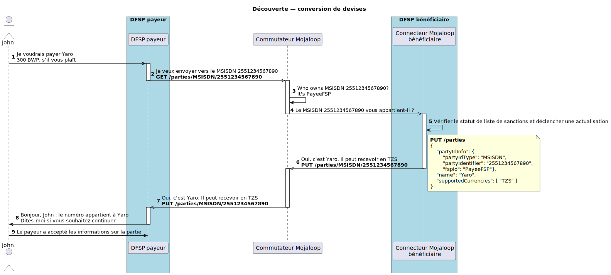

#### Phase d’accord – conversion de devises {#agreement-phase---currency-conversion}

Le DFSP payeur adresse une demande au FXP pour la couverture de liquidité du transfert. Les conditions de conversion de devises sont renvoyées.

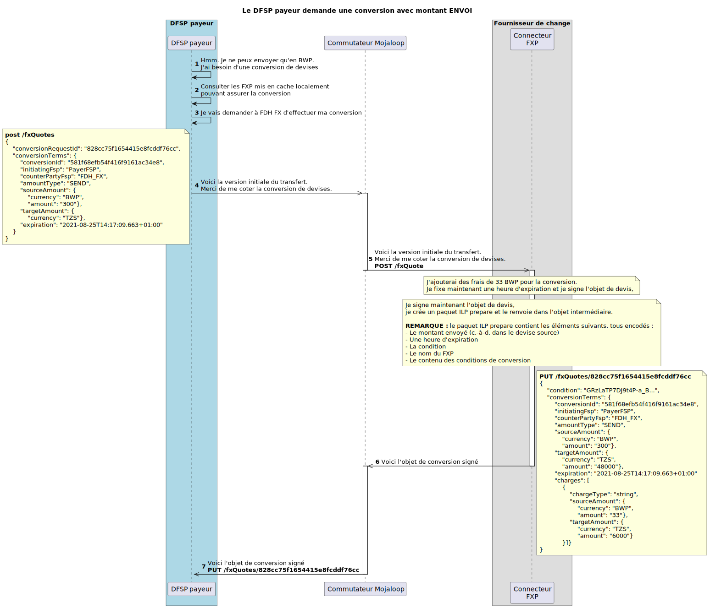

#### Phase d’accord {#agreement-phase}

Le DFSP payeur demande au DFSP bénéficiaire les conditions du transfert.

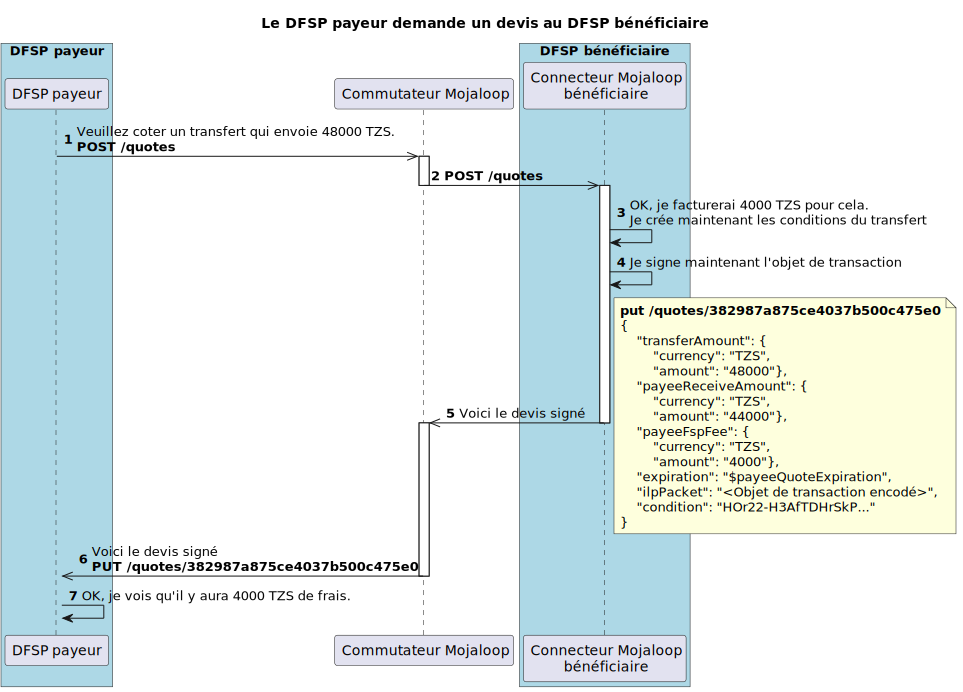

#### Le DFSP payeur présente les conditions au payeur {#payer-dfsp-presents-terms-to-payer}

À ce stade, les informations sur la partie, les conditions de conversion et les conditions de transfert ont été fournies au DFSP payeur. Le DFSP payeur les présente au payeur et lui demande s’il souhaite poursuivre.

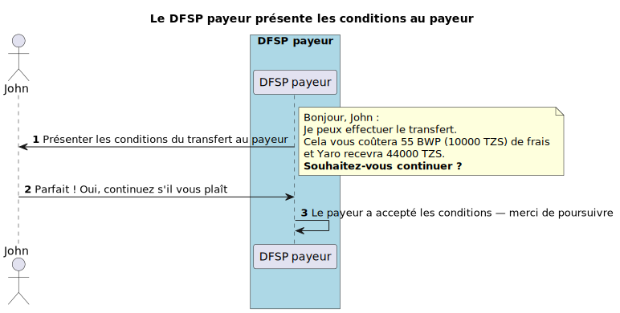

#### Phase de transfert {#transfer-phase}

Les conditions du transfert ayant été acceptées, le transfert peut avoir lieu. Les conditions de conversion et de transfert sont engagées conjointement.

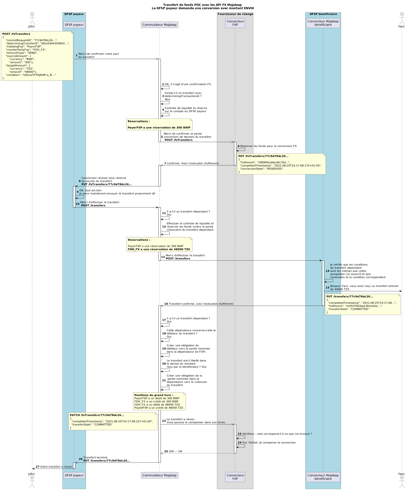

### Intégration du connecteur Mojaloop pour la conversion de devises

Le diagramme de séquence détaillé ci-dessous présente le flux complet, avec le **connecteur Mojaloop** et les API d’intégration pour toutes les organisations participantes. (Vue utile si vous réalisez des intégrations en tant qu’organisation participante.)

#### Phase de découverte – connecteur Mojaloop {#discovery-phase---mojaloop-connector}

Mojaloop s’appuie sur un oracle pour identifier l’organisation DFSP associée à l’identifiant de partie. Le DFSP bénéficiaire doit répondre au GET /parties pour confirmer que le compte existe et est actif pour cet identifiant. Les devises prises en charge pour ce compte sont renvoyées.

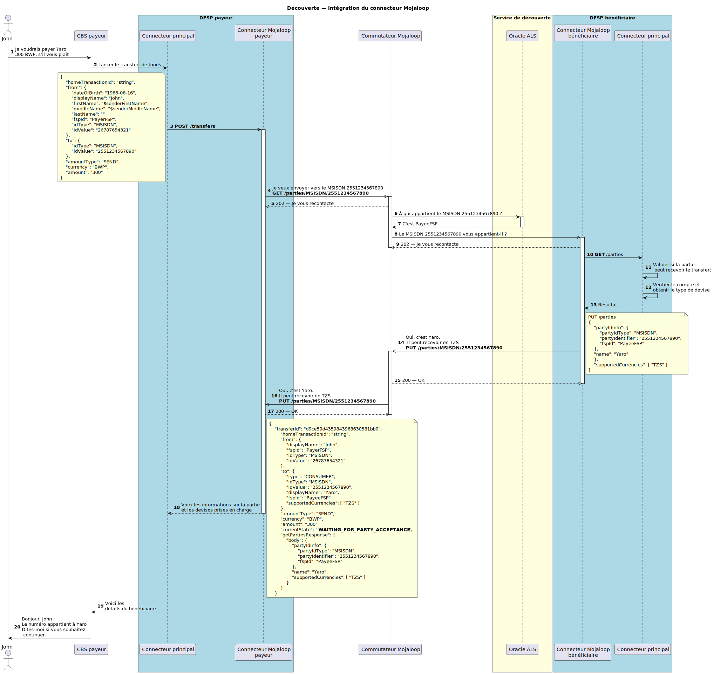

#### Phase d’accord – conversion de devises – connecteur Mojaloop {#agreement-phase-currency-conversion---mojaloop-connector}

Le DFSP payeur n’effectue pas d’opérations dans les devises prises en charge par le DFSP bénéficiaire. Cela déclenche le besoin de conversion de devises au sein du connecteur Mojaloop. Le DFSP payeur utilise son cache local des FXP pour en sélectionner un et envoie une demande au fournisseur de change pour couverture de liquidité et taux de conversion.

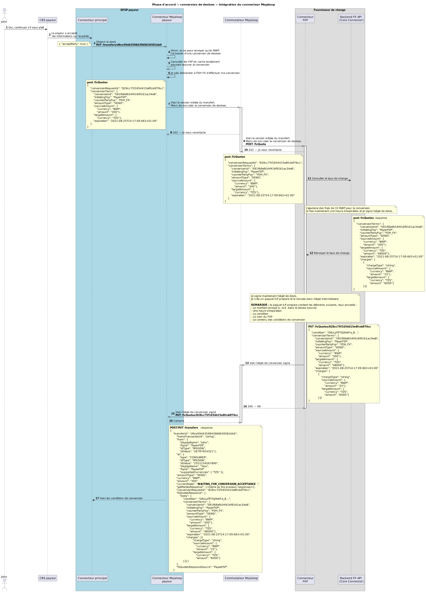

#### Phase d’accord – connecteur Mojaloop {#agreement-phase---mojaloop-connector}

La liquidité en devise cible est assurée. Le DFSP payeur peut demander l’accord sur les conditions au DFSP bénéficiaire. Ces conditions sont exprimées en devise cible.

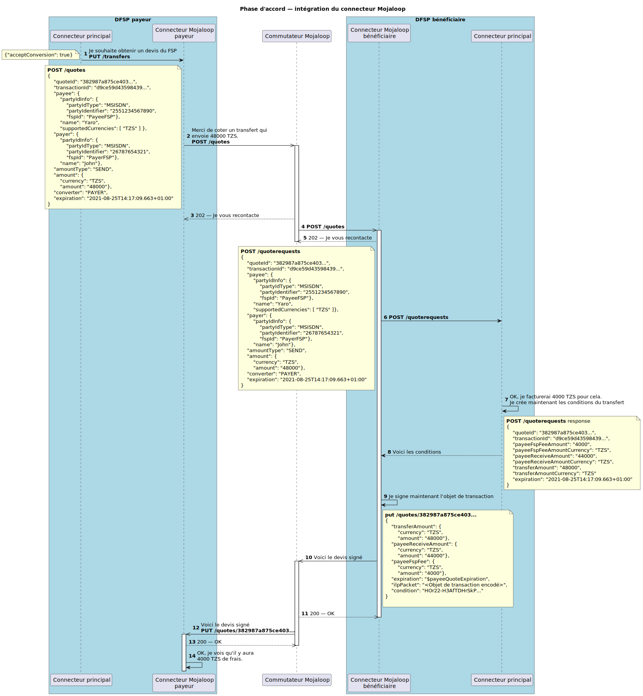

#### Confirmation par l’émetteur {#sender-confirmation}

Toutes les conditions de conversion et de transfert ont été obtenues par le DFSP payeur et le FXP. Il s’agit maintenant de les regrouper et de les présenter au payeur pour confirmation.

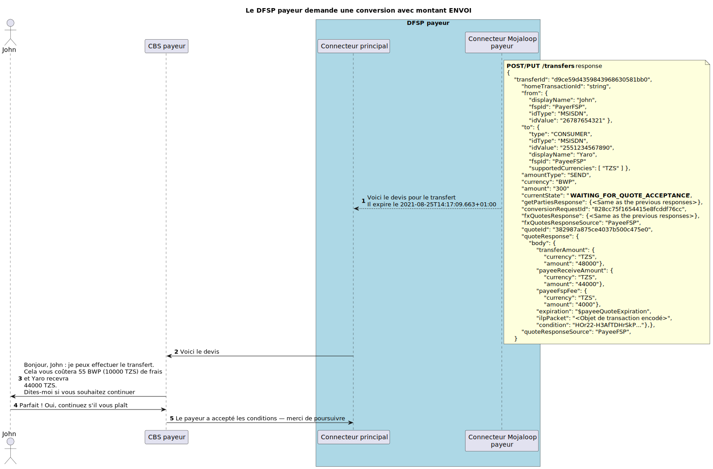

#### Phase de transfert {#transfer-phase-mojaloop-connector}

Les conditions du transfert ont été acceptées. La phase de transfert peut commencer.

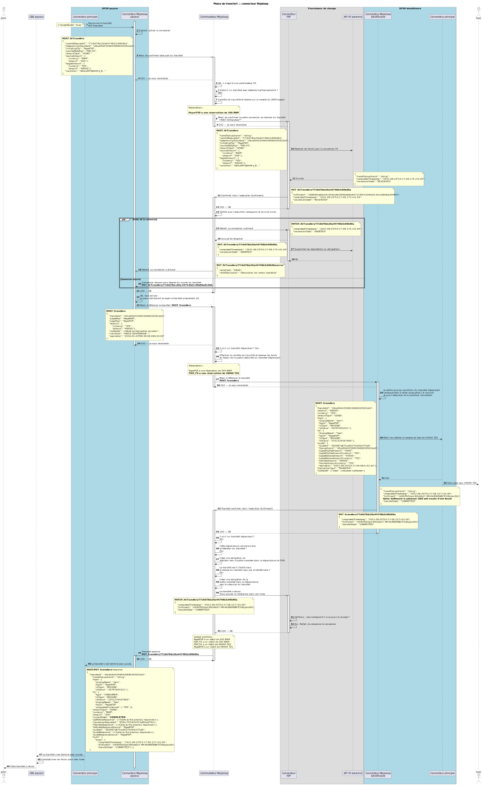

## Transfert avec conversion de devises (devise cible) {#currency-conversion-transfer-target-currency}

Pour ce cas d’usage, le DFSP payeur indique le transfert avec le type de montant **RECEIVE** et définit le montant dans la **devise locale du bénéficiaire** (devise cible). Un autre exemple est le paiement commerçant transfrontalier.

Ci-dessous, un diagramme de séquence détaillé du flux complet, avec le connecteur Mojaloop et les API d’intégration pour toutes les organisations participantes.

#### Découverte {#discovery-receive}

Mojaloop s’appuie sur un oracle pour identifier l’organisation DFSP associée à l’identifiant de partie. Le DFSP bénéficiaire doit répondre au GET /parties pour confirmer que le compte existe et est actif pour cet identifiant. Les devises prises en charge pour ce compte sont renvoyées.

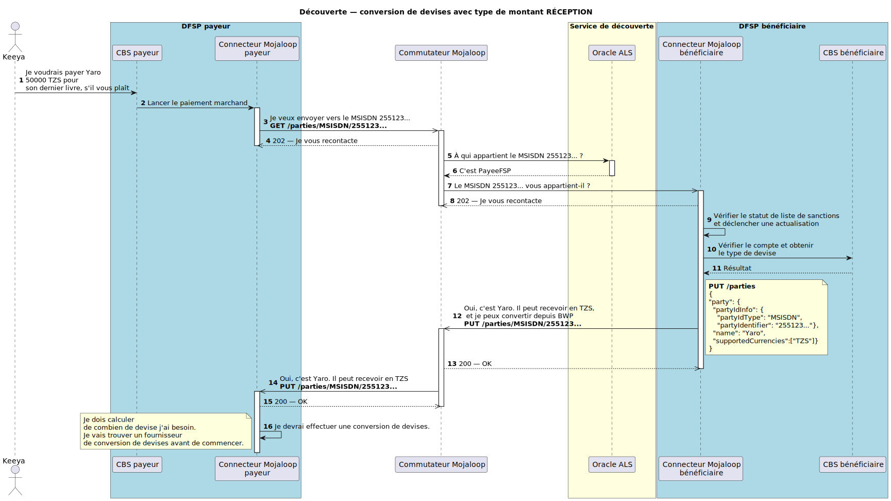

#### Accord {#agreement-receive}

Le DFSP payeur ne prend en charge aucune des devises du DFSP bénéficiaire, ce qui impose une conversion de devises dans le connecteur Mojaloop. Comme la demande de paiement est en devise cible, un accord avec le DFSP bénéficiaire doit être établi avant d’initier la demande de liquidité auprès du fournisseur de change. Le DFSP payeur négocie d’abord les conditions de transfert avec le DFSP bénéficiaire, puis utilise son cache local de fournisseurs de change pour en choisir un et demander couverture de liquidité et taux de conversion.

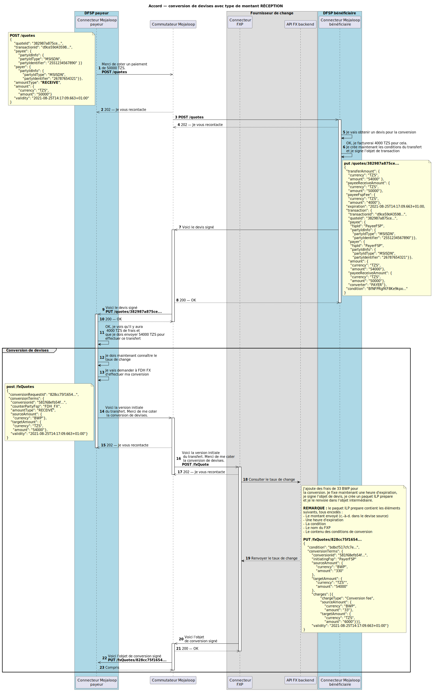

#### Confirmation par l’émetteur {#sender-confirmation-receive}

Toutes les conditions de conversion et de transfert ont été obtenues par le DFSP payeur et le FXP. Il s’agit maintenant de les regrouper et de les présenter au payeur pour confirmation.

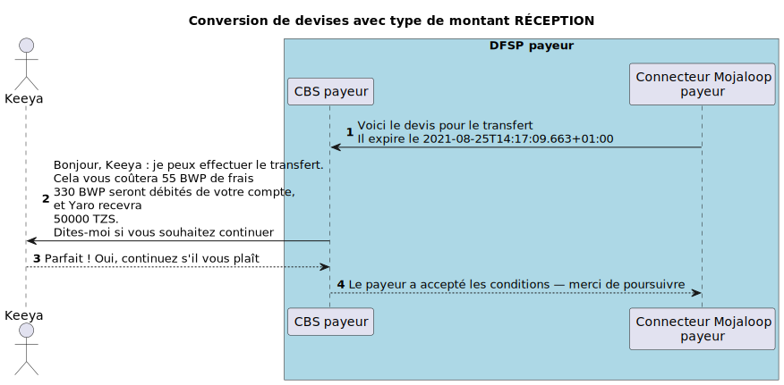

#### Transfert {#transfer-receive}

Les conditions du transfert ont été acceptées. La phase de transfert peut commencer.

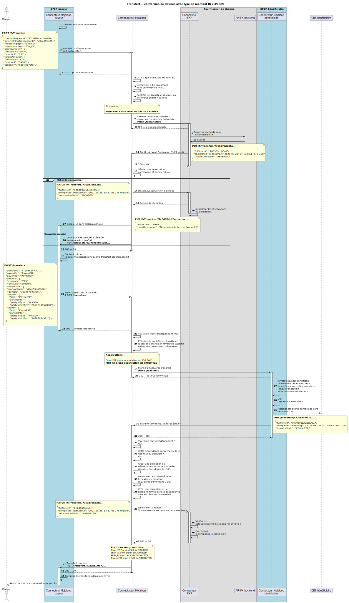

## Flux d’abandon {#abort-flows}

Ce diagramme de séquence illustre la manière dont la conception prend en charge les messages d’abandon pendant la phase de transfert avec conversion de devises.

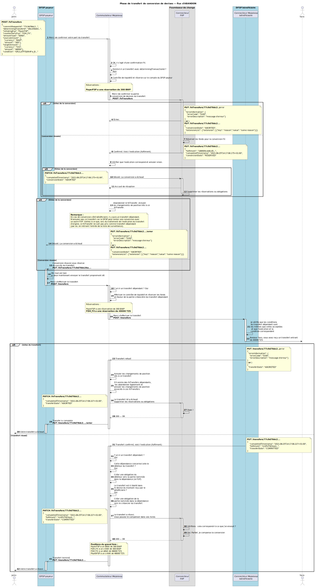

## Références OpenAPI {#open-api-references}

Ces références OpenAPI sont rédigées pour être lisibles tant par les équipes logicielles que par les relecteurs. Elles décrivent les exigences détaillées et la mise en œuvre de la conception d’API.

- [Spécification FSPIOP v2.0](https://mojaloop.github.io/api-snippets/?urls.primaryName=v2.0) — [définition OpenAPI](https://github.com/mojaloop/mojaloop-specification/blob/master/fspiop-api/documents/v2.0-document-set/fspiop-v2.0-openapi3-implementation-draft.yaml).
- [Spécification FSPIOP v2.0 ISO 20022](https://mojaloop.github.io/api-snippets/?urls.primaryName=v2.0_ISO20022) — [définition OpenAPI](https://github.com/mojaloop/api-snippets/blob/main/docs/fspiop-rest-v2.0-ISO20022-openapi3-snippets.yaml).
- [Définition OpenAPI API Snippets](https://github.com/mojaloop/api-snippets/blob/main/docs/fspiop-rest-v2.0-openapi3-snippets.yaml)
- [Backend connecteur Mojaloop](https://mojaloop.github.io/api-snippets/?urls.primaryName=SDK%20Backend%20v2.1.0) — [définition OpenAPI](https://github.com/mojaloop/api-snippets/blob/main/docs/sdk-scheme-adapter-backend-v2_1_0-openapi3-snippets.yaml)
- [Connecteur Mojaloop sortant](https://mojaloop.github.io/api-snippets/?urls.primaryName=SDK%20Outbound%20v2.1.0) — [définition OpenAPI](https://github.com/mojaloop/api-snippets/blob/main/docs/sdk-scheme-adapter-outbound-v2_1_0-openapi3-snippets.yaml)

