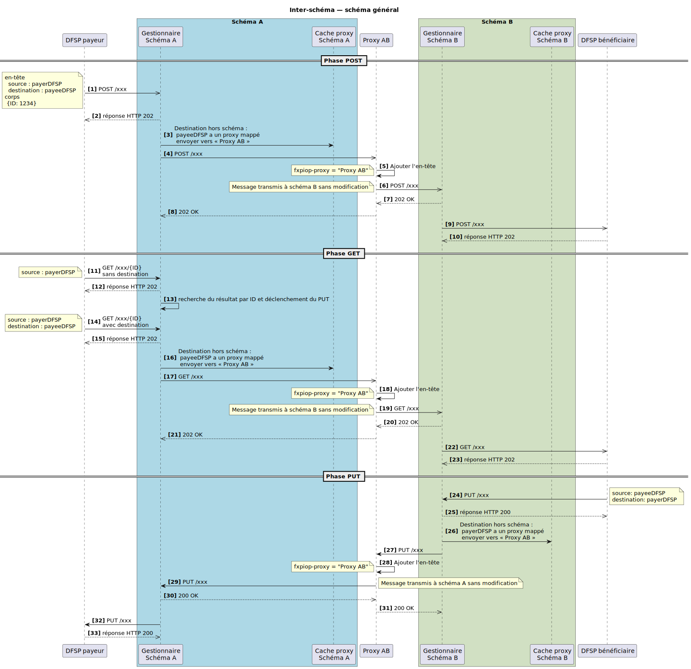
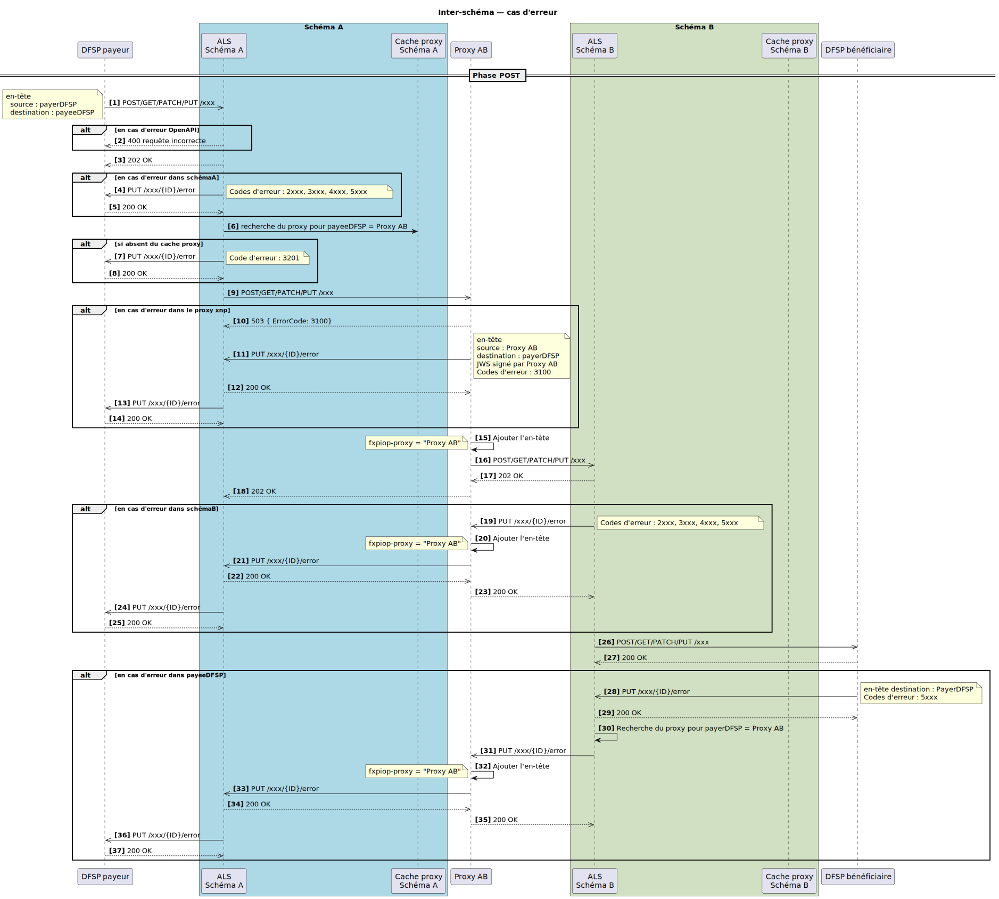
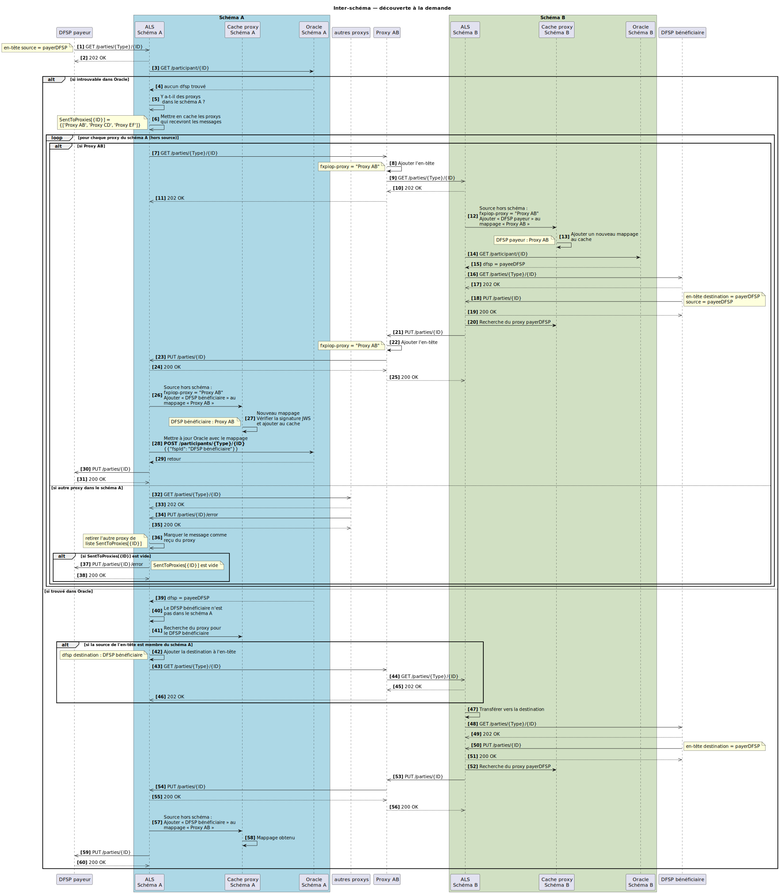
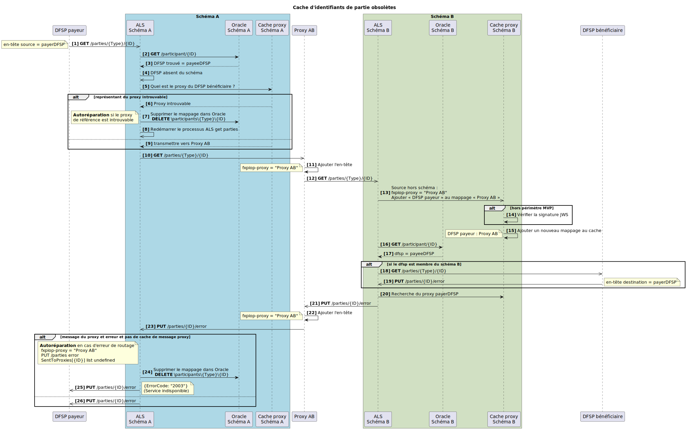
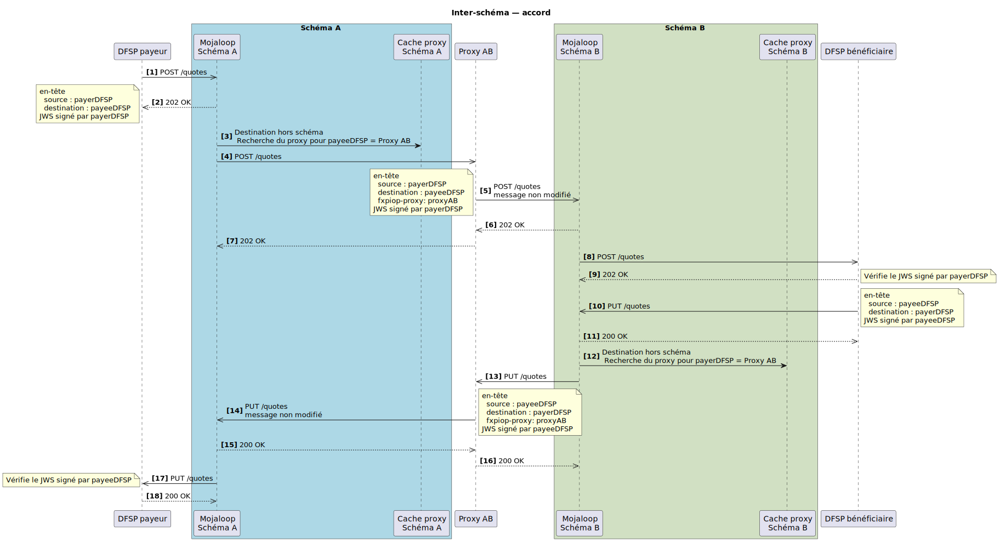
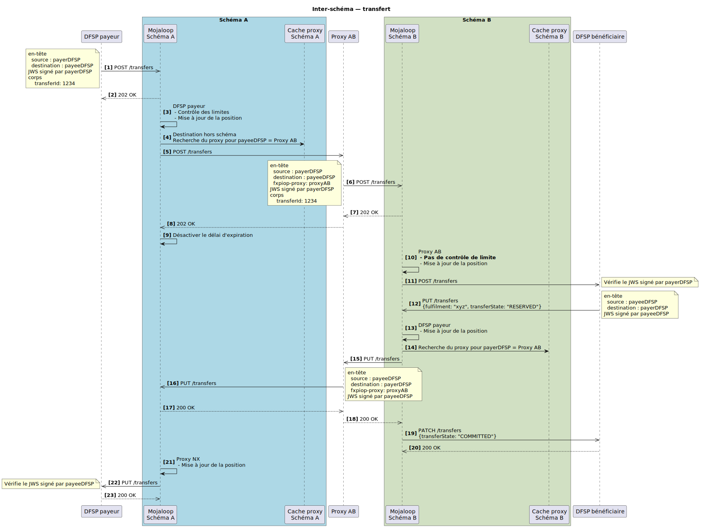
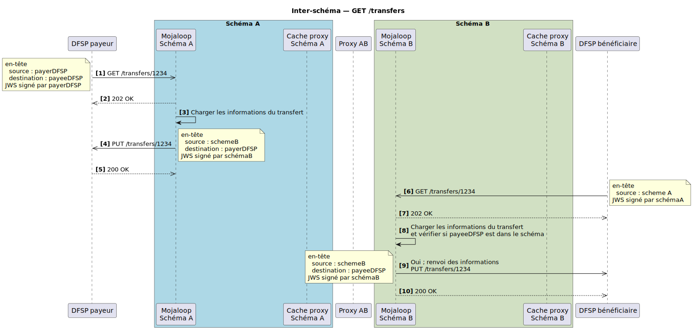
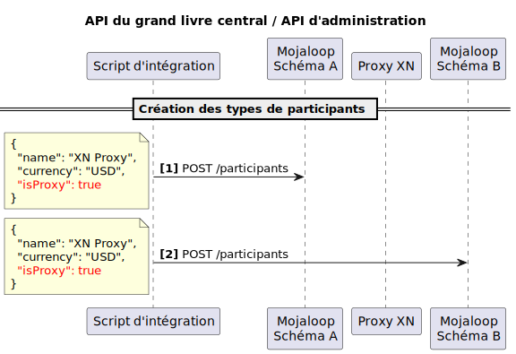
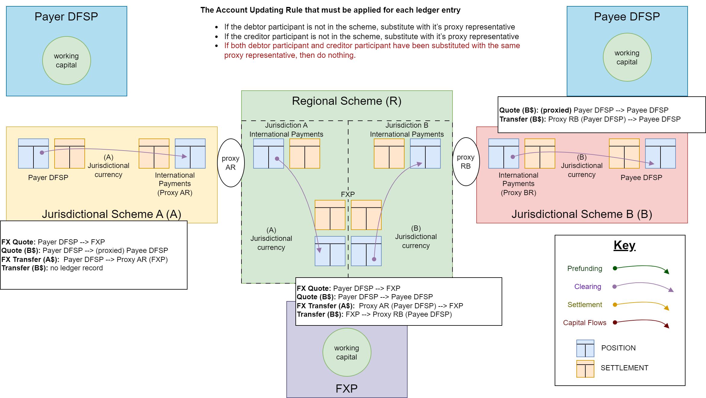

# Inter-schéma (*Interscheme*)

L’inter-schéma est l’approche de la communauté Mojaloop pour relier des schémas tout en préservant les trois phases d’un transfert Mojaloop et la non-répudiation de bout en bout. L’accord conclu lors d’un transfert reste ainsi entre les organisations DFSP/FXP d’origine et de réception, quel que soit le chemin de routage ou le nombre de schémas traversés.

:::tip Non-répudiation 
Garantir la non-répudiation entre schémas implique que le proxy ne participe pas à l’accord sur les conditions, ce qui contribue à réduire les coûts.
::: 

La première mise en œuvre de cette fonctionnalité permet de connecter plusieurs schémas Mojaloop. L’écosystème devrait s’élargir avec l’adoption du protocole par de nouveaux schémas nationaux et le développement de connecteurs pour renforcer l’interopérabilité.

À cette fin, Mojaloop a introduit une organisation participante de type proxy. L’adaptateur proxy matérialise la composante de connexion Mojaloop-à-Mojaloop.

## Rôle du proxy

Les schémas sont reliés par un participant proxy, enregistré comme intermédiaire dans le schéma pour les DFSP/FXP adjacents des autres schémas.

## Routage dynamique des parties

Cette implémentation utilise un routage dynamique : aucune maintenance initiale ni continue des identifiants de parties entre schémas n’est requise. Le système s’appuie sur une diffusion vers la découverte de schéma pour cet identifiant et met en cache l’organisation associée à un identifiant de partie.

## Hypothèses

L’approche repose sur les hypothèses suivantes :
1. Deux participants connectés ne partagent pas le même identifiant.
1. Chaque schéma connecté est responsable du routage des identifiants de parties dans son propre système. (Sous Mojaloop, chaque schéma maintient les oracles nécessaires pour router les paiements des parties participantes sur son réseau.)

## Schémas généraux
Certains schémas récurrents apparaissent.
### Cas nominaux

### Cas d’erreur

## Conception de la découverte inter-schéma à la demande
Les flux de découverte se résument ainsi :
1. Chargement à la demande des identifiants inter-réseaux — oracles pour les recherches d’identifiants dans le schéma local.
2. Chargement à la demande pour tous les identifiants.

### Utilisation des oracles pour mettre en cache les identifiants
- Le schéma utilise des oracles pour associer les identifiants locaux aux participants du schéma.
- Les identifiants d’autres schémas sont découverts par parcours en profondeur en interrogeant tous les participants. Le participant proxy transmet ensuite la requête au schéma connecté.
- Le schéma montre deux schémas connectés ; la conception s’étend à un nombre quelconque de schémas connectés.

### Découverte à la demande avec résultats incorrectement mis en cache
- Lorsqu’un identifiant est déplacé vers un autre fournisseur DFSP, le cache de ce participant peut router vers un appel GET /parties infructueux.
- Auto-guérison en cas d’erreur de routage du paiement ou de perte de référence du cache proxy.

Diagramme de séquence illustrant la mise à jour.
#### Diagramme de séquence

## Inter-schéma — phase d’accord
La phase d’accord utilise le cache du proxy pour router les messages.
Détails d’implémentation ci-dessous.

## Inter-schéma — phase de transfert
La phase de transfert utilise le cache du proxy pour router les messages.
Détails d’implémentation ci-dessous.

## Inter-schéma — GET Transfer 
Le GET Transfer est résolu localement pour renvoyer l’état du transfert dans le schéma local.
Détails d’implémentation ci-dessous.

## API d’administration — définition des participants proxy
Définition des proxys.

## Comptes de compensation pour les transferts FX inter-schémas
Ce schéma illustre la mise à jour des obligations pendant la compensation de la transaction.

