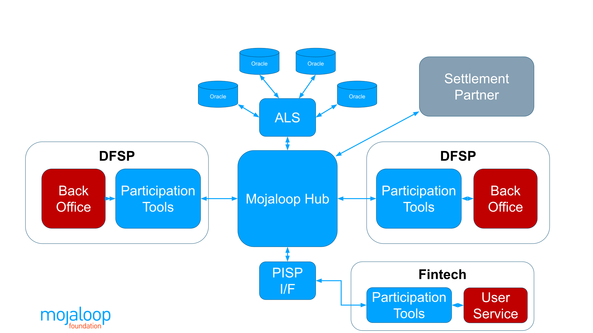

# Paiements commerçants

!!!! **TRAVAUX EN COURS — SERA COMPLÉTÉ SOUS PEU** !!!!

## Place des paiements commerçants

Dans l’univers Mojaloop, les paiements commerçants ne sont pas intégrés au Hub lui-même : il s’agit d’un **service superposé** qui s’appuie sur les services du Hub et fait partie du progiciel open source Mojaloop complet.

Côté exploitation de schéma, un schéma de paiements commerçants peut être proposé dans le cadre d’un service de paiements global par l’opérateur du Hub Mojaloop. Un schéma distinct peut aussi être opéré par un autre acteur, en collaboration avec l’opérateur du Hub.

## Concepts

Les commerçants doivent être enregistrés comme tels dans le modèle Mojaloop (ce qui diffère d’un simple enregistrement « entreprise » ; le modèle auto-entrepreneur est pris en charge). Les données KYB sont saisies dans le registre commerçant et un identifiant commerçant indépendant du DFSP est généré. Cet identifiant peut être affiché sur place pour des paiements USSD par des clients avec téléphones basiques ; il est aussi prévu pour être intégré dans des QR statiques, scannés par les clients dont l’application du DFSP le permet.

Le modèle repose sur un paiement poussé P2B. La résolution d’alias du Hub Mojaloop associe les identifiants commerçants (extraits d’un QR ou saisis en USSD) aux comptes commerçants chez les DFSP participants, sans exposer le DFSP ni le numéro de compte. Avec un QR, les bonnes pratiques recommandent d’afficher le nom commercial du commerçant pour vérification par le client, de lui demander de saisir le montant et de s’authentifier (ex. PIN) pour autoriser la transaction. Une fois le paiement effectué, le client et le commerçant reçoivent une notification ; le commerçant peut remettre le bien ou le service.

## Enregistrement

L’enregistrement commerçant est prévu pour être réalisé par les DFSP, dans le cadre de leur relation avec le commerçant en tant qu’« émetteur ». Les données sont conservées dans un registre commerçant partagé, tout en conservant la relation DFSP–commerçant.

Les données saisies lors de l’enregistrement

À l’enregistrement, une quantité substantielle d’informations est collectée dans le registre commerçant.

Adressage :
USSD vs QR  
Registre commerçant — lien avec les LEI  
Création d’un QR (référence EMVCo)  
Personnalisation du QR — conformité aux standards du schéma ou du pays.

À venir : lien vers GLEIF
