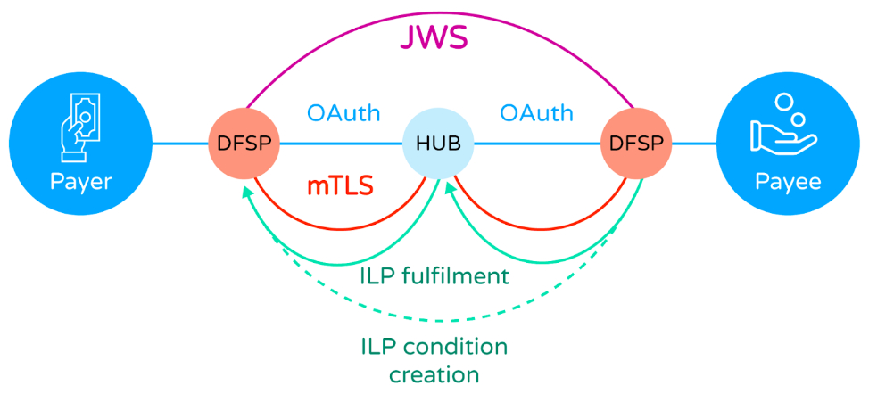

# Sécurité

## Open source et sécurité

Une idée reçue veut que le logiciel open source soit intrinsèquement moins sûr que le logiciel propriétaire parce que le code est visible. En réalité, cette vision méconnaît le fonctionnement de la cybersécurité moderne.

La sécurité de Mojaloop ne repose pas sur l’obscurité du code. Elle s’appuie sur des algorithmes cryptographiques open source éprouvés, élaborés par des experts et publiés pour relecture par les pairs. Ils sont testés en profondeur par la communauté cryptographique mondiale ; lorsqu’une faille est trouvée, les correctifs sont partagés ouvertement et rapidement, au bénéfice de tous les utilisateurs, Mojaloop y compris.

C’est comparable aux serrures physiques : le mécanisme d’une serrure Yale n’est pas secret ; la sécurité vient de la clé, pas du secret du mécanisme. La cryptographie fonctionne de la même manière : les algorithmes modernes reposent sur le secret des clés, pas sur la dissimulation de l’algorithme.

Il en va de même pour l’ensemble du code Mojaloop : en open source, chacun peut examiner le code et signaler des vulnérabilités. Des équipes de la communauté Mojaloop participent activement à ce processus et font remonter les problèmes identifiés dans le cadre qualité / sécurité pour examen et correction. Des vulnérabilités potentielles sont régulièrement signalées par des acteurs extérieurs au noyau de la communauté ; elles sont analysées et traitées par les équipes qualité et sécurité. Plus de détails figurent dans la section [Maintenir la sécurité](#maintenir-la-securite) ci-dessous.

## Sécurité Mojaloop

Mojaloop s’appuie sur ces pratiques et algorithmes pour un modèle de sécurité multicouche, complexe et soumis à une veille et des revues continues.

On peut le décomposer en trois domaines :

- la sécurité de la connexion entre le Hub Mojaloop et les DFSP participants (transactions et établissement / maintien de la connexion) ;
- la sécurité de l’exploitation du Hub, notamment des actions des opérationnels ;
- la qualité et la sécurité du déploiement du Hub Mojaloop.

Les sections suivantes détaillent chaque axe.

## Sécurité de la connexion DFSP

La connexion entre un DFSP participant et le Hub Mojaloop combine trois niveaux de sécurité pour l’intégrité, la confidentialité et la non-répudiation des messages entre un DFSP, le Hub et, le cas échéant, l’autre DFSP de la transaction.

Le schéma suivant illustre ces trois niveaux.

Au niveau le plus bas, la connexion point à point entre un DFSP (participant autorisé) et le Hub Mojaloop est sécurisée par **mTLS**, ce qui garantit la confidentialité, l’authenticité des correspondants et la protection contre l’altération des échanges.

Ensuite, le contenu des messages JSON est **signé cryptographiquement** selon **JWS** ([RFC 7515](https://www.rfc-editor.org/rfc/rfc7515.html)), ce qui assure aux destinataires l’origine des messages et empêche l’émetteur de nier cette provenance.

Enfin, les conditions du transfert sont sécurisées par le **protocole Interledger (ILP)** entre payeur et bénéficiaire. ILP utilise un [contrat à secret et délai (HTLC)](./htlc.md) pour protéger l’intégrité de la condition de paiement et de son accomplissement (*fulfilment*). Ainsi, Mojaloop garantit qu’un transfert se termine entièrement pour toutes les parties ou pas du tout, et limite la durée de validité de l’instruction de transfert.

Ces trois couches sont intégrées au Hub Mojaloop. Côté DFSP, elles peuvent être mises en œuvre directement par les équipes d’ingénierie. La communauté Mojaloop propose aussi [un ensemble d’outils](./connectivity.md) qui établissent et maintiennent ces couches et orchestrent les communications / API avec le Hub, tout en restant dans le périmètre du DFSP (et donc hors Hub Mojaloop).

## Sécurité opérationnelle du Hub

La sécurité du Hub Mojaloop dépasse les connexions aux DFSP et inclut la sécurité des actions des opérateurs via les différents [portails Hub](./product.md).

Les portails s’appuient sur le Business Operations Framework (BOF) de Mojaloop, qui fournit les portails cœur et des API permettant à l’opérateur du Hub d’étendre ces portails ou d’en créer de nouveaux selon ses besoins.

Pour gérer la sécurité de ces portails, le BOF canalise l’activité via un cadre unique d’**identité et d’accès (IAM)** intégrant le **contrôle d’accès basé sur les rôles (RBAC)** et, nativement, le principe **émetteur / contrôleur** (*Maker/Checker*, ou « quatre yeux »).

L’opérateur du Hub Mojaloop dispose ainsi d’un contrôle fin des accès aux fonctions de gestion et des contrôles sur chaque activité. Il reste toutefois responsable du filtrage du personnel, de l’inscription sur l’IAM, de l’attribution des rôles et de la bonne configuration du RBAC (y compris émetteur / contrôleur le cas échéant). Des politiques telles que expiration des mots de passe, longueur et complexité, réutilisation, etc. sont prises en charge par l’IAM, ainsi que l’**authentification multifacteur (MFA)** pour tous les opérateurs, selon les choix de l’opérateur (l’usage du SMS ou USSD comme canal MFA est fortement déconseillé).

Il incombe également à l’opérateur de mettre en place les points de contrôle adaptés à un service financier (accès physique aux serveurs, usage des téléphones portables par les opérateurs, vidéosurveillance, chaîne d’approvisionnement, gestion des visiteurs, etc.) et de définir les processus métier associés.

## Maintenir la sécurité {#maintenir-la-securite}

La communauté Mojaloop a défini procédures et moyens pour maintenir la sécurité des déploiements face à l’évolution des attaques et à l’identification de vulnérabilités dans Mojaloop ou dans les nombreux programmes open source dont il dépend. C’est le **processus de gestion des vulnérabilités**, qui comprend notamment :

- un **comité sécurité**, coordonnateur de la gestion des vulnérabilités ;
- des processus de traitement des vulnérabilités potentielles signalées au comité ;
- des activités proactives d’identification et de gestion, dont :
	- la surveillance continue des composants open source ;
	- le **SAST** avec plusieurs outils s’appuyant sur des bases publiques de vulnérabilités ;
	- la maintenance automatisée d’un **SBOM** pour l’inventaire et la gestion des dépendances ;
	- l’analyse des images conteneur avant publication ;
	- un scanner de licences pour n’utiliser que des composants aux licences compatibles ;
	- à partir de Mojaloop Release v17.1.0, signature des charts Helm à la publication et vérification à l’installation / déploiement pour la traçabilité des artefacts ;
	- une chaîne CI/CD intégrant des contrôles de sécurité ;
	- un processus de **divulgation coordonnée des vulnérabilités (CVD)** ;
	- des rapports détaillés après chaque analyse, avec actions correctives et efficacité, conservés pour audit et conformité.

Pour plus de détails techniques : [vue d’ensemble de la gestion des vulnérabilités Mojaloop](https://docs.mojaloop.io/technical/technical/security/security-overview.html).

## Qualité et sécurité du déploiement

Des membres de la communauté Mojaloop développent un **cadre d’évaluation de la qualité** visant une boîte à outils pour valider la configuration, les fonctionnalités, la sécurité, la préparation à l’interopérabilité et les performances d’un déploiement.

Il pourra servir à l’auto-évaluation des adoptants ou à un examen externe pour renforcer l’assurance auprès des autorités de tutelle et des participants.

## Applicabilité

Ce document concerne Mojaloop version 17.1.0.

## Historique du document
  |Version|Date|Auteur|Détail|
|:--------------:|:--------------:|:--------------:|:--------------:|
|1.2|13 octobre 2025| Paul Makin|Ajout de l’introduction « Open source et sécurité ».|
|1.1|15 juillet 2025| Paul Makin|Ajout de la section « Maintenir la sécurité ».|
|1.0|24 juin 2025| Paul Makin|Version initiale|
