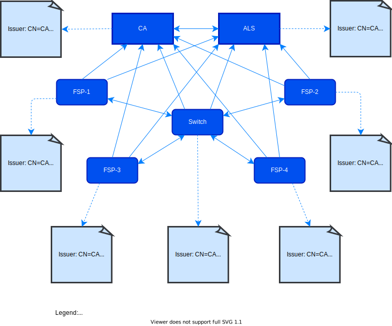

# Bonnes Pratiques de l’Infrastructure à Clé Publique (PKI)

## Préface

Cette section contient des informations sur la manière d’utiliser ce document.

### Conventions Utilisées dans Ce Document

Les conventions suivantes sont utilisées dans ce document pour identifier les types spécifiques d’informations.

| Type d’Information | Convention | Exemple |
|---|---|---|
| **Éléments de l’API, comme les ressources** | Gras | **/authorization** |
| **Variables** | Italique entre accolades | _{ID}_ |
| **Termes du glossaire** | Italique à la première occurrence ; défini dans le _Glossaire_ | Le but de l’API est de permettre des transactions financières interopérables entre un _Payeur_ (un payeur de fonds électroniques dans une transaction de paiement) situé dans un _FSP_ (une entité qui fournit un service financier numérique à un utilisateur final) et un _Bénéficiaire_ (un destinataire de fonds électroniques dans une transaction de paiement) situé dans un autre FSP. |
| **Documents de la bibliothèque** | Italique | Les informations utilisateur ne devraient, en général, pas être utilisées par les déploiements d’API ; les mesures de sécurité détaillées dans _Signature API_ et _Chiffrement API_ doivent être utilisées à la place. |

### Informations sur la Version du Document

| Version | Date | Description du Changement |
|---|---|---|
| **1.0** | 2018-03-13 | Version initiale |

## Introduction

Ce document explique les _bonnes pratiques de l’Infrastructure à Clé Publique_ (PKI)<sup>1</sup> à appliquer dans un déploiement de l’_Open API pour l’Interopérabilité des FSP_ (ci-après cité comme « l’API »). Voir la section [Contexte PKI](#pki-background) pour plus d’informations à propos de la PKI.

L’API doit être mise en œuvre dans un environnement composé soit :

- de _Fournisseurs de Services Financiers_ (FSP) qui communiquent avec d’autres FSP (en configuration bilatérale), ou

- d’un _Switch_ qui agit comme une plateforme intermédiaire entre les plateformes des FSP. Un _Système de Recherche de Comptes_ (ALS) est également disponible pour identifier dans quel FSP se trouve un titulaire de compte.

Pour plus d’informations sur l’environnement, voir la section [Topologie du Réseau](#network-topology). [Stratégie de gestion PKI de l’Autorité de Certification](#certificate-authority-pki-management-strategy) et [Stratégie de gestion PKI de la Plateforme](#platform-pki-management-strategy) identifient les stratégies de gestion pour la CA et la plateforme.

La communication entre plateformes s’effectue en utilisant un protocole HTTP basé sur REST (REpresentational State Transfer) (pour plus d’informations, voir _Définition de l’API_). Ce protocole ne fournit pas de moyen d’assurer l’intégrité ou la confidentialité entre plateformes, il est donc nécessaire d’ajouter des couches de sécurité supplémentaires pour protéger les informations sensibles contre la modification ou l’exposition à des parties non autorisées.

<br />

### Spécification Open API pour l’Interopérabilité des FSP

La spécification Open API pour l’Interopérabilité des FSP inclut les documents suivants.

#### Documents Logiques

- [Modèle de Données Logique](./logical-data-model)

- [Modèles de Transactions Génériques](./generic-transaction-patterns)

- [Cas d’Utilisation](./use-cases)

#### Documents de Liaison REST Asynchrone

- [Définition de l’API](./api-definition)

- [Règles de Liaison JSON](./json-binding-rules)

- [Règles des Schémas](./scheme-rules)

#### Intégrité des Données, Confidentialité et Non-Répudiation

- [Bonnes Pratiques PKI](#)

- [Signature](./v1.1/signature)

- [Chiffrement](./v1.1/encryption)

#### Documents Généraux

- [Glossaire](./glossary)

<br />


## Contexte PKI

L’Infrastructure à Clé Publique (PKI) est un ensemble de standards, procédures et logiciels permettant la mise en œuvre de l’authentification utilisant la cryptographie à clé publique. La PKI est utilisée pour demander, installer, configurer, gérer et révoquer des certificats numériques. La PKI fournit l’authentification via des certificats numériques ; ces certificats sont signés et fournis par des _Autorités de Certification_ (CA).

La PKI utilise la cryptographie à clé publique et fonctionne avec des certificats conformes à la norme X.509. Elle offre également des fonctionnalités telles que :

- Authentification de l’utilisateur

- Production et distribution de certificats

- Maintien, gestion et révocation des certificats

La PKI est constituée de plusieurs composants qui permettent à l’infrastructure de fonctionner ; ce n’est pas un processus ou algorithme unique. Outre l’authentification, la PKI permet également de garantir l’intégrité, la non-répudiation et le chiffrement.

Pour obtenir une clé publique, une entité doit obtenir un certificat numérique. Cette dernière doit demander ce certificat à une CA ou à une _Autorité d’Enregistrement_ (RA) - une organisation qui traite des demandes au nom d’une CA. Tous les participants doivent faire confiance à la CA pour gérer et maintenir les certificats. La CA exige que l’entité fournisse plusieurs informations (_Common Name_ (CN), _Organization_ (O), _Country_ (C), etc.) et valide leur demande avant de fournir le certificat. Ce certificat est la preuve que l’entité est bien celle qu’elle prétend être dans le monde numérique (comme un passeport dans le monde réel).

La PKI se combine bien avec une _solution Diffie-Hellman_ (un mécanisme sécurisé pour l’échange d’une clé symétrique partagée entre deux pairs anonymes) pour fournir des échanges de clés sécurisés. Parce que Diffie-Hellman n’offre pas d’authentification, la PKI est utilisée avec des protocoles supplémentaires, tels que _Pretty Good Privacy_ (PGP) et _Transport Layer Security_ (TLS).

### Protection en Couches

L’API doit être utilisée avec une protection au niveau du transport et au niveau applicatif.

#### Protection au Niveau du Transport

Pour protéger le niveau de transport, _Transport Layer Security_<sup>2</sup> (TLS) doit être utilisé. TLS est une technique fondamentale pour sécuriser la communication point à point. Elle s’est avérée stable et sûre lors de l’utilisation d’algorithmes robustes avec les versions les plus récentes, et son usage est largement répandu. TLS est un mécanisme sécurisé pour échanger une clé symétrique partagée entre deux pairs anonymes, avec vérification d’identité (c’est-à-dire via des certificats de confiance). Cela garantit la _confidentialité_ (personne n’a lu le contenu) et l’_intégrité_ (personne n’a modifié le contenu). Une bonne utilisation de TLS nécessite une gestion des certificats.

#### Protection au Niveau Applicatif

Cette couche assure l’intégrité et la confidentialité de bout en bout. L’API utilise le standard _JSON Web Signature_<sup>3</sup> (JWS) pour l’intégrité et la _non-répudiation_ (preuve de l’intégrité et de l’origine des données), et le standard JSON Web Encryption (JWE)<sup>4</sup> pour la confidentialité. Une version étendue de JWE est utilisée pour supporter le chiffrement au niveau des champs.

L’utilisation de ces standards nécessite la gestion de certificats ; par conséquent, les _Autorités de Certification_ (CA) et les techniques PKI associées sont nécessaires. Pour plus d’informations, voir le Contexte PKI.

## Topologie du Réseau

Cette section identifie les plateformes constituant l’API.

### Disposition Point-à-Point des Plateformes

La Figure 1 montre un exemple de disposition point-à-point des plateformes.



**Figure 1 - Disposition des plateformes**

Toute la communication entre plateformes doit être sécurisée par TLS utilisant l’_authentification client_, aussi connue sous le nom d’_authentification mutuelle_.

### Rôles des Plateformes

#### Autorité de Certification (CA)

La CA réalise les fonctions suivantes :

- Signature des _demandes de signature de certificat_ (CSR) – Les CSR sont un mécanisme sécurisé pour l’échange d’une clé symétrique partagée entre deux pairs anonymes. La CA signe différents types de certificats (par exemple, TLS, signature de contenu, chiffrement de contenu).

- Révocation des certificats – Marquer un ou plusieurs certificats comme non valides.

- Support des CRL – Maintenir et fournir des listes de révocation de certificats (CRL) à télécharger afin que les clients puissent voir les certificats révoqués.

- Support du protocole OCSP – Fournir des vérifications de révocation en temps réel. 

#### Système de Recherche de Comptes (ALS)

- Stocke les informations de base sur les titulaires de compte.

- Répond à des questions comme : « Où dois-je envoyer ma demande de transaction financière pour le titulaire du compte **MSISDN 0123456** ? »

#### Fournisseur de Services Financiers (FSP)

Possède les titulaires de compte vers qui ou depuis qui l’argent est transféré.

#### Switch

- Relaye les informations de transaction vers d’autres plateformes.

- Peut exécuter des services financiers, comme spécifié dans la _Définition de l’API_.

## Stratégie de Gestion de la PKI de la CA

Cette section décrit la stratégie de gestion PKI pour les Autorités de Certification.

### Importance de la CA et Critères de Sélection

Le rôle de la CA est important car :

- La CA fournit une seule entité légale de confiance pour toutes les plateformes.

- Le protocole TLS point à point dépend des certificats.

- Les protocoles de bout en bout JWS et JWE dépendent des certificats pour la preuve de non-répudiation et de confidentialité.

#### Raisons de Ne Pas Utiliser une CA Publique

- Une CA publique peut révoquer le certificat intermédiaire utilisé pour signer vos certificats, interrompant ainsi toute communication entre les plateformes.

- Une CA publique signe également des certificats qui ne font pas partie du dispositif _Open API pour l’Interopérabilité des FSP_. Parce que vous faites confiance au certificat signé, vous faites confiance à tous les certificats signés par cette CA.

- Aucun service de l’API n’est ouvert au public ; il n’y a donc aucune raison d’utiliser une CA publique déjà approuvée par les clients publics (tels que les navigateurs web).

#### Options pour une CA Privée

- Construire sa propre CA depuis zéro

- Construire une CA à l’aide d’outils existants (par exemple, _openssl_)

- Utiliser une CA complète (par exemple, le produit open source _EJBCA_)

### Chaîne de Certificats de Confiance

Une CA centralisée facilite la gestion des certificats pour les plateformes impliquées. En approuvant le certificat de la même CA, chaque plateforme n’a qu’un seul certificat à approuver : le certificat racine auto-signé de la CA.

La CA doit signer tous les types de certificats (TLS, signature et chiffrement), mais uniquement pour les participants du dispositif _Open API pour l’Interopérabilité des FSP_.

Aucun certificat CA intermédiaire n’est nécessaire car une disposition segmentée n’est pas utilisée dans ce cadre.

### Certificat Racine de la CA

- La CA doit créer un certificat racine auto-signé pour signer tous les types de certificats pris en charge (TLS, signature et chiffrement).

- La longueur minimale de la clé RSA asymétrique est de 4096 bits, et l’algorithme de signature doit être sha512WithRSAEncryption.

- Les _contraintes de base X.509_ doivent avoir l’attribut **CA** positionné à **TRUE**.

- La durée de validité du certificat racine doit être de dix ans. Après huit ans, un nouveau certificat racine auto-signé doit être créé par la CA ; la paire de clés RSA asymétriques doit être recréée, et non réutilisée. Ce certificat sert alors à signer les CSR des plateformes. Cependant, l’ancien certificat racine reste actif jusqu’à expiration, ce qui laisse deux ans aux plateformes pour changer de certificat racine sans perturber les communications sécurisées en cours.

### Signature des CSR des Plateformes

La CA doit fournir un mécanisme permettant aux plateformes de faire signer leurs CSR. Les méthodes de signature courantes sont l’e-mail et une page web. La solution et la politique choisies doivent être connues des plateformes.

La CA signe trois types de certificats : TLS (pour la communication), JWS (pour la signature) et JWE (pour le chiffrement). Exigences communes :

- Longueur minimale de la clé RSA asymétrique : 2048 bits, algorithme de signature : sha256WithRSAEncryption.

- Les contraintes de base X.509 doivent avoir **CA** à **FALSE**.

- Les DN du sujet doivent inclure au moins les attributs suivants :

   - _Nom Commun_ (CN) : doit être le nom d’hôte de la plateforme qui a créé le certificat. Un CN ne peut jamais être identique pour deux plateformes ou organisations différentes.

   - _Organisation_ (O) : le nom de l’organisation.

   - _Pays_ (C) : le pays de l’organisation.

- L’URL permettant de télécharger les CRL doit être présente.

- L’URL d’envoi des requêtes OCSP doit être présente.

- La durée de validité doit être de deux ans.

En fonction du type de certificat à signer, les usages de la clé X.509 et les usages étendus X.509 diffèrent ; voir Tableau 1.

| Type de Certificat | Usage de Clé X.509 | Usage Étendu de Clé X.509 |
| --- | --- | --- |
| **Certificats TLS** | Signature numérique, chiffrement de clé | Authentification TLS serveur web, authentification TLS client web |
| **Certificats de Signature** | Signature numérique | |
| **Certificats de Chiffrement** | Chiffrement de clé | |

**Tableau 1 – Types de certificats et usages de clé**

### Révocation des Certificats

- La CA doit être capable de révoquer les certificats d’une plateforme. Révoquer un certificat signifie qu’il n’est plus approuvé par aucune partie. Il sera marqué comme invalide par la CA et son état de révocation publié aux plateformes, soit par une liste de révocation (CRL) téléchargeable, soit via une requête HTTP en temps réel utilisant le _protocole OCSP_.

- La CA doit permettre à la fois le téléchargement de CRL et les requêtes OCSP.

- La CA doit mettre à jour et signer la CRL quotidiennement et fournir (chaque jour) une URL HTTP permettant aux plateformes de télécharger la CRL. Cette URL doit être stockée dans les _points de distribution CRL_ de chaque certificat signé.

- L’URL OCSP doit être présente dans l’_Authority Information Access_ de chaque certificat signé. Une réponse OCSP doit être signée. Les valeurs de nonce dans une requête OCSP doivent être prises en charge pour éviter les attaques par relecture.

- La CA a le droit de révoquer les certificats, mais n’a pas l’obligation d’informer les plateformes. Les plateformes n’ont pas le droit de révoquer des certificats, mais elles ont l’obligation de vérifier régulièrement leur état de révocation.

### Enrôlement et Renouvellement de Certificats

La CA n’accepte pas l’enrôlement ou le renouvellement de certificats pour lesquels une paire de clés asymétriques est réutilisée. Pour plus de sécurité, la paire de clés doit être recréée à chaque enrôlement ou renouvellement via un nouveau CSR.

## Stratégie de Gestion PKI de la Plateforme

Cette section décrit la stratégie de gestion PKI pour les plateformes.

### Clés, Certificats et Magasins

Un certificat fournit l’identité de son propriétaire via une CA de confiance qui l’a signé. Cela peut être validé via la chaîne de certificats. Il permet également d’assurer l’intégrité (signature) et la confidentialité (chiffrement) des données en utilisant sa paire de clés asymétriques (_clé publique et clé privée_). La clé publique est dans le certificat signé ; la clé privée doit être protégée et maintenue confidentielle. Une solution courante consiste à stocker certificats et clés privées dans un magasin protégé. Ce magasin peut être un fichier, un répertoire ou tout autre espace offrant accès et confidentialité.

Une seule clé privée et son certificat associé peuvent servir à toutes les tâches cryptographiques, mais pour renforcer la sécurité, chaque plateforme doit disposer des éléments suivants :

- Une clé privée et un certificat pour la communication TLS

- Une clé privée et un certificat pour l’intégrité de bout-en-bout avec JWS

- Une clé privée et un certificat pour la confidentialité de bout-en-bout avec JWE

Différentes clés et types de certificats peuvent être dans le même magasin, mais une configuration courante est la suivante :

- Pour la communication TLS :

   - Un magasin de clés protégé (key store) pour stocker la clé privée, son certificat associé et la chaîne de certificats, utilisés lors de l’authentification serveur et client en TLS.

   - Un magasin de certificats protégé pour stocker les certificats TLS de confiance. Ces certificats seront approuvés lors de la poignée de main TLS, permettant de communiquer avec leurs détenteurs. Comme tous les participants font confiance à la même CA, il suffit d’y placer le certificat racine de la CA.

- Pour la signature et le chiffrement :

   - Un magasin de clés protégé pour stocker les clés privées, leurs certificats associés et les chaînes de certificats utilisés pour signer et chiffrer.

   - Une clé privée et chaîne de certificats pour la signature JWS, et une autre pour le chiffrement JWE.

   - Un magasin de certificats protégé pour les certificats de signature et chiffrement de confiance d’autres plateformes. On y stocke les certificats de chaque plateforme à laquelle vous souhaitez faire confiance pour l’intégrité/confidentialité de bout à bout.

### Création d’un CSR et Obtention de la Signature de la CA

Pour communiquer avec les autres plateformes, vous devez créer un magasin de clés (s’il n’existe pas déjà), une paire de clés asymétriques et un certificat associé identifiant votre plateforme. Ce certificat non signé doit être signé par la CA pour être approuvé. La procédure commence par une demande de signature de certificat (CSR).

Lors de la création de vos clés, certificats et CSR, les exigences suivantes s’appliquent :

- Longueur minimale de la clé RSA asymétrique : 2048 bits, algorithme de signature : sha256WithRSAEncryption.

- Les champs suivants dans le nom distingué du sujet sont obligatoires :

   - Common Name (CN) : doit être le nom d’hôte de la plateforme. Un CN ne doit pas être utilisé pour deux plateformes ou organisations différentes.

   - Organization (O) : nom de l’organisation.

   - Country (C) : pays de l’organisation.

**Pour des exemples de création de magasin, de certificat et de CSR, voir Annexe C – Tâches PKI courantes**

Créer votre CSR et l’envoyer à votre CA conformément à leurs instructions.

**Remarque :** La même procédure doit être réalisée pour toutes vos clés et certificats (TLS, signature et chiffrement).

### Importation d’un CSR Signé

Après la signature de votre CSR, vous recevrez deux certificats dans la réponse de la CA. Le premier est votre certificat signé. Le second est le certificat racine de la CA qui a servi à la signature. Vous devez approuver ce certificat.

D’abord, importez votre certificat signé dans votre magasin de clés (il doit remplacer l’ancien non signé ; voir les exemples pour importer un certificat signé).

Ensuite, importez le certificat racine de la CA dans le même magasin pour compléter la chaîne entre votre certificat et la CA (voir les exemples pour importer le certificat de la CA).

#### Certificats TLS

Pour les certificats TLS, vous devez également importer le certificat racine de la CA dans le magasin de confiance TLS pour approuver automatiquement les autres plateformes lors de l’établissement de nouveaux canaux. Voir exemples pour l’import dans le trust store.

La procédure ci-dessus doit être répétée pour chaque CSR signé. Rappelez-vous d’envoyer votre certificat et le certificat racine de la CA à toutes les autres plateformes avec lesquelles vous devez communiquer.

La CA créera une période de validité de deux ans pour chaque certificat signé. Après 18 mois, générez un nouveau CSR à faire signer par la même CA. Le certificat et le certificat racine de la CA doivent de nouveau être importés dans vos magasins et envoyés aux autres plateformes. Cela accorde à chacun une fenêtre de six mois pour s’assurer que le nouveau certificat fonctionne. Après deux ans, l’ancien certificat expiré peut être supprimé.

### Approuver les Certificats des Autres Plateformes

De même que vos pairs doivent avoir vos certificats pour vous faire confiance, ils doivent vous envoyer les leurs pour que vous les approuviez.

Assurez-vous de toujours recevoir au moins deux certificats de tout pair :

- Le certificat signé du pair à approuver

- Le certificat racine de la CA qui l’a signé

**Remarque :** Le certificat CA d’un pair peut être différent du vôtre si la CA a créé un nouveau certificat racine avant expiration de l’ancien.

Examinez toujours les certificats reçus (vérifiez le CN, la période de validité, etc.) et validez la chaîne (chaque certificat est bien signé par la bonne CA) avant de les importer dans votre magasin.

Pour des exemples, voir comment visualiser un certificat.

Importez ensuite le certificat et le certificat racine de la CA du pair dans votre magasin de confiance (voir les exemples pour importer un certificat approuvé).

### Vérification de l’État de Révocation des Certificats

Les certificats peuvent être révoqués par la CA. Un certificat révoqué n’est plus approuvé et doit être supprimé du magasin de confiance. Un certificat peut aussi être _en attente_ (« on hold »), c’est-à-dire en cours d’investigation, et ne doit pas être supprimé.

Toutes les plateformes doivent effectuer régulièrement des vérifications de révocation. Deux méthodes courantes existent : utiliser une liste CRL téléchargée ou une requête HTTP en temps réel (OCSP).

#### Liste de Révocation (CRL)

Il s’agit d’un fichier maintenu par la CA, contenant la liste des numéros de série des certificats révoqués. Le fichier peut être téléchargé par toute plateforme à tout moment. L’URL de la CRL est incluse dans le certificat lui-même (_CRL Distribution Points_). Une CRL est signée et doit être validée.

Une CRL doit être téléchargée chaque jour et mise en cache par la plateforme.

Voir exemples pour la vérification via CRL.

#### Protocole OCSP

L’état d’un certificat peut être obtenu via une requête OCSP à un _OCSP Responder_ (souvent la CA). La requête contient le numéro de série du certificat ; la réponse renvoie l’état, signée.

La requête doit contenir une valeur de nonce que le répondeur retournera afin que la plateforme la valide à la réception. Ceci empêche les attaques par relecture.

Une requête/réponse OCSP est très rapide et peut être réalisée pour chaque opération de certificat client, mais selon la charge, elle peut être mise en cache.

L’URL OCSP est présente dans _Authority Information Access_.

Voir exemples de vérification via une requête OCSP.

### Renouvellement des Certificats

Ne renouvelez pas les certificats réutilisant la même paire de clés. Pour la sécurité, la paire de clés doit être recréée à chaque fois via une nouvelle CSR.

## Protection de la Couche de Transport

Cette section décrit la protection de la couche de transport.

### TLS

TLS assure l’intégrité et la confidentialité point à point et doit être utilisé pour toute communication entre pairs.

La configuration requiert _l’authentification serveur_ (le serveur se présente avec son certificat TLS) et _l’authentification client_ (ou mutuelle), le client présentant aussi son certificat TLS.

#### Versions de TLS

La version minimale requise de TLS est 1.2 ou supérieure.

#### Suites de Chiffrement TLS

Les suites de chiffrement suivantes doivent être utilisées :

- TLS_ECDHE_RSA_WITH_AES_256_GCM_SHA384

- TLS_ECDHE_RSA_WITH_AES_128_GCM_SHA256

- TLS_ECDH_RSA_WITH_AES_256_GCM_SHA384

- TLS_ECDH_RSA_WITH_AES_128_GCM_SHA256

- TLS_RSA_WITH_AES_256_GCM_SHA384

- TLS_RSA_WITH_AES_128_GCM_SHA256

## Protection de la Couche Applicative

Cette section décrit la protection de la couche applicative.

### JSON Web Signature

Le standard _JSON Web Signature_ (JWS) est utilisé pour garantir l’intégrité et la non-répudiation de bout en bout : il assure que l’expéditeur est bien celui indiqué et que le message n’a pas été altéré.

L’utilisation de JWS est obligatoire et les certificats doivent être utilisés. Voir _Signature API_ pour plus d’informations.

### JSON Web Encryption

Le standard _JSON Web Encryption_ (JWE) est utilisé pour assurer la confidentialité de bout en bout, c’est-à-dire protéger les données contre toute lecture non autorisée.

L’utilisation de JWE est optionnelle et appliquée sur des champs spécifiques, pour répondre à des exigences réglementaires pouvant exister selon le type de données ou le pays.

Pour plus d’informations sur l’application de JWE aux champs, voir la spécification avancée _API Encryption_.


## Liste des Annexes

### Annexe A – Tailles de Clé et Algorithmes

Le tableau 2 présente la longueur des clés et l’algorithme requis pour chaque entité.

| Entité | Algorithme | Taille de clé/hash |
| --- | --- | --- |
| Clés asymétriques CA | RSA | 4096 bits |
| Algorithme de signature CA | RSA avec SHA2 | >= 256 bits |
| Clés asymétriques TLS | RSA | 2048 bits |
| Algorithme de signature TLS | RSA avec SHA2 | >= 256 bits |
| Clés asymétriques de signature | RSA | 2048 bits |
| Algorithme de signature | RSA avec SHA2 | >= 256 bits |
| Clés asymétriques de chiffrement | RSA | 2048 bits |
| HMAC | SHA2 - AES | >= 256 bits|
| Clés symétriques | AES | 256 bits |
| Hachage | SHA2 | >= 256 bits |

**Tableau 2 – Tailles de clé et algorithmes**

### Annexe B – Terminologie

| | | 
| --- | --- | 
| PKI | Infrastructure à Clé Publique
| API | Interface de Programmation Applicative
| TLS | Transport Layer Security (Sécurité de la couche de transport)
| JWS | JSON Web Signature
| JWE | JSON Web Encryption
| FSP | Fournisseur de Services Financiers
| AL | Account Lookup (Recherche de comptes)
| CA | Autorité de Certification
| CSR | Certificate Signing Request (Demande de Signature de Certificat)
| CRL | Certificate Revocation List (Liste de révocation de certificats)
| OCSP | Online Certificate Status Protocol
| PEM | Privacy Enhanced Mail
| RSA | Rivest, Shamir, & Adleman
| HMA | Hashed Message Authentication Code
| AES | Advanced Encryption Standard
| SHA | Secure Hash Algorithm

### Annexe C – Tâches PKI Courantes

#### Annexe C.1 – Création d’un magasin, d’un certificat, et d’une CSR

**Avec Java keytool**

Utilisez la commande suivante pour créer une paire de clés asymétriques RSA et les informations de certificat associées à faire signer par la CA. Elle crée automatiquement un keystore JKS si le fichier indiqué n’existe pas :

```
keytool -genkey -dname "CN=<common-name>" -alias <key-alias> -keyalg RSA -
keystore <ks-path> -keysize 2048
```

**Exemple :**

```
keytool -genkey -dname "CN=bank-fsp" -alias tlscert -keyalg RSA -keystore
tlskeystore.jks -keysize 2048
```

**Notes :**

1. L’attribut CN indique le nom d’hôte qui s’authentifie avec ce certificat lors d’une session TLS.
2. Lorsque vous êtes invité à saisir un mot de passe, utilisez le même pour la clé et le keystore.

Utilisez la commande suivante pour créer la CSR à signer par la CA :

```
keytool -certreq -alias <key-alias> -keystore <ks-path> –file <certificationrequest>.csr
```

**Exemple :** 

```
keytool -certreq -alias tlscert -keystore tlskeystore.jks -file tlscert.csr
```

**Avec openssl**

Pour créer une paire de clés RSA et une CSR :

```
openssl req -new -newkey rsa:2048 -nodes -subj "/CN=<common-name>" -out
<certificate>.csr -keyout <private-key>.key
```

**Exemple :**

```
openssl req -new -newkey rsa:2048 -nodes -subj "/CN=bank-fsp" -out tlscert.csr -
keyout tlscert.key
```

**Note :** L’attribut CN indique le nom d’hôte utilisé pour s’identifier lors d’une session TLS.

Remarque : la clé privée créée est non chiffrée. Utilisez la commande suivante pour l’encrypter :

```
openssl rsa -aes256 -in <unenrypted key file> -out <encrypted key file>
```

**Exemple :**

```
openssl rsa -aes256 -in tlscert.key -out tlscert_encrypted.key
```

#### Annexe C.2 – Importer un certificat signé dans votre keystore

**Avec Java keytool**

Importez le certificat signé dans votre keystore. Il doit remplacer l’ancien certificat non signé, donc veillez à utiliser le bon alias.

```
keytool -importcert -alias <key-alias> -file <signed-certificate> -keystore <kspath>
```

**Exemple :**

```
keytool -importcert -alias tlscert -file bank-fsp.pem -keystore tlskeystore.jks
```

**Avec openssl**

Supprimez votre ancien CSR et remplacez-le par le nouveau certificat signé.

#### Annexe C.3 – Importer le certificat CA dans votre keystore

**Avec Java keytool**

Importez le certificat CA dans votre keystore :

```
keytool -importcert -alias <CA-alias> -file <CA-file> -keystore <ks-path>
```

**Exemple :**

```
keytool -importcert -alias rootca -file rootca.pem -keystore tlskeystore.jks
```

Lorsque vous êtes invité à confirmer la confiance :

```
Trust this certificate? [no]: yes
Certificate was added to keystore
```

**Avec openssl**

Placez le certificat CA avec les autres fichiers de certificats.

#### Annexe C.4 – Importer le certificat CA dans le trust store TLS

**Avec Java keytool**

Importez le certificat CA dans votre trust store :

```
keytool -importcert -alias <CA-alias> -file <CA-file> -keystore <ks-path>
```

**Exemple :**

```
keytool -importcert -alias rootca -file rootca.pem -keystore tlstruststore.jks
```

Puis :

```
Trust this certificate? [no]: yes
Certificate was added to keystore
```
**Avec openssl**

Placez le certificat CA avec vos autres certificats.

#### Annexe C.5 – Visualiser un certificat

**Avec Java keytool**

Listez tous les certificats du keystore dans un format lisible :

```
keytool -list -keystore <ks-path> -v
```

**Exemple :**

```
keytool -list -keystore tlskeystore.jks -v
```

**Avec openssl**

Affichez le contenu lisible d’un certificat PEM :

```
openssl x509 -in <certificate file> -text -nout
```

**Exemple :**

```
openssl x509 -in rootca.pem -text -nout
```

#### Annexe C.6 – Importer un certificat approuvé

**Avec Java keytool**

Importez le certificat dans le trust store :

```
keytool -importcert -alias <cert-alias> -file <cert-file> -keystore <ks-path>
```

**Exemple :**

```
keytool -importcert -alias trustedcert -file cert.pem -keystore truststore.jks
```

Puis :

```
Trust this certificate? [no]: yes
Certificate was added to keystore
```

**Avec openssl**

Placez le certificat approuvé avec vos autres certificats.

#### Annexe C.7 – Vérifier un certificat via une CRL

**Avec Java**

Vous pouvez utiliser une bibliothèque comme Bouncy Castle ou le support natif, voir : [https://stackoverflow.com/questions/10043376/java-x509-certificate-parsing-and-validating/10068006#10068006](#https://stackoverflow.com/questions/10043376/java-x509-certificate-parsing-and-validating/10068006#10068006)

**Avec openssl**

Exemple : [https://raymii.org/s/articles/OpenSSL_manually_verify_a_certificate_against_a_CRL.html](#https://raymii.org/s/articles/OpenSSL_manually_verify_a_certificate_against_a_CRL.html)

#### Annexe C.8 – Vérifier un certificat via une requête OCSP

**Avec Java**

Exemples : [https://stackoverflow.com/questions/5161504/ocsp-revocation-on-client-certificate](#https://stackoverflow.com/questions/5161504/ocsp-revocation-on-client-certificate)

**Avec openssl**

Exemple : [https://raymii.org/s/articles/OpenSSL_Manually_Verify_a_certificate_against_an_OCSP.html](#https://raymii.org/s/articles/OpenSSL_Manually_Verify_a_certificate_against_an_OCSP.html)


<sup>1</sup> Ce terme, ainsi que d’autres termes en italique, sont définis dans le Glossaire de la spécification Open API pour l’Interopérabilité des FSP.

<sup>2</sup> [https://tools.ietf.org/html/rfc5246](#https://tools.ietf.org/html/rfc5246) - The Transport Layer Security (TLS) Protocol - Version 1.2

<sup>3</sup> [https://tools.ietf.org/html/rfc7515](#https://tools.ietf.org/html/rfc7515) - JSON Web Signature (JWS)

<sup>4</sup> [https://tools.ietf.org/html/rfc7516](#https://tools.ietf.org/html/rfc7516) - JSON Web Encryption (JWE)

<br />

## Table des Figures

- [Figure 1 - Disposition des plateformes](#platforms-point-to-point-layout)

<br />

## Tableaux

- [Tableau 1 – Types de certificats et usages de clé](#Table-1–Certificate-type-and-key-usage)

- [Tableau 2 – Tailles de clé et algorithmes](#Table-2-Key-lengths-and-algorithms)