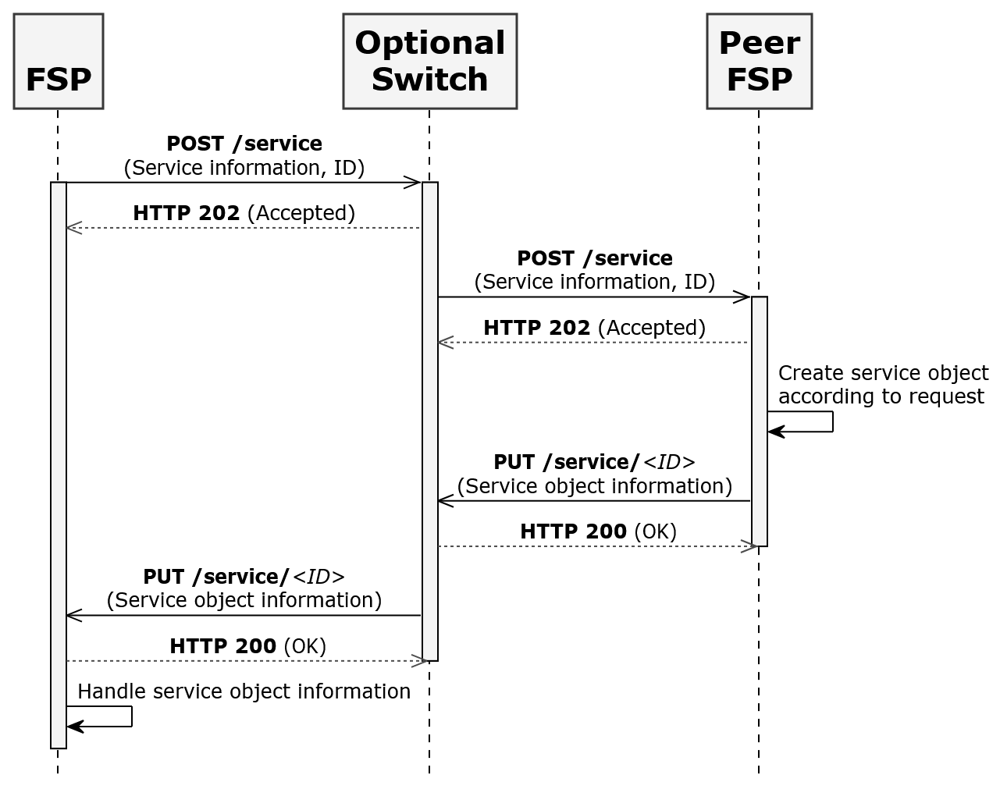
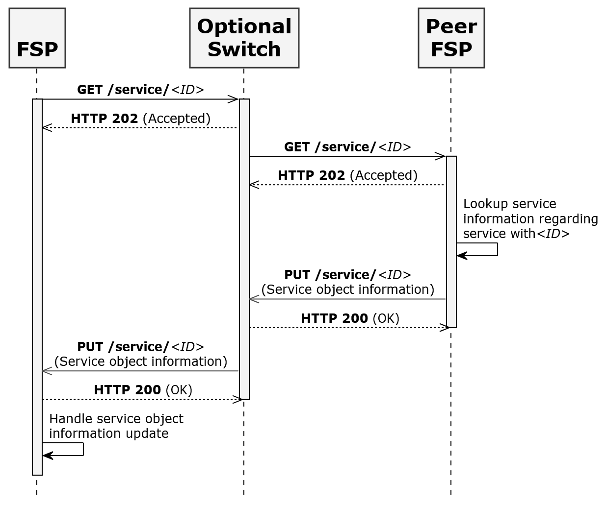

# Règles de Schéma

## Préface

Cette section contient des informations sur l’utilisation de ce document.

### Conventions utilisées dans ce document

Les conventions suivantes sont utilisées dans ce document pour identifier les types d’informations spécifiés.

|Type d’information|Convention|Exemple|
|---|---|---|
|**Éléments de l’API, comme les ressources**|Gras|**/authorization**|
|**Variables**|Italique entre accolades|_{ID}_|
|**Termes du glossaire**|Italique à la première occurrence ; défini dans le _Glossaire_|Le but de l’API est de permettre des transactions financières interopérables entre un _Payeur_ (un payeur de fonds électroniques dans une transaction de paiement) situé dans un _FSP_ (une entité qui fournit un service financier numérique à un utilisateur final) et un _Bénéficiaire_ (destinataire de fonds électroniques dans une transaction de paiement) situé dans un autre FSP.|
|**Documents de bibliothèque**|Italique|Les informations utilisateur ne devraient généralement pas être utilisées par les déploiements API ; les mesures de sécurité détaillées dans _Signature API_ et _Chiffrement API_ doivent être utilisées à la place.|

### Informations sur la version du document

|Version|Date|Description du changement|
|---|---|---|
|**1.0**|2018-03-13|Version initiale|

## Introduction

Ce document définit les règles de schéma pour l’Open API d’Interopérabilité FSP (ci-après appelée l’API) dans trois catégories.

1. Règles de schéma métier :

    a. Ces règles métier doivent être régies par les FSP et, éventuellement, par une autorité de régulation mettant en œuvre l’API dans le cadre d’un schéma.
    
    b. L’autorité réglementaire ou l’autorité de mise en œuvre doit identifier les valeurs valides pour ces règles de schéma métier dans son document de politique API.

2. Règles de schéma de mise en œuvre de l’API :

    a. Ces paramètres API doivent être convenus entre les FSP et, éventuellement, le Switch. Ces paramètres doivent faire partie de la politique de mise en œuvre du schéma.

    b. Tous les participants doivent configurer ces paramètres API comme indiqué par les règles de schéma de niveau API pour la mise en œuvre avec laquelle ils travaillent.

3. Règles de schéma de sécurité et non-fonctionnelles :

    a. Les règles de schéma de sécurité et non-fonctionnelles doivent être déterminées et identifiées dans la politique de mise en œuvre du schéma.

 

### Spécification Open API pour l’Interopérabilité des FSP

La spécification Open API pour l’interopérabilité des FSP inclut les documents suivants.

#### Documents logiques

- [Modèle de Données Logique](./logical-data-model)

- [Modèles de Transaction Génériques](./generic-transaction-patterns)

- [Cas d’Utilisation](./use-cases)

#### Documents de liaison REST asynchrone

- [Définition de l’API](./api-definition)

- [Règles de Liaison JSON](./json-binding-rules)

- [Règles de Schéma](#)

#### Intégrité des Données, Confidentialité et Non-Répudiation

- [Bonnes Pratiques PKI](./pki-best-practices)

- [Signature](./v1.1/signature)

- [Chiffrement](./v1.1/encryption)

#### Documents généraux

- [Glossaire](./glossary)

 

## Règles de Schéma Métier

Cette section décrit les règles de schéma métier. Le modèle de données des paramètres de cette section se trouve dans la _Définition de l’API_.

#### Type d’Authentification

La règle de schéma de type d’authentification contrôle les types d’authentification OTP et QR code. Elle énumère les différents types d’authentification disponibles pour l’authentification du _Payeur_. Un schéma peut choisir de prendre en charge tous les types d’authentification mentionnés dans “AuthenticationTypes” dans la _Définition de l’API_ ou un sous-ensemble de ceux-ci.

#### Identification KYC Consommateur Requise

Un schéma peut imposer la vérification de l’identification KYC (Know Your Customer) du consommateur par un Agent ou un Marchand au moment de la transaction (par exemple, retrait, dépôt, paiement marchand). L’API ne peut pas contrôler cette règle de schéma ; cela doit donc être documenté dans la politique du schéma afin que cette règle soit suivie par tous les participants. Le schéma peut également décider des preuves d’identification KYC valides qui doivent être acceptées par tous les FSP.

#### Devise

Un schéma peut recommander de permettre des transactions dans plusieurs devises. Ce schéma peut définir la liste des devises valides dans lesquelles les transactions peuvent être effectuées par les participants ; cependant ce n’est pas obligatoire. Un Switch peut agir en tant que routeur de transaction et ne valide pas la devise de la transaction. Si un schéma ne définit pas la liste des devises valides, alors le Switch joue ce rôle et le FSP participant peut accepter ou rejeter la transaction selon les devises qu’il supporte. Les échanges de devises ne sont pas pris en charge ; c’est-à-dire que la devise de transaction du Payeur et du _Bénéficiaire_ doit être la même.

#### Format d’ID FSP

Un schéma peut déterminer le format de l’ID FSP. L’ID FSP doit être de type chaîne de caractères. Chaque participant recevra un ID FSP unique attribué par le schéma. Chaque FSP doit préfixer l’ID FSP au code marchand (identifiant unique du marchand) afin que le code marchand soit unique parmi tous les participants (c’est-à-dire dans l’ensemble du schéma). Le schéma peut également déterminer une stratégie alternative pour garantir l’unicité des identifiants FSP et des codes marchands à travers les FSP participants.

#### Type de Transaction d’Interopérabilité

L’API prend en charge les cas d’utilisation documentés dans _Cas d’Utilisation_. Un schéma peut recommander la mise en œuvre de tous les cas d’usages supportés ou d’un sous-ensemble d’entre eux. Un schéma peut aussi recommander de déployer des cas d’utilisation en plusieurs phases. Deux FSP ou plus du schéma peuvent décider de mettre en œuvre d’autres cas d’usage supportés par l’API. Un Switch peut agir en tant que routeur de transaction et ne valide pas le type de transaction ; le FSP peut accepter ou rejeter la transaction en fonction des types de transaction qu’il supporte. Si un FSP participant initie un type de transaction API pris en charge en raison d’une mauvaise configuration côté Payeur, alors la transaction doit être rejetée par le FSP pair si celui-ci ne prend pas en charge ce type de transaction spécifique.

#### Géo-Localisation Requise

L’API prend en charge la géolocalisation du Payeur et du Bénéficiaire ; cependant, cela est optionnel. Un schéma peut imposer la géolocalisation des transactions. Dans ce cas, tous les participants doivent transmettre la géolocalisation de leur partie respective.

#### Paramètres d’Extension

L’API prend en charge un ou plusieurs paramètres d’extension. Un schéma peut recommander que la liste des paramètres d’extension soit supportée. Tous les participants doivent se conformer à la règle de schéma et prendre en charge les paramètres d’extension obligatoires du schéma.

#### Format du Code Marchand

L’API prend en charge la transaction de paiement marchand. Généralement, un consommateur saisit ou scanne un code marchand pour initier un paiement marchand. Dans le cas d’un paiement marchand, le code marchand doit être unique dans tous les schémas. Actuellement, le code marchand n’est pas unique comme le sont les numéros de mobile ou les adresses email. Il est donc recommandé de préfixer ou suffixer le code marchand (avec l’ID FSP) afin que celui-ci soit unique à travers les FSP.

#### Taille maximale des paiements en lot

L’API prend en charge le cas d’utilisation du paiement en lot. Le schéma peut définir le nombre maximal de transactions dans un paiement en lot.

#### Longueur de l’OTP

L’API prend en charge le mot de passe à usage unique (OTP) comme type d’authentification. Un schéma peut définir la longueur minimale et maximale de l’OTP à utiliser par tous les FSP.

#### Délai d’expiration de l’OTP

Le délai d’expiration d’un OTP est configuré par chaque FSP. Un schéma peut recommander qu’il soit uniforme pour tous les schémas afin que les utilisateurs des différents FSP aient une expérience homogène.

#### Types d’ID de Partie

L’API prend en charge le système de recherche de compte. Une recherche de compte peut être effectuée sur la base de types valides d’ID de partie. Un schéma peut choisir les types d’ID de partie à prendre en charge à partir de **PartyIDType** dans la Définition de l’API.

#### Types d’Identifiant Personnel

Un schéma peut choisir les types d’identifiant personnel valides ou pris en charge mentionnés dans **PersonalIdentifierType** dans la Définition de l’API.

#### Format du Code QR

Un schéma doit standardiser le format du code QR dans les deux scénarios suivants :

##### Transaction initiée par le Payeur

Le Payeur scanne le code QR du Bénéficiaire (Marchand) pour initier une transaction initiée par le payeur. Dans ce cas, le code QR doit être standardisé pour inclure les informations du bénéficiaire, le montant de la transaction, le type de transaction, et une note éventuelle. Le schéma doit standardiser le format du code QR pour le bénéficiaire.

##### Transaction initiée par le Bénéficiaire

Le bénéficiaire scanne le code QR du Payeur pour initier une transaction initiée par le bénéficiaire. Par exemple, un marchand scanne le code QR du Payeur pour initier un paiement marchand. Dans ce cas, le code QR doit être standardisé pour localiser le payeur sans utiliser le système de recherche de compte. Le schéma doit standardiser le format du code QR : c’est-à-dire ID FSP, Type d’ID de Partie et ID Payeur, ou seulement Type d’ID de Partie et ID de Partie.

## Règles de Schéma de Mise en œuvre de l’API

Cette section décrit les règles de schéma de mise en œuvre de l’API.

#### Version de l’API

Les informations de version de l’API doivent être incluses dans tous les appels API comme défini dans la _Définition de l'API_. Un schéma doit recommander que tous les FSP implémentent la même version de l’API.

#### HTTP ou HTTPS

L’API prend en charge HTTP et HTTPS. Un schéma doit recommander que la communication soit sécurisée à l’aide de TLS (voir la section [Sécurité des communications](#securite-des-communications)).

#### Délai d’expiration HTTP

Les FSP et le Switch doivent configurer le délai d’expiration HTTP. Si un FSP ne reçoit pas de réponse HTTP (soit **HTTP 202** soit **HTTP 200**) à une requête **POST** ou **PUT**, alors le FSP doit générer un délai d’attente. Se référer au diagramme de la Figure 1 pour les délais d’expiration des **HTTP 202** et **HTTP 200**, indiqués en pointillés.

###### Figure-1

**Figure 1 – Délai d’expiration HTTP**

#### Délais d’expiration des rappels (Callback)

Les FSP et le Switch doivent configurer les délais d’expiration des rappels (callbacks). Le délai d’expiration de rappel du FSP initiateur doit être supérieur à celui du Switch. Un schéma doit déterminer ce délai pour le FSP initiateur et le Switch. Se référer au diagramme de la Figure 2 pour les délais d’expiration de rappel mis en évidence en rouge.

###### Figure-2

**Figure 2 – Délai d’expiration des rappels**

## Règles de Schéma de Sécurité et de Non-Fonctionnel

Cette section décrit les règles de schéma concernant la sécurité, l’environnement et autres exigences réseau.

#### Synchronisation de l’Horloge

Il est important de synchroniser les horloges entre les FSP et les Switch. Il est recommandé d’utiliser un ou plusieurs serveurs NTP pour la synchronisation de l’horloge.

#### Chiffrement des Champs de Données

Les champs de données devant être chiffrés seront déterminés par les lois nationales et locales, ainsi que par toute norme à laquelle il faut se conformer. Le chiffrement doit respecter la section _Chiffrement_.

#### Signature numérique des messages

Un schéma peut décider que tous les messages doivent être signés comme décrit dans la section _Signature_. Les messages de réponse n'ont pas à être signés.

#### Certificats numériques

Pour utiliser les fonctionnalités de signature et de chiffrement détaillées dans les sections _Signature_ et _Chiffrement_ d’un schéma, les FSP et les Switch doivent obtenir des certificats numériques tels que spécifiés par l’_AC_ (Autorité de Certification) désignée dans le schéma.

#### Exigence cryptographique

Toutes les parties doivent prendre en charge les encodages et les algorithmes de chiffrement spécifiés dans _Chiffrement_, si les fonctionnalités de chiffrement doivent être utilisées dans le schéma.

#### Sécurité des communications

Un schéma doit exiger que toute communication HTTP entre les parties soit sécurisée à l’aide de TLS[1](https://tools.ietf.org/html/rfc5246) version 1.2 ou ultérieure.

1 [https://tools.ietf.org/html/rfc5246](https://tools.ietf.org/html/rfc5246) - The Transport Layer Security (TLS) Protocol - Version 1.2

### Table des figures

[Figure 1 – Délai d’expiration HTTP](#figure-1)

[Figure 2 – Callback](#figure-2)