## Préface

Cette section contient des informations sur la manière d'utiliser ce document.

### Conventions utilisées dans ce document

Les conventions suivantes sont utilisées dans ce document pour identifier les types d'informations spécifiés.

|Type d'information|Convention|Exemple|
|---|---|---|
|**Éléments de l'API, tels que les ressources**|Gras|**/authorization**|
|**Variables**|Italique avec des chevrons|_{ID}_|
|**Termes du glossaire**|Italique lors de la première occurrence ; défini dans le _Glossaire_|Le but de l’API est de permettre des transactions financières interopérables entre un _Payeur_ (un payeur de fonds électroniques dans une transaction de paiement) situé dans un _FSP_ (une entité qui fournit un service financier numérique à un utilisateur final) et un _Bénéficiaire_ (un bénéficiaire de fonds électroniques dans une transaction de paiement) situé dans un autre FSP.|
|**Documents de bibliothèque**|Italique|Les informations utilisateur ne devraient généralement pas être utilisées par les déploiements de l’API ; à la place, les mesures de sécurité détaillées dans _Signature API et Chiffrement API_ doivent être utilisées.|

### Informations sur la version du document

|Version|Date|Description des modifications|
|---|---|---|
|**1.0**|2018-03-13|Version initiale|
|**1.1**|2020-05-19|1. Cette version contient une nouvelle option pour qu'un FSP Bénéficiaire demande une notification de validation (commit) du Switch. Le Switch doit ensuite envoyer la notification de validation à l'aide de la nouvelle requête **PATCH /transfers/**_{ID}_. L'option d'utiliser la notification de validation remplace l'ancienne option "Contrôle supplémentaire de compensation facultatif". La section décrivant cela a été remplacée par la nouvelle section "Commit Notification (Notification de validation)". La ressource **transfers** a été mise à jour avec la nouvelle requête **PATCH**, cette ressource est donc passée en version 1.1. Dans le cadre de l'ajout de la possibilité d'utiliser une notification de validation, les changements suivants ont été apportés : <br> a. PATCH a été ajouté comme méthode HTTP autorisée dans la section 3.2.2. b. Le flux d’appel pour **PATCH** est décrit dans la section 3.2.3.5. <br>c. Le tableau 6 en section 6.1.1 a été mis à jour pour inclure **PATCH** comme méthode HTTP possible. <br>d. La section 6.7.1 contient la nouvelle version de la ressource **transfers**. <br>e. La section 6.7.2.6 décrit le processus d’utilisation des notifications de validation <br>f. La section 6.7.3.3 décrit la nouvelle requête **PATCH /transfers**/_{ID}_.<br><br>2. En plus des changements mentionnés ci-dessus concernant la notification de validation, les modifications suivantes n'affectant pas l'API ont été apportées : <br>a. Figure 6 mise à jour car elle contenait une erreur de copier-coller. <br>b. Ajout de la section 6.1.2 pour fournir une vue complète de la version actuelle de chaque ressource. <br>c. Ajout d'une section pour chaque ressource afin de voir l’historique des versions de ressource. <br>d. Corrections éditoriales mineures. <br><br>3. Les descriptions de deux des champs d'en-tête HTTP du Tableau 1 ont été mises à jour pour ajouter plus de spécificité et de contexte<br>a. La description du champ d'en-tête **FSPIOP-Destination** a été mise à jour pour indiquer qu'il doit rester vide si la destination n'est pas connue de l'émetteur original, mais dans tous les autres cas, doit être ajouté par l'émetteur original de la requête.<br>b. La description du champ d'en-tête **FSPIOP-URI** a été rendue plus spécifique.<br><br>4. Les exemples utilisés dans ce document ont été mis à jour pour utiliser la bonne interprétation du type complexe ExtensionList défini dans le Tableau 84. Ceci n'implique pas de changement en soi.<br>a. L’exemple 5 a été mis à jour à ce sujet.<br><br>5. Le modèle de données est mis à jour pour ajouter un élément optionnel ExtensionList au type complexe **PartyIdInfo** selon la demande de changement : https://github.com/mojaloop/mojaloop-specification/issues/30. Par conséquent, le modèle de données comme spécifié dans le Tableau 103 a été mis à jour. Pour plus de cohérence, le modèle de données pour les appels **POST /participants/**_{Type}/{ID}_ et **POST /participants/**_{Type}/{ID}/{SubId}_ dans le Tableau 10 a également été mis à jour pour inclure l’élément optionnel ExtensionList.<br><br>6. Une nouvelle section 6.5.2.2 est ajoutée pour décrire le processus impliqué dans le rejet d’un devis.<br><br>7. Une note est ajoutée à la Section 6.7.4.1 pour clarifier l’utilisation de l’état ABORTED dans les callbacks **PUT /transfers/**_{ID}_.|
|**1.1.1**|2021-09-22|Cette version du document ajoute uniquement des informations sur les en-têtes HTTP optionnels relatifs à la prise en charge de la traçabilité dans [Table 2](#table-2), voir _Distributed Tracing Support for OpenAPI Interoperability_ pour plus d’informations. Aucun changement n’est apporté à aucune ressource dans cette version.|

## Introduction

Ce document introduit et décrit l’_Open API_ (Interface de Programmation Applicative) _pour l’interopérabilité FSP_ (Fournisseur de Services Financiers), appelé ci-après « l’API ». L'objectif de l'API est de permettre des transactions financières interopérables entre un _Payeur_ (un payeur de fonds électroniques dans une transaction de paiement) situé dans un _FSP_ (une entité qui fournit un service financier numérique à un utilisateur final) et un _Bénéficiaire_ (un bénéficiaire de fonds électroniques dans une transaction de paiement) situé dans un autre FSP. L'API ne précise aucun service frontal entre un Payeur ou un Bénéficiaire et son propre FSP ; tous les services définis dans l'API sont entre FSPs. Les FSPs sont connectés soit (a) directement entre eux, soit (b) par un _Switch_ placé entre les FSPs pour router les transactions financières vers le FSP approprié.

Le transfert de fonds d'un Payeur à un Bénéficiaire doit être effectué quasi en temps réel. Dès qu'une transaction financière a été acceptée par les deux parties, elle est réputée irrévocable. Cela signifie qu'une transaction terminée ne peut pas être annulée dans l'API. Pour annuler une transaction, une nouvelle transaction de remboursement négative doit être créée à partir du Bénéficiaire de la transaction d'origine.

L'API est conçue pour être suffisamment générique pour prendre en charge de nombreux cas d'utilisation et l’extensibilité de ceux-ci. Cependant, elle doit contenir suffisamment de détails pour permettre une implémentation sans ambiguïté.

La version 1.0 de l'API est conçue pour être utilisée dans un pays ou une région ; les envois internationaux nécessitant un échange de devises ne sont pas pris en charge. Cette version contient également une prise en charge de base du [protocole Interledger](#4-interledger-protocol), qui sera utilisé dans les futures versions de l’API pour gérer les transactions multi-devises et multi-intermédiaires.

Ce document :

- Définit une liaison REST asynchrone de l'API logique introduite dans _Modèles de transactions génériques_.
- Complète et développe les informations fournies dans [Spécification Open API pour l’Interopérabilité FSP](#open-api-for-fsp-interoperability-specification).

### Spécification Open API pour l’Interopérabilité FSP

La spécification Open API pour l’Interopérabilité FSP inclut les documents suivants.

#### Documents logiques

- [Modèle de données logique](../logical-data-model)

- [Modèles de transaction génériques](../generic-transaction-patterns)

- [Cas d’utilisation](../use-cases)

#### Documents de liaison REST asynchrone

- [Définition de l’API](../definitions)

- [Règles d’assemblage JSON](../json-binding-rules)

- [Règles de schéma](../scheme-rules)

#### Intégrité des données, confidentialité et non-répudiation

- [Meilleures pratiques PKI](../pki-best-practices)

- [Signature](../v1.1/signature)

- [Chiffrement](../v1.1/encryption)

#### Documents généraux

- [Glossaire](../glossary)

<br />

## Définition de l’API

Cette section introduit la technologie utilisée par l’API, incluant :

- [Caractéristiques générales](#general-characteristics)
- [Détails HTTP](#http-details)
- [Gestion des versions de l'API](#api-versioning)

### Caractéristiques générales

Cette section décrit les caractéristiques générales de l’API.

#### Style architectural

L’API est basée sur le style architectural REST (REpresentational State Transfer<sup>1</sup>). Il existe cependant quelques différences avec une implémentation REST typique. Ces différences incluent :

- **API totalement asynchrone** : pour pouvoir gérer de nombreux processus longs concurrents et avoir un mécanisme unique de gestion des requêtes, tous les services API sont asynchrones. Exemples :
  - Transactions financières en lots
  - Une transaction financière nécessitant une interaction utilisateur

- **Décentralisée** : les services sont décentralisés, il n’existe pas d’autorité centrale pour piloter une transaction.

- **Orientée service** : les ressources proposées par l’API sont relativement orientées service comparées à une API REST classique.

- **Pas totalement sans état** : certaines informations d’état doivent être conservées à la fois côté client et côté serveur durant le processus de transaction.

- **Le client choisit l’identifiant commun** : dans une implémentation REST typique (avec distinction claire client/serveur), c’est le serveur qui génère l’ID lors de la création de l’objet. Dans cette API, un devis ou une transaction financière réside à la fois dans le FSP du Payeur et du Bénéficiaire, car les services sont décentralisés. Il est donc nécessaire d’avoir un identifiant commun pour l’objet. Les raisons en sont doubles :
   - L’ID commun est utilisé dans l’URI du callback asynchrone vers le client. Le client sait donc à quelle URI écouter pour le callback correspondant à la requête.
   - Le client peut utiliser l’ID commun dans une requête HTTP **GET** directement s’il ne reçoit pas de callback depuis le serveur (voir [Détails HTTP](#http-details) pour plus d’informations).

  Pour maintenir l’unicité des IDs communs, chacun est défini comme un UUID (Identifiant Universel Unique<sup>2</sup>). Pour garantir encore plus l’unicité, il est recommandé au serveur d’associer chaque ID d’objet à l’ID FSP du client. Si un serveur reçoit tout de même un ID commun non unique lors d’une requête HTTP **POST** (voir [Détails HTTP](#http-details) pour plus de détails), la requête doit être gérée comme indiqué dans la section [Services idempotents côté serveur](#idempotent-services-in-server).

#### Protocole de niveau application

HTTP, tel que défini dans RFC 7230<sup>3</sup>, est utilisé comme protocole de niveau applicatif dans l’API. Toute communication en environnement de production doit être sécurisée en utilisant HTTPS (HTTP sur TLS<sup>4</sup>). Pour plus de détails, voir [Détails HTTP](#http-details).

#### Syntaxe URI

La syntaxe des URIs suit la RFC 3986<sup>5</sup> pour identifier les ressources et services proposés par l’API. Cette section introduit et précise les sujets d’implémentation propres à chaque partie de la syntaxe.

Une URI générique a la forme présentée dans [Exemple 1](#listing-1), où la partie \[_user:password@_\]_host_\[_:port_\] correspond à la partie `Authority` décrite dans la section [Authority](#authority).
_{resource}_.

###### Exemple 1

```
scheme:[//[user:password@]host[:port]][/]path[?query][#fragment]
```

**Exemple 1 -- Format générique d’URI**

##### Schéma

Conformément à la section [Protocole de niveau application](#aplication-level-protocol), le _schéma_ (ensemble de règles, pratiques et standards nécessaires au fonctionnement des services de paiement) sera toujours soit **http**, soit **https**.

##### Autorité

La partie d’autorité consiste en une partie d’authentification optionnelle (`User Information`), une partie hôte obligatoire, suivie d’un port optionnel.

###### Informations utilisateur

Les informations utilisateur ne devraient généralement pas être utilisées par les déploiements API ; les mesures de sécurité détaillées dans *Signature API* et _Chiffrement API_ doivent être privilégiées.

###### Hôte

L’hôte correspond à l’adresse du serveur. Il peut s’agir d’une adresse IP ou d’un nom d’hôte. Elle variera (généralement) selon le déploiement.

###### Port

Le numéro de port est optionnel ; par défaut, le port HTTP est **80** et HTTPS **443**, mais d’autres ports peuvent être utilisés. Le port à utiliser peut différer selon le déploiement.

##### Chemin (Path)

Le chemin pointe vers une ressource ou un service effectif de l’API. Les ressources de l’API sont :

- **participants**
- **parties**
- **quotes**
- **transactionRequests**
- **authorizations**
- **transfers**
- **transactions**
- **bulkQuotes**
- **bulkTransfers**

Toutes les ressources ci-dessus sont également organisées de façon hiérarchique, séparées par un ou plusieurs slash (**'/'**). Les ressources supportent différents services selon la méthode HTTP utilisée. Toutes les ressources et services API supportés, avec URI et méthode HTTP, figurent dans [le tableau 6](#table-6).

##### Query

La partie query est optionnelle ; elle n’est actuellement utilisée et supportée que par certains services de l’API. Voir les ressources API dans la section [Services API](#api-services) pour plus de détails sur les services qui supportent les chaînes de requête. Tous les autres services doivent ignorer toute chaîne de requête reçue, car des chaînes de requête pourront être ajoutées dans de futures versions mineures de l’API (voir [Méthodes HTTP](#http-methods)).

S’il y a plusieurs paires clé-valeur dans la chaîne de requête, celles-ci doivent être séparées par le symbole esperluette (**'&'**).

[L'exemple 2](#listing-2) montre un exemple d’URI issue de la ressource **/authorization**, où quatre paires clé-valeur différentes sont présentes, séparées par le symbole esperluette.

###### Exemple 2

```
/authorization/3d492671-b7af-4f3f-88de-76169b1bdf88?authenticationType=OTP&retriesLeft=2&amount=102&currency=USD
```

**Exemple 2 -- URI contenant plusieurs paires clé-valeur dans la chaîne de requête**

##### Fragment

Le fragment est une partie optionnelle d’une URI. Il n’est pris en charge par aucun service de l’API et doit donc être ignoré s’il est reçu.

#### Normalisation et comparaison d’URI

Comme précisé dans la RFC 7230<sup>6</sup>, les parties [schéma](#scheme)) et [hôte](#host)) de l’URI doivent être considérées comme insensibles à la casse. Toutes les autres parties doivent être traitées en tenant compte de la casse.

#### Jeu de caractères

Le jeu de caractères doit toujours être supposé UTF-8, défini dans 3629<sup>7</sup>. Il n’est donc pas nécessaire de l’indiquer dans les en-têtes HTTP (voir [Champs d’en-tête HTTP](#http-header-fields)). Aucun autre jeu de caractères que UTF-8 n’est supporté par l’API.

#### Format d’échange de données

L’API utilise JSON (JavaScript Object Notation), défini dans RFC 7159<sup>8</sup>, comme format d’échange. JSON est ouvert, léger, lisible et indépendant de la plateforme, bien adapté pour l’échange de données entre systèmes.

<br />

### Détails HTTP

Cette section contient des informations détaillées concernant l’utilisation du protocole HTTP dans l’API.

#### Champs d’en-tête HTTP

Les en-têtes HTTP sont généralement décrits dans la RFC 72309. Les deux sections suivantes décrivent les champs d’en-tête HTTP qui doivent être attendus et mis en œuvre dans l’API.

L’API prend en charge une taille maximale de 65536 octets (64 kilooctets) dans l’en-tête HTTP.

#### Champs d’en-tête HTTP de requête

[Le tableau 1](#table-1) contient les champs d’en-tête HTTP de requête qui doivent être supportés par les implémentations de l’API. Une implémentation doit également s’attendre à d’autres champs d’en-tête HTTP standards et non standards non listés ici.

###### Tableau 1

|Champ|Exemples de valeurs|Cardinalité|Description|
|---|---|---|---|
|**Accept**|**application/vnd.interoperability.resource+json**|0..1<br>Obligatoire dans une requête client. Non utilisé dans un callback du serveur.</br>Le champ d’en-tête **Accept**<sup>10</sup> indique la version de l’API que le client souhaite utiliser côté serveur. Voir [En-tête Accept HTTP](#http-accept-header) pour demander une version spécifique de l’API.|
|**Content-Length**|**3495**|0..1|Le champ **Content-Length**<sup>11</sup> indique la taille attendue du corps de la requête. Présent seulement s’il y a un corps.<br>**Note** : l’API autorise une taille maximale de 5 Mo (5242880 octets).<br>|
|**Content-Type**|**application/vnd.interoperability.resource+json;version=1.0**|1|**Content-Type**<sup>12</sup> indique la version spécifique de l’API utilisée pour envoyer le corps de la requête. Voir [Version acceptée demandée par le client](#acceptable-version-requested-by-client) pour plus d’informations.|
|**Date**|**Tue, 15 Nov 1994 08:12:31 GMT**|1|Le champ **Date**<sup>13</sup> indique la date à laquelle la requête a été envoyée.|
|**X-Forwarded-For**|**X-Forwarded-For: 192.168.0.4, 136.225.27.13**|1..0|Le champ **X-Forwarded-For**<sup>14</sup> est une norme officieuse utilisée pour indiquer l’IP d’origine du client à titre informatif, une requête pouvant passer par plusieurs proxys, pare-feux, etc. Plusieurs valeurs **X-Forwarded-For** comme dans l’exemple doivent être attendues et supportées. <br>**Note** : Une alternative à **X-Forwarded-For** est définie dans RFC 723915. Cependant, en 2018, RFC 7239 est moins utilisé/supporté que **X-Forwarded-For**.</br>|
|**FSPIOP-Source**|**FSP321**|1|Le champ d’en-tête **FSPIOP-Source** est un champ non standard HTTP utilisé par l’API pour identifier l’émetteur de la requête HTTP. Il doit être placé par l’émetteur original de la requête. Nécessaire pour le routage (voir [Routage par FSPIOP-Source et FSPIOP-Destination](#call-flow-routing-using-fspiop-destination-and-fspiop-source)) et la vérification de signature (**FSPIOP-Signature**).|
|**FSPIOP-Destination**|**FSP123**|0..1|Le champ **FSPIOP-Destination** est non standard HTTP, utilisé pour le routage (via en-tête HTTP) des requêtes/réponses vers la destination. Il doit être défini par l’émetteur initial de la requête, si la destination est connue (valable pour tous les services sauf GET /parties), afin que les entités intermédiaires n’aient pas à parser le corps pour le routage (voir [Routage](#3236-call-flow-routing-using-fspiop-destination-and-fspiop-source)). Si la destination n’est pas connue (valable pour GET /parties), ce champ doit rester vide.|
|**FSPIOP-Encryption**||0..1|Champ non standard HTTP utilisé pour le chiffrement de bout en bout de la requête.<br>Voir Chiffrement API.</br>|
|**FSPIOP-Signature**||0..1|Champ non standard, utilisé pour la signature de bout en bout de la requête.<br>Voir Signature API.</br>|
|**FSPIOP-URI**|**/parties/msisdn/123456789**|0..1|Champ non standard HTTP utilisé pour la vérification de la signature, contient l’URI du service. Obligatoire si la signature est utilisée. <br>Dans le contexte de l’API Mojaloop FSPIOP, la valeur FSPIOP-URI commence au **_service_** dans l’URI. Par exemple, si l’URL est http://stg-simulator.moja.live/payerfsp/participants/MSISDN/123456789, alors la valeur FSPIOP-URI est « /participants/MSISDN/123456789 ».|
|**FSPIOP-HTTP-Method**|**GET**|0..1|Champ non standard HTTP utilisé pour la vérification de la signature : doit contenir la méthode HTTP du service utilisé. Obligatoire si la signature est utilisée, voir Signature API.|

**Tableau 1 -- Champs d’en-tête HTTP de requête obligatoires**

[Le tableau 2](#table-2) liste les champs d’en-tête de requête HTTP dont la prise en charge par les implémentations de l’API est optionnelle.

###### Tableau 2

|Champ|Exemples de valeurs|Cardinalité|Description|
|---|---|---|---|
|**traceparent**|**00-91e502e28cd723686e9940bd3f378f85-b0f903d000944947-01**|0..1|L’en-tête traceparent représente la requête entrante dans un système de traçage dans un format commun. Voir _Distributed Tracing Support for OpenAPI Interoperability_ pour plus d’information.|
|**tracestate**|**banknrone=b0f903d0009449475**|0..1|Fournit des informations de traçage spécifiques au fournisseur et prend en charge plusieurs traces distribuées. Voir _Distributed Tracing Support for OpenAPI Interoperability_ pour plus d’information.|

**Tableau 2 -- Champs d’en-tête HTTP de requête optionnels**

##### Champs d’en-tête HTTP de réponse

[Le tableau 3](#table-3) contient les champs d’en-tête HTTP de réponse obligatoires. Une implémentation peut aussi recevoir d’autres en-têtes HTTP standards ou non standards non listés ici.

###### Tableau 3

|Champ|Exemples de valeurs|Cardinalité|Description|
|---|---|---|---|
|**Content-Length**|**3495**|0..1|Champ **Content-Length**<sup>16</sup> indiquant la taille attendue du corps. Envoyé uniquement si corps présent.|
|**Content-Type**|**application/vnd.interoperability.resource+json;version=1.0**|1|Champ **Content-Type**<sup>17</sup> indiquant la version de l’API utilisée pour envoyer le corps. Voir [Section 3.3.4.2](#3342-acceptable-version-requested-by-client) pour plus de détails.|

**Tableau 3 -- Champs d’en-tête HTTP de réponse**

#### Méthodes HTTP

Les méthodes HTTP suivantes, telles que définies dans RFC 7231<sup>18</sup>, sont supportées par l’API :

- **GET** : utilisée par le client pour demander des informations sur un objet précédemment créé côté serveur. Comme tous les services API sont asynchrones, la réponse directe à la requête **GET** ne contient pas l’objet demandé : cet objet viendra en callback dans une requête **PUT**.

- **PUT** : utilisée comme callback à une précédente requête **GET**, **POST** ou **DELETE** émise par le client. Le callback contient soit :

  - Informations sur l’objet précédemment créé (**POST**) ou informations demandées (**GET**)
  - Accusé de réception de suppression d’un objet (**DELETE**)
  - Informations d’erreur si la requête **POST** ou **GET** n’a pu être traitée côté serveur

- **POST** : utilisée par le client pour demander la création d’un objet côté serveur. Comme l’API est asynchrone, la réponse directe ne contient pas l’objet : celui-ci viendra en callback via un **PUT**.

- **DELETE** : utilisée pour demander la suppression d’un objet côté serveur. **DELETE** ne doit être supporté qu’au sein d’un système commun Account Lookup System (ALS) pour supprimer des informations sur une Party (détenteur de compte chez un FSP) précédemment ajoutée ; aucun autre type d’objet ne peut être supprimé. Comme tous les services sont asynchrones, la réponse à **DELETE** ne contient pas l’accusé de réception final : celui-ci viendra via un callback en **PUT**.

- **PATCH** : utilisée pour notifier une mise à jour d’un objet existant. Comme l’API est asynchrone, la réponse à **PATCH** ne contient pas de corps : cette méthode sert de notification et ne génère pas de callback.

<br />

#### Séquencement HTTP

Tous les séquences et services sont asynchrones. Aucun service ne supporte le mode synchrone.

##### Appel POST HTTP

[La figure 1](#figure-1) montre le cas normal de création d’un objet dans un FSP pair via HTTP **POST**. Le service **_/service_** du schéma doit être remplacé par n’importe lequel des services du [Tableau 6](#table-6) supportant **POST**.

###### Figure 1

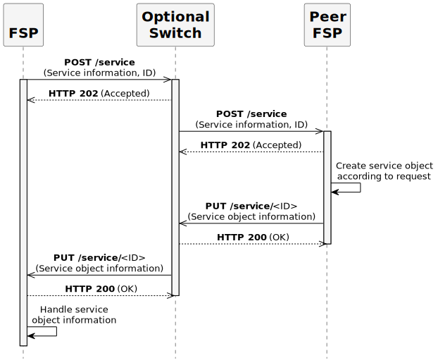

**Figure 1 — Séquence d’appel POST HTTP**

##### Appel GET HTTP

[La figure 2](#figure-2) montre le cas d’obtention d’informations sur un objet dans un FSP pair via HTTP **GET**. Le service **/service/**_{ID}_ du schéma doit être adapté à n’importe quel service listé dans [Tableau 6](#table-6) supportant **GET**.

###### Figure 2

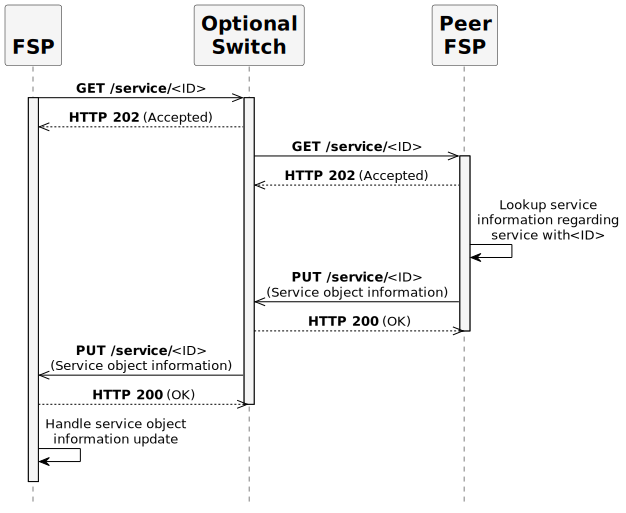

**Figure 2 — Séquence d’appel GET HTTP**

##### Appel DELETE HTTP

[La figure 3](#figure-3) décrit l’appel d’API pour supprimer des informations FSP sur une Party via HTTP **DELETE** dans un ALS. Le service **/service/**_{ID}_ doit être adapté à un service du [Tableau 6](#table-6) supportant **DELETE**. DELETE n’est géré que par un ALS commun (c’est pourquoi l’ALS n’apparaît que côté serveur dans la figure).

###### Figure 3

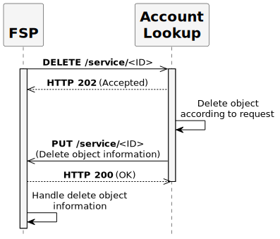

**Figure 3 — Séquence d’appel DELETE HTTP**

**Remarque :** il est également possible que les requêtes vers l’ALS passent par un Switch, ou que l’ALS et le Switch soient le même serveur.

##### Callback PUT HTTP

Le **PUT** HTTP est toujours utilisé comme callback sur une requête **POST**, **GET** ou **DELETE**.

Le flux d’appel d’une requête **PUT** et de la réponse peut être observé dans les figures 1, 2 et 3 indiquées précédemment.

##### Séquence PATCH HTTP

[La figure 4](#figure-4) montre un exemple de séquence pour le **PATCH** HTTP, utilisé pour envoyer une notification. D’abord, un objet est créé via un **POST** depuis le Switch. L’objet est créé dans le FSP à l’état non finalisé. Le FSP demande ensuite à être notifié de l’état final par le Switch via un callback **PUT** avec l’état non finalisé. Le Switch gère le callback et envoie la notification d’état finalisé via un **PATCH**. La seule ressource supportant PATCH est /transfers.

###### Figure 4

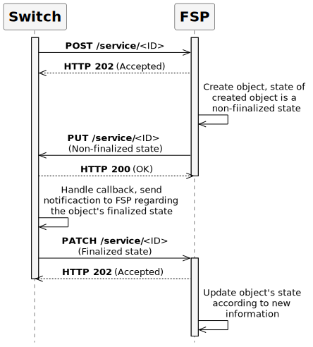

**Figure 4 — Séquence PATCH HTTP**

**Remarque :** les requêtes vers l’ALS peuvent aussi être routées via un Switch, voire ALS et Switch peuvent être le même serveur.

##### Routage par FSPIOP-Source et FSPIOP-Destination

Les en-têtes HTTP non standard **FSPIOP-Destination** et **FSPIOP-Source** servent au routage et à la vérification de signature (voir _Signature API_). [La figure 5](#figure-5) montre l’usage de ces en-têtes dans un appel **POST /service** abstrait, lorsque le FSP de destination est connu.

###### Figure 5

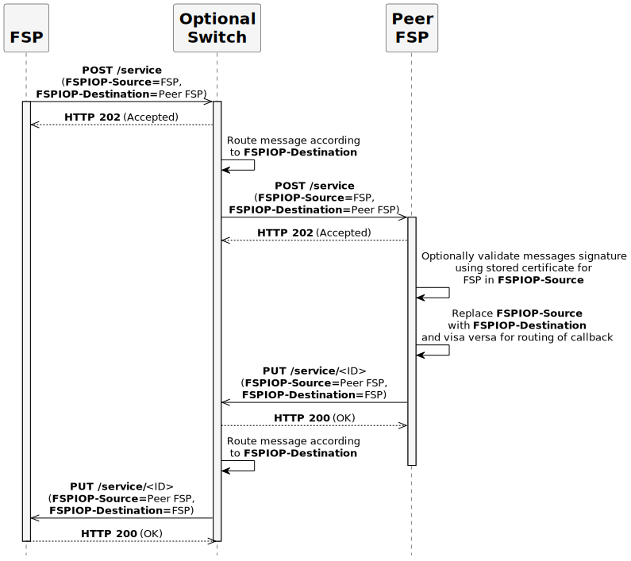

**Figure 5 — Usage des en-têtes HTTP personnalisés FSPIOP-Destination et FSPIOP-Source**

Pour certains services avec un Switch, la destination n’est pas connue. Par exemple, un FSP envoie un **GET /parties** au Switch sans savoir quel autre FSP détient la Party (voir [Section 6.3.2](#632-service-details)). **FSPIOP-Destination** sera alors vide (ou défini à l’ID du Switch) émis depuis le FSP, et renseigné à sa vraie valeur par le Switch lors du routage. Voir [Figure 6](#figure-6) pour illustration.

###### Figure 6

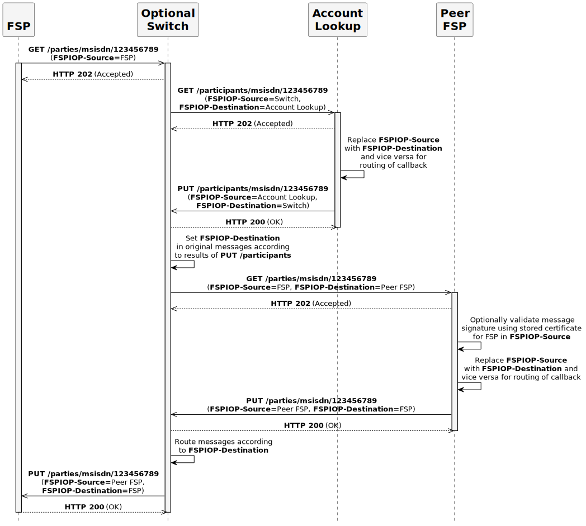

**Figure 6 — Exemple : FSPIOP-Destination inconnu pour le FSP**

<br />

#### Codes de statut HTTP de réponse

L’API prend en charge les codes HTTP de réponse indiqués dans le [tableau 4](#table-4) :

###### Tableau 4

|Code|Raison|Description|
|---|---|---|
|**200**|`OK`|Réponse standard pour une requête réussie. Utilisé dans l’API en réponse à un callback pour marquer la complétion d’un service asynchrone.|
|**202**|`Accepted`|La requête a été acceptée pour un traitement ultérieur côté serveur, sans garantie de succès. Utilisé comme accusé de réception d’une requête asynchrone.|
|**400**| `Bad Request`|L’application ne peut pas traiter la requête : syntaxe incorrecte ou corps dépassant la taille autorisée.|
|**401**|`Unauthorized`|La requête nécessite une authentification.|
|**403**|`Forbidden`|La requête a été refusée et sera systématiquement refusée à l’avenir.|
|**404**|`Not Found`|La ressource indiquée dans l’URI n’a pas été trouvée.|
|**405**|`Method Not Allowed`|Méthode HTTP non supportée ; voir Tableau 6 pour les méthodes autorisées par service.|
|**406**|`Not acceptable`|Le serveur ne peut générer de contenu conformément à l’en-tête Accept reçu ; cela indique qu'il ne supporte pas la version demandée.|
|**501**|`Not Implemented`|Le serveur ne supporte pas le service demandé. Le client ne doit pas retenter.|
|**503**|`Service Unavailable`|Le serveur n’est actuellement pas disponible pour de nouvelles requêtes. Cela devrait être temporaire : le client doit retenter dans un temps raisonnable.|

 **Tableau 4 — Codes de statut HTTP supportés dans l’API**

Tout code de statut HTTP 3*xx*<sup>20</sup> retourné côté serveur ne doit pas être retenté et requiert une investigation manuelle.

Une implémentation de l’API doit aussi savoir gérer d’autres erreurs non listées, en particulier si la requête passe par des proxies.

Comme toutes les requêtes API sont asynchrones, les codes d’erreur HTTP serveur supplémentaires (5*xx*<sup>21</sup> non définis au tableau 4) ne sont pas utilisés par l’API elle-même. Toute erreur serveur lors du traitement réel sera notifiée via un callback d’erreur au client (voir [Section 9.2](#92-error-in-server-during-processing-of-request)).

<br />

##### Informations d’erreur en réponse HTTP

En plus du code HTTP, toutes les réponses d’erreur HTTP (4*xx* et 5*xx*) peuvent contenir un élément **ErrorInformation**, défini dans la section [ErrorInformation](#errorinformation). Cet élément doit, si possible, permettre de fournir plus d’informations au client.

<br />

##### Services idempotents côté serveur

Tout service supportant **GET** doit être _idempotent_ : la même requête peut être envoyée plusieurs fois sans changer l’objet. (L’état de l’objet côté serveur peut toutefois évoluer : par exemple, l’état d’une transaction peut changer, mais le FSP envoyant **GET** ne peut changer l’état).

Tout service supportant **POST** doit aussi être idempotent si le client réutilise le même identifiant. Le serveur ne doit pas créer un nouvel objet s’il reçoit à nouveau la même requête **POST**. Ceci facilite la gestion de la reprise après erreur côté client, mais impose des contraintes au serveur — voir l’exemple [ici](#client-missing-response-from-server---using-resend-of-request).

##### Analyse des duplicats côté serveur lors de la réception d’un POST

Lors de la réception d’une requête côté serveur, il doit vérifier si un objet de service portant le même identifiant existe déjà : par exemple, si le client a déjà envoyé **POST /transfers** avec le même **transferId**. Si l’objet existe déjà, le serveur vérifie si ses paramètres correspondent à ceux de la nouvelle requête.

- Si l’objet existant a les mêmes paramètres que la nouvelle requête, on considère qu’il s’agit d’un renvoi de la part du client.
  - Si le serveur n’a pas encore traité la requête précédente/créée et n’a donc pas envoyé de callback, la nouvelle requête peut être ignorée (un callback va être envoyé de toute façon).
  - Si le serveur a fini de traiter l’ancienne requête et a déjà envoyé un callback, un nouveau callback doit être envoyé, comme si une requête **GET** avait été reçue.

- Si l’ancien objet n’a pas les mêmes paramètres que la requête, un callback d’erreur expliquant qu’un objet avec le même identifiant existe déjà mais avec des paramètres différents doit être envoyé au client.

Pour simplifier cette analyse, il est recommandé de stocker un hash de toutes les requêtes **POST** reçues côté serveur afin de les comparer facilement lors de réceptions ultérieures.

<br />

### Gestion des versions de l’API

La stratégie de développement de l’API est de maintenir la compatibilité ascendante entre l’API et ses ressources/services au maximum, cependant des changements doivent être attendus par les parties qui implémentent. La gestion des versions de l’API est propre à chaque ressource (par exemple : **/participants**, **/quotes**, **/transfers**).

Il existe deux types de versions de ressource API : les versions _mineures_ (backwards-compatibles), et _majeures_ (non compatibles en rétro).

- À chaque changement des caractéristiques de l’API impactant un service, la ressource concernée voit sa version augmentée (mineure ou majeure selon la compatibilité).
- Un changement dans un service spécifique voit sa ressource correspondante recevoir une nouvelle version.

Le format de la version de ressource est _x.y_ où _x_ est le numéro majeur, _y_ le mineur. À chaque nouvelle version majeure, la version mineure repart à **0**. La version initiale de chaque ressource est **1.0**.

#### Changements n’affectant pas la version de ressource API

Certains changements n’affecteront pas la version, par exemple : modification de l’ordre des paramètres d’une requête ou d’un callback.

#### Changement mineur de version de ressource

Les modifications suivantes sont considérées comme rétrocompatibles. Les implémenteurs doivent concevoir client/serveur pour les accepter d’emblée sans casse fonctionnelle :

- Ajout de paramètres d’entrée facultatifs (chaînes de requête, etc.)
- Ajout de paramètres facultatifs dans une requête ou un callback
- Ajout de codes d’erreur

Ces changements affectent la version mineure.

#### Changement majeur de version de ressource

Les modifications ci-après sont considérées comme rétro-incompatibles. L’implémenteur n’a PAS à garantir la prise en charge automatique :

- Suppression ou ajout de paramètres obligatoires
- Paramètres facultatifs devenant obligatoires
- Renommage de paramètres
- Changement de types de données
- Changement de logique métier
- Modification des URI de ressource/service

Cette liste n’est pas exhaustive.

#### Négociation de version entre client et serveur

L’API prend en charge une négociation basique par HTTP content negotiation. Un client doit envoyer la version de ressource API souhaitée dans l’en-tête **Accept** (voir [En-tête Accept HTTP](#http-accept-header)). Si le serveur supporte cette version, elle est utilisée au callback ([Version acceptable…](#acceptable-version-requested-by-client)). Si le serveur ne la supporte pas, il doit répondre HTTP 406<sup>22</sup> avec une liste des versions supportées ([Version non acceptable…](#non-acceptable-version-requested-by-client)).

#### En-tête Accept HTTP

Voir ci-dessous un exemple de requête HTTP simplifiée avec seulement l’en-tête **Accept**<sup>23</sup>. Il convient de l’utiliser pour un client souhaitant une version majeure précise d’une ressource. [Exemple 3](#listing-3) : « Je souhaite la version majeure 1, sinon donne la dernière ».

###### Exemple 3

```
POST /service HTTP/1.1
Accept: application/vnd.interoperability.{resource}+json;version=1,
application/vnd.interoperability.{resource}+json

{
    ...
}
```

**Exemple 3 — En-tête HTTP Accept : requête pour la version 1 ou la dernière supportée**

Pour l’exemple de [l’exemple 3](#listing-3) :

- **_POST /service_** doit être adapté à n’importe quelle méthode/service supporté (voir [Tableau 6](#table-6)).
- L’en-tête **Accept** indique la version de ressource API que le client souhaite utiliser.
  - Le type d’application est toujours **application/vnd.interoperability.**_{resource}_ où _{resource}_ est la vraie ressource (**participants**, **quotes**, ...).
  - Le seul format d’échange de données actuellement supporté est **json**.
  - Pour n’importe quelle version mineure d’une version majeure : envoyer uniquement la version majeure : **version=1** ou **version=2**.
  - Pour une version mineure précise : utiliser **version=1.2** ou **version=2.8**. L’utilisation d’une version majeure.mineure spécifique est à éviter habituellement (les versions mineures étant rétrocompatibles).

#### Version acceptable demandée par le client

Si le serveur supporte la version API demandée via Accept, il doit utiliser cette version dans le callback. La version majeure.mineure utilisée doit toujours être indiquée dans l’en-tête **Content-Type**, même si le client n’a demandé que la majeure. Par exemple (voir [exemple 4](#listing-4)) : version 1.0 utilisée :

###### Exemple 4

```
Content-Type: application/vnd.interoperability.resource+json;version=1.0
```

**Exemple 4 — Champ HTTP Content-Type**

#### Version non acceptable demandée par le client

Si le serveur ne supporte pas la version demandée dans **Accept**, il doit répondre HTTP 406 pour signifier l’absence de support.

**Remarque :** il est aussi possible que cette information soit envoyée via un callback d’erreur et non directement — par exemple si la requête passe via un Switch qui supporte la version, mais que le FSP de destination non.

En plus du HTTP 406, les versions supportées doivent figurer dans la liste des extensions de l’erreur, avec le numéro majeur comme clé et le mineur comme valeur. Voir [exemple 5](#listing-5) : « Je ne supporte pas la version demandée, mais je supporte 1.0, 2.1 et 4.2. »

###### Exemple 5

```json
{
    "errorInformation": {
        "errorCode": "3001",
        "errorDescription": "Le client a demandé une version non supportée, voir la liste d'extensions pour les versions supportées.",
        "extensionList": {
            "extension":
            [
                { "key": "1", "value": "0"},
                { "key": "2", "value": "1"},
                { "key": "4", "value": "2"}
            ]
        }
    }
}
```

**Exemple 5 — Message d’erreur : la version demandée n’est pas supportée**


<br />

## Protocole Interledger

La version actuelle de l’API introduit une prise en charge basique du protocole Interledger (ILP), à travers l’implémentation concrète du protocole Interledger Payment Request<sup>24</sup> dans la ressource API [/quotes](#api-resource-quotes) et [**/transfers**](#api-resource-transfers).

### Plus d’informations

Ce document contient les informations ILP utiles à l’API. Pour davantage d’informations, consultez le site du projet Interledger<sup>25</sup>, le livre blanc Interledger<sup>26</sup>, et la spécification Interledger architecture<sup>27</sup>.

### Introduction à Interledger

ILP est une norme pour l’interconnexion des réseaux de paiement. De la même façon que le protocole IP constitue les bases pour la transmission et l’adressage entre réseaux de données différents, ILP définit des bases pour l’adressage des transactions financières et le transfert de valeur entre comptes sur différents réseaux de paiement.

ILP n’est pas un schéma en soi. C’est un ensemble de standards qui, s’il est mis en œuvre par plusieurs schémas de paiement, permettra leur interopérabilité. Par conséquent, implémenter ILP implique d’adapter un schéma existant à ces standards. Cela implique notamment que les transferts se fassent en deux phases (_réserve_ et _validation_) et la définition d’une correspondance entre les comptes du schéma et le schéma d’adressage mondial ILP. Cela peut se faire en modifiant le schéma lui-même, ou via des entités qui fournissent une compatibilité ILP via des adaptateurs.

Les prérequis pour un paiement ILP sont l’adresse ILP du Bénéficiaire (voir [Adressage ILP](#ilp-addressing)) et la condition (voir [Transferts conditionnels](#conditional-transfers)). Dans la version actuelle de l’API, ces deux informations doivent être renvoyées par le FSP Bénéficiaire lors d’un devis ([**/quotes**](#api-resource-quotes)).

### Adressage ILP

Un composant clé du standard ILP est le schéma d’adressage<sup>28</sup>. Il s’agit d’un schéma hiérarchique définissant une ou plusieurs adresses pour chaque compte d’un registre.

[Le tableau 5](#table-5) donne des exemples d’adresses ILP dans différents scénarios. À noter : la structure est standardisée, le contenu non, sauf pour le premier segment (avant le premier point).

###### Tableau 5

|Adresse ILP|Description|
|---|---|
|**g.tz.fsp1.msisdn.1234567890**|Un compte mobile money chez **FSP1** pour l’utilisateur de **MSISDN 1234567890**.|
|**g.pk.fsp2.ac03396c-4dba-4743**|Un compte mobile money chez **FSP2** identifié par un ID opaque.|
|**g.us.bank1.bob**|Un compte bancaire chez **Bank1** pour l’utilisateur **bob**.|

**Tableau 5 — Exemples d’adresses ILP**

Le but principal d’une adresse ILP est d’identifier un compte et de router une transaction financière vers ce compte.

**Remarque :** Une adresse ILP ne doit pas servir à identifier une contrepartie dans l’API d’interopérabilité. Voir la section [Remboursement](#refund) pour l’adressage d’une Party dans l’API.

Penser à une adresse ILP comme à une adresse IP : jamais vue par l’utilisateur final, mais utilisée côté système pour router une transaction et identifier un compte. Un même compte aura souvent plusieurs adresses ILP. Le système qui tient le compte peut suivre toutes ou seulement une partie si elles partagent un préfixe commun.

### Transferts conditionnels

ILP se base sur les _transferts conditionnels_, où tous les registres impliqués dans une transaction financière peuvent d’abord réserver des fonds du compte Payeur puis, plus tard, les déposer dans celui du Bénéficiaire. Le transfert du Payeur au Bénéficiaire dépend de la présentation d’un _accomplissement_ (fulfilment) qui respecte la condition associée à la requête d’origine.

Pour supporter les transferts conditionnels, un registre doit permettre d’attacher une condition et une expiration à chaque transfert. Le registre doit réserver les fonds du compte Payeur, puis attendre l’un des événements suivants :

- L’accomplissement de la condition est soumis au registre : les fonds sont crédités sur le compte du Bénéficiaire.
- L’expiration est atteinte, ou la transaction est rejetée (par le Bénéficiaire, son FSP…). Le transfert est alors annulé et les fonds remis au Payeur.

Lorsqu’un accomplissement est soumis, le registre doit s’assurer qu’il satisfait bien la condition associée à la requête. Si oui, le transfert est validé ; sinon, il est refusé, et reste en attente jusqu’à obtention d’un accomplissement valide ou expiration.

ILP supporte différentes conditions, mais les implémenteurs de l’API doivent utiliser le hash SHA-256 d’un pré-image de 32 octets. La condition jointe au transfert est le SHA-256, l’accomplissement étant le pré-image. Ainsi, quand la condition jointe est un SHA-256, une fois un accomplissement soumis, le registre le valide en calculant son SHA-256 et vérifiant qu’il correspond.

Voir [Interledger Payment Request](#interledger-payment-request) pour des informations concrètes sur la génération de l’accomplissement (fulfilment) et de la condition.

### Paquet ILP

Le _paquet ILP_ sert à emballer des données de bout en bout pouvant être transmises service par service. Il est inclus comme champ dans les requêtes « hop by hop » et ne doit jamais être modifié par un intermédiaire. L'intégrité du paquet est liée à celle du transfert de fonds, car le déclencheur de validation (fulfilment) est généré à partir d'un hash du paquet.

Le paquet a un format binaire strict, car il peut transiter par des systèmes à haut débit/volume, qui doivent lire l’adresse ILP et le montant depuis les headers, sans avoir à interpréter le champ **data** du paquet (voir [Exemple 6](#listing-6)). Comme ils ne doivent pas l’interpréter, ce champ reste au format octet variable dans la définition. Voir [Interledger Payment Request](#interledger-payment-request) pour le détail sur la manière de peupler ce champ dans l’API.

Le paquet ILP relie les transferts livre à livre qui composent tout paiement ILP. Il est parsé par le destinataire du premier transfert, utilisé pour savoir vers où router le suivant et pour quel montant, lui est passé, etc., jusqu’au Bénéficiaire final qui fournit l’accomplissement, ce qui valide les transferts en chaîne, du dernier au premier.

Le format du paquet ILP est défini en ASN.1<sup>29</sup> (Abstract Syntax Notation One), voir [Exemple 6](#listing-6). L’encodage se fait avec les règles canoniques Octet Encoding Rules.

###### Exemple 6

```
InterledgerProtocolPaymentMessage ::= SEQUENCE {
    -- Montant qui doit être reçu à destination : amount UInt64,
    -- Adresse ILP destinataire : account Address,
    -- Information pour le destinataire (couche de transport) : data OCTET STRING (SIZE (0..32767)),
    -- Extensibilité ASN.1
    extensions SEQUENCE {
        ...
    }
}
```

**Exemple 6 — Format du paquet ILP en ASN.1**

**Remarque :** Les seuls éléments obligatoires sont le montant à transférer au Bénéficiaire et son adresse ILP.

<br />

## Fonctionnalités courantes de l'API

Cette section décrit les fonctionnalités communes utilisées par l'API, incluant :

- [Devis (Quoting)](#quoting)
- [Adressage des Parties](#party-addressing)
- [Mapping de cas d’utilisation vers les types de transactions](#mapping-of-use-cases-to-transaction-types)

### Devis (Quoting)

Le devis est le processus qui détermine les frais et les commissions nécessaires pour effectuer une transaction financière entre deux FSP. Il est toujours initié par le FSP Payeur vers le FSP Bénéficiaire, ce qui signifie que le devis circule dans le même sens qu'une transaction financière.

Deux modes différents pour établir un devis entre FSP sont pris en charge dans l’API : _Non-divulgation des frais_ et _Divulgation des frais_.

- La _Non-divulgation des frais_ doit être utilisée lorsque le FSP Payeur ne souhaite pas montrer sa structure de frais au FSP Bénéficiaire, ou lorsqu’il souhaite avoir plus de contrôle sur les frais payés par le Payeur une fois le devis établi (ce dernier cas s’applique uniquement pour le _montant à recevoir_ ; voir la liste suivante).

- La _Divulgation des frais_ peut être utilisée dans des cas où le FSP Bénéficiaire souhaite subventionner la transaction ; par exemple, lors d'un dépôt d'espèces chez un agent d’un autre FSP.

La _Non-divulgation des frais_ doit être le mode standard de devis supporté dans la plupart des schémas. La _Divulgation des frais_ peut être utilisée dans certains schémas, par exemple lorsqu’une structure de frais dynamique est utilisée et qu’un FSP souhaite pouvoir subventionner le cas d’usage de dépôt d’espèces sur la base d’un coût dynamique.

En outre, le Payeur peut décider si le montant doit être un _montant à recevoir_ ou _montant à envoyer_.

- _Montant à envoyer_ doit être interprété comme le montant réel à déduire du compte du Payeur, frais inclus.

- _Montant à recevoir_ doit être interprété comme le montant qui doit être crédité sur le compte du Bénéficiaire, indépendamment des frais de transaction interopérables. Ce montant exclut d’éventuels frais internes ajoutés par le FSP Bénéficiaire.

Le FSP Bénéficiaire peut choisir d’envoyer ou non le montant réellement reçu par le Bénéficiaire dans la réponse au FSP Payeur. Ce montant doit inclure les éventuels frais internes appliqués par le FSP Bénéficiaire au Bénéficiaire.

Toutes les taxes sont supposées être internes au FSP, ce qui signifie qu'elles ne sont pas transmises via l'API. Consultez [Informations fiscales](#tax-information) pour plus de détails sur la fiscalité.

**Remarque :** Les frais dynamiques mis en œuvre via un Switch ou tout autre intermédiaire ne sont pas pris en charge dans cette version de l’API.

#### Non-divulgation des frais

Les paiements de frais et de commissions relatifs à une transaction interopérable lorsque les frais ne sont pas divulgués sont illustrés dans la [Figure 7](#figure-7). Les frais et commissions faisant directement partie de l’API sont identifiés en texte vert. Les éléments internes (frais, commissions, bonus internes) sont identifiés en texte rouge—et ne font pas partie de la transaction entre un FSP Payeur et un FSP Bénéficiaire, mais le montant reçu par le Bénéficiaire après déduction de frais internes peut être communiqué à titre informatif par le FSP Bénéficiaire.

Pour un _montant à envoyer_ (voir [Montant à envoyer sans divulgation](#non-disclosing-send-amount)), des frais internes du FSP Payeur appliqués au Payeur vont affecter le montant envoyé par ce FSP (ex : pour une transaction de 100 USD avec 1 USD de frais, 99 USD sont envoyés). Pour un _montant à recevoir_ (voir [Montant à recevoir sans divulgation](#non-disclosing-receive-amount)), ces frais internes n'ont pas d'effet sur le montant envoyé. Les bonus ou commissions internes du FSP Payeur doivent être cachés, quel que soit le mode (envoi/réception).

###### Figure 7


**Figure 7 -- Frais et commissions liés à l’interopérabilité lorsque les frais ne sont pas divulgués**

Voir [Types de frais](#fee-types) pour plus d’informations sur les types de frais envoyés via l’API.

#### Montant à recevoir sans divulgation

[Figure 8](#figure-8) présente un exemple de montant à recevoir sans divulgation, où le Payeur souhaite que le Bénéficiaire reçoive exactement 100 USD. Dans ce cas, le FSP Payeur ne fixe pas nécessairement les frais internes avant d’avoir reçu le devis, puisque le FSP Bénéficiaire connaît déjà le montant qu’il recevra.

Dans cet exemple, le FSP Bénéficiaire décide de verser une commission au FSP Payeur, car les fonds sont injectés dans le système du FSP Bénéficiaire et seront ultérieurement dépensés, ce qui représente un gain futur pour le FSP Bénéficiaire. Le FSP Payeur décide ensuite des frais à facturer au Payeur. Par exemple, s'il veut percevoir 1 USD de frais du Payeur (et reçoit aussi 1 USD de commission), il gagne au total 2 USD.

###### Figure 8

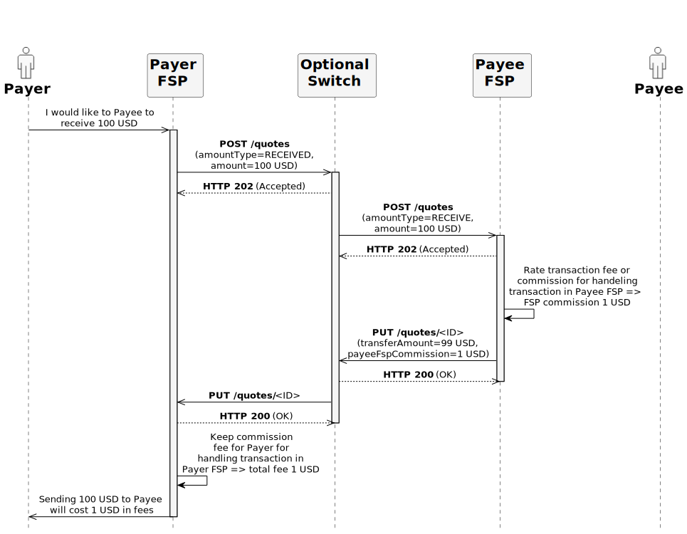

**Figure 8 -- Exemple de montant à recevoir sans divulgation**

###### Figure 9

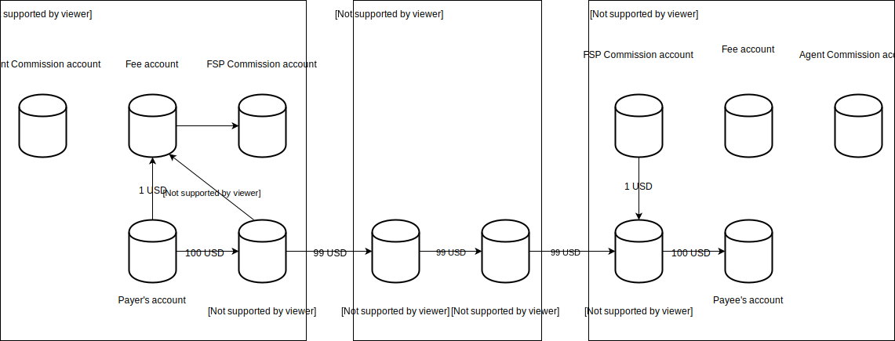

**Figure 9 -- Vue simplifiée du mouvement de fonds pour l’exemple précédent**

Pour calculer l’élément **transferAmount** dans le FSP Bénéficiaire pour un devis à montant à recevoir sans divulgation, appliquer l’équation [Listing 9](#listing-9), où le _Montant de transfert_ correspond à **transferAmount** ([Tableau 24](#table-24)), le _Montant du devis_ à **amount** ([Tableau 23](#table-23)), les _frais FSP Bénéficiaire_ à **payeeFspFee** ([Tableau 24](#table-24)), et la commission FSP Bénéficiaire à **payeeFspCommission** ([Tableau 24](#table-24)).

###### Listing 7

```
Montant de transfert = Montant du devis + Frais FSP Bénéficiaire – Commission FSP Bénéficiaire
```

**Listing 7 -- Relation entre le montant de transfert et le montant du devis pour ce cas**

#### Montant à envoyer sans divulgation

[Figure 10](#figure-10) montre un exemple où le Payeur souhaite envoyer 100 USD. Ici, le FSP Payeur doit déterminer les frais, commissions ou les deux avant d’envoyer le devis, pour que le FSP Bénéficiaire connaisse le montant qui sera reçu. Le montant retiré du compte du Payeur n’est pas communiqué, ni les frais.

Dans cet exemple, le FSP Payeur et le FSP Bénéficiaire veulent chacun 1 USD de frais, donc le Bénéficiaire recevra 98 USD. Le montant reçu peut être indiqué dans la réponse sous l’élément **payeeReceiveAmount**, mais ce n’est pas obligatoire.

###### Figure 10

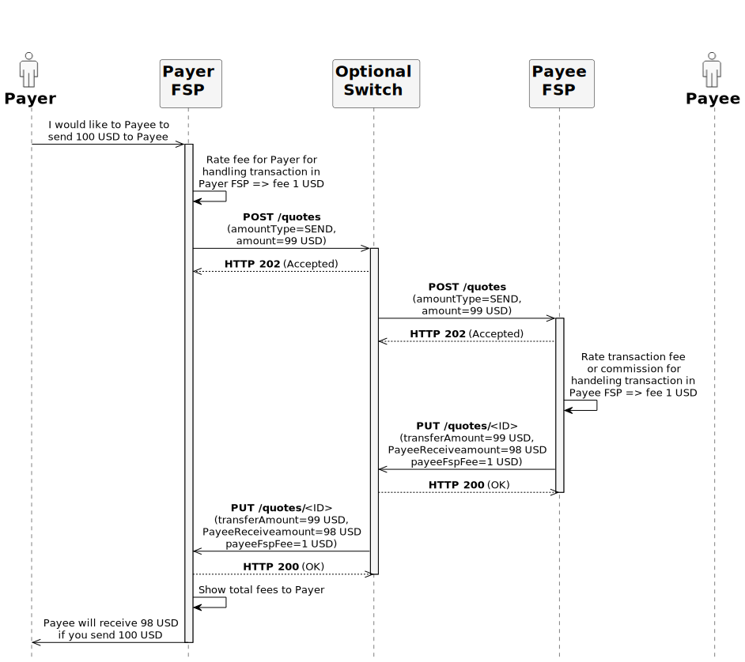

**Figure 10 -- Exemple de montant à envoyer sans divulgation**

###### Figure 11

[Figure 11](#figure-11) : vue simplifiée du mouvement d’argent.


**Figure 11 -- Vue simplifiée du mouvement de fonds pour cet exemple**

Pour calculer **transferAmount**, utiliser l’équation du [Listing 8](#listing-8) : _Montant du transfert_ = **transferAmount** ([Tableau 24](#table-24)), _Montant du devis_ = **amount**, commission = **payeeFspCommission**.

###### Listing 8

```
Montant de transfert = Montant du devis – Commission FSP Bénéficiaire
```

**Listing 8 -- Relation entre le montant de transfert et le montant du devis pour ce cas**

La raison pour laquelle les frais FSP Bénéficiaire sont absents de l’équation : le Payeur veut envoyer un certain montant de son compte, le Bénéficiaire reçoit donc moins au lieu que des frais soient ajoutés au montant.

#### Divulgation des frais

Les paiements de frais et de commissions relatifs à une transaction interopérable lorsque les frais sont divulgués se trouvent en [Figure 12](#figure-12). Ce qui est directement lié à l’API est indiqué en vert. Les frais, bonus, et commissions internes sont en rouge : ils impactent le montant envoyé/reçu mais ne sont pas transmis dans la transaction interopérable. Le montant net reçu par le Bénéficiaire (après frais internes) peut être transmis à titre d’information.

Quand la divulgation des frais est utilisée, la commission envoyée par le FSP Bénéficiaire doit subventionner tout ou partie du coût de la transaction pour le Payeur. Si la commission est supérieure aux frais pour le Payeur, l’excédent doit être traité comme un frais payé du Bénéficiaire au Payeur. Un exemple : [ici](#excess-fsp-commission-example).

###### Figure 12


**Figure 12 -- Frais et commissions liés à l’interopérabilité lorsque les frais
sont divulgués**

Voir [Types de frais](#fee-types) pour plus d'informations.

#### Montant à recevoir avec divulgation

[Figure 13](#figure-13) : le Payeur veut que le Bénéficiaire reçoive 100 USD. Le FSP Payeur doit évaluer la transaction en interne avant d’envoyer la demande de devis, car les frais sont divulgués. Exemple : le FSP Payeur veut 1 USD de frais, le FSP Bénéficiaire attribue 1 USD de commission pour subventionner, rendant la transaction gratuite pour le Payeur.

###### Figure 13

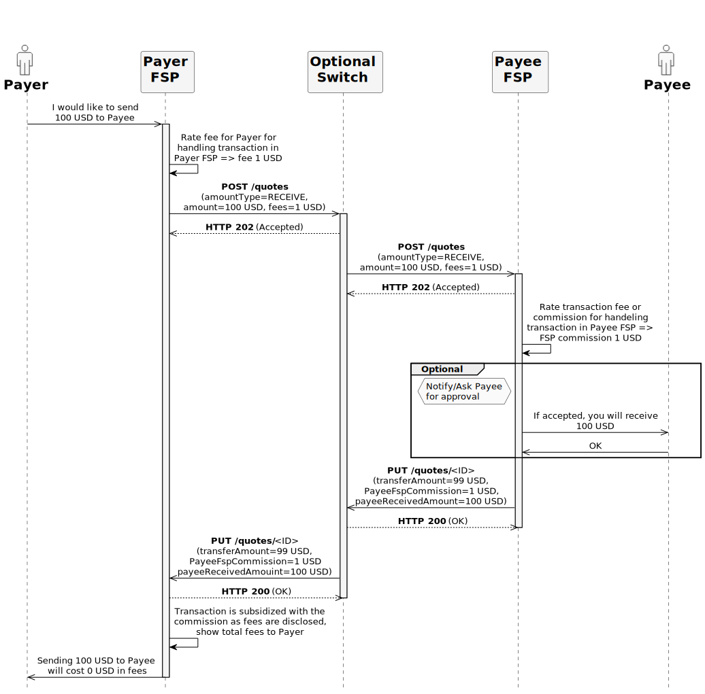

**Figure 13 -- Exemple avec montant à recevoir en divulgation**

[Figure 14](#figure-14) : vue simplifiée.

###### Figure 14

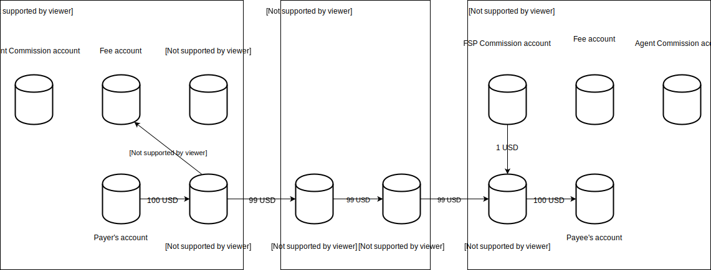

**Figure 14 -- Vue simplifiée du mouvement de fonds**

Pour calculer **transferAmount** côté FSP Bénéficiaire pour ce type de devis, appliquer l'équation du [Listing 9](#listing-9), où _Montant transfert_ = **transferAmount**, _Montant devis_ = **amount**, frais FSP Bénéficiaire = **payeeFspFee**, commission FSP Bénéficiaire = **payeeFspCommission**.

###### Listing 9

```
Montant de transfert = Montant du devis + Frais FSP Bénéficiaire – Commission FSP Bénéficiaire
```

**Listing 9 -- Relation pour ce cas**

#### Montant à envoyer avec divulgation

[Figure 15](#figure-15) : le Payeur souhaite envoyer 100 USD au Bénéficiaire. Les frais doivent être calculés avant la demande de devis, car ils sont divulgués. Exemple : chaque FSP souhaite 1 USD de frais.

###### Figure 15

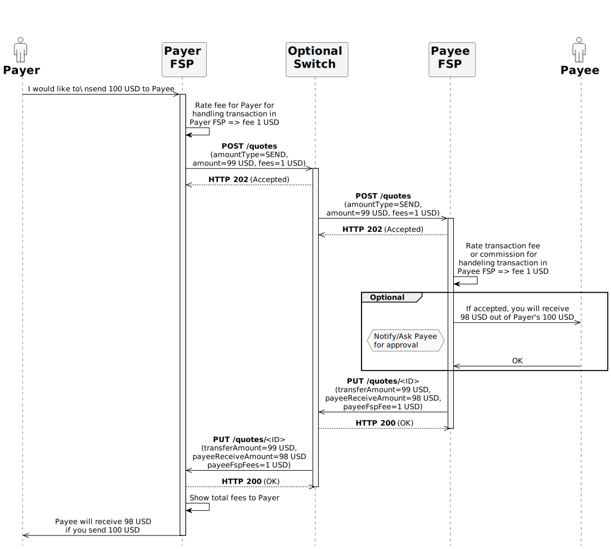

**Figure 15 -- Exemple avec montant à envoyer en divulgation**

###### Figure 16

[Figure 16](#figure-16) : vue simplifiée du mouvement de fonds.

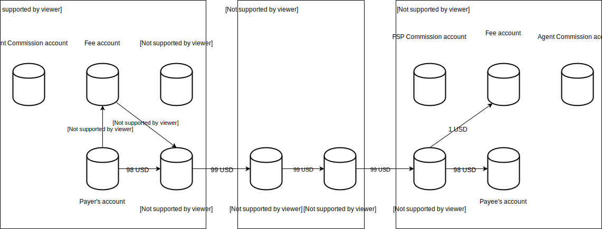

**Figure 16 -- Vue simplifiée pour ce cas**

Pour calculer **transferAmount** (côté FSP Bénéficiaire), l’équation du [Listing 10](#listing-10) doit être utilisée :

###### Listing 10

```
Si (Frais Payeur <= Commission FSP Bénéficiaire)
    Montant de transfert = Montant du devis
Sinon
    Montant de transfert = Montant du devis – (Frais Payeur – Commission FSP Bénéficiaire)
```

**Listing 10 -- Relation pour ce cas**

Les frais FSP Bénéficiaire sont absents : on souhaite envoyer un montant précis, le Bénéficiaire reçoit donc moins, plutôt que d’ajouter les frais « par-dessus ».

#### Exemple d’excédent de commission FSP

[Figure 17](#figure-17) : excédent de commission FSP avec divulgation du montant à envoyer : le Payeur souhaite envoyer 100 USD, le FSP Payeur veut 1 USD de frais, le FSP Bénéficiaire donne 3 USD de commission. Sur les 3 USD, 1 USD couvre les frais Payeur, 2 USD reviennent au FSP Payeur.

###### Figure 17

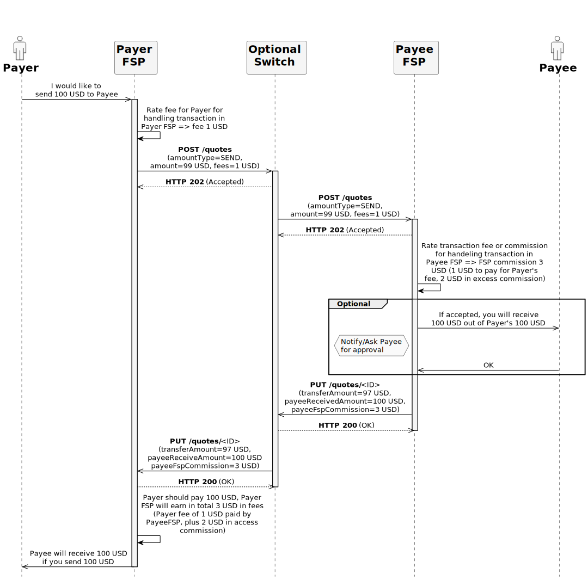

**Figure 17 -- Exemple d’excédent de commission**

###### Figure 18

[Figure 18](#figure-18) : vue simplifiée du mouvement de fonds.

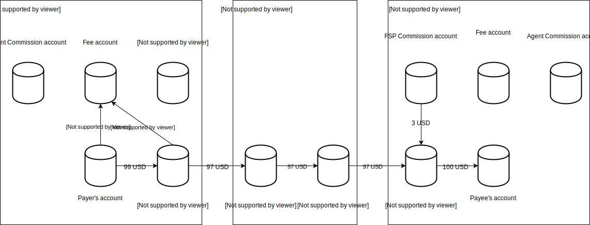

**Figure 18 -- Vue simplifiée pour ce cas**

#### Types de frais

Comme vu en [Figure 7](#figure-7) et [Figure 12](#figure-12), il existe deux types de frais et commissions dans l’objet Quote entre FSP :

1. **Frais FSP Bénéficiaire** : frais de transaction que le FSP Bénéficiaire souhaite obtenir pour la gestion de la transaction.
2. **Commission FSP Bénéficiaire** : commission que le FSP Bénéficiaire veut verser au FSP Payeur (non-divulgation) ou subventionner la transaction en payant à la place du FSP Payeur (divulgation). Si excédent, il est traité comme frais payé du Bénéficiaire vers le Payeur, voir l’exemple d’excès de commission.

<br />

#### Équations de devis

Section contenant des formules utiles pour les devis qui n’ont pas encore été mentionnées.

####  Relation entre montant reçu par le Bénéficiaire et montant de transfert

Le montant que doit recevoir le Bénéficiaire, hors frais internes, bonus ou commission FSP Bénéficiaire, peut être calculé par le FSP Payeur via [Listing 11](#listing-11). _Montant de transfert_ = **transferAmount**, frais FSP Bénéficiaire = **payeeFspFee**, commission = **payeeFspCommission**.

###### Listing 11

```
Montant reçu Bénéficiaire = Montant de transfert - Frais FSP Bénéficiaire + Commission FSP Bénéficiaire
```

**Listing 11 -- Relation entre montant de transfert et montant reçu**

Le montant reçu peut optionnellement être transmis lors du retour du devis sous **payeeReceiveAmount**.

<br />

#### Informations fiscales

Aucune information de taxe n’est transmise via l’API (toute la fiscalité est considérée comme interne). Les sections suivantes détaillent les cas les plus courants.

##### Taxe sur la commission des agents

Taxe sur la commission d’un agent (en tant que revenu). C’est l’agent ou son FSP qui gère la relation avec l’administration fiscale, selon le cas. Toutes les commissions agent étant internes, rien n’est transmis dans l’API.

##### Taxe sur les frais internes FSP

Un FSP peut être taxé sur certains frais internes reçus : ex : frais Payeur vers son FSP, ou frais Bénéficiaire vers son FSP. Cette taxe doit être gérée et collectée en interne par le FSP concerné.

##### Taxe sur le montant (TVA, taxe de vente, ... )

La TVA ou les taxes de vente sont des taxes sur un montant, typiquement supportées par le consommateur lors d’un achat marchand. Le marchand collecte la taxe et reverse à l’administration. Si la TVA s’applique, elle doit être incluse dans la somme demandée au client, et le montant reçu par le FSP Bénéficiaire est taxé en conséquence.

##### Taxe sur frais FSP

Dans l’API, un FSP Bénéficiaire peut ajouter un frais à payer par le Payeur ou son FSP. Il doit gérer la fiscalité conformément à la pratique locale, en interne et sans transmettre de détail via l’API.

##### Taxe sur la commission FSP

Un FSP Bénéficiaire peut ajouter une commission, soit pour subventionner la transaction (divulgation), soit pour inciter le FSP Payeur (non-divulgation).

###### Non-divulgation des frais

Dans ce cas, toute commission FSP Bénéficiaire doit être considérée comme un frais reçu par le FSP Payeur. La taxe correspondante est gérée en interne comme tout frais reçu.

###### Divulgation des frais

Si le montant de commission est inférieur ou égal aux frais à la charge du Payeur, la commission sert à couvrir ces frais. Si elle les dépasse, l’excédent est traité comme dans la non-divulgation.

<br />

#### Exemples pour chaque cas d’usage

Cette section présente un ou plusieurs exemples pour chaque cas.

#### Virement P2P

Un virement P2P est typiquement un montant à recevoir, sans aucune divulgation de frais côté Bénéficiaire ([Figure 19](#figure-19)). Ex : le Payeur veut que le Bénéficiaire reçoive 100 USD. Le FSP Bénéficiaire offre une commission au FSP Payeur. Le FSP Payeur prend 1 USD de frais à son client : il gagne donc 2 USD (1 USD venant du client, 1 USD en commission). 99 USD sont transférés après déduction de la commission.

###### Figure 19

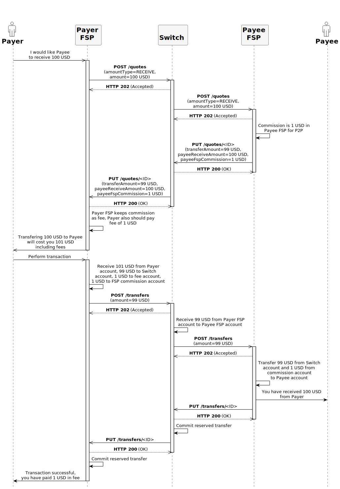

**Figure 19 -- Exemple virement P2P avec montant à recevoir**

###### Vue simplifiée du mouvement de fonds

###### Figure 20

Voir [Figure 20](#figure-20) pour une vue très simplifiée du mouvement.


**Figure 20 -- Vue simplifiée virement P2P**

##### Dépôt d’espèces initié par l’agent (Montant à envoyer)

[Figure 21](#figure-21) : dépôt avec divulgation des frais. Le Bénéficiaire veut savoir les frais avant d’accepter l’opération. Exemple : le client souhaite déposer 100 USD chez un agent du FSP Payeur. Celui-ci prend 2 USD de frais, le FSP Bénéficiaire subventionne la transaction avec 2 USD de commission pour couvrir ces frais. 98 USD sont transférés après déduction de la commission.

###### Figure 21

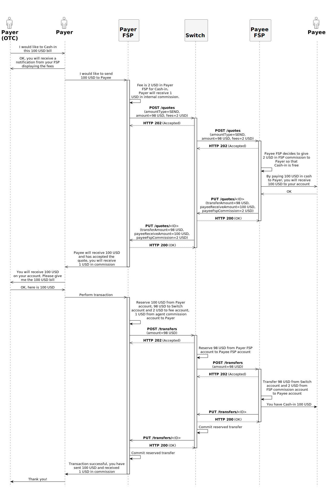

**Figure 21 -- Exemple dépôt agent, montant à envoyer**

###### Vue simplifiée

Voir [Figure 22](#figure-22).

###### Figure 22

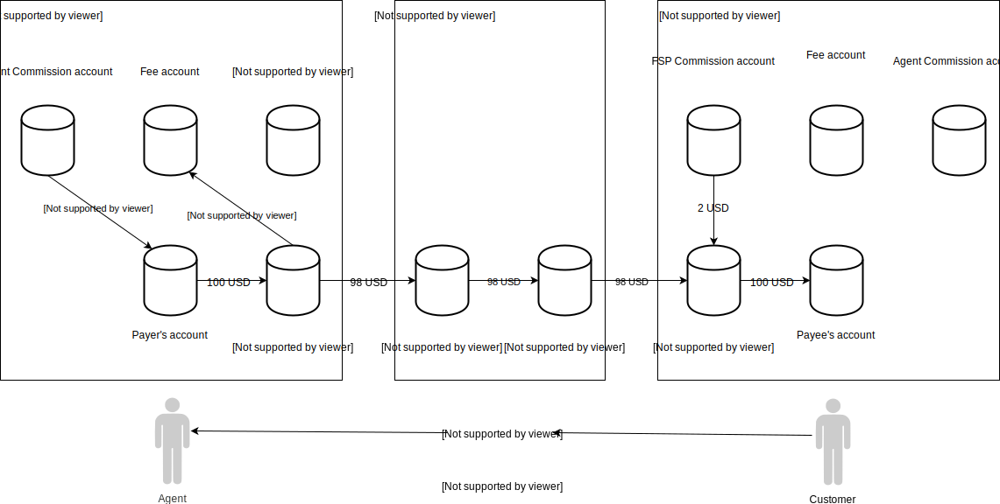

**Figure 22 -- Vue simplifiée dépôt agent**

##### Dépôt d’espèces initié par l’agent (Montant à recevoir)

[Figure 23](#figure-23) : dépôt avec divulgation des frais, client souhaite recevoir exactement 100 USD. Le FSP Payeur souhaite 2 USD de frais pour la commission agent ; le FSP Bénéficiaire subventionne 1 USD en commission (50 % des frais). 99 USD transférés après déduction de la commission.

###### Figure 23

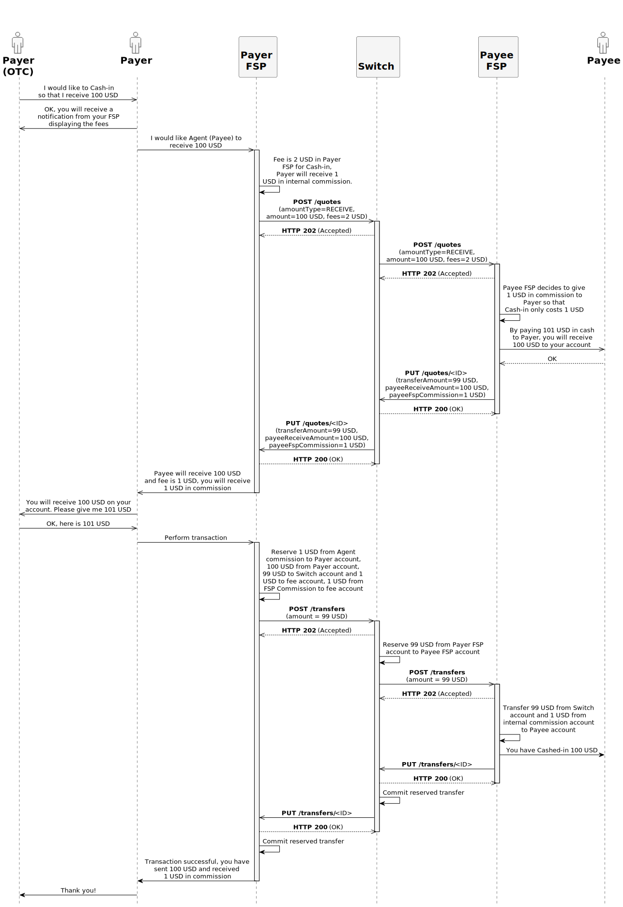

**Figure 23 -- Exemple dépôt agent, montant à recevoir**

###### Vue simplifiée

###### Figure 24

Voir [Figure 24](#figure-24).

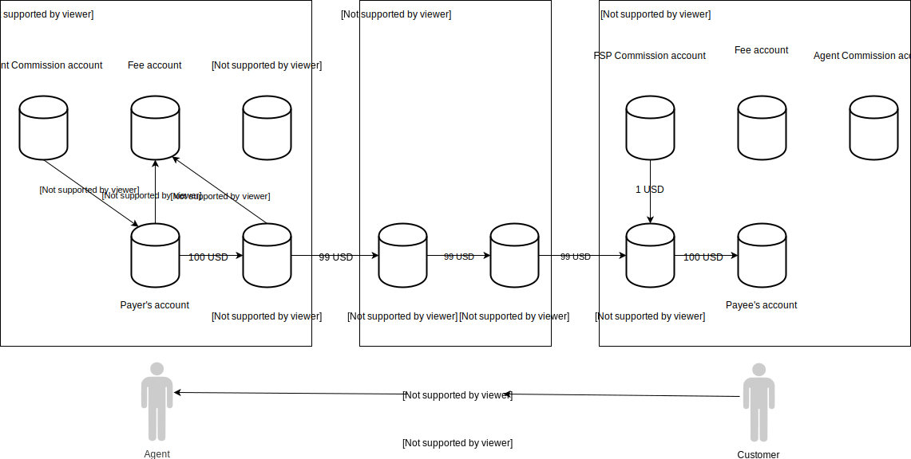

**Figure 24 -- Vue simplifiée dépôt agent montant à recevoir**

##### Paiement marchand initié par le client

Typiquement un montant à recevoir sans divulgation des frais. Ex : achat de biens/ services pour 100 USD auprès d’un marchand dans le FSP Bénéficiaire. Le FSP Bénéficiaire ne facture pas le client mais prend un frais caché d’1 USD au marchand. Le FSP Payeur prélève 1 USD au client. 100 USD sont transférés.

###### Figure 25

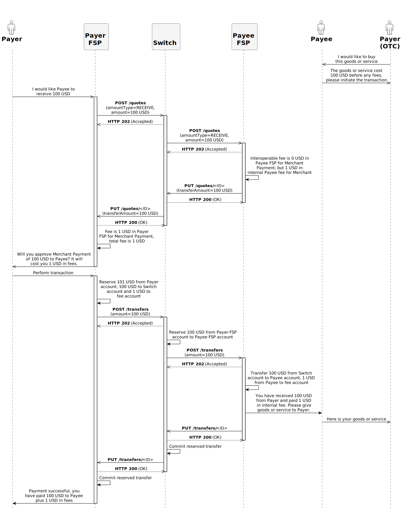

**Figure 25 -- Exemple paiement marchand client**

###### Vue simplifiée

Voir [Figure 26](#figure-26).

###### Figure 26

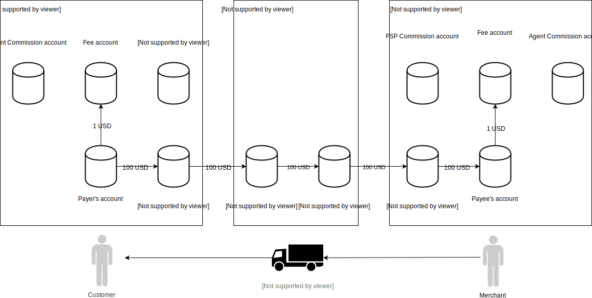

**Figure 26 -- Vue simplifiée paiement marchand client**

##### Retrait d’espèces initié par le client (Montant à recevoir)

Typiquement, montant à recevoir sans divulgation des frais. Ex : le client veut retirer 100 USD en espèces. Le FSP Bénéficiaire prend 2 USD de frais (commission agent), le FSP Payeur prend 1 USD. 102 USD transférés.

###### Figure 27

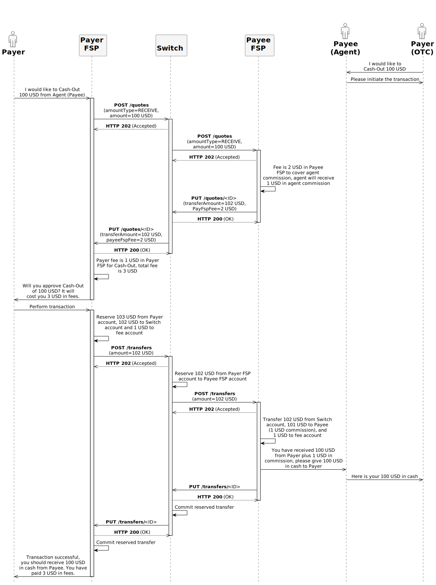

**Figure 27 -- Exemple retrait client (montant à recevoir)**

###### Vue simplifiée

Voir [Figure 28](#figure-28).

###### Figure 28

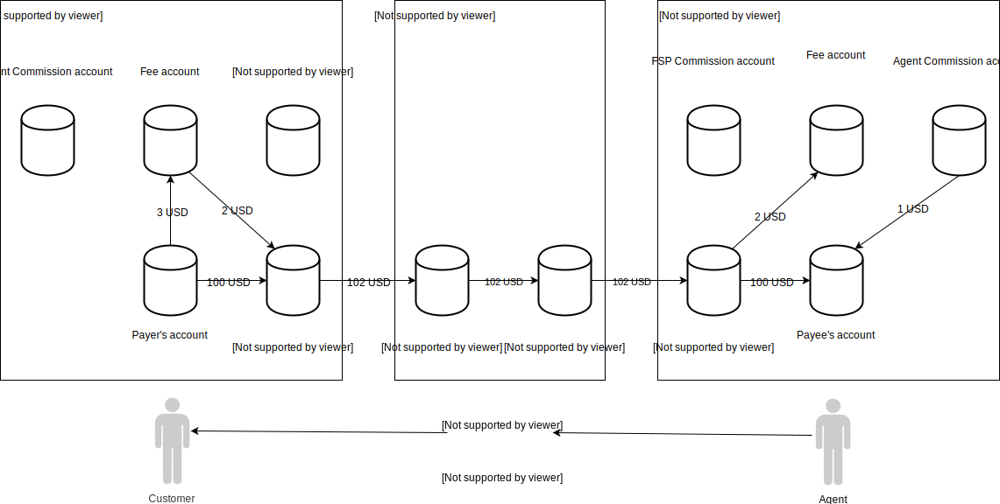

**Figure 28 -- Vue simplifiée retrait client (montant à recevoir)**

##### Retrait d’espèces initié par le client (Montant à envoyer)

Normalement, typiquement montant à recevoir, mais ici exemple avec montant à envoyer : voir [Figure 29](#figure-29). Le client veut retirer 100 USD de son compte. Le FSP Bénéficiaire prend 2 USD (commission agent), le FSP Payeur prend 1 USD. 99 USD transférés.

###### Figure 29

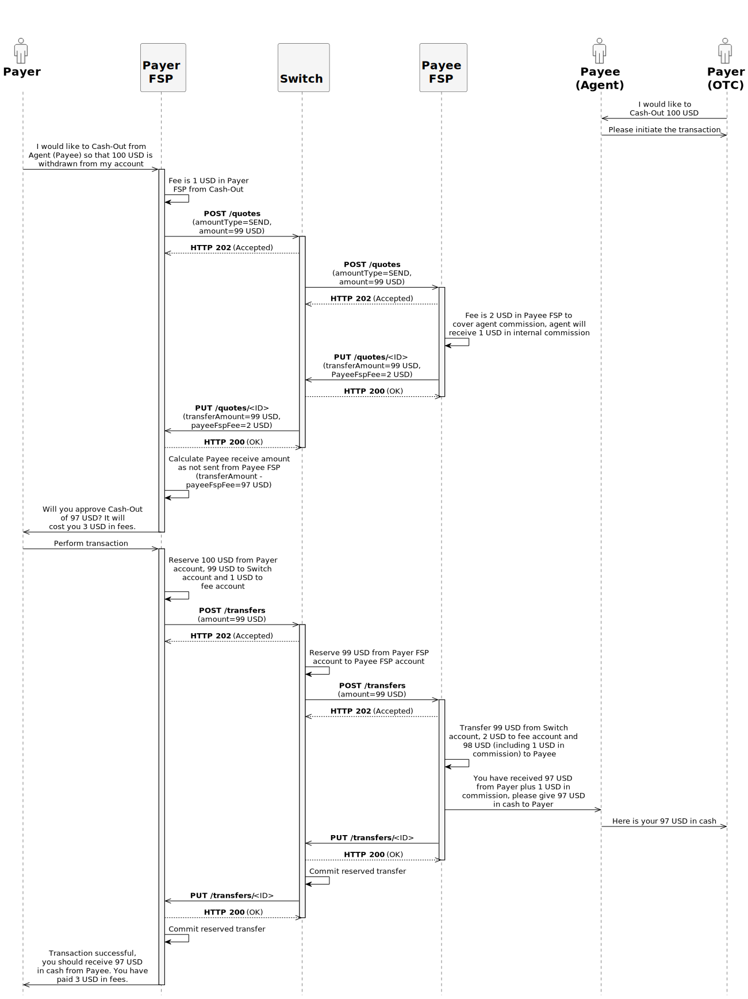

**Figure 29 -- Exemple retrait client (montant à envoyer)**

###### Vue simplifiée

Voir [Figure 30](#figure-30).

###### Figure 30


**Figure 30 -- Vue simplifiée retrait client (montant à envoyer)**

#### Retrait initié par agent

Montant à recevoir, pas de divulgation des frais côté FSP Payeur. Ex : le client veut recevoir 100 USD en liquide. Frais : 2 USD côté FSP Bénéficiaire ; 1 USD côté FSP Payeur. 102 USD transférés.

###### Figure 31

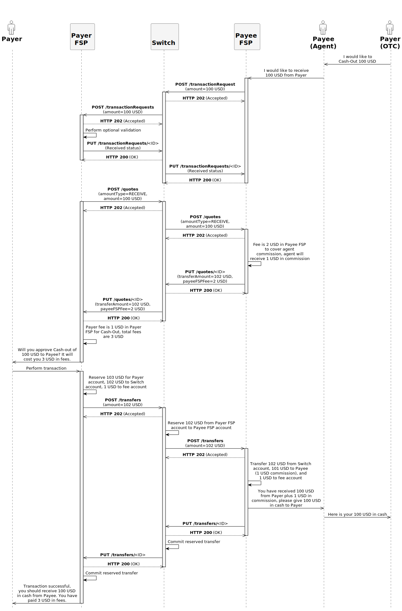

**Figure 31 -- Exemple retrait agent**

###### Vue simplifiée

Voir [Figure 32](#figure-32).

###### Figure 32


**Figure 32 -- Vue simplifiée retrait agent**

##### Paiement marchand initié par le marchand

Montant à recevoir, pas de divulgation des frais. Ex : achat de 100 USD, aucun frais Bénéficiaire, mais 1 USD de frais côté Payeur. 100 USD transférés.

###### Figure 33

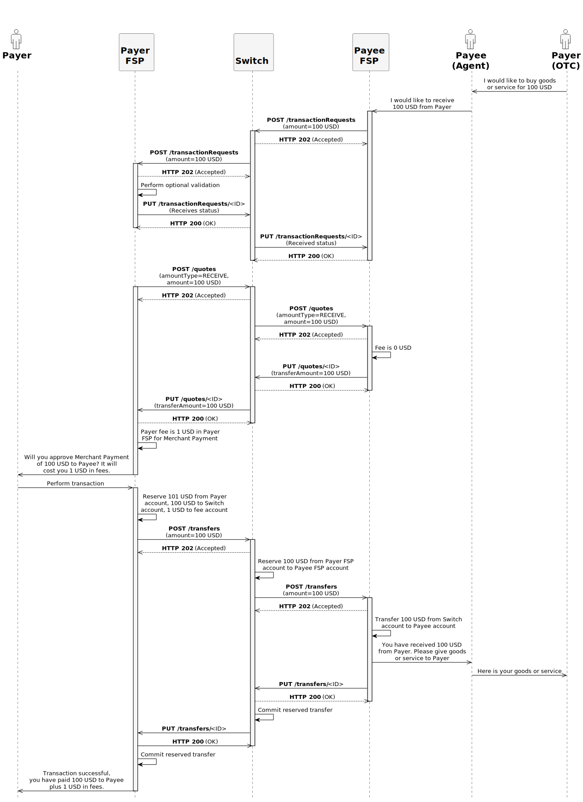

**Figure 33 -- Exemple paiement marchand initié par marchand**

###### Vue simplifiée

Voir [Figure 34](#figure-34).

###### Figure 34

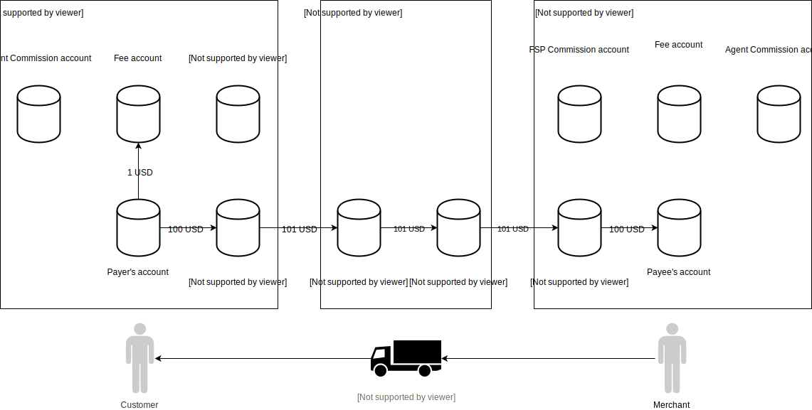

**Figure 34 -- Vue simplifiée paiement marchand initié par marchand**

##### Retrait initié par ATM

Montant à recevoir, pas de divulgation. Ex : retrait de 100 USD en espèces, 1 USD de frais côté FSP Bénéficiaire (frais ATM), 1 USD côté FSP Payeur. 101 USD transférés.

###### Figure 35

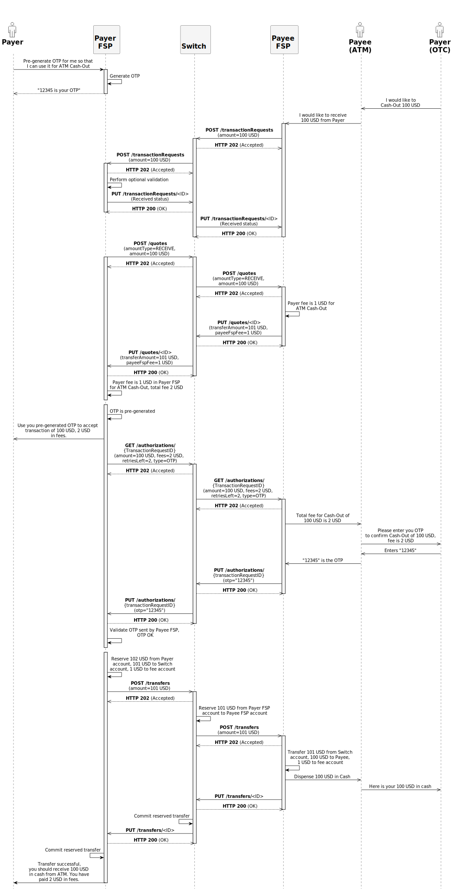

**Figure 35 -- Exemple retrait ATM**

###### Vue simplifiée

Voir [Figure 36](#figure-36).

###### Figure 36

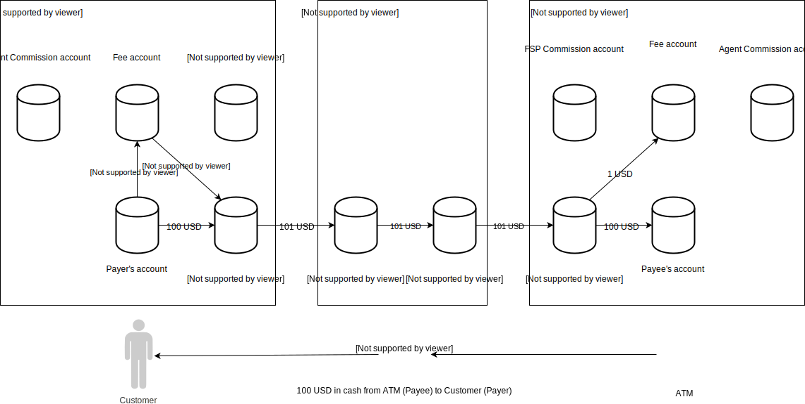

**Figure 36 -- Vue simplifiée retrait ATM**

##### Paiement marchand initié par le marchand autorisé sur un TPE

Montant à recevoir, pas de divulgation des frais. Ex : achat de 100 USD, le FSP Bénéficiaire accorde 1 USD de commission, le FSP Payeur l’utilise comme frais. 100 USD transférés.

###### Figure 37

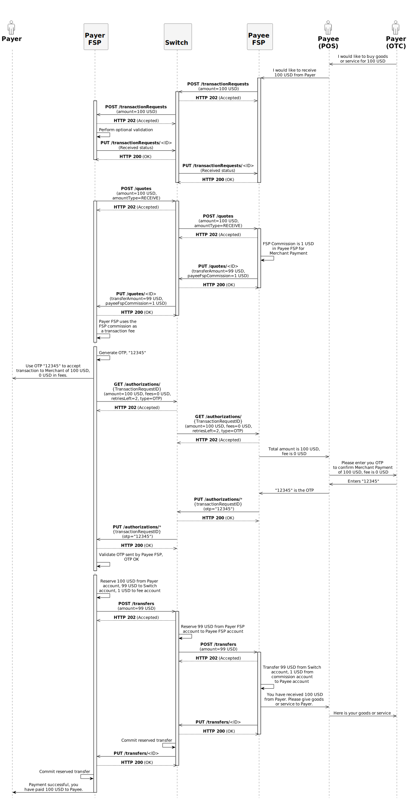

**Figure 37 -- Exemple paiement marchand sur TPE**

###### Vue simplifiée

Voir [Figure 38](#figure-38).

###### Figure 38

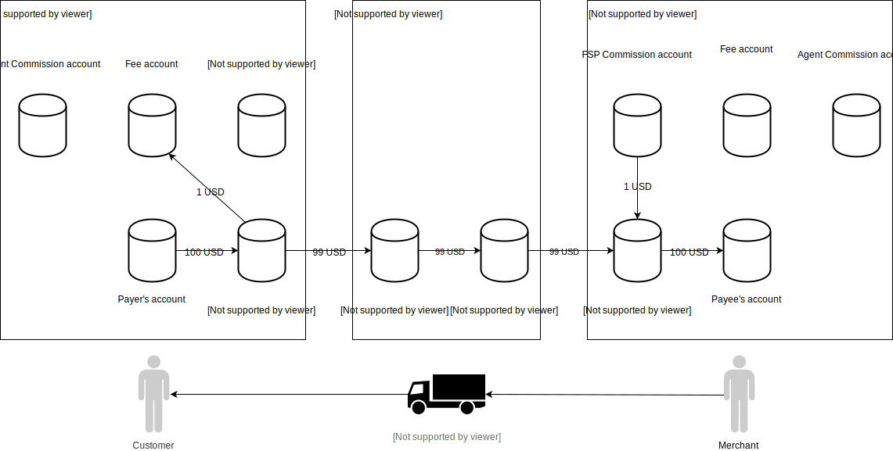

**Figure 38 -- Vue simplifiée paiement marchand sur TPE**

##### Remboursement

[Figure 39](#figure-39) présente un exemple de remboursement du montant entier d’un dépôt d’espèces (voir exemple plus haut).

###### Figure 39

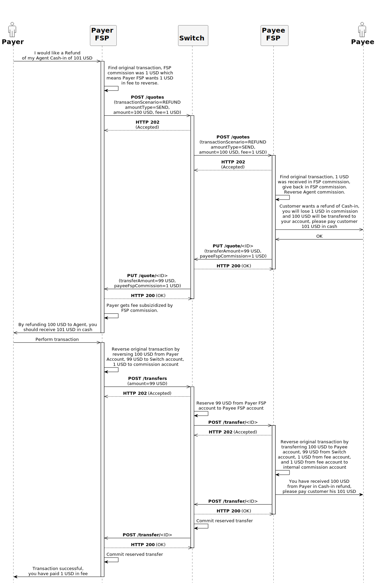

**Figure 39 -- Exemple de remboursement**

#### 5.1.6.11.1 Vue simplifiée du mouvement de fonds

Voir [Figure 40](#figure-40).

###### Figure 40

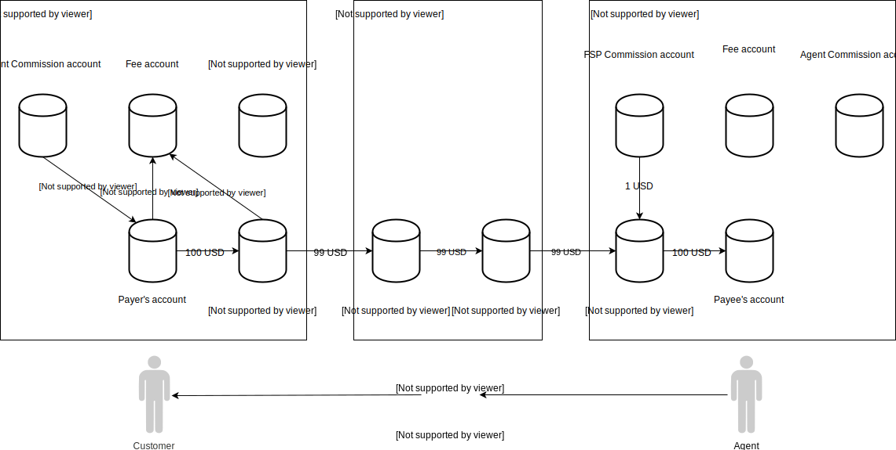

**Figure 40 -- Vue simplifiée du remboursement**

<br />

### Adressage des Parties

Les deux parties d’une transaction financière (le `Payeur` et le `Bénéficiaire`) sont identifiées dans l’API par un _Type d’ID de Partie_ ([**PartyIdType**](#partyidtype-element)), un _ID de Partie_ ([**PartyIdentifier**](#partyidentifier-element)), et, éventuellement, un _Sous-ID ou Type de Partie_ ([PartySubIdOrType](#partysubidortype-element)). Certains sous-types sont prévus en standard pour des identifiants personnels ([PersonalIdentifierType](#personalidentifiertype-enum)), par ex. pour le numéro de passeport ou le permis de conduire.

Exemples de base d’utilisation des éléments _Party ID Type_ et _Party ID_ :

- Pour utiliser le numéro de téléphone mobile **+123456789** comme contrepartie, mettre *Party ID Type* à **MSISDN** et _Party ID_ à **+123456789**.
  - Exemple de service pour obtenir le FSP :
        
        **GET /participants/MSISDN/+123456789**

- Pour utiliser l'adresse email **john\@doe.com**, mettre _Party ID Type_ à **EMAIL** et _Party ID_ à **john\@doe.com**.
  - Exemple :

        **GET /participants/EMAIL/john\@doe.com**

- Pour utiliser l’IBAN **SE45 5000 0000 0583 9825 7466** : _Party ID Type_ = **IBAN**, _Party ID_ = **SE4550000000058398257466** (sans espaces).
  - Exemple :

        **GET /participants/IBAN/SE4550000000058398257466**

Exemples avancés :

- Pour une personne dont le numéro de passeport est **12345678** : _Party ID Type_ = **PERSONAL_ID**, _Party ID_ = **12345678**, _Party Sub ID or Type_ = **PASSPORT**.
  - Exemple :

        **GET /participants/PERSONAL_ID/123456789/PASSPORT**

- Pour **employeeId1** travaillant chez **Shoe-company** : _Party ID Type_ = **BUSINESS**, _Party ID_ = **Shoe-company**, _Party Sub ID or Type_ = **employeeId1**
  - Exemple :

        **GET /participants/BUSINESS/Shoe-company/employeeId1**

**5.2.1 Caractères interdits dans Party ID et Party Sub ID or Type**

Le _Party ID_ et _Party Sub ID or Type_ font partie de l’URI (voir [Syntaxe URI](#uri-syntax)), donc certaines restrictions existent :

- Barre oblique (**/**) interdite (utilisée dans le [Path](#path) pour la séparation).
- Point d’interrogation (**?**) interdit (identifie la [Query](#query) dans l’URI).

<br />

### Correspondance des cas d’usage et des types de transaction

Cette section décrit comment mapper les cas d’usage non-bulk actuellement supportés dans l’API vers le type complexe [**TransactionType**](#transactiontype)), en utilisant les éléments [TransactionScenario](#transactionscenario)), et [TransactionInitiator](#transactioninitiator)).

Plus de détails dans _Cas d’usage de l’API_.

#### Virement P2P

Pour effectuer un virement P2P :

- [**TransactionScenario**](#transactionscenario) = **TRANSFER**
- [**TransactionInitiator**](#transactioninitiator) = **PAYER**
- [**TransactionInitiatorType**](#transactioninitiatortype) = **CONSUMER**

#### Dépôt d’espèces initié par agent

- [**TransactionScenario**](#transactionscenario) = **DEPOSIT**
- [**TransactionInitiator**](#transactioninitiator) = **PAYER**
- [**TransactionInitiatorType**](#transactioninitiatortype) = **AGENT**

#### Retrait d’espèces initié par agent

- [**TransactionScenario**](#transactionscenario) = **WITHDRAWAL**
- [**TransactionInitiator**](#transactioninitiator) = **PAYEE**
- [**TransactionInitiatorType**](#transactioninitiatortype) = **AGENT**

#### Retrait d’espèces par agent sur TPE

- [**TransactionScenario**](#transactionscenario) = **WITHDRAWAL**
- [**TransactionInitiator**](#transactioninitiator) = **PAYEE**
- [**TransactionInitiatorType**](#transactioninitiatortype) = **AGENT**

#### Retrait d’espèces initié par client

- [**TransactionScenario**](#transactionscenario) = **WITHDRAWAL**
- [**TransactionInitiator**](#transactioninitiator) = **PAYER**
- [**TransactionInitiatorType**](#transactioninitiatortype) = **CONSUMER**

#### Paiement marchand initié par client

- [**TransactionScenario**](#transactionscenario) = **PAYMENT**
- [**TransactionInitiator**](#transactioninitiator) = **PAYER**
- [**TransactionInitiatorType**](#transactioninitiatortype) = **CONSUMER**

#### Paiement marchand initié par marchand

- [**TransactionScenario**](#transactionscenario) = **PAYMENT**
- [**TransactionInitiator**](#transactioninitiator) = **PAYEE**
- [**TransactionInitiatorType**](#transactioninitiatortype) = **BUSINESS**

#### Paiement marchand initié par marchand sur TPE

- [**TransactionScenario**](#transactionscenario) = **PAYMENT**
- [**TransactionInitiator**](#transactioninitiator) = **PAYEE**
- [**TransactionInitiatorType**](#transactioninitiatortype) = **DEVICE**

#### Retrait initié par ATM

- [**TransactionScenario**](#transactionscenario) = **WITHDRAWAL**
- [**TransactionInitiator**](#transactioninitiator) = **PAYEE**
- [**TransactionInitiatorType**](#transactioninitiatortype) = **DEVICE**

#### Remboursement

Pour effectuer un remboursement, configurez les éléments comme suit :

- [**TransactionScenario**](#transactionscenario) à **REFUND**
- [**TransactionInitiator**](#transactioninitiator) à **PAYER**
- [**TransactionInitiatorType**](#transactioninitiatortype) dépend de l’initiateur du remboursement.

De plus, le type complexe [Refund](#refund) doit être renseigné avec l’identifiant de la transaction d’origine à rembourser.

<br />

## Services de l’API

Cette section présente et détaille tous les services que l’API prend en charge pour chaque ressource et méthode HTTP. Chaque ressource et service de l’API est également mappé à une ressource et un service logique décrits dans les [Modèles génériques de transaction](../generic-transaction-patterns).

### Services API de haut niveau

À un niveau élevé, l’API peut être utilisée pour réaliser les actions suivantes :

- **Recherche d’informations sur un participant** — Déterminer dans quel FSP se situe la contrepartie d’une transaction financière.
   - Utilisez les services fournis par la ressource API **/participants**.

- **Recherche d’informations sur une partie** — Obtenir des informations sur la contrepartie d’une transaction financière.
   - Utilisez les services fournis par la ressource API **/parties**.

- **Demande de transaction** — Demander à un payeur de transférer des fonds électroniques au bénéficiaire, à la demande du bénéficiaire. Le payeur peut approuver ou refuser la demande. Une approbation initiera effectivement la transaction financière.
   - Utilisez les services fournis par la ressource API **/transactionRequests**.

- **Calculer une cotation** — Calculer tous les éléments d’une transaction qui influenceront le montant de la transaction, c’est-à-dire les frais et la commission du FSP.
   - Utilisez les services fournis par la ressource API **/quotes** pour la cotation d’une transaction individuelle (un payeur vers un bénéficiaire).
   - Utilisez les services fournis par la ressource API **/bulkQuotes** pour la cotation d’une transaction groupée (un payeur vers plusieurs bénéficiaires).

- **Réaliser une autorisation** — Demander au payeur de saisir les identifiants requis lorsqu’il a initié la transaction depuis un terminal de paiement, un DAB, ou un appareil similaire dans le système FSP du bénéficiaire.
   - Utilisez les services fournis par la ressource API **/authorizations**.

- **Effectuer un transfert** — Réaliser effectivement la transaction financière en transférant les fonds électroniques du payeur au bénéficiaire, éventuellement via des registres intermédiaires.
   - Utilisez les services fournis par la ressource API **/transfers** pour une transaction unique (un payeur vers un bénéficiaire).
   - Utilisez les services fournis par la ressource API **/bulkTransfers** pour une transaction groupée (un payeur vers plusieurs bénéficiaires).

- **Récupérer les informations de transaction** — Obtenir les informations relatives à la transaction financière ; par exemple, un jeton créé en cas de transaction réussie.
   - Utilisez les services fournis par la ressource API **/transactions**.

#### Services API pris en charge

[Tableau 6](#table-6) inclut des descriptions de haut niveau des services que l’API propose. Pour plus d’informations détaillées, consultez les sections suivantes.

###### Tableau 6

|URI|Méthode HTTP GET|Méthode HTTP PUT|Méthode HTTP POST|Méthode HTTP DELETE|Méthode HTTP PATCH|
|---|---|---|---|---|---|
|**/participants**|Non pris en charge|Non pris en charge|Demande à un ALS de créer les informations FSP concernant les parties fournies dans le corps ou, si l'information existe déjà, demande à l’ALS de la mettre à jour|Non pris en charge|Non pris en charge|
|**/participants/**_{ID}_|Non pris en charge|Callback pour informer un FSP pair d’une liste de parties précédemment créée.|Non pris en charge|Non pris en charge|Non pris en charge|
|**/participants/**_{Type}_/_{ID}_ Alternative : **/participants/**_{Type}_/_{ID}_/_{SubId}_|Obtenir les informations FSP concernant une partie depuis un FSP pair ou un ALS.|Callback pour informer un FSP pair des informations FSP demandées ou créées.|Demander à un ALS de créer une information FSP concernant une partie ou, si elle existe déjà, de la mettre à jour|Demander à un ALS de supprimer les informations FSP concernant une partie.|Non pris en charge|
|**/parties/**_{Type}_/_{ID}_ Alternative : **/parties/**_{Type}_/_{ID}_/_{SubId}_|Obtenir des informations concernant une partie depuis un FSP pair.|Callback pour informer un FSP pair des informations demandées sur la partie.|Non pris en charge|Non pris en charge|Non pris en charge|
|**/transactionRequests**|Non pris en charge|Non pris en charge|Demander à un FSP pair de solliciter l’approbation d’un payeur pour transférer des fonds à un bénéficiaire. Le payeur peut approuver ou refuser la demande.|Non pris en charge|Non pris en charge|
|**/transactionRequests/**_{ID}_|Obtenir des informations concernant une demande de transaction déjà envoyée.|Callback pour informer un FSP pair d’une demande de transaction déjà envoyée.|Non pris en charge|Non pris en charge|Non pris en charge|
|**/quotes**|Non pris en charge|Non pris en charge|Demander à un FSP pair de créer une nouvelle cotation pour réaliser une transaction.|Non pris en charge|Non pris en charge|
|**/quotes/**_{ID}_|Obtenir des informations concernant une cotation déjà demandée.|Callback pour informer un FSP pair d’une cotation demandée précédemment.|Non pris en charge|Non pris en charge|Non pris en charge|
|**/authorizations/**_{ID}_|Obtenir l’autorisation pour une transaction du payeur qui interagit avec le système FSP du bénéficiaire.|Callback pour informer le FSP payeur concernant les informations d’autorisation.|Non pris en charge|Non pris en charge|Non pris en charge|
|**/transfers**|Non pris en charge|Non pris en charge|Demander à un FSP pair d’effectuer le transfert des fonds liés à une transaction.|Non pris en charge|Non pris en charge|
|**/transfers/**_{ID}_|Obtenir des informations concernant un transfert déjà effectué.|Callback pour informer un FSP pair d’un transfert déjà effectué.|Non pris en charge|Non pris en charge|Notification d’engagement au FSP bénéficiaire|
|**/transactions/**_{ID}_|Obtenir des informations concernant une transaction déjà réalisée.|Callback pour informer un FSP pair d’une transaction déjà réalisée.|Non pris en charge|Non pris en charge|Non pris en charge|
|**/bulkQuotes**|Non pris en charge|Non pris en charge|Demander à un FSP pair de créer une nouvelle cotation pour effectuer une transaction groupée.|Non pris en charge|Non pris en charge|
|**/bulkQuotes/**_{ID}_|Obtenir des informations concernant une cotation groupée déjà demandée.|Callback pour informer un FSP pair d’une cotation groupée déjà demandée.|Non pris en charge|Non pris en charge|Non pris en charge|
|**/bulkTransfers**|Non pris en charge|Non pris en charge|Demander à un FSP pair de créer un transfert groupé.|Non pris en charge|Non pris en charge|
|**/bulkTransfers/**_{ID}_|Obtenir des informations concernant un transfert groupé déjà envoyé.|Callback pour informer un FSP pair d’un transfert groupé déjà envoyé.|Non pris en charge|Non pris en charge|Non pris en charge|

**Tableau 6 – Services fournis par l’API**

#### Versions actuelles des ressources

[Tableau 7](#table-7) contient la version de chaque ressource décrite dans ce document.

###### Tableau 7

|Ressource|Version actuelle|Dernière modification|
|---|---|---|
|/participants|1.1|Le modèle de données a été mis à jour pour ajouter un élément ExtensionList optionnel au type complexe PartyIdInfo selon la Change Request : https://github.com/mojaloop/mojaloop-specification/issues/30. À la suite de cela, le modèle de données décrit dans le Tableau 93 a été mis à jour.|
|/parties|1.1|Le modèle de données a été mis à jour pour ajouter un élément ExtensionList optionnel au type complexe PartyIdInfo selon la Change Request : https://github.com/mojaloop/mojaloop-specification/issues/30. À la suite de cela, le modèle de données décrit dans le Tableau 93 a été mis à jour.|
|/transactionRequests|1.1|Le modèle de données a été mis à jour pour ajouter un élément ExtensionList optionnel au type complexe PartyIdInfo selon la Change Request : https://github.com/mojaloop/mojaloop-specification/issues/30. À la suite de cela, le modèle de données décrit dans le Tableau 93 a été mis à jour.|
|/quotes|1.1|Le modèle de données a été mis à jour pour ajouter un élément ExtensionList optionnel au type complexe PartyIdInfo selon la Change Request : https://github.com/mojaloop/mojaloop-specification/issues/30. À la suite de cela, le modèle de données décrit dans le Tableau 93 a été mis à jour.|
|/authorizations|1.0|Le modèle de données a été mis à jour pour ajouter un élément ExtensionList optionnel au type complexe PartyIdInfo selon la Change Request : https://github.com/mojaloop/mojaloop-specification/issues/30. À la suite de cela, le modèle de données décrit dans le Tableau 93 a été mis à jour.|
|/transfers|1.1|Ajout d’une possible notification de validation via PATCH /transfers/`<ID>`. Le processus d’utilisation des notifications de validation est décrit à la section 6.7.2.6. Le modèle de données a été mis à jour pour ajouter un élément ExtensionList optionnel au type complexe PartyIdInfo selon la Change Request : https://github.com/mojaloop/mojaloop-specification/issues/30. À la suite de cela, le modèle de données décrit dans le Tableau 93 a été mis à jour.|
|/transactions|1.0|Le modèle de données a été mis à jour pour ajouter un élément ExtensionList optionnel au type complexe PartyIdInfo selon la Change Request : https://github.com/mojaloop/mojaloop-specification/issues/30. À la suite de cela, le modèle de données décrit dans le Tableau 93 a été mis à jour.|
|/bulkQuotes|1.1|Le modèle de données a été mis à jour pour ajouter un élément ExtensionList optionnel au type complexe PartyIdInfo selon la Change Request : https://github.com/mojaloop/mojaloop-specification/issues/30. À la suite de cela, le modèle de données décrit dans le Tableau 93 a été mis à jour.|
|/bulkTransfers|1.1|Le modèle de données a été mis à jour pour ajouter un élément ExtensionList optionnel au type complexe PartyIdInfo selon la Change Request : https://github.com/mojaloop/mojaloop-specification/issues/30. À la suite de cela, le modèle de données décrit dans le Tableau 93 a été mis à jour.|

**Tableau 7 – Versions actuelles des ressources**

<br />

### Ressource API /participants

Cette section définit la ressource API logique **Participants**, décrite dans les [Modèles génériques de transaction](../generic-transaction-patterns#api-resource-participants).

Les services fournis par la ressource **/participants** servent principalement à déterminer dans quel FSP se trouve la contrepartie d’une transaction financière. Selon le schéma, ces services doivent être pris en charge, au minimum, soit par les FSP individuels soit par un service commun.

Si un service commun (par exemple, un ALS) est pris en charge dans le schéma, les services de la ressource **/participants** peuvent aussi être utilisés par les FSP pour ajouter et supprimer des informations dans ce système.

#### Historique des versions de la ressource

[Tableau 8](#table-8) fournit une description de chaque version différente de la ressource **/participants**.

###### Tableau 8

|Version|Date|Description|
|---|---|---|
|1.0|2018-03-13|Version initiale|
|1.1|2020-05-19|Le modèle de données a été mis à jour pour ajouter un élément ExtensionList optionnel au type complexe PartyIdInfo selon la Change Request : https://github.com/mojaloop/mojaloop-specification/issues/30. À la suite de cela, le modèle de données décrit dans le Tableau 93 a été mis à jour.
Pour garantir la cohérence, le modèle de données pour les appels **POST /participants/**_{Type}/{ID}_ et **POST /participants/**_{Type}/{ID}/{SubId}_ du Tableau 10 a également été mis à jour pour inclure l’élément ExtensionList optionnel.|

**Tableau 8 – Historique des versions pour la ressource /participants**

#### Détails des services

Différents modèles sont utilisés pour la recherche de compte, selon qu’un ALS existe ou non. Les sections suivantes décrivent chaque modèle à tour de rôle.

#### Système sans service commun de recherche de comptes

[Figure 41](#figure-41) montre comment effectuer une recherche de compte s’il n’existe pas d’ALS commun dans un schéma. Le processus consiste à demander aux autres FSP (en séquence) s’ils « possèdent » la partie avec le couple identité/type délivré jusqu’à trouver la partie.

Si ce modèle est utilisé, tous les FSP doivent prendre en charge à la fois la partie cliente et serveur des différents services HTTP **GET** de la ressource **/participants**. Les services HTTP **POST** ou **DELETE** de la ressource **/participants** ne doivent pas être utilisés, car les FSP sont directement sollicités pour récupérer les informations (au lieu d’un ALS commun).

###### Figure 41

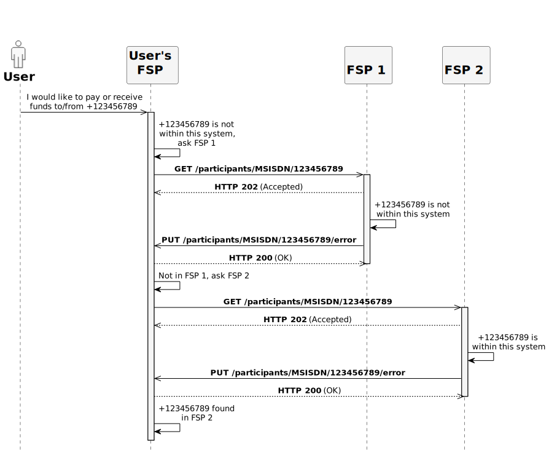


**Figure 41 — Comment utiliser les services fournis par /participants s’il n’existe pas de système commun de recherche de comptes**

#### Système de recherche de comptes commun

[Figure 42](#figure-42) montre comment une recherche de compte peut être effectuée s’il existe un ALS commun dans un schéma. Le processus consiste à demander au service commun de recherche de comptes quel FSP détient la partie avec l’identité fournie. Le service commun est représenté comme « Account Lookup » dans les flux ; ce service peut être mis en œuvre par le Switch ou comme un service séparé, selon le marché.

Les FSP n’ont pas besoin de prendre en charge la partie serveur des différents services HTTP **GET** sous la ressource **/participants** ; cette partie doit être assurée par l’ALS. À la place, les FSP (clients) doivent fournir des informations FSP concernant leurs comptes et titulaires de comptes (parties) à l’ALS (serveur) en utilisant les méthodes HTTP **POST** (pour créer ou mettre à jour les informations FSP, voir [POST /participants](#post-participants) et [POST /participants/_{Type}_/_{ID}_](#post-participants-type-id)) et HTTP **DELETE** (pour supprimer les informations FSP existantes, voir [DELETE /participants/_{Type}_/_{ID}_](#delete-participantstypeid)).

###### Figure 42

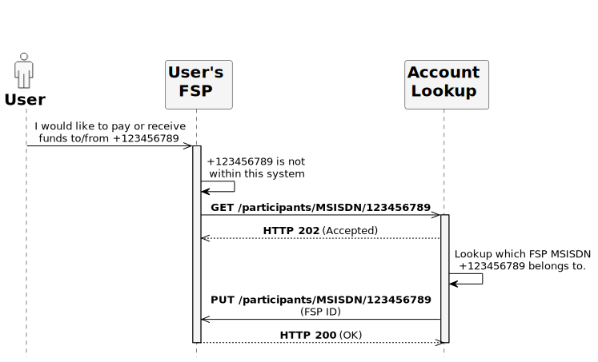


**Figure 42 — Comment utiliser les services fournis par /participants s’il existe un système commun de recherche de comptes**

#### Requêtes

Cette section décrit les services qu’un client peut demander sur la ressource **/participants**.

##### GET /participants/_{Type}_/_{ID}_

URI alternative : **GET /participants/**_{Type}_**/**_{ID}_**/**_{SubId}_

Service logique API : [Recherche d’informations sur un participant](../generic-transaction-patterns#lookup-participant-information)

La requête HTTP **GET /participants/**_{Type}_**/**_{ID}_ (ou **GET /participants/**_{Type}_**/**_{ID}_**/**_{SubId}_) sert à déterminer dans quel FSP se trouve la partie demandée, définie par _{Type}_, _{ID}_ et éventuellement _{SubId}_ (par exemple, **GET** **/participants/MSISDN/123456789**, ou **GET /participants/BUSINESS/shoecompany/employee1**). Voir [Remboursement](#refund) pour plus d’informations sur l’adressage d’une partie.

Cette requête HTTP doit prendre en charge une chaîne de requête (voir [Syntaxe URI](#uri-syntax) pour plus d’informations sur la syntaxe URI) pour filtrer par devise. Pour utiliser le filtrage par devise, la requête HTTP **GET /participants/**_{Type}_**/**_{ID}_**?currency=**_XYZ_ doit être utilisée, où _XYZ_ est la devise demandée.

Informations de callback et de modèle de données pour **GET /participants/**_{Type}_**/**_{ID}_ (alternative **GET /participants/**_{Type}_**/**_{ID}_**/**_{SubId}_):

- Callback – [**PUT /participants/**_{Type}_/_{ID}_](#put-participants-type-id)
- Callback d’erreur – [**PUT /participants/**_{Type}_/_{ID}_**/error**](#put-participants-type-iderror)
- Modèle de données — Corps vide

##### POST /participants

URI alternative : N/A

Service logique API : [Création d’informations bulk sur un participant](../generic-transaction-patterns#create-bulk-participant-information)

La requête HTTP **POST /participants** est utilisée pour créer des informations sur le serveur concernant la liste d’identités fournie. Cette requête doit être utilisée pour la création groupée d’informations FSP pour plusieurs parties. Le paramètre de devise optionnel doit indiquer que chaque partie fournie prend en charge la devise.

Callback et modèle de données pour **POST /participants** :

- Callback – [**PUT /participants/**_{ID}_](#put-participants-type-id)
- Callback d’erreur – [**PUT /participants/**_{ID}_ **/error**](#put-participants-type-iderror)
- Modèle de données – Voir [Tableau 9](#table-9)

###### Tableau 9

|Nom|Cardinalité|Type|Description|
|---|---|---|---|
|**requestId**|1|CorrelationId|L’identifiant de la requête, choisi par le client. Utilisé pour identifier le callback du serveur.|
|**partyList**|1..10000|PartyIdInfo|Liste des éléments PartyIdInfo pour lesquels le client souhaite créer ou mettre à jour les informations FSP.|
|**currency**|0..1|Currency|Indique que la devise fournie est prise en charge par chaque PartyIdInfo de la liste.|

**Tableau 9 — Modèle de données POST /participants**

##### POST /participants/_{Type}_/_{ID}_

URI alternative : **POST /participants/**_{Type}_/_{ID}_/_{SubId}_

Service logique API : [Création d’informations sur un participant](../generic-transaction-patterns#create-participant-information)

La requête HTTP **POST /participants/**_{Type}_**/**_{ID}_ (ou **POST /participants/**_{Type}_**/**_{ID}_**/**_{SubId}_) est utilisée pour créer sur le serveur les informations concernant l’identité fournie, définie par _{Type}_, _{ID}_ et éventuellement _{SubId}_ (par exemple, **POST /participants/MSISDN/123456789** ou **POST /participants/BUSINESS/shoecompany/employee1**). Voir [Remboursement](#refund) pour plus d’informations sur l’adressage d’une partie.

Callback et modèle de données pour **POST /participants**/_{Type}_**/**_{ID}_ (alternative **POST** **/participants/**_{Type}_**/**_{ID}_**/**_{SubId}_):

- Callback – [**PUT /participants/**_{Type}_**/**_{ID}_](#put-participants-type-id)
- Callback d’erreur — [**PUT /participants/**_{Type}_**/**_{ID}_**/error**](#put-participants-type-iderror)
- Modèle de données – Voir [Tableau 10](#table-10)

###### Tableau 10

|Nom|Cardinalité|Type|Description|
|---|---|---|---|
|**fspId**|1|FspId|Identifiant FSP auquel appartient la partie.|
|**currency**|0..1|Currency|Indique que la devise fournie est prise en charge par la partie.|
|**extensionList**|0..1|ExtensionList|Extension optionnelle, spécifique au déploiement.|

**Tableau 10 — Modèle de données POST /participants/_{Type}_/_{ID}_ (ou POST /participants/_{Type}_/_{ID}_/_{SubId}_)**

##### DELETE /participants/_{Type}_/_{ID}_

URI alternative : **DELETE /participants/**_{Type}_**/**_{ID}_**/**_{SubId}_

Service logique API : [Suppression d’informations sur un participant](../generic-transaction-patterns#delete-participant-information)

La requête HTTP **DELETE /participants/**_{Type}_**/**_{ID}_ (ou **DELETE /participants/**_{Type}_**/**_{ID}_**/**_{SubId}_) est utilisée pour supprimer les informations sur le serveur concernant l’identité fournie, définie par _{Type}_ et _{ID}_ (par exemple, **DELETE /participants/MSISDN/123456789**) et éventuellement _{SubId}_. Voir [Remboursement](#refund) pour plus d’informations sur l’adressage d’une partie.

Cette requête HTTP doit prendre en charge une chaîne de requête (voir [Syntaxe URI](#uri-syntax)) pour supprimer les informations FSP concernant uniquement une devise spécifique. Pour supprimer uniquement une devise spécifique, la requête HTTP **DELETE** **/participants/**_{Type}_**/**_{ID}_**?currency**_=XYZ_ doit être utilisée, où _XYZ_ est la devise demandée.

**Note :** L’ALS doit vérifier que c’est bien le FSP actuel de la partie qui supprime l’information FSP.

Callback et modèle de données pour **DELETE /participants/**_{Type}_**/**_{ID}_ (alternative **GET** **/participants/**_{Type}_**/**_{ID}_**/**_{SubId}_):

- Callback – [**PUT /participants/**_{Type}_**/**_{ID}_](#put-participants-type-id)
- Callback d’erreur – [**PUT /participants/**_{Type}_**/**_{ID}_**/error**](#put-participants-type-iderror)
- Modèle de données — Corps vide

<br />

#### Callbacks

Cette section décrit les callbacks utilisés par le serveur pour les services fournis par la ressource **/participants**.

##### PUT /participants/_{Type}_/_{ID}_

URI alternative : **PUT /participants/**_{Type}_**/**_{ID}_**/**_{SubId}_

Service logique API : [Retour d’information sur un participant](../generic-transaction-patterns#return-participant-information)

Le callback **PUT /participants/**_{Type}_**/**_{ID}_ (ou **PUT /participants/**_{Type}_**/**_{ID}_**/**_{SubId}_) est utilisé pour informer le client d’un succès à la suite d’une recherche, création ou suppression des informations FSP liées à la partie. Si l’information FSP a été supprimée, l’élément **fspId** doit être vide ; sinon il doit contenir l’information FSP de la partie.

Voir [Tableau 11](#table-11) pour le modèle de données.

###### Tableau 11

|Nom|Cardinalité|Type|Description|
|---|---|---|---|
|**fspId**|0..1|FspId|Identifiant FSP auquel appartient la partie.|

**Tableau 11 — Modèle de données PUT /participants/_{Type}_/_{ID}_ (ou PUT /participants/_{Type}_/_{ID}_/_{SubId}_)**

##### PUT /participants/_{ID}_

URI alternative : N/A

Service logique API : [Retour d’informations groupées sur les participants](../generic-transaction-patterns#return-bulk-participant-information)

Le callback **PUT /participants/**_{ID}_ est utilisé pour informer le client du résultat de la création de la liste d’identités fournie.

Voir [Tableau 12](#table-12) pour le modèle de données.

###### Tableau 12

|Nom|Cardinalité|Type|Description|
|---|---|---|---|
|**partyList**|1..10000|PartyResults|Liste des éléments PartyResult qui ont été créés ou dont la création a échoué.|
|**currency**|0..1|Currency|Indique que la devise fournie a été définie comme prise en charge par chaque PartyIdInfo ajouté avec succès.|

**Tableau 12 — Modèle de données PUT /participants/_{ID}_**

####Callbacks d’erreur

Cette section décrit les callbacks d’erreur utilisés par le serveur pour la ressource **/participants**.

##### PUT /participants/_{Type}_/_{ID}_/error

URI alternative : **PUT /participants/**_{Type}_**/**_{ID}_**/**_{SubId}_**/error**

Service logique API : [Erreur de retour d’information sur un participant](../generic-transaction-patterns#return-participant-information-error)

Si le serveur ne parvient pas à trouver, créer ou supprimer l’association FSP pour l’identité fournie, ou si une autre erreur de traitement est survenue, le callback d’erreur **PUT /participants/**_{Type}_**/**_{ID}_**/error** (ou **PUT /participants/**_{Type}_**/**_{ID}_**/**_{SubId}_**/error**) est utilisé. Voir [Tableau 13](#table-13) pour le modèle de données.

###### Tableau 13

|Nom|Cardinalité|Type|Description|
|---|---|---|---|
|**errorInformation**|1|ErrorInformation|Code d’erreur, description de la catégorie.|

**Tableau 13 — Modèle de données PUT /participants/_{Type}_/_{ID}_/error (ou PUT /participants/_{Type}_/_{ID}_/_{SubId}_/error)**

##### PUT /participants/_{ID}_/error

URI alternative : N/A

Service logique API : [Erreur de retour d’informations sur des participants groupés](../generic-transaction-patterns#return-bulk-participant-information-error)

En cas d’erreur lors de la création des informations FSP sur le serveur, le callback d’erreur **PUT /participants/**_{ID}_**/error** est utilisé. L’_{ID}_ de l’URI doit contenir le **requestId** (voir [Tableau 9](#table-9)) qui a servi à la création de l’information du participant. Voir [Tableau 14](#table-14) pour le modèle de données.

###### Tableau 14

| **Nom** | **Cardinalité** | **Type** | **Description** |
| --- | --- | --- | --- |
| **errorInformation** | 1 | ErrorInformation | Code d’erreur, description de la catégorie. |

**Tableau 14 — Modèle de données PUT /participants/_{ID}_/error**

#### États

Aucun état n’est défini pour la ressource **/participants** ; soit le serveur détient des informations FSP pour l’identité demandée, soit il n’en détient pas.

<br />

### Ressource API /parties

Cette section définit la ressource API logique **Parties**, décrite dans les [Modèles génériques de transaction](../generic-transaction-patterns#api-resource-parties).

Les services fournis par la ressource **/parties** servent à obtenir des informations concernant une partie détenue par un FSP pair.

#### Historique des versions de la ressource

[Tableau 15](#table-15) présente une description de chaque version de la ressource **/parties**.

###### Tableau 15

|Version|Date|Description|
|---|---|---|
|1.0|2018-03-13|Version initiale|
|1.1|2020-05-19|Le modèle de données a été mis à jour pour ajouter un élément ExtensionList optionnel au type complexe PartyIdInfo selon la Change Request : https://github.com/mojaloop/mojaloop-specification/issues/30. À la suite de cela, le modèle de données décrit dans le Tableau 93 a été mis à jour.|

**Tableau 15 — Historique des versions de la ressource /parties**

#### Détails des services

[Figure 43](#figure-43) contient un exemple de processus pour la ressource [**/parties**](../generic-transaction-patterns#api-resource-parties). D’autres déploiements sont possibles, par exemple un où le Switch et l’ALS sont sur le même serveur, ou un où le FSP de l’utilisateur interroge directement le FSP 1 pour obtenir les informations sur la partie.

###### Figure 43

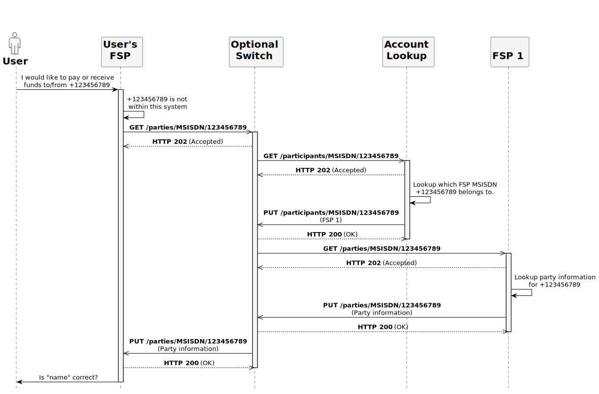

**Figure 43 — Exemple de processus pour la ressource /parties**

<br />

#### Requêtes

Cette section décrit les services qui peuvent être demandés par un client sur la ressource **/parties** de l’API.

##### GET /parties/_{Type}_/_{ID}_

URI alternative : **GET /parties/**_{Type}_**/**_{ID}_**/**_{SubId}_

Service logique API : [Recherche d’informations sur une partie](../generic-transaction-patterns#lookup-party-information)

La requête HTTP **GET /parties/**_{Type}_**/**_{ID}_ (ou **GET /parties/**_{Type}_**/**_{ID}_**/**_{SubId}_) est utilisée pour rechercher des informations sur la partie demandée, définie par _{Type}_, _{ID}_ et éventuellement _{SubId}_ (par exemple, **GET /parties/MSISDN/123456789** ou **GET /parties/BUSINESS/shoecompany/employee1**). Voir [Remboursement](#refund) pour plus d’informations sur l’adressage d’une partie.

Callback et modèle de données pour **GET /parties/**_{Type}_**/**_{ID}_ (alternative **GET /parties/**_{Type}_**/**_{ID}_**/**_{SubId}_):

- Callback – [**PUT /parties/**_{Type}_**/**_{ID}_](#put-partiestypeid)
- Callback d’erreur – [**PUT /parties/**_{Type}_**/**_{ID}_**/error**](#put-partiestypeiderror)
- Modèle de données — Corps vide

<br />

#### Callbacks

Cette section décrit les callbacks utilisés par le serveur pour les services fournis par la ressource **/parties**.

##### PUT /parties/_{Type}_/_{ID}_

URI alternative : **PUT /parties/**_{Type}_**/**_{ID}_**/**_{SubId}_

Service logique API : [Retour d’informations sur une partie](../generic-transaction-patterns#return-party-information)

Le callback **PUT /parties/**_{Type}_**/**_{ID}_ (ou **PUT /parties/**_{Type}_**/**_{ID}_**/**_{SubId}_) est utilisé pour informer le client d’un succès à la suite de la recherche d’une partie. Voir [Tableau 16](#table-16) pour le modèle de données.

###### Tableau 16

|**Nom**|**Cardinalité**|**Type**|**Description**|
|---|---|---|---|
|**party**|1|Party|Informations sur la partie demandée.|

**Tableau 16 — Modèle de données PUT /parties/_{Type}_/_{ID}_ (ou PUT /parties/_{Type}_/_{ID}_/_{SubId}_)**

#### Callbacks d’erreur

Cette section décrit les callbacks d’erreur utilisés par le serveur pour la ressource **/parties**.

#### PUT /parties/_{Type}_/_{ID}_/error

URI alternative : **PUT /parties/**_{Type}_**/**_{ID}_**/**_{SubId}_**/error**

Service logique API : [Erreur de retour d’informations sur une partie](../generic-transaction-patterns#return-party-information-error)

Si le serveur ne peut pas trouver les informations de la partie pour l’identité fournie, ou si une autre erreur de traitement est survenue, le callback d’erreur **PUT /parties/**_{Type}_**/**_{ID}_**/error** (ou **PUT /parties/**_{Type}_**/**_{ID}_**/**_{SubId}_**/error**) est utilisé. Voir [Tableau 17](#table-17) pour le modèle de données.

###### Tableau 17

|**Nom**|**Cardinalité**|**Type**|**Description**|
|---|---|---|---|
|**errorInformation**|1|ErrorInformation|Code d’erreur, description de la catégorie.|

**Tableau 17 — Modèle de données PUT /parties/_{Type}_/_{ID}_/error (ou PUT /parties/_{Type}_/_{ID}_/_{SubId}_/error)**

#### États

Aucun état n’est défini pour la ressource **/parties** ; soit un FSP dispose d’informations sur l’identité demandée, soit il n’en a pas.

<br />

### Ressource API /transactionRequests

Cette section définit la ressource API logique **Transaction Requests** (« demandes de transaction »), décrite dans les [Modèles génériques de transaction](../generic-transaction-patterns#api-resource-transaction-requests).

Le service principal qu’offre la ressource **/transactionRequests** permet à un bénéficiaire de demander à un payeur de lui transférer des fonds électroniques. Le payeur peut approuver ou refuser la demande émise par le bénéficiaire. La décision du payeur peut être prise de manière programmatique si :

- Le bénéficiaire est de confiance (c’est-à-dire que le payeur l’a pré-approuvé dans son FSP), ou
- Une valeur d’autorisation — c’est-à-dire un **mot de passe à usage unique** (OTP) — a été vérifiée correctement à l’aide de la ressource API **/authorizations** (voir [Section 6.6](#66-api-resource-authorizations)).

Alternativement, le payeur peut prendre la décision manuellement.

####  Historique des versions de la ressource

[Tableau 18](#table-18) présente une description de chaque version de la ressource **/transactionRequests**.

###### Tableau 18

|Version|Date|Description|
|---|---|---|
|1.0|2018-03-13|Version initiale|
|1.1|2020-05-19|Le modèle de données a été mis à jour pour ajouter un élément ExtensionList optionnel au type complexe PartyIdInfo selon la Change Request : https://github.com/mojaloop/mojaloop-specification/issues/30. À la suite de cela, le modèle de données décrit dans le Tableau 93 a été mis à jour.|

**Tableau 18 — Historique des versions de la ressource /transactionRequests**

#### Détails des services

[Figure 44](#figure-44) montre comment fonctionne le processus de demande de transaction à l’aide de la ressource **/transactionRequests**. L’approbation ou le refus n’est pas montré dans la figure. Un refus est un callback **PUT /transactionRequests/**_{ID}_ avec un état **REJECTED**, similaire au callback de la figure avec l’état **RECEIVED**, tel que décrit dans la [Section 6.4.2.1](#6421-payer-rejected-transaction-request). Une approbation du payeur n’est pas envoyée en tant que callback ; à la place, une cotation et un transfert sont envoyés contenant une référence à la demande de transaction.

###### Figure 44

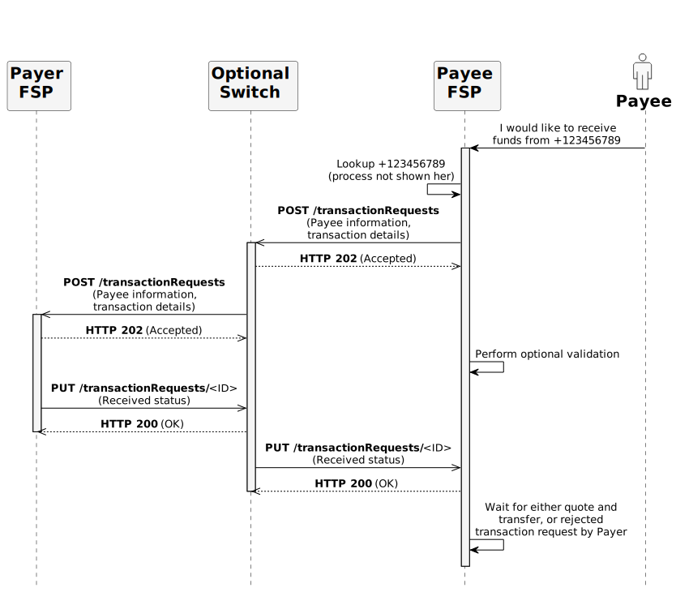

**Figure 44 — Comment utiliser le service /transactionRequests**

##### Demande de transaction rejetée par le payeur

[Figure 45](#figure-45) montre le processus par lequel une demande de transaction est rejetée. Les raisons possibles du refus incluent :

- Le payeur a rejeté la demande manuellement.
- Un dépassement de limite automatique s’est produit.
- Le payeur a saisi un OTP de façon erronée plus que le nombre de fois autorisé.

###### Figure 45

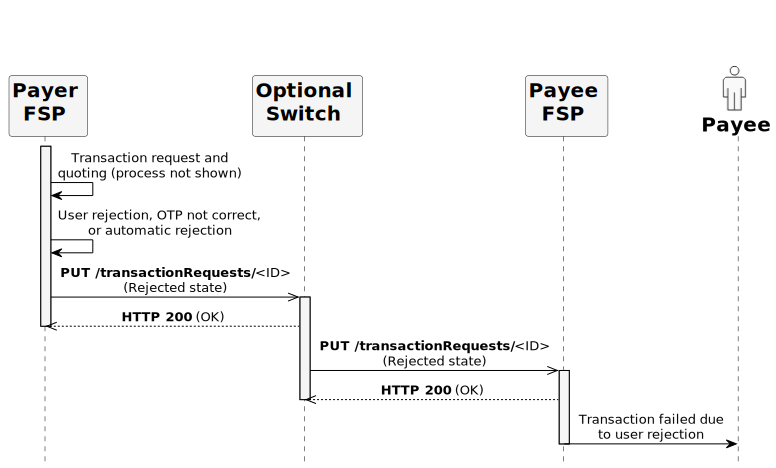

**Figure 45 — Exemple de processus dans lequel une demande de transaction est rejetée**

#### Requêtes

Cette section décrit les services qu’un client peut demander pour la ressource **/transactionRequests**.

##### GET /transactionRequests/_{ID}_

URI alternative : N/A

Service logique API : [Récupérer les informations de demande de transaction](../generic-transaction-patterns#retrieve-transaction-request-information)

La requête HTTP **GET /transactionRequests/**_{ID}_ est utilisée pour obtenir des informations sur une demande de transaction préalablement créée ou sollicitée. L’_{ID}_ dans l’URI doit contenir le **transactionRequestId** (voir [Tableau 15](#table-15)) qui a été utilisé lors de la création de la demande de transaction.

Callback et modèle de données pour **GET /transactionRequests/**_{ID}_ :

- Callback — [**PUT /transactionRequests/**_{ID}_](#put-transactionrequestsid)
- Callback d’erreur — [**PUT /transactionRequests/**_{ID}_**/error**](#put-transactionrequestsiderror)
- Modèle de données — Corps vide

##### POST /transactionRequests

URI alternative : N/A

Service logique API : [Effectuer une demande de transaction](../generic-transaction-patterns#perform-transaction-request)

La requête HTTP **POST /transactionRequests** est utilisée pour demander la création d’une demande de transaction financière sur le serveur.

Callback et modèle de données pour **POST /transactionRequests** :

- Callback — [**PUT /transactionRequests/**_{ID}_](#put-transactionrequestsid)
- Callback d’erreur — [**PUT /transactionRequests/**_{ID}_**/error**](#put-transactionrequestsiderror)
- Modèle de données — Voir [Tableau 19](#table-19)

###### Tableau 19

|**Nom**|**Cardinalité**|**Type**|**Description**|
|---|---|---|---|
|**transactionRequestId**|1|CorrelationId|Identifiant partagé entre les FSP pour l’objet de la demande de transaction, défini par le FSP bénéficiaire. L’ID doit être réutilisé pour les renvois de la même demande de transaction. Un nouvel ID doit être généré pour chaque nouvelle demande.|
|**payee**|1|Party|Informations sur le bénéficiaire de la transaction financière proposée.|
|**payer**|1|PartyInfo|Informations sur le type de payeur, id, sous-type/id, FSP Id dans la transaction financière proposée.|
|**amount**|1|Money|Montant demandé à transférer du payeur au bénéficiaire.|
|**transactionType**|1|TransactionType|Type de transaction.|
|**note**|0..1|Note|Motif de la demande de transaction, destiné au payeur.|
|**geoCode**|0..1|GeoCode|Longitude et latitude de la partie initiatrice. Peut être utilisé pour détecter une fraude.|
|**authenticationType**|0..1|AuthenticationType|OTP ou code QR, sinon vide.|
|**expiration**|0..1|DateTime|Peut être défini pour obtenir un échec rapide si le FSP pair met trop longtemps à répondre. Il peut aussi être utile pour le consommateur, l’agent ou le commerçant de savoir que leur demande a une durée limitée.|
|**extensionList**|0..1|ExtensionList|Extension optionnelle, spécifique au déploiement.|

**Tableau 19 — Modèle de données POST /transactionRequests**

#### Callbacks

Cette section décrit les callbacks utilisés par le serveur pour la ressource **/transactionRequests**.

##### PUT /transactionRequests/_{ID}_

URI alternative : N/A

Service logique API : **Retour d’informations de demande de transaction**

Le callback **PUT /transactionRequests/**_{ID}_ est utilisé pour informer le client d’une demande de transaction créée ou sollicitée. L’_{ID}_ dans l’URI doit contenir le **transactionRequestId** (voir [Tableau 19](#table-19)) utilisé lors de la création de la demande, ou l’_{ID}_ utilisé dans le [**GET /transactionRequests/**_{ID}_](#get-transactionrequestsid). Voir [Tableau 20](#table-20) pour le modèle de données.

###### Tableau 20

|**Nom**|**Cardinalité**|**Type**|**Description**|
|---|---|---|---|
|**transactionId**|0..1|CorrelationId|Identifie la transaction liée (si une transaction a été créée).|
|**transactionRequestState**|1|TransactionRequestState|État de la demande de transaction.|
|**extensionList**|0..1|ExtensionList|Extension optionnelle, spécifique au déploiement.|

**Tableau 20 — Modèle de données PUT /transactionRequests/_{ID}_**

#### Callbacks d’erreur

Cette section décrit les callbacks d’erreur utilisés par le serveur pour la ressource **/transactionRequests**.

##### PUT /transactionRequests/_{ID}_/error

URI alternative : N/A

Service logique API : [Erreur de retour d’informations sur une demande de transaction](../generic-transaction-patterns#return-transaction-request-information-error)

Si le serveur ne parvient pas à trouver ou créer une demande de transaction, ou si une autre erreur de traitement survient, le callback d’erreur **PUT /transactionRequests/**_{ID}_**/error** est utilisé. L’_{ID}_ de l’URI doit contenir le **transactionRequestId** (voir [Tableau 19](#table-19)) utilisé lors de la création de la demande, ou l’_{ID}_ utilisé dans le [**GET /transactionRequests/**_{ID}_](#get-transactionrequestsid). Voir [Tableau 21](#table-21) pour le modèle de données.

###### Tableau 21

|**Nom**|**Cardinalité**|**Type**|**Description**|
|---|---|---|---|
|**errorInformation**|1|ErrorInformation|Code d’erreur, description de la catégorie.|

**Tableau 21 — Modèle de données PUT /transactionRequests/_{ID}_/error**

#### 6.4.6 États

Les états possibles d’une demande de transaction sont représentés dans la [Figure 46](#figure-46).

**Note :** Un serveur n’a pas besoin de conserver les objets de demande de transaction qui ont été rejetés dans sa base de données. Cela signifie qu’un client doit s’attendre à recevoir un callback d’erreur pour une demande de transaction rejetée.

###### Figure 46


**Figure 46 — États possibles d’une demande de transaction**

<br />

### Ressource API /quotes

Cette section définit la ressource API logique **Quotes** (« cotations »), décrite dans les [Modèles génériques de transaction](../generic-transaction-patterns#api-resource-quotes).

Le principal service proposé par la ressource **/quotes** est le calcul des frais éventuels et des commissions FSP liés à la réalisation d’une transaction financière interopérable. Les FSP payeur et bénéficiaire doivent chacun calculer leur part de la cotation pour obtenir une vue globale de tous les frais et commissions applicables à la transaction.

Une cotation est irrévocable ; elle ne peut pas être modifiée après sa création. Elle peut cependant expirer (toutes les cotations sont valables uniquement jusqu’à leur date d’expiration).

**Note :** Une cotation n’est pas une garantie que la transaction financière réussira. La transaction peut toujours échouer ultérieurement. Une cotation garantit uniquement que les frais et commissions appliqués à la transaction spécifiée restent valables jusqu’à expiration de la cotation.

Pour plus d’informations, voir la section [Cotation](#quoting).

#### Historique des versions de la ressource

[Tableau 22](#table-22) présente une description de chaque version de la ressource **/quotes**.

###### Tableau 22

|Version|Date|Description|
|---|---|---|
|1.0|2018-03-13|Version initiale|
|1.1|2020-05-19|Le modèle de données a été mis à jour pour ajouter un élément ExtensionList optionnel au type complexe PartyIdInfo selon la Change Request : https://github.com/mojaloop/mojaloop-specification/issues/30. À la suite de cela, le modèle de données décrit dans le Tableau 93 a été mis à jour.|

**Tableau 22 – Historique des versions de la ressource /quotes**

#### Détails des services

[Figure 47](#figure-47) présente un exemple de processus pour la ressource API **/quotes**. Cet exemple montre une transaction initiée par le payeur, mais elle peut aussi être initiée par le bénéficiaire, en utilisant la ressource API [**/transactionRequests**](#api-resource-transactionrequests). Dans ce cas, la recherche sera effectuée par le FSP du bénéficiaire.

###### Figure 47

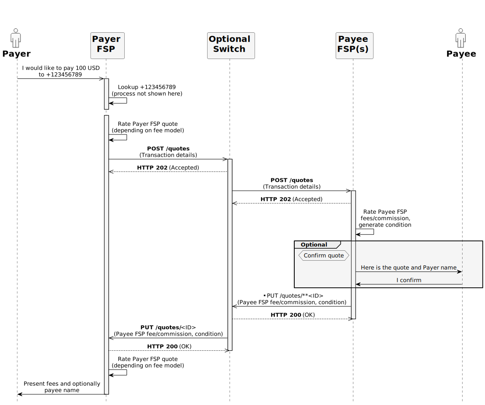

**Figure 47 — Exemple de processus pour la ressource /quotes**

#### Détails de l’expiration de la cotation

La demande de cotation du FSP payeur peut contenir une date d’expiration, si le FSP payeur souhaite indiquer à partir de quand il n’est plus utile pour le FSP bénéficiaire de renvoyer une cotation. Par exemple, la transaction peut expirer ou sa cotation peut expirer.

Le FSP bénéficiaire doit définir une expiration dans le callback de la cotation pour indiquer à partir de quand elle n’est plus valable pour le FSP payeur.

#### Rejet d’une cotation

Le FSP bénéficiaire peut rejeter une demande de cotation émise par le FSP payeur en envoyant le callback d’erreur **PUT /quotes/**_{ID}_/**error** plutôt que le callback **PUT /quotes/**_{ID}_.
Selon le modèle générique de transaction utilisé (voir Section 8 pour plus d’informations), le FSP payeur peut rejeter une cotation en utilisant l’une des méthodes suivantes :

- Si la transaction est initiée par le payeur (voir Section 8.1), le FSP payeur ne doit pas informer le FSP bénéficiaire du rejet. La cotation créée chez le FSP bénéficiaire doit avoir une date d’expiration, après laquelle elle est automatiquement supprimée.
- Si la transaction est initiée par le bénéficiaire (voir Section 8.2 et 8.3), le FSP payeur doit informer le FSP bénéficiaire du rejet par le callback **PUT /transactionRequests/**_{ID}_ avec un état « rejected ». Le processus est décrit plus en détail à la Section 6.4.2.1.

#### Demande de paiement Interledger

Dans le cadre de la prise en charge d’Interledger et de l’implémentation concrète de la demande de paiement Interledger (voir [Protocole Interledger](#interledger-protocol)), le FSP bénéficiaire doit :

- Déterminer l’adresse ILP (voir [Adresses ILP](#ILP-addressing) pour plus d’informations) du bénéficiaire et le montant qu’il recevra. Notez que puisque l’élément **amount** dans le paquet ILP est défini comme un UInt64 (donc valeur entière), le montant doit être multiplié par l’exposant de la devise (par exemple, l’exposant de l’USD est 2, donc le montant doit être multiplié par 10<sup>2</sup>, et celui du JPY est 0, donc multiplié par 10<sup>0</sup>). L’adresse ILP et le montant doivent être renseignés dans le paquet ILP (voir [ILP Packet](#ilp-packet) pour plus d’informations).

- Renseigner l’élément **data** dans le paquet ILP par le modèle de données [Transaction](#transaction).
- Générer la fulfilment et la condition (voir [Transferts conditionnels](#conditional-transfers) pour plus de détails). Renseigner l’élément **condition** dans le [PUT /quotes/**_{ID}_](#put-quotes-id)). Le [Tableau 19](#table-19) montre le modèle de données avec la condition générée.

La fulfilment est un secret temporaire généré pour chaque transaction financière par le FSP bénéficiaire et utilisé comme déclencheur pour valider les transferts constituant un paiement ILP.

Le FSP bénéficiaire utilise un secret local pour générer un HMAC SHA-256 du paquet ILP. Le même secret peut être utilisé pour toutes les transactions financières, ou le FSP bénéficiaire peut stocker un secret différent par bénéficiaire ou selon une autre segmentation.

Le choix et la cardinalité du secret local sont une décision d’implémentation, qui peut être dictée par les règles du système. Le seul prérequis est que le FSP bénéficiaire puisse déterminer à quel secret correspond un paquet ILP reçu ultérieurement dans le cadre d’un transfert entrant (voir [Ressource API Transfers](#api-resource-transfers)).

La fulfilment et la condition sont générées conformément à l’algorithme défini dans le [Listing 12](#listing-12). Une fois que le FSP bénéficiaire a dérivé la condition, la fulfilment peut être supprimée puisqu’elle peut être régénérée plus tard.

###### Listing 12

Génération du fulfilment (accomplissement) et de la condition

**Entrées :**

- Secret local (chaîne binaire de 32 octets)
- Paquet ILP

**Algorithme :**

1. Le fulfilment est obtenu en exécutant l’algorithme HMAC SHA-256 sur le paquet ILP en utilisant le secret local comme clé.

2. La condition est obtenue en exécutant l’algorithme de hachage SHA-256 sur le fulfilment.

**Sorties :**

- Fulfilment (chaîne binaire de 32 octets)
- Condition (chaîne binaire de 32 octets)

**Listing 12 -- Algorithme pour générer le fulfilment et la condition**

#### Requêtes

Cette section décrit les services pouvant être demandés par un client de l’API sur la ressource **/quotes**.

##### GET /quotes/_{ID}_

URI alternative : N/A

Service logique de l’API : [Récupérer les informations de la cotation](../generic-transaction-patterns#retrieve-quote-information)

La requête HTTP **GET /quotes/**_{ID}_ permet d’obtenir des informations sur une cotation préalablement créée ou demandée. Le _{ID}_ dans l’URI doit contenir le **quoteId** (voir [Tableau 23](#table-23)) qui a été utilisé pour la création de la cotation.

Informations sur les callbacks et le modèle de données pour **GET /quotes/**_{ID}_ :

- Callback -- [**PUT /quotes/**_{ID}_](#put-quotes-id)
- Callback d’erreur -- [**PUT /quotes/**_{ID}_**/_error_**](#put-quotes-iderror)
- Modèle de données -- Corps vide

##### POST /quotes

URI alternative : N/A

Service logique de l’API : [Calculer les informations de la cotation](../generic-transaction-patterns#calculate-quote-information)

La requête HTTP **POST /quotes** est utilisée pour demander la création d’une cotation pour la transaction financière fournie sur le serveur.

Informations sur les callbacks et le modèle de données pour **POST /quotes** :

- Callback -- [**PUT /quotes/**_{ID}_](#put-quotes-id)
- Callback d’erreur -- [**PUT /quotes/**_{ID}_**/error**](#put-quotes-iderror)
- Modèle de données -- Voir [Tableau 23](#table-23)

###### Tableau 23

| **Nom** | **Cardinalité** | **Type** | **Description** |
| --- | --- | --- | --- |
| **quoteId** | 1 | CorrelationId | Identifiant commun entre les FSPs pour l’objet cotation, décidé par le FSP du payeur. Cet ID doit être réutilisé pour les renvois de la même cotation pour une transaction. Un nouvel ID doit être généré pour chaque nouvelle cotation pour une transaction. |
| **transactionId** | 1 | CorrelationId | Identifiant commun (décidé par le FSP du payeur) entre les FSPs pour l’objet de la future transaction. La transaction réelle sera créée dans le cadre d’un processus de transfert réussi. L’ID doit être réutilisé pour les renvois de la même cotation pour une transaction. Un nouvel ID doit être généré pour chaque nouvelle cotation pour une transaction. |
| **transactionRequestId** | 0..1 | CorrelationId | Identifie une demande de transaction optionnelle envoyée précédemment. |
| **payee** | 1 | Party | Informations concernant le bénéficiaire de la transaction financière proposée. |
| **payer** | 1 | Party | Informations concernant le payeur de la transaction financière proposée. |
| **amountType** | 1 | AmountType |**SEND** pour montant envoyé, **RECEIVE** pour montant reçu. |
| **amount** | 1 | Money | Selon **amountType** :<br>Si **SEND** : Le montant que le payeur souhaite envoyer ; c’est-à-dire le montant à prélever du compte payeur, frais inclus. Le montant est mis à jour par chaque entité participant à la transaction.<br>Si **RECEIVE** : Le montant que le bénéficiaire doit recevoir ; c’est-à-dire le montant qui doit être envoyé au destinataire, frais exclus. Le montant n’est pas mis à jour par les entités participantes.</br> |
| **fees** | 0..1 | Money | Frais associés à la transaction. <li>L’élément fees doit être vide si les frais ne doivent pas être divulgués.</li><li>L’élément fees doit être renseigné si les frais doivent être divulgués.</li> |
| **transactionType** | 1 | TransactionType | Type de transaction pour laquelle la cotation est demandée. |
| **geoCode** | 0..1 | GeoCode | Longitude et latitude de la partie initiatrice. Peut être utilisé pour détecter la fraude. |
| **note** | 0..1 | Note | Mémo à joindre à la transaction. |
| **expiration** | 0..1 | DateTime | L’expiration est optionnelle. Elle peut être fixée afin d’obtenir un échec rapide si le FSP pair met trop de temps à répondre. Elle peut également être utile pour que le consommateur, l’agent ou le commerçant sache que leur demande a une limite de temps. |
| **extensionList** | 0..1 | ExtensionList | Extension optionnelle, spécifique au déploiement. |

**Tableau 23 -- Modèle de données POST /quotes**

#### Callbacks

Cette section décrit les callbacks utilisés par le serveur sous la ressource **/quotes**.

#### PUT /quotes/_{ID}_

URI alternative : N/A

Service logique de l’API : [Retourner les informations de la cotation](../generic-transaction-patterns#return-quote-information)

Le callback **PUT /quotes/**_{ID}_ est utilisé pour informer le client d’une cotation demandée ou créée. Le _{ID}_ dans l’URI doit contenir le **quoteId** (voir [Tableau 23](#table-23)) qui a été utilisé pour la création de la cotation, ou le _{ID}_ utilisé dans le [**GET /quotes/**_{ID}_](#get-quotesid). Voir [Tableau 24](#table-24) pour le modèle de données.

###### Tableau 24

| **Nom** | **Cardinalité** | **Type** | **Description** |
| --- | --- | --- | --- |
| **transferAmount** | 1 | Money | Le montant que le FSP payeur doit transférer au FSP bénéficiaire. |
| **payeeReceiveAmount** | 0..1 | Money | Le montant que le bénéficiaire doit recevoir dans la transaction de bout en bout. Optionnel si le FSP bénéficiaire ne souhaite pas divulguer de potentiels frais au bénéficiaire. |
| **payeeFspFee** | 0..1 | Money | Partie des frais de la transaction imputée au FSP bénéficiaire. |
| **payeeFspCommission** | 0..1 | Money | Commission du FSP bénéficiaire sur la transaction. |
| **expiration** | 1 | DateTime | Date et heure jusqu’à laquelle la cotation est valide et peut être honorée lorsqu’elle est utilisée dans la transaction suivante. |
| **geoCode** | 0..1 | GeoCode | Longitude et latitude du bénéficiaire. Peut être utilisé pour détecter la fraude. |
| **ilpPacket** | 1 | IlpPacket | Le paquet ILP qui doit être joint au transfert par le payeur. |
| **condition** | 1 | IlpCondition | La condition qui doit être jointe au transfert par le payeur. |
| **extensionList** | 0..1 | ExtensionList | Extension optionnelle, spécifique au déploiement. |

**Tableau 24 -- Modèle de données PUT /quotes/_{ID}_**

#### Callbacks d’erreur

Cette section décrit les callbacks d’erreur utilisés par le serveur
sous la ressource **/quotes**.

##### PUT /quotes/_{ID}_/error

URI alternative : N/A

Service logique de l’API : [Retourner une erreur d’information de cotation](../generic-transaction-patterns#return-quote-information-error)

Si le serveur ne parvient pas à trouver ou créer une cotation, ou qu’une autre erreur de traitement se produit, le callback d’erreur **PUT** **/quotes/**_{ID}_**/error** est utilisé. Le _{ID}_ dans l’URI doit contenir le **quoteId** (voir [Tableau 23](#table-23)) utilisé pour la création de la cotation, ou le _{ID}_ utilisé dans le [**GET /quotes/**_{ID}_](#get-quotesid). Voir [Tableau 25](#table-25) pour le modèle de données.

###### Tableau 25

| **Nom** | **Cardinalité** | **Type** | **Description** |
| --- | --- | --- | --- |
| **errorInformation** | 1 | ErrorInformation | Code d’erreur, description de la catégorie.|

**Tableau 25 -- Modèle de données PUT /quotes/_{ID}_/error**

#### États

###### Figure 48

[Figure 48](#figure-48) contient la machine à états UML (Unified Modeling Language) pour les états possibles d’un objet cotation.

**Remarque :** Un serveur n’a pas besoin de conserver en base les objets cotation ayant été rejetés ou expirés. Cela signifie qu’un client doit s’attendre à ce qu’un callback d’erreur puisse être retourné pour une cotation expirée ou rejetée.

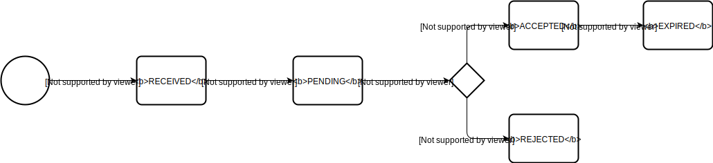

**Figure 48 -- États possibles d’une cotation**

<br />

### Ressource d’API /authorizations

Cette section définit la ressource logique d’API **Authorizations**, décrite dans [Modèles de transaction génériques](../gerneric-transaction-patterns#api-resource-authorizations).

La ressource **/authorizations** est utilisée pour demander au payeur de saisir les identifiants applicables dans le système du FSP bénéficiaire pour approuver la transaction financière, lorsqu’il a initié la transaction depuis un POS, un DAB ou similaire, dans le système du FSP bénéficiaire et souhaite autoriser via un OTP.

#### Historique des versions de la ressource

[Tableau 26](#table-26) décrit les différentes versions de la ressource **/authorizations**.

###### Tableau 26

|Version|Date|Description|
|---|---|---|
|1.0|2018-03-13|Version initiale|

**Tableau 26 – Historique des versions de la ressource /authorizations**

#### Détails des services

[Figure 49](#figure-49) présente un exemple de processus pour la ressource API **/authorizations**. Le FSP bénéficiaire envoie d’abord une [demande de transaction](#api-resource-transactionrequests)) qui est autorisée via OTP. Le FSP payeur réalise ensuite la cotation (voir [Ressource API Quotes](#api-resource-quotes)) avant qu’une demande d’autorisation soit envoyée au système du FSP bénéficiaire pour que le payeur approuve via la saisie de l’OTP. Si l’OTP est correct, le processus de transfert doit être initié (voir [Ressource API Transfers](#api-resource-transfers)).

###### Figure 49

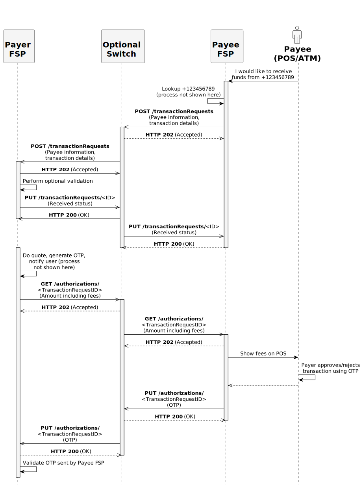


**Figure 49 -- Exemple de processus pour la ressource /authorizations**

#### Renvoi de la valeur d’autorisation

Si la notification contenant la valeur d’autorisation n’atteint pas le payeur, celui-ci peut demander le renvoi de la valeur d’autorisation si le POS, le DAB ou appareil similaire propose cette option. Voir [Figure 50](#figure-50) pour un exemple où le payeur demande un renvoi de l’OTP.

###### Figure 50

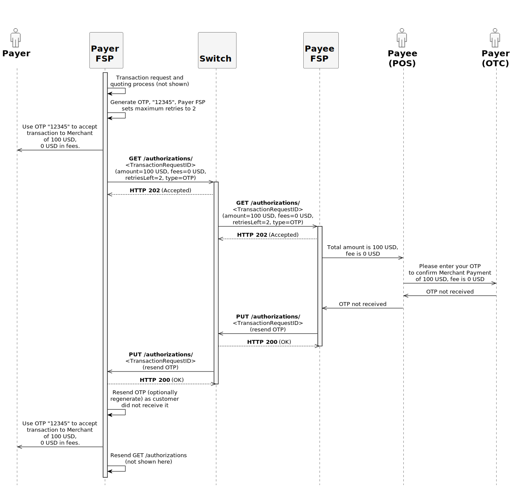


**Figure 50 -- Le payeur demande le renvoi de la valeur d’autorisation (OTP)**

##### Tentative de saisie de la valeur d’autorisation

Le FSP payeur doit décider du nombre de tentatives autorisées pour la saisie de la valeur d’autorisation sur le POS, DAB ou appareil similaire. Ce nombre est fixé dans la chaîne de requête **retriesLeft** (voir [Syntaxe URI](#uri-syntax) pour plus de détails) dans le service [**GET** **/authorizations/**_{ID}_](#get-authorizationsid). Si le FSP payeur envoie retriesLeft=1, cela signifie qu’il s’agit de la dernière tentative autorisée par le payeur. Voir [Figure 51](#figure-51) pour un exemple où le payeur saisit un OTP incorrect et où la valeur **retriesLeft** est alors décrémentée.

###### Figure 51

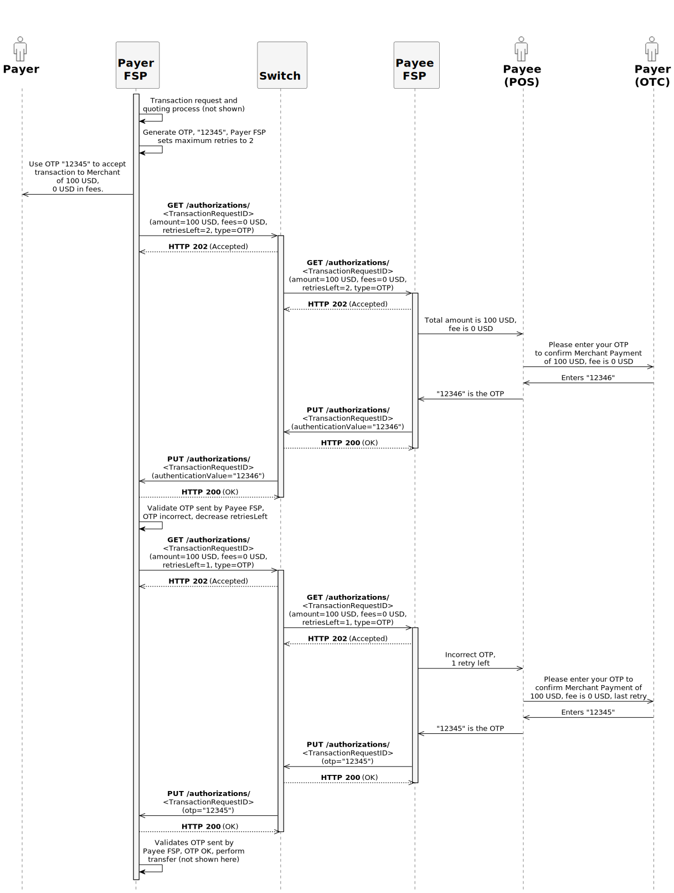


**Figure 51 -- Le payeur saisit une valeur d’autorisation incorrecte (OTP)**

##### Échec de l’autorisation OTP

Si l’utilisateur échoue à saisir le bon OTP dans le nombre de tentatives autorisées, le processus décrit dans [Demande de transaction rejetée par le payeur](#payer-rejected-transaction-request) est suivi.

#### Requêtes

Cette section décrit les services pouvant être demandés par un client de l’API sur la ressource **/authorizations**.

##### GET /authorizations/_{ID}_

URI alternative : N/A

Service logique d’API : [Réaliser l’autorisation](../generic-transaction-patterns#perform-authorization)

La requête HTTP **GET /authorizations/**_{ID}_ est utilisée pour demander au payeur de saisir les identifiants dans le système du FSP bénéficiaire. Le _{ID}_ dans l’URI doit contenir le **transactionRequestID** (voir [Tableau 15](#table-15)), obtenu via le service [**POST** **/transactionRequests**](#post-transactionrequests)) plus tôt dans le processus.

Cette requête nécessite que la chaîne de requête (voir [Syntaxe URI](#uri-syntax) pour plus d’infos) contienne les paires clé-valeur suivantes :

- **authenticationType=**_{Type}_, où _{Type}_ est une valeur valide de l’énumération [AuthenticationType](#authenticationtype).
- **retriesLeft=**_{NrOfRetries}_, où _{NrOfRetries}_ est le nombre de tentatives restantes avant le rejet de la transaction financière. _{NrOfRetries}_ doit être exprimé via le type de données [Integer](#integer)). **retriesLeft=1** signifie qu’il s’agit de la dernière tentative.
- **amount=**_{Amount}_, où _{Amount}_ est le montant de la transaction qui sera prélevé du compte du payeur. _{Amount}_ doit être de type [Amount](#amount).
- **currency=**_{Currency}_, où _{Currency}_ est la devise de la transaction. La valeur _{Currency}_ doit être conforme à l’énumération [CurrencyCode](#currencycode)).

Exemple d’URI contenant toutes les clés requises :

**GET /authorization/3d492671-b7af-4f3f-88de-76169b1bdf88?authenticationType=OTP&retriesLeft=2&amount=102&currency=USD**

Informations sur les callbacks et le modèle de données pour **GET /authorization/**_{ID}_ :

- Callback - [**PUT /authorizations/**_{ID}_](#6641-put-authorizationsid)
- Callback d’erreur - [**PUT /authorizations/**_{ID}_**/error**](#6651-put-authorizationsiderror)
- Modèle de données -- Corps vide

#### 6.6.4 Callbacks

Cette section décrit les callbacks utilisés par le serveur sous la ressource **/authorizations**.

#### 6.6.4.1 PUT /authorizations/_{ID}_

URI alternative : N/A

Service logique d’API : [Retourner le résultat de l’autorisation](../generic-transaction-patterns#return-authorization-result)

Le callback **PUT /authorizations/** _{ID}_ est utilisé pour informer le client du résultat d’une autorisation précédemment demandée. Le _{ID}_ dans l’URI doit contenir l’identifiant utilisé dans le [**GET /authorizations/**_{ID}_](#get-authorizationsid). **Voir** [Tableau 27](#table-27) **pour** le modèle de données.

###### Tableau 27

| **Nom** | **Cardinalité** | **Type** | **Description** |
| --- | --- | --- | --- |
| **authenticationInfo** | 0..1 | AuthenticationInfo | OTP ou code QR si renseigné, sinon vide. |
| **responseType** | 1 | AuthorizationResponse | Enum contenant le résultat : si le client a saisi la valeur d’authentification, a rejeté la transaction ou a demandé le renvoi de la valeur d’authentification. |

**Tableau 27 – Modèle de données PUT /authorizations/{ID}**

#### Callbacks d’erreur

Cette section décrit les callbacks d’erreur utilisés par le serveur sous la ressource **/authorizations**.

#### PUT /authorizations/_{ID}_/error

URI alternative : N/A

Service logique d’API : [Retourner une erreur d’autorisation](../generic-transaction-patterns#return-authorization-error)

Si le serveur ne trouve pas la demande de transaction, ou une autre erreur de traitement survient, le callback d’erreur **PUT** **/authorizations/**_{ID}_ **/error** est utilisé. Le _{ID}_ dans l’URI doit être celui utilisé dans le [**GET /authorizations/**_{ID}_](#get-authorizationsid). **Voir** [Tableau 28](#table-28) **pour** le modèle de données.

###### Tableau 28

| **Nom** | **Cardinalité** | **Type** | **Description** |
| --- | --- | --- | --- |
| **errorInformation** | 1 | ErrorInformation | Code d’erreur, description de la catégorie |

**Tableau 28 -- Modèle de données PUT /authorizations/_{ID}_/error**

#### États

Aucun état n’est défini pour la ressource **/authorizations**.

<br />

### Ressource d’API /transfers

Cette section définit la ressource logique d’API **Transfers**, décrite dans [Modèles de transaction génériques](../generic-transation-patterns#api-resource-transfers).

Les services fournis par la ressource d’API **/transfers** servent à effectuer le(s) transfert(s) ILP hop-by-hop et à réaliser la transaction financière de bout en bout en envoyant les détails de transaction du FSP payeur au FSP bénéficiaire. Les détails de la transaction sont envoyés en tant que partie du modèle de données de transfert dans le paquet ILP.

Le protocole Interledger suppose que la mise en place d’une transaction financière se fait via un protocole de bout en bout, mais qu’un transfert ILP est réalisé via des protocoles hop-by-hop entre FSPs connectés au même registre. Dans la version actuelle de l’API, la ressource **/quotes** établit la transaction financière. Avant de réaliser un transfert, la cotation doit être effectuée pour préparer la transaction. Voir [Ressource API Quotes](#api-resource-quotes) pour plus d’informations.

Un transfert ILP s’effectue entre deux détenteurs de comptes sur chaque côté d’un registre commun. Il s’exprime généralement par une demande d’exécution d’un transfert sur le registre et une notification au bénéficiaire que le transfert est réservé en sa faveur, incluant une condition devant être remplie pour commettre le transfert.

Quand le FSP bénéficiaire présente le fulfilment au registre commun, le transfert est commis sur le registre. Simultanément, le FSP payeur est notifié que le transfert a été commis ainsi que du fulfilment.

#### Historique des versions de la ressource

Le Tableau 29 décrit les différentes versions de la ressource **/transfers**.

| Version | Date | Description|
| ---- | ---- | ---- |
| **1.0** | 2018-03-13 | Version initiale |
| **1.1** | 2020-05-19 | Ajout du support des notifications de commit via la méthode HTTP **PATCH**. La nouvelle requête **PATCH /transfers/{ID}** est décrite en Section 6.7.3.3. Le processus d’utilisation des notifications de commit est décrit en Section 6.7.2.6. <br><br> Le modèle de données est mis à jour pour inclure un élément ExtensionList optionnel au type complexe PartyIdInfo (voir Change Request : [https://github.com/mojaloop/mojaloop-specification/issues/30](https://github.com/mojaloop/mojaloop-specification/issues/30)). Suite à cela, le modèle de données du Tableau 93 a été mis à jour.|

**Tableau 29 –- Historique des versions pour la ressource /transfers**

#### Détails des services

Cette section fournit des détails concernant les transferts hop-by-hop et les transactions financières de bout en bout.

#### Processus

[Figure 52](#figure-52) illustre le fonctionnement du processus transactionnel utilisant le service **POST /transfers**.

###### Figure 52

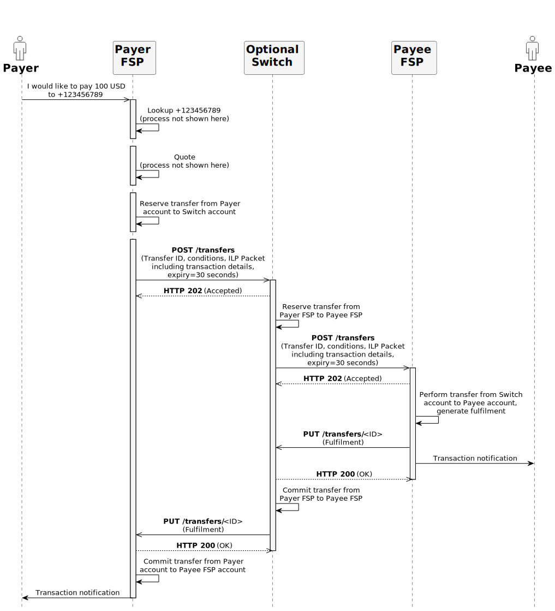


**Figure 52 -- Utilisation du service POST /transfers**

#### Irrévocabilité des transactions

L’API est conçue pour ne supporter que les transactions financières irrévocables ; c’est-à-dire qu’une transaction ne peut pas être modifiée, annulée ou inversée après sa création. Cela vise à simplifier et réduire les coûts pour les FSPs utilisant l’API. Une grande partie du coût opérationnel des systèmes financiers est due à l’inversion des transactions.

Dès qu’un FSP payeur envoie une transaction au FSP bénéficiaire (via **POST /transfers** incluant la transaction de bout en bout), la transaction est irrévocable côté FSP payeur. Elle peut toutefois encore être rejetée côté FSP bénéficiaire, mais le payeur ne peut plus modifier ou rejeter la transaction. Une exception à cela serait si le délai d’expiration du transfert est dépassé avant que le FSP bénéficiaire ne réponde (voir [Quote expirée](#expired-quote) et [Client recevant un transfert expiré](#client-receiving-expired-transfer) pour plus d’informations). Dès que la transaction a été acceptée par le FSP bénéficiaire, elle est irrévocable pour toutes les parties.

#### Cotation expirée

Si un serveur reçoit une transaction utilisant une cotation expirée, il doit refuser le transfert ou la transaction.

#### Timeout et expiration

Le FSP payeur doit toujours définir un temps d’expiration pour le transfert afin de permettre les cas d’utilisation nécessitant un traitement ou un échec rapide. Si le cas d’utilisation ne nécessite pas de réponse rapide, un délai d’expiration plus long peut être fixé. Si le FSP bénéficiaire ne répond pas avant le temps d’expiration, la transaction est annulée côté FSP payeur. Ce dernier doit cependant s’attendre à un callback du bénéficiaire.

Les délais d’expiration courts sont souvent requis dans le commerce de détail, où un client se trouve devant un commerçant ; les deux parties doivent savoir si la transaction a réussi avant la remise d’un produit ou service.

Dans [Figure 52](#figure-52), un délai d’expiration de 30 secondes à partir de l’heure courante a été défini dans la requête du FSP payeur, et de 20 secondes dans la requête du Switch au FSP bénéficiaire. Cette stratégie de réduction du délai à chaque maillon de la chaîne du FSP payeur au bénéficiaire doit toujours être utilisée pour permettre un délai de communication supplémentaire.

**Remarque :** Il est possible qu’un callback de succès soit reçu par le FSP payeur après l’expiration, par exemple lors d’une congestion réseau. Le FSP payeur devrait laisser un délai supplémentaire après l’expiration avant d’annuler la transaction dans le système. Si un callback de succès arrive après annulation, la transaction doit être marquée pour rapprochement et traitée à part.

#### Client recevant un transfert expiré

[Figure 53](#figure-53) illustre un scénario d’erreur lié à l’expiration et au timeout. Pour une raison quelconque, le callback du FSP bénéficiaire prend plus de temps à arriver que le délai d’expiration dans le Switch. Cela conduit le Switch à annuler le transfert réservé et à envoyer un callback d’erreur au FSP payeur. Ainsi, FSP payeur et bénéficiaire ont deux visions différentes du résultat de la transaction ; celle-ci doit être marquée pour rapprochement.

###### Figure 53

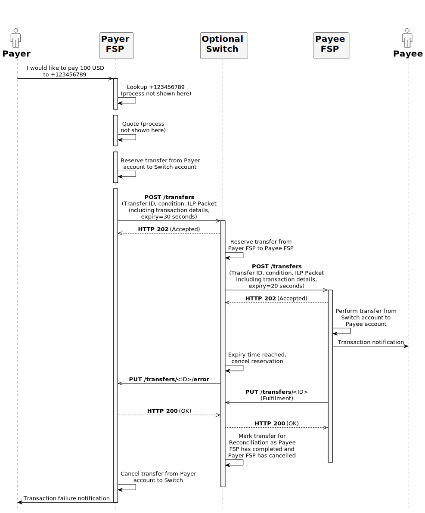


**Figure 53 -- Client recevant un transfert expiré**

Pour limiter ce type d’erreur, les clients (FSP payeur et Switch optionnel dans la [Figure 52](#figure-52)) participant au transfert ILP doivent permettre un délai supplémentaire post expiration permettant de recevoir le callback du serveur. Le(s) client(s) doivent aussi interroger le serveur après expiration et avant la fin du délai supplémentaire en cas de perte du callback. Un rapprochement pourrait néanmoins rester nécessaire, même avec ce délai et une interrogation du serveur.

#### Notification de commit

Comme alternative pour éviter le scénario d’erreur décrit dans [Client recevant un transfert expiré](#client-receiving-expired-transfer), pour les cas où il est compliqué d’effectuer un remboursement, un FSP bénéficiaire peut (si le schéma le permet) réserver le transfert puis attendre la notification de commit émise par le Switch. Demander une notification de commit plutôt qu’un commit direct relève de la décision métier du FSP bénéficiaire (si le schéma l’autorise), selon le contexte de la transaction. Par exemple, un retrait cash ou un paiement commerçant est plus risqué qu’un transfert P2P du fait de la difficulté de remboursement a posteriori.
Pour demander la notification de commit depuis le Switch, le FSP bénéficiaire doit marquer l’état du transfert (voir Section 6.7.6) comme réservé (reserved) au lieu de commis (committed) dans le callback **PUT /transfers/**_{ID}_ . Selon l’état, le Switch doit alors effectuer :

- Si le transfert est commis, le Switch n’envoie pas de notification de commit puisque le FSP bénéficiaire a déjà accepté le risque. C’est la méthode de commit par défaut décrite dans [Processus](#process).
- Si le transfert est réservé, le Switch doit envoyer une notification de commit au FSP bénéficiaire à la fin du traitement (commit ou annulation).

La notification de commit est envoyée avec la requête **PATCH /transfers/**_{ID}_ du Switch au FSP bénéficiaire. Si ce dernier ne reçoit pas la notification dans un délai raisonnable, il doit renvoyer le callback **PUT /transfers/**_{ID}_ au Switch. Le FSP bénéficiaire doit recevoir la notification de commit du Switch avant de commettre le transfert, ou accepter le risque que le transfert ait échoué côté Switch. Il n’a pas le droit de rollbacker sans avoir reçu un état "aborted" (voir Section 6.7.6) du Switch, car il a déjà envoyé le fulfilment (déclencheur du commit).
[Figure 54](#figure-54) illustre un cas où une notification de commit est demandée. Ici, le commit a réussi côté Switch.

###### Figure 54

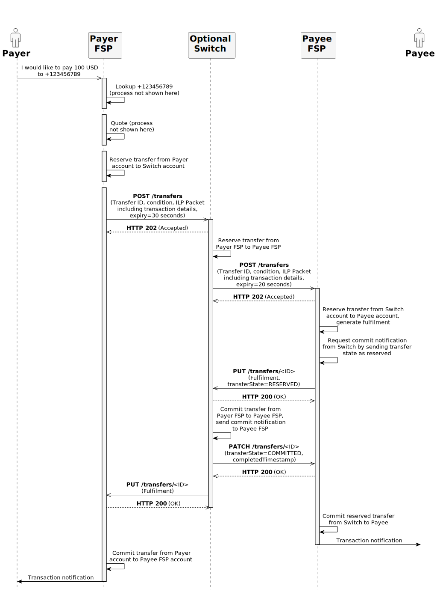


**Figure 54 -- Notification de commit après succès du transfert dans le Switch**

[Figure 55](#figure-55) montre un exemple où le commit dans le Switch a échoué (par exemple expiration du délai dans le Switch à cause d’un incident réseau). C’est le même scénario que [Figure 53](#figure-53), mais sans rapprochement à réaliser car le FSP bénéficiaire reçoit la notification de commit avant de réaliser effectivement le transfert.

###### Figure 55

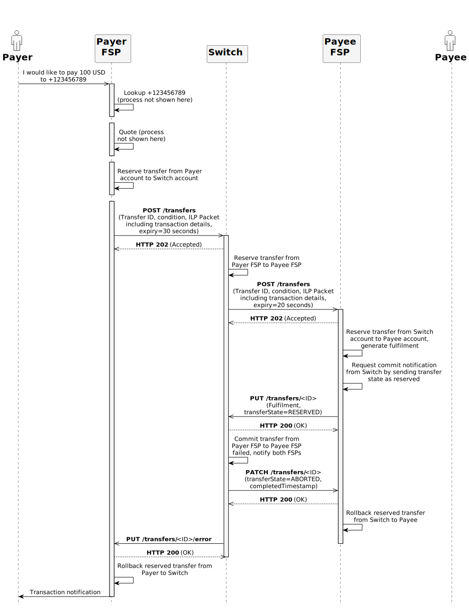


**Figure 55 -- Notification de commit après échec du commit dans le Switch**

#### Remboursements

Au lieu de supporter les inversions, l’API supporte les remboursements. Pour rembourser une transaction via l’API, une nouvelle transaction doit être créée par le bénéficiaire initial. Celle-ci doit annuler la transaction originale (en totalité ou partiellement) ; par exemple, si le client X a envoyé 100 USD au commerçant Y, celui-ci crée une nouvelle transaction pour reverser 100 USD à X. Il existe un type de transaction spécifique pour indiquer un remboursement ; cela permet de gérer différemment la cotation. L’ID de la transaction d’origine doit être inclus dans la nouvelle transaction à des fins d’information et de rapprochement.

#### Demande de paiement Interledger

Dans le cadre du support d’Interledger et de la demande de paiement Interledger (voir [Protocole Interledger](#interledger-protocol)), le FSP payeur doit joindre au transfert le paquet ILP, la condition ainsi qu’une date d’expiration. La condition et le paquet ILP sont les mêmes que ceux envoyés par le FSP bénéficiaire dans le callback de la cotation ; voir [Demande de paiement Interledger](#interledger-payment-request) pour plus d’informations.

Le paiement ILP de bout en bout est une chaîne d’un ou plusieurs transferts conditionnels tous dépendants de la même condition. La condition est fournie par le FSP payeur lors de l’initiation du transfert vers le prochain ledger.

Le récepteur du transfert extrait l’adresse ILP du bénéficiaire dans le paquet ILP et effectue un autre transfert sur le ledger suivant, en joignant le même paquet ILP et condition et en fixant une expiration plus courte que celle du transfert entrant.

Quand le FSP bénéficiaire reçoit le dernier transfert entrant pour le compte du bénéficiaire, il extrait le paquet ILP et procède ainsi :

1. Valide que l’adresse ILP du bénéficiaire dans le paquet ILP correspond au compte bénéficiaire de destination.
2. Valide que le montant dans le paquet ILP correspond au montant du transfert et déclenche la réservation sur le registre local (moins les éventuels frais cachés au bénéficiaire, voir [Cotations](#quoting)).
3. Si la réservation est un succès, le FSP bénéficiaire génère le fulfilment à l’aide du même algorithme que celui utilisé pour générer la condition envoyée dans le callback de la cotation (voir [Demande de paiement Interledger](#interledger-payment-request)).
4. Le fulfilment est soumis au registre du FSP bénéficiaire pour engager la réservation en faveur du bénéficiaire. Le registre valide que le hash SHA-256 du fulfilment correspond à la condition du transfert. Si oui, il valide la transaction. Sinon, il la rejette, et le FSP bénéficiaire annule la réservation préalablement effectuée.

Le fulfilment est ensuite transmis au FSP payeur via la même chaîne de registres dans le callback du transfert. Chaque ledger engage les fonds après validation du fulfilment, et l’entité initiatrice est notifiée que ses fonds ont été libérés et reçoit le fulfilment.

Le dernier transfert à engager est celui sur le registre du FSP payeur, où la réservation est déduite de son compte. Le FSP payeur notifie alors le payeur du succès de la transaction.

#### Requêtes

Cette section décrit les services pouvant être demandés par un client de l’API sur la ressource **/transfers**.

##### GET /transfers/_{ID}_

URI alternative : N/A

Service logique d’API : [Retourner le résultat de l’autorisation](../generic-transaction-patterns#return-authorization-result)

La requête HTTP **GET /transfers/**_{ID}_ est utilisée pour obtenir des informations sur un transfert créé ou demandé précédemment. Le _{ID}_ dans l’URI doit contenir le **transferId** (voir [Tableau 23](#table-23)) utilisé lors de la création du transfert.

Informations sur les callbacks et modèle de données pour **GET /transfers/**_{ID}_ :

- Callback -- [**PUT /transfers/**_{ID}_](#put-transfersid)
- Callback d’erreur -- [**PUT /transfers/**_{ID}_**/error**](#put-transfersiderror)
- Modèle de données -- Corps vide

##### POST /transfers

URI alternative : N/A

Service logique d’API : [Effectuer le transfert](../generic-transaction-patterns#perform-transfer)

La requête HTTP **POST /transfers** est utilisée pour demander la création d’un transfert pour le prochain ledger, et une transaction financière pour le FSP bénéficiaire.

Informations sur les callbacks et modèle de données pour **POST /transfers** :

- Callback -- [**PUT /transfers/**_{ID}_](#put-transfersid)
- Callback d’erreur -- [**PUT /transfers/**_{ID}_**/error**](#put-transfersiderror)
- Modèle de données -- Voir [Tableau 30](#table-30)

###### Tableau 30

| **Nom** | **Cardinalité** | **Type** | **Description** |
| --- | --- | --- | --- |
| **transferId** | 1| CorrelationId | Identifiant commun entre les FSPs et le Switch optionnel pour l’objet de transfert, défini par le FSP payeur. À réutiliser pour les rééditions, à régénérer pour chaque nouveau transfert. |
| **payeeFsp** | 1 | FspId | FSP bénéficiaire dans la transaction financière proposée. |
| **payerFsp** | 1 | FspId | FSP payeur dans la transaction financière proposée. |
| **amount** | 1 | Money | Montant à transférer. |
| **ilpPacket** | 1 | IlpPacket | Paquet ILP contenant le montant remis au bénéficiaire, l’adresse ILP du bénéficiaire et toutes données end-to-end. |
| **condition** | 1 | IlpCondition | Condition devant être remplie pour engager le transfert. |
| **expiration** | 1 | DateTime | L’expiration permet de générer un échec rapide si besoin. Le transfert doit être annulé si aucun fulfilment n’est délivré avant cette limite. |
| **extensionList** | 0..1 | ExtensionList | Extension optionnelle, spécifique au déploiement. |

**Tableau 30 – Modèle de données POST /transfers**

##### PATCH /transfers/_{ID}_

URI alternative : N/A

Service logique d’API : [Notification de commit](../generic-transaction-patterns#commit-notification)

La requête HTTP **PATCH /transfers/**_{ID}_ est utilisée par un Switch pour mettre à jour l’état d’un transfert réservé si le FSP bénéficiaire a demandé une notification de commit, une fois le traitement terminé côté Switch. Le _{ID}_ doit contenir le transferId (voir Tableau 30) utilisé pour la création du transfert. Notez que cette requête ne génère pas de callback. Voir Tableau 31 pour le modèle de données.

###### Tableau 31

| **Nom** | **Cardinalité** | **Type** | **Description** |
| --- | --- | --- | --- |
| **completedTimestamp** | 1| DateTime | Date et heure d’achèvement de la transaction |
| **transferState** | 1 | TransferState | État du transfert |
| **extensionList** | 0..1 | ExtensionList | Extension optionnelle, spécifique au déploiement. |

**Tableau 31 – Modèle de données PATCH /transfers/_{ID}_**

#### Callbacks

Cette section décrit les callbacks utilisés par le serveur sous la ressource **/transfers**.

##### PUT /transfers/_{ID}_

URI alternative : N/A

Service logique d’API : [Retourner les informations du transfert](../generic-transaction-patterns#return-transfer-information)

Le callback **PUT /transfers/**_{ID}_ est utilisé pour informer le client d’un transfert demandé ou créé. Le _{ID}_ dans l’URI doit contenir le **transferId** (voir [Tableau 30](#table-30)) utilisé à la création ou celui utilisé dans le [**GET** **/transfers/**_{ID}_](#6731-get-transfersid). **Voir** [Tableau 32](#table-32) **pour** le modèle de données.

**Remarque** : pour les callbacks **PUT /transfers/**_{ID}_ , l’état ABORTED n’est pas une option valide pour le champ **transferState** en Tableau 32. Si un transfert doit être rejeté, l’émetteur du callback doit utiliser un callback d’erreur, c’est-à-dire callback sur l’endpoint /error. Cependant, l’état ‘ABORTED’ est valide en réponse à un appel **GET /transfers/**_{ID}_ .

###### Tableau 32

| **Nom** | **Cardinalité** | **Type** | **Description** |
| --- | --- | --- | --- |
| **fulfilment** | 0..1 | IlpFulfilment | Fulfilment (accomplissement) de la condition spécifiée avec la transaction. Obligatoire en cas de succès du transfert. |
| **completedTimestamp** | 0..1 | DateTime | Date et heure d’achèvement de la transaction |
| **transferState** | 1 | TransferState | État du transfert |
| **extensionList** | 0..1 | ExtensionList | Extension optionnelle, spécifique au déploiement |

**Tableau 32 -- Modèle de données PUT /transfers/_{ID}_**

#### Callbacks d’erreur

Cette section décrit les callbacks d’erreur utilisés par le serveur sous la ressource **/transfers**.

##### PUT /transfers/_{ID}_/error

URI alternative : N/A

Service logique d’API : [Retourner une erreur d’information de transfert](../generic-transaction-patterns#return-transfer-information-error)

Si le serveur ne trouve pas ou ne crée pas un transfert, ou qu’une autre erreur de traitement survient, le callback d’erreur **PUT**

**/transfers/**_{ID}_**/error** est utilisé. Le _{ID}_ dans l’URI doit être le **transferId** (voir [Tableau 30](#table-30)) utilisé lors de la création du transfert, ou celui utilisé dans le [**GET /transfers/**_{ID}_](#6731-get-transfersid). Voir [Tableau 33](#table-33) pour le modèle de données.

###### Tableau 33

| **Nom** | **Cardinalité** | **Type** | **Description** |
| --- | --- | --- | --- |
| **errorInformation** | 1 | ErrorInformation | Code d’erreur, description de la catégorie. |

**Tableau 33 -- Modèle de données PUT /transfers/_{ID}_/error**

**6.7.6 États**

###### Figure 56

Les états possibles d’un transfert sont représentés dans [Figure 56](#figure-56).

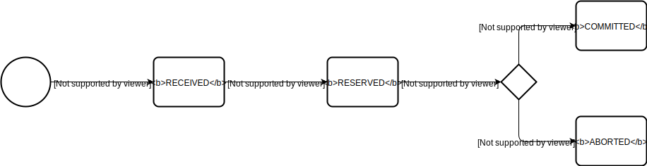

**Figure 56 -- États possibles d’un transfert**

<br />


### Ressource d’API /transactions

Cette section définit la ressource logique d’API **Transactions**, décrite dans [Modèles de transaction génériques](../generic-transaction-patterns#api-resource-transactions).

Les services fournis par la ressource **/transactions** permettent d’obtenir des informations sur la transaction financière de bout en bout exécutée ; par exemple, obtenir les détails d’un éventuel code/ticket généré lors de la transaction.

La transaction financière réelle est exécutée via la ressource d’API [**/transfers**](#67-api-resource-transfers), qui inclut la transaction de bout en bout entre le FSP payeur et le FSP bénéficiaire.

#### Historique des versions de la ressource

[Tableau 34](#table-34) décrit les différentes versions de la ressource **/transactions**.

###### Tableau 34

|Version|Date|Description|
|---|---|---|
|1.0|2018-03-13|Version initiale|

**Tableau 34 – Historique des versions de la ressource /transactions**

#### Détails des services

[Figure 57](#figure-57) montre un exemple du processus de transaction. La transaction réelle sera exécutée lors du processus de transfert. Le service **GET /transactions/**_{TransactionID}_ peut ensuite être utilisé pour obtenir plus d’informations sur la transaction financière exécutée lors du transfert.

###### Figure 57

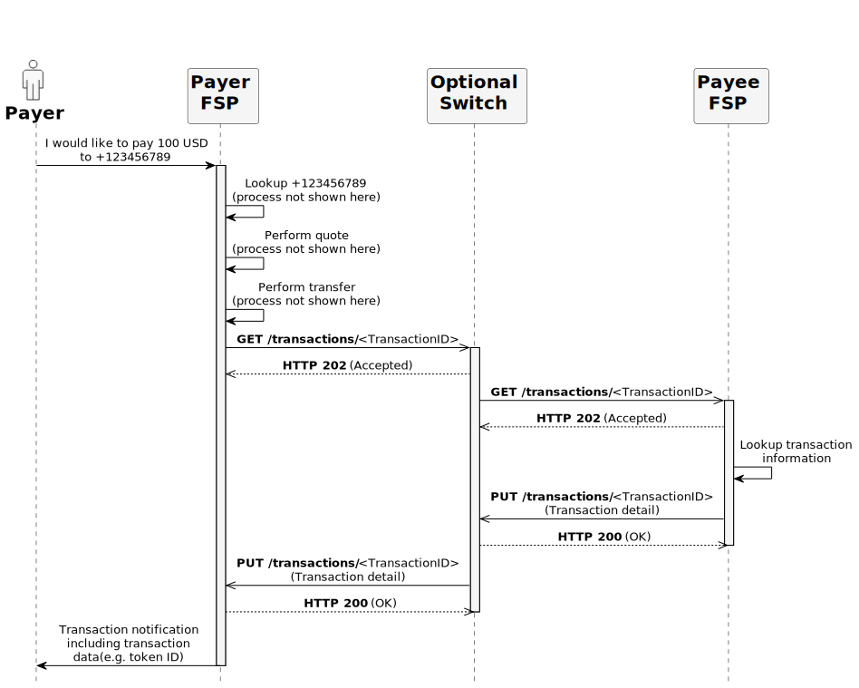


**Figure 57 -- Exemple de processus de transaction**

#### Requêtes

Cette section décrit les services pouvant être demandés par un client sur la ressource **/transactions**.

##### GET /transactions/_{ID}_

URI alternative : N/A

Service logique d’API : [Récupérer les informations sur la transaction](../generic-transaction-patterns#retrieve-transaction-information)

La requête HTTP **GET /transactions/**_{ID}_ est utilisée pour obtenir des informations sur une transaction financière précédemment créée. Le _{ID}_ doit correspondre au **transactionId** utilisé lors de la création de la cotation (voir [Tableau 23](#table-23)), car la transaction est créée dans le cadre d’un autre processus (le transfert, voir [API Resource Transfers](#api-resource-transfers)).

Informations sur les callbacks et modèles de données pour **GET /transactions/**_{ID}_ :

- Callback -- [**PUT /transactions/**_{ID}_](#put-transactionsid)
- Callback d’erreur -- [**PUT /transactions/**_{ID}_**/error**](#put-transactionsiderror)
- Modèle de données -- Corps vide

#### Callbacks

Cette section décrit les callbacks utilisés par le serveur sous la ressource **/transactions**.

#####  PUT /transactions/_{ID}_

URI alternative : N/A

Service logique d’API : [Retourner les informations de la transaction](../generic-transaction-patterns#return-transaction-information)

Le callback **PUT /transactions/**_{ID}_ est utilisé pour informer le client d’une transaction demandée. Le _{ID}_ doit être celui utilisé dans le [**GET /transactions/**_{ID}_](#get-transactionsid). Voir [Tableau 35](#table-35) pour le modèle de données.

###### Tableau 35

| **Nom** | **Cardinalité** | **Type** | **Description** |
| --- | --- | --- | --- |
| **completedTimestamp** | 0..1 | DateTime | Date et heure d’achèvement de la transaction. |
| **transactionState** | 1 | TransactionState | État de la transaction. |
| **code** | 0..1 | Code | Information de code/jeton de rédemption optionnelle fournie au payeur après finalisation de la transaction. |
| **extensionList** | 0..1 | ExtensionList | Extension optionnelle, spécifique au déploiement. |

**Tableau 35 -- Modèle de données PUT /transactions/_{ID}_**

#### Callbacks d’erreur

Cette section décrit les callbacks d’erreur utilisés par le serveur sous la ressource **/transactions**.

##### PUT /transactions/_{ID}_/error

URI alternative : N/A

Service logique d’API : [Retourner une erreur concernant la transaction](../generic-transaction-patterns#retrieve-transaction-information-error)

Si le serveur ne parvient pas à trouver ou créer une transaction, ou en cas d’erreur de traitement, le callback d’erreur **PUT** **/transactions/**_{ID}_**/error** est utilisé. Le _{ID}_ doit être celui utilisé dans le [**GET /transactions/**_{ID}_](#get-transactionsid). Voir [Tableau 36](#table-36) pour le modèle de données.

###### Tableau 36

| **Nom** | **Cardinalité** | **Type** | **Description** |
| --- | --- | --- | --- |
| **errorInformation** | 1 | ErrorInformation | Code d’erreur, description de la catégorie. |

**Tableau 36 -- Modèle de données PUT /transactions/_{ID}_/error**

#### États

###### Figure 58

Les états possibles d'une transaction sont illustrés à la [Figure 58](#figure-58).

**Remarque :** À des fins de rapprochement, un serveur doit conserver dans sa base de données, pendant une période définie par le système, les objets transactionnels ayant été rejetés. Cela signifie qu’un client peut s’attendre à recevoir un callback approprié concernant une transaction (si celle-ci a bien été reçue par le serveur) lorsqu’il demande des informations à son sujet.


**Figure 58 -- États possibles d'une transaction**

<br />

### Ressource API /bulkQuotes

Cette section définit la ressource logique d'API **Bulk Quotes** (Devis en lot), comme décrit dans [Modèles de transactions génériques](../generic-transaction-patterns#api-resource-bulk-quotes).

Les services fournis par la ressource API **/bulkQuotes** sont utilisés pour demander la création d’un devis en lot, c’est-à-dire un devis pour plus d’une transaction financière. Pour plus d’informations concernant un devis unique pour une transaction, voir la ressource API [/quotes](#api-resource-quotes).

Un objet de devis en lot créé contient un devis pour chaque transaction individuelle du lot au sein d’un FSP Pair. Un devis en lot est irrévocable ; il ne peut pas être modifié après sa création. Toutefois, il peut expirer (tous les devis en lot ne sont valables que jusqu’à leur expiration).

**Remarque :** Un devis en lot n’est pas une garantie de réussite de la transaction financière. La transaction en lot peut toujours échouer ultérieurement dans le processus. Un devis en lot garantit seulement que les frais et commissions FSP applicables à l'opération spécifiée restent valables tant que le devis n’est pas expiré.

#### Historique des versions de la ressource

Le Tableau 37 présente une description de chaque version différente de la ressource **/bulkQuotes**.

| Version | Date | Description|
| ---- | ---- | ---- |
| **1.0** | 2018-03-13 | Version initiale |
| **1.1** | 2020-05-19 | Le modèle de données a été mis à jour pour ajouter un élément optionnel ExtensionList au type complexe PartyIdInfo suite à la demande de changement : https://github.com/mojaloop/mojaloop-specification/issues/30. Par la suite, le modèle de données tel que spécifié dans le Tableau 93 a été mis à jour.|

**Tableau 37 –- Historique des versions pour la ressource /bulkQuotes**

#### Détails du service

La [Figure 59](#figure-59) illustre le fonctionnement du processus de devis en lot, utilisant le service **POST /bulkQuotes**. À la réception d’un lot de transactions de la part du Payeur, le FSP du Payeur doit :

1. Rechercher à quel FSP appartient chaque Bénéficiaire ; par exemple, en utilisant la ressource API [/participants](#api-resource-participants).

2. Diviser le lot selon le FSP du Bénéficiaire. Le service **POST /bulkQuotes** est alors utilisé pour chaque FSP de Bénéficiaire pour obtenir les devis en lot de chacun. Chaque résultat de devis contiendra le paquet ILP et la condition (voir [Paquet ILP](#ilp-packet) et [Transferts conditionnels](#conditional-transfers)) nécessaires pour effectuer chaque transfert dans le transfert en lot (voir la ressource API [/bulkTransfers](#api-resource-bulktransfers)), qui réalisera effectivement la transaction financière du Payeur vers chaque Bénéficiaire.

###### Figure 59

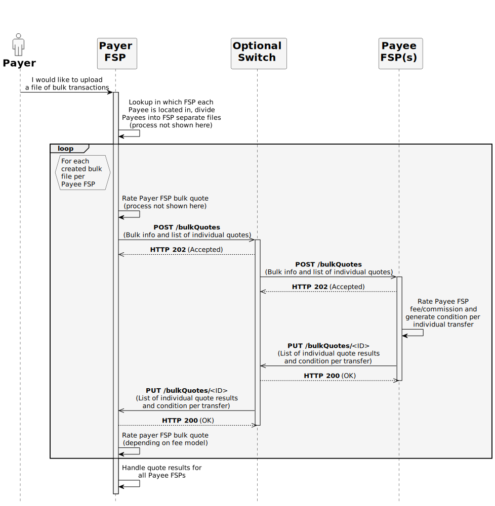

**Figure 59 -- Exemple de processus de devis en lot**

#### Requêtes

Cette section décrit les services pouvant être demandés par un client sur la ressource API **/bulkQuotes**.

##### GET /bulkQuotes/_{ID}_

URI alternative : N/A

Service logique d’API : [Récupérer les informations du devis en lot](../generic-transaction-patterns#retrieve-bulk-quote-information)

La requête HTTP **GET /bulkQuotes/**_{ID}_ est utilisée pour obtenir des informations concernant un devis en lot préalablement créé ou demandé.

Le _{ID}_ de l’URI doit contenir le **bulkQuoteId** (voir [Tableau 38](#table-38)) utilisé pour la création du devis en lot.

Informations sur les callbacks et le modèle de données pour **GET /bulkQuotes/**_{ID}_ :

- Callback -- [PUT /bulkQuotes/**_{ID}_](#put-bulkquotesid)
- Callback d’erreur -- [PUT /bulkQuotes/**_{ID}_**/error**](#put-bulkquotesiderror)
- Modèle de données -- Corps vide

##### POST /bulkQuotes

URI alternative : N/A

Service logique d’API : **Calculer un devis en lot**

La requête HTTP **POST /bulkQuotes** est utilisée pour demander la création d’un devis en lot pour les transactions financières fournies sur le serveur.

Informations sur les callbacks et le modèle de données pour **POST /bulkQuotes** :

- Callback -- [**PUT /bulkQuotes/**_{ID}_](#6941-put-bulkquotesid)
- Callback d’erreur -- [**PUT /bulkQuotes/**_{ID}_**/error**](#6951-put-bulkquotesiderror)
- Modèle de données -- Voir [Tableau 38](#table-38)

###### Tableau 38

| **Nom** | **Cardinalité** | **Type** | **Description** |
| --- | --- | --- | --- |
| **bulkQuoteId** | 1 | CorrelationId | Identifiant commun entre les FSPs pour l'objet devis en lot, décidé par le FSP du Payeur. L’ID doit être réutilisé pour les renvois du même devis en lot. Un nouvel ID doit être généré pour chaque nouveau devis en lot. |
| **payer** | 1 | Party | Informations sur le Payeur dans la transaction financière proposée. |
| **geoCode** | 0..1 | GeoCode | Longitude et latitude de la Partie initiatrice. Peut être utilisé pour détecter une fraude. |
| **expiration** | 0..1 | DateTime | L’expiration est optionnelle et permet au FSP du Bénéficiaire de savoir quand un devis n’a plus besoin d’être renvoyé. |
| **individualQuotes** | 1..1000 | IndividualQuote | Liste des éléments de devis individuels. |
| **extensionList** | 0..1 | ExtensionList | Extension optionnelle, spécifique au déploiement. |

**Tableau 38 -- Modèle de données POST /bulkQuotes**

#### Callbacks

Cette section décrit les callbacks utilisés par le serveur sous la ressource **/bulkQuotes**.

##### PUT /bulkQuotes/_{ID}_

URI alternative : N/A

Service logique d’API : [Retourner les informations du devis en lot](../generic-transaction-patterns#return-bulk-quote-information)

Le callback **PUT /bulkQuotes/**_{ID}_ est utilisé pour informer le client d’un devis en lot demandé ou créé. Le _{ID}_ de l’URI doit contenir le **bulkQuoteId** (voir [Tableau 38](#table-38)) utilisé pour la création du devis en lot, ou le _{ID}_ qui a été utilisé dans le [**GET /bulkQuotes/**_{ID}_](#6931-get-bulkquotesid). Voir [Tableau 39](#table-39) pour le modèle de données.

###### Tableau 39

| **Nom** | **Cardinalité** | **Type** | **Description** |
| --- | --- | --- | --- |
| **individualQuoteResults** | 0..1000 | IndividualQuoteResult | Frais pour chaque transaction individuelle, si certains sont facturés par transaction. |
| **expiration** | 1 |  DateTime | Date et heure jusqu'à laquelle le devis est valable et peut être honoré dans une demande de transaction ultérieure. |
| **extensionList** | 0..1 | ExtensionList | Extension optionnelle, spécifique au déploiement. |

**Tableau 39 -- Modèle de données PUT /bulkQuotes/_{ID}_**

#### Callbacks d’erreur

Cette section décrit les callbacks d’erreur utilisés par le serveur sous la ressource **/bulkQuotes**.

##### PUT /bulkQuotes/_{ID}_/error

URI alternative : N/A

Service logique d’API : [Retourner une erreur concernant le devis en lot](../generic-transaction-patterns#retrieve-bulk-quote-information-error)

Si le serveur ne parvient pas à trouver ou créer un devis en lot, ou en cas d’erreur de traitement, le callback d’erreur **PUT** **/bulkQuotes/**_{ID}_**/error** est utilisé. Le _{ID}_ de l’URI doit contenir le **bulkQuoteId** (voir [Tableau 38](#table-38)) utilisé pour la création du devis, ou le _{ID}_ utilisé dans le [**GET /bulkQuotes/**_{ID}_](#6931-get-bulkquotesid). Voir [Tableau 40](#table-40) pour le modèle de données.

###### Tableau 40

| **Nom** | **Cardinalité** | **Type** | **Description** |
| --- | --- | --- | --- |
| **errorInformation** | 1 | ErrorInformation | Code d’erreur, description de la catégorie. |

**Tableau 40 -- Modèle de données PUT /bulkQuotes/_{ID}_/error**

#### États

###### Figure 60

Les états possibles d’un devis en lot sont illustrés à la [Figure 60](#figure-60).

**Remarque :** Un serveur n’a pas besoin de conserver dans sa base de données les objets de devis en lot qui ont été rejetés ou expirés. Cela signifie qu’un client doit s’attendre à recevoir un callback d’erreur pour un devis en lot rejeté ou expiré.


**Figure 60 -- États possibles d’un devis en lot**

<br />

### Ressource API /bulkTransfers

Cette section définit la ressource logique d'API **Bulk Transfers** (Transferts en lot), comme décrit dans [Modèles de transactions génériques](../generic-transaction-patterns#api-resource-bulk-transfers).

Les services fournis par la ressource API **/bulkTransfers** sont utilisés pour demander la création d’un transfert en lot ou pour obtenir des informations sur un transfert en lot précédemment demandé. Pour plus d'informations sur un transfert individuel, voir la ressource API [/transfers](#api-resource-transfers). Avant qu’un transfert en lot ne puisse être demandé, un devis en lot doit être réalisé. Voir la ressource API [/bulkQuotes](#api-resource-bulkquotes) pour plus d’informations.

Un transfert en lot est irrévocable ; il ne peut pas être modifié, annulé ou inversé après avoir été envoyé par le FSP du Payeur.

#### Historique des versions de la ressource

Le Tableau 41 présente une description de chaque version différente de la ressource **/bulkTransfers**.

| Version | Date | Description|
| ---- | ---- | ---- |
| **1.0** | 2018-03-13 | Version initiale |
| **1.1** | 2020-05-19 | Le modèle de données a été mis à jour pour ajouter un élément optionnel ExtensionList au type complexe PartyIdInfo suite à la demande de changement : https://github.com/mojaloop/mojaloop-specification/issues/30. Par la suite, le modèle de données tel que spécifié dans le Tableau 93 a été mis à jour.|

**Tableau 41 –- Historique des versions pour la ressource /bulkTransfers**

#### Détails du service

La [Figure 61](#figure-61) illustre le fonctionnement du processus de transfert en lot utilisant le service **POST /bulkTransfers**. Lors de la réception des transactions groupées du Payeur, le FSP du Payeur doit effectuer les étapes suivantes :

1. Rechercher à quel FSP appartient chaque Bénéficiaire ; par exemple, en utilisant la ressource API **/participants**, [Section 6.2](#62-api-resource-participants).
2. Effectuer le processus de devis en lot en utilisant la ressource API **/bulkQuotes**, [Section 6.9](#69-api-resource-bulkquotes). Le callback du devis en lot doit contenir les paquets ILP requis et les conditions nécessaires à l’exécution de chaque transfert.
3. Effectuer le processus de transfert en lot comme dans la [Figure 61](#figure-61) en utilisant **POST /bulkTransfers**. Ceci réalise chaque transfert “hop-to-hop” et la transaction financière de bout en bout. Pour plus d’informations sur les transferts “hop-to-hop” versus les transactions financières de bout en bout, voir [Section 6.7](#67-api-resource-transfers).

###### Figure 61

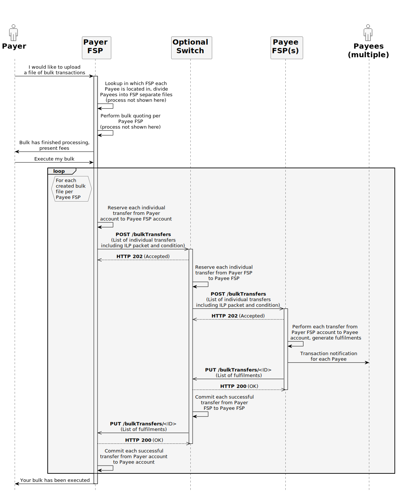

**Figure 61 -- Exemple de processus de transfert en lot**

#### Requêtes

Cette section décrit les services pouvant être demandés par un client sur la ressource **/bulkTransfers**.

##### GET /bulkTransfers/_{ID}_

URI alternative : N/A

Service logique d’API : [Récupérer les informations du transfert en lot](../generic-transaction-patterns#retrieve-bulk-transfer-information)

La requête HTTP **GET /bulkTransfers/**_{ID}_ est utilisée pour obtenir des informations concernant un transfert en lot préalablement créé ou demandé. Le _{ID}_ de l’URI doit contenir le **bulkTransferId** (voir [Tableau 42](#table-42)) utilisé pour la création du transfert.

Informations sur les callbacks et le modèle de données pour **GET /bulkTransfers/**_{ID}_ :

- Callback -- [PUT /bulkTransfers/_{ID}_](#put-bulktransfersid)
- Callback d’erreur -- [PUT /bulkTransfers/_{ID}_/error](#put-bulktransfersiderror)
- Modèle de données -- Corps vide

##### POST /bulkTransfers

URI alternative : N/A

Service logique d’API : [Exécuter un transfert en lot](../generic-transaction-patterns#perform-bulk-transfer)

La requête HTTP **POST /bulkTransfers** est utilisée pour demander la création d’un transfert en lot sur le serveur.

- Callback - [PUT /bulkTransfers/_{ID}_](#put-bulktransfersid)
- Callback d’erreur - [PUT /bulkTransfers/_{ID}_/error](#put-bulktransfersiderror)
- Modèle de données -- Voir [Tableau 42](#table-42)

###### Tableau 42

| **Nom** | **Cardinalité** | **Type** | **Description** |
| --- | --- | --- | --- |
| **bulkTransferId** | 1 | CorrelationId | Identifiant commun entre les FSPs et éventuellement le Switch pour l'objet transfert en lot, décidé par le FSP du Payeur. L’ID doit être réutilisé pour les renvois du même transfert en lot. Un nouvel ID doit être généré pour chaque nouveau transfert en lot. |
| **bulkQuoteId** | 1 | CorrelationId | ID du devis en lot associé |
| **payeeFsp** | 1 | FspId | Identifiant du FSP du Bénéficiaire. |
| **payerFsp** | 1 | FspId | Identifiant du FSP du Payeur. |
| **individualTransfers** | 1..1000 | IndividualTransfer | Liste des éléments IndividualTransfer. |
| **expiration** | 1 | DateTime | Date d’expiration des transferts. |
| **extensionList** | 0..1 | ExtensionList | Extension optionnelle, spécifique au déploiement. |

**Tableau 42 -- Modèle de données POST /bulkTransfers**

#### Callbacks

Cette section décrit les callbacks utilisés par le serveur sous la ressource **/bulkTransfers**.

##### PUT /bulkTransfers/_{ID}_

URI alternative : N/A

Service logique d’API : [Récupérer les informations du transfert en lot](../generic-transaction-patterns#retrieve-bulk-transfer-information)

Le callback **PUT /bulkTransfers/**_{ID}_ est utilisé pour informer le client d’un transfert en lot demandé ou créé. Le _{ID}_ de l’URI doit contenir le **bulkTransferId** (voir [Tableau 42](#table-42)) utilisé pour la création du transfert ([POST /bulkTransfers](#post-bulktransfers)), ou le _{ID}_ utilisé dans le [GET /bulkTransfers/_{ID}_](#get-bulktransfersid). Voir [Tableau 43](#table-43) pour le modèle de données.

###### Tableau 43

| **Nom** | **Cardinalité** | **Type** | **Description** |
| --- | --- | --- | --- |
| **completedTimestamp** | 0..1 | DateTime | Date et heure de la finalisation de la transaction de lot. |
| **individualTransferResults** | 0..1000 | **Erreur ! Source de référence introuvable.** | Liste des éléments **Erreur ! Source de référence introuvable.** |
| **bulkTransferState** | 1 | BulkTransferState | État du transfert en lot. |
| **extensionList** | 0..1 | ExtensionList | Extension optionnelle, spécifique au déploiement. |

**Tableau 43 -- Modèle de données PUT /bulkTransfers/_{ID}_**

#### Callbacks d’erreur

Cette section décrit les callbacks d’erreur utilisés par le serveur sous la ressource **/bulkTransfers**.

##### PUT /bulkTransfers/_{ID}_/error

URI alternative : N/A

Service logique d’API : [Retourner une erreur concernant le transfert en lot](../generic-transaction-patterns#retrieve-bulk-transfer-information-error)

Si le serveur ne parvient pas à trouver ou créer un transfert en lot, ou en cas d’erreur de traitement, le callback d’erreur **PUT /bulkTransfers/**_{ID}_**/error** est utilisé. Le _{ID}_ de l’URI doit contenir le **bulkTransferId** (voir [Tableau 42](#table-42)) utilisé pour la création du transfert ([POST /bulkTransfers](#post-bulktransfers)), ou le _{ID}_ utilisé dans le [GET /bulkTransfers/_{ID}_](#get-bulktransfersid). Voir [Tableau 44](#table-44) pour le modèle de données.

###### Tableau 44

| **Nom** | **Cardinalité** | **Type** | **Description** |
| --- | --- | --- | --- |
| **errorInformation** | 1 | ErrorInformation | Code d’erreur, description de la catégorie. |

**Tableau 44 -- Modèle de données PUT /bulkTransfers/_{ID}_/error**

#### États

###### Figure 62

Les états possibles d’un transfert en lot sont illustrés à la [Figure 62](#figure-62).

**Remarque :** À des fins de rapprochement, un serveur doit conserver dans sa base de données les objets de transfert en lot ayant été rejetés durant une période définie par le marché. Cela signifie qu’un client peut s’attendre à recevoir un callback approprié concernant un transfert en lot (si celui-ci a bien été reçu par le serveur) lorsqu’il demande des informations à son sujet.

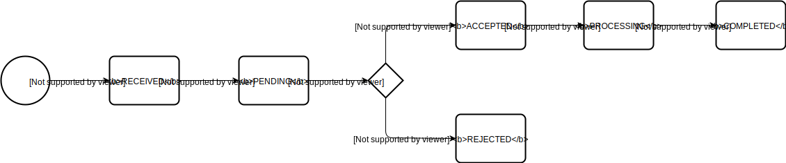

**Figure 62 -- États possibles d’un transfert en lot**

<br />

## Modèles de données de support de l’API

Cette section fournit des informations sur des modèles de données complémentaires utilisés par l’API.

### Introduction sur le format

Cette section introduit les formats utilisés pour les types de données des éléments employés par l’API.

Tous les types de données d’élément ont à la fois une longueur minimale et maximale. Ces longueurs sont indiquées de l’une des façons suivantes :

- Une longueur minimale et maximale
- Une longueur exacte
- Une expression régulière limitant l’élément de façon à n’autoriser qu’une ou plusieurs longueurs spécifiques.

#### Longueur minimale et maximale

Lorsqu’une longueur minimale et maximale est utilisée, cela sera indiqué après le type de données entre parenthèses : d’abord la valeur minimale (incluse), suivie de deux points consécutifs, puis la valeur maximale (incluse).

Exemples :

- `String(1..32)` – Une chaîne de caractères d’au moins un caractère et au maximum 32 caractères.
- `Integer(3..10)` - Un entier d’au moins 3 chiffres et au maximum 10 chiffres.

#### Longueur exacte

Lorsqu’une longueur exacte est utilisée, cela sera indiqué après le type de données entre parenthèses contenant une seule valeur exacte. Les autres longueurs ne sont pas permises.

Exemples :

- `String(3)` – Une chaîne de caractères d’exactement trois caractères.
- `Integer(4)` – Un entier d’exactement quatre chiffres.

#### Expressions régulières

Certains types de données d’élément sont limités par des expressions régulières. Les expressions régulières dans ce document utilisent la norme de syntaxe et les classes de caractères établies par le langage de programmation Perl<sup>[30](https://perldoc.perl.org/perlre.html#Regular-Expressions)</sup>.

### Formats des types de données d’éléments

Cette section définit les types de données d’éléments utilisés par l’API.


#### String

Le type de données API `String` est une chaîne JSON normale<sup>[31](https://tools.ietf.org/html/rfc7159#section-7)</sup>, limitée par un nombre maximum et minimum de caractères.

##### Exemple de format I

`String(1..32)` – Une chaîne de caractères d’au moins *1* caractère et au maximum *32* caractères.

Un exemple de `String(1..32)` apparaît ci-dessous :

- _Cette chaîne fait 28 caractères_

##### Exemple de format II

`String(1..128)` – Une chaîne de caractères d’au moins *1* caractère et au maximum *128* caractères.

Un exemple de `String(32..128)` apparaît ci-dessous :

- _Cette chaîne est plus longue que 32 caractères, mais inférieure à 128_

<br />

#### Enum

Le type de données API `Enum` est une liste restreinte de valeurs JSON [String](#string)) autorisées ; une énumération de valeurs. D’autres valeurs que celles définies dans la liste ne sont pas autorisées.

##### Exemple de format

`Enum of String(1..32)` – Une chaîne de caractères d’au moins un caractère et au maximum 32 caractères restreinte par la liste des valeurs autorisées. La description de l’élément contient un lien vers l’énumération.

<br />

#### UndefinedEnum

Le type de données d’API **UndefinedEnum** est une chaîne JSON constituée de 1 à 32 caractères en majuscule, incluant le caractère de soulignement (\*\*_**\*\*).

##### Expression régulière

L’expression régulière limitant le type **UndefinedEnum** apparaît dans [Liste 13](#listing-13).

###### Liste 13

```
^[A-Z_]{1,32}$
```

**Liste 13 -- Expression régulière pour le type de données UndefinedEnum**

<br />

#### Name

Le type de données API `Name` est une chaîne JSON, restreinte par une expression régulière pour éviter les caractères généralement non utilisés dans un nom.

##### Expression régulière

L’expression régulière limitant le type `Name` apparaît dans la [Liste 14](#listing-14) ci-dessous. La contrainte n’autorise pas une chaîne constituée uniquement d’espaces, tous les caractères Unicode32 sont autorisés, ainsi que le point (**.**), l’apostrophe (**'**), le tiret (**-**), la virgule (**,**) et l’espace ( ). Le nombre maximal de caractères pour **Name** est 128.

**Remarque :** Dans certains langages de programmation, le support Unicode doit être explicitement activé. Par exemple, si Java est utilisé, il faut activer le flag `UNICODE_CHARACTER_CLASS` pour permettre les caractères Unicode.

###### Liste 14

```
^(?!\s*$)[\w .,'-]{1,128}$
```

**Liste 14 -- Expression régulière pour le type de données Name**

<br />

#### Integer

Le type de données API `Integer` est une chaîne JSON composée uniquement de chiffres. Les nombres négatifs et les zéros initiaux ne sont pas autorisés. Le type de données est toujours limité par un nombre de chiffres.

##### 7.2.5.1 Expression régulière

L’expression régulière restreignant le type `Integer` apparaît à la [Liste 15](#listing-15).

###### Liste 15

```
^[1-9]\d*$
```

**Liste 15 -- Expression régulière pour le type de données Integer**


##### Exemple de format

`Integer(1..6)` – Un `Integer` d’au moins un chiffre et de six chiffres au maximum.

Un exemple de `Integer(1..6)` apparaît ci-dessous :

- _123456_

<br />

#### OtpValue

Le type de données API `OtpValue` est une chaîne JSON de trois à dix caractères composée uniquement de chiffres. Les nombres négatifs ne sont pas autorisés. Un ou plusieurs zéros initiaux sont autorisés.

##### Expression régulière

L’expression régulière limitant le type `OtpValue` apparaît dans la [Liste 16](#listing-16).

###### Liste 16

```
^\d{3,10}$
```

**Liste 16 -- Expression régulière pour le type de données OtpValue**

<br />

#### BopCode

Le type de données API `BopCode` est une chaîne JSON de trois caractères, composée uniquement de chiffres. Les nombres négatifs ne sont pas autorisés. Un zéro initial n’est pas permis.

##### Expression régulière

L’expression régulière limitant le type `BopCode` apparaît à la [Liste 17](#listing-17).

###### Liste 17

```
^[1-9]\d{2}$
```

**Liste 17 -- Expression régulière pour le type de données BopCode**

<br />

#### ErrorCode

Le type de données API `ErrorCode` est une chaîne JSON de quatre caractères, composée uniquement de chiffres. Les nombres négatifs ne sont pas autorisés. Un zéro initial n’est pas permis.

##### Expression régulière

L’expression régulière limitant le type `ErrorCode` apparaît à la [Liste 18](#listing-18).

###### Liste 18

```
^[1-9]\d{3}$
```

**Liste 18 -- Expression régulière pour le type de données ErrorCode**

<br />

#### TokenCode

Le type de données API `TokenCode` est une chaîne JSON comprise entre quatre et 32 caractères. Elle peut être composée de chiffres, de lettres majuscules (**A** à **Z**), de lettres minuscules (**a** à **z**), ou d’une combinaison des trois.

##### 7.2.9.1 Expression régulière

L’expression régulière limitant le type `TokenCode` apparaît à la [Liste 19](#listing-19).

###### Liste 19

```
^[0-9a-zA-Z]{4,32}$
```

**Liste 19 -- Expression régulière pour le type de données TokenCode**

<br />

#### MerchantClassificationCode

Le type de données API `MerchantClassificationCode` est une chaîne JSON composée de un à quatre chiffres.

##### 7.2.10.1 Expression régulière

L’expression régulière limitant le type `MerchantClassificationCode` apparaît à la [Liste 20](#listing-20).

###### Liste 20

```
^[\d]{1,4}$
```

**Liste 20 -- Expression régulière pour le type de données MerchantClassificationCode**

<br />

#### Latitude

Le type de données API `Latitude` est une chaîne JSON au format lexical restreinte par une expression régulière pour des raisons d’interopérabilité.

##### 7.2.11.1 Expression régulière

L’expression régulière limitant le type `Latitude` apparaît à la [Liste 21](#listing-21).

###### Liste 21

```
^(\+|-)?(?:90(?:(?:\.0{1,6})?)|(?:[0-9]|[1-8][0-9])(?:(?:\.[0-9]{1,6})?))$
```

**Liste 21 -- Expression régulière pour le type de données Latitude**

<br />

#### Longitude

Le type de données API `Longitude` est une chaîne JSON au format lexical restreinte par une expression régulière pour des raisons d’interopérabilité.

##### 7.2.12.1 Expression régulière

L’expression régulière limitant le type `Longitude` apparaît à la [Liste 22](#listing-22).

###### Liste 22

```
^(\+|-)?(?:180(?:(?:\.0{1,6})?)|(?:[0-9]|[1-9][0-9]|1[0-7][0-9])(?:(?:\.[0-9]{1,6})?))$
```

**Liste 22 -- Expression régulière pour le type de données Longitude**

<br />

#### Amount

Le type de données API `Amount` est une chaîne JSON au format canonique restreinte par une expression régulière pour des raisons d’interopérabilité.

##### Expression régulière

L’expression régulière limitant le type `Amount` apparaît à la [Liste 23](#listing-23). Ce motif n’autorise aucune décimale finale à zéro, mais autorise un montant sans unité monétaire mineure. Il permet également uniquement quatre chiffres dans l’unité monétaire mineure ; une valeur négative n’est pas acceptée. L’utilisation de plus de 18 chiffres dans l’unité monétaire majeure n’est pas acceptée.

###### Liste 23

```
^([0]|([1-9][0-9]{0,17}))([.][0-9]{0,3}[1-9])?$
```

**Liste 23 -- Expression régulière pour le type de données Amount**

##### Exemples de valeurs

Consultez le [Tableau 45](#table-45) pour les résultats de validation pour quelques exemples de valeurs **Amount** à l’aide de l’[expression régulière](#regular-expression-6).

###### Tableau 45

| **Valeur** | **Résultat de validation** |
| --- | --- |
| **5** | Acceptée |
| **5.0** | Rejetée |
| **5.** | Rejetée |
| **5.00** | Rejetée |
| **5.5** | Acceptée |
| **5.50** | Rejetée |
| **5.5555** | Acceptée |
| **5.55555** | Rejetée |
| **555555555555555555** | Acceptée |
| **5555555555555555555** | Rejetée |
| **-5.5** | Rejetée  |
| **0.5** | Acceptée |
| **.5** | Rejetée |
| **00.5** | Rejetée |
| **0** | Acceptée |

**Tableau 45 -- Exemples de résultats pour différentes valeurs du type Amount**

<br />

#### DateTime

Le type de données API `DateTime` est une chaîne JSON au format lexical qui est restreinte par une expression régulière pour des raisons d’interopérabilité.

##### 7.2.14.1 Expression Régulière

L’expression régulière limitant le type `DateTime` apparaît à la [Liste 24](#listing-24). Le format est conforme à l’ISO 8601, exprimé en une date, une heure et un fuseau horaire combinés. Une version plus lisible du format est :

_aaaa_**-**_MM_**-**_jj_**T**_HH_**:**_mm_**:**_ss_**.**_SSS_[**-**_HH_**:**_MM_]

###### Liste 24

```
^(?:[1-9]\d{3}-(?:(?:0[1-9]|1[0-2])-(?:0[1-9]|1\d|2[0-8])|(?:0[13-9]|1[0-2])-(?:29|30)|(?:0[13578]|1[02])-31)|(?:[1-9]\d(?:0[48]|[2468][048]|[13579][26])|(?:[2468\][048]|[13579][26])00)-02-29)T(?:[01]\d|2[0-3]):[0-5]\d:[0-5]\d(?:(\.\d{3}))(?:Z|[+-][01]\d:[0-5]\d)$
```

**Liste 24 -- Expression régulière pour le type de données DateTime**

##### Exemples

Deux exemples du type `DateTime` apparaissent ci-dessous :

**2016-05-24T08:38:08.699-04:00**

**2016-05-24T08:38:08.699Z** (où **Z** indique le fuseau horaire Zulu, identique à UTC).

<br />

#### Date

Le type de données API `Date` est une chaîne JSON au format lexical restreinte par une expression régulière pour garantir l’interopérabilité.

##### Expression Régulière

L’expression régulière restreignant le type **Date** apparaît à la [Liste 25](#listing-25). Ce format, tel que spécifié dans la norme ISO 8601, contient uniquement une date. Une version plus lisible est _aaaa_**-**_MM_**-**_jj_.

###### Liste 25

```
^(?:[1-9]\d{3}-(?:(?:0[1-9]|1[0-2])-(?:0[1-9]|1\d|2[0-8])|(?:0[13-9]|1[0-2])-(?:29|30)|(?:0[13578]|1[02])-31)|(?:[1-9]\d(?:0[48]|[2468][048]|[13579][26])|(?:[2468][048]|[13579][26])00)-02-29)$
```

**Liste 25 -- Expression régulière pour le type de données Date**

##### Exemples

Deux exemples de type `Date` apparaissent ci-dessous :

- _1982-05-23_

- _1987-08-05_

<br />

#### UUID

Le type de données API `UUID` (Identifiant Unique Universel) est une chaîne JSON au format canonique, conforme à la RFC 4122, restreinte par une expression régulière pour garantir l’interopérabilité. Un UUID fait toujours 36 caractères de long, soit 32 caractères hexadécimaux et quatre tirets (« - »).

##### 7.2.16.1 Expression Régulière

L’expression régulière restreignant le type `UUID` figure à la [Liste 26](#listing-26).

###### Liste 26

```
^[0-9a-f]{8}-[0-9a-f]{4}-[1-5][0-9a-f]{3}-[89ab][0-9a-f]{3}-[0-9a-f]{12}$
```

**Liste 26 -- Expression régulière pour le type de données UUID**

##### Exemple

Un exemple de type `UUID` :

- _a8323bc6-c228-4df2-ae82-e5a997baf898_

<br />

#### BinaryString

Le type de données API `BinaryString` est une chaîne JSON. La chaîne est un encodage base64url d’une séquence d’octets bruts, où un caractère de bourrage (‘**=**’) est ajouté à la fin des données si besoin afin de garantir que la chaîne est un multiple de quatre caractères. La contrainte de longueur indique le nombre de caractères autorisés.

##### Expression Régulière

L’expression régulière limitant le type `BinaryString` apparaît à la [Liste 27](#listing-27).

###### Liste 27

```
^[A-Za-z0-9-_]+[=]{0,2}$
```

**Liste 27 -- Expression régulière pour le type de données BinaryString**

##### Exemple de format

`BinaryString(32)` – 32 octets de données encodés en base64url.

Un exemple de `BinaryString(32..256)` figure ci-dessous. Notez qu’un caractère de bourrage `'='` a été ajouté pour garantir que la chaîne soit un multiple de quatre caractères.

- _QmlsbCAmIE1lbGluZGEgR2F0ZXMgRm91bmRhdGlvbiE=_

<br />

#### BinaryString32

Le type de données API `BinaryString32` est une version à taille fixe du type de données API `BinaryString` défini [plus haut](#binarystring), où les données sont toujours de 32 octets. **BinaryString32** ne doit pas utiliser de caractère de bourrage puisque la taille des données sous-jacentes est fixe.

##### Expression Régulière

L’expression régulière limitant le type `BinaryString32` apparaît à la [Liste 28](#listing-28).

###### Liste 28

```
^[A-Za-z0-9-_]{43}$
```

**Liste 28 -- Expression régulière pour le type de données BinaryString32**

##### Exemple de format

`BinaryString(32)` – 32 octets de données encodés en base64url.

Un exemple de `BinaryString32` figure ci-dessous. Il s’agit des mêmes données binaires que dans l’exemple du [format d’exemple](#example-format-4) du type `BinaryString`, mais comme la taille sous-jacente est fixe, le caractère de bourrage `'='` est exclu.

```
QmlsbCAmIE1lbGluZGEgR2F0ZXMgRm91bmRhdGlvbiE
```

<br />

### Définitions des éléments

Cette section définit les types d’éléments utilisés par l’API.

#### Élément AmountType

[Le tableau 46](#table-46) ci-dessous présente le modèle de données pour l’élément `AmountType`.

###### Tableau 46

| Nom | Cardinalité | Type | Description |
| --- | --- | --- | --- |
| **AmountType** | 1 | [Enum](#enum) de [String(1..32)](#string) | Cet élément contient le type de montant. Voir l’énumération [AmountType](#amounttype-enum) pour plus d’informations sur les valeurs autorisées. |

**Tableau 46 – Élément AmountType**

<br />

#### Élément AuthenticationType

[Le tableau 47](#table-47) ci-dessous présente le modèle de données pour l’élément `AuthenticationType`.

###### Tableau 47

| Nom | Cardinalité | Type | Description |
| --- | --- | --- | --- |
| **Authentication** | 1 | [Enum](#enum) de [String(1..32)](#string) | Cet élément contient le type d’authentification. Voir l’énumération [AuthenticationType](#authenticationtype-enum) pour les valeurs possibles. |

**Tableau 47 – Élément AuthenticationType**

<br />

#### Élément AuthenticationValue

[Le tableau 48](#table-48) ci-dessous présente le modèle de données pour l’élément `AuthenticationValue`.

###### Tableau 48

| Nom | Cardinalité | Type | Description |
| --- | --- | --- | --- |
| **AuthenticationValue** | 1 | Dépend de [AuthenticationType](#authenticationtype-element). <br><br> Si `OTP` : le type est [Integer(1..6)](#integer). Par exemple : **123456**<br><br>OtpValue</br>Si `QRCODE` : le type est [String(1..64)](#string) | Cet élément contient la valeur d’authentification. Le format dépend du type d’authentification utilisé dans le type complexe [AuthenticationInfo](#authenticationinfo). |

**Tableau 48 – Élément AuthenticationValue**

<br />

#### Élément AuthorizationResponse

[Le tableau 49](#table-49) ci-dessous présente le modèle de données pour l’élément `AuthorizationResponse`.

###### Tableau 49

| Nom | Cardinalité | Type | Description |
| --- | --- | --- | --- |
| **AuthorizationResponse** | 1 | [Enum](#enum) de [String(1..32)](#string) | Cet élément contient la réponse d’autorisation. Voir l’énumération [AuthorizationResponse](#authorizationresponse-enum) pour les valeurs possibles. |

**Tableau 49 – Élément AuthorizationResponse**

<br />

#### Élément BalanceOfPayments

[Le tableau 50](#table-50) ci-dessous présente le modèle de données pour l’élément `BalanceOfPayment`.

###### Tableau 50

| Nom | Cardinalité | Type | Description |
| --- | --- | --- | --- |
| **BalanceOfPayments** | 1 | [BopCode](#bopcode) | Les valeurs et significations possibles sont définies dans [https://www.imf.org/external/np/sta/bopcode/](https://www.imf.org/external/np/sta/bopcode/) |

**Tableau 50 – Élément BalanceOfPayments**

<br />

#### Élément BulkTransferState

[Le tableau 51](#table-51) ci-dessous présente le modèle de données pour l’élément `BulkTransferState`.

###### Tableau 51

| Nom | Cardinalité | Type | Description |
| --- | --- | --- | --- |
| **BulkTransferState** | 1 | [Enum](#enum) de [String(1..32)](#string) | Voir l’énumération [BulkTransferState](#bulktransferstate-enum) pour connaître les valeurs autorisées.|

**Tableau 51 – Élément BulkTransferState**

<br />

#### Élément Code

[Le tableau 52](#table-52) ci-dessous présente le modèle de données pour l’élément `Code`.

###### Tableau 52

| Nom | Cardinalité | Type | Description |
| --- | --- | --- | --- |
| **Code** | 1 | [TokenCode](#tokencode) | Tout code/jeton retourné par l’IFP bénéficiaire. |

**Tableau 52 – Élément Code**

<br />

#### Élément CorrelationId

[Le tableau 53](#table-53) ci-dessous présente le modèle de données pour l’élément `CorrelationId`.

###### Tableau 53

| Nom | Cardinalité | Type | Description |
| --- | --- | --- | --- |
| **CorrelationId** | 1 |[UUID](#uuid) | Identifiant permettant de corréler tous les messages d’une même séquence. |


**Tableau 53 – Élément CorrelationId**

<br />

#### Élément Currency

[Le tableau 54](#table-54) ci-dessous présente le modèle de données pour l’élément `Currency`.

###### Tableau 54

| Nom | Cardinalité | Type | Description |
| --- | --- | --- | --- |
| **Currency** | 1 | [Enum](#enum) de [String(3)](#string) | Voir l’énumération [Currency](#currencycode-enum) pour plus d’informations sur les valeurs autorisées. |

**Tableau 54 – Élément Currency**

<br />

#### Élément DateOfBirth

[Le tableau 55](#table-55) ci-dessous présente le modèle de données pour l’élément `DateOfBirth`.

###### Tableau 55

| Nom | Cardinalité | Type | Description |
| --- | --- | --- | --- |
| **DateOfBirth** | 1 | Exemples<p>Deux exemples du type [DateTime](#datetime) figurent ci-dessous :</p><p><b>2016-05-24T08:38:08.699-04:00</b></p><p><b>2016-05-24T08:38:08.699Z</b> (où <b>Z</b> indique le fuseau Zulu, équivalent à UTC).</p> <p>Date</p> | Date de naissance du participant.|

**Tableau 55 – Élément DateOfBirth**

<br />

#### Élément ErrorCode

[Le tableau 56](#table-56) ci-dessous présente le modèle de données pour l’élément `ErrorCode`.

###### Tableau 56

| Nom | Cardinalité | Type | Description |
| --- | --- | --- | --- |
| **ErrorCode** | 1 | [ErrorCode](#errorcode) | Code d’erreur à quatre chiffres, voir la section sur les [Codes d’erreur](#error-codes) pour plus d’informations. |

**Tableau 56 – Élément ErrorCode**

<br />

#### Élément ErrorDescription

[Le tableau 57](#table-57) ci-dessous présente le modèle de données pour l’élément `ErrorDescription`.

###### Tableau 57

| Nom | Cardinalité | Type | Description |
| --- | --- | --- | --- |
| **ErrorDescription** | 1 | [String(1..128)](#string) | Description de l’erreur. |

**Tableau 57 – Élément ErrorDescription**

<br />

#### Élément ExtensionKey

[Le tableau 58](#table-58) ci-dessous présente le modèle de données pour l’élément `ExtensionKey`.

###### Tableau 58

| Nom | Cardinalité | Type | Description |
| --- | --- | --- | --- |
| **ExtensionKey** | 1 | [String(1..32)](#string) | La clé de l’extension. |

**Tableau 58 – Élément ExtensionKey**

<br />

#### Élément ExtensionValue

[Le tableau 59](#table-59) ci-dessous présente le modèle de données pour l’élément `ExtensionValue`.

###### Tableau 59

| Nom | Cardinalité | Type | Description |
| --- | --- | --- | --- |
| **ExtensionValue** | 1 | [String(1..128)](#string) | La valeur de l’extension. |

**Tableau 59 – Élément ExtensionValue**

<br />

#### Élément FirstName

[Le tableau 60](#table-60) ci-dessous présente le modèle de données pour l’élément `FirstName`.

###### Tableau 60

| Nom | Cardinalité | Type | Description |
| --- | --- | --- | --- |
| **FirstName** | 1 | [Name](#name) | Prénom du participant |

**Tableau 60 – Élément FirstName**

<br />

#### Élément FspId

[Le tableau 61](#table-61) ci-dessous présente le modèle de données pour l’élément `FspId`.

###### Tableau 61

| Nom | Cardinalité | Type | Description |
| --- | --- | --- | --- |
| **FspId** | 1 | [String(1..32)](#string)| Identifiant de l’IFP (Institution Financière de Paiement). |

**Tableau 61 – Élément FspId**

<br />

#### Élément IlpCondition

[Le tableau 62](#table-62) ci-dessous présente le modèle de données pour l’élément `IlpCondition`.

###### Tableau 62

| Nom | Cardinalité | Type | Description |
| --- | --- | --- | --- |
| **IlpCondition** | 1 | [BinaryString32](#binarystring32) | Condition qui doit être jointe au transfert par le Payeur. |

**Tableau 62 – Élément IlpCondition**

<br />

#### Élément IlpFulfilment

[Le tableau 63](#table-63) ci-dessous présente le modèle de données pour l’élément `IlpFulfilment`.

###### Tableau 63

| Nom | Cardinalité | Type | Description |
| --- | --- | --- | --- |
| **IlpFulfilment** | 1 | [BinaryString32](#binarystring32) | Exécution qui doit être jointe au transfert par le Bénéficiaire. |

**Tableau 63 – Élément IlpFulfilment**

<br />

#### Élément IlpPacket

[Le tableau 64](#table-64) ci-dessous présente le modèle de données pour l’élément `IlpPacket`.

###### Tableau 64

| Nom | Cardinalité | Type | Description |
| --- | --- | --- | --- |
| **IlpPacket** | 1 | Exemple<p>Un exemple de type [UUID](#uuid) :</p> <p><b>a8323bc6-c228-4df2-ae82-e5a997baf898</b></p><p>[BinaryString(1..32768)](#binarystring)</p> | Informations pour le destinataire (informations de niveau transport). |

**Tableau 64 – Élément IlpPacket**

<br />

#### Élément LastName

[Le tableau 65](#table-65) ci-dessous présente le modèle de données pour l’élément `LastName`.

###### Tableau 65

| Nom | Cardinalité | Type | Description |
| --- | --- | --- | --- |
| **LastName** | 1 | [Name](#name) | Nom de famille du participant (définition ISO 20022). |

**Tableau 65 – Élément LastName**

<br />

#### Élément MerchantClassificationCode

[Le tableau 66](#table-66) ci-dessous présente le modèle de données pour l’élément `MerchantClassificationCode`.

###### Tableau 66

| Nom | Cardinalité | Type | Description |
| --- | --- | --- | --- |
| **MerchantClassificationCode** | 1 | [MerchantClassificationCode](#merchantclassificationcode) | Un ensemble limité de numéros prédéfinis. Cette liste identifie des types de marchands populaires comme frais d’école, bars et restaurants, épiceries, etc. |

**Tableau 66 – Élément MerchantClassificationCode**

<br />

#### Élément MiddleName

[Le tableau 67](#table-67) ci-dessous présente le modèle de données pour l’élément `MiddleName`.

###### Tableau 67

| Nom | Cardinalité | Type | Description |
| --- | --- | --- | --- |
| **MiddleName** | 1 | [Name](#name) | Deuxième prénom du participant (définition ISO 20022). |

**Tableau 67 – Élément MiddleName**

<br />

#### Élément Note

[Le tableau 68](#table-68) ci-dessous présente le modèle de données pour l’élément `Note`.

###### Tableau 68

| Nom | Cardinalité | Type | Description |
| --- | --- | --- | --- |
| **Note** | 1 | [String(1..128)](#string) | Mémo ou libellé affecté à la transaction. |

**Tableau 68 – Élément Note**

<br />

#### Élément PartyIdentifier

[Le tableau 69](#table-69) ci-dessous présente le modèle de données pour l’élément `PartyIdentifier`.

###### Tableau 69

| Nom | Cardinalité | Type | Description |
| --- | --- | --- | --- |
| **PartyIdentifier** | 1 | [String(1..128)](#string) | Identifiant du participant.|

**Tableau 69 – Élément PartyIdentifier**

<br />

#### Élément PartyIdType

[Le tableau 70](#table-70) ci-dessous présente le modèle de données pour l’élément `PartyIdType`.

###### Tableau 70

| Nom | Cardinalité | Type | Description |
| --- | --- | --- | --- |
| **PartyIdType** | 1 | Enum de [String(1..32)](#string) | Voir l’énumération [PartyIdType](#partyidtype-enum) pour plus d’informations sur les valeurs autorisées. |

**Tableau 70 – Élément PartyIdType**

<br />

#### Élément PartyName

[Le tableau 71](#table-71) ci-dessous présente le modèle de données pour l’élément `PartyName`.

###### Tableau 71

| Nom | Cardinalité | Type | Description |
| --- | --- | --- | --- |
| **PartyName** | 1 | `Name` | Nom du participant. Peut être un vrai nom ou un surnom. |

**Tableau 71 – Élément PartyName**

<br />

#### Élément PartySubIdOrType

[Le tableau 72](#table-72) ci-dessous présente le modèle de données pour l’élément `PartySubIdOrType`.

###### Tableau 72

| Nom | Cardinalité | Type | Description |
| --- | --- | --- | --- |
| **PartySubIdOrType** | 1 | [String(1..128)](#string) | Un sous-identifiant d’un [PartyIdentifier](#partyidentifier-element) ou un sous-type du [PartyIdType](#partyidtype-element), souvent un `PersonalIdentifierType`. |

**Tableau 72 – Élément PartySubIdOrType**

<br />

#### Élément RefundReason

[Le tableau 73](#table-73) ci-dessous présente le modèle de données pour l’élément `RefundReason`.

###### Tableau 73

| Nom | Cardinalité | Type | Description |
| --- | --- | --- | --- |
| **RefundReason** | 1 | [String(1..128)](#string) | Raison du remboursement. |

**Tableau 73 – Élément RefundReason**

<br />

#### Élément TransactionInitiator

[Le tableau 74](#table-74) ci-dessous présente le modèle de données pour l’élément `TransactionInitiator`.

###### Tableau 74

| Nom | Cardinalité | Type | Description |
| --- | --- | --- | --- |
| **TransactionInitiator** | 1 | [Enum](#enum) de [String(1..32)](#string) | Voir l’énumération [TransactionInitiator](#transactioninitiator-enum) pour plus d’informations sur les valeurs autorisées. |

**Tableau 74 – Élément TransactionInitiator**

<br />

#### Élément TransactionInitiatorType

[Le tableau 75](#table-75) ci-dessous présente le modèle de données pour l’élément `TransactionInitiatorType`.

###### Tableau 75

| Nom | Cardinalité | Type | Description |
| --- | --- | --- | --- |
| **TransactionInitiatorType** | 1 | [Enum](#enum) de [String(1..32)](#string) | Voir l’énumération [TransactionInitiatorType](#transactioninitiatortype-enum) pour plus d’informations sur les valeurs autorisées. |

**Tableau 75 – Élément TransactionInitiatorType**

<br />

#### Élément TransactionRequestState

[Le tableau 76](#table-76) ci-dessous présente le modèle de données pour l’élément `TransactionRequestState`.

###### Tableau 76

| Nom | Cardinalité | Type | Description |
| --- | --- | --- | --- |
| **TransactionRequestState** | 1 | [Enum](#enum) de [String(1..32)](#string) | Voir l’énumération [TransactionRequestState](#transactionrequeststate-enum) pour plus d’informations sur les valeurs autorisées. |

**Tableau 76 – Élément TransactionRequestState**

<br />

#### Élément TransactionScenario

[Le tableau 77](#table-77) ci-dessous présente le modèle de données pour l’élément `TransactionScenario`.

###### Tableau 77

| Nom | Cardinalité | Type | Description |
| --- | --- | --- | --- |
| **TransactionScenario** | 1 | [Enum](#enum) de [String(1..32)](#string) | Voir l’énumération [TransactionScenario](#transactionscenario-enum) pour plus d’informations sur les valeurs autorisées. |

**Tableau 77 – Élément TransactionScenario**

<br />

#### Élément TransactionState

[Le tableau 78](#table-78) ci-dessous présente le modèle de données pour l’élément `TransactionState`.

###### Tableau 78

|Nom | Cardinalité | Type | Description |
| --- | --- | --- | --- |
| **TransactionState** | 1 | [Enum](#enum) de [String(1..32)](#string) | Voir l’énumération [TransactionState](#transactionstate-enum) pour plus d’informations sur les valeurs autorisées. |

**Tableau 78 – Élément TransactionState**

<br />


#### Élément TransactionSubScenario

[Le tableau 79](#table-79) ci-dessous présente le modèle de données pour l’élément `TransactionSubScenario`.

###### Tableau 79

| Nom | Cardinalité | Type | Description |
| --- | --- | --- | --- |
| **TransactionSubScenario** | 1 | [UndefinedEnum](#undefinedenum) | Sous-scénario possible, défini localement au sein du système.|

**Tableau 79 – Élément TransactionSubScenario**

<br />

#### Élément TransferState

[Le tableau 80](#table-80) ci-dessous présente le modèle de données pour l’élément `TransferState`.

###### Tableau 80

| Nom | Cardinalité | Type | Description |
| --- | --- | --- | --- |
| **TransactionState** | 1 | [Enum](#enum) de [String(1..32)](#string) | Voir l’énumération [TransferState](#transferstate-enum) pour plus d’informations sur les valeurs autorisées. |

**Tableau 80 – Élément TransferState**

<br />

### Types Complexes

Cette section décrit les types complexes utilisés par l’API.

#### AuthenticationInfo

[Le tableau 81](#table-81) présente le modèle de données pour le type complexe `AuthenticationInfo`.

###### Tableau 81

| **Nom** | **Cardinalité** | **Format** | **Description** |
| --- | --- | --- | --- |
| **authentication** | 1 | `AuthenticationType` | Type d’authentification. |
| **authenticationValue** | 1 | `AuthenticationValue` | Valeur d’authentification. |

**Tableau 81 -- Type complexe AuthenticationInfo**

<br >

#### ErrorInformation

[Le tableau 82](#table-82) présente le modèle de données pour le type complexe `ErrorInformation`.

###### Tableau 82

| **Nom** | **Cardinalité** | **Format** | **Description** |
| --- | --- | --- | --- |
| **errorCode** | 1 | `Errorcode` | Numéro d’erreur spécifique. |
| **errorDescription** | 1 | `ErrorDescription` | Chaîne décrivant l’erreur. |
| **extensionList** | 1 | `ExtensionList` | Liste facultative d’extensions, spécifique au déploiement. |

**Tableau 82 -- Type complexe ErrorInformation**

<br />

#### Extension

[Le tableau 83](#table-83) présente le modèle de données pour le type complexe `Extension`.

###### Tableau 83

| **Nom** | **Cardinalité** | **Format** | **Description** |
| --- | --- | --- | --- |
| **key** | 1 | `ExtensionKey` | Clé d’extension. |
| **value** | 1 | `ExtensionValue` | Valeur de l’extension. |

**Tableau 83 -- Type complexe Extension**

<br />

#### ExtensionList

[Le tableau 84](#table-84) présente le modèle de données pour le type complexe `ExtensionList`.

###### Tableau 84

| **Nom** | **Cardinalité** | **Format** | **Description** |
| --- | --- | --- | --- |
| **extension** | 1..16 | `Extension` | Nombre d’éléments Extension. |

**Tableau 84 -- Type complexe ExtensionList**

<br />

#### IndividualQuote

[Le tableau 85](#table-85) présente le modèle de données pour le type complexe `IndividualQuote`.

###### Tableau 85

| **Nom** | **Cardinalité** | **Format** | **Description** |
| --- | --- | --- | --- |
| **quoteId** | 1 | `CorrelationId` | Identifie le message du devis. |
| **transactionId** | 1 | `CorrelationId` | Identifie le message de transaction. |
| **payee** | 1 | `Party` | Informations concernant le bénéficiaire dans la transaction financière proposée. |
| **amountType** | 1 | `AmountType` | **SEND** pour le montant envoyé, **RECEIVE** pour le montant à recevoir. |
| **amount** | 1 | `Money` | Selon **amountType** :<br>Si **SEND** : montant que le payeur souhaite envoyer, c’est-à-dire le montant à débiter y compris les frais. Le montant est mis à jour par chaque entité participante.<br>Si **RECEIVE** : montant à recevoir par le bénéficiaire (hors frais). Le montant n’est pas mis à jour par les entités participantes. |
| **fees** | 0..1 | `Money` | Frais de la transaction.<ul><li>Doit être vide si les frais ne doivent pas être divulgués.</li><li>Doit être renseigné si les frais sont à divulguer.</li></ul> |
| **transactionType** | 1 | `TransactionType` | Type de transaction pour laquelle le devis est demandé. |
| **note** | 0..1 | Note | Mémo joint à la transaction. |
| **extensionList** | 0..1 | `ExtensionList` | Extension facultative, spécifique au déploiement. |

**Tableau 85 -- Type complexe IndividualQuote**

<br />

#### IndividualQuoteResult

[Le tableau 86](#table-86) présente le modèle de données pour le type complexe `IndividualQuoteResult`.

###### Tableau 86

| **Nom** | **Cardinalité** | **Format** | **Description** |
| --- | --- | --- | --- |
| **quoteId** | 1 | `CorrelationId` | Identifie le message du devis. |
| **payee** | 0..1 | `Party` | Informations sur le bénéficiaire dans la transaction financière proposée. |
| **transferAmount** | 0..1 | `Money` | Montant que le FSP du Payeur doit transférer au FSP du Bénéficiaire. |
| **payeeReceiveAmount** | 0..1 | `Money` | Montant que le Bénéficiaire devra recevoir au final. Facultatif si le FSP du Bénéficiaire ne souhaite pas divulguer de frais optionnels. |
| **payeeFspFee** | 0..1 | `Money` | Part des frais de transaction du FSP du Bénéficiaire. |
| **payeeFspCommission** | 0..1 | `Money` | Commission de transaction du FSP du Bénéficiaire. |
| **ilpPacket** | 0..1 | `IlpPacket` | Paquet ILP à joindre au transfert par le Payeur. |
| **condition** | 0..1 | `IlpCondition` | Condition à joindre au transfert par le Payeur. |
| **errorInformation** | 0..1 | `ErrorInformation` | Code d’erreur, description de la catégorie.<br>**Remarque :** Les paramètres payee, transferAmount, payeeReceiveAmount, payeeFspFee, payeeFspCommission, ilpPacket et condition ne doivent pas être définis si errorInformation est renseigné.</br> |
| **extensionList** | 0..1 | `ExtensionList` | Extension facultative, spécifique au déploiement. |

**Tableau 86 -- Type complexe IndividualQuoteResult**

<br />

#### IndividualTransfer

[Le tableau 87](#table-87) présente le modèle de données pour le type complexe `IndividualTransfer`.

###### Tableau 87

| **Nom** | **Cardinalité** | **Format** | **Description** |
| --- | --- | --- | --- |
| **transferId** | 1 | `CorrelationId` | Identifie les messages liés à la même séquence **/transfers**. |
| **transferAmount** | 1 | `Money` | Montant de la transaction à envoyer. |
| **ilpPacket** | 1 | `IlpPacket` | Paquet ILP contenant le montant destiné au bénéficiaire, l’adresse ILP du bénéficiaire et toutes données end-to-end. |
| **condition** | 1 | `IlpCondition` | Condition qui doit être remplie pour engager le transfert. |
| **extensionList** | 0..1 | `ExtensionList` | Extension facultative, spécifique au déploiement. |

**Tableau 87 -- Type complexe IndividualTransfer**

<br />

#### IndividualTransferResult

[Le tableau 88](#table-88) présente le modèle de données pour le type complexe `IndividualTransferResult`.

###### Tableau 88

| **Nom** | **Cardinalité** | **Format** | **Description** |
| --- | --- | --- | --- |
| **transferId** | 1 | `CorrelationId` | Identifie les messages liés à la même séquence /transfers. |
| **fulfilment** | 0..1 | `IlpFulfilment` | Fulfilment (preuve) de la condition définie avec la transaction.<br>**Remarque :** Soit **fulfilment**, soit **errorInformation** doit être renseigné, jamais les deux. |
| **errorInformation** | 0..1 | `ErrorInformation` | Si le transfert est REJECTED, les informations d’erreur peuvent être fournies.<br>**Remarque :** Soit **fulfilment**, soit **errorInformation** doit être renseigné, jamais les deux.|
| **extensionList** | 0..1 | `ExtensionList` | Extension facultative, spécifique au déploiement. |

**Tableau 88 -- Type complexe IndividualTransferResult**

<br />

#### GeoCode

[Le tableau 89](#table-89) présente le modèle de données pour le type complexe `GeoCode`.

###### Tableau 89

| **Nom** | **Cardinalité** | **Format** | **Description** |
| --- | --- | --- | --- |
| **latitude** | 1 | `Latitude` | Latitude de la Partie. |
| **longitude** | 1 | `Longitude` | Longitude de la Partie. |

**Tableau 89 -- Type complexe GeoCode**

<br />

#### Money

[Le tableau 90](#table-90) présente le modèle de données pour le type complexe `Money`.

###### Tableau 90

| **Nom** | **Cardinalité** | **Format** | **Description** |
| --- | --- | --- | --- |
| **currency** | 1 | `Currency` | Devise du montant. |
| **amount** | 1 | `Amount` | Montant d’argent. |

**Tableau 90 -- Type complexe Money**

<br />

#### Party

[Le tableau 91](#table-91) présente le modèle de données pour le type complexe `Party`.

###### Tableau 91

| **Nom** | **Cardinalité** | **Format** | **Description** |
| --- | --- | --- | --- |
| **partyIdInfo** | 1 | `PartyIdInfo` | Type d’id de la Partie, id, sous-id ou type, et FSP Id. |
| **merchantClassificationCode** | 0..1 | `MerchantClassificationCode` | Utilisé pour la partie Bénéficiaire marchande. |
| **name** | 0..1 | `PartyName` | Nom affiché de la Partie, peut être un nom réel ou un pseudo. |
| **personalInfo** | 0..1 | `PartyPersonalInfo` | Informations personnelles pour vérifier l’identité de la Partie (nom, prénom, date de naissance, etc.). |

**Tableau 91 -- Type complexe Party**

<br />

#### PartyComplexName

[Le tableau 92](#table-92) présente le modèle de données pour le type complexe `PartyComplexName`.

###### Tableau 92

| **Nom** | **Cardinalité** | **Format** | **Description** |
| --- | --- | --- | --- |
| **firstName** | 0..1 | `FirstName` | Prénom de la Partie. |
| **middleName** | 0..1 | `MiddleName` | Deuxième prénom de la Partie. |
| **lastName** | 0..1 | `LastName` | Nom de famille de la Partie. |

**Tableau 92 -- Type complexe PartyComplexName**

<br />

#### PartyIdInfo

[Le tableau 93](#table-93) présente le modèle de données pour le type complexe `PartyIdInfo`.

###### Tableau 93

| **Nom** | **Cardinalité** | **Format** | **Description** |
| --- | --- | --- | --- |
| **partyIdType** | 1 | `PartyIdType` | Type d’identifiant. |
| **partyIdentifier** | 1 | `PartyIdentifier` | Identifiant de la Partie. |
| **partySubIdOrType** | 0..1 | `PartySubIdOrType` | Sous-identifiant ou sous-type pour la Partie. |
| **fspId** | 0..1 | `FspId` | Identifiant FSP (si connu). |
| **extensionList** | 0..1 | `ExtensionList` | Extension facultative, spécifique au déploiement. |

**Tableau 93 -- Type complexe PartyIdInfo**

<br />

#### PartyPersonalInfo

[Le tableau 94](#table-94) présente le modèle de données pour le type complexe `PartyPersonalInfo`.

###### Tableau 94

| **Nom** | **Cardinalité** | **Format** | **Description** |
| --- | --- | --- | --- |
| **complexName** | 0..1 | `PartyComplexName` | Prénom, deuxième prénom et nom de famille de la Partie. |
| **dateOfBirth** | 0..1 | `DateOfBirth` | Date de naissance de la Partie. |

**Tableau 94 -- Type complexe PartyPersonalInfo**

<br />

#### PartyResult

[Le tableau 95](#table-95) présente le modèle de données pour le type complexe `PartyResult`.

###### Tableau 95

| **Nom** | **Cardinalité** | **Format** | **Description** |
| --- | --- | --- | --- |
| **partyId** | 1 | `PartyIdInfo` | Type d’id de la Partie, id, sous-id ou type, et FSP Id. |
| **errorInformation** | 0..1 | `ErrorInformation` | Si la Partie n’a pas pu être ajoutée, une information d’erreur doit être fournie. Sinon, ce paramètre doit être vide pour indiquer le succès. |

**Tableau 95 -- Type complexe PartyResult**

<br />

#### Refund

[Le tableau 96](#table-96) présente le modèle de données pour le type complexe `Refund`.

###### Tableau 96

| **Nom** | **Cardinalité** | **Format** | **Description** |
| --- | --- | --- | --- |
| **originalTransactionId** | 1 | `CorrelationId` | Référence à l’ID de la transaction d’origine à rembourser. |
| **refundReason** | 0..1 | `RefundReason` | Texte libre précisant la raison du remboursement. |

**Tableau 96 -- Type complexe Refund**

<br />

#### Transaction

[Le tableau 97](#table-97) présente le modèle de données pour le type complexe Transaction. Le type Transaction sert à véhiculer des données de bout en bout entre le FSP Payeur et le FSP Bénéficiaire dans le paquet ILP, voir [IlpPacket](#ilp-packet). Les champs **transactionId** et **quoteId** sont décidés par le FSP Payeur lors du [POST /quotes](#post-quotes), voir [Tableau 23](#table-23).

###### Tableau 97

| **Nom** | **Cardinalité** | **Format** | **Description** |
| --- | --- | --- | --- |
| **transactionId** | 1 | `CorrelationId` | ID de la transaction, défini par le FSP Payeur lors de la création du devis. |
| **quoteId** | 1 | `CorrelationId` | ID du devis, défini par le FSP Payeur lors de la création du devis. |
| **payee** | 1 | `Party` | Informations sur le bénéficiaire dans la transaction proposée. |
| **payer** | 1 | `Party` | Informations sur le payeur dans la transaction proposée. |
| **amount** | 1 | `Money` | Montant de la transaction à envoyer. |
| **transactionType** | 1 | `TransactionType` | Type de la transaction. |
| **note** | 0..1 | `Note` | Mémo associé à la transaction, destiné au bénéficiaire. |
| **extensionList** | 0..1 | `ExtensionList` | Extension facultative, spécifique au déploiement. |

**Tableau 97 -- Type complexe Transaction**

<br />

#### TransactionType

[Le tableau 98](#table-98) présente le modèle de données pour le type complexe `TransactionType`.

###### Tableau 98

| **Nom** | **Cardinalité** | **Format** | **Description** |
| --- | --- | --- | --- |
| **scenario** | 1 | `TransactionScenario` | Dépôt, retrait, remboursement, ... |
| **subScenario** | 0..1 | `TransactionSubScenario` | Sous-scénario éventuel, défini localement. |
| **initiator** | 1 | `TransactionInitiator` | Initiateur de la transaction : Payeur ou Bénéficiaire. |
| **initiatorType** | 1 | `TransactionInitiatorType` | Consommateur, agent, entreprise, ... |
| **refundInfo** | 0..1 | `Refund` | Informations supplémentaires particulières pour les remboursements. À renseigner uniquement si le scénario est REFUND. |
| **balanceOfPayments** | 0..1 | `BalanceOfPayments` | Code Balance des Paiements. |

**Tableau 98 -- Type complexe TransactionType**

<br />

### Énumérations

Cette section présente les énumérations utilisées par l’API.

#### AmountType enum

[Le tableau 99](#table-99) présente les valeurs autorisées pour l’énumération `AmountType`.

###### Tableau 99

| **Nom** | **Description** |
| --- | --- |
| **SEND** | Montant que le payeur souhaite envoyer ; c’est-à-dire le montant à débiter, frais inclus. |
| **RECEIVE** | Montant que le payeur souhaite que le bénéficiaire reçoive, c’est-à-dire montant crédité hors frais. |

**Tableau 99 -- Énumération AmountType**

<br />

#### AuthenticationType enum

[Le tableau 100](#table-100) présente les valeurs autorisées pour l’énumération `AuthenticationType`.

###### Tableau 100

| **Nom** | **Description** |
| --- | --- |
| **OTP** | Mot de passe à usage unique généré par le FSP du payeur. |
| **QRCODE** | Code QR utilisé comme mot de passe à usage unique. |

**Tableau 100 -- Énumération AuthenticationType**

<br />

#### AuthorizationResponse enum

[Le tableau 101](#table-101) présente les valeurs autorisées pour l’énumération `AuthorizationResponse`.

###### Tableau 101

| **Nom** | **Description** |
| --- | --- |
| **ENTERED** | Le consommateur a saisi la valeur d’authentification. |
| **REJECTED** | Le consommateur a rejeté la transaction. |
| **RESEND** | Le consommateur demande de renvoyer la valeur d’authentification. |

**Tableau 101 -- Énumération AuthorizationResponse**

<br />

#### BulkTransferState enum

[Le tableau 102](#table-102) présente les valeurs autorisées pour l’énumération `BulkTransferState`.

###### Tableau 102

| **Nom** | **Description** |
| --- | --- |
| **RECEIVED** | Le FSP bénéficiaire a reçu le transfert en lot du FSP payeur. |
| **PENDING** | Le FSP bénéficiaire a validé le transfert en lot. |
| **ACCEPTED** | Le FSP bénéficiaire a accepté le transfert en lot pour traitement. |
| **PROCESSING** | Le FSP bénéficiaire a commencé à transférer les fonds aux bénéficiaires. |
| **COMPLETED** | Le FSP bénéficiaire a terminé le transfert des fonds aux bénéficiaires. |
| **REJECTED** | Le FSP bénéficiaire a rejeté le traitement du transfert en lot. |

**Tableau 102 -- Énumération BulkTransferState**

<br />

#### Code devise (CurrencyCode) enum

Les codes de devise définis par la norme ISO 421736 sous forme de codes alphabétiques à trois lettres sont utilisés comme représentation standard des devises. Les codes ISO 4217 ne sont pas listés ici, les implémenteurs sont invités à se référer directement à la norme ISO 4217.

<br />

#### PartyIdType enum

[Le tableau 103](#Table-103) présente les valeurs autorisées pour l’énumération `PartyIdType`.

###### Tableau 103

| **Nom** | **Description** |
| --- | --- |
| **MSISDN** | Un MSISDN (numéro international de téléphone mobile) est utilisé pour référencer une Partie. Il doit être au format E.164 ITU-T, éventuellement précédé d’un "+". |
| **EMAIL** | Une adresse email est utilisée pour référencer une Partie. Format selon RFC 3696. |
| **PERSONAL_ID** | Un identifiant personnel (numéro de passeport, d'acte de naissance, d’enregistrement national, etc.) Pour le type voir [PartySubIdOrType](#partysubidortype-element). |
| **BUSINESS** | Une entreprise spécifique (ex : société, organisation) est utilisée pour référencer un participant. Format libre. Pour cibler un identifiant spécifique (utilisateur, facture, etc.) utiliser [PartySubIdOrType](#partysubidortype-element). |
| **DEVICE** | Un identifiant de dispositif spécifique (ex : TPE ou DAB) est utilisé pour une Partie. Pour une référence sous une entreprise, utiliser [PartySubIdOrType](#partysubidortype-element). |
| **ACCOUNT_ID** | Un numéro de compte bancaire ou identifiant FSP doit être utilisé pour référencer un participant. Format libre variant selon le pays et le FSP. |
| **IBAN** | Un numéro IBAN est utilisé pour référencer un participant. Jusqu’à 34 caractères alphanumériques sans espaces. |
| **ALIAS** | Un alias est utilisé pour référencer un participant (ex : username/pseudo). Un sous-compte peut aussi être ciblé via [PartySubIdOrType](#partysubidortype-element). |

**Tableau 103 -- Énumération PartyIdType**

<br />

#### PersonalIdentifierType enum

[Le tableau 104](#table-104) présente les valeurs autorisées pour l’énumération `PersonalIdentifierType`.

###### Tableau 104

| **Nom** | **Description** |
| --- | --- |
| **PASSPORT** | Numéro de passeport. |
| **NATIONAL_REGISTRATION** | Numéro d’enregistrement national. |
| **DRIVING_LICENSE** | Permis de conduire. |
| **ALIEN_REGISTRATION** | Numéro d’enregistrement d’étranger. |
| **NATIONAL_ID_CARD** | Numéro de carte d’identité nationale. |
| **EMPLOYER_ID** | Numéro d’identification fiscale (employeur). |
| **TAX_ID_NUMBER** | Numéro d’identification fiscale. |
| **SENIOR_CITIZENS_CARD** | Numéro de carte senior. |
| **MARRIAGE_CERTIFICATE** | Numéro d’acte de mariage. |
| **HEALTH_CARD** | Numéro de carte de santé. |
| **VOTERS_ID** | Numéro de carte d’électeur. |
| **UNITED_NATIONS** | Numéro ONU. |
| **OTHER_ID** | Tout autre type d’identifiant. |

**Tableau 104 -- Énumération PersonalIdentifierType**

<br />

#### TransactionInitiator

[Le tableau 105](#table-105) décrit les valeurs autorisées pour l’énumération `TransactionInitiator`.

###### Tableau 105

| **Nom** | **Description** |
| --- | --- |
| **PAYER** | Le payeur initie la transaction. Le compte source lui appartient ou lui est associé d’une manière ou d’une autre. |
| **PAYEE** | Le bénéficiaire initie la transaction en envoyant une demande de transaction. Le payeur doit approuver (automatiquement ou manuellement). |

**Tableau 105 -- Énumération TransactionInitiator**

<br />

#### TransactionInitiatorType

[Le tableau 106](#table-106) présente les valeurs autorisées pour l’énumération `TransactionInitiatorType`.

###### Tableau 106

| **Nom** | **Description** |
| --- | --- |
| **CONSUMER** | Le consommateur est l’initiateur de la transaction. |
| **AGENT** | L’agent est l’initiateur de la transaction. |
| **BUSINESS** | L’entreprise est l’initiatrice de la transaction. |
| **DEVICE** | L’équipement est l’initiateur de la transaction. |

**Tableau 106 -- Énumération TransactionInitiatorType**

<br />

#### TransactionRequestState

[Le tableau 107](#table-107) présente les valeurs autorisées pour l’énumération `TransactionRequestState`.

###### Tableau 107

| **Nom** | **Description** |
| --- | --- |
| **RECEIVED** | Le FSP du payeur a reçu la transaction du FSP du bénéficiaire. |
| **PENDING** | Le FSP du payeur a transmis la demande de transaction au payeur. |
| **ACCEPTED** | Le payeur a approuvé la transaction. |
| **REJECTED** | Le payeur a rejeté la transaction. |

**Tableau 107 -- Énumération TransactionRequestState**

<br />

#### TransactionScenario

[Le tableau 108](#table-108) présente les valeurs autorisées pour l’énumération `TransactionScenario`.

###### Tableau 108

| **Nom** | **Description** |
| --- | --- |
| **DEPOSIT** | Pour effectuer un dépôt (cash-in) : transfert de fonds électroniques vers le consommateur, remise d’espèces au commerçant. |
| **WITHDRAWAL** | Pour effectuer un retrait (cash-out) : transfert de fonds électroniques au commerçant, remise d’espèces au client. |
| **TRANSFER** | Pour un transfert de personne à personne (P2P). |
| **PAYMENT** | Pour effectuer le paiement d’un consommateur à un commerçant ou une organisation, ou un paiement B2B. Peut concerner un achat en ligne, un paiement sur place, une facture, un don, etc. |
| **REFUND** | Pour effectuer un remboursement. |

**Tableau 108 -- Énumération TransactionScenario**

<br />

#### TransactionState

[Le tableau 109](#table-109) présente les valeurs autorisées pour l’énumération `TransactionState`.

###### Tableau 109

| **Nom** | **Description** |
| --- | --- |
| **RECEIVED** | Le FSP du bénéficiaire a reçu la transaction du FSP du payeur. |
| **PENDING** | Le FSP du bénéficiaire a validé la transaction. |
| **COMPLETED** | Le FSP du bénéficiaire a exécuté la transaction avec succès. |
| **REJECTED** | Le FSP du bénéficiaire a échoué à réaliser la transaction. |

**Tableau 109 -- Énumération TransactionState**

<br />

#### TransferState

[Le tableau 110](#table-110) présente les valeurs autorisées pour l’énumération `TransferState`.

###### Tableau 110

| **Nom** | **Description** |
| --- | --- |
| **RECEIVED** | Le ledger suivant a reçu le transfert. |
| **RESERVED** | Le ledger suivant a réservé le transfert. |
| **COMMITTED** | Le ledger suivant a validé le transfert. |
| **ABORTED** | Le ledger suivant a annulé le transfert à cause d’un rejet ou d’un échec. |

**Tableau 110 -- Énumération TransferState**

<br />

### Codes d’erreur

###### Figure 63

Chaque code d’erreur de l’API est un nombre à quatre chiffres, par exemple **1234**, où le premier chiffre (**1** ici) indique la catégorie d’erreur principale, le deuxième (**2**) la sous-catégorie, et les deux derniers (**34**) l’erreur spécifique. [Figure 63](#figure-63) montre la structure d’un code d’erreur. Les sections suivantes détaillent les codes d’erreur définis pour chaque catégorie.

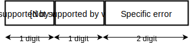

**Figure 63 -- Structure des codes d’erreur**

Chaque combinaison de catégories principale et secondaire possède une erreur générique (_x_**0**_xx_), utilisable s’il n’existe pas d’erreur plus spécifique, ou si le serveur ne souhaite pas communiquer plus d’information.

Toutes les erreurs spécifiques inférieures à _xx_**40** (c’est-à-dire de _xx_**00** à _xx_**39**) sont réservées à un usage ultérieur de l’API. Celles à partir de _xx_**40** peuvent servir pour des besoins propres à un schéma. Si un client reçoit une erreur inconnue propre à un schéma, elle devra être traitée comme une erreur générique de la catégorie (_xx_**00**).

#### Erreurs de communication -- 1_xxx_

Toutes les erreurs de communication ou réseau n’étant pas couvertes par un code HTTP doivent utiliser le code d’erreur principal **1** (codes **1**_xxx_). Comme tous les services de l’API sont asynchrones, ces erreurs sont généralement émises par le Switch au client FSP si le FSP pair est injoignable ou si aucun callback n’est reçu dans le délai convenu.

Sous-catégories pour les erreurs de communication :

- **Erreur de communication générique** -- **10**_xx_

Voir [Tableau 111](#table-111) pour la liste des erreurs de ce type.

###### Tableau 111

| **Code d’erreur** | **Nom** | **Description** | /participants | /parties | /transactionRequests | /quotes  | /authorizations |  /transfers | /transactions | /bulkQuotes | /bulkTransfers |
| --- | --- | --- | --- | --- | --- | --- | --- | --- | --- | --- | --- |
| **1000** | Erreur de communication | Erreur de communication générique. | X | X | X | X | X | X | X | X | X |
| **1001** | Erreur de communication destination | La destination de la requête n’a pas pu être jointe (échec de réponse intermédiaire). | X | X | X | X | X | X | X | X | X |

**Tableau 111 -- Erreurs de communication -- 1_xxx_**

#### Erreurs serveur -- 2_xxx_

Toutes les erreurs survenues côté serveur où ce dernier n’a pas pu satisfaire une requête apparemment valide du client utilisent la catégorie **2** (codes **2**_xxx_). Ces erreurs signifient que le serveur est conscient d’avoir rencontré une erreur ou d’être incapable de traiter la demande.

Sous-catégories pour les erreurs serveur :

- **Erreur serveur générique** -- **20**_xx_

Voir [Tableau 112](#Table-112) pour les erreurs serveur définies.

###### Tableau 112

| **Code d’erreur** | **Nom** | **Description** | /participants | /parties | /transactionRequests | /quotes  | /authorizations |  /transfers | /transactions | /bulkQuotes | /bulkTransfers |
| --- | --- | --- | --- | --- | --- | --- | --- | --- | --- | --- | --- |
| **2000** | Erreur serveur générique | Erreur serveur générique pour ne pas divulguer d’informations privées. | X | X | X | X | X | X | X | X | X |
| **2001** | Erreur serveur interne | Exception inattendue générique (bug ou cas non géré). | X | X | X | X | X | X | X | X | X |
| **2002** | Non implémenté | Service demandé non supporté par le serveur. | X | X | X | X | X | X | X | X | X |
| **2003** | Service indisponible | Service demandé indisponible (maintenance, panne temporaire, etc.). | X | X | X | X | X | X | X | X | X |
| **2004** | Timeout serveur | Le serveur n’a pas reçu de callback dans le délai imparti (timeout). | X | X | X | X | X | X | X | X | X |
| **2005** | Serveur surchargé | Le serveur refuse les requêtes pour surcharge. Réessayez plus tard. | X | X | X | X | X | X | X | X | X |

**Tableau 112 -- Erreurs serveur -- 2_xxx_**

#### Erreurs côté Client -- 3_xxx_

Toutes les erreurs possibles se produisant sur le serveur, où ce dernier signale que le client a envoyé un ou plusieurs paramètres erronés, doivent utiliser le code d’erreur principal **3** (codes d’erreur **3**_xxx_). Ces codes d’erreur indiquent que le serveur n’a pas pu effectuer le service selon la demande du client. Le serveur doit fournir une explication sur la raison pour laquelle le service n’a pas pu être exécuté.

Catégories de bas niveau définies sous les erreurs client :

- **Erreur Générique du Client** -- **30**_xx_

  - Voir [Tableau 113](#table-113) pour la liste des erreurs génériques côté client définies dans l’API.

- **Erreur de Validation** -- **31**_xx_

  - Voir [Tableau 114](#table-114) pour la liste des erreurs de validation dans l’API.

- **Erreur d’Identifiant** -- **32**_xx_

  - Voir [Tableau 115](#table-115) pour la liste des erreurs d’identification dans l’API.

- **Erreur d’Expiration** -- **33**_xx_

  - Voir [Tableau 116](#table-116) pour la liste des erreurs d’expiration dans l’API.

###### Tableau 113

| **Code d’erreur** | **Nom** | **Description** | /participants | /parties | /transactionRequests | /quotes  | /authorizations |  /transfers | /transactions | /bulkQuotes | /bulkTransfers |
| --- | --- | --- | --- | --- | --- | --- | --- | --- | --- | --- | --- |
| **3000** | Erreur générique côté client | Erreur générique côté client, utilisée pour ne pas divulguer d’informations sensibles. | X | X | X | X | X | X | X | X | X |
| **3001** | Version demandée non acceptable | Le client a demandé une version du protocole qui n’est pas supportée par le serveur. | X | X | X | X | X | X | X | X | X |
| **3002** | URI inconnue | L’URI fournie est inconnue du serveur. | X | X | X | X | X | X | X | X | X |
| **3003** | Erreur d’ajout d’information de Partie | Une erreur s’est produite lors de l’ajout ou de la mise à jour des informations concernant une Partie. | X | X | X | X | X | X | X | X | X |

**Tableau 113 -- Erreurs génériques côté client -- 30_xx_**

###### Tableau 114

| **Code d’erreur** | **Nom** | **Description** | /participants | /parties | /transactionRequests | /quotes  | /authorizations |  /transfers | /transactions | /bulkQuotes | /bulkTransfers |
| --- | --- | --- | --- | --- | --- | --- | --- | --- | --- | --- | --- |
| **3100** | Erreur de validation générique | Erreur de validation générique utilisée pour ne pas divulguer d’informations sensibles. | X | X | X | X | X | X | X | X | X |
| **3101** | Syntaxe mal formée | Le format du paramètre n’est pas valide. Par exemple, montant fixé à **5.ABC**. Le champ de description d’erreur devrait préciser quel élément est erroné. | X | X | X | X | X | X | X | X | X |
| **3102** | Élément obligatoire manquant | Élément obligatoire absent dans le modèle de données. | X | X | X | X | X | X | X | X | X |
| **3103** | Trop d’éléments | Le nombre d’éléments dans un tableau dépasse le nombre maximum autorisé. | X | X | X | X | X | X | X | X | X |
| **3104** | Charge utile trop volumineuse | La taille de la charge utile dépasse la taille maximale autorisée. | X | X | X | X | X | X | X | X | X |
| **3105** | Signature invalide | Certains paramètres du message ont été modifiés, rendant la signature invalide. Cela peut indiquer que le message a été modifié de manière malveillante. | X | X | X | X | X | X | X | X | X |
| **3106** | Requête modifiée | Une précédente requête avec le même ID a déjà été traitée, mais avec des paramètres différents. ||| X | X | X | X | X | X | X |
| **3107** | Paramètre d’extension obligatoire manquant | Un paramètre d’extension obligatoire pour le schéma est absent. ||| X | X | X | X | X | X | X |

**Tableau 114 -- Erreurs de validation -- 31_xx_**

###### Tableau 115

| **Code d’erreur** | **Nom** | **Description** | /participants | /parties | /transactionRequests | /quotes  | /authorizations |  /transfers | /transactions | /bulkQuotes | /bulkTransfers |
| --- | --- | --- | --- | --- | --- | --- | --- | --- | --- | --- | --- |
| **3200** | Identifiant générique non trouvé | Erreur générique d’identifiant fournie par le client. | X | X | X | X | X | X | X | X | X |
| **3201** | Erreur FSP Destinataire | Le FSP destinataire n’existe pas ou est introuvable. | X | X | X | X | X | X | X | X | X |
| **3202** | Identifiant FSP Payeur introuvable | Identifiant FSP Payeur fourni introuvable. |||||| X ||| X |
| **3203** | Identifiant FSP Bénéficiaire introuvable | Identifiant FSP Bénéficiaire fourni introuvable. |||||| X ||| X |
| **3204** | Partie non trouvée | Partie avec l’identifiant, le type d’identifiant et le sous-id ou type optionnel fournis non trouvée. | X | X | X | X ||||||
| **3205** | Identifiant de devis introuvable | Devis fourni introuvable sur le serveur. |||| X || X ||||
| **3206** | ID de demande de transaction introuvable | Demande de Transaction fournie introuvable sur le serveur. ||| X ||| X ||||
| **3207** | ID de transaction introuvable | ID de transaction fourni introuvable sur le serveur. ||||||| X |||
| **3208** | ID de transfert introuvable | ID de transfert fourni introuvable sur le serveur. |||||| X ||||
| **3209** | ID de devis groupé introuvable | ID de devis groupé fourni introuvable sur le serveur. |||||||| X | X |
| **3210** | ID de transfert groupé introuvable | ID de transfert groupé fourni introuvable sur le serveur. ||||||||| X |

**Tableau 115 -- Erreurs d’identifiant -- 32_xx_**

###### Tableau 116

| **Code d’erreur** | **Nom** | **Description** | /participants | /parties | /transactionRequests | /quotes  | /authorizations |  /transfers | /transactions | /bulkQuotes | /bulkTransfers |
| --- | --- | --- | --- | --- | --- | --- | --- | --- | --- | --- | --- |
| **3300** | Erreur générique d’expiration | Erreur d’objet expiré générique, à utiliser pour ne pas divulguer d’informations sensibles. | X | X | X | X | X | X | X | X | X |
| **3301** | Demande de transaction expirée | Le client a demandé d’utiliser une demande de transaction qui a déjà expiré. |||| X ||||||
| **3302** | Devis expiré | Le client a demandé d’utiliser un devis qui a déjà expiré. ||||| X | X ||| X |
| **3303** | Transfert expiré | Le client a demandé d’utiliser un transfert qui a déjà expiré. | X | X | X | X | X | X | X | X | X |

**Tableau 116 -- Erreurs d’expiration -- 33_xx_**

#### Erreurs côté Payeur -- 4_xxx_

Toutes les erreurs se produisant sur le serveur dont la cause est liée au Payeur ou à son FSP doivent utiliser le code d’erreur principal **4** (codes **4**_xxx_). Ces codes d’erreur indiquent qu’il n’y a pas eu d’erreur sur le serveur ni dans la requête du client, mais que la requête a échoué pour une raison liée au Payeur ou à son FSP. Le serveur doit fournir une explication sur la raison pour laquelle le service n’a pas pu être exécuté.

Catégories de bas niveau définies pour les erreurs côté Payeur :

- **Erreur Générique Payeur** -- **40**_xx_
- **Erreur de Rejet Payeur** -- **41**_xx_
- **Erreur de Limite Payeur** -- **42**_xx_
- **Erreur de Permission Payeur** -- **43**_xx_
- **Erreur Payeur Bloqué** -- **44**_xx_

Voir [Tableau 117](#table-117) pour les erreurs Payeur définies dans l’API.

###### Tableau 117

| **Code d’erreur** | **Nom** | **Description** | /participants | /parties | /transactionRequests | /quotes  | /authorizations |  /transfers | /transactions | /bulkQuotes | /bulkTransfers |
| --- | --- | --- | --- | --- | --- | --- | --- | --- | --- | --- | --- |
| **4000** | Erreur générique Payeur | Erreur générique liée au Payeur ou à son FSP. Utilisée pour protéger les informations pouvant être sensibles. ||| X | X | X | X | X | X | X |
| **4001** | FSP Payeur liquidité insuffisante | Le FSP Payeur n’a pas assez de liquidité pour effectuer le transfert. |||||| X ||||
| **4100** | Rejet générique Payeur | Le Payeur ou le FSP Payeur a rejeté la requête. ||| X | X | X | X | X | X | X |
| **4101** | Payeur a rejeté la demande de transaction | Le Payeur a rejeté la demande de transaction du Bénéficiaire. ||| X |||||||
| **4102** | FSP Payeur type de transaction non supporté | Le FSP Payeur ne supporte pas ou a rejeté le type de transaction demandé. ||| X ||||||| 
| **4103** | Payeur devise non supportée | Le Payeur n’a pas de compte supportant la devise demandée. ||| X |||||||
| **4200** | Erreur de limite Payeur | Erreur de limite générique, par exemple nombre de paiements journalier/mensuel dépassé ou montant de la transaction supérieur au maximum autorisé. ||| X | X || X || X | X |
| **4300** | Erreur de permission Payeur | Erreur de permission générique, le Payeur ou son FSP n’a pas les droits pour réaliser le service. ||| X | X | X | X | X | X | X |
| **4400** | Erreur Payeur bloqué générique | Erreur Payeur bloqué générique ; le Payeur est bloqué ou a échoué les contrôles réglementaires. ||| X | X | X | X | X | X | X |

**Tableau 117 -- Erreurs côté Payeur -- 4_xxx_**

#### Erreurs côté Bénéficiaire -- 5_xxx_

Toutes les erreurs se produisant sur le serveur pour lesquelles le Bénéficiaire ou son FSP est la cause de l’erreur utilisent le code d’erreur principal **5** (codes **5**_xxx_). Ces codes d’erreur indiquent qu’il n’y a pas eu d’erreur sur le serveur ni dans la requête du client, mais que la requête a échoué pour une raison liée au Bénéficiaire ou à son FSP. Le serveur doit fournir une explication sur la raison pour laquelle le service n’a pas pu être exécuté.

Catégories de bas niveau pour les erreurs Bénéficiaire :

- **Erreur Générique Bénéficiaire** -- **50**_xx_
- **Erreur de Rejet Bénéficiaire** -- **51**_xx_
- **Erreur de Limite Bénéficiaire** -- **52**_xx_
- **Erreur de Permission Bénéficiaire** -- **53**_xx_
- **Erreur Bénéficiaire Bloqué** -- **54**_xx_

Voir [Tableau 118](#table-118) pour toutes les erreurs Bénéficiaire définies dans l’API.

###### Tableau 118

| **Code d’erreur** | **Nom** | **Description** | /participants | /parties | /transactionRequests | /quotes  | /authorizations |  /transfers | /transactions | /bulkQuotes | /bulkTransfers |
| --- | --- | --- | --- | --- | --- | --- | --- | --- | --- | --- | --- |
| **5000** | Erreur générique Bénéficiaire | Erreur générique due au Payeur ou à son FSP, à utiliser pour ne pas divulguer d’informations sensibles. ||| X | X | X | X | X | X | X |
| **5001** | FSP Bénéficiaire liquidité insuffisante | FSP Bénéficiaire n’a pas assez de liquidité pour effectuer le transfert. |||||| X ||||
| **5100** | Rejet générique Bénéficiaire | Le Bénéficiaire ou son FSP a rejeté la requête. ||| X | X | X | X | X | X | X |
| **5101** | Bénéficiaire a rejeté le devis | Le Bénéficiaire ne souhaite pas poursuivre la transaction après réception du devis. |||| X |||| X ||
| **5102** | FSP Bénéficiaire type de transaction non supporté | FSP Bénéficiaire ne supporte pas ou a rejeté le type de transaction demandé. |||| X ||||| X |
| **5103** | FSP Bénéficiaire a rejeté le devis | Le FSP Bénéficiaire ne souhaite pas poursuivre la transaction après réception du devis. |||| X |||| X ||
| **5104** | Bénéficiaire a rejeté la transaction | Le Bénéficiaire a rejeté la transaction financière. |||||| X ||| X |
| **5105** | FSP Bénéficiaire a rejeté la transaction | Le FSP Bénéficiaire a rejeté la transaction financière. |||||| X ||| X |
| **5106** | Devise non supportée par le Bénéficiaire | Le Bénéficiaire ne possède pas de compte prenant en charge la devise demandée. |||| X || X || X | X |
| **5200** | Erreur de limite Bénéficiaire | Erreur de limite générique, par exemple Bénéficiaire recevant plus de paiements par jour/mois que permis, ou recevant un paiement dépassant le montant maximum par transaction. ||| X | X || X || X | X |
| **5300** | Erreur de permission Bénéficiaire | Erreur de permission générique, le Bénéficiaire ou son FSP n’a pas les droits pour réaliser le service. ||| X | X | X | X | X | X | X |
| **5400** | Erreur Bénéficiaire bloqué générique | Erreur générique Bénéficiaire bloqué, le Bénéficiaire est bloqué ou a échoué les contrôles réglementaires. ||| X | X | X | X | X | X | X |

**Tableau 118 -- Erreurs côté Bénéficiaire -- 5_xxx_**


## Liaison avec les schémas génériques des transactions

Cette section décrit comment les schémas logiques de transaction présentés dans [Schémas de Transactions Génériques](../generic-transaction-patterns) sont utilisés dans la liaison REST asynchrone de l’API. De nombreuses informations sont présentées sous forme de diagrammes de séquence. Pour plus d’informations sur les étapes de ces diagrammes, voir [Schémas de Transactions Génériques](../generic-transaction-patterns).

### Transaction Initiée par le Payeur

Le schéma `Transaction Initiée par le Payeur` est introduit dans [Schémas de Transactions Génériques](../generic-transaction-patterns#payer-initiated-transaction). À un niveau général, ce schéma doit être utilisé chaque fois qu’un Payeur souhaite transférer des fonds à une autre Partie qui ne se trouve pas dans le même FSP que le Payeur. [Figure 64](#figure-64) présente le diagramme de séquence pour une `Transaction Initiée par le Payeur` utilisant la liaison REST asynchrone de la version logique. Le processus de chaque numéro dans le diagramme de séquence est décrit dans [Schémas de Transactions Génériques](../generic-transaction-patterns#payer-initiated-transaction).

###### Figure 64

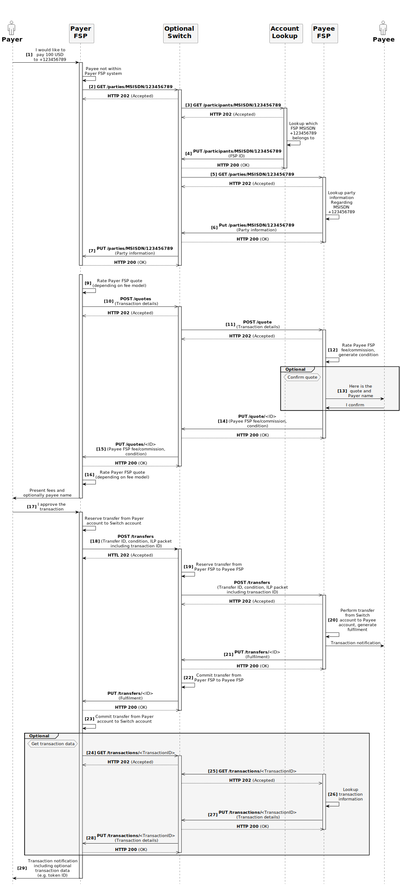

**Figure 64 -- Schéma Transaction Initiée par le Payeur utilisant l’API REST asynchrone**

### Transaction Initiée par le Bénéficiaire

Le schéma `Transaction Initiée par le Bénéficiaire` est introduit dans [Schémas de Transactions Génériques](../generic-transaction-patterns#payer-initiated-transaction). À un niveau général, le schéma doit être utilisé lorsqu’un Bénéficiaire souhaite demander au Payeur de transférer des fonds vers le Bénéficiaire. Le Payeur et le Bénéficiaire sont supposés dans des FSP différents, et l’approbation de la transaction est réalisée dans le FSP Payeur. Si l’entrée et l’approbation de la transaction ont lieu sur un appareil du Bénéficiaire, utilisez plutôt le schéma connexe Transaction Initiée par le Bénéficiaire avec OTP](#payee-initiated-transaction-using-otp). [Figure 65](#figure-65) présente le diagramme de séquence pour une `Transaction Initiée par le Bénéficiaire` utilisant la liaison REST asynchrone de la version logique. Le processus pour chaque numéro du diagramme est décrit dans [Schémas de Transactions Génériques](../generic-transaction-patterns#payee-initiated-transaction).

###### Figure 65

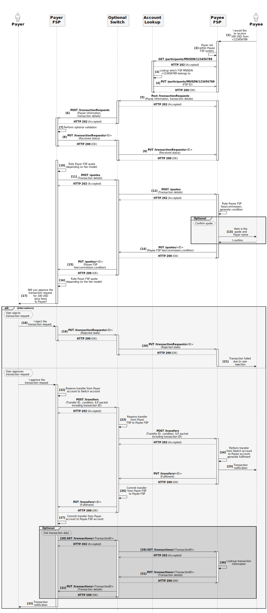

**Figure 65 -- Schéma Transaction Initiée par le Bénéficiaire utilisant l’API REST asynchrone**

### Transaction Bénéficiaire Initiée avec OTP

Le schéma `Transaction Initiée par le Bénéficiaire avec OTP` est introduit dans [Schémas de Transactions Génériques](../generic-transaction-patterns#payee-initiated-transaction-using-otp). À un niveau général, ce schéma ressemble à [Transaction Initiée par le Bénéficiaire](#payee-initiated-transaction) ; cependant, dans ce schéma les informations de transaction et l’approbation du Payeur sont affichées et saisies sur un appareil du Bénéficiaire. Comme pour les autres schémas, le Payeur et le Bénéficiaire sont dans des FSP différents. [Figure 66](#figure-66) montre le diagramme pour une `Transaction Initiée par le Bénéficiaire avec OTP` utilisant la liaison REST asynchrone de la version logique. Le processus de chaque étape du diagramme est décrit dans [Schémas de Transactions Génériques](../generic-transaction-patterns#payee-initiated-transaction-using-otp).

###### Figure 66

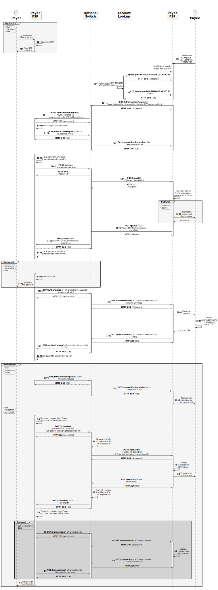

**Figure 66 -- Schéma Transaction Initiée par le Bénéficiaire avec OTP via REST asynchrone**

### Transactions Groupées

Le schéma `Transactions Groupées` est introduit dans [Schémas de Transactions Génériques](../generic-transaction-patterns#bulk-transactions). Ce schéma est utilisé lorsque le Payeur souhaite transférer des fonds à plusieurs Bénéficiaires au sein d’une seule transaction. Les Bénéficiaires peuvent être dans différents FSP. [Figure 67](#figure-67) montre le diagramme de séquence pour des `Transactions Groupées` utilisant la liaison REST asynchrone de la version logique. L’explication de chaque étape du diagramme est disponible dans [Schémas de Transactions Génériques](../generic-transaction-patterns#bulk-transactions).

###### Figure 67

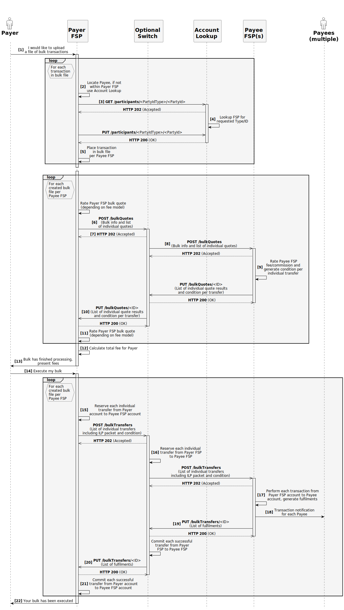

**Figure 67 -- Schéma Transactions groupées via REST asynchrone**

<br />

## Gestion des erreurs de l’API

Cette section décrit comment gérer les réponses ou callbacks absents ainsi que les erreurs à traiter côté serveur lors du traitement d’une requête.

### Requête Erronée

Si un serveur reçoit une requête de service erronée qui peut être traitée immédiatement (par exemple, syntaxe mal formée ou ressource non trouvée), un code d’erreur HTTP approprié côté client (commençant par **4_xx_**) doit être retourné au client dans la réponse. Les codes d’erreur HTTP définis pour l’API sont listés dans le [Tableau 4](#table-4). La réponse HTTP peut aussi contenir un élément [**ErrorInformation**](#errorinformation) afin de donner plus de détails sur l’erreur (voir [Informations d’erreur dans la réponse HTTP](#error-information-in-http-response)).

<br />

### Erreur serveur lors du traitement d’une requête

[Figure 68](#figure-68) montre un exemple sur la gestion d’une erreur survenue lors du traitement serveur.

###### Figure 68

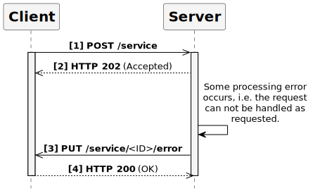

**Figure 68 -- Erreur côté serveur lors du traitement d’une requête**

#### Étapes internes du traitement

La liste suivante décrit les étapes de la séquence (voir [Figure 68](#figure-68)).

1. Le client souhaite que le serveur crée un nouvel objet de service et utilise donc une requête **POST**.

2. Le serveur reçoit la requête. Il envoie immédiatement une réponse **accepted** au client, puis tente de créer l’objet selon la demande. Une erreur de traitement survient et la demande ne peut être satisfaite. Le serveur envoie alors le callback **_PUT_ /**_{resource}_**/**_{ID}_**/error** incluant un code d’erreur ([Codes d’erreur](#error-codes)) et une description pour notifier le client.

3. Le client reçoit le callback d’erreur et répond immédiatement avec **OK**. Il gère ensuite l’erreur.

4. Le serveur reçoit la réponse **OK** et le processus est terminé.

<br />

### Gestion côté client d’un callback d’erreur

Les sections suivantes expliquent comment un client doit traiter les callbacks d’erreur reçus d’un serveur.

#### Ressource API /participants

L’erreur typique du service **/participants** est que la Partie demandée n’a pas été trouvée. Le client peut soit essayer un autre serveur, soit informer l’utilisateur final que la Partie recherchée est introuvable.

#### Ressource API /parties

L’erreur typique du service **/parties** est que la Partie demandée n’a pas été trouvée. Le client peut soit essayer un autre serveur, soit informer l’utilisateur final que les informations recherchées sont indisponibles.

#### Ressource API /quotes

L’erreur typique du service **/quotes** est qu’un devis n’a pas pu être calculé pour la transaction demandée. Le client doit notifier l’utilisateur final que la transaction n’a pas pu être réalisée.

#### Ressource API /transactionRequests

L’erreur typique du service **/transactionRequests** est que le Payeur a rejeté la transaction ou qu’une validation automatique a échoué. Le client doit informer le Bénéficiaire que la demande de transaction a échoué.

#### Ressource API /authorizations

L’erreur typique du service **/authorizations** est que la demande de transaction n’a pas été trouvée. Le client doit informer le Payeur que la demande a été annulée.

#### Ressource API /transfers

L’erreur typique du service **/transfers** est qu’un échec a eu lieu lors du transfert hop-to-hop ou lors de la transaction financière de bout en bout. Par exemple : dépassement de limite ou Bénéficiaire introuvable. Dans tous les cas d’erreur, le client (FSP Payeur) doit annuler la réservation pour la transaction financière réalisée avant la demande d’exécution sur le serveur (FSP Bénéficiaire). Voir [Figure 69](#figure-69) pour un exemple avec un Switch financier entre les FSP.

###### Figure 69

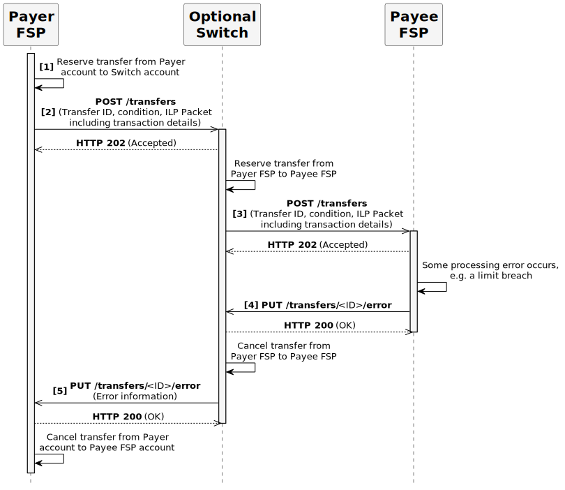

**Figure 69 -- Gestion du callback d’erreur suite à POST /transfers**

##### Étapes internes du traitement

La liste suivante détaille les étapes de la séquence (voir [Figure 69](#figure-69)).

1. La réservation du transfert est faite depuis le compte du Payeur vers un compte Switch combiné ou un compte FSP Bénéficiaire. Lorsque la réservation est réussie, la demande [POST /transfers](#post-transfers) est utilisée sur le Switch. Le transfert devient alors irrévocable côté FSP Payeur. Le FSP Payeur attend la réponse **accepted** du Switch.

2. Le Switch reçoit la demande [POST /transfers](#post-transfers), envoie de suite une réponse **accepted** au FSP Payeur, puis effectue toutes les validations internes nécessaires. Si tout est valide, une réservation est effectuée du FSP Payeur vers le FSP Bénéficiaire. Une fois cette réservation réussie, [POST /transfers](#post-transfers) est utilisé côté FSP Bénéficiaire. Le transfert est alors irrévocable du côté Switch. Le Switch attend une réponse **accepted** du FSP Bénéficiaire.

3. Le FSP Bénéficiaire reçoit le [POST /transfers](#post-transfers) et envoie immédiatement une réponse **accepted** au Switch. Il effectue ses propres validations. On suppose ici qu’une validation échoue (par exemple, pour dépassement de limite). Le callback d’erreur [PUT /transfers/_{ID}_/error](#put-transfers-id-error) est utilisé vers le Switch pour informer le FSP Payeur de l’erreur. Le FSP Bénéficiaire attend alors la réponse **OK** du Switch pour conclure le processus.

4. Le Switch reçoit le callback d’erreur [PUT /transfers/_{ID}_/error](#put-transfers-id-error) et répond immédiatement avec **OK**. Il annule le transfert réservé suite à la réception du callback d’erreur. Le Switch utilise alors le callback [PUT /transfers/_{ID}_/error](#put-transfers-id-error) vers le FSP Payeur avec les mêmes paramètres, et attend une réponse **OK** pour terminer la procédure.

5. Le FSP Payeur reçoit le callback [PUT /transfers/_{ID}_/error](#put-transfers-id-error) et répond immédiatement avec **OK**. Il annule sa propre réservation de transfert suite à la réception du callback d’erreur.

#### Ressource API /transactions

L’erreur normale du service **/transactions** est que la transaction n’a pas été trouvée dans le FSP Pair.

#### Ressource API /bulkQuotes

L’erreur typique du service **/bulkQuotes** est qu’un devis n’a pas pu être calculé pour la transaction demandée. Le client doit notifier l’utilisateur final que la transaction demandée a échoué.

#### Ressource API /bulkTransfers

L’erreur classique du service **/bulkTransfers** est que la transaction groupée n’a pas été acceptée, par exemple suite à une erreur de validation. Dans tous les cas d’erreur, le client (FSP Payeur) doit annuler la réservation des transactions financières effectuées avant la demande côté FSP Bénéficiaire. Voir [Figure 70](#figure-70) pour un exemple avec Switch financier entre les FSP.

###### Figure 70

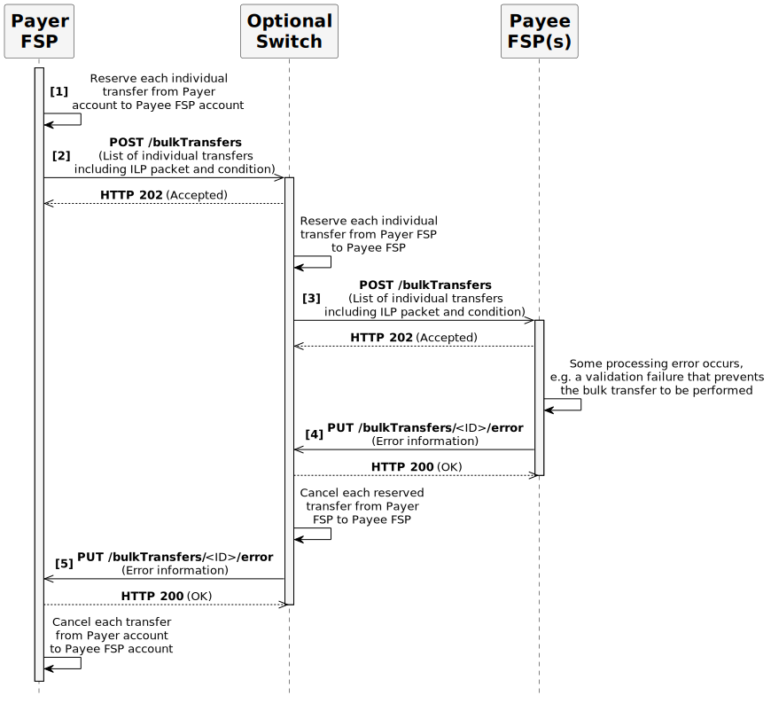

**Figure 70 -- Gestion du callback d’erreur pour le service API /bulkTransfers**

##### Étapes internes du traitement

La liste suivante décrit les étapes de la séquence (voir [Figure 70](#figure-70)).

1. Chaque transfert individuel du transfert groupé est réservé depuis le compte du Payeur vers un compte Switch combiné ou un compte FSP Bénéficiaire. Une fois toutes les réservations individuelles réussies, [POST /bulkTransfers](#post-bulktransfers) est utilisé sur le Switch. Le transfert groupé devient alors irrévocable côté FSP Payeur. Ce dernier attend une réponse **accepted** du Switch.

2. Le Switch reçoit [POST /bulkTransfers](#post-bulktransfers) et répond immédiatement **accepted** au FSP Payeur. Il réalise toutes les validations nécessaires. Si celles-ci passent, chaque transfert individuel est réservé du FSP Payeur au FSP Bénéficiaire. Une fois les réservations validées, [POST /bulkTransfers](#post-bulktransfers) est utilisé vers le FSP Bénéficiaire. Le transfert groupé devient irrévocable côté Switch, qui attend alors la réponse **accepted** du FSP Bénéficiaire.

3. Le FSP Bénéficiaire reçoit [POST /bulkTransfers](#post-bulktransfers), répond de suite **accepted** au Switch, puis effectue ses validations sur le transfert groupé. Supposons qu’une validation empêche tout le transfert groupé. Le callback d’erreur [PUT /bulkTransfers/_{ID}_/error](#put-bulktransfers-id-error) est utilisé vers le Switch pour informer le FSP Payeur. Le FSP Bénéficiaire attend ensuite la réponse **OK** du Switch.

4. Le Switch reçoit le callback d’erreur [PUT /bulkTransfers/_{ID}_/error](#put-bulktransfers-id-error) et répond immédiatement par **OK**. Il annule toutes les réservations de transferts précédentes, puis utilise à son tour le callback [PUT /bulkTransfers/_{ID}_/error](#put-bulktransfers-id-error) vers le FSP Payeur avec les paramètres identiques, et attend la réponse **OK** pour conclure.

5. Le FSP Payeur reçoit le callback [PUT /bulkTransfers/_{ID}_/error](#put-bulktransfers-id-error), répond par **OK** et annule toutes les réservations précédentes suite à la réception du callback d’erreur.

<br />

### Absence de réponse du serveur côté Client - Réenvoi de la requête

[Figure 71](#figure-71) présente un exemple (UML) où un client (FSP ou Switch) gère une absence de réponse d’un serveur (Switch ou FSP Pair) suite à une requête de service, via le renvoi de la même requête de service.

###### Figure 71

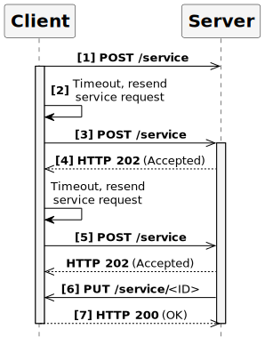

**Figure 71 -- Gestion d’erreur côté client via réenvoi de la requête**

#### Étapes internes du traitement

Voici la description détaillée de chaque étape (voir [Figure 71](#figure-71)).

1. Le client sollicite la création d’un nouvel objet de service coté serveur. La requête HTTP est perdue.

2. Le client constate qu’aucune réponse n’a été reçue dans un délai imparti, et renvoie la requête de service.

3. Le serveur reçoit la nouvelle requête, envoie immédiatement une réponse **accepted** au client, puis procède à la création de l’objet selon la demande initiale.

4. La réponse HTTP **accepted** du serveur se perd en retour, le client constate à nouveau une absence de réponse dans le délai, et renvoie la requête de service.

5. Le serveur reçoit la nouvelle requête, envoie à nouveau une réponse **accepted** au client, et constate qu’il s’agit d’un doublon (cf. étape 3). Nul besoin de créer un nouvel objet ; un callback est alors envoyé pour notifier le client de l’objet déjà créé à l’étape 3.

6. Le client reçoit le callback concernant l’objet créé, envoie une réponse HTTP **OK** au serveur pour conclure le processus.

7. Le serveur reçoit la réponse **OK** du client, le processus est terminé.

<br />

### Absence de réponse du client côté Serveur

Un serveur utilisant l’API n’est pas responsable de s’assurer qu’un callback a bien été livré au client. Toutefois, il est recommandé de réessayer en cas de non-réception d'une réponse **OK** du client.

#### Absence de callback côté client - Utilisation de GET

[Figure 72](#figure-72) est un diagramme de séquence UML illustrant la manière dont un client (Switch ou FSP Pair) peut gérer une absence de callback de la part d’un client (FSP ou Switch) dans un délai raisonnable.

###### Figure 72

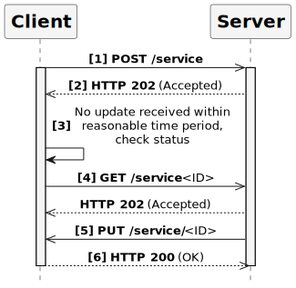

**Figure 72 -- Gestion d’erreur côté client via requête GET**

#### Étapes internes du traitement

La liste suivante détaille les étapes de la séquence (voir [Figure 71](#figure-71)).

1. Le client souhaite que le serveur crée un nouvel objet de service ; une requête de service est envoyée.

2. Le serveur reçoit la requête de service, répond immédiatement **accepted** au client, puis crée l’objet conformément à la demande. La création est longue (ex : transfert groupé volumineux).

3. Le serveur constate l’absence de callback côté client dans un délai raisonnable. Le client utilise alors une requête **GET** avec l’ID fourni initialement.

4. Le serveur reçoit la requête **GET**, répond **accepted** pour signifier que la demande sera traitée.

5. Le client reçoit la réponse **accepted** et attend le callback, qui arrive plus tard ; le client envoie alors **OK** en retour et le processus est terminé.

6. Le serveur envoie le callback contenant l’information demandée, puis reçoit le **OK** qui termine le processus.

<br />

## Exemple bout-en-bout

Cette section contient un exemple complet où un titulaire de compte est provisionné, puis un transfert P2P depuis un Payeur sur un FSP vers un Bénéficiaire sur un autre FSP est effectué. L’exemple inclut les requêtes et réponses HTTP, les en-têtes HTTP, et les modèles de données JSON, mais exclut la sécurité JWS ([_Signature_](./signature.md)) et le chiffrement JWE ([_Encryption_](./encryption.md)).

### Configuration de l’exemple

Description de l’environnement de l’exemple.

#### Nœuds

###### Figure 73

Les nœuds de l’exemple bout-en-bout sont simplifiés à deux FSP : une banque (identifiant **BankNrOne**), un opérateur mobile money (**MobileMoney**), et un Switch (identifiant **Switch**). Le Switch joue aussi le rôle de ALS (Account Lookup System, ou Système de Recherche de Compte) ([voir Figure 73](#figure-73)).


**Figure 73 -- Nœuds de l’exemple bout-en-bout**

#### Titulaires de comptes

Les titulaires de compte dans l’exemple sont :

- Un titulaire de compte chez **BankNrOne** nommé Mats Hagman. Il dispose d’un compte IBAN **SE4550000000058398257466** en USD.

- Un titulaire de compte chez **MobileMoney** nommé Henrik Karlsson. Il dispose d’un compte mobile identifié par **123456789** (numéro), en USD.

#### Scénario

Le scénario : Mats Hagman (**BankNrOne**) souhaite transférer 100 USD à Henrik Karlsson (**MobileMoney**). Avant que Henrik ne soit trouvable, son FSP **MobileMoney** doit fournir au Switch l’information d’affectation de FSP. Le déroulé complet se trouve en [Autres Informations](#other-notes).

#### Autres Informations

Les messages JSON sont formatés avec couleurs, indentation et retours à la ligne pour la lisibilité.

Il est supposé que chaque FSP dispose d’un compte Switch pré-approvisionné dans son propre établissement.

### Déroulé de l’exemple

[Figure 74](#figure-74) illustre l’ensemble du processus, du provisioning des informations FSP jusqu’à la transaction.

###### Figure 74

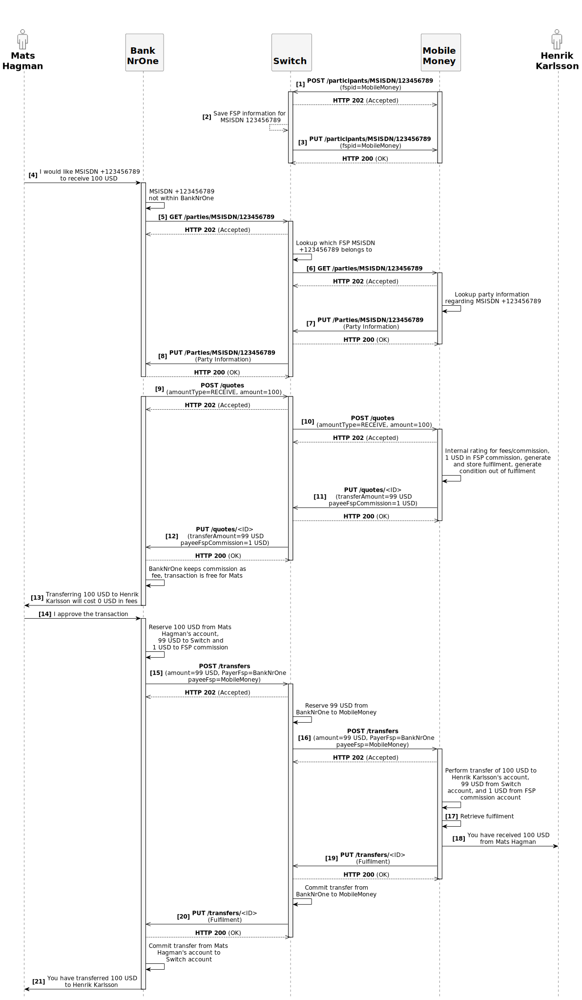

**Figure 74 -- Déroulé complet : de la fourniture d’information FSP compte au succès de la transaction**

### Provisionnement du Titulaire de Compte

Avant que le bénéficiaire Henrik Karlsson ne soit trouvable via le FSP **BankNrOne**, il doit être provisionné dans l’ALS (le Switch) par son FSP (**MobileMoney**). Cela s’effectue via [**POST /participants**](#6232-post-participants) (version bulk) ou [POST /participants/_{Type}_/_{ID}_](#post-participants-type-id) (version simple). Comme il n'y a ici qu'un bénéficiaire, la version simple est utilisée par **MobileMoney**. Le provisioning peut avoir lieu à tout moment, lors de la création du compte ou lors de la connexion initiale au Switch.

#### FSP MobileMoney provisionne Henrik Karlsson : Étape 1 du déroulé

[Listing 29](#listing-29) montre la demande HTTP où **MobileMoney** provisionne les infos FSP pour Henrik Karlsson, identifié par **MSISDN** et **123456789** (voir [Adressage de Parties](#party-addressing)). L’élément JSON **fspId** est mis à l’identifiant du FSP et **currency** à la devise du compte (USD).

Voir [Tableau 1](#table-1) pour les en-têtes HTTP requis,
et [POST /participants/_{Type}_/_{ID}_](#post-participants-type-id) pour plus d’infos. Pour le routage avec **FSPIOP-Destination** et **FSPIOP-Source**, voir [Routage du flux d’appel](#call-flow-routing-using-fspiop-destination-and-fspiop-source). Pour la négociation de version, voir [Négociation de version entre client et serveur](#version-negotiation-between-client-and-server).

###### Listing 29

```
POST /participants/MSISDN/123456789 HTTP/1.1
Accept: application/vnd.interoperability.participants+json;version=1
Content-Length: 50
Content-Type:
application/vnd.interoperability.participants+json;version=1.0
Date: Tue, 14 Nov 2017 08:12:31 GMT
FSPIOP-Source: MobileMoney
FSPIOP-Destination: Switch
{
    "fspId": "MobileMoney",
    "currency": "USD"
}
```

**Listing 29 -- Provision d’informations FSP pour le titulaire Henrik Karlsson**

[Listing 30](#listing-30) présente la réponse HTTP synchrone où le Switch accuse réception immédiate (après vérif de headers, etc.).

Voir [Tableau 3](#table-3) pour les en-têtes de réponse requis.

###### Listing 30

```
HTTP/1.1 202 Accepted
Content-Type:
application/vnd.interoperability.participants+json;version=1.0
```

**Listing 30 -- Réponse synchrone à la requête de provision**

<br />

#### Traitement du provisionnement par le Switch : Étape 2

Une fois la demande reçue ([Listing 29](#listing-29)) et la réponse envoyée ([Listing 30](#listing-30)), le Switch vérifie le corps de la demande. Par exemple, il s’assure que **fspId** correspond à **FSPIOP-Source**, que la devise est autorisée, etc.

Après validation, l’information que le compte identifié par **MSISDN** et **123456789** est chez le FSP **MobileMoney** est enregistrée en base Switch.

<br />

#### Switch envoie le callback de succès : Étape 3

Le Switch doit ensuite notifier le FSP **MobileMoney** du succès du provisioning, via [PUT /participants/_{Type}_/_{ID}_](#put-participants-type-id). [Listing 31](#listing-31) illustre cette requête HTTP.

Voir [Tableau 1](#table-1) pour les en-têtes requis. Dans le callback, **Accept** ne doit pas être utilisé (appel de service précédent). Les headers **FSPIOP-Destination** et **FSPIOP-Source** sont inversés par rapport à la demande d’origine.

###### Listing 31

```
PUT /participants/MSISDN/123456789 HTTP/1.1
Content-Length: 50
Content-Type:
Date: Tue, 14 Nov 2017 08:12:32 GMT
FSPIOP-Source: MobileMoney
FSPIOP-Destination: Switch
{
    "fspId": "MobileMoney",
    "currency": "USD"
}
```

**Listing 31 -- Callback pour le provisioning demandé précédemment**

[Listing 32](#listing-32) montre la réponse HTTP synchrone où le FSP **MobileMoney** accuse réception immédiate (après vérification des headers…) pour conclure le process après réception du callback.

Voir [Tableau 3](#table-3) pour les en-têtes requis.

###### Listing 32

```
HTTP/1.1 200 OK
Content-Type:
application/vnd.interoperability.participants+json;version=1.0
```

**Listing 32 -- Réponse synchrone au callback**

<br />

### Transfert P2P

Comme le bénéficiaire visé, Henrik Karlsson, est désormais connu du Switch (qui fait aussi office d’ALS), comme détaillé dans la section [Provision Account Holder](#provision-account-holder), Mats Hagman peut maintenant initier et approuver le cas d'utilisation Transfert P2P de sa banque vers Henrik Karlsson.

#### Initiation du cas d’utilisation : Étape 4 du flux de bout en bout

Mats Hagman sait que Henrik Karlsson possède le numéro de téléphone **123456789**, il saisit donc ce numéro sur son appareil comme bénéficiaire et 100 USD comme montant. La communication réelle entre l’appareil de Mats et sa banque **BankNrOne** est hors du périmètre de cette API.

<br />

#### Demande d'information sur la partie auprès du Switch : Étape 5 du flux de bout en bout

À l’étape 5 du flux de bout en bout, **BankNrOne** reçoit la demande de Mats Hagman visant à transférer 100 USD au numéro de téléphone 123456789. **BankNrOne** effectue une recherche interne pour savoir si le compte 123456789 existe dans la banque, mais ne le trouve pas. **BankNrOne** utilise alors le service [GET /parties/_{Type}_/_{ID}_](#get-parties-type-id) du Switch pour voir si ce dernier a des informations sur le compte.

[Exemple 33](#listing-33) illustre la requête HTTP où le PSP **BankNrOne** demande au Switch des informations sur la partie correspondant au compte identifié par **MSISDN** et **123456789**.

Voir [Tableau 1](#table-1) pour les en-têtes HTTP requis dans une requête, ainsi que [GET /parties/_{Type}_/_{ID}_](#get-parties-type-id) pour plus d'informations sur ce service. **Plus** d’informations sur le routage des requêtes via **FSPIOP-Destination** et **FSPIOP-Source** sont disponibles dans [Routage des flux d'appels avec FSPIOP Destination et FSPIOP Source](#call-flow-routing-using-fspiop-destination-and-fspiop-source). Dans cette requête, le FSP **BankNrOne** ne connaît pas le FSP du bénéficiaire. Par conséquent, l’en-tête **FSPIOP-Destination** n’est pas présent. Les informations sur la négociation de version de l’API se trouvent dans [Négociation de version entre client et serveur](#version-negotiation-between-client-and-server).

###### Exemple 33

```
GET /parties/MSISDN/123456789 HTTP/1.1
Accept: application/vnd.interoperability.parties+json;version=1
Content-Type: application/vnd.interoperability.parties+json;version=1.0
Date: Tue, 15 Nov 2017 10:13:37 GMT
FSPIOP-Source: BankNrOne
```

**Exemple 33 — Obtenir les informations d’une partie pour le compte identifié par MSISDN et 123456789 depuis BankNrOne**

[Exemple 34](#listing-34) montre la réponse HTTP synchrone où le Switch accuse réception immédiatement (après vérification basique des en-têtes requis, par exemple) de la requête HTTP illustrée dans [Exemple 33](#listing-33).

Voir [Tableau 3](#table-3) pour les en-têtes HTTP requis dans une réponse HTTP.

###### Exemple 34

```
HTTP/1.1 202 Accepted
Content-Type: application/vnd.interoperability.parties+json;version=1.0
```

**Exemple 34 — Réponse synchrone à la demande d’information sur une partie**

#### Demande d'information sur la partie auprès du FSP : Étape 6 du flux de bout en bout

Quand le Switch a reçu la requête HTTP [Exemple 33](#listing-33) et envoyé la réponse synchrone [Exemple 34](#listing-34), il peut vérifier dans sa base de données s’il dispose d’informations sur le FSP auquel appartient le titulaire du compte identifié par **MSISDN** et **123456789**. Comme cette information a été provisionnée selon la section [Provision Account Holder](#provision-account-holder), le Switch sait que le compte est chez le FSP **MobileMoney**. Le Switch envoie donc la requête HTTP illustrée dans [Exemple 35](#listing-35).

Voir [Tableau 1](#table-1) pour les en-têtes HTTP requis, et [GET /parties/_{Type}_/_{ID}_](#get-parties-type-id) pour plus d’informations sur ce service. **Plus** d’informations sur le routage via **FSPIOP-Destination** et **FSPIOP-Source** se trouvent dans [Routage des flux d'appels avec FSPIOP Destination et FSPIOP Source](#call-flow-routing-using-fspiop-destination-and-fspiop-source). Dans cette requête, le Switch ajoute l’entête **FSPIOP-Destination** car il connaît le FSP destination. Les informations sur la négociation de version API sont dans [Négociation de version entre client et serveur](#version-negotiation-between-client-and-server).


###### Exemple 35

```
GET /parties/MSISDN/123456789 HTTP/1.1
Accept: application/vnd.interoperability.parties+json;version=1
Content-Type: application/vnd.interoperability.parties+json;version=1.0
Date: Tue, 15 Nov 2017 10:13:38 GMT
FSPIOP-Source: BankNrOne
FSPIOP-Destination: MobileMoney
```

**Exemple 35 — Demande d’information de partie pour le compte identifié par MSISDN et 123456789, envoyée par le Switch**

[Exemple 36](#listing-36) montre la réponse HTTP synchrone dans laquelle le FSP **MobileMoney** accuse réception immédiatement (après vérification basique des en-têtes requis, par exemple) de la requête HTTP illustrée dans [Exemple 35](#listing-35).

Voir [Tableau 3](#table-3) pour les en-têtes HTTP requis dans une réponse HTTP.

###### Exemple 36

```
HTTP/1.1 202 Accepted
Content-Type: application/vnd.interoperability.parties+json;version=1.0
```

**Exemple 36 — Réponse synchrone à la demande d’information sur une partie**

<br />

#### Recherche de l’information sur la partie dans le FSP MobileMoney : Étape 7 du flux de bout en bout

Quand le FSP **MobileMoney** a reçu la requête HTTP [Exemple 35](#listing-35) et envoyé la réponse synchrone [Exemple 36](#listing-36), il peut chercher dans sa base de données des informations supplémentaires sur le compte identifié par **MSISDN** et **123456789**. Comme le compte existe et appartient à Henrik Karlsson, le FSP **MobileMoney** envoie le callback illustré dans [Exemple 37](#listing-37). **MobileMoney** ne souhaite pas partager certains détails, par exemple la date de naissance, avec l’autre FSP (**BankNrOne**), donc certains éléments facultatifs ne sont pas envoyés.

Voir [Tableau 1](#table-1) pour les en-têtes HTTP requis dans une requête,
et [PUT /participants/_{Type}_/_{ID}_](#put-participants-type-id) pour plus d’informations sur le callback. **Dans** le callback, l’entête **Accept** ne doit pas être envoyé. Les en-têtes HTTP **FSPIOP-Destination** et **FSPIOP-Source** sont inversés par rapport à la requête HTTP [Exemple 35](#listing-35), comme expliqué dans [Routage des flux d'appels avec FSPIOP Destination et FSPIOP Source](#call-flow-routing-using-fspiop-destination-and-fspiop-source).

###### Exemple 37

````
PUT /parties/MSISDN/123456789 HTTP/1.1
Content-Type: application/vnd.interoperability.parties+json;version=1.0
Content-Length: 347
Date: Tue, 15 Nov 2017 10:13:39 GMT
FSPIOP-Source: MobileMoney
FSPIOP-Destination: BankNrOne
{
    "party": {
        "partyIdInfo": {
            "partyIdType": "MSISDN",
            "partyIdentifier": "123456789",
            "fspId": "MobileMoney"
        },
        "personalInfo": {
            "complexName": {
                "firstName": "Henrik",
                "lastName": "Karlsson"
            }
        }
    }
}
````

**Exemple 37 — Callback en réponse à la demande d’information sur la partie**

[Exemple 38](#listing-38) présente la réponse HTTP synchrone du Switch qui confirme immédiatement (après vérification des en-têtes requis, par exemple) la fin du processus, après réception du callback [Exemple 37](#listing-37).

Voir [Tableau 3](#table-3) pour les en-têtes HTTP requis en réponse.

###### Exemple 38

```
HTTP/1.1 200 OK
Content-Type: application/vnd.interoperability.parties+json;version=1.0
```

**Exemple 38 — Réponse synchrone au callback d’information sur une partie**

<br />

#### Relais du callback au FSP BankNrOne : Étape 8 du flux de bout en bout

Quand le Switch a reçu le callback [Exemple 37](#listing-37) et envoyé la réponse synchrone [Exemple 38](#listing-38), il doit relayer exactement le même callback que dans [Exemple 37](#listing-37) au FSP **BankNrOne**, qui doit alors répondre de façon synchrone avec la même réponse que dans [Exemple 38](#listing-38).

La requête et la réponse HTTP ne sont pas répétées ici, car identiques à la dernière section, mais envoyées cette fois du Switch vers **BankNrOne** (requête HTTP [Exemple 37](#listing-37)) et de **BankNrOne** vers le Switch (réponse HTTP [Exemple 38](#listing-38)).

<br />

#### Envoi d’une demande de devis par le FSP BankNrOne : Étape 9 du flux de bout en bout

Après avoir reçu les informations de partie via le callback [PUT /parties/_{Type}_/_{ID}_](#put-parties-type-id), le FSP **BankNrOne** sait désormais que le compte identifié par **MSISDN** et **123456789** existe et qu’il est chez le FSP **MobileMoney**. Il connaît aussi le nom du titulaire. Selon l’implémentation, le nom du bénéficiaire visé (Henrik Karlsson) pourrait être affiché à Mats Hagman dès cette étape, avant l’envoi du devis. Dans cet exemple, une demande de devis est envoyée avant d’afficher le nom ou d’éventuels frais.

Le FSP **BankNrOne** envoie la requête HTTP présentée dans [Exemple 39](#listing-39) pour demander un devis. **BankNrOne** ne souhaite pas divulguer ses frais (voir [Quoting](#quoting) pour plus d’infos), il n’inclut donc pas l’élément **fees** dans la demande. L’élément **amountType** est positionné sur RECEIVE car Mats veut qu’Henrik reçoive 100 USD. Le **transactionType** est défini selon la [Correspondance des cas d’usage avec les types de transaction](#mapping-of-use-cases-to-transaction-types). Les infos sur Mats sont envoyées dans l’élément **payer**. **BankNrOne** a aussi généré deux UUID pour l’ID du devis (7c23e80c-d078-4077-8263-2c047876fcf6) et l’ID de la transaction (85feac2f-39b2-491b-817e-4a03203d4f14). Ces identifiants doivent être uniques, voir [Style architectural](#architectural-style).

Voir [Tableau 1](#table-1) pour les en-têtes HTTP requis dans une requête, et [Section 6.5.3.2](#6532-post-quotes) concernant le service [POST /quotes](#6532-post-quotes). **Plus** d’informations sur le routage via **FSPIOP-Destination** et **FSPIOP-Source** se trouvent dans [Routage des flux d'appels avec FSPIOP Destination et FSPIOP Source](#call-flow-routing-using-fspiop-destination-and-fspiop-source). Des informations sur la négociation de version API se trouvent dans [Négociation de version entre client et serveur](#version-negotiation-between-client-and-server).

###### Exemple 39

````
POST /quotes HTTP/1.1
Accept: application/vnd.interoperability.quotes+json;version=1
Content-Type: application/vnd.interoperability.quotes+json;version=1.0
Content-Length: 975
Date: Tue, 15 Nov 2017 10:13:40 GMT
FSPIOP-Source: BankNrOne
FSPIOP-Destination: MobileMoney
{
    "quoteId": "7c23e80c-d078-4077-8263-2c047876fcf6",
    "transactionId": "85feac2f-39b2-491b-817e-4a03203d4f14",
    "payee": {
        "partyIdInfo": {
            "partyIdType": "MSISDN",
            "partyIdentifier": "123456789",
            "fspId": "MobileMoney"
        }
    },
    "payer": {
        "personalInfo": {
            "complexName": {
                "firstName": "Mats",
                "lastName": "Hagman"
            }
        },
        "partyIdInfo": {
            "partyIdType": "IBAN",
            "partyIdentifier": "SE4550000000058398257466",
            "fspId": "BankNrOne"
        }
    },
    "amountType": "RECEIVE",
    "amount": {
        "amount": "100",
        "currency": "USD"
    },
    "transactionType": {
        "scenario": "TRANSFER",
        "initiator": "PAYER",
        "initiatorType": "CONSUMER"
    },
    "note": "From Mats",
    "expiration": "2017-11-15T22:17:28.985-01:00"
}
````

**Exemple 39 — Demande de devis pour une transaction de 100 USD**

[Exemple 40](#listing-40) montre la réponse HTTP synchrone dans laquelle le Switch accuse réception immédiatement (après vérification des en-têtes, par exemple) de la requête HTTP illustrée dans [Exemple 39](#listing-39).

Voir [Tableau 3](#table-3) pour les en-têtes HTTP requis dans une réponse.

###### Exemple 40

```
HTTP/1.1 202 Accepted
Content-Type: application/vnd.interoperability.quotes+json;version=1.0
```

**Exemple 40 — Réponse synchrone à la demande de devis**

#### Transmission de la demande de devis par le Switch : Étape 10 du flux de bout en bout

Après réception de la demande de devis, [Exemple 39](#listing-39), et l’envoi de la réponse synchrone [Exemple 40](#listing-40), le Switch doit relayer la même demande que dans [Exemple 39](#listing-39) au FSP **MobileMoney**, lequel doit alors répondre de manière synchrone avec la même réponse que dans [Exemple 40](#listing-40).

La requête et la réponse HTTP ne sont pas répétées ici, car identiques à la dernière section, mais cette fois du Switch vers **MobileMoney** (requête HTTP [Exemple 39](#listing-39)) puis de **MobileMoney** vers le Switch (réponse HTTP [Exemple 40](#listing-40)).

<br />

#### Détermination des frais et de la commission FSP dans MobileMoney : Étape 11 du flux de bout en bout

Quand le FSP **MobileMoney** a reçu la requête HTTP [Exemple 39](#listing-40) et envoyé la réponse synchrone [Exemple 40](#listing-40), il doit valider la requête puis calculer les frais applicables et/ou la commission FSP pour effectuer la transaction demandée via le devis.

Dans cet exemple, le FSP **MobileMoney** décide de prendre 1 USD de commission car il va recevoir de l’argent, ce qui peut engendrer de futurs revenus (frais ultérieurs). Comme le bénéficiaire (Henrik Karlsson) doit recevoir 100 USD et que la commission FSP est de 1 USD, le FSP **BankNrOne** n’aura à transférer que 99 USD au FSP **MobileMoney** (voir [Non Disclosing Receive Amount](#non-disclosing-receive-amount) pour l’équation). Les 99 USD sont renseignés dans l’élément transferAmount du callback, c’est donc le montant à transférer plus tard entre FSPs.

Pour envoyer le callback, le FSP **MobileMoney** doit alors créer un paquet ILP (voir [ILP Packet](#ilp-packet) pour plus d’infos) encodé en base64url, car l'élément **ilpPacket** du callback [PUT /quotes/_{ID}_](#put-quotes-id) est défini comme [BinaryString](#binarystring). La manière de remplir ce paquet ILP est expliquée dans [Interledger Payment Request](#interledger-payment-request). L’adresse ILP d’Henrik dans le FSP **MobileMoney** est fixée à **g.se.mobilemoney.msisdn.123456789** (voir [ILP Addressing](#ilp-addressing)). Comme le montant du transfert est de 99 USD et que l’exposant de la devise USD est 2, le montant renseigné dans le paquet ILP est 9900 (99 \* 10^2 = 9900). L’autre élément du paquet ILP est **data**. Comme expliqué dans [Interledger Payment Request](#interledger-payment-request), cet élément doit contenir le modèle de données Transaction (voir [Transaction](#transaction)). Avec les informations de la demande de devis, la Transaction dans cet exemple est illustrée dans [Exemple 41](#listing-41). Après encodage base64url du paquet ILP complet avec **amount**, **account** et le **data**, cela donne l’élément **ilpPacket** du callback [PUT /quotes/_{ID}_](#put-quotes-id).

Une fois le paquet ILP créé, la réalisation (fulfilment) et la condition sont générées selon l’algorithme défini dans [Exemple 12](#listing-12). En utilisant un secret d’exemple généré (voir [Exemple 42](#listing-42)), la réalisation devient celle de [Exemple 43](#listing-43) après execution de HMAC SHA-256 sur le paquet ILP avec ce secret comme clé (le tout en base64url). Le FSP **MobileMoney** doit stocker la réalisation en base de données pour ne pas avoir à la régénérer plus tard. La condition correspond au hash SHA-256 de la réalisation (voir [Exemple 44](#listing-44), base64url).

Le callback complet envoyé en réponse à la demande de devis est présenté dans [Exemple 45](#listing-45).

Voir [Tableau 1](#table-1) pour les en-têtes HTTP requis dans une requête, et [PUT /quotes/_{ID}_](#put-quotes-id) pour plus d’infos sur le callback. **L’ID** dans l’URI doit être celui spécifié comme quote ID dans la demande de devis, ici 7c23e80c-d078-4077-8263-2c047876fcf6. Dans le callback, l’entête **Accept** ne doit pas être envoyé. Les en-têtes HTTP **FSPIOP-Destination** et **FSPIOP-Source** sont inversés par rapport à la demande [Exemple 39](#listing-39), conformément à [Routage des flux d'appels avec FSPIOP Destination et FSPIOP Source](#call-flow-routing-using-fspiop-destination-and-fspiop-source).

###### Listing 41

```
{
    "transactionId": "85feac2f-39b2-491b-817e-4a03203d4f14",
    "quoteId": "7c23e80c-d078-4077-8263-2c047876fcf6",
    "payee": {
        "partyIdInfo": {
            "partyIdType": "MSISDN",
            "partyIdentifier": "123456789",
            "fspId": "MobileMoney"
        },
        "personalInfo": {
            "complexName": {
                "firstName": "Henrik",
                "lastName": "Karlsson"
            }
        }
    },
    "payer": {
        "personalInfo": {
            "complexName": {
                "firstName": "Mats",
                "lastName": "Hagman"
            }
        },
        "partyIdInfo": {
            "partyIdType": "IBAN",
            "partyIdentifier": "SE4550000000058398257466",
            "fspId": "BankNrOne"
        }
    },
    "amount": {
        "amount": "99",
        "currency": "USD"
    },
    "transactionType": {
        "scenario": "TRANSFER",
        "initiator": "PAYER",
        "initiatorType": "CONSUMER"
    },
    "note": "From Mats"
}
```

**Liste 41 -- Objet JSON Transaction**

###### Listing 42

```
JdtBrN2tskq9fuFr6Kg6kdy8RANoZv6BqR9nSk3rUbY
```

**Liste 42 -- Secret généré, encodé en base64url**

###### Listing 43

```
mhPUT9ZAwd-BXLfeSd7-YPh46rBWRNBiTCSWjpku90s
```

**Liste 43 -- Fulfilment calculé à partir du paquet ILP et du secret, encodé en base64url**

###### Listing 44

```
fH9pAYDQbmoZLPbvv3CSW2RfjU4jvM4ApG\_fqGnR7Xs
```

**Liste 44 -- Condition calculée à partir du fulfilment, encodée en base64url**

###### Listing 45

```
PUT /quotes/7c23e80c-d078-4077-8263-2c047876fcf6 HTTP/1.1
Content-Type: application/vnd.interoperability.quotes+json;version=1.0
Content-Length: 1802
Date: Tue, 15 Nov 2017 10:13:41 GMT
FSPIOP-Source: MobileMoney
FSPIOP-Destination: BankNrOne
{
    "transferAmount": {
        "amount": "99",
        "currency": "USD"
    },
    "payeeReceiveAmount": {
        "amount": "100",
        "currency": "USD"
    },
    "expiration": "2017-11-15T14:17:09.663+01:00",
    "ilpPacket": "AQAAAAAAACasIWcuc2UubW9iaWxlbW9uZXkubXNpc2RuLjEyMzQ1Njc4OY-
IEIXsNCiAgICAidHJhbnNhY3Rpb25JZCI6ICI4NWZlY-
WMyZi0zOWIyLTQ5MWItODE3ZS00YTAzMjAzZDRmMTQiLA0KICAgICJxdW90ZUlkIjogIjdjMjNlOD-
BjLWQwNzgtNDA3Ny04MjYzLTJjMDQ3ODc2ZmNmNiIsDQogICAgInBheWVlIjogew0KICAgICAgI-
CAicGFydHlJZEluZm8iOiB7DQogICAgICAgICAgICAicGFydHlJZFR5cGUiOiAiTVNJU0ROIiwNCiAgI-
CAgICAgICAgICJwYXJ0eUlkZW50aWZpZXIiOiAiMTIzNDU2Nzg5IiwNCiAgICAgICAgI-
CAgICJmc3BJZCI6ICJNb2JpbGVNb25leSINCiAgICAgICAgfSwNCiAgICAgI-
CAgInBlcnNvbmFsSW5mbyI6IHsNCiAgICAgICAgICAgICJjb21wbGV4TmFtZSI6IHsNCiAgICAgICAgI-
CAgICAgICAiZmlyc3ROYW1lIjogIkhlbnJpayIsDQogICAgICAgICAgICAgICAgImxhc3ROYW1lIjogIk-
thcmxzc29uIg0KICAgICAgICAgICAgfQ0KICAgICAgICB9DQogICAgfSwNCiAgICAicGF5ZXIi-
OiB7DQogICAgICAgICJwZXJzb25hbEluZm8iOiB7DQogICAgICAgICAgICAiY29tcGxleE5hbWUi-
OiB7DQogICAgICAgICAgICAgICAgImZpcnN0TmFtZSI6ICJNYXRzIiwNCiAgICAgICAgICAgICAgI-
CAibGFzdE5hbWUiOiAiSGFnbWFuIg0KICAgICAgICAgICAgfQ0KICAgICAgICB9LA0KICAgICAgI-
CAicGFydHlJZEluZm8iOiB7DQogICAgICAgICAgICAicGFydHlJZFR5cGUiOiAiSUJBTiIsDQogICAgI-
CAgICAgICAicGFydHlJZGVudGlmaWVyI-
jogIlNFNDU1MDAwMDAwMDA1ODM5ODI1NzQ2NiIsDQogICAgICAgICAgICAiZnNwSWQiOiAiQmFua05yT25
lIg0KICAgICAgICB9DQogICAgfSwNCiAgICAiYW1vdW50Ijogew0KICAgICAgICAiYW1vdW50IjogIjEw-
MCIsDQogICAgICAgICJjdXJyZW5jeSI6ICJVU0QiDQogICAgfSwNCiAgICAidHJhbnNhY3Rpb25UeXBlI-
jogew0KICAgICAgICAic2NlbmFyaW8iOiAiVFJBTlNGRVIiLA0KICAgICAgICAiaW5pdGlhdG9yI-
jogIlBBWUVSIiwNCiAgICAgICAgImluaXRpYXRvclR5cGUiOiAiQ09OU1VNRVIiDQogICAgfSwNCiAgI-
CAibm90ZSI6ICJGcm9tIE1hdHMiDQp9DQo\u003d\u003d",
    "condition": "fH9pAYDQbmoZLPbvv3CSW2RfjU4jvM4ApG_fqGnR7Xs"
}
```

**Liste 45 -- Callback du devis**

**Remarque :** L’élément **ilpPacket** dans la [Liste 45](#listing-45) devrait être sur une seule ligne dans une vraie implémentation ; il est affiché ici avec des sauts de ligne pour montrer toute la valeur.

[La Liste 46](#listing-46) montre la réponse HTTP synchrone où le Switch accuse immédiatement réception (après vérification basique des en-têtes requis, par exemple) du callback de la [Liste 45](#listing-45).

Voir [Tableau 3](#table-3) pour les en-têtes HTTP requis dans une réponse HTTP.

###### Listing 46

```
HTTP/1.1 200 OK
Content-Type: application/vnd.interoperability.quotes+json;version=1.0
```

**Liste 46 -- Réponse synchrone au callback de devis**

#### Transmission du callback au FSP BankNrOne : Étape 12 du flux de bout en bout

Lorsque le Switch a reçu le callback de devis dans la [Liste 45](#listing-45) et a envoyé la réponse synchrone dans la [Liste 46](#listing-46), il doit relayer exactement le même callback que dans la [Liste 45](#listing-45) au FSP **BankNrOne**. Le FSP **BankNrOne** doit alors répondre de manière synchrone avec la même réponse que dans la [Liste 46](#listing-46).

La requête et la réponse HTTP ne sont pas répétées ici, car elles sont identiques à la section précédente, mais cette fois-ci envoyées du Switch vers **BankNrOne** (requête HTTP de la [Liste 45](#listing-45)) puis de **BankNrOne** vers le Switch (réponse HTTP de la [Liste 46](#listing-46)).

<br />

#### Détermination des frais dans le FSP BankNrOne : Étape 13 du flux de bout en bout

Lorsque le FSP **BankNrOne** a reçu le callback du devis dans la [Liste 45](#listing-45) et qu’il a envoyé la réponse synchrone de la [Liste 46](#listing-46), il peut alors déterminer les frais pour le payeur Mats Hagman. Dans cet exemple, les frais pour le payeur sont fixés à 0 USD, mais la commission du FSP reçue du FSP **MobileMoney** reste un revenu pour le FSP **BankNrOne**. Cela signifie que pour que le bénéficiaire Henrik Karlsson reçoive 100 USD, le payeur Mats Hagman doit transférer 100 USD de son compte. 99 USD seront alors transférés entre les FSPs **BankNrOne** et **MobileMoney**.

Le FSP **BankNrOne** notifie alors Mats Hagman que la transaction de transfert de 100 USD à Henrik Karlsson coûtera 0 USD de frais. La façon dont Mats Hagman est notifié est hors du champ de cette API.

<br />

#### Acceptation de la transaction par le payeur : Étape 14 du flux de bout en bout

Dans cet exemple, Mats Hagman accepte d’effectuer la transaction. La manière dont l’acceptation est envoyée est hors du périmètre de cette API.

#### Envoi de la demande de transfert depuis FSP BankNrOne : Étape 15 du flux de bout en bout

Une fois que Mats Hagman a accepté la transaction, le FSP **BankNrOne** réserve les mouvements internes nécessaires pour effectuer la transaction. Cela signifie que 100 USD seront réservés du compte de Mats Hagman, où 1 USD sera un revenu pour le FSP et 99 USD seront transférés au compte Switch préfinancé. Après le succès des réservations, le FSP **BankNrOne** envoie un [POST /transfers](#post-transfers) au Switch comme dans la [Liste 47](#listing-47). Les mêmes éléments **ilpPacket** et **condition** sont envoyés comme reçus dans le callback de devis et le champ **amount** correspond au **transferAmount** reçu, voir [Liste 45](#listing-45).

Voir [Tableau 1](#table-1) pour les en-têtes HTTP requis dans une requête et [Post Transfers](#post-transfers) pour plus d’informations sur le service [POST /transfers](#post-transfers). Davantage d'informations concernant le routage des requêtes via **FSPIOP-Destination** et **FSPIOP-Source** peuvent être trouvées dans [Routage des flux d'appels avec FSPIOP Destination et FSPIOP Source](#call-flow-routing-using-fspiop-destination-and-fspiop-source). L’information sur la négociation de version API se trouve dans [Négociation de version entre client et serveur](#version-negotiation-between-client-and-server).

###### Listing 47

```
POST /transfers HTTP/1.1
Accept: application/vnd.interoperability.transfers+json;version=1
Content-Type: application/vnd.interoperability.transfers+json;version=1.0
Content-Length: 1820
Date: Tue, 15 Nov 2017 10:14:01
FSPIOP-Source: BankNrOne
FSPIOP-Destination: MobileMoney
{
    "transferId":"11436b17-c690-4a30-8505-42a2c4eafb9d",
    "payerFsp":"BankNrOne",
    "payeeFsp": "MobileMoney",
    "amount": {
        "amount": "99",
        "currency": "USD"
    },
    "expiration": "2017-11-15T11:17:01.663+01:00",
    "ilpPacket": "AQAAAAAAACasIWcuc2UubW9iaWxlbW9uZXkubXNpc2RuLjEyMzQ1Njc4OY- 
IEIXsNCiAgICAidHJhbnNhY3Rpb25JZCI6ICI4NWZlY-
WMyZi0zOWIyLTQ5MWItODE3ZS00YTAzMjAzZDRmMTQiLA0KICAgICJxdW90ZUlkIjogIjdjMjNlOD-
BjLWQwNzgtNDA3Ny04MjYzLTJjMDQ3ODc2ZmNmNiIsDQogICAgInBheWVlIjogew0KICAgICAgI-
CAicGFydHlJZEluZm8iOiB7DQogICAgICAgICAgICAicGFydHlJZFR5cGUiOiAiTVNJU0ROIiwNCiAgI-
CAgICAgICAgICJwYXJ0eUlkZW50aWZpZXIiOiAiMTIzNDU2Nzg5IiwNCiAgICAgICAgI-
CAgICJmc3BJZCI6ICJNb2JpbGVNb25leSINCiAgICAgICAgfSwNCiAgICAgI-
CAgInBlcnNvbmFsSW5mbyI6IHsNCiAgICAgICAgICAgICJjb21wbGV4TmFtZSI6IHsNCiAgICAgICAgI-
CAgICAgICAiZmlyc3ROYW1lIjogIkhlbnJpayIsDQogICAgICAgICAgICAgICAgImxhc3ROYW1lIjogIk-
thcmxzc29uIg0KICAgICAgICAgICAgfQ0KICAgICAgICB9DQogICAgfSwNCiAgICAicGF5ZXIi-
OiB7DQogICAgICAgICJwZXJzb25hbEluZm8iOiB7DQogICAgICAgICAgICAiY29tcGxleE5hbWUi-
OiB7DQogICAgICAgICAgICAgICAgImZpcnN0TmFtZSI6ICJNYXRzIiwNCiAgICAgICAgICAgICAgI-
CAibGFzdE5hbWUiOiAiSGFnbWFuIg0KICAgICAgICAgICAgfQ0KICAgICAgICB9LA0KICAgICAgI-
CAicGFydHlJZEluZm8iOiB7DQogICAgICAgICAgICAicGFydHlJZFR5cGUiOiAiSUJBTiIsDQogICAgI- CAgICAgICAicGFydHlJZGVudGlmaWVyI-
jogIlNFNDU1MDAwMDAwMDA1ODM5ODI1NzQ2NiIsDQogICAgICAgICAgICAiZnNwSWQiOiAiQmFua05yT25 lIg0KICAgICAgICB9DQogICAgfSwNCiAgICAiYW1vdW50Ijogew0KICAgICAgICAiYW1vdW50IjogIjEw-
MCIsDQogICAgICAgICJjdXJyZW5jeSI6ICJVU0QiDQogICAgfSwNCiAgICAidHJhbnNhY3Rpb25UeXBlI-
jogew0KICAgICAgICAic2NlbmFyaW8iOiAiVFJBTlNGRVIiLA0KICAgICAgICAiaW5pdGlhdG9yI-
jogIlBBWUVSIiwNCiAgICAgICAgImluaXRpYXRvclR5cGUiOiAiQ09OU1VNRVIiDQogICAgfSwNCiAgI-
CAibm90ZSI6ICJGcm9tIE1hdHMiDQp9DQo\u003d\u003d",
"condition": "fH9pAYDQbmoZLPbvv3CSW2RfjU4jvM4ApG_fqGnR7Xs" 
}
```

**Liste 47 -- Requête de transfert de BankNrOne à MobileMoney**

**Remarque :** L’élément **ilpPacket** dans la [Liste 47](#listing-47) devrait être sur une seule ligne dans une vraie implémentation ; il est affiché ici avec des sauts de ligne pour montrer toute la valeur.

[La Liste 48](#listing-48) montre la réponse HTTP synchrone où le Switch accuse réception immédiatement (après une vérification élémentaire des en-têtes requis par exemple) de la requête HTTP dans la [Liste 47](#listing-47).

Voir [Tableau 3](#table-3) pour les en-têtes HTTP requis dans une réponse.

###### Listing 48

```
HTTP/1.1 202 Accepted
Content-Type: application/vnd.interoperability.transfers+json;version=1.0
```

**Liste 48 -- Réponse synchrone à la demande de transfert**

<br />

#### Envoi de la demande de transfert depuis le Switch : Étape 16 du flux de bout en bout

Lorsque le Switch a reçu la demande de transfert dans la [Liste 47](#listing-47) et envoyé la réponse synchrone dans la [Liste 48](#listing-48), il doit réserver le transfert du compte de **BankNrOne** vers le compte de **MobileMoney** au sein du Switch. Après succès de la réservation, le Switch relaie quasiment la même requête que dans la [Liste 47](#listing-47) au FSP **MobileMoney**, à l’exception de l’élément **expiration** qui doit être réduit, comme expliqué dans [Timeout and Expiry](#timeout-and-expiry). La [Liste 49](#listing-49) montre la requête HTTP avec l’**expiration** réduite de 30 secondes par rapport à la [Liste 47](#listing-47). Le FSP **MobileMoney** doit alors répondre de façon synchrone avec la même réponse qu’en [Liste 48](#listing-48).

###### Listing 49

```
POST /transfers HTTP/1.1
Accept: application/vnd.interoperability.transfers+json;version=1
Content-Type: application/vnd.interoperability.transfers+json;version=1.0
Content-Length: 1820
Date: Tue, 15 Nov 2017 10:14:01 GMT
FSPIOP-Source: BankNrOne
FSPIOP-Destination: MobileMoney
{
    "transferId":"11436b17-c690-4a30-8505-42a2c4eafb9d",
    "payerFsp":"BankNrOne",
    "payeeFsp": "MobileMoney",
    "amount": {
        "amount": "99",
        "currency": "USD"
    },
    "expiration": "2017-11-15T11:16:31.663+01:00",
    "ilpPacket": "AQAAAAAAACasIWcuc2UubW9iaWxlbW9uZXkubXNpc2RuLjEyMzQ1Njc4OY-
IEIXsNCiAgICAidHJhbnNhY3Rpb25JZCI6ICI4NWZlY-
WMyZi0zOWIyLTQ5MWItODE3ZS00YTAzMjAzZDRmMTQiLA0KICAgICJxdW90ZUlkIjogIjdjMjNlOD-
BjLWQwNzgtNDA3Ny08MjYzLTJjMDQ3ODc2ZmNmNiIsDQogICAgInBheWVlIjogew0KICAgICAgI-
CAicGFydHlJZEluZm8iOiB7DQogICAgICAgICAgICAicGFydHlJZFR5cGUiOiAiTVNJU0ROIiwNCiAgI-
CAgICAgICAgICJwYXJ0eUlkZW50aWZpZXIiOiAiMTIzNDU2Nzg5IiwNCiAgICAgICAgI-
CAgICJmc3BJZCI6ICJNb2JpbGVNb25leSINCiAgICAgICAgfSwNCiAgICAgI-
CAgInBlcnNvbmFsSW5mbyI6IHsNCiAgICAgICAgICAgICJjb21wbGV4TmFtZSI6IHsNCiAgICAgICAgI-
CAgICAgICAiZmlyc3ROYW1lIjogIkhlbnJlayIsDQogICAgICAgICAgICAgICAgImxhc3ROYW1lIjogIk-
thcmxzc29uIg0KICAgICAgICAgICAgfQ0KICAgICAgICB9DQogICAgfSwNCiAgICAicGF5ZXIi-
OiB7DQogICAgICAgICJwZXJzb25hbEluZm8iOiB7DQogICAgICAgICAgICAiY29tcGxleE5hbWUi-
OiB7DQogICAgICAgICAgICAgICAgImZpcnN0TmFtZSI6ICJNYXRzIiwNCiAgICAgICAgICAgICAgI-
CAibGFzdE5hbWUiOiAiSGFnbWFuIg0KICAgICAgICAgICAgfQ0KICAgICAgICB9LA0KICAgICAgI-
CAicGFydHlJZEluZm8iOiB7DQogICAgICAgICAgICAicGFydHlJZFR5cGUiOiAiSUJBTiIsDQogICAgI-
CAgICAgICAicGFydHlJZGVudGlmaWVyI-
jogIlNFNDU1MDAwMDAwMDA1ODM5ODI1NzQ2NiIsDQogICAgICAgICAgICAiZnNwSWQiOiAiQmFua05yT25
lIg0KICAgICAgICB9DQogICAgfSwNCiAgICAiYW1vdW50Ijogew0KICAgICAgICAiYW1vdW50IjogIjEw-
MCIsDQogICAgICAgICJjdXJyZW5jeSI6ICJVU0QiDQogICAgfSwNCiAgICAidHJhbnNhY3Rpb25UeXBlI-
jogew0KICAgICAgICAic2NlbmFyaW8iOiAiVFJBTlNGRVIiLA0KICAgICAgICAiaW5pdGlhdG9yI-
jogIlBBWUVSIiwNCiAgICAgICAgImluaXRpYXRvclR5cGUiOiAiQ09OU1VNRVIiDQogICAgfSwNCiAgI-
CAibm90ZSI6ICJGcm9tIE1hdHMiDQp9DQo\u003d\u003d",
"condition": "fH9pAYDQbmoZLPbvv3CSW2RfjU4jvM4ApG_fqGnR7Xs"
}
```

**Liste 49 -- Requête de transfert de BankNrOne à MobileMoney avec expiration réduite**

**Remarque :** L’élément **ilpPacket** dans la [Liste 49](#listing-49) devrait être sur une seule ligne dans une vraie implémentation ; il est affiché ici avec des sauts de ligne pour montrer toute la valeur.

<br />

#### Réalisation du transfert dans FSP MobileMoney : Étape 17 du flux de bout en bout

Lorsque le FSP **MobileMoney** a reçu la requête de transfert dans la [Liste 47](#listing-47), il doit effectuer le transfert comme décrit dans la précédente demande de devis, ce qui signifie que 100 USD doivent être transférés sur le compte de Henrik Karlsson, dont 99 USD depuis le compte Switch préfinancé et 1 USD depuis un compte commission FSP.

Comme preuve de réalisation de la transaction, le FSP **MobileMoney** récupère alors le fulfilment stocké [(Liste 43](#listing-43)) depuis la base de données (enregistré lors de la [Détermination des frais et de la commission FSP dans MobileMoney](#determine-fees-and-fsp-commission-in-fsp-mobilemoney-step-11-in-end-to-end-flow)) et le place dans l’élément **fulfilment** du callback [PUT /transfers/_{ID}_](#put-transfersid). Le champ **transferState** est positionné à COMMITTED et **completedTimestamp** à la date de réalisation de la transaction ; voir [Liste 50](#listing-50) pour la requête complète.

En même temps, une notification est envoyée au bénéficiaire Henrik Karlsson pour l’informer qu’il a reçu 100 USD de Mats Hagman.

La manière dont est envoyée la notification est hors du périmètre de cette API.

Voir [Tableau 1](#table-1) pour les en-têtes HTTP requis dans une requête, et [PUT /transfers/_{ID}_](#put-transfersid) pour plus d’infos sur le callback. **L’ID** dans l’URI doit être celui présent dans la demande de transfert, qui est dans l’exemple 11436b17-c690-4a30-8505-42a2c4eafb9d. Dans le callback, l’en-tête **Accept** ne doit pas être envoyé. Les en-têtes HTTP **FSPIOP-Destination** et **FSPIOP-Source** sont maintenant inversés par rapport à la requête HTTP en [Liste 47](#listing-47), comme détaillé dans [Routage des flux d’appels avec FSPIOP Destination et FSPIOP Source](#call-flow-routing-using-fspiop-destination-and-fspiop-source).

###### Listing 50

```
PUT /transfers/11436b17-c690-4a30-8505-42a2c4eafb9d HTTP/1.1
Content-Type: application/vnd.interoperability.transfers+json;version=1.0
Content-Length: 166
Date: Tue, 15 Nov 2017 10:14:02 GMT
FSPIOP-Source: MobileMoney
FSPIOP-Destination: BankNrOne
{
    "fulfilment": "mhPUT9ZAwd-BXLfeSd7-YPh46rBWRNBiTCSWjpku90s",
    "completedTimestamp": "2017-11-16T04:15:35.513+01:00",
    "transferState": "COMMITTED"
}
```

**Liste 50 -- Callback pour la demande de transfert**

[La Liste 51](#listing-51) montre la réponse HTTP synchrone dans laquelle le Switch accuse immédiatement réception (après vérification basique des en-têtes requis par exemple) après avoir reçu le callback de la [Liste 50](#listing-50).

Voir [Tableau 3](#table-3) pour les en-têtes HTTP requis dans une réponse HTTP.

###### Listing 51

```
HTTP/1.1 200 OK
Content-Type: application/vnd.interoperability.transfers+json;version=1.0
```

**Liste 51 -- Réponse synchrone au callback de transfert**

<br />

#### Réception de la notification de transaction par le bénéficiaire : Étape 18 du flux de bout en bout

Le bénéficiaire Henrik Karlsson reçoit la notification de transaction et est ainsi informé du succès de la transaction.

<br />

#### Réalisation du transfert dans le Switch : Étape 19 du flux de bout en bout

Lorsque le Switch a reçu le callback de la [Liste 50](#listing-50) et envoyé la réponse synchrone de la [Liste 51](#listing-51), il doit valider le fulfilment, effectuer le transfert réservé antérieurement et relayer exactement le même callback que dans la [Liste 50](#listing-50) au FSP **BankNrOne**. **BankNrOne** doit alors répondre de façon synchrone avec la même réponse que dans la [Liste 51](#listing-51).

La validation du fulfilment se fait en calculant le hash SHA-256 du fulfilment et en s’assurant que le hash est égal à la condition reçue lors de la demande de transfert.

La requête et la réponse HTTP ne sont pas répétées ici car elles sont identiques à la section précédente, mais cette fois envoyées du Switch vers **BankNrOne** (requête HTTP de la [Liste 50](#listing-51)) puis de **BankNrOne** vers le Switch (réponse HTTP de la [Liste 51](#listing-51)).

<br />

#### Réalisation du transfert dans FSP BankNrOne : Étape 20 du flux de bout en bout

Quand le FSP **BankNrOne** a reçu le callback de la [Liste 50](#listing-50) et envoyé la réponse synchrone de la [Liste 51](#listing-51), il doit valider le fulfilment (voir [Section 10.4.16](#10416-perform-transfer-in-switch----step-19-in-end-to-end-flow)), puis effectuer le transfert réservé précédemment.

Une fois le transfert réservé effectué, le payeur Mats Hagman doit être notifié du succès de la transaction. La façon dont la notification est envoyée est hors du champ de cette API.

#### Réception de la notification de transaction par le payeur : Étape 21 du flux de bout en bout

Le payeur Mats Hagman reçoit la notification de transaction et est ainsi informé du succès de la transaction.


<sup>1</sup>  [http://www.ics.uci.edu/\~fielding/pubs/dissertation/rest\_arch\_style.htm](http://www.ics.uci.edu/~fielding/pubs/dissertation/rest_arch_style.htm) -- Transfert de Représentation d’État (REST)

<sup>2</sup>  [https://tools.ietf.org/html/rfc4122](https://tools.ietf.org/html/rfc4122) -- Espace de noms UUID (Identifiant Unique Universel)

<sup>3</sup>  [https://tools.ietf.org/html/rfc7230](https://tools.ietf.org/html/rfc7230) -- Hypertext Transfer Protocol (HTTP/1.1): Syntaxe des messages et routage

<sup>4</sup>  [https://tools.ietf.org/html/rfc5246](https://tools.ietf.org/html/rfc5246) -- Le protocole TLS (Transport Layer Security) – Version 1.2

<sup>5</sup>  [https://tools.ietf.org/html/rfc3986](https://tools.ietf.org/html/rfc3986) -- Uniform Resource Identifier (URI) : Syntaxe générique

<sup>6</sup>  [https://tools.ietf.org/html/rfc7230\#section-2.7.3](https://tools.ietf.org/html/rfc7230#section-2.7.3) -- HTTP/1.1 : Normalisation et comparaison des URI http et https

<sup>7</sup>  [https://tools.ietf.org/html/rfc3629](https://tools.ietf.org/html/rfc3629) -- UTF-8, un format de transformation d’ISO 10646

<sup>8</sup>  [https://tools.ietf.org/html/rfc7159](https://tools.ietf.org/html/rfc7159) -- Format d’échange de données JSON

<sup>9</sup>  [https://tools.ietf.org/html/rfc7230\#section-3.2](https://tools.ietf.org/html/rfc7230#section-3.2) -- HTTP/1.1 : Champs d’en-tête

<sup>10</sup>  [https://tools.ietf.org/html/rfc7231\#section-5.3.2](https://tools.ietf.org/html/rfc7231#section-5.3.2) -- HTTP/1.1 : Accept

<sup>11</sup>  [https://tools.ietf.org/html/rfc7230\#section-3.3.2](https://tools.ietf.org/html/rfc7230#section-3.3.2) -- HTTP/1.1 : Content-Length

<sup>12</sup>  [https://tools.ietf.org/html/rfc7231\#section-3.1.1.5](https://tools.ietf.org/html/rfc7231#section-3.1.1.5) -- HTTP/1.1 : Content-Type

<sup>13</sup>  [https://tools.ietf.org/html/rfc7231\#section-7.1.1.2](https://tools.ietf.org/html/rfc7231#section-7.1.1.2) -- HTTP/1.1 : Date

<sup>14</sup>  [https://developer.mozilla.org/en-US/docs/Web/HTTP/Headers/X-Forwarded-For](https://developer.mozilla.org/en-US/docs/Web/HTTP/Headers/X-Forwarded-For) -- X-Forwarded-For

<sup>15</sup>  [https://tools.ietf.org/html/rfc7239](https://tools.ietf.org/html/rfc7239) -- Extension HTTP Forwarded

<sup>16</sup>  [https://tools.ietf.org/html/rfc7230\#section-3.3.2](https://tools.ietf.org/html/rfc7230#section-3.3.2) -- HTTP/1.1 : Content-Length

<sup>17</sup>  [https://tools.ietf.org/html/rfc7231\#section-3.1.1.5](https://tools.ietf.org/html/rfc7231#section-3.1.1.5) -- HTTP/1.1 : Content-Type

<sup>18</sup>  [https://tools.ietf.org/html/rfc7231\#section-4](https://tools.ietf.org/html/rfc7231#section-4) -- HTTP/1.1 : Méthodes de requête

<sup>19</sup>  [https://tools.ietf.org/html/rfc7231\#section-6](https://tools.ietf.org/html/rfc7231#section-6) -- HTTP/1.1 : Codes d’état de réponse

<sup>20</sup>  [https://tools.ietf.org/html/rfc7231\#section-6.4](https://tools.ietf.org/html/rfc7231#section-6.4) -- HTTP/1.1 : Redirection 3xx

<sup>21</sup>  [https://tools.ietf.org/html/rfc7231\#section-6.6](https://tools.ietf.org/html/rfc7231#section-6.6) -- HTTP/1.1 : Erreur serveur 5xx

<sup>22</sup>  [https://tools.ietf.org/html/rfc7231\#section-6.5.6](https://tools.ietf.org/html/rfc7231#section-6.5.6) -- HTTP/1.1 : 406 Non Acceptable

<sup>23</sup>  [https://tools.ietf.org/html/rfc7231\#section-5.3.2](https://tools.ietf.org/html/rfc7231#section-5.3.2) -- HTTP/1.1 : Accept

<sup>24</sup>  [https://interledger.org/rfcs/0011-interledger-payment-request/](https://interledger.org/rfcs/0011-interledger-payment-request/) -- Demande de paiement Interledger (IPR)

<sup>25</sup>  [https://interledger.org/](https://interledger.org/) -- Interledger

<sup>26</sup> [https://interledger.org/interledger.pdf](https://interledger.org/interledger.pdf) -- Un protocole pour les paiements Interledger

<sup>27</sup>  [https://interledger.org/rfcs/0001-interledger-architecture/](https://interledger.org/rfcs/0001-interledger-architecture/) -- Architecture Interledger

<sup>28</sup>  [https://interledger.org/rfcs/0015-ilp-addresses/](https://interledger.org/rfcs/0015-ilp-addresses/) -- Adresses ILP

<sup>29</sup>  [https://www.itu.int/rec/dologin\_pub.asp?lang=e&id=T-REC-X.696-201508-I!!PDF-E&type=items](https://www.itu.int/rec/dologin_pub.asp?lang=e&id=T-REC-X.696-201508-I!!PDF-E&type=items) -- Règles d’encodage ASN.1 : Spécification des Octet Encoding Rules (OER)

<sup>30</sup> [https://perldoc.perl.org/perlre.html\#Regular-Expressions](https://perldoc.perl.org/perlre.html#Regular-Expressions) -- perlre - Expressions régulières Perl

<sup>31</sup> [https://tools.ietf.org/html/rfc7159\#section-7](https://tools.ietf.org/html/rfc7159#section-7) -- JSON : Chaînes

<sup>32</sup> [http://www.unicode.org/](http://www.unicode.org/) -- Le consortium Unicode

<sup>33</sup> [https://www.iso.org/iso-8601-date-and-time-format.html](https://www.iso.org/iso-8601-date-and-time-format.html) -- Format de date et d’heure - ISO 8601

<sup>34</sup> [https://tools.ietf.org/html/rfc4122](https://tools.ietf.org/html/rfc4122) -- Espace de noms UUID (Identifiant Unique Universel)

<sup>35</sup> [https://tools.ietf.org/html/rfc4648\#section-5](https://tools.ietf.org/html/rfc4648#section-5) -- Encodages Base16, Base32 et Base64 - Base64 compatible URL et nom de fichier

<sup>36</sup> [https://www.iso.org/iso-4217-currency-codes.html](https://www.iso.org/iso-4217-currency-codes.html) -- Codes de devises - ISO 4217

<sup>37</sup> [https://www.itu.int/rec/T-REC-E.164/en](https://www.itu.int/rec/T-REC-E.164/en) -- E.164 : Plan international de numérotation téléphonique publique

<sup>38</sup> [https://tools.ietf.org/html/rfc3696](https://tools.ietf.org/html/rfc3696) -- Techniques d’application pour la vérification et la transformation des noms

<sup>39</sup> [https://tools.ietf.org/html/rfc7231\#section-6.5](https://tools.ietf.org/html/rfc7231#section-6.5) -- HTTP/1.1 : Erreur client 4xx