# Modèles de Transactions - Liaison

API Tiers de Mojaloop

### Table des Matières

1. [Préface](#Preface)  
   1.1 [Conventions utilisées dans ce document](#ConventionsUsedinThisDocument)  
   1.2 [Informations sur la version du document](#DocumentVersionInformation)  
   1.3 [Références](#References)  
2. [Introduction](#Introduction)  
   2.1 [Spécification de l'API Tiers](#ThirdPartyAPISpecification)  
3. [Liaison](#Linking)  
   3.1 [Pré-liaison](#Pre-linking)  
   3.2 [Découverte](#Discovery)  
   3.3 [Demande de consentement](#Requestconsent)    
   3.4 [Authentification](#Authentication)  
   3.5 [Octroi du consentement](#Grantconsent)  
   3.6 [Enregistrement de l'identifiant](#Credentialregistration)  
4. [Déliaison](#Unlinking)  
   4.1 [Déliaison sans service d'authentification hébergé par le Switch](#UnlinkingwithoutaSwitchHostedAuthService)  
   4.2 [Déliaison avec service d'authentification hébergé par le Switch](#UnlinkingwithaSwitchHostedAuthService)  
5. [Scénarios d'Erreur](#ErrorScenarios)  
   5.1 [Découverte](#Discovery-1)  
   5.2 [Erreurs sur les demandes de consentement](#BadconsentRequests)  
   5.3 [Authentification](#Authentication-1)  
   5.4 [Octroi du consentement](#Grantconsent-1)  

#  1. <a id='Preface'></a>Préface

Cette section contient des informations sur la façon d'utiliser ce document.

##  1.1. <a id='ConventionsUsedinThisDocument'></a>Conventions utilisées dans ce document

Les conventions suivantes sont utilisées dans ce document pour identifier les informations spécifiées.

|Type d'information|Convention|Exemple|
|---|---|---|
|**Éléments de l'API, tels que les ressources**|Gras|**/authorization**|
|**Variables**|Italique entre crochets|_{ID}_|
|**Termes du glossaire**|Italique à la première occurrence ; défini dans _Glossaire_|Le but de l'API est de permettre des transactions financières interopérables entre un _Payeur_ (une personne qui paie dans une transaction) localisé dans un _FSP_ (une entité qui fournit un service financier numérique à un utilisateur final) et un _Bénéficiaire_ (une personne qui reçoit des fonds) localisé dans un autre FSP.|
|**Documents de la bibliothèque**|Italique|Les informations sur l'utilisateur ne doivent généralement pas être utilisées par les déploiements de l'API ; les mesures de sécurité détaillées dans _Signature API et Chiffrement API_ doivent être utilisées à la place.|

##  1.2. <a id='DocumentVersionInformation'></a>Informations sur la version du document

| Version | Date | Description de la modification |
| --- | --- | --- |
| **1.0** | 2021-10-03 | Version initiale

##  1.3. <a id='References'></a>Références

Les références suivantes sont utilisées dans cette spécification :

| Référence | Description | Version | Lien |
| --- | --- | --- | --- |
| Réf. 1 | API Ouvert pour l'Interopérabilité FSP | `1.1` | [Définition de l'API v1.1](https://github.com/mojaloop/mojaloop-specification/blob/master/fspiop-api/documents/v1.1-document-set/API%20Definition%20v1.1.md)|


#  2. <a id='Introduction'></a>Introduction

Ce document présente les modèles de transaction supportés par l’API Tiers relatifs à l’établissement d’une relation entre un Utilisateur, un DFSP et un PISP.

Le style architectural et la conception de cette API sont basés sur la [Section 3](https://github.com/mojaloop/mojaloop-specification/blob/master/fspiop-api/documents/v1.1-document-set/API%20Definition%20v1.1.md#3-api-definition) de la Réf. 1 ci-dessus.

##  2.1 <a id='ThirdPartyAPISpecification'></a>Spécification de l'API Tiers

La spécification de l'API Tiers Mojaloop inclut les documents suivants :

- [Modèles de données](./data-models.md)
- [Modèles de transactions - Liaison](./transaction-patterns-linking.md)
- [Modèles de transactions - Transfert](./transaction-patterns-transfer.md)
- [Définition d'API Open Tier - DFSP](./thirdparty-dfsp-v1.0.yaml)
- [Définition d'API Open Tier - PISP](./thirdparty-dfsp-v1.0.yaml)


#  3. <a id='Linking'></a>Liaison

L'objectif du processus de liaison est d'expliquer comment les utilisateurs établissent la confiance entre les trois parties intéressées :

1. Utilisateur
2. DFSP où l'utilisateur détient un compte
3. PISP sur lequel l'utilisateur veut compter pour initier les paiements

La liaison est divisée en plusieurs phases distinctes :

1. **Pré-liaison**  
   Dans cette phase, un PISP demande quels DFSP sont disponibles pour être liés.
2. **Demande de consentement**  
   Dans cette phase, un PISP tente d’établir la confiance entre les 3 parties.
3. **Authentification**  
   Dans cette phase, l'utilisateur prouve son identité à son DFSP.
4. **Octroi du consentement**  
   Dans cette phase, un PISP prouve au DFSP que l'utilisateur et le PISP ont établi la confiance, et ainsi, le DFSP confirme que la confiance mutuelle existe entre les 3 parties.
5. **Enregistrement de l'identifiant**  
   Dans cette phase, un utilisateur crée l'identifiant qu'il utilisera pour consentir à des transferts futurs du DFSP initiés par le PISP.

##  3.1 <a id='Pre-linking'></a>Pré-liaison

Dans cette phase, un serveur PISP doit connaître les DFSP disponibles pour être liés. Ceci est *peu probable* d’être fait à la demande (par exemple, quand un utilisateur clique sur "lier" dans l’application mobile du PISP), et plus probablement réalisé périodiquement et mis en cache par le serveur PISP. La raison est que de nouveaux DFSP ne rejoignent généralement pas le réseau Mojaloop très fréquemment, donc appeler ceci plusieurs fois dans la même journée donnerait probablement les mêmes résultats. Nous recommandons que le PISP fasse cette requête une fois par jour pour maintenir la liste des DFSPs à jour.

L'objectif final de cette phase est que le serveur PISP dispose d'une liste finale de DFSPs disponibles ainsi que de toutes les métadonnées utiles nécessaires pour débuter le processus de liaison.

Le PISP peut afficher cette liste de DFSPs à l'utilisateur, et l'utilisateur peut sélectionner le DFSP avec lequel il détient un compte à lier.

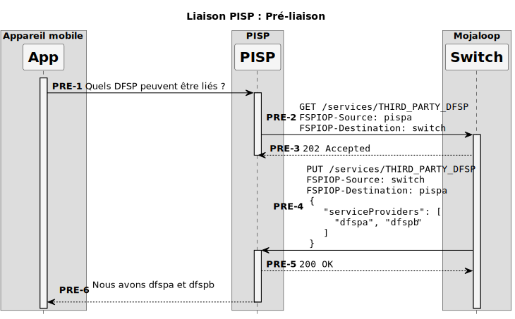

##  3.2 <a id='Discovery'></a>Découverte

Dans cette phase, on demande à l'utilisateur de sélectionner le type et la valeur de l'identifiant qu'il utilise avec le DFSP avec lequel il souhaite se lier. Cela peut être un nom d'utilisateur, un MSISDN (numéro de téléphone), ou une adresse e-mail.

Le résultat de cette phase est une liste de comptes potentiels disponibles pour la liaison. L'utilisateur choisira ensuite un ou plusieurs de ces comptes sources et le PISP les fournira au DFSP lors de la demande de consentement.

Le DFSP PEUT renvoyer un « accountNickname » au PISP dans la liste des comptes. Cette liste sera affichée à l'utilisateur dans l’application PISP pour qu’il sélectionne quels comptes il souhaite lier. Un DFSP pourrait masquer une partie du surnom selon ses exigences pour afficher les informations sur le compte sans authentifier l’utilisateur.

**REMARQUE :** Lors de l’utilisation du canal d’authentification Web, il est possible que les choix faits (c’est à dire, les comptes à lier) soient remplacés par l'utilisateur dans une vue web. L’utilisateur peut donc décider, pendant la phase d’Authentification, de lier un compte différent de celui d’origine. Cela est parfaitement acceptable et doit être attendu de temps à autre.

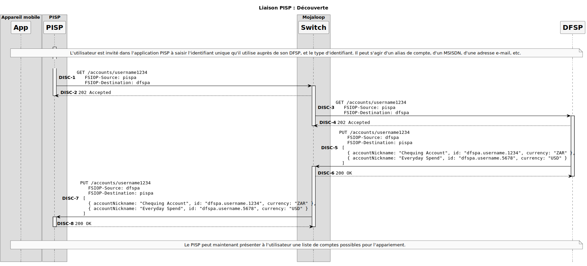

##  3.3 <a id='Requestconsent'></a>Demande de consentement

Dans cette phase, un PISP demande à un DFSP spécifique de démarrer le processus d’établissement du consentement entre trois parties :

1. Le PISP
2. Le DFSP spécifié
3. Un utilisateur présumé client du DFSP ci-dessus

La demande de consentement du PISP doit inclure plusieurs éléments importants :

- Les canaux d’authentification acceptables pour l’utilisateur
- Les périmètres nécessaires dans le cadre du consentement (ici, presque toujours, seulement la possibilité de voir le solde d’un compte spécifique et d’envoyer des fonds depuis un compte).

Certaines informations dépendent du canal d’authentification utilisé (Web ou OTP). Si le canal Web est utilisé, les informations supplémentaires suivantes sont requises :

- Un URI de rappel vers lequel l’utilisateur peut être redirigé avec toute information supplémentaire.

Le résultat de cette phase dépend du canal d’authentification utilisé :

### 3.3.1 <a id='Web'></a>Web

Dans le canal d’authentification Web, le résultat est que le PISP reçoit une URL spécifique où cet utilisateur devrait être redirigé. Cette URL doit être un endroit où l’utilisateur peut prouver son identité (par exemple, via une connexion classique).

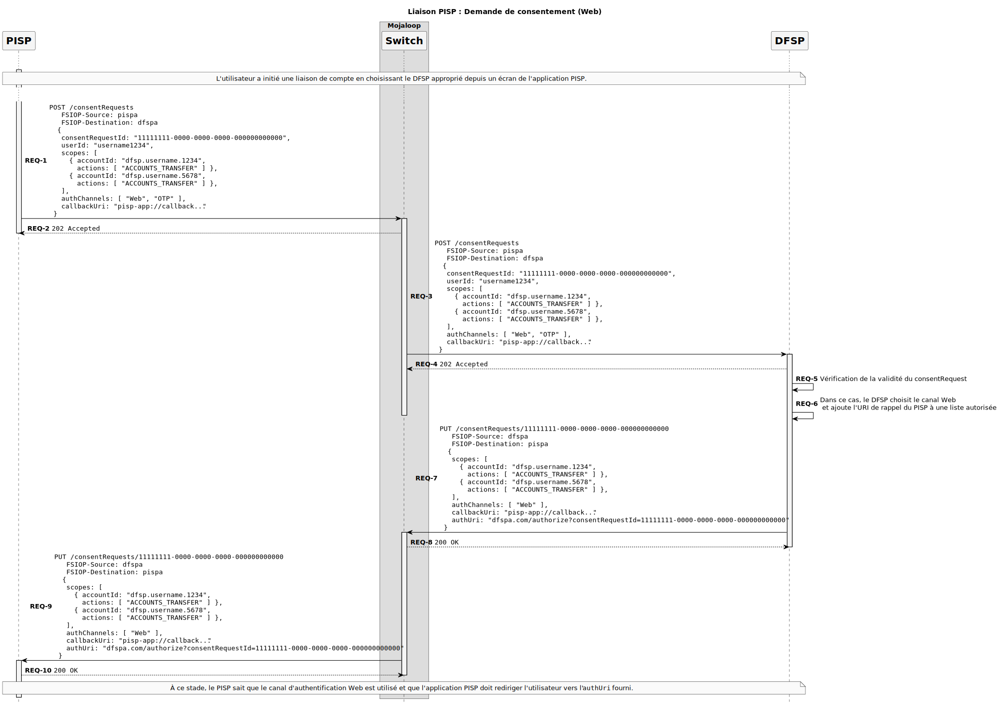

### 3.3.2 <a id='OTPSMS'></a>OTP / SMS

Dans le canal d’authentification OTP, le DFSP envoie un message OTP « hors bande » à son utilisateur (par exemple, par SMS ou e-mail). Le PISP demande à l'utilisateur ce code OTP, et l'inclut dans le champ « authToken » lors du rappel **PATCH /consentRequests/**_{ID}_.

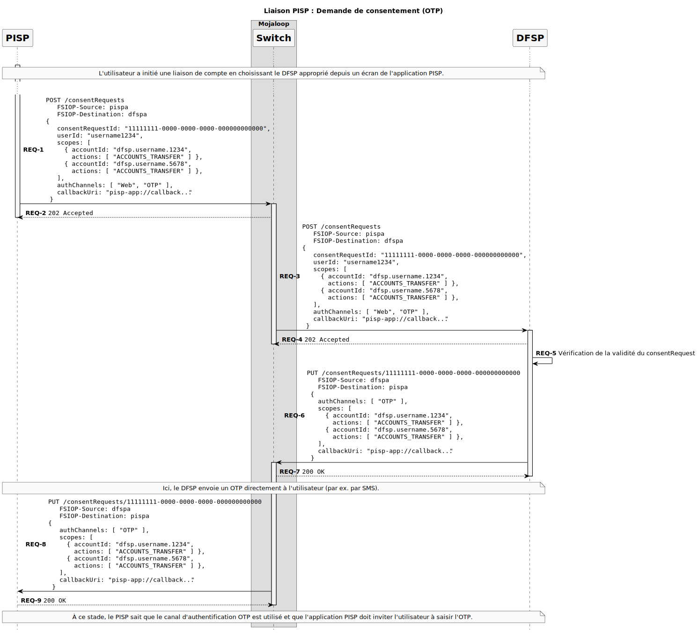

## 3.4 <a id='Authentication'></a>Authentification

Dans la phase d’authentification, il est attendu de l’utilisateur qu’il prouve son identité auprès du DFSP. Une fois cela fait, le DFSP fournira à l’utilisateur un certain type de secret (par exemple, un OTP ou un token d’accès). Ce secret sera alors transmis au PISP afin que celui-ci puisse démontrer une chaîne de confiance :

- Le DFSP fait confiance à l'utilisateur
- Le DFSP donne un secret à l'utilisateur
- L'utilisateur fait confiance au PISP
- L'utilisateur transmet le secret reçu du DFSP au PISP
- Le PISP donne le secret au DFSP
- Le DFSP vérifie que le secret est correct

Cette chaîne aboutit à la conclusion suivante : le DFSP peut faire confiance au PISP pour agir pour le compte de l’utilisateur, et une confiance mutuelle existe entre les trois parties.

Le processus d’établissement de cette chaîne de confiance dépend du canal d’authentification utilisé :

### 3.4.1 <a id='Web-1'></a>Web

Dans le canal Web, le PISP utilise le champ `authUri` renvoyé lors du rappel **PUT /consentRequests/**_{ID}_ pour rediriger l’utilisateur vers le site web du DFSP où il pourra prouver son identité (probablement via un identifiant et mot de passe classique).

**Remarque:** Notez qu’à ce stade, l’utilisateur peut modifier ses choix de comptes à lier. Le résultat sera visible plus tard lors de la phase d'octroi du consentement, dans laquelle le DFSP fournira les bonnes valeurs au PISP dans le champ `scopes`.

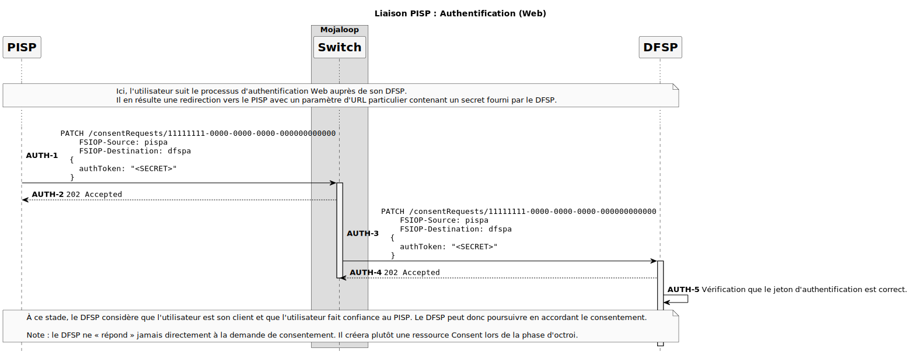

### 3.4.2 <a id='OTP'></a>OTP

Lors de l’utilisation du canal OTP, le DFSP enverra à l’utilisateur un mot de passe à usage unique via un canal préétabli (comme un SMS). Le PISP doit alors demander à l’utilisateur ce mot de passe à usage unique et le renvoyer au DFSP via l’appel API **PATCH /consentRequests/**_{ID}_.

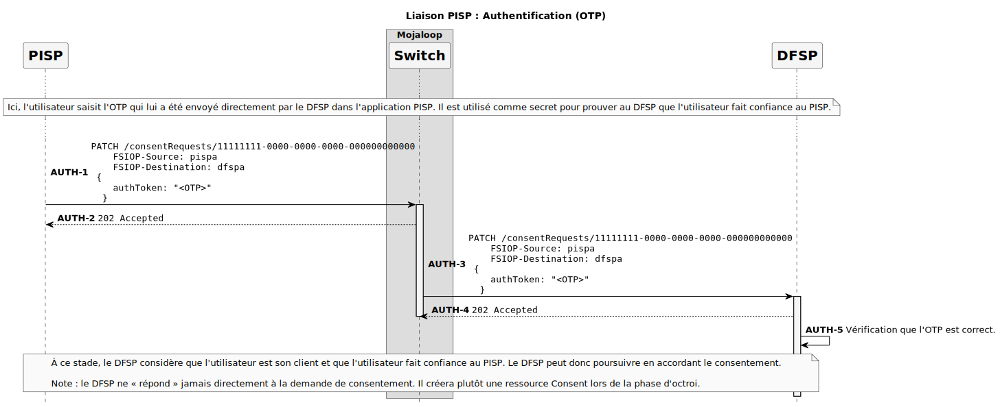

## 3.5 <a id='Grantconsent'></a>Octroi du consentement

Maintenant que la confiance mutuelle a été établie entre les trois parties, le DFSP est capable de créer un enregistrement de ce fait en créant une nouvelle ressource Consent. Cette ressource enregistrera toutes les informations pertinentes sur la relation entre les trois parties, et contiendra éventuellement des informations supplémentaires sur la manière dont l’utilisateur pourra prouver son consentement pour chaque transfert futur.

Cette phase consiste exclusivement à ce que le DFSP demande à ce qu’un nouveau consentement soit créé.

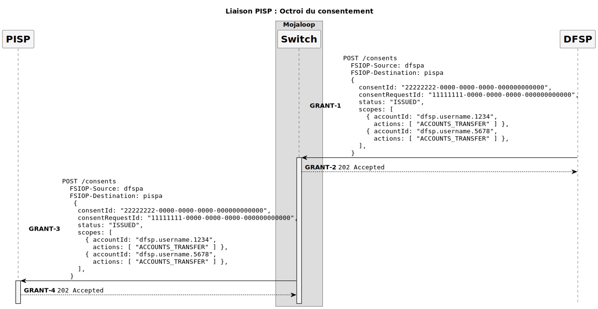

## 3.6 <a id='Credentialregistration'></a>Enregistrement de l'identifiant

Une fois la ressource de consentement créée, le PISP tentera d’établir avec le DFSP l'identifiant qui devra être utilisé pour vérifier que l'utilisateur donne son consentement pour chaque transfert futur.

Cela se fera en stockant un identifiant FIDO (par exemple, une clé publique) sur le service Auth à l'intérieur de la ressource de consentement. Lors des futurs transferts, il sera demandé que ces transferts soient signés numériquement par le credential FIDO (ici la clé privée) pour être considérés comme valides.

Cet enregistrement d’identifiant est composé de trois phases : (1) dériver le challenge, (2) enregistrer l’identifiant, et (3) finaliser le consentement.

### 3.6.1 <a id='Derivingthechallenge'></a>Dérivation du challenge

Le PISP doit dériver le challenge qui sera utilisé comme entrée dans l’étape d'enregistrement de clé FIDO. Ce challenge ne doit pas pouvoir être deviné à l’avance par le PISP.

1. _Soit `consentId` la valeur de `body.consentId` dans la requête **POST /consents**_
2. _Soit `scopes` la valeur de `body.scopes` dans la requête **POST /consents**_

3. Le PISP doit construire l'objet JSON `rawChallenge`
```
{
   "consentId": <body.consentId>,
   "scopes": <body.scopes>
}
```

4. Ensuite, le PISP doit convertir cet objet JSON en une chaîne au format Canonical JSON RFC-8785 ([RFC-8785 Canonical JSON format](https://tools.ietf.org/html/rfc8785))

5. Enfin, le PISP doit calculer un hash SHA-256 de la chaîne JSON canonique, c'est-à-dire : `SHA256(CJSON(rawChallenge))`

La sortie de cet algorithme, `challenge`, sera utilisée comme défi lors du [flux d'enregistrement FIDO](https://webauthn.guide/#registration)

### 3.6.2 <a id='Registeringthecredential'></a>Enregistrement de l'identifiant

Une fois le challenge dérivé, le PISP générera un nouvel identifiant sur le dispositif, signera numériquement le challenge, et fournira des informations supplémentaires sur l'identifiant dans la ressource Consent :

1. L’objet `PublicKeyCredential` — qui contient l’ID de la clé et une [AuthenticatorAttestationResponse](https://w3c.github.io/webauthn/#iface-authenticatorattestationresponse) contenant la clé publique
2. Un champ `credentialType` à la valeur `FIDO`
3. Un champ `status` avec la valeur `PENDING`

> **Remarque :** Objets génériques Credential  
> Bien que nous soyons concentrés d’abord sur FIDO, il est possible que certains PISP souhaitent offrir des services aux utilisateurs via d’autres canaux, par ex. USSD ou SMS. L’API supporte donc aussi un type `GENERIC`, par exemple :  
>```
> CredentialTypeGeneric {
>   credentialType: 'GENERIC'
>   status: 'PENDING',
>   payload: {
>     publicKey: base64(...),
>     signature: base64(...),
>   }
> }
>```

Le DFSP reçoit l’appel **PUT /consents/**_{ID}_ du PISP, et valide éventuellement l'objet Credential inclus dans la requête. Le DFSP demande ensuite au service Auth de créer l’objet `Consent` et de valider l’identifiant.

Si le DFSP reçoit un rappel **PUT /consents/**_{ID}_ du service Auth, avec un `credential.status` à `VERIFIED`, il sait que l’identifiant est valide selon le service Auth.

Sinon, s’il reçoit un rappel **PUT /consents/**_{ID}_**/error**, il sait que quelque chose a mal tourné lors de l’enregistrement du consentement et l'identifiant associé, et peut informer le PISP en conséquence.

Le service Auth est ensuite responsable d'appeler **POST /participants/CONSENTS/**_{ID}_.
Cet appel associera le `consentId` au `participantId` du service Auth et permettra de retrouver plus tard le service Auth correspondant.

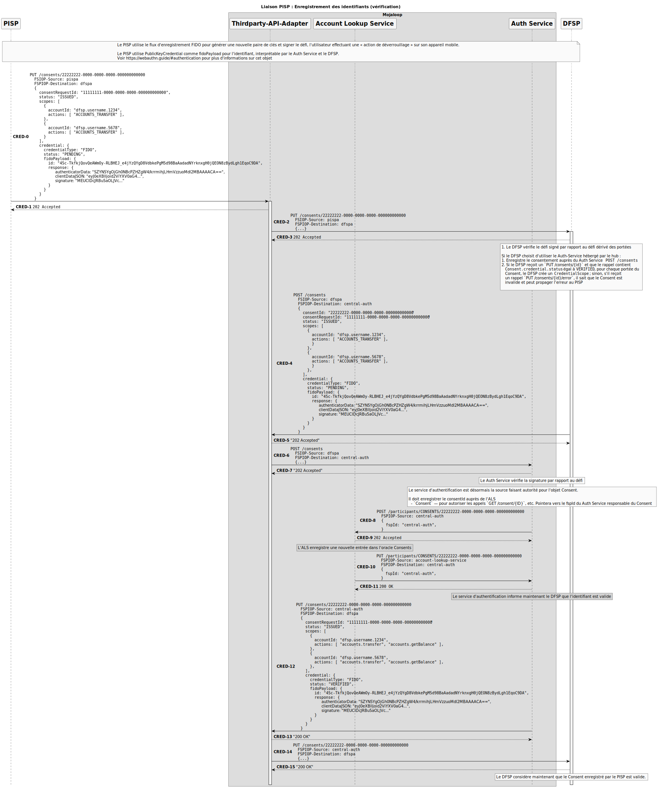

### 3.6.3 <a id='FinalizingtheConsent'></a>Finalisation du consentement

Une fois que le DFSP est sûr que l’identifiant est valide, il appelle **POST /participants/THIRD_PARTY_LINK/**_{ID}_ pour chaque compte dans la liste `Consent.scopes`. Cette entrée représente le lien entre le compte du PISP et celui du DFSP, que le PISP pourra utiliser pour spécifier la _source des fonds_ lors de la demande de transaction.

Enfin, le DFSP appelle **PUT /consent/**_{ID}_ avec l'objet Consent finalisé reçu du service Auth.

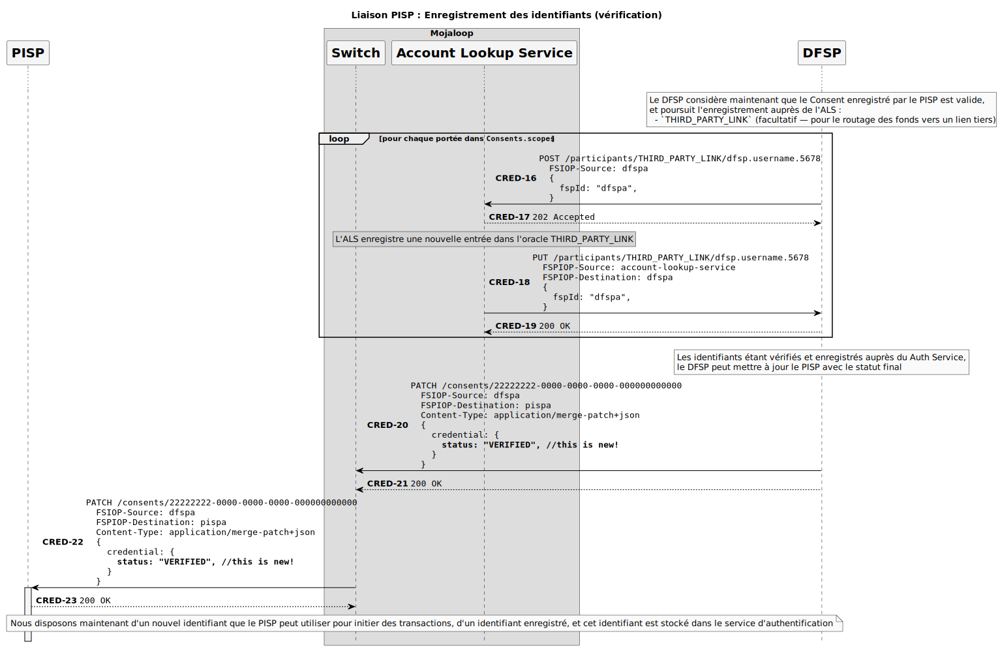


# 4. <a id='Unlinking'></a>Déliaison

À un moment donné, il est possible qu’un utilisateur, un PISP ou un DFSP décide que la relation de confiance précédemment établie ne doit plus exister. Par exemple, un scénario courant peut être la perte du téléphone par un utilisateur, qui utilise l’interface du DFSP pour supprimer le lien entre le dispositif perdu, le PISP et le DFSP.

Pour rendre cela possible, il suffit de fournir un moyen à un membre du réseau de supprimer la ressource de consentement et de notifier les autres parties de cette suppression.

Nous devons gérer 2 scénarios avec une requête **DELETE /consents/**_{ID}_ :
1. Un service Auth hébergé par le DFSP, où aucun détail du consentement n’est stocké dans le Switch ;
2. Un service Auth hébergé par le Switch, où ce service est considéré comme la source autoritaire pour l’objet `Consent`.

## 4.1 <a id='UnlinkingwithoutaSwitchHostedAuthService'></a>Déliaison sans service d'authentification hébergé par le Switch

Dans ce cas, le Switch transmet la requête **DELETE /consents/22222222-0000-0000-0000-000000000000** au DFSP dans l’en-tête `FSPIOP-Destination`.

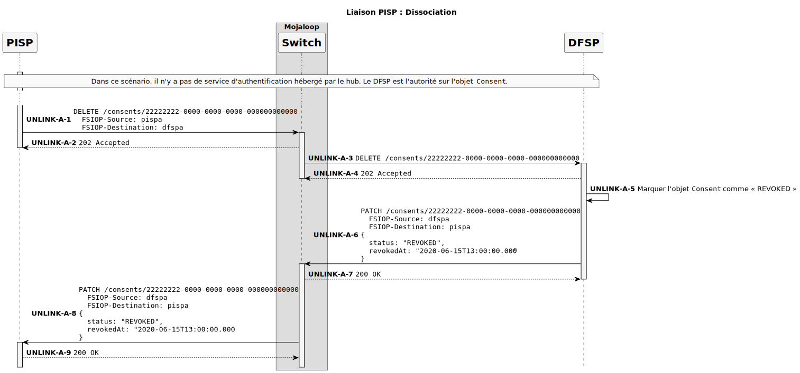

Dans le cas où la déliaison est demandée depuis le côté DFSP, celui-ci peut simplement appeler **PATCH /consents/22222222-0000-0000-0000-000000000000** pour informer le PISP d’une mise à jour sur l’objet `Consent`.

## 4.2 <a id='UnlinkingwithaSwitchHostedAuthService'></a>Déliaison avec service d'authentification hébergé par le Switch

Dans cette instance, le PISP adresse toujours son appel **DELETE /consents/22222222-0000-0000-0000-000000000000** au DFSP via l’en-tête `FSPIOP-Destination`.

En interne, le Switch recherchera la source autoritaire de l’objet `Consent` via l’appel ALS, **GET /participants/CONSENT/**_{ID}_. S’il est déterminé qu’un service Auth hébergé par le Switch « possède » ce consentement, l’appel HTTP **DELETE /consents/**_{ID}_ sera redirigé vers le service Auth.

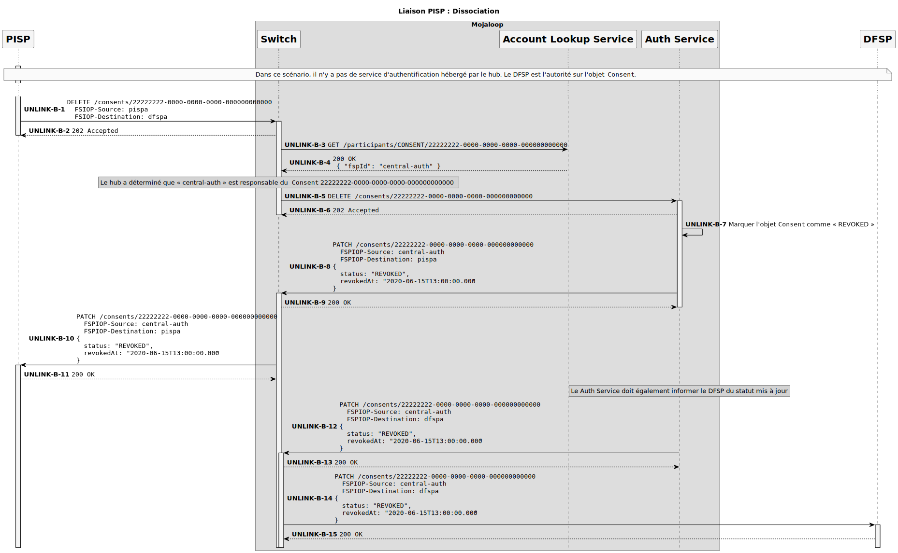

# 5.<a id='ErrorScenarios'></a>Scénarios d’erreur

## 5.1 <a id='Discovery-1'></a>Découverte

Quand le DFSP ne trouve pas d'utilisateur pour l'identifiant dans **GET /accounts/**_{ID}_,
le DFSP répond avec le code d’erreur `6205` via **PUT /accounts/**_{ID}_**/error**.

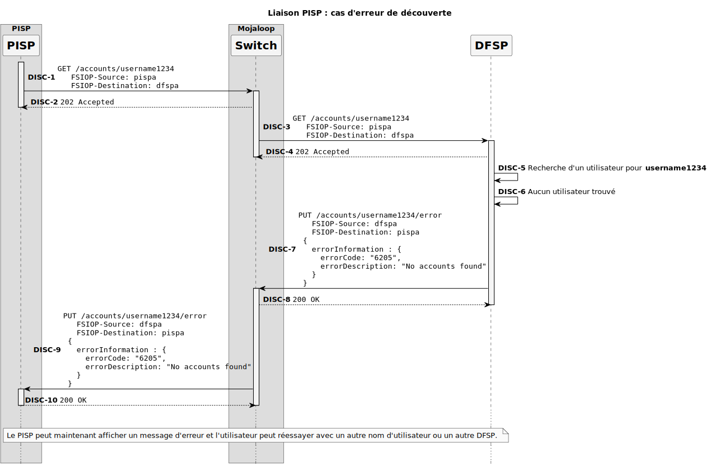

## 5.2 <a id='BadconsentRequests'></a>Erreurs sur les demandes de consentement

Lorsque le DFSP reçoit la requête **POST /consentRequests** du PISP, les erreurs suivantes peuvent survenir :

1. Le DFSP ne supporte pas les périmètres (scopes) spécifiés : `6101`. Par exemple, le `userId` spécifié ne correspond pas aux comptes mentionnés, ou le champ `scope.actions` contient des permissions que ce DFSP ne supporte pas.
2. Le PISP a envoyé un mauvais callbackUri : `6204`. Par exemple, le schéma de callbackUri pourrait être http, ce que le DFSP pourrait choisir de ne pas accepter.
3. Tout autre contrôle ou validation côté DFSP échoue : `6104`. Par exemple, le compte de l’utilisateur pourrait être inactif ou suspendu.

Dans ce cas, le DFSP doit informer le PISP de l’échec en envoyant un rappel **PUT /consentRequests/**_{ID}_**/error** au PISP.


## 5.3 <a id='Authentication-1'></a>Authentification

Lorsqu'un PISP envoie un **PATCH /consentRequests/**_{ID}_ au DFSP, il est possible que le `authToken` soit expiré ou invalide :

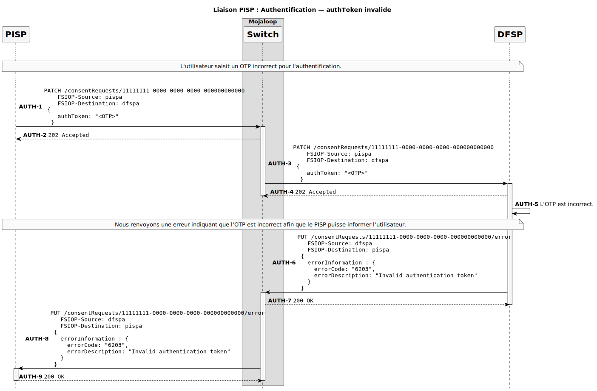
