# Modèles de transaction - Transfert

API Tiers de Mojaloop

### Table des matières

1. [Préface](#Preface)  
    1.1 [Conventions utilisées dans ce document](#ConventionsUsedinThisDocument)  
    1.2 [Informations sur la version du document](#DocumentVersionInformation)  
    1.3 [Références](#References)  
2. [Introduction](#Introduction)  
    2.1 [Spécification de l'API Tiers](#ThirdPartyAPISpecification)  
3. [Transferts](#Transfers)  
    3.1 [Découverte](#Discovery)  
    3.2 [Accord](#Agreement)  
    3.3 [Transfert](#Transfer)  
4. [Demande de statut de TransactionRequest](#RequestTransactionRequestStatus)  
5. [Conditions d’erreur](#ErrorConditions)  
    5.1 [Recherche de Bénéficiaire Incorrecte](#badpayeelookup)  
    5.2 [Mauvaise demande de transaction tierce](#badtptr)  
    5.3 [Échec API FSPIOP aval](#downstreamapifailure)  
    5.4 [Challenge signé invalide](#invalidsignedchallenge)  
    5.5 [Expiration de la demande de transaction tierce](#thirdpartytransactionrequesttimeout)  
6. [Annexe](#Appendix)  
    6.1 [Dérivation du challenge](#DerivingtheChallenge)  

#  1. <a id='Preface'></a>Préface

Cette section contient des informations sur l'utilisation de ce document.

##  1.1. <a id='ConventionsUsedinThisDocument'></a>Conventions utilisées dans ce document

Les conventions suivantes sont utilisées dans ce document pour identifier les types d'informations spécifiés.

|Type d’information|Convention|Exemple|
|---|---|---|
|**Éléments de l’API, comme les ressources**|Gras|**/authorization**|
|**Variables**|Italique avec chevrons|_{ID}_|
|**Termes de glossaire**|Italique à la première occurrence ; défini dans le _Glossaire_|Le but de l'API est de permettre les transactions financières interopérables entre un _Payeur_ (un payeur de fonds électroniques dans une transaction de paiement) situé dans un _FSP_ (une entité qui fournit un service financier numérique à un utilisateur final) et un _Bénéficiaire_ (un destinataire de fonds électroniques dans une transaction de paiement) situé dans un autre FSP.|
|**Documents de bibliothèque**|Italique|Les informations utilisateur ne devraient, en général, pas être utilisées par les déploiements d'API ; les mesures de sécurité détaillées dans _Signature API et Chiffrement API_ devraient être utilisées à la place.|

##  1.2. <a id='DocumentVersionInformation'></a>Informations sur la version du document

| Version | Date | Description du changement |
| --- | --- | --- |
| **1.0** | 2021-10-03    | Version initiale

##  1.3. <a id='References'></a>Références

Les références suivantes sont utilisées dans cette spécification :

| Référence | Description | Version | Lien |
| --- | --- | --- | --- |
| Réf. 1 | Open API pour l'interopérabilité FSP | `1.1` | [Définition d’API v1.1](https://github.com/mojaloop/mojaloop-specification/blob/master/fspiop-api/documents/v1.1-document-set/API%20Definition%20v1.1.md)|


#  2. <a id='Introduction'></a>Introduction

Ce document présente les modèles de transaction pris en charge par l'API Tiers en lien
avec l'initiation d'une demande de transaction (Transaction Request) provenant d’un PISP.

La conception de l’API et le style architectural de cette API sont basés sur la [Section 3](https://github.com/mojaloop/mojaloop-specification/blob/master/fspiop-api/documents/v1.1-document-set/API%20Definition%20v1.1.md#3-api-definition) de la Réf. 1 ci-dessus.

##  2.1 <a id='ThirdPartyAPISpecification'></a>Spécification de l'API Tiers

La spécification de l’API Tiers Mojaloop inclut les documents suivants:

- [Modèles de données](./data-models.md)
- [Modèles de transaction - Liaison](./transaction-patterns-linking.md)
- [Modèles de transaction - Transfert](./transaction-patterns-transfer.md)
- [Définition Open API Tiers – DFSP](./thirdparty-dfsp-v1.0.yaml)
- [Définition Open API Tiers – PISP](./thirdparty-dfsp-v1.0.yaml)


# <a id='Transfers'></a>3. Transferts

Les transferts sont divisés en sections séparées :
1. **Découverte** : Le PISP recherche le bénéficiaire auquel envoyer des fonds

2. **Accord** : Le PISP confirme le bénéficiaire, et recherche les conditions de la transaction. Si l'Utilisateur accepte les conditions de la transaction, il signe la transaction avec l'identifiant établi lors du flux d’API de liaison

3. **Transfert** : Le DFSP du payeur initie la transaction et informe le PISP du résultat de celle-ci.

##  <a id='Discovery'></a>3.1 Découverte

Dans cette phase, un utilisateur saisit l'identifiant de l'utilisateur à qui il souhaite envoyer des fonds. Le PISP exécute un appel **GET /parties/**_{Type}/{ID}_** (ou **GET /parties/**_{Type}/{ID}/{SubId}_) et attend un rappel (callback) du switch Mojaloop. [Section 6.3](https://github.com/mojaloop/mojaloop-specification/blob/master/fspiop-api/documents/v1.1-document-set/API%20Definition%20v1.1.md#63-api-resource-parties)
de la Réf. 1 décrit la ressource **/parties** en détail.

Si la demande **GET /parties/**_{Type}/{ID}_ réussit, le PISP recevra un rappel **PUT /parties** du switch Mojaloop. Le PISP confirme alors le bénéficiaire avec son utilisateur.

Si le PISP reçoit un rappel **PUT /parties/**_{Type}/{ID}_**/error** (ou **PUT /parties/**_{Type}/{ID}/{SubId}_**/error**), il doit afficher l’erreur pertinente à l'utilisateur.


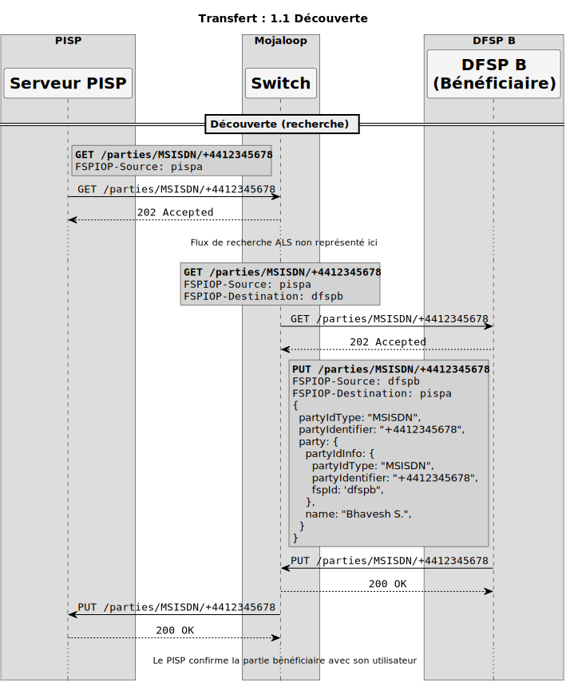

## <a id='Agreement'></a>3.2 Accord

### <a id='thirdpartyTransactionRequest'></a>3.2.1 Demande de transaction tierce

Après avoir confirmé les détails du bénéficiaire avec son utilisateur, le PISP demande à l'utilisateur de saisir le `montant` à envoyer au bénéficiaire, et s’il souhaite que le bénéficiaire _reçoive_ ce montant, ou qu'il souhaite _envoyer_ ce montant (champ `amountType`).

Si l'utilisateur a associé plus d'un compte avec l'application PISP, le PISP peut lui demander de choisir un compte source pour le virement. Une fois la source de fonds confirmée, le PISP peut déterminer :
1. le `FSPIOP-Destination` comme le DFSP avec lequel le compte de l'utilisateur est associé
2. Le champ `payer` du corps de la requête **POST /thirdpartyRequests/transactions**. `partyIdType` est `THIRD_PARTY_LINK`, `fspId` est le fspId du DFSP qui a émis la liaison, et `partyIdentifier` est l’`accountId` spécifié dans le corps **POST /consents#scopes**.

> Voir [Accorder consentement](./transaction-patterns-linking.md#Grantconsent) pour plus d’informations.

Le PISP génère ensuite un `transactionRequestId` aléatoire de type UUID (voir [RFC 4122 UUID](https://tools.ietf.org/html/rfc4122)).

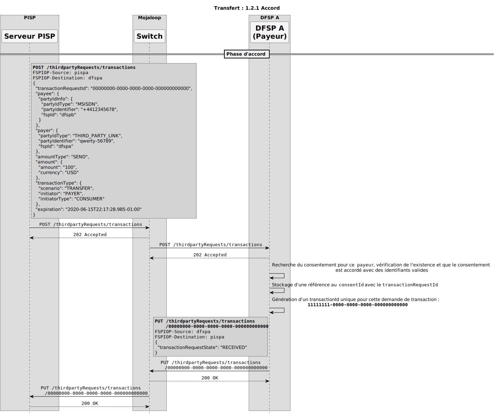

Lors de la réception de l'appel **POST /thirdpartyRequests/transactions** du PISP, le DFSP effectue certaines validations telles que :
1. Déterminer que l'identifiant `payer` existe, et a bien été émis par ce DFSP au PISP spécifié dans `FSPIOP-Source`.
2. Confirmer que le `Consentement` identifié par `payer` existe et est valide.
3. Confirmer que le compte de l'utilisateur est actif et a suffisamment de fonds pour effectuer la transaction.
4. Toute autre validation que le DFSP souhaite effectuer.

Si cette validation réussit, le DFSP génère un `transactionId` unique pour la demande, et appelle **PUT /thirdpartyRequests/transactions/**_{ID}_ avec ce `transactionId` et l’état `transactionRequestState` à `RECEIVED`.

Cet appel informe le PISP que la demande de transaction tierce a été acceptée, et l'informe du `transactionId` final à suivre ultérieurement.

Si la validation échoue, le DFSP doit envoyer un appel **PUT /thirdpartyRequests/transactions/**_{ID}_**/error** au PISP, contenant un message d’erreur expliquant l’échec. Voir [Codes erreurs](./data-models.md#errorcodes) pour plus d’informations.

### <a id='ThirdpartyAuthorizationRequest'></a>3.2.2 Demande d’autorisation tierce

Le DFSP payeur (c’est-à-dire, l’institution envoyant des fonds à la demande du PISP) peut alors émettre une demande de devis (**POST /quotes**) au DFSP bénéficiaire (l’institution recevant les fonds). Après réception du rappel **PUT /quotes/**_{ID}_ du DFSP bénéficiaire, le DFSP payeur doit confirmer les détails de la transaction auprès du PISP.

Il utilise l’appel d’API **POST /thirdpartyRequests/authorizations**. Le corps de la requête contient les champs suivants :

- `transactionRequestId` – l'identifiant original de **POST /thirdpartyRequests/transactions**. Utilisé par le PISP pour corréler une demande d’autorisation à une demande de transaction tierce.
- `authorizationRequestId` – un UUID aléatoire généré par le DFSP pour identifier cette demande d’autorisation tierce
- `challenge` – le challenge est une `BinaryString` qui sera signée par la clé privée sur l'appareil de l'utilisateur. Bien qu'il puisse s'agir d'une chaîne aléatoire, il est recommandé qu’elle soit dérivée à partir de quelque chose de _significatif_ pour les acteurs de la transaction, qui ne puisse être prédit à l’avance par le PISP. Voir [Section 4.1](#DerivingtheChallenge) pour un exemple de dérivation du challenge.
- `transactionType` – le champ `transactionType` de la demande initiale **POST /thirdpartyRequests/transactions**

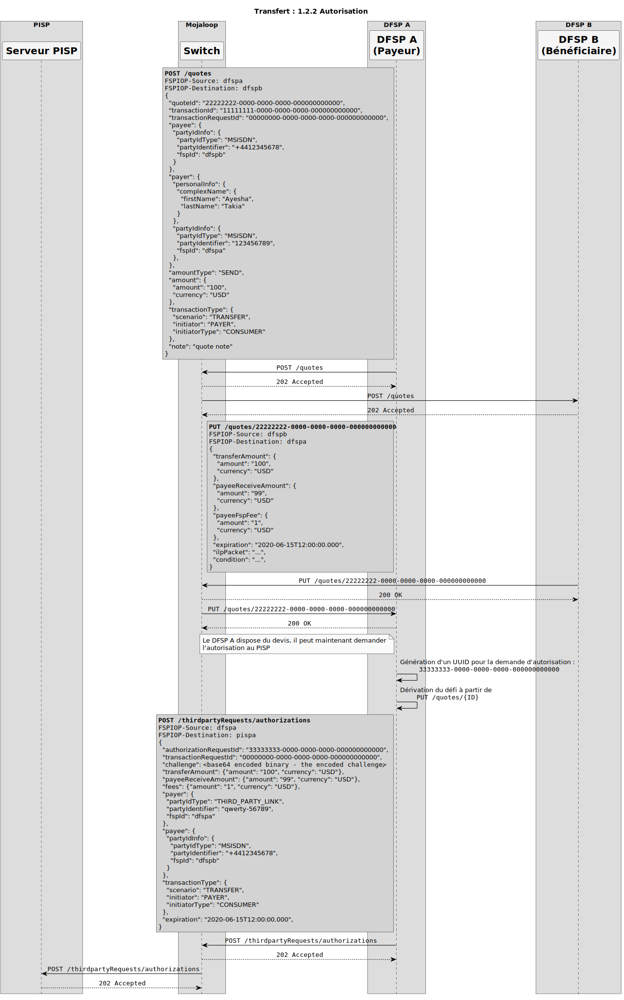

### <a id='SignedAuthorization'></a>3.2.3 Autorisation signée

Une fois la requête **POST /thirdpartyRequests/authorizations** reçue du DFSP Payeur, le PISP présente les conditions de la transaction à l'utilisateur, et lui demande s'il souhaite la poursuivre.

Les résultats de la demande d'autorisation sont retournés au DFSP via **PUT /thirdpartyRequests/authorizations/**_{ID}_, où
_{ID}_ est le `authorizationRequestId`.

Si l’utilisateur rejette la transaction, le payload envoyé dans **PUT /thirdpartyRequests/authorizations/**_{ID}_ est :

```json
{
    "responseType": "REJECTED"
}
```

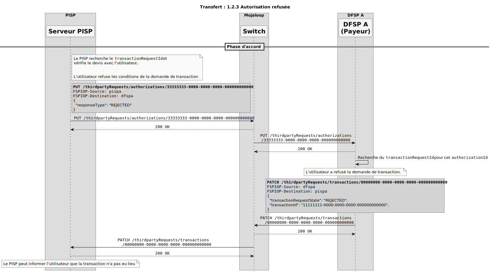

Si l’utilisateur accepte la transaction, le payload dépend du `credentialType` du `Consent.credential` :

1. Si `FIDO`, le PISP demande à l’utilisateur de compléter le flux [FIDO Assertion](https://webauthn.guide/#authentication) pour signer le challenge.
   Le `signedPayload.fidoSignedPayload` est le `FIDOPublicKeyCredentialAssertion` renvoyé suite au processus FIDO. Voir [3.2.3.1 Signature du challenge FIDO](#SigningTheChallengeFIDO)

2. Si `GENERIC`, la clé privée créée lors du [processus d’enregistrement du credential](../linking/README.md#162-registering-the-credential)
   est utilisée pour signer le challenge. Voir [3.2.3.2 Signature du challenge avec un credential GENERIC](#SigningTheChallengeGeneric)

#### <a id='SigningTheChallengeFIDO'></a>3.2.3.1 Signature du challenge FIDO

Pour un `credentialType` FIDO, le PISP demande à l’utilisateur de compléter le flux [FIDO Assertion](https://webauthn.guide/#authentication) pour signer le challenge. Le champ `signedPayload.value` est le [`PublicKeyCredential`](https://w3c.github.io/webauthn/#publickeycredential) renvoyé du processus FIDO Assertion, où les `ArrayBuffer` sont encodés en chaînes base64 utf-8. Le `PublicKeyCredential` est la réponse aussi bien pour l’attestation que pour l’assertion FIDO, nous définissons l’interface suivante : `FIDOPublicKeyCredentialAssertion` :


```json
FIDOPublicKeyCredentialAssertion {
    "id": "string",
    "rawId": "string - base64 encodé utf-8",
    "response": {
        "authenticatorData": "string - base64 encodé utf-8",
        "clientDataJSON": "string - base64 encodé utf-8",
        "signature": "string - base64 encodé utf-8",
        "userHandle": "string - base64 encodé utf-8"
    },
    "type": "public-key"
}
```

Le payload final du **PUT /thirdpartyRequests/authorizations/**_{ID}_ sera ainsi :

```json
{
    "responseType": "ACCEPTED",
    "signedPayload": {
        "signedPayloadType": "FIDO",
        "fidoSignedPayload": FIDOPublicKeyCredentialAssertion
    }
}
```

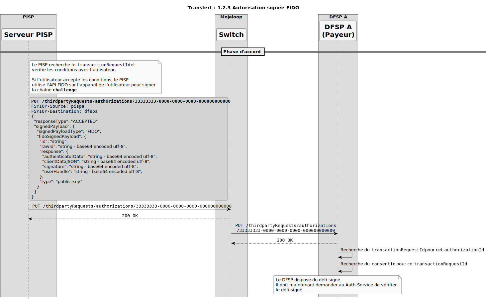

#### <a id='SigningTheChallengeGeneric'></a>3.2.3.2 Signature du challenge avec un credential GENERIC

Pour un credential `GENERIC`, le PISP effectue les étapes suivantes :

1. Étant donné les entrées :
    - `challenge` (`authorizationRequest.challenge`) sous forme de chaîne base64 encodée utf-8
    - `privatekey` (stockée par le PISP lors de la création du credential), chaîne base64 encodée utf-8
    - SHA256() est une fonction de hachage à sens unique, voir [RFC6234](https://datatracker.ietf.org/doc/html/rfc6234)
    - sign(data, key) est une fonction de signature prenant des données et une clé privée pour produire une signature
2. _Soit `challengeHash` le résultat de la fonction SHA256() appliquée au `challenge`_
3. _Soit `signature` le résultat de la fonction sign() appliquée à `challengeHash` et `privateKey`_

La réponse du PISP au DFSP utilise alors cette _signature_ comme champ `signedPayload.genericSignedPayload` :


Le payload final du **PUT /thirdpartyRequests/authorizations/**_{ID}_ est alors :

```json
{
    "responseType": "ACCEPTED",
    "signedPayload": {
        "signedPayloadType": "GENERIC",
        "genericSignedPayload": "signature encodée utf-8 base64"
    }
}
```

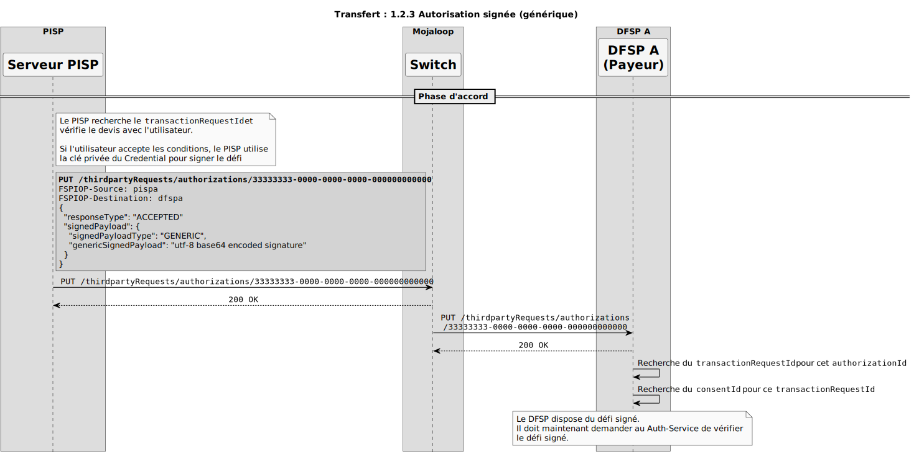

### <a id='ValidateAuthorization'></a>3.2.4 Validation de l’autorisation

> __Note :__ Si le DFSP utilise un service d’autorisation auto-hébergé, cette étape peut être sautée.

Le DFSP doit maintenant vérifier que le challenge a bien été signé, et par la clé privée correspondant à la clé publique attachée à l'objet `Consent`.

Le DFSP utilise l'appel d’API **POST /thirdpartyRequests/verifications**, dont le corps est composé de :

- `verificationRequestId` – Un UUID créé par le DFSP pour identifier cette vérification.
- `challenge` – Le même challenge envoyé au PISP dans [3.2.2 Demande d’autorisation tierce](#ThirdpartyAuthorizationRequest)
- `consentId` – L’identifiant du Consent qui contient la clé publique credential à utiliser pour vérifier cette transaction.
- `signedPayloadType` – Le type de SignedPayload, selon le type d’identifiant enregistré par le PISP
- `fidoValue` ou `genericValue` – Le champ correspondant du corps de la requête **PUT /thirdpartyRequests/authorizations** du PISP.
Le DFSP doit rechercher le `consentId` d’après les détails du `payer` de la `ThirdpartyTransactionRequest`.

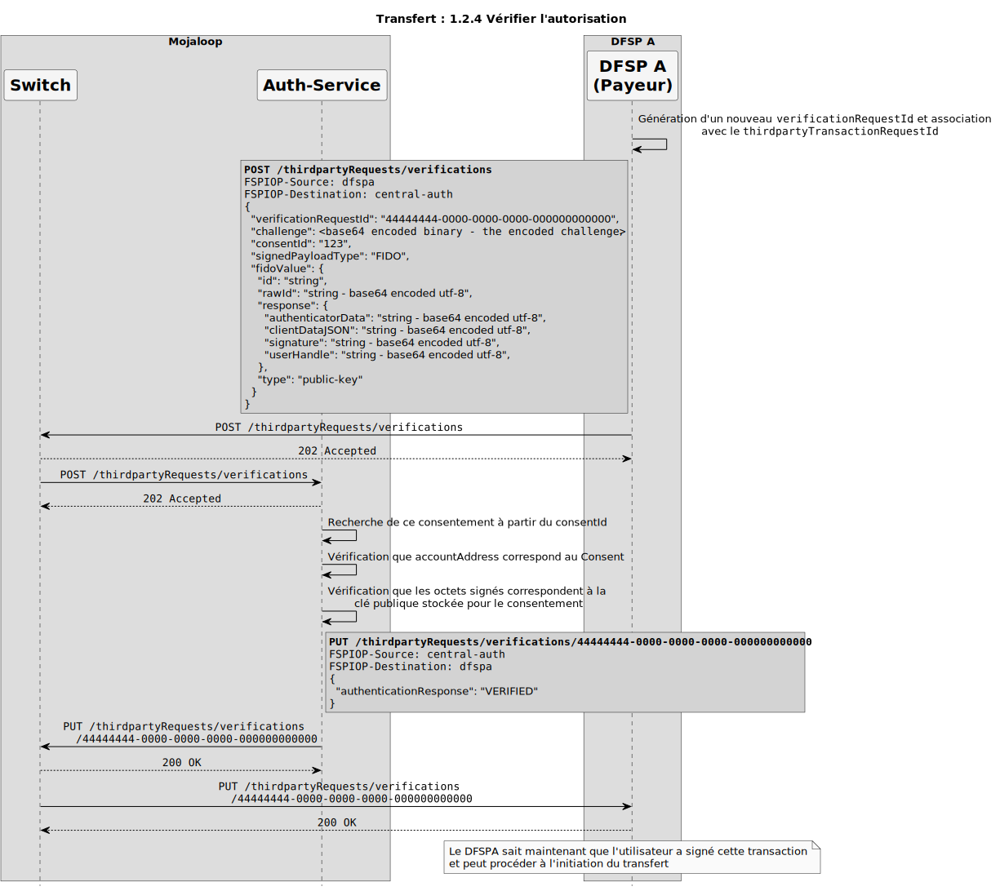

## <a id='Transfer'></a>3.3 Transfert

Après validation du challenge signé, le DFSP peut lancer une transaction Mojaloop standard via l’API FSPIOP.

Après avoir reçu l’appel **PUT /transfers/**_{ID}_ du switch, le DFSP recherche le ThirdpartyTransactionRequestId du transfert donné puis envoie un appel **PATCH /thirdpartyRequests/transactions/**_{ID}_ au PISP.

Une fois ce rappel reçu, le PISP sait que le transfert est réussi et peut en informer son utilisateur.

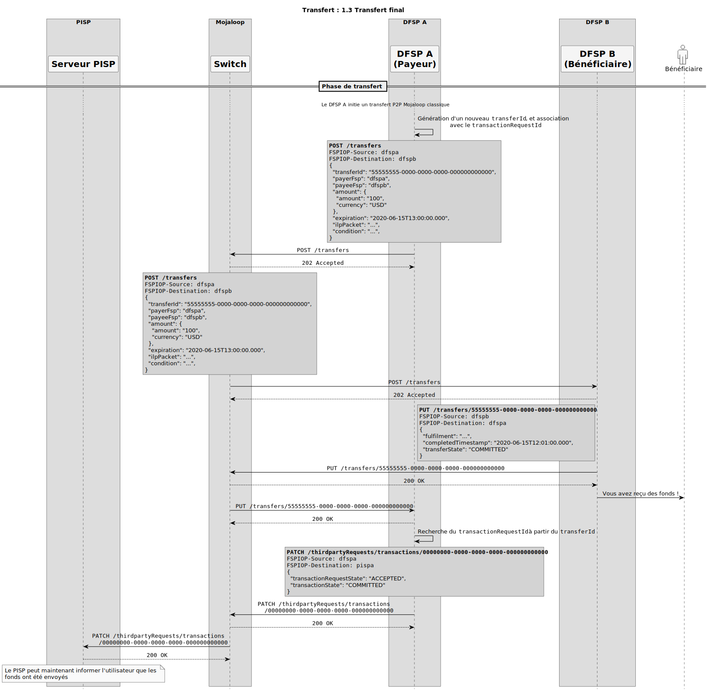

# <a id='RequestTransactionRequestStatus'></a>4. Demander le statut de la TransactionRequest

Un PISP peut effectuer un **GET /thirdpartyRequests/transactions/**_{ID}_ pour obtenir le statut d’une demande de transaction.

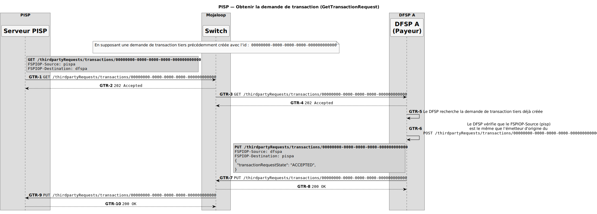

1. Le PISP effectue un **GET /thirdpartyRequests/transactions/**_{ID}_
1. Le switch valide la demande et répond par `202 Accepted`
1. Le switch recherche l’endpoint pour `dfspa` pour la transférer à DFSP A
1. DFSPA valide la demande et répond avec `202 Accepted`
1. Le DFSP recherche la demande de transaction via son `transactionRequestId`
    - Si elle est introuvable, il appelle **PUT /thirdpartyRequests/transactions/**_{ID}_**/error** vers le switch, avec un message d’erreur pertinent

1. Le DFSP vérifie que l'entête `FSPIOP-Source` correspond à celui d’origine du **POST /thirdpartyRequests/transactions**
    - Sinon il appelle **PUT /thirdpartyRequests/transactions/**_{ID}_**/error** vers le switch, avec un message d'erreur pertinent

1. Le DFSP appelle **PUT /thirdpartyRequests/transactions/**_{ID}_ avec le corps suivant :
    ```
    {
      transactionRequestState: TransactionRequestState
    }
    ```

    Où `transactionId` est l’identifiant de transaction généré par le DFSP, et `TransactionRequestState` est `RECEIVED`, `PENDING`, `ACCEPTED`, `REJECTED`, comme défini dans [7.5.10 TransactionRequestState](https://github.com/mojaloop/mojaloop-specification/blob/master/fspiop-api/documents/v1.1-document-set/API%20Definition%20v1.1.md#7510-transactionrequeststate) de la Définition d’API


1. Le switch valide la demande et répond avec `200 OK`
1. Le switch recherche l’endpoint pour `pispa` et transmet au PISP
1. Le PISP valide la demande et répond avec `200 OK`

# <a id='ErrorConditions'></a>5. Conditions d’erreur

Après que le PISP a initié la demande de transaction tierce via **POST /thirdpartyRequests/transactions**, le DFSP doit envoyer soit un **PUT /thirdpartyRequests/transactions/**_{ID}_**/error** soit un rappel **PATCH /thirdpartyRequests/transactions/**_{ID}_ pour informer le PISP du statut final.

- **PATCH /thirdpartyRequests/transactions/**_{ID}_ est utilisé pour informer le PISP du statut final. Il peut s’agir soit d’un rejet par l’utilisateur, soit d’une approbation ayant abouti à un transfert réussi.
- **PUT /thirdpartyRequests/transactions/**_{ID}_**/error** informe le PISP en cas d’échec de la demande.
- Si le PISP ne reçoit aucun de ces rappels avant l’expiration `expiration` spécifiée dans la requête **POST /thirdpartyRequests/transactions**, il peut considérer la demande comme échouée et en informer son utilisateur.


## <a id='badpayeelookup'></a> 5.1 Recherche de bénéficiaire infructueuse

Quand le PISP effectue une recherche de bénéficiaire (**GET /parties/**_{Type}/{ID}_), il peut recevoir le rappel **PUT /parties/**_{Type}/{ID}_**/error**. 

Voir [6.3.4 Parties Error Callbacks](https://docs.mojaloop.io/mojaloop-specification/documents/API%20Definition%20v1.0.html#634-error-callbacks) de la Définition d’API FSPIOP pour plus d’informations sur ce rappel d’erreur.

Dans ce cas, le PISP peut vouloir afficher un message d’erreur à l’utilisateur, en l’invitant à essayer avec un autre identifiant ou plus tard.

## <a id='badtptr'></a> 5.2 Mauvaise demande de transaction tierce

Quand le DFSP reçoit le **POST /thirdpartyRequests/transactions** du PISP, les erreurs suivantes peuvent se produire :
1. Le `payer.partyIdType` ou `payer.partyIdentifier` est invalide ou pas lié à un **Consent** valide connu du DFSP
2. Le compte utilisateur identifié par `payer.partyIdentifier` n'a pas assez de fonds
3. La devise précisée dans `amount.currency` n’est pas prise en charge par le compte de l’utilisateur
4. `payee.partyIdInfo.fspId` n’est pas défini — il s’agit d’une propriété optionnelle, mais le fspId bénéficiaire sera requis pour adresser correctement la demande de devis
5. Tout autre contrôle ou vérification côté DFSP échoue

Dans ce cas, le DFSP doit informer le PISP de l’échec en envoyant un rappel **PUT /thirdpartyRequests/transactions/**_{ID}_**/error**.

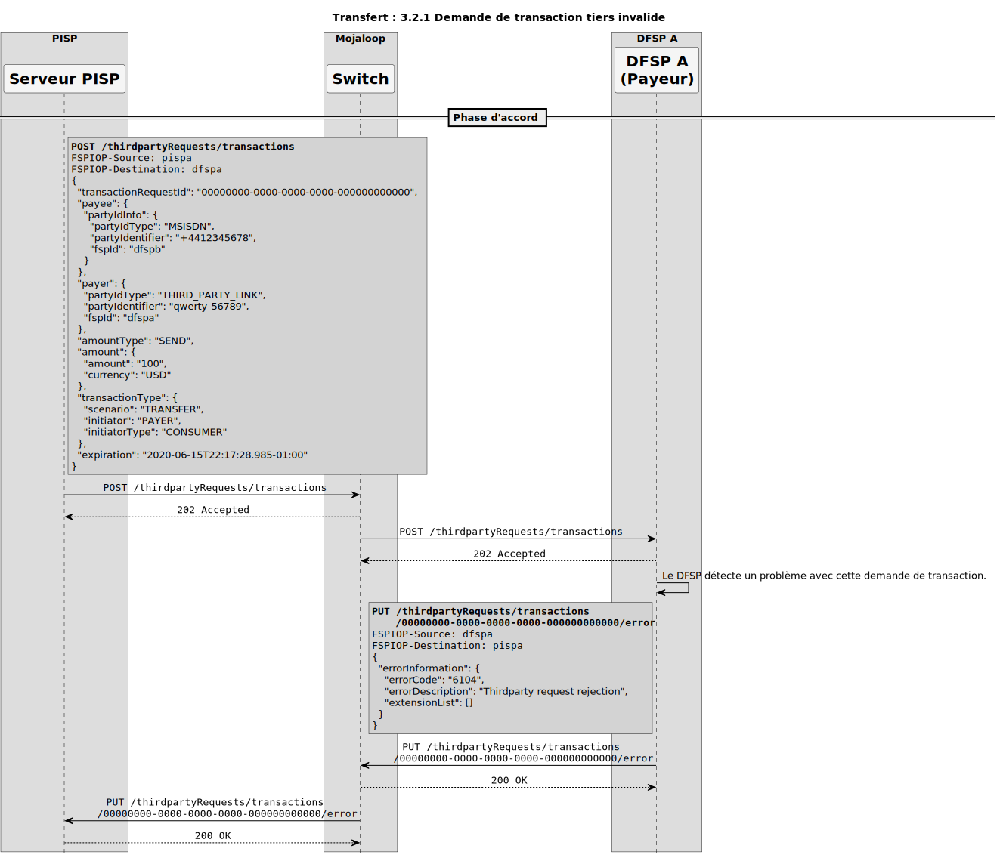

Le PISP peut alors informer son utilisateur de l’échec, et proposer de relancer une demande s’il le souhaite.

## <a id='downstreamapifailure'></a> 5.3 Échec API FSPIOP aval

Le DFSP peut ne pas vouloir, ou ne pas être en mesure, d’exposer des détails sur les échecs API FSPIOP aval au PISP.

Par exemple, avant d’émettre un **POST /thirdpartyRequests/authorizations** au PISP, si le **POST /quotes** avec le FSP bénéficiaire échoue, le DFSP envoie un rappel **PUT /thirdpartyRequests/transactions/**_{ID}_**/error** au PISP.

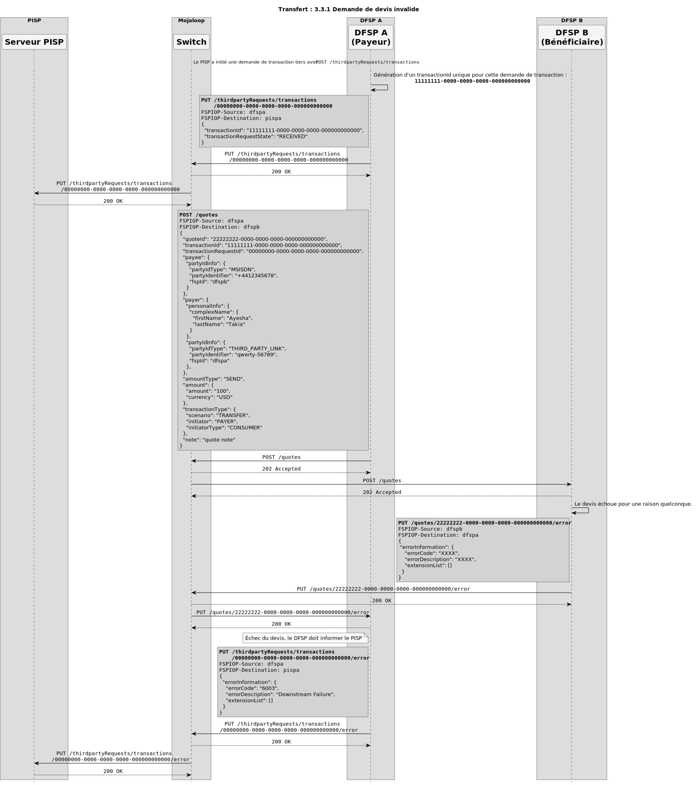

Un autre exemple : si la requête **POST /transfers** échoue :

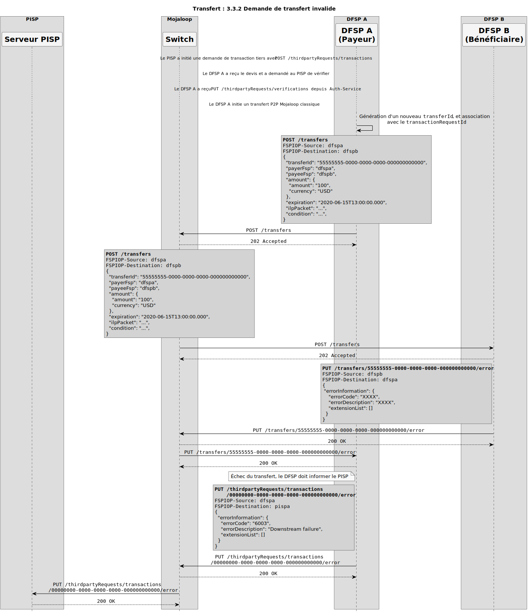


## <a id='invalidsignedchallenge'></a> 5.4 Challenge signé invalide

Après réception d’un **POST /thirdpartyRequests/authorizations** du DFSP, le PISP demande à l'utilisateur de signer le `challenge` via l’identifiant enregistré lors du flux de liaison de comptes.

Le challenge signé est retourné au DFSP via **PUT /thirdpartyRequest/authorizations/**_{ID}_.

Le DFSP :
1. Valide lui-même le challenge signé
2. Ou interroge le Auth-Service via **thirdpartyRequests/verifications** pour vérifier la signature contre la clé publique enregistrée dans le Consent.

Si le challenge signé est invalide, le DFSP appelle alors **PUT /thirdpartyRequests/transactions/**_{ID}_**/error** vers le PISP.

### Cas 1 : DFSP se charge de vérifier le challenge

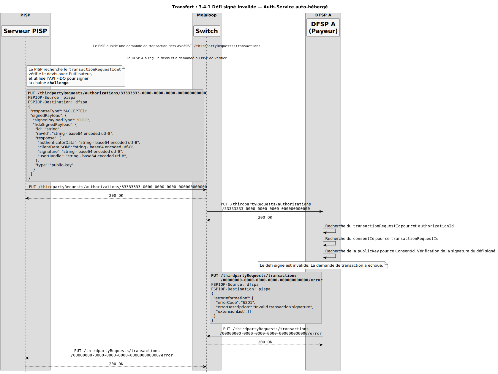

### Cas 2 : DFSP utilise le Auth-Service hébergé par le hub pour vérifier le challenge signé contre le credential enregistré.

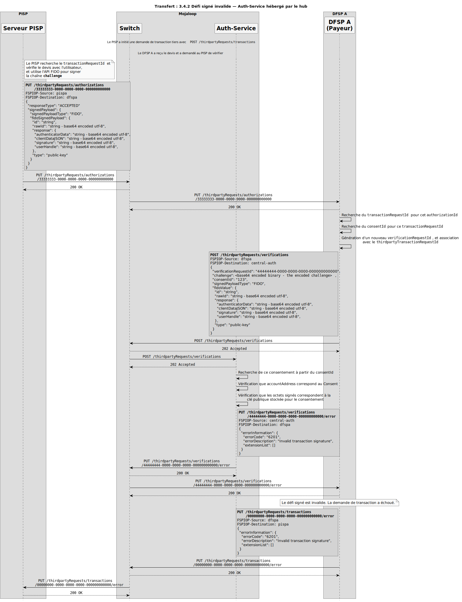

## <a id='thirdpartytransactionrequesttimeout'></a> 5.5 Expiration de la demande de transaction tierce

Si le PISP ne reçoit aucun des rappels ci-dessus avant la date d’expiration `expiration` définie dans **POST /thirdpartyRequests/transactions**, il peut considérer la demande comme échouée et en informer immédiatement l'utilisateur.


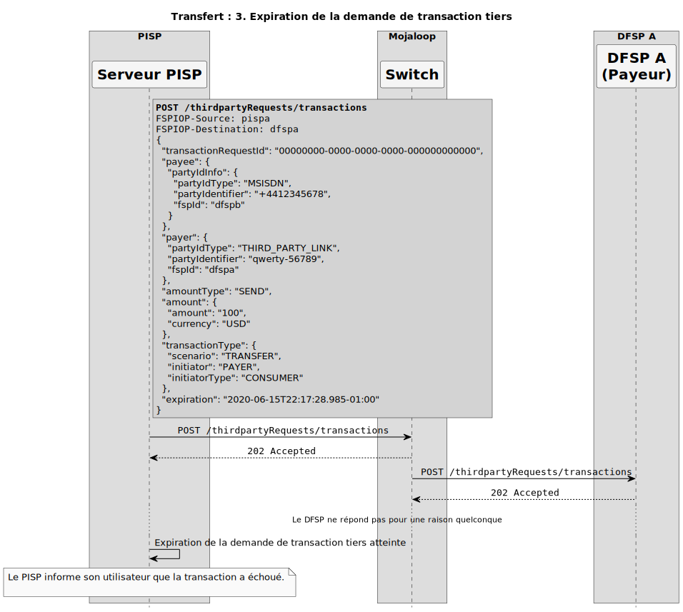

# <a id='Appendix'></a>6. Annexe

## <a id='DerivingtheChallenge'></a>6.1 Dérivation du challenge

1. _Soit `quote` la valeur du corps de la réponse du **PUT /quotes/**_{ID}_ _
2. _La fonction `CJSON()` est l’implémentation du JSON Canonical vers une chaîne, conforme à [RFC-8785 - Canonical JSON format](https://tools.ietf.org/html/rfc8785)_
3. _La fonction `SHA256()` est la fonction de hachage SHA-256, conforme à [RFC-6234](https://tools.ietf.org/html/rfc6234)_
4. Le DFSP doit générer la valeur `jsonString` en appliquant `CJSON(quote)`
5. Le `challenge` est la valeur de `SHA256(jsonString)`