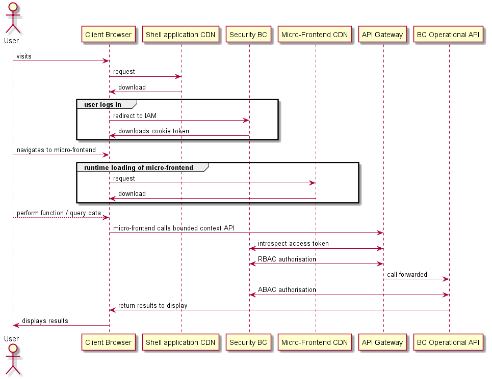
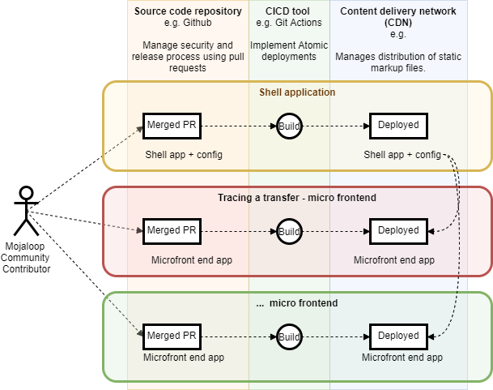

# Micro-frontend - conception JAMStack
## Vue d'ensemble
L'objectif de la conception micro-frontend - JAMStack est de créer un framework qui :

- facilite la collaboration de la communauté (en permettant le développement indépendant de composants)
- rend les extensions ou personnalisations faciles
- permet aux membres de la communauté de contribuer en retour à l'OSS sans forker l'ensemble du code source

### Micro-frontends
Le framework utilise des micro-frontends comme moyen de découpler les parties de l'UI pour permettre des bases de code maintenables, des équipes autonomes, des publications indépendantes et des mises à niveau progressives de parties de l'UI.

### JAMStack
L'implémentation [JAMStack](https://jamstack.org/) réduit le rôle du serveur web à la distribution de fichiers de balisage statiques, en maintenant la fonctionnalité dans JavaScript (qui s'exécute dans le navigateur client) et dans l'API backend.
:::warning JAMStack signifie :
 **J** - JavaScript
 **A** - APIs
 **M** - Static markup (balisage statique)
 :::
Cette implémentation de stack est considérée comme une bonne pratique car elle :
- est beaucoup plus simple à sécuriser
- offre une bonne expérience client grâce à des temps de réponse web rapides
- est peu coûteuse à héberger

De plus, les éléments suivants ont également été conçus et font normalement partie d'une implémentation JAMStack :
- déploiement sur un réseau de distribution de contenu (CDN)
- déploiements atomiques
- utilise des micro-frontends chargés dynamiquement, de sorte que la mise à jour vers la dernière version est automatique

## Pile technologique

1. **React**
Le framework est basé sur la bibliothèque React.
C'est la bibliothèque Single Page Application (SPA) la plus populaire en usage, et de plus ce choix nous permet de capitaliser sur d'autres efforts communautaires facilitant une conversion facile vers cette bibliothèque.
Elle peut être améliorée en utilisant des bibliothèques de conteneurs d'état (Redux, Flux, MobX), mais il n'y a aucune restriction sur une utilisation spécifique.
Les micro-frontends sont livrés avec des stores Redux préconfigurés et isolés.

2. **Webpack 5**
Webpack 5 est actuellement le seul bundler JavaScript qui supporte la séparation de build à distance. Cela se fait en utilisant le Module Federation Plugin.
Il permet une composition au moment de l'exécution pour offrir une expérience utilisateur fluide et entièrement transparente, résultant en une Single Page Application traditionnelle.
Il y a des avantages supplémentaires par rapport aux autres technologies, résultant tous en une empreinte réduite et une meilleure expérience globale pour les utilisateurs.
Webpack 5 implémentera l'intégration host/child micro-frontends au moment de l'exécution.

3. **CI/CD et déploiements atomiques** (par exemple, Github Actions)
Chaque implémentation du Business Operations Framework devra implémenter sa propre solution de déploiement atomique.
Le projet Business Operations standard utilisera Github Actions pour exécuter le pipeline d'intégration continue, exécuter les tests pertinents, construire le micro-frontend individuel et déployer les fichiers statiques résultants sur un CDN et/ou créer une image Docker.
Chaque micro-frontend est publié en complète autonomie : l'application composée peut utiliser les versions mises à jour de chaque micro-frontend individuel automatiquement, sans nécessiter de coordination supplémentaire.

4. **Fonctionnement sur un CDN**
Les micro-frontends peuvent fonctionner sur un CDN. Les builds individuels sont composés uniquement de fichiers statiques (HTML, CSS, JavaScript) et peuvent être déployés dans différents emplacements / différentes URLs.
Tant qu'ils sont disponibles via une connexion sécurisée (HTTPS), les micro-frontends peuvent être servis depuis n'importe quel emplacement et également depuis différents CDN.

5. **Fonctionnement dans Kubernetes**
Les micro-frontends peuvent fonctionner dans un environnement Kubernetes. Deux approches peuvent être adoptées ici :
   - Les micro-frontends individuels et l'application shell sont conteneurisés (par exemple avec Docker) puis hébergés dans Kubernetes.
L'hôte et les applications enfants peuvent être déployés sur le même cluster ou sur des clusters différents tant qu'ils sont accessibles publiquement.
   - Déployer un CDN privé dans le cluster Kubernetes et héberger les fichiers de balisage statiques sur le CDN.
Divers CDN compatibles avec Kubernetes sont disponibles.

## Construction Webpack

L'hôte et les applications enfants incluent des scripts pour construire les artefacts de distribution. La construction peut être effectuée sur la machine hôte du développeur, dans le CI et dans Docker.

## Chargement des micro-frontends

L'hôte est responsable du chargement des applications enfants au moment de l'exécution. Il recueille des informations sur les enfants disponibles au moment de l'exécution, soit depuis une API soit depuis un registre.

L'hôte inclut un moteur interne responsable du chargement uniquement des enfants nécessaires lorsqu'ils doivent être affichés.

Les micro-frontends individuels ne seront pas chargés lorsque ce n'est pas nécessaire (par exemple, lorsqu'une page spécifique n'est pas accédée par l'utilisateur).

**Diagramme de séquence de haut niveau illustrant comment les microservices sont chargés**


### Référentiel de micro-frontends
Afin de fournir une autorité centralisée responsable du contrôle des micro-frontends individuels répondant aux exigences nécessaires, il est suggéré de construire une solution qui fonctionne comme un registre.

Le registre servirait les objectifs suivants :

1. permettre à la communauté d'enregistrer les micro-frontends et de spécifier certains détails
2. exposer une API utilisée par l'hôte pour récupérer des informations sur les micro-frontends disponibles
3. fournir des informations sur les versions des micro-frontends disponibles

Le registre n'existe pas encore, et il n'est pas judicieux de le créer pour le moment.

## Déploiements

Le diagramme de vue d'ensemble suivant montre le déploiement des micro-frontends sur un CDN.
::: tip REMARQUE
Le déploiement de l'API de contexte délimité n'est pas couvert dans ce diagramme.
:::


Les micro-frontends utilisent des déploiements atomiques et aucun build complet n'est jamais requis.

Chaque micro-frontend individuel se déploie indépendamment des autres.

### Intégration Continue / Livraison Continue (CI/CD)

Chaque micro-frontend a sa propre configuration CI/CD ; il n'est pas nécessaire de partager la même configuration ou d'utiliser le même outil CI.

Le CI/CD peut être configuré pour supporter plusieurs environnements, par exemple DEV, QA, PROD.

Voici un exemple de fichier montrant un flux de travail git action.

```yml
# This is a basic workflow to help you get started with Actions

name: CI

# Controls when the action will run. Triggers the workflow on push or pull request
# events but only for the master branch
on:
  push:
    branches: [ master ]
  pull_request:
    branches: [ master ]

# A workflow run is made up of one or more jobs that can run sequentially or in parallel
jobs:
  # This workflow contains a single job called "build"
  build:
    # The type of runner that the job will run on
    runs-on: ubuntu-latest

    strategy:
      matrix:
        node-version: [16.x]


    # Steps represent a sequence of tasks that will be executed as part of the job
    steps:
    # Checks-out your repository under $GITHUB_WORKSPACE, so your job can access it
    - uses: actions/checkout@v2

    # Runs a single command using the runners shell
    - name: Use NodeJS ${{ matrix.node-version }}
      uses: actions/setup-node@v1
      with:
        node-version: ${{ matrix.node-version }}
    - name: Cache node modules
      uses: actions/cache@v2
      env:
        cache-name: cache-node-modules
      with:
        # npm cache files are stored in `~/.npm` on Linux/macOS
        path: '**/node_modules'
        key: ${{ runner.os }}-build-${{ env.cache-name }}-${{ hashFiles('**/yarn.lock') }}
        restore-keys: |
          ${{ runner.os }}-build-${{ env.cache-name }}-
          ${{ runner.os }}-build-
          ${{ runner.os }}-
    - run: yarn install --frozen-lockfile
    - run: yarn lint
    - run: yarn test
    - run: yarn build
#    - name: Slack Notification
#      uses: rtCamp/action-slack-notify@v2.0.2
#      env:
#        SLACK_WEBHOOK: ${{ secrets.SLACK_WEBHOOK }}
```

### CDN

L'application SPA résultante est servie par un CDN ou plusieurs CDN. Les micro-frontends individuels peuvent résider dans différents CDN.

### Kubernetes

L'application SPA résultante peut fonctionner et être servie dans un ou plusieurs environnements Kubernetes.

### Application hôte

L'application hôte est livrée avec une configuration préconfigurée prête à l'emploi. Elle ne nécessite aucune configuration particulière différente d'un SPA traditionnel, autre que la configuration du Module Federation de Webpack 5.
Elle agira comme l'orchestrateur, chargeant les micro-frontends distants et leur fournissant des fonctionnalités à l'échelle de l'application, par exemple l'authentification, le RBAC, le routage côté client.

Il n'y a pratiquement aucune limite à la façon dont l'hôte peut croître et être étendu.
Il est cependant suggéré de centraliser toutes les communications hôte-enfant et les composants partagés dans une bibliothèque externe afin que l'hôte et les enfants aient la même connaissance et que l'intégration ne se brise pas.

### Versionnement des micro-frontends
​L'approche suggérée est de construire un registre où les applications individuelles sont enregistrées. Le registre permettrait de définir une configuration sur chaque application et de suivre toutes les versions disponibles.
​
Le registre exposerait ensuite une API consommée par l'hôte, fournissant des informations sur les micro-frontends disponibles, les versions et les emplacements des artefacts.
​
Le registre serait administré par un opérateur de confiance via une interface utilisateur ; il serait de la responsabilité de l'opérateur de confiance de décider quelle version de chaque application individuelle serait rendue publique et disponible pour l'hôte à charger.
Il permettrait également de tester facilement des versions et de les annuler si nécessaire, tout cela sans avoir besoin de reconstruire et de redéployer les applications.
​
::: tip REMARQUE
Les artefacts de build JS créés par Webpack n'incluent pas la version dans le nom du fichier. Il pourrait être nécessaire de mettre à jour le build afin de différencier les versions. Une approche plus simple qui ne nécessite pas de mettre à jour la configuration de build serait d'héberger les versions sur différentes URLs.
:::
​
### Mise à niveau de l'hôte
​L'hôte est assez bien isolé et la seule chose nécessaire pour faire un versionnement correct est d'utiliser la commande intégrée `yarn version`. Elle créera un nouveau tag git et incrémentera la version de `package.json` selon la façon dont la commande est utilisée (CLI interactif).
​
### Mise à niveau des remotes
​Les remotes sont isolés et la seule chose nécessaire pour faire un versionnement correct est d'utiliser la commande intégrée `yarn version`. Elle créera un nouveau tag git et incrémentera la version de `package.json` selon la façon dont la commande est utilisée (CLI interactif).

### Composition Menu / Application
​L'hôte est configuré pour construire dynamiquement la structure _Menu_ et _Pages_ (avec react-router). Actuellement, le(s) composant(s) _Menu_ est importé de la bibliothèque `@modusbox/react-components`.
​
Il n'est pas strictement nécessaire d'utiliser de tels composants et l'hôte / les remotes pourraient utiliser des composants personnalisés, à condition qu'ils permettent la composition dynamique et supportent le routage.
​​
## Motivation des micro-frontends en détail

​La construction d'interfaces utilisateur évolutives et distribuées est complexe ; la complexité logique, la configuration des tests, les coûts de build et de déploiement augmentent avec le temps. ​Les décisions architecturales prises dans la phase initiale peuvent générer une complexité inutile et fortement affecter les coûts de développement dans les étapes ultérieures.​ De plus, un seul projet ne s'adapte pas bien aux équipes distribuées travaillant en collaboration sur la même base de code.​ Passer à une configuration micro-frontend peut résoudre tous les problèmes ci-dessus ; elle s'adapte bien, les déploiements atomiques ne nécessitent pas de build complet, et les équipes indépendantes peuvent utiliser différentes bases de code.​​

### Ce qui définit un micro-frontend

​Les règles principales qui peuvent définir une configuration micro-frontend peuvent être résumées comme suit :​

**Responsabilité unique**
Frontières définies et fermées
Orchestration centralisée​
Responsabilité unique
​Chaque application micro-frontend ne devrait fournir que des fonctionnalités métier spécifiques. Une application micro-frontend n'a pas besoin de connaître d'autres aspects de l'activité et peut évoluer indépendamment.​

**Frontières définies et fermées**
​Chaque micro-frontend devrait être isolé, posséder ses propres données, et la communication directe entre micro-frontends ne devrait pas être possible.​

**Orchestration centralisée**
​Chaque micro-frontend devrait être chargé, géré et contrôlé par un hôte. Les fonctionnalités à l'échelle de l'application sont fournies par l'hôte (authentification, routage, etc.).​​

### Types de configurations de micro-frontends

​Il existe plusieurs façons d'implémenter des micro-frontends, pour en citer quelques-unes :​
- Composition par Iframe
- Composition à l'exécution
- Composition par fédération de modules (framework unique)​

**Composition par Iframe**
​La composition par Iframe est probablement la façon la plus ancienne et la plus facile d'implémenter des micro-frontends, grâce à l'ancien support HTML pour les iframes et l'isolation de contexte native qu'elle offre. La communication entre l'hôte et les micro-frontends est généralement difficile à réaliser et ne s'adapte pas bien au web moderne.​

**Composition à l'exécution**
​La composition à l'exécution est l'idée de charger dynamiquement des scripts JS situés sur des URLs http/https et de composer le résultat localement. ​Bien qu'elle vous permette théoriquement d'utiliser des technologies indépendantes pour chaque micro-frontend, elle est également très difficile à maintenir en raison des différences entre les frameworks utilisés dans les micro-frontends.​​

**Composition SPA**
​La fédération de modules est une technologie implémentée dans Webpack 5 qui vous permet de charger dynamiquement des modules distants au moment de l'exécution. Combinée avec un framework d'application unique (par exemple React), elle permet aux applications construites d'être divisées en plusieurs micro-frontends sans sacrifier les avantages qu'un SPA offre. Elle présente également l'avantage de tailles de build plus petites.​​

### La configuration choisie

Nous avons choisi d'utiliser la composition SPA avec Webpack 5 et React. Il vaut la peine de mentionner qu'afin de construire un SPA avec plusieurs micro-frontends, un contrat spécifique et rigoureux entre l'hôte et les frontends doit être implémenté et respecté.​ Dorénavant nous ferons référence aux micro-frontends dans la forme technique utilisée par Webpack 5 : les remotes. ​Le contrat est défini par les règles suivantes :​

- L'hôte récupère la liste des remotes dynamiquement et de manière asynchrone
- L'hôte est responsable du chargement des remotes
- L'hôte partage un certain contexte avec les remotes (routage, authentification)
- Les remotes ont des noms uniques
- Les remotes sont déployés sur différentes URLs
- Les remotes n'utilisent pas de règles CSS globales
- Les remotes s'exportent eux-mêmes comme défini par les règles de fédération de modules
- Les remotes partagent la même version de React (et de certaines bibliothèques)​

Lorsque ces règles sont respectées, il n'y a pratiquement aucune limite à la façon dont le SPA peut croître.​ La plupart des dépendances de base utilisées dans chaque frontend sont fournies par l'hôte. Cela facilite leur mise à niveau. ​Chaque application est construite indépendamment des autres ; le pipeline CI/CD reste rapide, les déploiements atomiques ne nécessitent pas de configurations complexes et chaque remote est publié à son propre rythme sans avoir besoin de modifier l'hôte de quelque façon que ce soit.​

### Exemple en direct hébergé sur un CDN

Consultez l'exemple en direct suivant : [https://microfrontend-shell-boilerplate.vercel.app/](https://microfrontend-shell-boilerplate.vercel.app/)

## Dépôts Git

Voici une liste de dépôts Git qui font partie de cette implémentation :

 - [Micro frontend-shell-boilerplate](https://github.com/mojaloop/microfrontend-shell-boilerplate)
 - [Micro frontend-boilerplate](https://github.com/mojaloop/microfrontend-boilerplate)
 - [Micro frontend-utils](https://github.com/modusintegration/microfrontend-utils)
Bibliothèque partagée avec l'application shell et le micro-frontend.
 - [Reporting-Hub BizOps Role Assignment Micro-frontend](https://github.com/mojaloop/reporting-hub-bop-role-ui)
 - [Reporting-Hub BizOps Transaction Tracing Micro-frontend](https://github.com/mojaloop/reporting-hub-bop-trx-ui)

