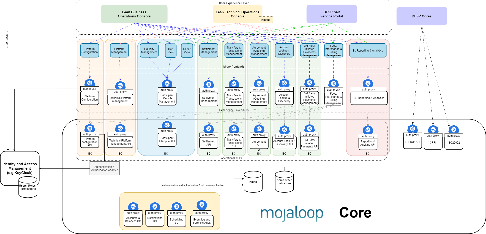

# Introduction

Rejoignez la collaboration pour construire un ensemble de processus métier fondamentaux permettant un **"démarrage rapide"**, faciles à personnaliser, à contribuer en open source et conformes aux meilleures pratiques.

Le Business Operations Framework vise à aider les opérateurs de Hub à construire et déployer des portails de processus métier qui soutiennent leurs processus métier tels que définis dans la [documentation métier Mojaloop](https://docs.mojaloop.io/mojaloop-business-docs/). Le Business Operations Framework soutient la collaboration communautaire dans la création d'une expérience utilisateur (UX) pour un opérateur de Hub Mojaloop qui comprend des API robustes, suit les meilleures pratiques et est sécurisé par conception. L'objectif est de soutenir davantage l'adoption et d'améliorer la valeur prête à l'emploi de la solution Mojaloop.

L'interface utilisateur (UI) résultante n'est pas destinée à être exhaustive, mais à démontrer une expérience web exemplaire qui est facile à étendre et à personnaliser. Il est donc important que le contrôle d'accès basé sur les rôles (RBAC), l'interfaçage avec les systèmes standard de gestion des identités et des accès (IAM), le contrôle de sécurité au niveau API, les micro-frontends et les flux de travail de validation maker-checker soient pris en charge. L'architecture UX suit un bundle pré-compilé avec un modèle API de support pouvant être déployé sur un réseau de distribution de contenu (CDN).

Ce document fournit une conception plus détaillée, incluant les aspects de sécurité, les technologies utilisées et les modèles d'architecture.

Le framework :
1. Implémente une intégration/implémentation RBAC et IAM conforme aux meilleures pratiques.
2. Comprend un plan de déploiement pour intégrer la solution RBAC et IAM dans Mojaloop.
3. Comprend un plan de déploiement pour le portail UI afin qu'il puisse être déployé dans un réseau CDN.
4. Utilise des micro-frontends construits à partir de différents dépôts pour découpler les efforts communautaires et faciliter les extensions et personnalisations.
5. Fournit une piste d'audit de toutes les activités effectuées.

Trois niveaux ou degrés de contrôle sont nécessaires lors de la configuration d'une sécurité conforme aux meilleures pratiques :
1. Accès quotidien aux interfaces utilisateur IAM où les utilisateurs sont créés, suspendus et leurs rôles assignés.
2. Mappages des rôles aux permissions, qui peuvent être modifiés via une demande de changement de configuration.
3. Restrictions sur l'accès à l'API en fonction des permissions disponibles pour un sujet (un utilisateur ou un client API) à travers leurs rôles.

## Effort communautaire – liste des tâches à faire
La première livraison de ce framework comprend une tranche verticale mince pour démontrer l'implémentation fonctionnelle de bout en bout du framework. Bien que cette fonction livrée en premier serve un objectif important, ce n'est pas l'objectif final de ce projet. L'objectif est de fournir un framework auquel d'autres efforts communautaires pourront contribuer. Voici la liste actuelle des tâches d'API de support de processus backend/micro-frontends qui sont destinés à être ajoutés à ce framework par les efforts d'implémentation de la communauté Mojaloop :

|Catégorie|Description|Effort communautaire contributeur|
| --- | --- | --- |
|**Configuration de la plateforme**|Processus pour configurer la plateforme afin qu'elle applique le schéma et les règles du schéma.| - |
|**Gestion de la plateforme**|Contrôles de gestion opérationnelle technique pour la plateforme.| Actuellement réalisé avec Kibana Application Performance Monitoring (APM) et Elasticsearch. Aucun plan actuel de migration vers le framework. |
|**Gestion de la liquidité**|Support de processus pour la gestion de la liquidité.|Financial Portal V2 - pas encore intégré au framework.|
|**Gestion du cycle de vie des participants   (vue Hub)**|Gérer l'intégration et les transitions d'état des participants.|Financial Portal V2 - pas encore intégré au framework.|
|**Gestion du cycle de vie des participants   (vue DFSP)**|Permettre aux DFSP de gérer leur statut et leur interaction avec le Hub.| - |
|**Gestion du règlement**|Interface de gestion pour le règlement.|Rapports de réconciliation DFSP - les rapports Myanmar MFI Digitization (MMD) sont en cours d'intégration dans le framework (accessibles via une API). Règlement net différé multilatéral - Financial Portal V2 pas encore disponible dans le framework.|
|**Gestion des transferts et transactions**| Vue des opérations métier de toutes les transactions au niveau du hub. | Financial Portal V2 - en cours de conversion dans le framework avec des améliorations. Activation du traçage d'un transfert de bout en bout. |
|**Gestion des accords (cotations)**| - | - |
|**Gestion de la recherche et découverte de compte**| - | - |
|**Gestion des paiements initiés par des tiers**| - | - |
|**Gestion des frais (interchange et facturation)**| - | - |
|**Rapports et analytique**| - | - |

## Architecture de référence
Le groupe de travail sur l'architecture de référence a - à travers un processus collaboratif - conçu l'architecture de la version future/suivante de Mojaloop. Le Business Operations Framework est conçu pour fonctionner sur la version actuelle de Mojaloop (core v1.0). Le Business Operations Framework doit cependant être compatible avec l'architecture de référence et, dans la mesure du possible, faciliter le passage vers la conception de l'architecture de référence.

Les éléments suivants du projet Business Operations Framework contribuent directement à la construction d'une architecture de référence :
1. **Contexte délimité de sécurité**
L'implémentation RBAC de ce groupe de travail a utilisé certaines idées de conception et séparations définies dans le contexte délimité de sécurité de l'architecture de référence. Elle n'a pas implémenté les interfaces nécessaires pour être considérée comme une implémentation de contexte délimité de sécurité.
2. **Contexte délimité de reporting**
Une partie du contexte délimité de reporting est construite dans ce groupe de travail.

La division du frontend en micro-frontends pouvant être construits, testés et publiés indépendamment ; donnant aux équipes qui créent des solutions dans chaque contexte délimité la capacité de construire indépendamment des fonctionnalités API et l'UI correspondante. Les personnalisations et extensions de chaque contexte délimité sont également facilement supportées avec cette conception.

Voici une vue d'ensemble de la façon dont les API opérationnelles, les API d'expérience et les micro-frontends peuvent être combinés dans les parties qui forment le Business Operations Framework.

## IaC 4.xx
La prochaine version du projet "Infrastructure as Code" prévoit d'utiliser un ensemble d'outils différent de ceux actuellement utilisés dans la communauté Mojaloop ; c'est-à-dire que WSO2 avec son Identity Server en tant que Key Manager (IS-KM) et les implémentations HAproxy seront remplacés par Keycloak et les outils Ambassador - Envoy. Cette conception est compatible avec la prochaine version IaC.
