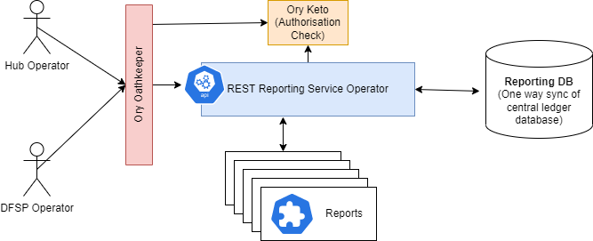

# Guide du développeur de rapports
Ceci est un guide du développeur pour la construction et le déploiement de rapports pour le service REST de reporting qui fait partie du déploiement au niveau du Hub.

## Architecture

[Voici](https://github.com/mojaloop/reporting) le dépôt de l'opérateur du service de reporting.
L'opérateur du service de reporting a été conçu pour être accessible soit par un opérateur de hub, soit par un opérateur DFSP.
L'accès au rapport est contrôlé via l'intégration RBAC qui fait partie du business operations framework. Ory Oathkeeper protège le point de terminaison API de reporting, et Keto est vérifié par l'opérateur du service de reporting pour une autorisation de rapport plus précise.
Les données du rapport sont interrogées depuis la base de données SQL de reporting qui est actuellement une synchronisation unidirectionnelle de la base de données du central ledger.
Chaque rapport est installé sur le système en tant que ressource personnalisée Kubernetes qui est un fichier .yaml d'un format particulier appliqué au cluster Kubernetes. [Voici](https://github.com/mojaloop/reporting-k8s-templates) le dépôt des templates de rapports open source. La définition de ressource personnalisée pour un rapport est définie [ici](https://github.com/mojaloop/reporting-k8s-templates/blob/master/crds/reporting-crd.yaml), qui décrit le format de la ressource personnalisée.

## RBAC
L'accès aux rapports est contrôlé via le RBAC lorsque le service est déployé via la configuration IaC standard.
Cela signifie que pour accéder à un rapport, un utilisateur devra avoir l'autorisation correcte assignée. Cela est réalisé grâce à l'assignation de rôles à l'utilisateur et à l'assignation de l'accès aux participants.

La première vérification d'autorisation est effectuée par Ory Oathkeeper qui dispose d'une règle qui lie la permission
```
reportingApi
```
à l'accès au point de terminaison API du service de reporting.

La vérification d'autorisation suivante est effectuée par l'opérateur du service de reporting. La permission d'accéder au rapport particulier est vérifiée. La permission qui est vérifiée est définie dans la ressource personnalisée. Cette permission est optionnelle et utilisera sinon le nom (metadata) du rapport tel que défini dans la ressource personnalisée.
### Exiger la permission DFSP
Si le rapport est destiné à un participant ou DFSP particulier, il est important d'utiliser le paramètre 'dfspId'. Ce paramètre vérifie d'abord l'autorisation du participant avant d'exécuter et de produire le rapport.
C.-à-d.
``` yaml
 params:
      - name: dfspId
        required: true
```
### Exécuter le rapport
Vous devrez d'abord vous connecter. La façon la plus simple de le faire est de se connecter au Financial Portal. Cela crée les tokens de cookies d'autorisation et d'authentification que le rapport utilise ensuite.
Voici un exemple d'accès au rapport directement après la connexion.
```
https://bofportal.YourEnvironment.YourDomain.com/proxy/reports/MyReportPath?ReportParamter=25
```

### Formats de sortie du rapport
Le rapport prend en charge plusieurs formats de sortie. Pour basculer entre ceux-ci, utilisez le paramètre format dans la requête Rest.
1. Fichier Excel
```
&format=xlsx
```
2. Valeurs séparées par des virgules
```
&format=csv
```
3. Format classe JSON
```
&format=json
```
4. Format navigateur HTML (c'est le format de sortie par défaut)
```
&format=html
```

## Ressource personnalisée Kubernetes
Tous les aspects d'un rapport sont contrôlés via le fichier de ressource personnalisée mojaloopreport. La définition de ce fichier est la suivante.

### Définition de ressource personnalisée
``` yml
kind: CustomResourceDefinition
apiVersion: apiextensions.k8s.io/v1
metadata:
  name: mojaloopreports.mojaloop.io
spec:
  group: mojaloop.io
  scope: Namespaced
  names:
    plural: mojaloopreports
    singular: mojaloopreport
    shortNames:
      - mlreport
    kind: MojaloopReport
    listKind: MojaloopReportList
  versions:
    - name: v1
      served: true
      storage: true
      schema:
        openAPIV3Schema:
          description: MojaloopReport is the Schema for MojaloopReport API
          type: object
          properties:
            apiVersion:
              description: >-
                APIVersion defines the versioned schema of this representation
                of an object. Servers should convert recognized schemas to the
                latest internal value, and may reject unrecognized values. More
                info:
                https://git.k8s.io/community/contributors/devel/sig-architecture/api-conventions.md#resources
              type: string
            kind:
              description: >-
                Kind is a string value representing the REST resource this
                object represents. Servers may infer this from the endpoint the
                client submits requests to. Cannot be updated. In CamelCase.
                More info:
                https://git.k8s.io/community/contributors/devel/sig-architecture/api-conventions.md#types-kinds
              type: string
            metadata:
              type: object
            spec:
              description: MojaloopReport.spec describes the desired state of my resource
              type: object
              required:
                - endpoint
                - queries
                - template
              properties:
                permission:
                  description: Permission to be needed to access this report. This is optional. If unspecified, the name of the resource will be considered as permission.
                  type: string
                endpoint:
                  description: Reporting endpoint
                  type: object
                  required:
                    - path
                  properties:
                    path:
                      description: Report URL path
                      type: string
                    params:
                      description: Report query params
                      type: array
                      items:
                        description: Query param
                        type: object
                        required:
                          - name
                        properties:
                          name:
                            description: Query param name
                            type: string
                          required:
                            description: Make query param required
                            type: boolean
                          default:
                            description: Default query param value
                            type: string
                queries:
                  description: The list of queries used in ejs reporting template
                  type: array
                  items:
                    description: permission ID.
                    type: object
                    required:
                      - name
                      - query
                    properties:
                      name:
                        description: Variable name that the query result will be assigned to
                        type: string
                      query:
                        description: SQL query
                        type: string
                template:
                  description: ejs reporting template
                  type: string

            status:
              description: The status of this MojaloopReport resource, set by the operator.
              type: object
              properties:
                state:
                  description: The state of the report.
                  type: string
      additionalPrinterColumns:
        - name: endpoint
          type: string
          description: Reporting endpoint
          jsonPath: .spec.endpoint.path
  conversion:
    strategy: None
```
Des exemples de rapports conformes à cette ressource personnalisée peuvent être trouvés [ici](https://github.com/mojaloop/reporting-k8s-templates/tree/master/templates).
Veuillez noter que ces fichiers Yaml contiennent également des **directives helm** dans ces fichiers, indiquées par les doubles accolades.
```
{{ some helm directive / function }}
```
Si vous avez l'intention d'appliquer manuellement ces fichiers à Kubernetes, celles-ci devront être supprimées ou remplacées.

### Kubectl
Vous pouvez utiliser la commande suivante pour appliquer une ressource personnalisée de rapport à une instance Kubernetes.
  ```
  kubectl apply -f resources/examples/participant_list.yaml
  ```

Examinons quelques détails de la ressource personnalisée.

### Contrôler la façon dont le rapport est appelé
La première partie de spec: du rapport définit comment le rapport est appelé.
C.-à-d.
``` yaml
spec:
  permission: report-dfsp-settlement-detail
  endpoint:
    path: /dfspSettlementDetail
    params:
      - name: settlementId
        required: true
      - name: fspid
        required: true
```
- **permission** c'est ici que le tag de permission RBAC pour ce rapport est défini
- **path** c'est le chemin du point de terminaison pour ce rapport
- **params** ici les paramètres du rapport sont définis et il est précisé s'ils sont des paramètres requis ou non.

### Contrôler la source des données du rapport
``` yaml
queries:
    - name: dfspInfo
      query: |
        SELECT participantId, name FROM participant WHERE name = :fspid AND name != 'Hub'
    - name: report
      query: |
        SELECT
                pCPayer.participantId as payerFspid,
```
Dans la section queries, n'importe quel nombre de requêtes peut être défini, qui sont exécutées contre la base de données de reporting et chargées dans des classes json nommées.
Les paramètres d'entrée peuvent être utilisés dans les requêtes en utilisant un deux-points devant le nom du paramètre. Par exemple :
```
:paramname
```
### Contrôler l'apparence des rapports
La partie template du fichier de ressource personnalisée contient un script EJS utilisé pour produire le rapport.
Ces scripts ressemblent à du HTML avec du style, mais contiennent du code dans des blocs de script
``` ejs
<% ejs script %>
```
Les scripts EJS sont assez polyvalents et peuvent être utilisés pour modifier un texte de nom, ou définir des fonctions de formatage, ou des boucles qui itèrent à travers les données.

## Construire votre environnement de développement
*(Installation de ce service localement pour faciliter le développement.)*
Actuellement, la seule façon de valider la conception du rapport est d'appliquer le rapport au cluster Kubernetes sur lequel le service de reporting s'exécute. Le service de reporting validera initialement le rapport, puis activera le point de terminaison. Le rapport peut être exécuté et vérifié pour voir s'il répond à ses exigences.

Ce document fournit des instructions pour déployer ce service localement, afin qu'un développeur puisse tester ses conceptions avant d'installer le rapport dans un environnement.
Étant donné que le service de reporting suit le modèle d'opérateur K8S, nous devons déployer un mini cluster Kubernetes sur notre machine et déployer le service de reporting avec certains services dépendants.

### Prérequis
- Assurez-vous d'avoir les logiciels suivants installés
  - git
  - docker
  - minikube
  - kubectl
  - helm
  - mysql-client

### Installer K8S
- Démarrez le cluster K8S minikube avec la commande suivante
  ```
  minikube start --driver=docker --kubernetes-version=v1.21.5
  ```

### Cloner le dépôt
- Télécharger le dépôt
  ```
  git clone https://github.com/mojaloop/reporting.git
  cd reporting
  ```

### Déployer le chart helm
- Installer le chart helm en utilisant les commandes suivantes
  ```
  helm dep up ./resources/test-integration/
  helm install test1 ./resources/test-integration/ --set reporting-legacy-api.image.tag=v11.0.0
  ```
- Attendre que tous les services soient opérationnels
  Vous pouvez surveiller l'état des pods ou utiliser les commandes suivantes pour attendre que les services soient prêts
  ```
  kubectl -n default rollout status deployment test1-reporting-legacy-api
  kubectl -n default rollout status statefulset mysql
  ```

### Restaurer la sauvegarde de la base de données mysql
- Transférer le port du service mysql
  ```
  kubectl port-forward -n default service/mysql 3306:3306
  ```
- Insérer des données d'exemple dans la base de données. Vous pouvez modifier le nom de la base de données et le nom du fichier dans la commande suivante selon vos besoins.
  ```
  mysql -h127.0.0.1 -P3306 -uuser -ppassword default < ./resources/examples/participants_db_dump.sql
  ```

### Charger le template de rapport
- Ajouter la ressource personnalisée en utilisant la commande suivante
  ```
  kubectl apply -f resources/examples/participant_list.yaml
  ```

### Obtenir le rapport
- Transférer le port du service de reporting
  ```
  kubectl port-forward -n default service/test1-reporting-legacy-api 8080:80
  ```
- Obtenir le rapport en ouvrant l'URL suivante dans le navigateur
  ```
  http://localhost/participant-list
  ```

### Nettoyage
- Nettoyage
  ```
  kubectl delete -f resources/examples/participant_list.yaml
  helm uninstall test1
  minikube stop
  ```

## Déploiement dans un environnement de production
Il existe plusieurs façons de déployer une ressource personnalisée de rapport dans un environnement. La méthode qui a été choisie et intégrée à l'offre IaC implique l'utilisation d'un chart helm. (Cela s'aligne bien avec les autres composants Mojaloop.)

L'IaC permet à la fois un déploiement public et privé de rapports. Le processus est identique, à l'exception que le dépôt est privé et réside dans le contrôle de source de l'organisation.
À un niveau élevé, le processus se déroule comme suit :
1. Créer une branche et valider les modifications dans le dépôt depuis lequel le rapport est déployé.
2. Créer une pull request et fusionner les modifications dans la branche master du dépôt.
3. Créer une nouvelle version dans le dépôt. (Selon la configuration, cela déclenche généralement un mécanisme CICD qui construit et publie le package helm.)
4. Mettre à jour l'IaC pour déployer la nouvelle version helm pour les rapports.
5. Exécuter le pipeline approprié pour effectuer le déploiement.

