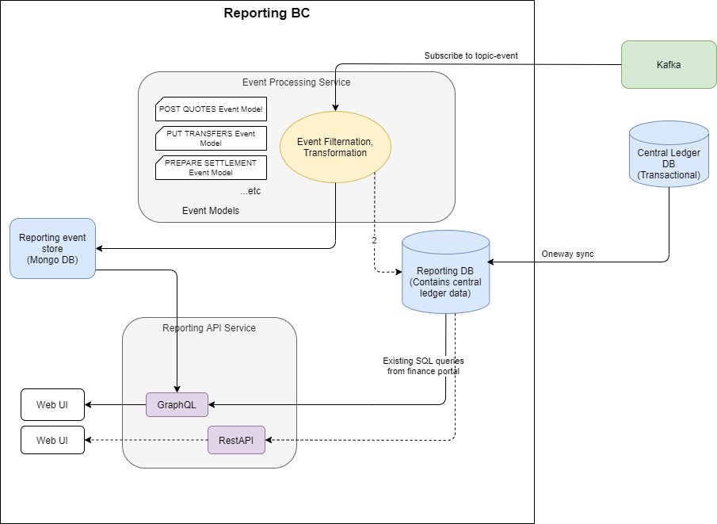
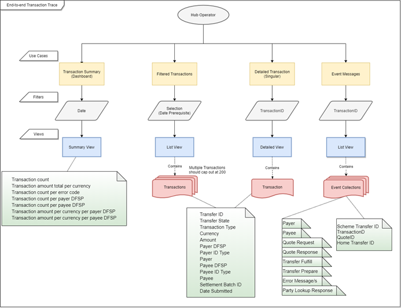

# Implémentation du contexte délimité de reporting
L'un des objectifs de ce projet de groupe de travail est de fournir la capacité de tracer un transfert de bout en bout. Afin de répondre à cet objectif, une partie du contexte délimité de reporting (BC) doit être construite en accord avec l'architecture de référence.

## Vue d'ensemble de la conception
Voici la conception architecturale globale.


Dans Mojaloop, tous les services principaux envoient déjà des événements à Kafka sur un topic (appelé 'topic-event').

Il existe deux bases de données de reporting fondamentales :
1. **Base de données de reporting**
La base de données de reporting est une base de données relationnelle qui suit l'état le plus récent des objets Mojaloop et les rend disponibles via une interface de requête efficace. \
\
Dans l'implémentation de cet effort de groupe de travail, un réplica dédié de la base de données du central ledger sera utilisé pour le reporting. Cela ne correspond pas tout à fait au modèle architectural, car une base de données appartenant au contexte délimité de reporting ne devrait pas avoir de dépendances externes. Une base de données réplica du central ledger dépend du schéma du central ledger et a donc une dépendance externe.
::: warning Dette technique
Cela devrait être reconnu comme une **dette technique** qui doit être remboursée à mesure que davantage de l'architecture de référence est construite.
:::
Deux approches peuvent être adoptées lors du remboursement de cette dette technique :
  - Changer l'appel de réplica en une fonction de **synchronisation de données unidirectionnelle**, ce qui découplerait les schémas des deux bases de données.
  - Reconstruire une nouvelle **base de données relationnelle** conçue, mise à jour en fonction des topics Kafka souscrits.

La meilleure approche dépendra de l'état de la version actuelle de Mojaloop au moment où cette dette sera remboursée. \
\
2. **Magasin de données d'événements**
Le magasin de données d'événements est une capture des détails des événements pouvant fournir une vue de reporting plus détaillée de ce qui s'est passé.

**Limitations de l'effort du magasin d'événements dans ce groupe de travail**
Cette conception sera implémentée sur la version actuelle de Mojaloop.

Actuellement, seules les données nécessaires pour fournir un traçage de bout en bout d'un transfert seront collectées et rendues disponibles via l'API de reporting. Des extensions à cette offre peuvent facilement être ajoutées en étendant le processeur d'événements pour traiter de nouveaux messages de cas d'utilisation et les stocker dans MongoDB, puis en configurant la requête de ressource GraphQL générique pour interroger les nouveaux magasins de données de manière appropriée.

## Alignement avec l'architecture de référence
Bien que le contexte délimité se réfère au reporting et à l'audit, ce projet ne commence qu'à aborder la partie reporting de cette définition. La conception actuelle est indépendante des autres contextes délimités, ce qui est en accord avec l'architecture de référence.
(Il n'y a pas de séparation complète car la conception actuelle utilise une base de données réplica comme base de données de reporting. La dette technique et les prochaines étapes pour résoudre cela sont décrites ci-dessus.)

Il est important de considérer comment ce contexte délimité changera à mesure que davantage de la conception de l'architecture de référence est implémentée.

Les contextes délimités - lors de l'implémentation de l'architecture de référence - cesseront de stocker des données dans les bases de données du central ledger.

Trois approches peuvent être adoptées pour accommoder ce changement. La façon dont l'architecture de référence est construite déterminera la meilleure approche :
1. Modifier la fonctionnalité de synchronisation pour accommoder le nouveau magasin de données du contexte délimité.
2. Étendre le processeur de messages d'événements pour capturer les informations requises dans la base de données de reporting.
3. Appeler les nouvelles API de contexte délimité définies, pour récupérer les données requises.

## Cas d'utilisation pour soutenir le traçage d'un transfert

Afin de tracer efficacement un transfert de bout en bout, quatre cas d'utilisation ont été définis.

### Cas d'utilisation 1 : Vue du tableau de bord

**En tant que** spécialiste des opérations métier d'un opérateur de Hub,
**je veux** un résumé de tableau de bord de haut niveau des transferts passant par le hub, dérivé d'une plage de date-heure,
**afin de** surveiller de manière proactive l'état de santé de l'écosystème.

:::::: col-wrapper
| Données retournées |
| --- |
| Nombre de transferts |
| Montant total des transferts par devise |
| Nombre de transferts par code d'erreur |
| Nombre de transferts par DFSP payeur |
| Nombre de transferts par DFSP bénéficiaire |
| Montant des transferts par devise par DFSP payeur |
| Montant des transferts par devise par DFSP bénéficiaire |
:::::::::

### Cas d'utilisation 2 : Vue de la liste des transferts

**En tant que** spécialiste des opérations métier d'un opérateur de Hub,
**je veux** voir une liste de transferts pouvant être filtrée sur un ou plusieurs des critères suivants :
- Toujours requis (doit être fourni dans chaque appel)
   - Plage de date-heure

- Filtres optionnels
   - Un DFSP bénéficiaire spécifique
   - Un type d'ID bénéficiaire spécifique
   - Un bénéficiaire spécifique
   - Un DFSP payeur spécifique
   - Un type d'ID payeur spécifique
   - Un payeur spécifique
   - État du transfert
   - Devise

- Filtres souhaitables (pas une exigence stricte, mais devraient être fournis si la conception le permet)
   - Un code d'erreur spécifique
   - Fenêtre de règlement
   - ID de lot de règlement : L'identifiant unique du lot de règlement dans lequel le transfert a été réglé. Si le transfert n'a pas encore été réglé, il est vide.
   - Chaîne de recherche sur les messages

**afin de** surveiller de manière proactive l'état de santé de l'écosystème en ayant une vue plus détaillée des données de transfert passant par le hub.

:::::: col-wrapper
| Données retournées | |
| --- | --- |
| ID de transfert | L'identifiant unique du transfert |
| État du transfert | Indique si le transfert a réussi, est en attente ou si une erreur s'est produite |
| Type de transfert | (Par exemple : P2P) |
| Devise | La devise du transfert |
| Montant | Le montant du transfert |
| DFSP payeur  | |
| Type d'ID payeur  | |
| Payeur | |
| DFSP bénéficiaire | |
| Type d'ID bénéficiaire | |
| Bénéficiaire | |
| ID de lot de règlement | L'identifiant unique du lot de règlement dans lequel le transfert a été réglé.<br> Si le transfert n'a pas encore été réglé, il est vide. |
| Date de soumission | La date et l'heure auxquelles le transfert a été initié. |
:::::::::

### Cas d'utilisation 3 : Vue du détail du transfert

**En tant que** spécialiste des opérations métier d'un opérateur de Hub,
**je veux** tracer un transfert spécifique depuis son ID de transfert,
**afin de** pouvoir identifier :

- La chronologie et l'état actuel du transfert
- Toute information d'erreur associée à ce transfert
- Les informations de cotation associées et la chronologie pour ce transfert
- Le statut du processus de règlement associé et les identifiants

:::::: col-wrapper
| Données retournées | |
| --- | --- |
| ID de transfert | L'identifiant unique du transfert |
| État du transfert | Indique si le transfert a réussi, est en attente ou si une erreur s'est produite |
| Type de transfert | (Par exemple : P2P) |
| Devise | La devise du transfert |
| Montant | Le montant du transfert |
| ID de lot de règlement | L'identifiant unique du lot de règlement dans lequel le transfert a été réglé.<br> Si le transfert n'a pas encore été réglé, il est vide. |
| Payeur |  |
| Détails du payeur | L'identifiant unique du payeur (généralement un MSISDN, c'est-à-dire un numéro de mobile) |
| DFSP payeur | |
| DFSP bénéficiaire | |
| Bénéficiaire | |
| Détails du bénéficiaire | L'identifiant unique du bénéficiaire (généralement un MSISDN, c'est-à-dire un numéro de mobile) |
| État du transfert | Indique si le transfert a réussi, est en attente ou si une erreur s'est produite |
| Date de soumission | La date et l'heure auxquelles le transfert a été initié |
:::::::::

### Cas d'utilisation 4 : Vue des messages du transfert

**En tant que** spécialiste des opérations métier d'un opérateur de Hub,
**je veux** voir les messages détaillés depuis son ID de transfert,
**afin de** pouvoir enquêter sur tout problème inattendu associé à ce transfert.

:::::: col-wrapper
| Données retournées | |
| --- | --- |
| ID de transfert du schéma | |
| TransferID | |
| QuoteID | |
| ID de transfert domestique | |
| Informations sur le payeur et le bénéficiaire | Type d'ID, Valeur d'ID, Nom d'affichage, Prénom, Deuxième prénom,<br> Nom, Date de naissance, Code de classification du marchand,<br> ID FSP, Liste d'extensions |
| Réponse de recherche de partie | |
| Demande de cotation | |
| Réponse de cotation | |
| Préparation du transfert | |
| Exécution du transfert | |
| Message(s) d'erreur | |
:::::::::

## Flux de travail métier
Voici un flux de travail métier qui décrit comment les cas d'utilisation sont appelés.


## Outils choisis
### Magasin de données d'événements : MongoDB
La base de données MongoDB a été choisie parce que :
   - MongoDB est actuellement utilisé et déployé dans Mojaloop, et est un outil open-source accepté qui dispose optionnellement d'entreprises standard pouvant fournir un support d'entreprise si nécessaire.
   - MongoDB répondra à nos exigences pour ce projet.
   - D'autres outils ont été considérés mais se sont avérés ne pas répondre à toutes les exigences d'un outil OSS dans Mojaloop.

### API : GraphQL
En plus de l'API de reporting existante, une API GraphQL sera également déployée. Cette nouvelle API aura la fonctionnalité supplémentaire de pouvoir accéder à la base de données de reporting des événements comme données supplémentaires ou données de requête autonomes.

L'implémentation de l'API GraphQL a été ajoutée pour ces raisons :
   - Une implémentation de modélisation RBAC plus naturelle
   - Plus facile de mélanger des données provenant de différentes sources en une seule ressource
   - L'implémentation de la solution de reporting existante a abouti à des instructions SQL très complexes nécessitant des connaissances spécialisées pour être construites et maintenues. La division des données en une ressource plus naturelle et une instruction SQL subséquente simplifie à la fois l'instruction SQL et l'utilisation de cette ressource.
   - Dans l'équipe, nous avions un expert GraphQL qui connaissait la meilleure bibliothèque et les meilleurs outils à utiliser.
   - Une implémentation générique a été construite afin qu'aucune connaissance spéciale de GraphQL ne soit requise pour étendre la fonctionnalité.

**Avantages supplémentaires de l'utilisation de GraphQL**
   - Ressources/permissions RBAC associées réutilisables entre les rapports
   - Les requêtes complexes sont plus simples à construire car les ressources sont modélisées
   - Mélange de sources de données dans une seule requête (par exemple MySQL avec MongoDB)
   - Pas besoin de récupérations imbriquées
   - Pas besoin de récupérations multiples
   - Pas besoin de version d'API. L'API supporte naturellement la compatibilité ascendante entre les versions.
   - API auto-documentée

**Introduction d'une nouvelle technologie**
L'introduction d'une nouvelle technologie dans la communauté comporte certains risques et une exigence d'apprendre et de maintenir une nouvelle technologie. Une tentative de réduire l'impact de ceci a été faite en implémentant l'API selon une approche générique ou de template, minimisant les exigences de connaissance GraphQL pour l'implémentation. Un exemple de requête GraphQL a également été fourni.

L'implémentation GraphQL actuelle est conviviale pour les développeurs.

**Implémentation REST de reporting**
Il existe une implémentation d'API REST de reporting qui a été donnée à la communauté Mojaloop. Il est possible de déployer cette fonctionnalité parallèlement à l'implémentation de l'API GraphQL si cela devient nécessaire.

### API GraphQL - implémentation de ressource générique expliquée
Au cœur de l'implémentation de ce contexte délimité se trouve une implémentation générique qui relie un magasin de données de reporting et une requête à une ressource de données GraphQL ayant sa propre autorisation RBAC. C'est-à-dire qu'une nouvelle ressource personnalisée peut être ajoutée à cette API en effectuant les opérations suivantes :

1. Définir le type de magasin de données
2. Définir la requête
3. Définir les noms et champs de ressource GraphQL
4. Définir la permission utilisateur liée à cette ressource

### Exemples de requêtes GraphQL

**Interroger les transferts filtrés sur un DFSP payeur spécifique**
```GraphQL
query GetTransfers {
  transfers(filter: {
    payer: "payerfsp"
  }) {
    transferId
    createdAt
    payee {
      name
    }
  }
}
```

**Interroger un résumé des transferts**
```GraphQL
query TransferSumary2021Q1 {
  transferSummary(
    filter: {
        currency: "USD"
        startDate: "2021-01-01"
        endDate: "2021-03-31"
    }) {
        count
        payer
  }
}
```


## Construction du magasin de données d'événements
L'objectif du magasin de données d'événements est de fournir un stockage persistant des événements d'intérêt qui sont facilement et efficacement trouvés et interrogés pour le reporting.

Pour réaliser cela avec un minimum de changements structurels par rapport au message original, il a été décidé de traiter le message en catégories et de stocker ces catégories en tant que métadonnées supplémentaires dans le message, qui peuvent être interrogées ultérieurement. Les messages qui ne correspondent pas à ces catégories ne sont pas stockés et sont donc filtrés.

Voici un exemple des métadonnées ajoutées au message JSON :

```json{7-12}
{
    "event": {
        "id" : {},
        "content" : {},
        "type" : {},
        "metadata" : {}
    },
    "metadata" : {
        "reporting" : {
            "transactionId" : "...",
            "quoteId": "...",
            "eventType" : "Quote"
        }
    }
}
```
Où `"eventType"` peut être l'un des suivants :
:::::: col-wrapper
::: col-third
:::

::: col-third
| eventType	|
| ------- |
|Quote |
|Transfer |
|Settlement	|
:::
:::::::::

Le processeur de flux d'événements s'abonnera au topic Kafka `'topic-event'`. Cette file de messages contient tous les messages d'événements. Un degré significatif de filtrage est donc nécessaire.

:::tip REMARQUE
Le code qui implémente cette fonctionnalité a été structuré de manière à ce que ces filtres puissent être facilement modifiés ou étendus.
Les messages souscrits et classifiés sont représentés dans des fichiers 'const' afin qu'ils puissent facilement être ajoutés ou modifiés sans connaissance détaillée du code.
:::

### Stocker uniquement les messages 'audit'

Seuls les messages Kafka de type `'audit'` seront considérés pour la sauvegarde, c'est-à-dire uniquement si :
:::::: col-wrapper
::: col-third
:::
::: col-third
| metadata.event.type |
| ---- |
| audit |
:::
:::::::::

## Messages 'Transfer' qui sont stockés
**ml-api-adapter**

:::::: col-wrapper
| metadata.trace.service |
| ---- |
| ml_transfer_prepare |
| ml_transfer_fulfil |
| ml_transfer_abort |
| ml_transfer_getById |
| ml_notification_event |
:::::::::

## Messages 'Quote' qui sont stockés
**quoting-service**
:::::: col-wrapper
::: col-third
| metadata.trace.service |
| ---- |
| qs_quote_handleQuoteRequest |
| qs_quote_forwardQuoteRequest |
| qs_quote_forwardQuoteRequestResend |
| qs_quote_handleQuoteUpdate |
| qs_quote_forwardQuoteUpdate |
| qs_quote_forwardQuoteUpdateResend |
| qs_quote_handleQuoteError |
| qs_quote_forwardQuoteGet |
| qs_quote_sendErrorCallback |
:::

::: col-third
| metadata.trace.service |
| ---- |
| qs_bulkquote_forwardBulkQuoteRequest |
| qs_quote_forwardBulkQuoteUpdate |
| qs_quote_forwardBulkQuoteGet |
| qs_quote_forwardBulkQuoteError |
| qs_bulkQuote_sendErrorCallback |
:::

::: col-third
| metadata.trace.service |
| ---- |
| QuotesErrorByIDPut |
| QuotesByIdGet |
| QuotesByIdPut |
| QuotesPost |
| BulkQuotesErrorByIdPut |
| BulkQuotesByIdGet |
| BulkQuotesByIdPut |
| BulkQuotesPost |
:::
:::::::::

## Messages 'Settlement' qui sont stockés
**central-settlement**
:::::: col-wrapper
::: col-third
| metadata.trace.service |
| ---- |
| cs_process_transfer_settlement_window |
| cs_close_settlement_window |
| ... |
:::

::: col-third
| metadata.trace.service |
| ---- |
| getSettlementWindowsByParams |
| getSettlementWindowById |
| updateSettlementById |
| getSettlementById |
| createSettlement |
| closeSettlementWindow |
| ... |
:::
:::::::::

## Messages qui restent actuellement non classifiés et sont filtrés
**account-lookup-service (pas dans PI - inclus comme référence)**
:::::: col-wrapper
::: col-third
| metadata.trace.service |
| ---- |
| ParticipantsErrorByIDPut |
| ParticipantsByIDPut |
| ParticipantsErrorByTypeAndIDPut |
| ParticipantsErrorBySubIdTypeAndIDPut |
| ParticipantsSubIdByTypeAndIDGet |
| ParticipantsSubIdByTypeAndIDPut |
| ParticipantsSubIdByTypeAndIDPost |
| ParticipantsSubIdByTypeAndIDDelete |
| ParticipantsByTypeAndIDGet |
| ParticipantsByTypeAndIDPut |
| ParticipantsByIDAndTypePost |
| ParticipantsByTypeAndIDDelete |
| ParticipantsPost |
| PartiesByTypeAndIDGet |
| PartiesByTypeAndIDPut |
| PartiesErrorByTypeAndIDPut |
| PartiesBySubIdTypeAndIDGet |
| PartiesSubIdByTypeAndIDPut |
| PartiesErrorBySubIdTypeAndIDPut |
:::

::: col-third
| metadata.trace.service |
| ---- |
| OraclesGet |
| OraclesPost |
| OraclesByIdPut |
| OraclesByIdDelete |
:::

::: col-third
| metadata.trace.service |
| ---- |
| postParticipants |
| getPartiesByTypeAndID |
| ... |
:::
:::::::::

**transaction-requests-service (pas dans PI - inclus comme référence)**
:::::: col-wrapper
::: col-third
| metadata.trace.service |
| ----- |
| TransactionRequestsErrorByID |
| TransactionRequestsByID |
| TransactionRequestsByIDPut |
| TransactionRequests |
| AuthorizationsIDResponse |
| AuthorizationsIDPutResponse |
| AuthorizationsErrorByID |
:::

::: col-third
| metadata.trace.service |
| ----- |
| forwardAuthorizationMessage |
| forwardAuthorizationError |
| ... |
:::
:::::::::

### Outils utiles

#### Explorateur Kafka
Le logiciel ['kowl'](https://github.com/cloudhut/kowl) de cloudhut est un outil utile pour explorer tous les messages Kafka dans un cluster Mojaloop. Nous pouvons le déployer dans le même namespace que les services de base Mojaloop.

Le fichier de valeurs personnalisées pour le déploiement OSS peut être trouvé dans ce [dépôt](https://github.com/mojaloop/deploy-config/tree/deploy/PI15.2/mojaloop/kowl-kafka-ui).
(Il s'agit d'un dépôt privé, vous pourriez avoir besoin d'une permission pour accéder à ce lien.)

**Étapes d'installation**
```
helm repo add cloudhut https://raw.githubusercontent.com/cloudhut/charts/master/archives
helm repo update
helm install kowl cloudhut/kowl -f values-moja2-kowl-values.yaml
```
**Interface web**
Ouvrez l'URL configurée dans la section `ingress` du fichier `values`.

**Personnalisation supplémentaire**
Pour des informations sur la façon d'ajouter des personnalisations supplémentaires, consultez la [configuration de référence](https://github.com/cloudhut/kowl/blob/master/docs/config/kowl.yaml) fournie par cloudhut.

#### Chemin doré TTK
Les cas de test du chemin doré TTK ont été conçus pour explorer tous les résultats de test possibles lors de l'envoi de transferts. C'est donc un outil important qui peut être utilisé pour tester que la fonctionnalité couvre toutes les éventualités. C'est-à-dire que nous pouvons utiliser le TTK intégré pour exécuter différents cas de test tels que le chemin heureux P2P, les scénarios négatifs, les cas d'utilisation liés au règlement, etc.

## Service de traitement des événements

Le service de traitement des événements est responsable de l'abonnement aux topics Kafka et du filtrage des événements par type d'événement. Le type d'événement se décompose ensuite en plusieurs parties selon le service à partir duquel les événements ont été produits. Les événements filtrés seront ensuite traités en fonction du contexte de la structure de l'événement, et des métadonnées de reporting seront créées.

Exemple :

```json
{
    "event": {
        "id" : {},
        "content" : {},
        "type" : {},
        "metadata" : {}
    },
    "metadata" : {
        "reporting" : {
            "transactionId" : "...",
            "quoteId": "...",
            "eventType" : "Quote"
        }
    }
}
```

| eventType	| Origine de l'événement |
| ------- | ------- |
|Quote | quoting-service |
|Transfer | ml-api-adapter |
|Settlement	| central-settlement |

Le service de traitement des événements s'abonne au flux d'événements Kafka pour construire un magasin lié aux événements de transfert qui peut être interrogé via l'API opérationnelle. Cela est en accord avec l'architecture de référence.
