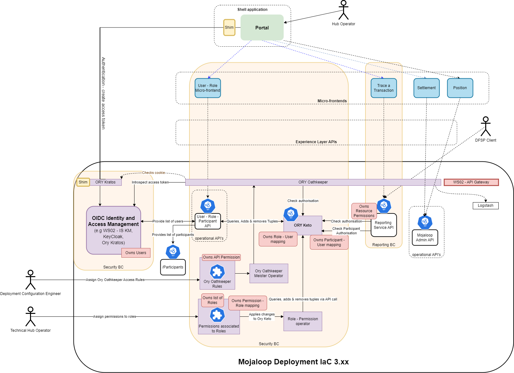
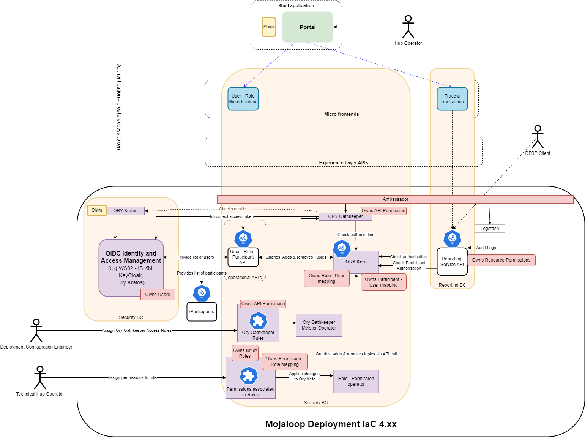
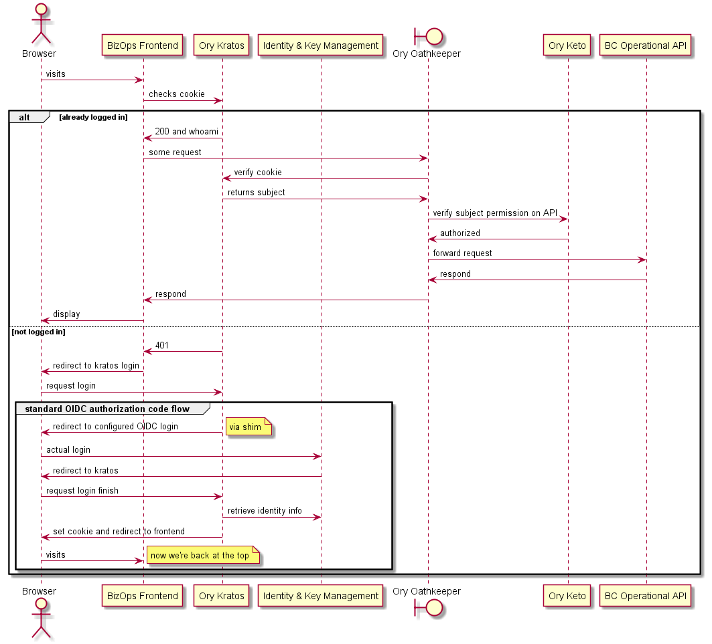
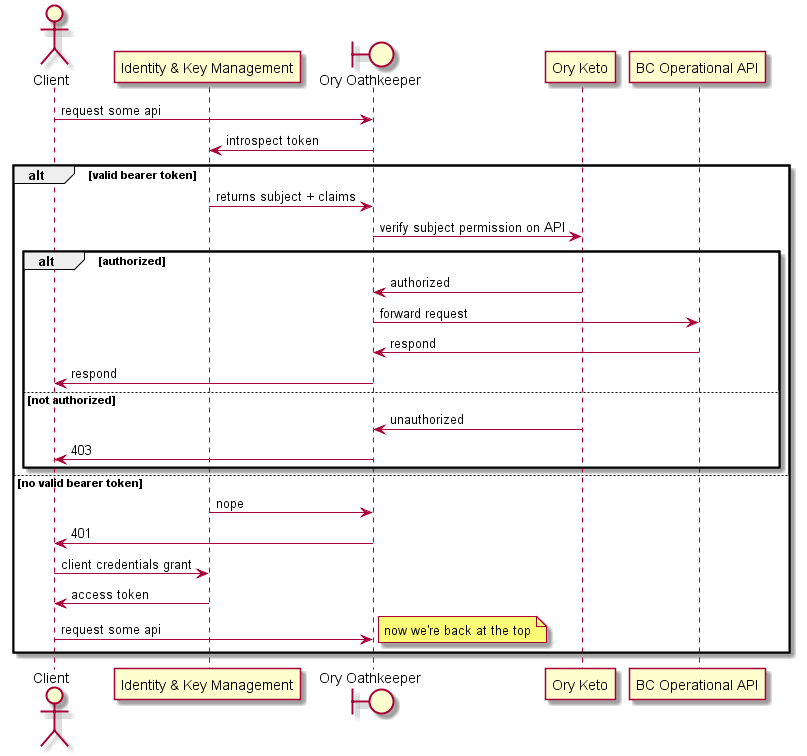
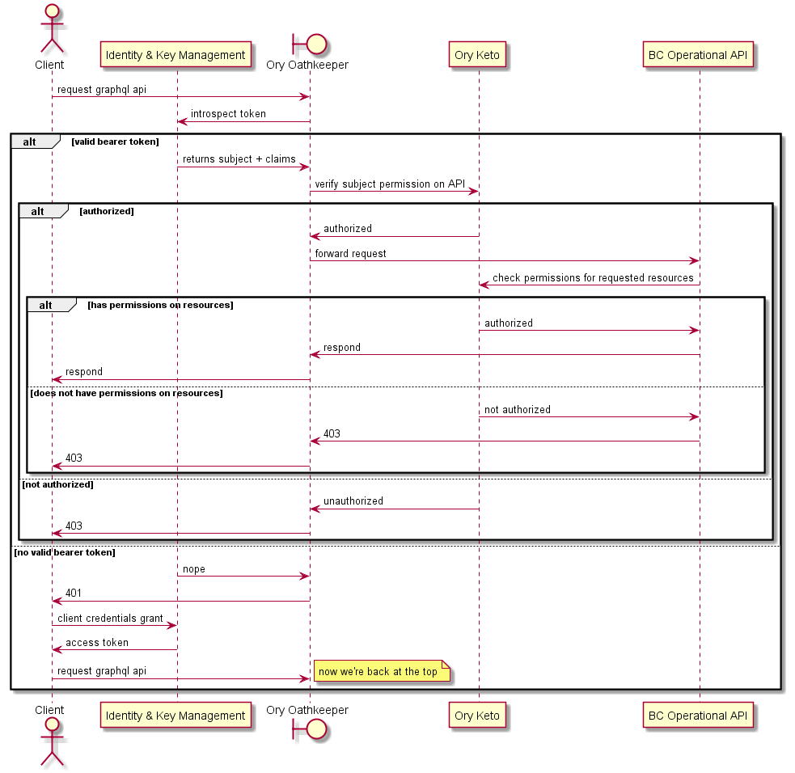
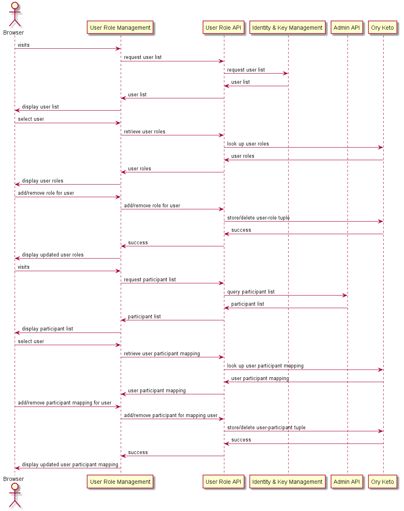
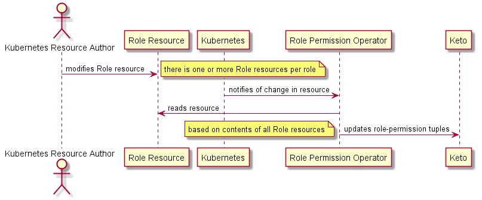

# Implémentation de l'API opérationnelle RBAC

## Introduction à l'implémentation de l'API opérationnelle RBAC

Les objectifs de cette implémentation sont de fournir une solution RBAC pour soutenir les opérations du hub et les fonctions associées. Ce guide présente la conception à haut niveau et explique la logique ayant mené à cette conception.

La conception de la sécurité :
1. implémente le contrôle d'accès basé sur les rôles (RBAC) à la version actuelle de Mojaloop,
1. est compatible lorsque possible avec l'architecture de référence et donc avec les futures versions de Mojaloop,
1. est compatible avec les futurs déploiements Infrastructure-as-Code (IaC),
1. fournit une journalisation des activités qui peut être utilisée lors d'un audit.

## Détails de l'implémentation RBAC
1. Les utilisateurs se voient endosser un ou plusieurs rôles. Un utilisateur peut endosser plusieurs rôles plusieurs rôles, sous réserve de règles définies.
1. Les rôles se voient attribuer des permissions.
1. Le Proxy d'Identité et d'Accès (Ory Oathkeeper) applique l'accès aux endpoints en fonction des permissions.
1. L'API backend peut, en option, vérifier les permissions via l'API Keto.
1. Des ensembles de permissions mutuellement exclusives peuvent être définis dans le système pour faire respecter la séparation des tâches.

## Application du principe Maker-Checker
Deux approches peuvent être utilisées pour appliquer un flux de validation maker-checker.
1. Appliquer via les rôles et les permissions mutuellement exclusives, à travers les politiques de sécurité. C.-à-d. les makers ne peuvent pas aussi être checkers.
1. Appliquer dans la couche application via des règles de sécurité. C.-à-d. les makers ne peuvent pas non plus être checkers dans le même processus de validation. Cela est souvent mis en œuvre dans la couche application lors de l'attribution des makers/checkers comme défini dans un flux de processus, et en imposant qu'un checker ne puisse pas être la même personne que le maker dans le processus de validation. Le code qui applique cela existera dans chaque contexte borné.

::: tip Responsabilité RBAC
Pour prendre en charge cette fonctionnalité, le système RBAC doit fournir :
1. l'identifiant utilisateur à ce contexte borné,
1. un moyen de vérifier l'autorisation si nécessaire.
:::

### Fourniture de l'identifiant utilisateur
La configuration actuelle fournit l'identifiant de l'utilisateur dans l'en-tête des appels API.
Ory Oathkeeper est configuré pour utiliser un "mutateur" d'en-tête. Ce mutateur transformera la requête, permettant de passer les informations d'identification à l'application en amont via les en-têtes. Par exemple, les backends d'API recevront l'en-tête suivant dans les requêtes HTTP :
```
X-User: wso2-uuid
```

Il est à noter que les "id_token" JWT sont également facilement supportés en modifiant la configuration du mutateur Ory Oathkeeper. Le mutateur "id_token" prend les informations d'authentification (par exemple le subject) et les transforme en un JSON Web Token signé, et plus spécifiquement en un ID Token OpenID Connect. Les backends d'API peuvent vérifier ce token en allant chercher la clé publique depuis l'endpoint /.well-known/jwks.json fourni par l'API Ory Oathkeeper.

### Vérification de l'autorisation
Toutes les informations d'autorisation sont stockées dans Ory Keto. Ory Keto dispose d'une API standard qui peut être appelée pour vérifier une autorisation.
C'est-à-dire : *« Ce jeton d'identifiant utilisateur a-t-il cette permission ? »*

## Outils / standards choisis
Voici une liste d'outils standards sélectionnés pour implémenter ce design.
1. **Ory Oathkeeper**
Sera utilisé comme Proxy d'Identité et d'Accès (IAP) qui vérifiera l'authentification et l'autorisation avant de donner accès aux endpoints fonctionnels, c'est-à-dire qu'il sera utilisé pour appliquer le contrôle d'accès.
2. **Ory Keto**
Vérifiera l'autorisation via les correspondances sujet-rôle et rôle-permission. Utilise une structure flexible d'objet, de relation et de sujet, initié chez Google, pouvant modéliser divers schémas d'autorisation, y compris le contrôle d'accès basé sur les rôles (RBAC).
3. **Ory Kratos**
Sera Utilisé pour créer et gérer l'objet d'autorisation (cookie).
4. **OpenID Connect**
C'est le standard retenu pour interagir avec un système de gestion d'identité. Ce standard est largement adopté et compatible avec tous les outils utilisés actuellement dans la communauté Mojaloop, à savoir, WSO2 Identity Server (IS), Keycloak et Ory Kratos.

## Vue d'ensemble de l'architecture
Voici une vue d'ensemble de haut niveau de l'implémentation de l'API opérationnelle RBAC sur la version actuelle de Mojaloop.



Voici un tableau des services et de leur rôle respectif.
| Service | Gère | Rôle |
| --- | --- | --- |
|**WSO2 IS KM**|Utilisateurs| 1. Redirection de la connexion utilisateur et UI qui crée le cookie <br>2. Flux d'autorisation standard OpenID Connect (OIDC) |
|**Ory Keto**|1. Mappage rôles-utilisateurs <br> 2. Mappage participants-utilisateurs| 1. Vérification d'autorisation RBAC via Ory Oathkeeper<br>2. Vérification d'autorisation RBAC via appel API opérationnelle|
|**Ory Oathkeeper**|Permissions liées à l'accès API | Passerelle API pour les APIs opérationnelles, avec contrôles d'authentification et d'autorisation|
|**Ory Kratos**|Aucune|Cookie d'authentification|
|**API opérationnelle du contexte borné**|Permissions liées aux appels API opérationnels|Fonctions API opérationnelles|
|**Shim**| Aucune | Redirection pour configurer OIDC|
|**Rôle Opérateur**| Aucune | Met à jour Keto pour refléter les changements de mapping rôle-permission réalisés dans le fichier ressource des rôles|
|**Fichier de ressources rôle Kubernetes**| Rôles et assignations de rôles-permissions| Modifications contrôlées par implémentation de contrôle de version (par exemple GitHub ou GitLab).|
|**API des Rôles**|Aucune|1. Contrôle API rôle-utilisateur <br>(liste des utilisateurs, liste des rôles, liste des rôles attribués aux utilisateurs, ajouter un rôle à un utilisateur, enlever un rôle à un utilisateur)<br> 2. Contrôle API participant-utilisateur <br>(liste des utilisateurs, liste des participants, liste des participants attribués à un utilisateur, ajout/suppression de participant à un utilisateur)|

## Alignement avec l'architecture de référence
Comparons cette implémentation RBAC à celle définie dans l'architecture de référence, appelée "bounded context sécurité". Cette conception diffère de l'architecture de référence par sa fonction, son but et son approche, mais elle en adopte certaines idées quand cela est approprié. Le but de cette RBAC est d'ajouter une couche de sécurité aux APIs opérationnelles des contextes bornés. L'architecture de référence du "Security Bounded Context"/"contexte de sécurité de référence" a été conçue pour prendre en compte les exigences de performance des fonctions transactionnelles critiques de Mojaloop.
Voici les principales différences :
1. Les fonctions d'autorisation sont centralisées dans cette RBAC. L'architecture de référence prévoit une autorisation distribuée, mise en œuvre indépendamment dans chaque contexte borné. Ce niveau de complexité supplémentaire est inutile dans le cas des APIs opérationnelles.
1. L'architecture de référence demande des interfaces vers d'autres contextes bornés pour initier l'autorisation distribuée. Elles n'ont pas été construites car aucun composant n'existe pour les consommer.
1. L'architecture de référence exige que le contexte de sécurité génère ses propres tokens de sécurité. Cette RBAC utilise ceux générés par l'IAM.
1. L'architecture de référence exige que les permissions soient distribuées via les JWT à chaque contexte borné. Cela pourrait être paramétré dans l'outillage actuel, mais ne l'a pas été car certains expert considèrent cette distribution comme une vulnérabilité, et ce n'était pas nécessaire pour cette implémentation RBAC.

Certains principes du contexte de sécurité de référence ont été repris :
1. Chaque contexte borné possède son propre jeu de permissions ou privilèges.
1. L'implémentation RBAC centralise toutes les associations privilèges/utilisateurs.
1. Les permissions de rôles utilisateurs sont structurées pour être facilement distribuable dans un cluster Kubernetes.

## Alignement avec IaC 4.xxx
Voici un schéma illustrant à quoi ressemblerait l'architecture si l'API opérationnelle RBAC était implémentée dans la future version IaC (IaC 4.xxx) utilisant Keycloak et Ambassador / Envoy entre autres évolutions.

  

## Caractérisation des performances de l'implémentation RBAC
Une caractérisation des performances du POC RBAC a été réalisée pour évaluer la surcharge de la couche de sécurité RBAC.
::: tip En résumé :
Le RBAC ajoute une surcharge de 10ms à chaque vérification d'autorisation API.
Si un appel API requiert une vérification d'autorisation supplémentaire via API, la surcharge est alors de 20ms.

Dans nos tests, cela se traduit typiquement par :
1. moins de 5% pour des vérifications d'autorisation simples (Ory Oathkeeper & Ory Keto)
1. moins de 10% pour des vérifications doubles (Ory Oathkeeper & Ory Keto + un appel Keto additionnel)
:::

**Configuration des tests de caractérisation**
Sur la même infrastructure de test, des appels chronométrés identiques ont été effectués sur la même API backend et via RBAC.
Voici les résultats des appels aux APIs Role avec et sans RBAC et aux APIs POST Transfers avec et sans RBAC. L'API Role a une seule vérification d'autorisation réalisée via Ory Oathkeeper qui appelle Ory Keto. L'API Transfer (GraphQL) ajoute une vérification RBAC additionnelle.

**Statistiques des requêtes**

|Méthode|	Nom|	# Requêtes|	# Échecs|	Moyenne (ms)|	Min (ms)|	Max (ms)|	Taille Moyenne| Taille moyenne (octets) RPS|	Echecs/s|
| --- | --- | --- | --- | --- | --- | --- | --- | --- | --- |
|GET|	Role API|	321|	0|	248|	221|	499|	604|	9.0|	0.0|
|GET|	Role API RBAC|	320|	0|	262|	232|	418|	604|	8.9|	0.0|
|POST|	Transfers API|	318|	0|	229|	184|	373|	4873|	8.9|	0.0|
|POST|	Transfers API RBAC|	314|	0|	240|	194|	406|	4873|	8.8|	0.0|
| | **Agrégé**|	**1273**|	**0**|	**245**|	**184**|	**499**|	**2723**|	**35.5**|	**0.0**|

**Statistiques des Temps de Réponse**

|Méthode|	Nom|	50%ile (ms)|	60%ile (ms)|	70%ile (ms)|	80%ile (ms)|	90%ile (ms)|	95%ile (ms)|	99%ile (ms)|	100%ile (ms)|
| --- | --- | --- | --- | --- | --- | --- | --- | --- | --- |
|GET|	Role API|	240|	240|	240|	250|	270|	290|	400|	500|
|GET|	Role API RBAC|	250|	260|	260|	270|	290|	320|	410|	420|
|POST|	Transfers API|	220|	220|	240|	250|	290|	330|	360|	370|
|POST|	Transfers API RBAC|	230|	240|	250|	280|	310|	330|	400|	410|
| |**Agrégé**|	**240**|	**250**|	**250**|	**260**|	**290**|	**320**|	**400**|	**500**|

## Connexion à l'interface utilisateur (UI)
Ce diagramme de séquence illustre les événements lors d'une tentative d'accès à une API backend depuis un navigateur :
- Si le navigateur est déjà connecté, la requête est transférée.
- Sinon, un classique flux autorisation OIDC standard démarre avec une redirection.

 

## Consultation des données via le micro-frontend API opérationnelle du contexte borné
Le diagramme suivant détaille les interactions lorsque :
- le bearer token est valide ou non,
- l'autorisation réussit ou échoue.

Le micro-frontend est représenté comme un client.

 

Dans certains cas, il peut être nécessaire d'effectuer une vérification d'autorisation plus détaillée côté API opérationnelle. Le diagramme suivant décrit comment cela est implémenté.

À noter que toutes les APIs opérationnelles ne requièrent pas ce niveau d'autorisation, et qu'Ory Oathkeeper peut ou non être nécessaire dans ces cas.

 

## Application de la Séparation des Tâches
Cette implémentation RBAC permet de faire respecter la séparation des tâches via des ensembles de permissions mutuellement exclusives. Cela renforce la sécurité mais peut accroitre la complexité pour l'administrateur de la sécurité des utilisateurs finaux du système. Appliquer des permissions mutuellement exclusives permet d'en réduire et gérer la complexité.

Un exemple pourrait être un utilisateur qui peut accéder au Portail Finance et réaliser des opérations sensibles (ajout/retrait de fonds). Cet utilisateur ne devrait plus avoir accès.

### Modélisation de l'exclusion
Cette implémentation modélise ce besoin comme un ensemble d'exclusions permission-permission appliqué globalement. Ces exclusions sont définies comme deux ensembles de permissions qui sont mutuellement exclusifs—ce qui est intuitif et facile à maintenir.

*Justification*
Cette exclusion auraient pu être modélisées de trois façons:
1. Exclusions de type permission - permission
1. Exclusions de type rôle-utilisateur - rôle-utilisateur
1. Exclusions de type rôle-utilisateur - permission

Cette fonctionnalité ayant été ajoutée pour prendre en charge la ségrégation/séparation des tâches, la méthode la plus propre pour répondre à cela consiste à définir une exclusion par paire de permission, au niveau global. Avec toutles les autres options, il est possible que l'exclusion soit contournée par la création d'un rôle inclusif supplémentaire.

### Rôles synthétiques versus multiples rôles utilisateur
Cette implémentation RBAC n'utilise pas de rôles synthétiques, mais utilise plutôt l'affectation de multiples rôles fonctionnels à chaque utilisateur.

*Justification*
Deux méthodes sont possibles pour modéliser RBAC avec des permissions mutuellement exclusices:
1. Construire dynamiquement un rôle synthétique pour chaque utilisateur, à partir des règles définies sur leurs rôles actuels, leurs permissions et exclusions.
1. Définir des rôles associés aux fonctions utilisateurs; chaque utilisateur devra donc se voir attribuer plusieurs rôles. Les permissions des rôles ont moinds de chances de changer.

La seconde méthode est privilégiée car elle est beaucoup plus simple à comprendre, maintenir et assurer le support de cette méthode. Identifier la cause d'une perte de droits dans un rôle synthétique suite à l'application de plusieurs rôles et de règles nécessite une compréhension détaillée du processus de calcul et d'implémentation. Cette complexité est évitée en optant pour la deuxième solution.

### Affectation de multiples rôles utilisateur et vérification dynamique des exclusions
Permettre à l'administrateur d'attribuer plusieurs rôles par utilisateur est pratique, flexible et réduit le nombre de rôles dans l'organisation. Cela signifie également rend possible la violation de permissions mutuellement exclusives lors de telles affectations. Les contrôles doivent donc être dynamiques.

Ils s'effectuent à plusieurs endroits :
1. Lors de l'attribution d'un rôle à un utilisateur
1. Lors de l'application d'une nouvelle définition ressource rôle-permission, ou d'une nouvelle politique de sécurité impliquant des changements massif dans la structure des rôles et permissions.
::: warning Extension future :
S'il est possible qu'une violation existe, alors chaque consultation de permission devrait également vérifier les violations d'exclusions. Pour l'instant cela n'est pas prévu, on considère que les points précédents sont bien appliqués pour éviter le problème.
Ce contrôle additionnel est recommandé pour de futures évolutions, afin que nulle contournement par porte dérobée de la séparation des tâches ne puisse être réalisée.
:::

::: tip Remarque : 
La gestion de changement et les tests sur des environnements inférieurs ne détectent pas forcément ces violations. Il faut que le contrôle des accès utilisateurs soit strictement identique entre environnements de test/développement pour pouvoir tester efficacement ces violations, ce qui est rarement le cas.
:::

**Relation Keto: introduction**
Introduction d'une relation reliant deux permissions qui ne peuvent pas coexister.
```
“Définition de ressource personnalisée d’exclusion de permission :X excludes permission:Y#allowed”
```

**Définition Custom Resource Exclusion de Permission**
Des ressources customisées d'exclusion de permission sont consommées par le contrôleur de rôles-permissions, qui les transmet à Keto. Chaque ressource contient deux ensembles de permissions, et avoir une permission d'un ensemble exclut celles de l'autre. Cela permet d'exprimer de nombreux scénarios flexibles, y compris le scénario le plus simple d'exclusion bi-directionnelle reste simple à exprimer.

**Vérification API d'un changement opérateur rôle-permission**
Le contrôleur ressource rôle-permission met à disposition une API permettant de pré-vérifier qu'une mise à jour sera acceptable. Cette API prend la modification proposée, et renvoie si un conflit d'exclusions serait introduit. Elle est exploitable par l'UI Administrateur et les outils CI/CD.

**Application effective du changement opérateur rôle-permission**
Lorsqu'une ressource est modifiée, l'opérateur verrouille temporairement la modification des attributions de rôles, effectue la même vérification, et si la modification ne passe pas, elle est rejetée et la situation actuelle conservée ; le problème est remonté dans l'API Kubernetes pour instrumentation/alerte.

**Vérification de conflit à l'attribution d'un rôle utilisateur**
Lorsqu'un utilisateur reçoit un nouveau rôle, le système vérifie que cela ne provoque pas de conflit d'exclusions. Si c'est le cas, l'opération est rejetée avec une erreur.

## Attribution des rôles et de la participation aux utilisateurs
Cette fonctionnalité est implémentée dans le service API des Rôles. Le diagramme ci-dessous décrit comment les rôles et les accès participants de l'utilisateur sont interrogés et modifiés via cette API.
 

### API des Rôles
Le tableau suivant fait la synthèse des ressources de l'API des Rôles.

|Catégorie|Méthode|Endpoint| Description|Codes d'erreur|
| --- | --- | --- | --- | --- |
|**HEALTH**| | | | |
| | GET | /health | Retourne l'état actuel de l'API | 400, 401, 403, 404, 405, 406, 501, 503 |
| | GET | /metrics | Retourne les métriques de l'API | 400, 401, 403, 404, 405, 406, 501, 503|
|**PARTICIPANTS**| | | | |
| | GET | /participants | Retourne la liste des IDs de participants | 400, 401, 403, 404, 405, 406, 501, 503|
|**RÔLES**| | | | |
| | GET | /roles | Retourne la liste des IDs de rôles |400, 401, 403, 404, 405, 406, 501, 503 |
|**UTILISATEURS**| | | | |
| | GET | /users | Retourne la liste des IDs utilisateurs | 400, 401, 403, 404, 405, 406, 501, 503|
| | GET | /users/{ID} | Retourne les infos d'un utilisateur spécifique|400, 401, 403, 404, 405, 406, 501, 503 |
| | GET | /users/{ID}/participants | Liste les participants attribués à un utilisateur |400, 401, 403, 404, 405, 406, 501, 503|
| | PATCH | /users/{ID}/participants | Assigne un participant à un utilisateur | 400, 401, 403, 404, 405, 406, 501, 503|
| | GET | /users/{ID}/roles | Liste des rôles attribués à un utilisateur|400, 401, 403, 404, 405, 406, 501, 503 |
| | PATCH | /users/{ID}/roles | Assigne un rôle à un utilisateur|400, 401, 403, 404, 405, 406, 501, 503 |

La spécification détaillée de l'API est disponible [ici](https://docs.mojaloop.io/role-assignment-service/).
Le dépôt GitHub du service est disponible [ici](https://github.com/mojaloop/role-assignment-service).

## Attribution des permissions aux rôles & ensembles mutuellement exclusifs
L'attribution des permissions aux rôles est stockée dans un fichier `.yml` appelé fichier ressource de rôle (`roleresource.yml`).
Les accès et les modifications sur ces fichiers sont gérés via une solution de gestion de versions hébergée (ex. : GitHub, GitLab). Cela assure un historique complet et des points de contrôle automatiques et manuels configurables.
Ces fichiers sont définis comme des définitions de ressources personnalisées (CRD) Kubernetes, auxquels un opérateur rôle-permission s'abonne. Les changements déclenchent la mise à jour d'Ory Keto. Un même rôle peut être représenté par plusieurs fichiers au besoin.

Il existe deux types de fichiers de ressource : un pour les attributions rôle-permission, l'autre pour les permissions mutuellement exclusives.

Exemple d'un fichier rôle-permission :
```yml
apiVersion: "mojaloop.io/v1"
kind: MojaloopRole
metadata:
  name: nom-arbitraire-ici
spec:
  # doit correspondre à ce qui est utilisé dans Keto, quelle que soit la valeur
  role: IdentifiantRole
  permissions:
  - permission_01
  - permission_02
  - permission_03
  - permission_04
```
Le diagramme de séquence suivant illustre comment Ory Keto est mis à jour.



## Détail d'implémentation Ory Keto
Dans cette conception, Ory Keto est l'outil qui détermine si un jeton de connexion possède la bonne autorisation pour accéder à une partie du système, c'est-à-dire qu'il est utilisé pour faire respecter le RBAC. Trois volets sont gérés :
1. L'attribution des rôles aux utilisateurs.
Cette fonctionnalité sera maintenue et mise à jour depuis le module API des Rôles, qui appellera et mettra à jour Keto en conséquence.
2. L'attribution des accès participants à un utilisateur.
Cela concerne les rapports d'accès DFSP qui ne doivent être délivrés que pour les participants configurés.
Cette fonctionnalité sera également maintenue via le module API des Rôles, qui appellera et mettra à jour Keto en conséquence.
3. L'attribution des permissions/privilèges aux rôles.
Contrôlée via les modifications du fichier `roleresource.yml` sur GitHub. L'opérateur rôle-permission surveille ces fichiers et met à jour Keto.

### Ajouter des rôles et des accès aux participants dans Keto
La liste des utilisateurs (personnes et comptes de service) vient du serveur d'identités WSO2 ; celle des participants, d'une API existante. Un identifiant permanent et durable doit être utilisé pour les appels Keto.

Les rôles sont hardcodés, chacun avec un identifiant court, lisible et inscriptible, ainsi qu'un nom. L'interface devrait afficher l'identifiant et le nom, car l'identifiant sera nécessaire pour l'opérateur rôle-permission.

Deux espaces de nom Keto sont utilisés : role et participant. Les tuples Keto sont :
```
role:ROLEID#member@USERID et participant:PARTICIPANTID#member@USERID 
```
(selon la notation [Keto/Zanzibar](https://www.ory.sh/keto/docs/concepts/relation-tuples))

La réutilisation de "member" pour la relation ne pose pas problème, chaque relation étant spécifique à l'espace de nom. Un autre terme peut être utilisé si préféré.

Pour récupérer les rôles/participants d'un utilisateur : utiliser [l'API de requête de tuples de relation](https://www.ory.sh/keto/docs/reference/rest-api#query-relation-tuples), en passant namespace, relation et subject. La réponse inclura les tuples et un next-page-token si besoin.

Pour ajouter/supprimer un rôle ou participant pour un utilisateur : utiliser [create](https://www.ory.sh/keto/docs/reference/rest-api#create-a-relation-tuple) et [delete](https://www.ory.sh/keto/docs/reference/rest-api#delete-a-relation-tuple) ; chaque appel traite un seul tuple. Si l'appel échoue, mais que l'échec n'est pas une erreur HTTP 4xx, il devrait être retenté quelques fois.

Exemple d'appel Keto pour ajouter un rôle à un utilisateur :
::: tip Exemple : Attribuer un rôle à un utilisateur via Ory Keto
PATCH /relation-tuples HTTP/1.1
Content-Type: application/json
Accept: application/json
:::

```json 
[
  {
    "action": "insert",
    "relation_tuple": {
    "namespace": "role",
    "object": "RoleIdentifier",
    "relation": "member",
    "subject": "userIdentifier"
    }
  }
]
```
Succès = HTTP 204 sans contenu.

::: tip REMARQUE
Le champ `"relation"` utilise `"member"`.
On utilise `PATCH` plutôt que `PUT` car `PATCH` fonctionne comme une création et/ou suppression en lot.
:::

### Attribution des permissions/privilèges à un rôle dans Keto
Ceci se fait via un opérateur Kubernetes dédié à une définition de ressource personnalisée [(CRD)](https://kubernetes.io/docs/tasks/extend-kubernetes/custom-resources/_print/). L'opérateur pourrait être implémenté dans presque n'importe quel langage. L'expertise existante de ModusBox en opérateurs repose principalement sur `kopf`, un framework Python, mais il existe aussi des options en Go et Node (et d'autres).

L'opérateur doit garder en mémoire l'ensemble des ressources qu'il gère, regroupées par rôle. [L'indexation de Kopf](https://kopf.readthedocs.io/en/latest/indexing/) est idéale pour ceci.

Lorsqu'une ressource de rôle change, la liste des permissions de ce rôle, sur l'ensemble des ressources de rôle, doit être compilée, et un changement envoyé via l'API Patch [Multiple Relation Tuples](https://www.ory.sh/keto/docs/reference/rest-api#patch-multiple-relation-tuples) en utilisant les actions `insert` et `delete`. Il est nécessaire de prendre en compte toutes les ressources de rôle, car un même rôle peut être réparti sur plusieurs ressources, et plusieurs peuvent inclure la même permission ; supprimer une ressource de rôle qui associe le Rôle X à la Permission P ne signifie pas nécessairement que le tuple Keto pour cette association rôle-permission doit être supprimé, car une autre ressource de rôle peut toujours associer le Rôle X à la Permission P.

Les tuples Keto auront la forme suivante :
```
permission:PERMISSIONID#granted@role:ROLEID#member
```

Opérations détaillées lors du changement de ressource :
1. Récupérer les permissions actuellement accordées au rôle via [l'API de requête de tuples de relation](https://www.ory.sh/keto/docs/reference/rest-api/#query-relation-tuples).
2. À partir de l'index stocké des rôles vers les permissions, calculer la différence à partir de la liste récupérée.
3. Exécuter le patch à partir de la différence.
4. En cas de problème, lever une exception pour que le problème soit journalisé et qu'une resynchronisation soit tentée ultérieurement.

Exemple d'appel Keto pour assigner une permission à un rôle :
::: tip Exemple : Attribuer une permission/privilège à un rôle
PATCH /relation-tuples HTTP/1.1
Content-Type: application/json
Accept: application/json
:::

```json
[
  {
  "action": "insert",
  "relation_tuple": {
    "namespace": "permission",
    "object": "permissionIdentifier",
    "relation": "granted",
    "subject": "role:x#member"
  }
  }
]
```
Succès = HTTP 204 sans contenu.

::: tip REMARQUE
Le champ `"relation"` utilise `"granted"`.
On utilise `PATCH` plutôt que `PUT` car `PATCH` fonctionne comme une création et/ou suppression en lot.
:::

### Ajout de permissions mutuellement exclusives dans Keto
Les ensembles de permissions mutuellement exclusives sont aussi modélisés dans Keto via la relation "excludes".
La relation qui relie deux permissions qui ne doivent pas coexister s'écrit :
```
“permission:X excludes permission:Y#allowed”
```

::: tip REMARQUE
On utilise `"excludes"` pour désigner les exclusions de permissions.
:::

### Appel standard à l'API Keto pour vérifier l'autorisation
La vérification de l'autorisation d'un utilisateur pour un privilège ou une permission est gérée par la passerelle API, et si nécessaire, peut être vérifiée par chaque contexte borné.

Exemple de requête Keto pour vérifier si un utilisateur détient une permission :
::: tip Exemple : Vérification d'une autorisation dans Ory Keto
POST /check HTTP/1.1
Content-Type: application/json
Accept: application/json
:::
```json
{
  "namespace": "permission",
  "object": "PermissionIdentifier",
  "relation": "granted",
  "subject": "UserIdentifier"
}
```
Réponse :
```json
{
"allowed": true/false
}
```
::: tip Remarque :
Les permissions mutuellement exclues n'ont pas besoin d'être vérifiées explicitement par un appel Keto, car le système est maintenu de manière à ce que les attributions rôle-permission ne puissent être définies que si les ensembles de permissions mutuellement exclusives ne sont pas violés.
:::

## Ory Oathkeeper – détail d'implémentation
### Configuration de Ory Oathkeeper pour BizOps

[ORY Oathkeeper](https://www.ory.sh/oathkeeper/docs/next/) contrôle l'autorisation des requêtes HTTP entrantes. Il peut agir comme point d'application de la politique (PEP) dans une architecture cloud, c'est-à-dire un reverse proxy devant l'API ou le serveur web en amont qui rejette les requêtes non autorisées et transmet les requêtes autorisées au serveur. Si un autre API Gateway est utilisé (Kong, Nginx, Envoy, AWS API Gateway…), Ory Oathkeeper peut également s'y intégrer et servir de point de décision de politique (PDP).

Le chart Helm Ory Oathkeeper est décrit [ici](https://k8s.ory.sh/helm/oathkeeper.html) et défini [là](https://github.com/ory/k8s/tree/master/helm/charts/oathkeeper). Le référentiel Helm est documenté [ici](https://k8s.ory.sh/helm/). La configuration de référence est [là](https://www.ory.sh/oathkeeper/docs/reference/configuration). Toutes les valeurs peuvent être surchargées par des variables d'environnement.

Le chart Helm Ory Oathkeeper déploie deux composants clés dans Kubernetes : Ory Oathkeeper lui-même, et Ory Oathkeeper Maester. Ory Oathkeeper est sans état et piloté par la configuration ; il se recharge de manière transparente sans interruption de service à chaque changement de configuration. Ory Oathkeeper Maester est un contrôleur pour la CRD Rule et compose les objets Rule dans Kubernetes en un fichier de règles unique et complet chargé par Ory Oathkeeper. Par défaut, il s'agit d'un ConfigMap monté par Ory Oathkeeper, mais il peut aussi être configuré en sidecar avec un montage partagé.

Ory Oathkeeper expose deux ports sous forme de deux services : un service API et un service Proxy. À long terme, nous utiliserons le service API, qui sera interrogé par la passerelle API de nouvelle génération via l'[API Access Control Decision](https://www.ory.sh/oathkeeper/docs/reference/api/#access-control-decision-api) fournie par Ory Oathkeeper ; pour l'instant, nous utiliserons le service Proxy, exposé via Ingress. Les URL externes des services protégés par Ory Oathkeeper pointeront vers l'ingress du Proxy Ory Oathkeeper, qui fera ensuite le proxy vers les services internes à ces URL et appliquera les règles de contrôle d'accès.

Ory Oathkeeper sera configuré pour générer et signer un JSON Web Token (JWT) contenant des revendications que les services internes peuvent vérifier en pointant vers le jeu de clés JSON Web (JWKS) publié par Ory Oathkeeper (voir [listes-cryptographic-keys](https://www.ory.sh/oathkeeper/docs/reference/api/#lists-cryptographic-keys)). Si un service fait cela, il opère alors dans un régime de confiance zéro de base, car il ne sera pas possible d'appeler ce service sauf avec un jeton généré par Ory Oathkeeper, et Ory Oathkeeper ne générera un jeton que si les règles d'accès pour l'URL donnée autorisent l'accès.

### Débogage
Les réponses/logs d'Oathkeeper sont généralement informatifs. Vérifiez les logs lors d'une requête problématique. Oathkeeper log aussi des health checks, etc.

Quelques actions de débogage utiles dans différentes circonstances :

- Rendre une correspondance beaucoup plus permissive (en remplaçant la partie entière commençant par `<.*>` et en conservant le suffixe unique minimum actuel).

- Vérifier minutieusement que chaque URL interne est bien l'URL interne appropriée en vérifiant qu'elle est accessible dans le cluster avec curl.

- Examiner les logs du fournisseur d'identité (IdP).

- S'assurer que les domaines et les ports pour l'introspection et l'endpoint de jeton externe sont identiques. Keycloak notamment n'apprécie pas qu'ils ne le soient pas.

- Pointer la règle Ory Oathkeeper vers [https://httpbin.org/](https://httpbin.org/), généralement le préfixe de chemin `/anything` qui renverra tout ce qu'il reçoit, ce qui facilite la visualisation de ce que le service verra.

### Éléments nécessaires en plus d'un chart Helm

Les éléments suivants seront nécessaires en plus du chart Helm :

- un secret JWKS,
- des valeurs Helm annotées.

#### Secret JWKS

Un secret doit être créé avec la clé `mutator.id_token.jwks.json` et la valeur d'un JWKS adapté à Ory Oathkeeper. Un JWKS initial peut être généré comme décrit dans [Configure and Deploy | ORY Oathkeeper](https://www.ory.sh/oathkeeper/docs/configure-deploy#cryptographic-keys). Il contiendra les clés publiques et privées.

##### Utilisation du secret JWKS

Pour faire tourner le secret, appliquer la procédure suivante :

0. Noter l'heure.
1. Ajouter une paire de clés publique et privée au début du tableau dans le JWKS (s'assurer que toutes les JWK publiques ont un `kid` unique spécifié) dans le secret. Toutes les clés autres que les nouvelles clés et les premières clés publique et privée précédentes peuvent être supprimées, car Ory Oathkeeper signe toujours avec la première clé.
2. Attendre que toutes les requêtes qu'Ory Oathkeeper aurait pu recevoir et autoriser aient eu leur JWT traité par le service backend. Le délai principal ici est le temps de propagation de la mise à jour du secret, comprenant le délai du gestionnaire de secrets vers le secret mis à jour et le délai du secret vers le volume mis à jour, ce qui est probablement d'une minute ou deux au maximum ; attendre aussi longtemps après l'heure notée à l'étape 0.
3. Si l'ancien secret doit être supprimé (ce n'est nécessaire que si une violation est suspectée, sinon l'étape 1 suffit pour la rotation périodique des clés), retirez-le maintenant.

#### Valeurs Helm annotées

Plusieurs endroits devront être modifiés pour utiliser les URL ou autres valeurs spécifiques au reste du déploiement. Ces endroits sont décrits dans les commentaires de l'exemple ci-dessous, ainsi que d'autres commentaires.

La configuration du Proxy ingress n'est pas encore décidée à ce stade, car elle devra changer lorsque la solution sera ajoutée à l'IaC 3.xxx ; cette zone de la configuration n'est donc pas encore spécifiée. Cela laisse l'ingress hors configuration par défaut. Modifier `ingress.proxy.enabled` à `true` activera le proxy ingress. Voir les pages liées au début pour les options disponibles pour la configuration ingress intégrée.

Si le TLS doit être terminé au niveau d'Ory Oathkeeper, voir les sections `tls` dans la [documentation de configuration](https://www.ory.sh/oathkeeper/docs/reference/configuration), et combinez cela avec des secrets et les valeurs `deployment.extraVolumes` et `deployment.extraVolumeMounts`.
Prometheus est accessible sur `:9000/metrics` par défaut, s'il est utilisé.

```yaml

oathkeeper:
  config:
    log:
      level: trace
    access_rules:
      matching_strategy: regexp
    authenticators:
      cookie_session:
        enabled: true
        config:
          check_session_url: http://kratos-public/sessions/whoami
          preserve_path: true
          extra_from: "@this"
          subject_from: "identity.id"
          only:
          - ory_kratos_session
      oauth2_introspection:
        enabled: true
        config:
          introspection_url: https://whatever/the/wso2/url/is/oauth2/introspect
          introspection_request_headers:
            authorization: "Basic SOME WORKING AUTH HERE"
          cache:
            enabled: false
            ttl: "60s"
    authorizers:
      remote_json:
        enabled: true
        config:
          remote: http://internal-keto-url-here/check
    mutators:
      id_token:
        enabled: true
        config:
          issuer_url: http://whatever-oathkeeper-internal-is-api:4456/
    errors:
      fallback:
        - json
      handlers:
        json:
          enabled: true
          config:
            verbose: true
        redirect:
          enabled: true
          config:
            to: https://whatever-external-main-url-is/
            when:
              error:
                - unauthorized
                - forbidden
              request: 
                header:
                  accept:
                    - text/html
secret:
  manage: false
  name: oathkeeper-jwks
deployment:
  extraEnv:
    - name: MUTATORS_ID_TOKEN_CONFIG_JWKS_URL
      value: file:///etc/secrets/mutator.id_token.jwks.json
```

### Règles

Des ressources Rule devront être créées dans Kubernetes pour chaque correspondance backend (expression régulière d'URL plus méthode(s) HTTP) protégée par une permission. L'exemple ci-dessous fournit des indications.

À mesure que la flexibilité pour définir des services tiers et des contextes bornés augmente, ceux-ci peuvent définir leurs propres règles (peut-être derrière un indicateur de valeurs Helm), qui expriment quelles permissions devraient être requises pour quelles URL.

Le plus gros problème potentiel ici est que chaque correspondance DOIT être unique. Si une requête correspond à plusieurs, Ory Oathkeeper se plaindra. Une fois qu'un modèle général est choisi qui produit des regex uniques, cela n'arrivera pas sauf en cas d'erreur utilisateur.

```yaml
apiVersion: oathkeeper.ory.sh/v1alpha1
kind: Rule
metadata:
  name: nom-unique
spec:
  version: v0.36.0-beta.4
  upstream:
    # définissez l'URL vers laquelle cette requête doit être transférée
    url: http://url-interne-backend/
  match:
    # cela pourrait devoir être http même si l'externe est https, cela dépend de la façon dont l'ingress gère les choses
    # ma recommandation est d'avoir un préfixe donné, puis le matcher « tout le reste dans le nom de domaine »
    # pour qu'il n'ait pas besoin d'être changé quand la configuration est déplacée entre différents domaines principaux
    # puis ce qui est nécessaire pour le chemin spécifique (cela est défini pour correspondre à tous les sous-chemins)
    # les regex vont entre des chevrons
    url: https://example.<[^/]*>/<.*>
    methods:
    # quelle(s) que soit/ent la/les méthode(s) auxquelles cette règle s'applique
      - GET
  authenticators:
    - handler: oauth2_introspection
    # commentez ce deuxième handler pour ne pas permettre l'accès par cookie navigateur
    - handler: cookie_session
  authorizer:
    handler: remote_json
    config:
      # celles-ci seront généralement identiques pour toutes les règles,
      # sauf que « object » sera changé en l'ID de permission pertinent pour cette URL
      payload: |
        {
          "namespace": "permission",
          "object": "IDENTIFIANT_PERMISSION_ICI",
          "relation": "granted",
          "subject_id": "{{ print .Subject }}"
        }
  mutators:
    # changez cela en un tableau vide si le id_token n'est pas nécessaire, si vous le souhaitez
    - handler: id_token
```

### Oathkeeper avec Kratos comme authentificateur cookie
(voir doc Ory [ici](https://www.ory.sh/oathkeeper/docs/next/pipeline/authn))
```yaml
authenticators:
  cookie_session:
    enabled: true
    config:
      check_session_url: http://kratos-public/sessions/whoami
      preserve_path: true
      extra_from: "@this"
      subject_from: "identity.id"
      only:
      - ory_kratos_session
```

### Oathkeeper avec WSO2 ISKM pour introspection token
(voir doc Ory [ici](https://www.ory.sh/oathkeeper/docs/next/pipeline/authn))
```yaml
oauth2_introspection:
  enabled: true
  config:
    introspection_url: https://whatever/the/wso2/url/is/oauth2/introspect
    introspection_request_headers:
      authorization: "Basic SOME WORKING AUTH HERE"
    cache:
      enabled: false
      ttl: "60s"
```

### Oathkeeper avec Keto comme authorizer
(voir doc Ory [ici](https://www.ory.sh/oathkeeper/docs/next/pipeline/authz))
```yaml
authorizers:
  remote_json:
    enabled: true
    config:
      remote: http://internal-keto-url-here/check
```

## Ory Kratos – détail d'implémentation
 
Ory Kratos est la partie de la suite Ory qui gère tous les flux d'authentification.
Il est hautement configurable et peut se connecter à une variété et à de multiples systèmes et flux d'authentification. La [documentation Kratos](https://www.ory.sh/kratos/docs/next/) explique bien l'étendue de la configuration. C'est-à-dire qu'il est probable qu'elle réponde à vos besoins.
Dans ce projet de flux de travail, seuls les flux de connexion et de déconnexion utilisateur sont requis et mis en œuvre.
Il est utile de savoir que Kratos peut aussi fournir des flux pour :
- **Connexion et inscription en libre-service** : permettre aux utilisateurs finaux de créer et de se connecter à des comptes (que nous appelons des identités) en utilisant des combinaisons nom d'utilisateur/e-mail et mot de passe, une connexion sociale (« Se connecter avec Google, GitHub »), des flux sans mot de passe, et d'autres.
- **Authentification multifacteur (MFA/2FA)** : prend en charge des protocoles tels que TOTP (RFC 6238 et IETF RFC 4226 — mieux connu sous le nom de Google Authenticator)
- **Vérification de compte** : vérifier qu'une adresse e-mail, un numéro de téléphone ou une adresse physique appartiennent bien à cette identité.
- **Récupération de compte** : récupérer l'accès en utilisant des flux « Mot de passe oublié », des codes de sécurité (en cas de perte de dispositif MFA), etc.
- **Gestion du profil et du compte** : mettre à jour les mots de passe, les détails personnels, les adresses e-mail, les profils sociaux liés en utilisant des flux sécurisés.
- **APIs d'administration** : importer, mettre à jour, supprimer des identités.
… ce qui peut devenir important dans les futures versions des conceptions de déploiement IaC.

### Détails du déploiement
Le chart Helm Kratos est décrit sur [ORY Kratos Helm Chart | k8s](https://k8s.ory.sh/helm/kratos.html) et défini sur [k8s/helm/charts/kratos](https://github.com/ory/k8s/tree/master/helm/charts/kratos). Contrairement à Ory Oathkeeper, il n'a pas de Maester associé gérant un CRD. Il nécessite toutefois une base de données (MySQL, PostgreSQL, CockroachDB, ou quelques autres). Le dépôt Helm est le même que pour Ory Oathkeeper, et documenté sur [ORY Helm Charts | k8s](https://k8s.ory.sh/helm/). Une référence de configuration est disponible sur [Configuration | Ory Kratos](https://www.ory.sh/kratos/docs/reference/configuration), mais notez que le chart Helm fonctionne légèrement différemment.

En plus d'une base de données, l'autre différence majeure pour Kratos est qu'il nécessite une interface utilisateur, sous la forme d'une petite application web qui gère le rendu de l'étape actuelle de ce qui se passe avec Kratos dans le navigateur et effectue également la communication backend nécessaire pour que cela se produise en toute sécurité. Dans notre cas, l'interface utilisateur que nous utiliserons est très simple et n'est jamais réellement visible — tout ce qu'elle fera est de rediriger immédiatement vers le seul fournisseur d'identité OIDC (IdP) que nous aurons configuré et de recevoir le callback associé. Cette application d'interface utilisateur a déjà été créée et open-sourcée dans le dépôt modusbox, et publie des images docker publiques dans le registre docker GitHub. L'interface utilisateur peut être trouvée sur [GitHub - modusbox/kratos-ui-oidcer : une interface utilisateur Kratos pour rediriger immédiatement vers un seul fournisseur OIDC configuré](https://github.com/modusbox/kratos-ui-oidcer), et est une application Rust très minimale avec une excellente couverture de tests et une image docker minuscule (environ 5 mégaoctets, [https://github.com/modusbox/kratos-ui-oidcer/pkgs/container/oidcer](https://github.com/modusbox/kratos-ui-oidcer/pkgs/container/oidcer)). Elle est désignée comme « Shim » dans la documentation de conception ci-dessus.

Pour faciliter l'hébergement, Kratos et l'interface utilisateur doivent être montés sur des chemins séparés sur le même domaine que l'interface utilisateur principale. Alternativement, il est possible de les configurer sur un domaine différent et de configurer Kratos pour utiliser des cookies inter-domaines. Ce document est rédigé sous l'hypothèse que la stratégie de même domaine est choisie.

### Connexion à l'UI principale
Un client doit être créé dans l'IdP qui prend en charge les autorisations de code OIDC. Ce client doit être configuré pour rediriger soit vers n'importe quelle URL sous l'interface utilisateur principale si elle prend en charge les caractères génériques, soit vers l'URL spécifique du chemin `/kratos/self-service/methods/oidc/callback/idp` (notez que le dernier segment, `idp`, est l'ID du fournisseur dans la configuration, les deux doivent donc être modifiés ensemble). Ce client sera utilisé dans la configuration des valeurs du chart Helm.

Afin de se connecter avec succès à Kratos, l'interface utilisateur principale doit se comporter comme suit :

1. Effectuer une requête incluant les cookies vers `/kratos/sessions/whoami` (documenté dans la [documentation de l'API HTTP Ory Kratos](https://www.ory.sh/kratos/docs/reference/api/#operation/toSession)), qui retourne un 200 et un objet contenant les métadonnées utilisateur si l'utilisateur est connecté, ou un 401 s'il ne l'est pas.
2. Si l'utilisateur n'est pas connecté, rediriger immédiatement ou fournir un lien vers `/kratos/self-service/registration/browser`. Note : l'inscription dans l'URL n'est pas une faute de frappe. Cela fait référence à l'inscription avec Kratos, ce que les utilisateurs IdP ne seront pas initialement. Si l'utilisateur existe déjà, Kratos suivra automatiquement le flux de connexion à la place.
3. Pour se déconnecter, liez l'utilisateur à `/kratos/self-service/browser/flows/logout`.

### Valeurs Helm annotées
Cette configuration suppose que le nom du déploiement Helm est `kratos`, que le service Kratos est exposé sous `/kratos/` sur le même domaine que l'interface utilisateur principale, et que l'interface utilisateur Kratos est exposée sous `/auth/` sur le même domaine que l'interface utilisateur principale.

Le chart Helm prend en charge la création d'ingress, mais cela n'est pas couvert dans la documentation.

```yaml
deployment:
  extraVolumes:
  - name: extra-config
    configMap:
      name: kratos-extra-config
  extraVolumeMounts:
  - name: extra-config
    mountPath: /etc/config2
    readOnly: true
kratos:
  identitySchemas:
    "identity.schema.json": |
      {
        "$id": "http://A_REMPLACER_PAR_UN_DOMAINE_SIGNIFICATIF/schema/user",
        "$schema": "http://json-schema.org/draft-07/schema#",
        "title": "Un utilisateur",
        "type": "object",
        "properties": {
          "traits": {
            "type": "object",
            "properties": {
              "email": {
                "title": "E-Mail",
                "type": "string",
                "format": "email"
              },
              "subject": {
                "title": "Subject",
                "type": "string"
              },
              "name": {
                "title": "Nom",
                "type": "string"
              }
            }
          }
        }
      }
  config:
    identity:
      default_schema_url: file:///etc/config/identity.schema.json
    courier:
      smtp:
        connection_uri: smtp://unused/
    dsn: LA_CONNEXION_BASE_DE_DONNEES_ICI
    hashers:
      argon2:
        parallelism: 1
        iterations: 3
        memory: 17000
        salt_length: 16
        key_length: 32
    log:
      level: trace
    selfservice:
      flows:
        registration:
          ui_url: /auth/
          after:
            oidc:
              hooks:
              - hook: session
        logout:
          after:
            default_browser_return_url: https://idp.logout.url.here/logout/path?redirect_uri=https%3A%2F%2Fsomewhere.example.com%2F
      methods:
        oidc:
          enabled: true
          config:
            providers:
            - id: idp
              provider: generic
              client_id: A_DEFINIR
              client_secret: A_DEFINIR
              mapper_url: file:///etc/config2/oidc.jsonnet
              issuer_url: https://url.idp.oidc/
              scope:
                - openid
        password:
          enabled: false
      default_browser_return_url: "https://somewhere.example.com/"
    serve:
      public:
        base_url: "https://somewhere.example.com/kratos"
  autoMigrate: true
```

### ConfigMap JSonnet
Dans les valeurs Helm de Kratos, cela fait référence à une ConfigMap `kratos-extra-config` qui contient du JSonnet (un langage de configuration) expliquant comment transformer les revendications de l'IdP en ce que Kratos stocke sur la personne. Elle doit contenir le fichier JSonnet suivant :

```javascript
local claims = std.extVar('claims');

{
  identity: {
    traits: {
      email: claims.email,
      name: claims.name,
      subject: claims.sub
    },
  },
}
```

Les revendications d'e-mail et de sujet n'auront probablement jamais besoin de changer, mais avec certains IdP, le nom pourrait être fourni différemment, auquel cas cette partie du JSonnet devra être mise à jour. Les clés à l'intérieur de `traits` sont fondamentalement arbitraires (bien que `subject` ait certaines dépendances ailleurs qui devraient être mises à jour), tant qu'elles sont également mises à jour dans le schéma dans la configuration, mais les valeurs sont limitées à la liste des revendications probables à l'intérieur d'un jeton d'identification OIDC, et sont décrites dans la documentation de Kratos. Cela ne se présentera probablement pas.

### Déploiement & Service de l'UI

Le service devra également être exposé à un chemin approprié, la configuration suppose `/auth/`, sur le même domaine que l'interface utilisateur principale :


```yaml
---
apiVersion: v1
kind: Service
metadata:
  name: kratos-ui
  labels:
    app: kratos-ui
spec:
  ports:
  - name: http
    port: 80
    targetPort: http
  selector:
    app: kratos-ui

---
apiVersion: apps/v1
kind: Deployment
metadata:
  name: kratos-ui
  labels:
    app: kratos-ui
spec:
  replicas: 1
  selector:
    matchLabels:
      app: kratos-ui
  template:
    metadata:
      labels:
        app: kratos-ui
    spec:
      containers:
      - name: kratos-ui
        image: ghcr.io/modusbox/oidcer:latest
        env:
        - name: ROCKET_PORT
          value: "80"
        - name: ROCKET_REGISTRATION_ENDPOINT
          value: http://kratos-public/self-service/registration/flows
        ports:
        - name: http
          containerPort: 80
        readinessProbe:
          httpGet:
            path: /healthz
            port: 80
```

### Liens de référence Ory
- **Sessions de connexion** : [docs ici](https://www.ory.sh/kratos/docs/guides/login-session)
- **Cookies de session** : [docs ici](https://www.ory.sh/kratos/docs/guides/configuring-cookies)
- **CORS avec Kratos** : [docs ici](https://www.ory.sh/kratos/docs/guides/setting-up-cors)
- **Intégration Kratos - Oathkeeper (OIDC)** : [docs ici](https://www.ory.sh/kratos/docs/guides/zero-trust-iap-proxy-identity-access-proxy)
- **Intégration Kratos - WSO2 OIDC** : [docs ici](https://www.ory.sh/kratos/docs/guides/sign-in-with-github-google-facebook-linkedin)

