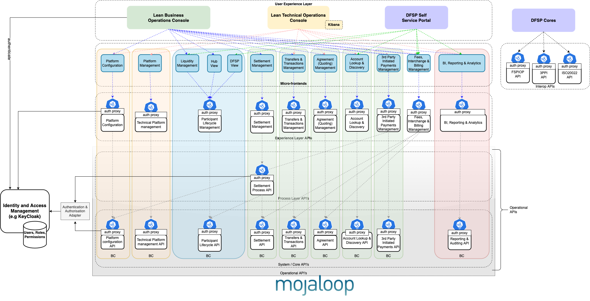
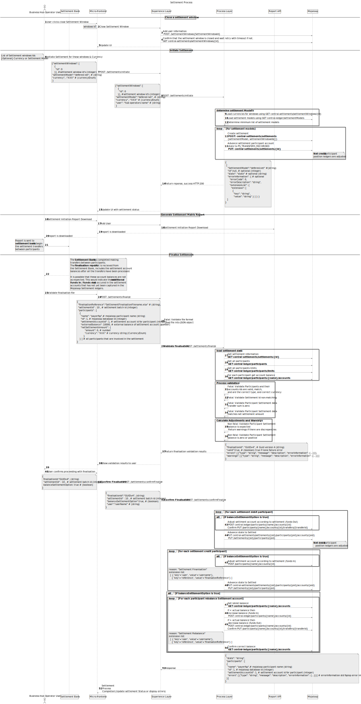
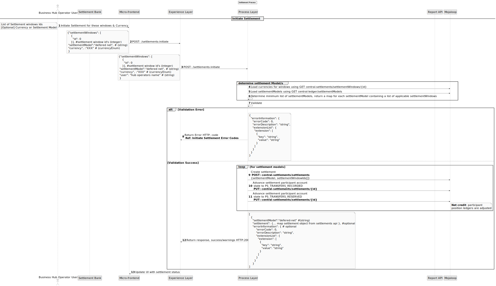
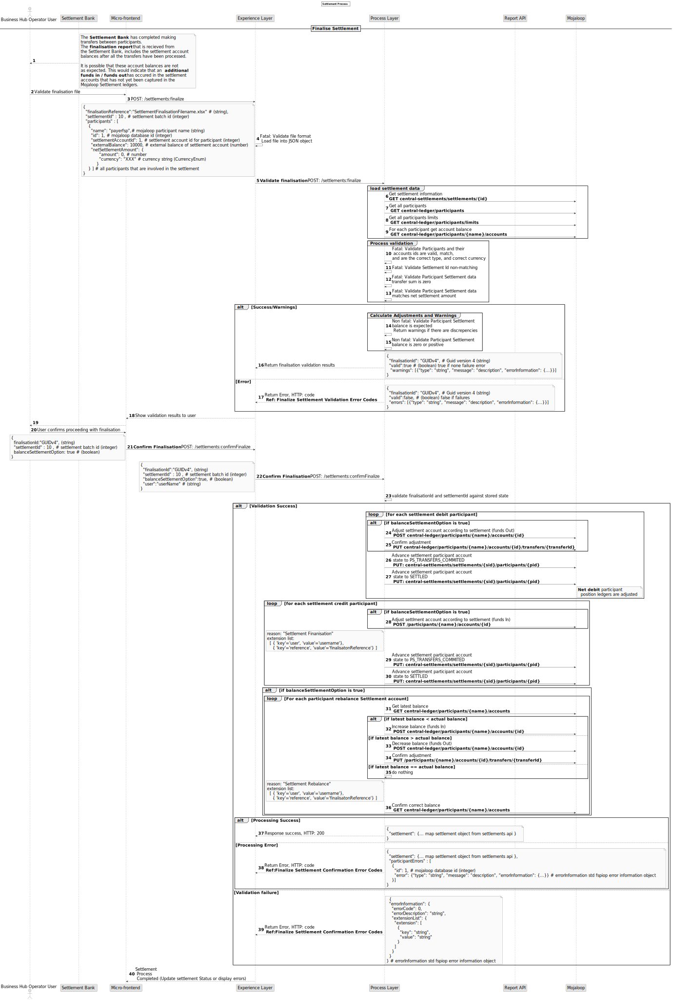

# Mise en œuvre opérationnelle du règlement

## Introduction

L'objectif de cette conception est de fournir une solution reliant les fonctions des processus métier aux opérations essentielles de règlement sur le switch.

Cette conception est un exemple d’implémentation d’un règlement Mojaloop pour un cas d’utilisation spécifique et n’est pas destinée à être exhaustive ni à couvrir tous les scénarios. Ce guide présente la conception à haut niveau et explique la logique adoptée pour un cas d’utilisation choisi.
Bien qu’une version de cette conception soit construite et opérationnelle, tout ce qui est décrit dans ce document n’a pas forcément été réalisé. 
Il s’agit d’un exemple de conception d’implémentation du règlement. L’intérêt de cette conception et de ce document est donc :
- d'être utilisé comme démonstration ;
- de servir de version initiale pour aider à ‘démarrer rapidement’ ;
- d’être une base à améliorer avant adoption ;
- de servir de point de départ pour approfondir des concepts abordés ici qui pourraient être traités dans un autre design.

## Opérations principales de règlement

Il s’agit des fonctionnalités de règlement actuellement fournies par le composant central de Mojaloop, [Central-Settlement](https://github.com/mojaloop/central-settlement). Des informations détaillées sont disponibles dans la [Documentation technique Mojaloop](https://github.com/mojaloop/documentation/tree/master/legacy/mojaloop-technical-overview/central-settlements).

Les opérations de règlement de base offrent les capacités suivantes :

- Créer un rapport de matrice de règlement à partir d’une liste de fenêtres de règlement (Settlement-Windows)
- Traiter les accusés de réception de règlement pour un rapport de matrice de règlement existant
- Gérer les fenêtres de règlement (création, fermeture, etc)
- Interroger les rapports de matrice de règlement, les fenêtres de règlement, etc.

La définition OpenAPI est disponible dans le [dépôt Mojaloop-Specification](https://github.com/mojaloop/mojaloop-specification/tree/master/settlement-api).

## Architecture de haut niveau

### Couche d’expérience (Experience layer)

La couche d'expérience du règlement est une API sans état qui expose les données à consommer par le public concerné. Sa fonction principale actuelle est d'ajouter les informations utilisateurs récupérées dans l’API, informations injectées dans les en-têtes de requête par le proxy ORY Oathkeeper. Cette fonction devrait s’élargir au fil du développement du produit.

### Couche de processus (Process layer)

Les API de processus permettent de combiner des données et d’orchestrer plusieurs APIs système pour un objectif métier donné. L’API central-settlement et central-ledger du Mojaloop sont consommées par cette API de processus.

L’API “Settlement Process” doit respecter les [standards de nommage Mojaloop](https://docs.google.com/document/d/1AZbX0UjraytFty0IWOHpyR6z35bh0-MCFG1vGKId_5M/edit?usp=sharing), et donc porter le nom suivant : `settlement-process-svc`.

## Processus métier de règlement à haut niveau

C’est un processus qui s’appuie sur les opérations de règlement de base pour orchestrer les capacités suivantes :

1. **Clôture d’une fenêtre de règlement**
La fenêtre de règlement courante peut être clôturée manuellement du moment où des transferts lui sont associés. L’opérateur du hub sélectionne la fenêtre ouverte et choisit ensuite de la clôturer.
1. **Initiation du règlement**
L’initiation du règlement sert à l’opérateur du hub pour créer un lot de règlement qui pilote le processus de règlement.
Pour initier le processus, l’opérateur choisit :
   - un ensemble de fenêtres de règlement ;
   - et éventuellement une devise de règlement ou un modèle de règlement (si une devise est sélectionnée, elle définit le modèle applicable).
Les grands livres de position des participants en crédit net sont ajustés lors de l’initiation.
**Note :** Il est important de créer l’objet de lot de règlement selon la manière dont le règlement doit être finalisé.
1. Un **rapport d’initiation de règlement** est généré, servant à communiquer à la banque de règlement les besoins du règlement.
1. **Finalisation du règlement et rééquilibrage du compte de règlement**
Ce processus intervient après l’exécution des changements de règlement par la banque. À cette étape :
   - le processus est terminé et un rapport de finalisation a été reçu de la banque ;
   - les grands livres de position des participants débiteurs nets sont ajustés ;
   - les grands livres de règlement sont ajustés pour tous les participants afin de correspondre au montant transféré ;
   - les grands livres de règlement sont comparés aux soldes réels des comptes et ajustés pour s’aligner.

### Fonction de rééquilibrage — non optimale
Il est à noter que la fonction de rééquilibrage définie ci-dessus n’est pas l’approche recommandée ou optimale. 
Elle a été choisie pour répondre à des exigences réglementaires et aux limites des mécanismes disponibles pour réaliser le règlement entre participants, c’est-à-dire conçue pour fonctionner avec les solutions financières existantes. Le rééquilibrage présente plusieurs inconvénients et devrait être évité si possible.
Ces inconvénients sont :
1. Un rééquilibrage hors séquence donne des résultats incorrects, ce qui nécessite un processus métier et une gestion dédiée.
1. La réconciliation du compte Mojaloop Settlement et de celui à la banque est difficile et complexe, car le rééquilibrage ne reflète pas directement l’activité du compte en banque : les montants des transferts dépendent du moment où le rééquilibrage est effectué et de la génération des rapports et relevés.

**Solutions recommandées**
Il existe de nombreuses autres approches suivant les meilleures pratiques. Merci de consulter un expert de la communauté Mojaloop pour les explorer. Si vos contraintes sont similaires et qu’il est impossible de créer un nouveau mécanisme, un ajustement mineur peut améliorer cette solution.
Remplacer le rééquilibrage par l’import d’un extrait de compte bancaire d’opérations supprimerait les problèmes de timing et de rapprochement mentionnés plus haut.

## Schéma de séquence détaillé

Certains processus du schéma méritent d’être détaillés.

### Détermination du modèle de règlement

Il faut d’abord déterminer les devises impliquées puis la liste appropriée de modèles de règlement. Un règlement est créé pour chaque modèle retenu.

### Validation des données de finalisation du règlement

Les données présentées au cours de la finalisation du règlement exigent de nombreuses validations.
Certaines contrôlent l’intégrité des données : un échec stoppe le processus. D’autres, non bloquantes, génèrent des avertissements pour l’opérateur.
La poursuite du processus n’est possible que lorsque l’opérateur a accepté les avertissements, leurs effets et a choisi les options d’application du processus.
C’est pourquoi la validation des données est une étape nécessaire, à consulter lors de toute acceptation ou poursuite du processus.

### Cas d’utilisation pour la finalisation du règlement
**Scénarios de validation**

| Description de la validation                                                                    | Comportement attendu                                                                          |
|------------------------------------------------------------------------------------------------|-----------------------------------------------------------------------------------------------|
| L’ID de règlement sélectionné ne correspond pas à celui du rapport                             | Finalisation annulée avec erreur                                                              |
| La somme des transferts dans le rapport est non nulle                                          | Finalisation annulée avec erreur                                                              |
| Le montant du transfert ne correspond pas au montant net de règlement                          | Finalisation annulée avec erreur                                                              |
| Solde non modifié à hauteur du montant du transfert                                            | Continuer --> Ajuster le solde du compte de règlement                                         |
| Le solde fourni dans le rapport n’est pas positif                                              | Continuer --> Solde de règlement à zéro ; NCD=0 ; désactivation du compte POSITION participant |
| Comptes du règlement absents du rapport                                                        | Finalisation annulée avec erreur                                                              |
| Comptes du rapport absents du règlement                                                        | Finalisation annulée avec erreur                                                              |
| Les identifiants participant ne correspondent pas (ID, nom, compte)                            | Finalisation annulée avec erreur                                                              |
| Le type de compte doit être POSITION                                                           | Finalisation annulée avec erreur                                                              |
| Nouveau solde invalide pour la devise                                                          | Finalisation annulée avec erreur                                                              |
| Montant du transfert invalide pour la devise                                                   | Finalisation annulée avec erreur                                                              |
| L’ID du compte n’existe pas dans le switch                                                     | Finalisation annulée avec erreur                                                              |
| Tentative de finaliser un règlement annulé                                                     | Finalisation annulée avec erreur                                                              |
| Erreur lors de l’ajustement d’un participant                                                   | Continuer avec les autres ; notifier l’utilisateur de l’erreur                                |
| Erreur lors du passage à l’état PS_TRANSFERS_RECORDED                                         | Continuer avec les autres ; notifier l’utilisateur de l’erreur                                |
| Erreur lors du passage à l’état PS_TRANSFERS_RESERVED                                         | Continuer avec les autres ; notifier l’utilisateur de l’erreur                                |
| Erreur lors du passage à l’état PS_TRANSFERS_COMMITTED                                        | Continuer avec les autres ; notifier l’utilisateur de l’erreur                                |
| Erreurs lors du règlement des comptes                                                          | Continuer avec les autres ; notifier l’utilisateur de l’erreur                                |
| Erreur lors de la mise à jour du NDC                                                          | Continuer avec les autres ; notifier l’utilisateur de l’erreur                                |
| Erreur lors du traitement des fonds entrants/sortants                                          | Continuer avec les autres ; notifier l’utilisateur de l’erreur                                |
| Solde inchangé après traitement des fonds entrants/sortants                                   | Continuer avec les autres ; notifier l’utilisateur de l’erreur                                |
| Solde final incorrect après traitement des fonds entrants/sortants                            | Continuer avec les autres ; notifier l’utilisateur de l’erreur                                |
| Échec de l’enregistrement de l’état du compte participant au règlement                        | Continuer avec les autres ; notifier l’utilisateur de l’erreur                                |

### Informations d’audit dans la version Mojaloop actuelle

L’opération réalisée est enregistrée dans le champ “settlement reason”, donc consultable dans les rapports d’audit.
De plus, l’utilisateur et les références sont capturés dans les listes d’extension — consultables elles aussi dans les rapports d’audit.

### RBAC

Pour exploiter au mieux le contrôle RBAC, les quatre processus ci-dessus seront implémentés comme combinaisons distinctes d'endpoint API et méthode HTTP. Cela autorise des permissions dédiées à chaque processus.

## Prise en charge du multi-devises

L’exécution des règlements multi-devises dépend de deux facteurs :
1. Comment les modèles de règlement sont conçus ?
   Les modèles peuvent être liés à une devise ou non, et s’appliquer à toutes les devises.
1. Comment les règlements sont initiés ?
   L’initiation du règlement peut se faire avec ou sans devise ou modèle spécifié.

Comme il est difficile de séparer un règlement une fois initié, il est préférable de décider à l’avance du mode d’application du règlement et de concevoir le système en conséquence.

---
**REMARQUE**
Si vous exécutez un modèle net différé multilatéral à devise unique et utilisez des devises test pour vos tests réguliers, il est préférable de créer les règlements des devises de test séparément de la devise réelle. Idéalement, il ne faut pas avoir à sélectionner la devise ou un modèle lors de l’initiation du règlement.
Cela s’obtient en créant des modèles séparés : un pour chaque monnaie test, un pour la monnaie réelle.
Par défaut, l’initiation sur transactions multi-devises génère des règlements séparés. (La fonction de détermination des modèles les trouvera tous.)
___

## Cas d’erreur 
### Initiation du règlement

**Schéma de séquence détaillé de l’initiation**

**Codes d’erreur à l’initiation du règlement**

| Description de l’erreur                                               | Code erreur |  Code HTTP       | Catégorie                                  |
|-----------------------------------------------------------------------|------------|------------------|---------------------------------------------|
| ID de règlement introuvable                                           | 3100       | 400              | Erreur validation requête                   |
| Devise non valide                                                     | 3100       | 400              | Erreur validation requête                   |
| Modèle de règlement introuvable                                       | 3100       | 400              | Erreur validation requête                   |
| Impossible de créer le règlement                                      | 2000       | 500              | Erreur interne serveur                      |
| Impossible de mettre à jour l’état du règlement                       | 2000       | 500              | Erreur interne serveur                      |
| Erreur technique lors des communications avec les services Mojaloop   | 1000       | 500              | Erreur technique                            |

### Finalisation du règlement

**Schéma de séquence détaillé de la finalisation**

**Codes erreurs de validation à la finalisation**

| Description de l’erreur                                               | Code erreur |  Code HTTP       | Catégorie                                  |
|-----------------------------------------------------------------------|------------|------------------|---------------------------------------------|
| ID de règlement introuvable                                           | 3100       | 400              | Erreur validation requête                   |
| IDs de participants introuvables                                      | 3000       | 400              | Erreur validation requête                   |
| IDs de compte participants introuvables                               | 3000       | 400              | Erreur validation requête                   |
| Erreur technique lors des communications avec les services Mojaloop   | 1000       | 500              | Erreur technique                            |
| ID de règlement sélectionné ne correspondant pas au rapport           | 3100       | 500              | Erreur validation processus                 |
| IDs participants du rapport ne correspondent pas au règlement         | 3000       | 500              | Erreur validation processus                 |
| Comptes du rapport ne correspondent pas au règlement                  | 3000       | 500              | Erreur validation processus                 |
| Somme des transferts non nulle dans le rapport                        | 3100       | 500              | Erreur validation processus                 |
| Montant transfert ≠ montant net de règlement                          | 3100       | 500              | Erreur validation processus                 |
| Nouveau solde non valide pour la devise                               | 3100       | 500              | Erreur validation processus                 |
| Montant de transfert non valide pour la devise                        | 3100       | 500              | Erreur validation processus                 |
| Règlement à l’état ABORTED ou invalide                               | 3100       | 500              | Erreur validation processus                 |
| Montant de transfert non valide pour la devise                        | 3100       | 500              | Erreur validation processus                 |

**Codes d’erreur de confirmation à la finalisation**

| Description de l’erreur                                               | Code erreur |  Code HTTP       | Catégorie                                  |
|-----------------------------------------------------------------------|------------|------------------|---------------------------------------------|
| ID de finalisation introuvable                                        | 3100       | 400              | Erreur validation requête                   |
| ID de règlement introuvable                                           | 3100       | 400              | Erreur validation requête                   |
| Erreur technique lors des communications avec les services Mojaloop   | 1000       | 500              | Erreur technique                            |
| Erreur traitement des fonds entrants/sortants                         | 2001       | 500              | Erreur interne serveur                      |
| Impossible de mettre à jour l’état du règlement                       | 2001       | 500              | Erreur interne serveur                      |
| Soldes non concordants après règlement                                | 2001       | 500              | Erreur interne serveur                      |
| Soldes non concordants après rééquilibrage                            | 2001       | 500              | Erreur interne serveur                      |
