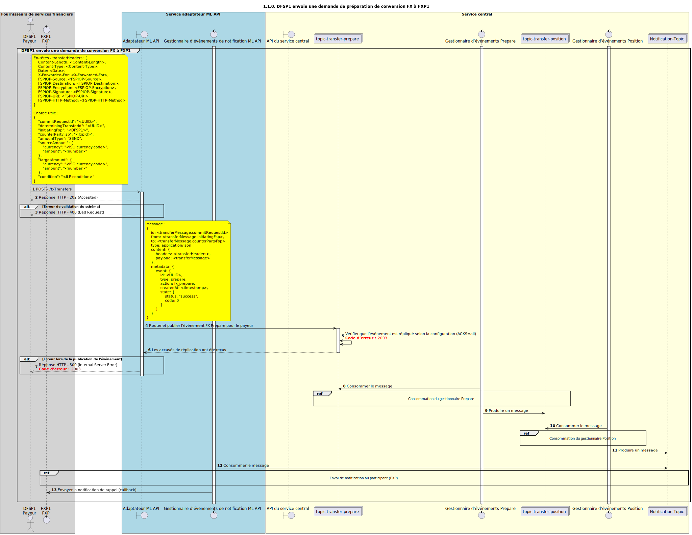

# Demande de préparation de transfert FX

Diagramme de conception de séquence pour le processus de demande de préparation de transfert FX.

## Références dans le diagramme de séquence

* [Consommation par le gestionnaire Prepare FX (1.1.1.a)](1.1.1.a-fx-prepare-handler-consume.md)
* [Consommation par le gestionnaire Position FX (1.1.2.a)](1.1.2.a-fx-position-handler-consume.md)
* [Envoi de notification au participant (1.1.4.a)](1.1.4.a-send-notification-to-participant-v2.0.md)

## Diagramme de séquence

