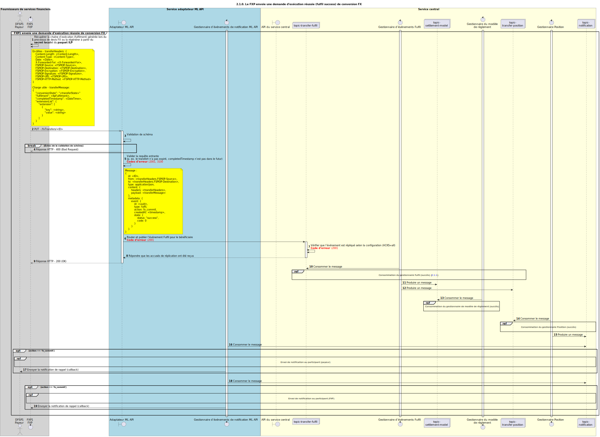

# Demande d’exécution de transfert réussie (fulfil)

Diagramme de conception de séquence pour la demande d’exécution de transfert en succès.

## Références dans le diagramme de séquence

<!-- * [Consommation par le gestionnaire Fulfil (succès) (2.1.1)](2.1.1-fulfil-handler-consume.md)
* [Consommation par le gestionnaire Position (succès) (1.3.2)](1.3.2-fulfil-position-handler-consume.md) -->
* [Envoi de notification au participant (1.1.4.a)](1.1.4.a-send-notification-to-participant-v2.0.md)

## Diagramme de séquence

