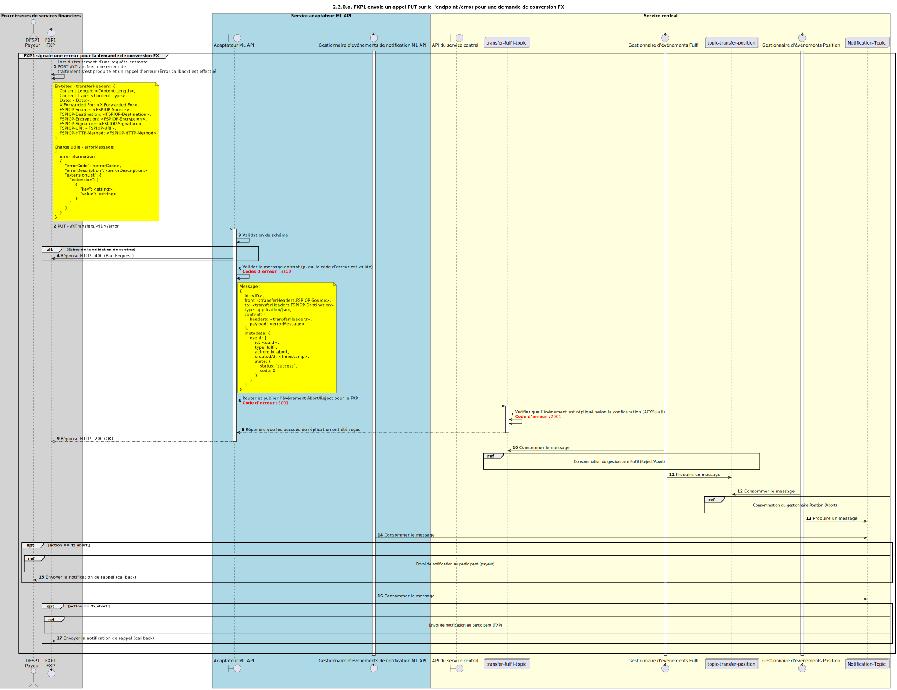

# Le FXP envoie une demande d’abandon d’exécution (fulfil abort) pour un transfert FX

Diagramme de conception de séquence pour le processus de rejet d’exécution de transfert FX (fulfil reject).

## Diagramme de séquence

