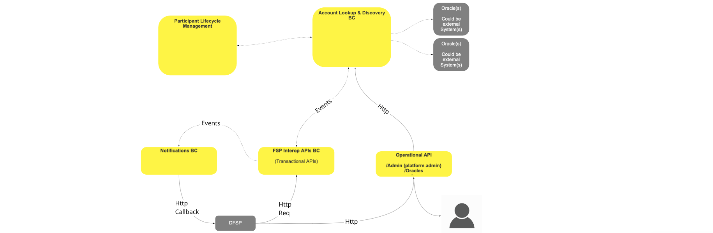
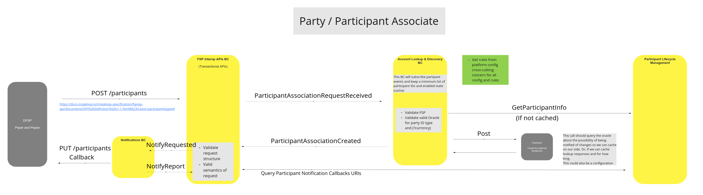
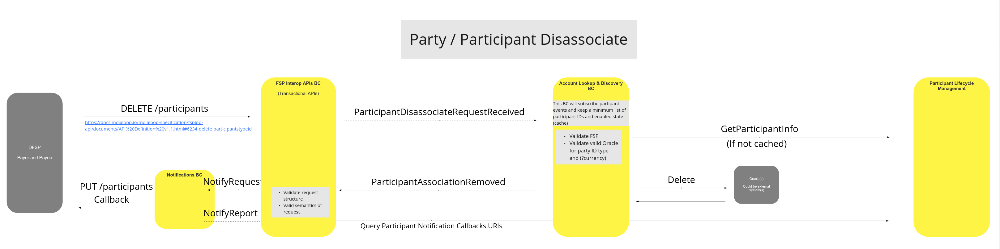
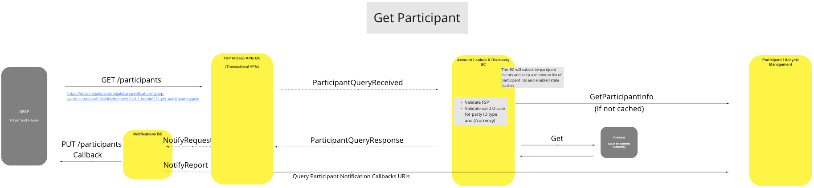
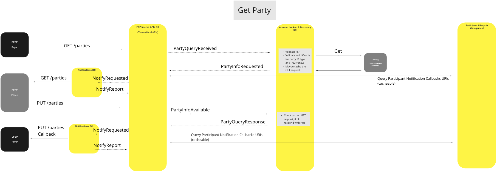

# BC de Recherche et Découverte de Comptes

Le BC de Recherche et Découverte de Comptes est responsable de la localisation et de l’association des participants et des parties avec les transactions initiées par une partie ou un participant.

## Termes

Les termes suivants sont utilisés dans ce BC, aussi appelé domaine.

| Terme | Description |
|---|---|
| **Participant** | Fournisseur de Services Financiers (FSF) |
| **Party (Partie)** | Client du FSF |

## Vue Fonctionnelle

>Diagramme fonctionnel du BC : Vue d’ensemble de la Recherche et Découverte de Comptes

## Cas d’Utilisation

#### Association Partie/Participant

#### Description

Lorsqu’un Participant DFSP demande à associer un identifiant de Partie donné à un Participant (lui-même).

***Remarque :*** *Les vérifications et validations KYC (« Know Your Customer » – Connaître votre client) ne sont pas couvertes ici et relèvent de processus extérieurs aux appels d’API Mojaloop. Ces vérifications doivent être prises en charge par le Schéma pour garantir la validité des demandes d’association (ou de dissociation).*

#### Diagramme de Flux

>Diagramme de flux UC : Association Partie/Participant

### Dissociation Partie/Participant

#### Description

Dans ce cas, un Participant DFSP demande à supprimer l’association existante entre un identifiant de Partie et un Participant (lui-même).

#### Diagramme de Flux

>Diagramme de flux UC : Dissociation Partie/Participant

### Obtenir un Participant

#### Description

Lorsqu’un Participant DFSP demande des informations d’association de Participant sur la base d’un identifiant de Partie, ce cas d’utilisation est utilisé par le switch pour valider la demande et fournir les données d’association demandées au DFSP requérant.

#### Diagramme de Flux

>Diagramme de flux UC : Obtenir un Participant

### Obtenir une Partie

#### Description

Lorsqu’un Participant DFSP interroge un autre Participant DFSP pour obtenir les détails d’une Partie gérée par ce dernier, ce cas d’utilisation permet de valider la demande et de fournir les données de la Partie demandées au DFSP requérant.

#### Diagramme de Flux

>Diagramme de flux UC : Obtenir une Partie

<!--## Notes -->
<!-- Les notes de bas de page elles-mêmes se trouvent en bas. -->

[^1]: Interfaces Communes : [Liste d’interfaces communes Mojaloop](../../commonInterfaces.md)
