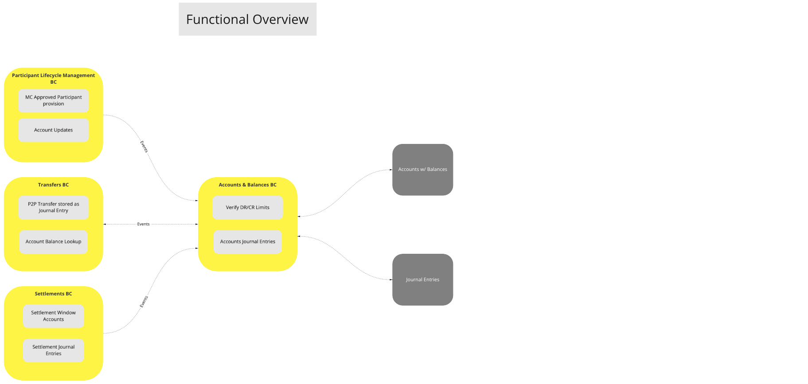
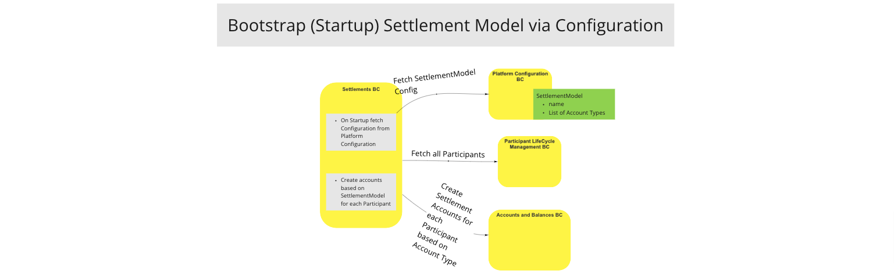
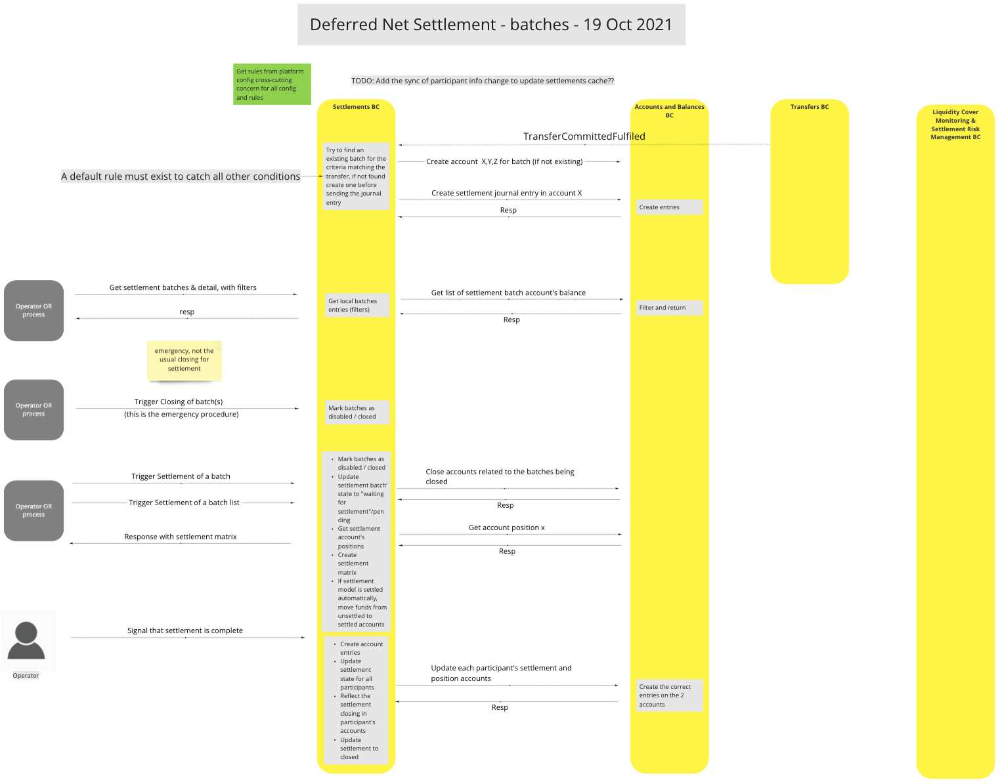
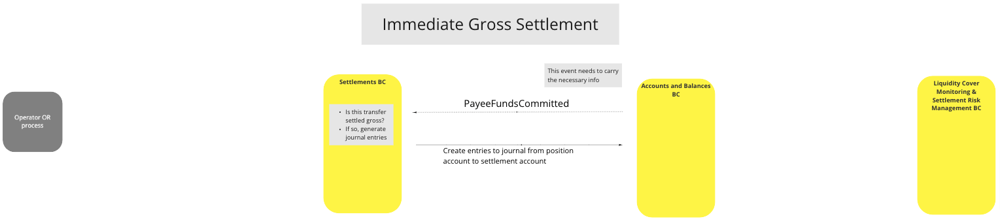

# BC Comptes et Soldes

Le BC Comptes et Soldes agit comme le « grand livre central » du système. Il interagit principalement avec le BC Règlements, le BC Cycle de Vie des Participants et les BCs Transferts. Il s’agit d’un sous-système dirigé, ce qui signifie qu’il constitue une dépendance pour les BCs qui l’utilisent comme « registre financier » pour la comptabilité.

**Remarque :**

Le BC Comptes et Soldes contient une quantité limitée de logique afin de garantir que **(a)** les bonnes relations sont créées et maintenues entre les entités lorsqu’un BC externe crée, met à jour, consulte ou ferme des comptes et **(b)** que les limites de comptes appropriées sont appliquées (c’est-à-dire définies et non dépassées) lorsqu’un BC externe tente de créer des écritures comptables, et **(c)** qu’on évite les doublons d’écritures grâce à l’utilisation d’*identifiants uniques universels (UUID)* pour les identifiants d’écritures uniques.

## Termes

Termes ayant une signification spécifique et communément acceptée dans le contexte délimité où ils sont utilisés.

| Terme               | Description                                                                                                                                                                                 |
|---------------------|---------------------------------------------------------------------------------------------------------------------------------------------------------------------------------------------|
| **Compte**          | Désigne un compte du Grand Livre, un enregistrement dans un système comptable qui enregistre les écritures au débit ou au crédit représentant une opération financière.                      |
| **Écriture**        | Enregistrements comptables de crédit/débit sur un Compte.                                                                                                                                   | 
| **Solde**           | Montant disponible dans un compte, une fois pris en compte les débits et crédits.                                                                                                            |

## Vue fonctionnelle – Comptes et Soldes

>Diagramme fonctionnel BC : Vue d’ensemble des Comptes & Soldes

## Cas d’utilisation

### Création de Compte

#### Description

Le flux défini par ce cas d’utilisation permet au Switch de créer de nouveaux comptes participants/de transfert/de règlement dans le Grand Livre du Système. (La création de comptes Participants intervient à la fois depuis le BC Cycle de Vie des Participants et le BC Règlements. Des exemples issus des deux sont fournis dans les diagrammes de flux ci-dessous.)

De plus, ce flux permet de spécifier des limites de crédit/débit pour les Écritures, et garantit que le Compte est unique dans le Grand Livre du Système.

#### Diagramme de flux

Création de compte depuis le [BC Cycle de Vie des Participants](../participantLifecycleManagement/index.md)

<!-- Remarque à l’attention des développeurs & éditeurs : Les deux images suivantes sont générées à partir du BC Cycle de Vie des Participants. -->

>Diagramme de flux UC : Ajout de comptes participants

Création de compte depuis le [BC Règlements](../settlements/index.md)

>Diagramme de flux UC : Initialisation via configuration d’un modèle de règlement

### Fermeture de Compte

#### Description

Fermer un compte participant dans le Grand Livre du Système et empêcher l’impact de nouvelles écritures comptables sur celui-ci.  (À déterminer : possible vidage automatique des soldes CR de collatéral vers un autre compte automatiquement ?)

### Consultation de Compte

#### Description

Consulter le statut et le solde d’un compte participant.

#### Diagramme de flux

Demande des limites de liquidité CR/DR depuis le [BC Cycle de Vie des Participants](../participantLifecycleManagement/index.md)

<!-- Remarque à l’attention des développeurs & éditeurs : Les deux images suivantes sont générées à partir du BC Cycle de Vie des Participants. -->

>Diagramme de flux UC : Demande de couverture de liquidité

### Consultation des écritures

#### Description

Consulter les écritures comptables (débit/crédit) d’un Compte.

### Insertion d’une écriture

#### Description

Saisir une écriture comptable de participant dans le Grand Livre en spécifiant les comptes débiteurs et créditeurs (Il existe trois façons d’effectuer ces saisies ; voir les diagrammes de flux ci-dessous pour chacune.)
Répondre avec le nouveau solde du compte.

#### Diagramme de flux

Insertion d’une écriture depuis le [BC Transferts](../transfers/index.md)

>Diagramme de flux UC : Effectuer un transfert (mode universel)

Insertion d’une écriture depuis le [BC Règlements](../settlements/index.md) en utilisant le modèle `Règlement Net Différé (DNS)`

>Diagramme de flux UC : Règlement Net Différé – 19/10/2021

Insertion d’une écriture depuis le [BC Règlements](../settlements/index.md) en utilisant le modèle `Règlement Brut Immédiat (IGS)`

>Diagramme de flux UC : Règlement Brut Immédiat

## Modèle Canonique

- Compte
  - accountId
  - ledgerAccountType
  - ledgerAccountState
  - debitLimit
  - creditLimit
  - debitBalance
  - creditBalance
- Écriture
  - journalEntryId
  - debitAccountId
  - creditAccountId
  - journalEntryType
  - transferAmount
  - transferTimestamp

<!-- Les notes de bas de page elles-mêmes se trouvent en bas. -->
<!-- ## Notes -->

[^1]: Interfaces Communes : [Liste d’interfaces communes Mojaloop](../../commonInterfaces.md)
