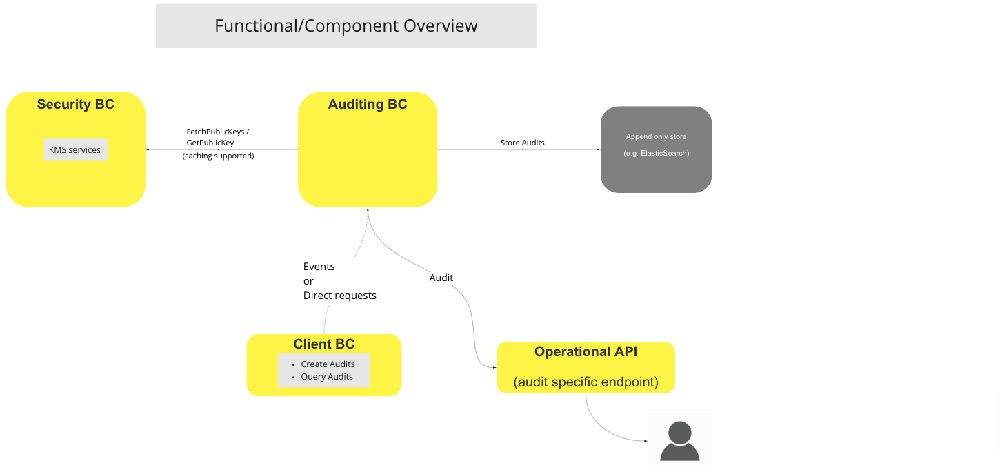
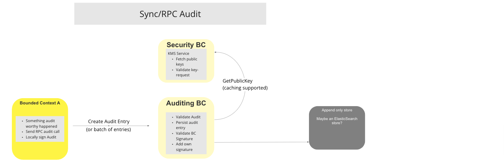
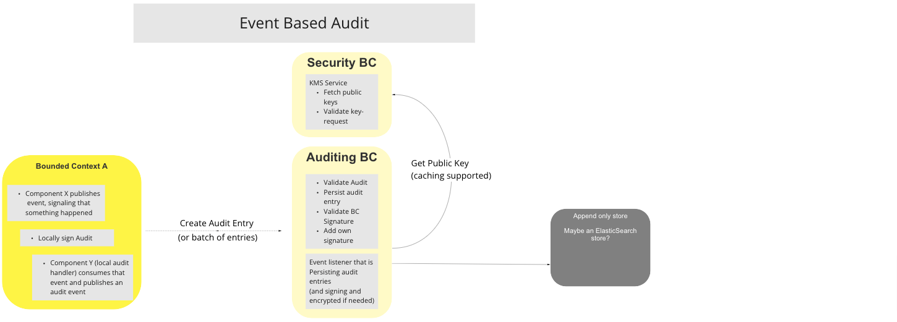

# BC Auditing

Le BC Auditing est responsable du maintien d’un enregistrement immuable de toutes les transactions qui ont lieu sur le Switch. Son architecture est composée de cinq principaux composants :

* Service Centralisé de Journalisation Médico-légale
* Services
* Stockage Immuable
* Système de Gestion des Clés (KMS)
* Module Fournisseur Cryptographique (CPM)[^1]

Les utilisateurs autorisés peuvent interroger le BC Auditing via une API d’Opérations exposée à cet effet, afin d’obtenir des détails sur les événements auditables.

## Termes

Termes ayant une signification spécifique et communément admise dans le Contexte Borné où ils sont utilisés.

| Terme | Description |
|---|---|
| **KMS** | Système de Gestion des Clés (Key Management System) – Fournit des services de chiffrement/déchiffrement et d’Autorité de Certification à l’environnement du Switch (émission, signature et vérification via le BC Sécurité). |
| **CPM** | Module Fournisseur Cryptographique – Gère les techniques et méthodologies cryptographiques employées par le Switch, afin de garantir des services de chiffrement et de déchiffrement de bout en bout pour toutes les données stockées ou transmises. |

## Vue Fonctionnelle

> Diagramme Fonctionnel du BC : Vue d’ensemble du Système d’Audit

## Cas d’Utilisation

### Démarrage du BC Auditing

#### Description

Le cas d’utilisation « Démarrage du BC Auditing » est déclenché lors du démarrage (à intervalles réguliers ou sur évènement) et récupère l’ensemble des clés publiques utilisées par les différents BCs Participants du Switch depuis le BC Sécurité fournissant les services de gestion des clés (KMS) pour tous les BCs Participants du Switch.

#### Diagramme de déroulement

> Diagramme de Workflow du Cas d’Utilisation : Démarrage du BC Auditing

### Audit Sync/RPC

#### Description

Le cas d’utilisation « Audit Sync/RPC » est activé lors d’un événement digne d’audit déclenché pendant une transaction notée par un BC participant. Le BC participant notifie alors le BC Auditing via un appel RPC synchronisé. L’entrée d’audit est signée localement par le BC émetteur. Dès réception, le BC Auditing effectue une série de procédures comprenant une opération avec le KMS via le BC Sécurité, puis persiste l’enregistrement dans un stockage à ajout-seul (Append-only Store).

#### Diagramme de déroulement

> Diagramme de Workflow du Cas d’Utilisation : Audit Sync/RPC

### Audit Basé sur les Événements

#### Description

Le cas d’utilisation « Audit Basé sur les Événements » est déclenché lorsqu’un BC participant dispose d’une capacité d’audit locale, détecte un événement digne d’audit, crée un événement d’audit signé localement, qu’il publie puis envoie (individuellement ou en lot) au BC Auditing. L’événement est validé via une procédure avec le BC Sécurité, puis stocké dans le dépôt à ajout-seul.

#### Diagramme de déroulement

> Diagramme de Workflow du Cas d’Utilisation : Audit Basé sur les Événements

<!-- Les notes de bas de page elles-mêmes se trouvent en bas. -->
## Notes

[^1]: « Cryptographique » fait référence à l’ensemble des techniques et méthodologies algorithmiques employées par les systèmes pour empêcher des systèmes ou des personnes non autorisées d’accéder, d’identifier ou d’utiliser des données stockées. Pour en savoir plus, veuillez consulter l’article Wikipédia dédié : [Cryptographie, Wikipedia – l’encyclopédie libre](https://fr.wikipedia.org/wiki/Cryptographie)

[^2]: Interfaces communes : [Liste des Interfaces Communes Mojaloop](../../refarch/commonInterfaces.md)
