# BC de l'API d'Interopérabilité FSP

Le Contexte Borné de l'API d'Interopérabilité FSP (FSP Interoperability API Bounded Context) permet l'accès aux opérations internes et aux ressources que l'écosystème Mojaloop met à la disposition d'un Participant donné. Ce Contexte Borné est responsable de fournir à un Participant des interfaces lui permettant d'exécuter des actions sur Mojaloop. Il est également responsable de la communication vers le Participant concernant différentes notifications et messages système que ce dernier doit recevoir.

## Vue Fonctionnelle

L'API FSP IOP interagit avec de nombreux autres contextes bornés, une vue simplifiée est donc présentée ici. Pour une lecture approfondie sur les événements, connexions que l'API FSP IOP fournit ou consomme, veuillez consulter les Interfaces Communes Mojaloop [^1]. Les contextes bornés intégrés avec l'API FSP IOP sont :

-   Contexte borné de Recherche et Découverte de Compte [^14]
-   Contexte borné des Notifications et Alertes [^27]
-   Contexte borné de Gestion du Cycle de Vie du Participant [^26]
-   Contexte borné de Devis/Accords [^19]
-   Contexte borné des Transferts [^22]
-   Contexte borné de Règlement [^21]

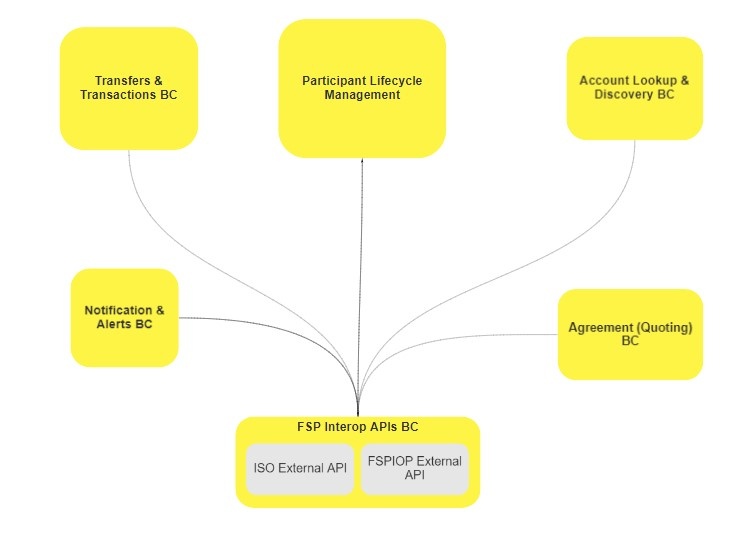

> Vue Fonctionnelle de l'API d'Interopérabilité FSP

## Termes

Termes ayant une signification spécifique et reconnue dans le contexte borné où ils sont utilisés.

| Terme            | Description                                                                                                                                                      |
| ---------------- | ---------------------------------------------------------------------------------------------------------------------------------------------------------------- |
| **(D)FSP**           | Fournisseur de Services Financiers (Digitaux)                                                                                                                     |
| **Participant**      | Fournisseur de Services Financiers (FSP) enregistré dans l'écosystème Mojaloop, pouvant ainsi effectuer des transactions avec d'autres Participants           |
| **FSP IOP API**      | Interface API d'Interopérabilité des FSP, qui donne accès aux fonctions de l'écosystème Mojaloop                                                                |
| **Payeur**           | Le payeur des fonds électroniques dans une transaction de paiement                                                                                              |
| **FSP du Payeur**    | Fournisseur de Services Financiers du payeur                                                                                                                    |
| **Bénéficiaire**     | Le destinataire des fonds électroniques dans une transaction de paiement                                                                                        |
| **FSP du Bénéficiaire** | Fournisseur de Services Financiers du bénéficiaire                                                                                                              |

## Cas d'Utilisation

### Remarque

Les définitions des cas d'utilisation stipulées dans la Spécification Open API pour FSP Interoperability [^2] n'ont pas été modifiées. L'Architecture de Référence a été conçue pour ne changer que l'orchestration interne des services Mojaloop et des Contextes Bornés.

### BC Notifications - Envoi de Notification

#### Description

Les notifications concernent TOUS les cas d'utilisation ci-dessous en réponse à des demandes reçues sous différentes formes. Pendant que l'API FSP IOP traite une demande, elle peut devoir envoyer une requête au DFSP demandeur ou à d'autres DFSP concernés. L'API FSP IOP interrogera alors le Contexte Borné de Gestion du Cycle de Vie du Participant [^26] pour obtenir l'URI de rappel du participant destinataire. L'API FSP IOP enverra ensuite la notification au Contexte Borné Notifications et Alertes [^27].

#### Schéma de Flux

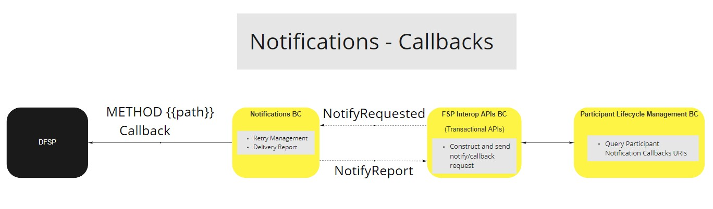

>

## BC Recherche et Découverte de Compte

### Association d'une Partie/Participant

#### Description

Associer un ou plusieurs Participants et/ou parties avec la requête POST Participant [^5] (POST /participants/{Type}/{ID}). L'API FSP IOP envoie la requête au BC de Recherche et Découverte de Compte [^14] qui la traite et répond par un évènement de succès. L'API FSP IOP envoie ensuite une réponse de notification PUT Participant [^15] (PUT /participants/{Type}/{ID}).

#### Schéma de Flux

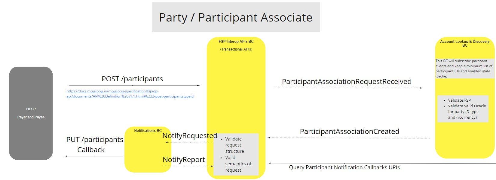

>

### Dissociation d'une Partie/Participant

#### Description

Dissocier un ou plusieurs Participants ou parties à l'aide de la requête DELETE Participant [^6] (DELETE /participants/{Type}/{ID}). L'API FSP IOP envoie la requête au BC de Recherche et Découverte de Compte [^14] pour dissocier la partie. Le succès est renvoyé à l'API FSP IOP qui notifie l'appelant avec une réponse de notification PUT Participant [^15] (PUT /participants/{Type}/{ID}).

#### Schéma de Flux

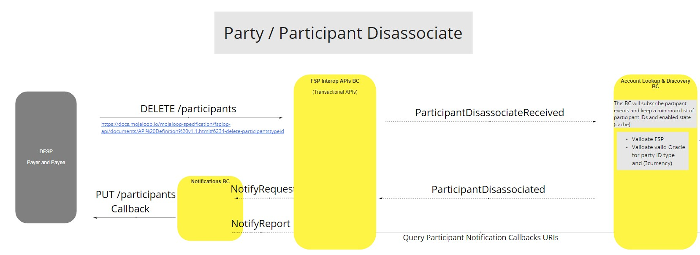

>

### Obtenir un Participant

#### Description

Récupérer les informations d'un participant grâce à la requête GET Participant [^7] (GET /participants/{Type}/{ID}) qui envoie l'ID et la structure. L'API FSP IOP envoie la requête au BC de Recherche et Découverte de Compte [^14] pour vérifier si le participant existe. L'API FSP IOP répond alors au demandeur avec une réponse PUT Participant [^15] (PUT /participants/{Type}/{ID}).

#### Schéma de Flux

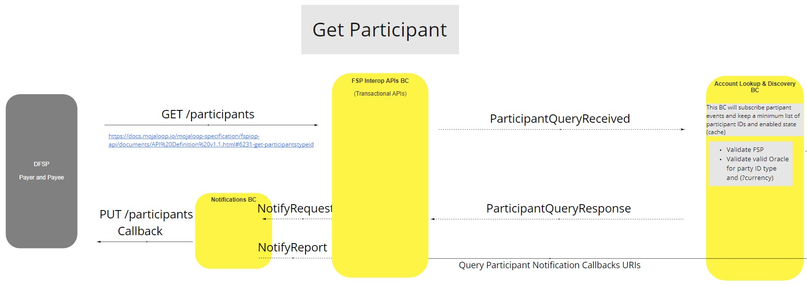

>

### Obtenir une Partie

#### Description

Récupérer les informations d'une partie via l'ID avec la requête GET Party [^8] (GET /parties/{Type}/{ID}). L'API FSP IOP envoie une requête au BC de Recherche et Découverte de Compte [^14] pour déterminer le FSP cible pour le transfert de la requête GET. Le FSP cible répond avec une requête PUT parties. L'information est ensuite envoyée au BC pour être mise en cache avant que la réponse PUT Party [^17] (PUT /parties/{Type}/{ID}) ne soit renvoyée à l'émetteur de la requête GET.

#### Schéma de Flux

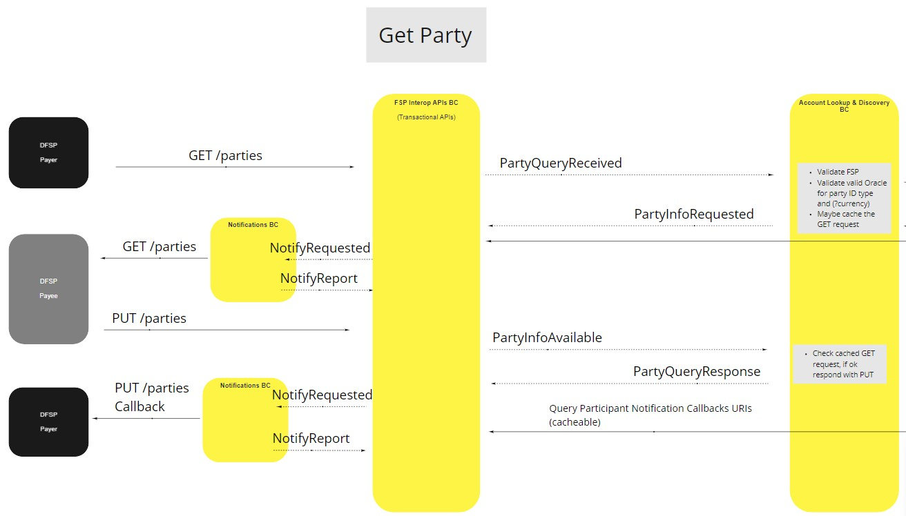

>

## BC Devis (Quoting)

### Calculer un Devis - Parcours Nominal

#### Description

Lorsqu'un devis est envoyé via un POST Quote [^3] (POST /quotes), l'API FSP IOP transmet la demande au BC Quoting/Agreement [^19] pour validation. L'API FSP IOP transmet ensuite le POST Quote au FSP bénéficiaire, qui répond à son tour avec une réponse PUT Quote [^18] (PUT /quotes/{ID}) avec les informations mises à jour. L'API FSP IOP envoie le devis accepté au BC Quoting/Agreement [^19] pour l'enregistrement, puis envoie la requête PUT quote au FSP payeur et considère le devis réussi.

#### Schéma de Flux

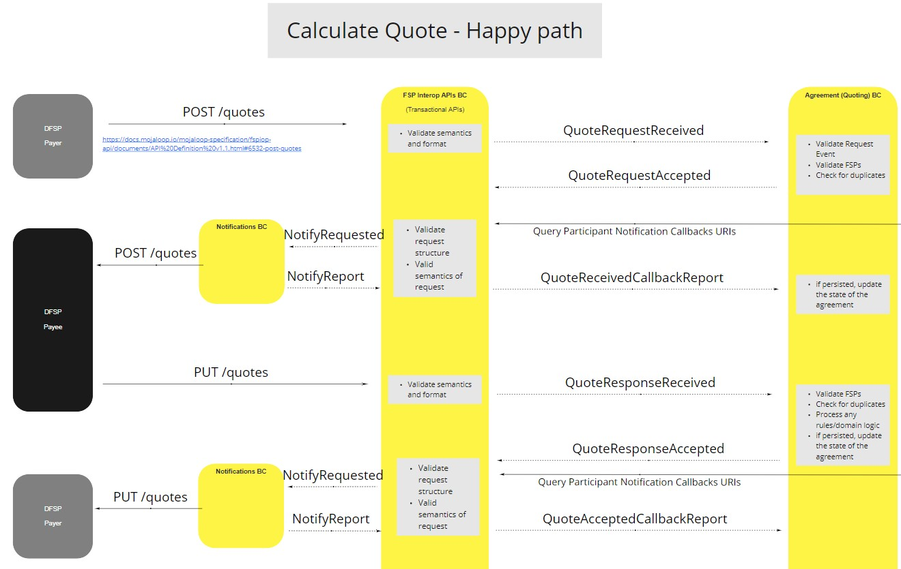

>

### Obtenir un Devis - Parcours Nominal

#### Description

Permet à un FSP de récupérer les détails d'un devis existant. La requête GET Quote [^4] (GET /quotes/{ID}) est envoyée à l'API FSP IOP qui interroge le BC Quoting/Agreement [^19] pour les devis existants. Une fois le devis récupéré, les informations sont renvoyées au FSP demandeur via une réponse PUT Quote [^18] (PUT /quotes/{ID}).

#### Schéma de Flux

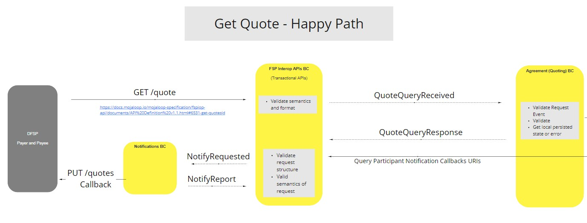

>

### Calculer un Devis - Demande de Devis Invalide

#### Description

Lorsqu'une requête POST Quote [^3] (POST /quotes) est reçue, l'API FSP IOP l'envoie au BC Quoting/Agreement [^19] pour traitement. Si le devis échoue à la validation, le BC Quoting/Agreement retourne une erreur, notifiée au FSP demandeur via PUT Quote Error [^20] (PUT /quotes/{ID}/error).

#### Schéma de Flux

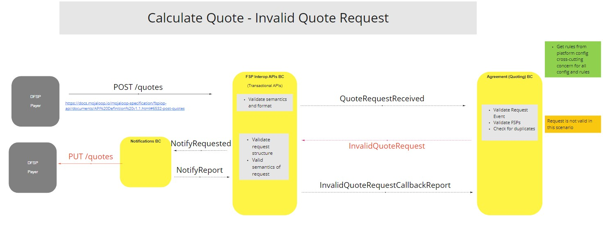

>

### Calculer un Devis - Participants FSP Invalides

#### Description

Si une requête POST Quote [^3] (POST /quotes) est envoyée et que le BC Quoting/Agreement [^19] ne peut valider les deux FSP, une réponse d'erreur est envoyée à l'API FSP IOP qui la notifie au FSP demandeur via PUT Quote Error [^20] (PUT /quotes/{ID}/error).

#### Schéma de Flux

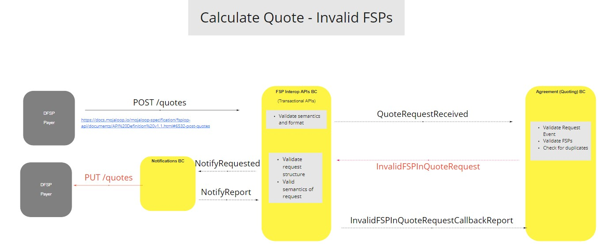

>

### Calculer un Devis - Règles de Schéma Invalides détectées dans la Requête

#### Description

Quand le FSP Payeur envoie une requête POST Quote [^3] (POST /quotes), l'API FSP IOP l'envoie au BC Quoting/Agreement [^19]. Si le devis n'est pas conforme aux règles du système, une erreur est renvoyée à l'API FSP IOP qui la notifie au FSP Payeur via PUT Quote Error [^20] (PUT /quotes/{ID}/error).

#### Schéma de Flux

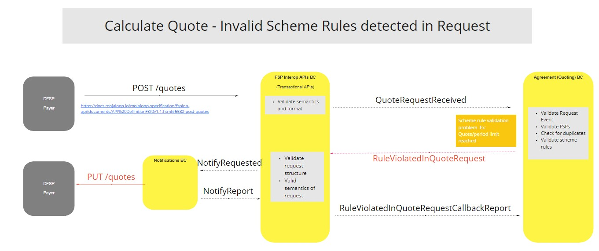

>

### Calculer un Devis - Règles de Schéma Invalides détectées dans la Réponse

#### Description

Lorsque le FSP Payeur envoie une requête POST Quote [^3] (POST /quotes), l'API FSP IOP l'envoie au BC Quoting/Agreement [^19]. Si la réponse du FSP bénéficiaire (PUT Quote [^18]) échoue aux validations de schéma, une erreur est envoyée à l'API FSP IOP, qui notifie les deux FSP via PUT Quote Error [^20] (PUT /quotes/{ID}/error).

#### Schéma de Flux 

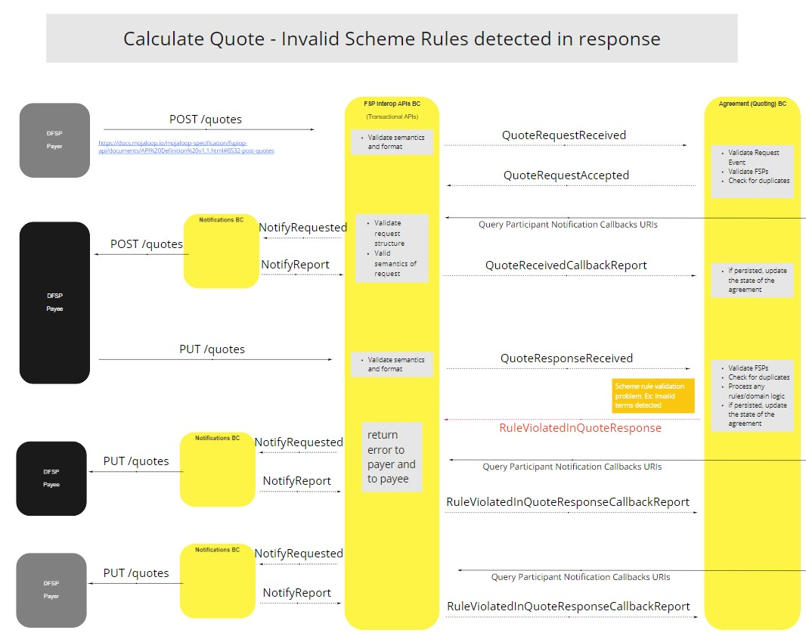

> BC Devis - Calculer un Devis - Règles de Schéma Invalides détectées dans la Réponse

## BC des Transferts

### Réaliser un Transfert (Mode Universel)

#### Description

Le FSP Payeur envoie une requête POST Transfers [^9] (POST /transfers) à l'API FSP IOP. Celle-ci envoie ensuite un évènement au BC des Règlements [^21]. L'API FSP IOP attend un évènement du BC des Transferts [^22] signalant que le transfert a été préparé, pour envoyer une requête POST au FSP Bénéficiaire. Celui-ci répond avec une requête PUT Transfers [^23] (PUT /transfers/{ID}) (transferState = committed) à l'API FSP IOP qui finalise l'exécution. Le PUT transfer est ensuite envoyé au FSP Payeur.

#### Schéma de Flux

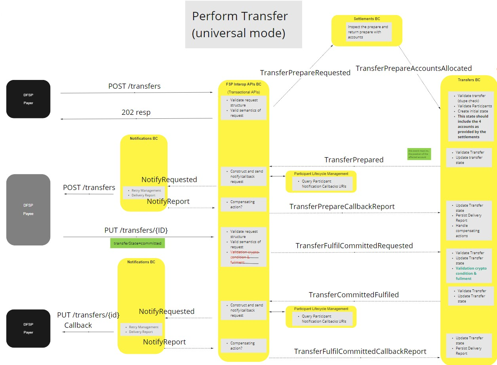

>

### Réaliser un Transfert avec Confirmation du Bénéficiaire

#### Description

Le FSP Payeur envoie une requête POST Transfers [^9] (POST /transfers) à l'API FSP IOP. Celle-ci envoie un évènement au BC des Règlements [^21]. L'API FSP IOP attend l'évènement du BC des Transferts [^22], puis émet un POST vers le FSP Bénéficiaire. Celui-ci répond avec un PUT Transfers [^23] (PUT /transfers/{ID}) (transferState = reserved). Le PUT transfer est ensuite envoyé au FSP Payeur. Le FSP Bénéficiaire reçoit alors un PATCH Transfers [^24] (PATCH /transfers/{ID}) pour notifier le changement d'état.

#### Schéma de Flux

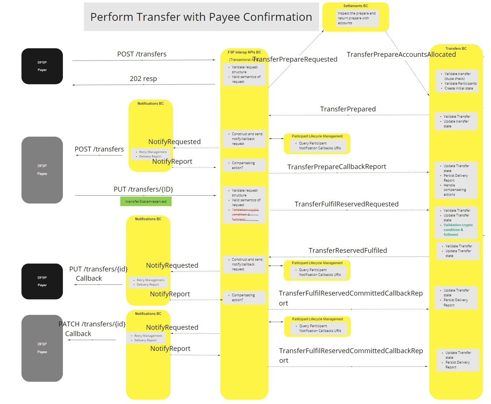

>

### Requête Get Transfer

#### Description

Obtention des infos sur un transfert selon l'ID utilisé dans GET Transfer [^11] (GET /transfers/{ID}), puis réception du PUT Transfers [^23] (PUT /transfers/{ID}) pour obtenir les informations pertinentes.

#### Schéma de Flux

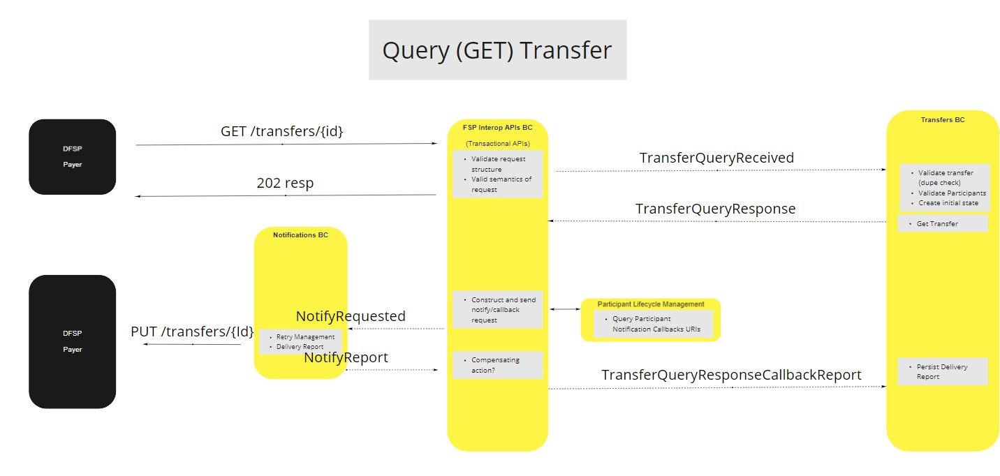

>

### Réaliser un Transfert - Post Doublon (Nouvel Envoi)

#### Description

Une requête POST Transfers [^9] (POST /transfers) a déjà été traitée, un rapport de statut est retourné au FSP Payeur via PUT Transfers [^23] (PUT /transfers/{ID}).

#### Schéma de Flux

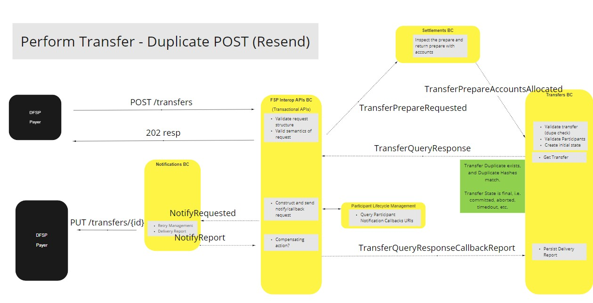

> BC Transferts - Réaliser un Transfert - Post Doublon (Nouvel Envoi)

### Réaliser un Transfert - Post Doublon (Ignoré)

#### Description

Une requête POST Transfers [^9] (POST /transfers) a déjà été traitée mais aucune réponse n'est nécessaire ou attendue.

#### Schéma de Flux

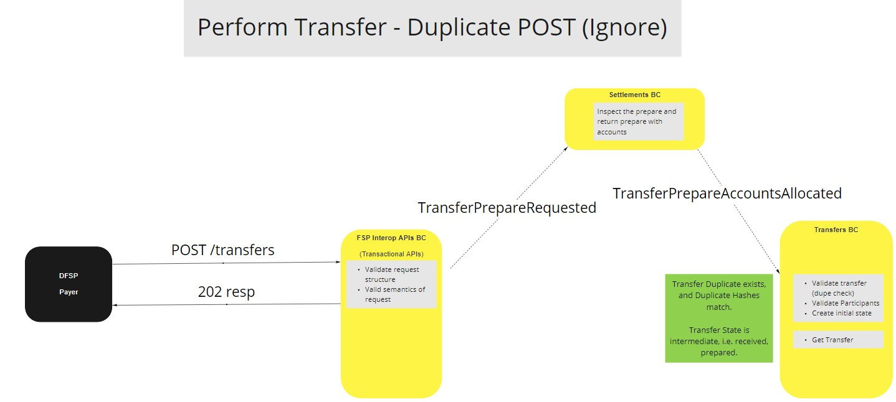

>

### Réaliser un Transfert - DFSP Bénéficiaire Rejette le Transfert

#### Description

Le FSP Payeur envoie une requête POST Transfers [^9] (POST /transfers) à l'API FSP IOP. Celle-ci prépare le transfert puis envoie la requête POST au FSP Bénéficiaire. Celui-ci rejette le transfert via une requête PUT Transfer Error [^25] (PUT /transfers/{ID}/error). L'API FSP IOP notifie alors le BC des Transferts [^22] que le transfert est rejeté et envoie une requête PUT Transfer Error [^25] (PUT /transfers/{ID}/error) au FSP Payeur.

#### Schéma de Flux

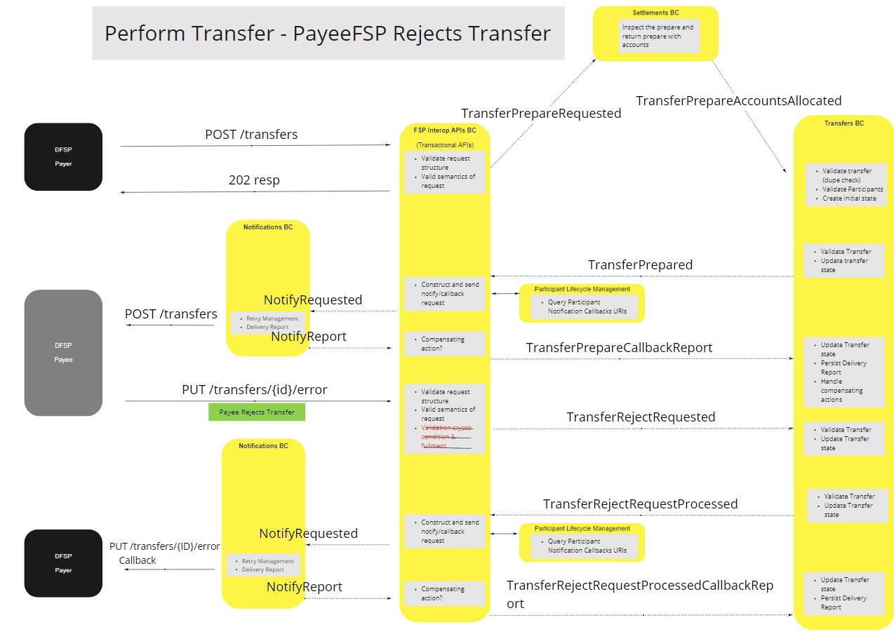

>

### Réaliser un Transfert - Timeout (Préparation)

#### Description

Une requête POST Transfers [^9] (POST /transfers) est rejetée car le transfert expire [^13] lors de la préparation des fonds. L'API FSP IOP envoie une requête PUT Transfer Error [^25] (PUT /transfers/{ID}/error) au FSP Payeur pour signaler l'erreur.

#### Schéma de Flux

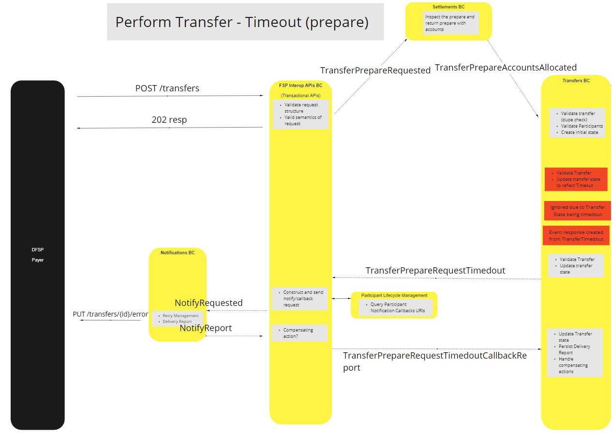

>

### Réaliser un Transfert - Timeout (Pré-Engagé)

#### Description

Le FSP Payeur envoie une requête POST Transfers [^9] (POST /transfers) à l'API FSP IOP, qui envoie un évènement au BC des Règlements [^21]. L'API FSP IOP attend un évènement du BC des Transferts [^22] indiquant la préparation du transfert avant de le transmettre au FSP Bénéficiaire. Celui-ci répond avec PUT Transfers [^23] (PUT /transfers/{ID}) (transferState = committed). Si le transfert expire [^13] pendant/avant l'engagement des fonds, les deux FSP sont alors notifiés de l'échec via PUT Transfer Error [^25] (PUT /transfers/{ID}/error).

#### Schéma de Flux

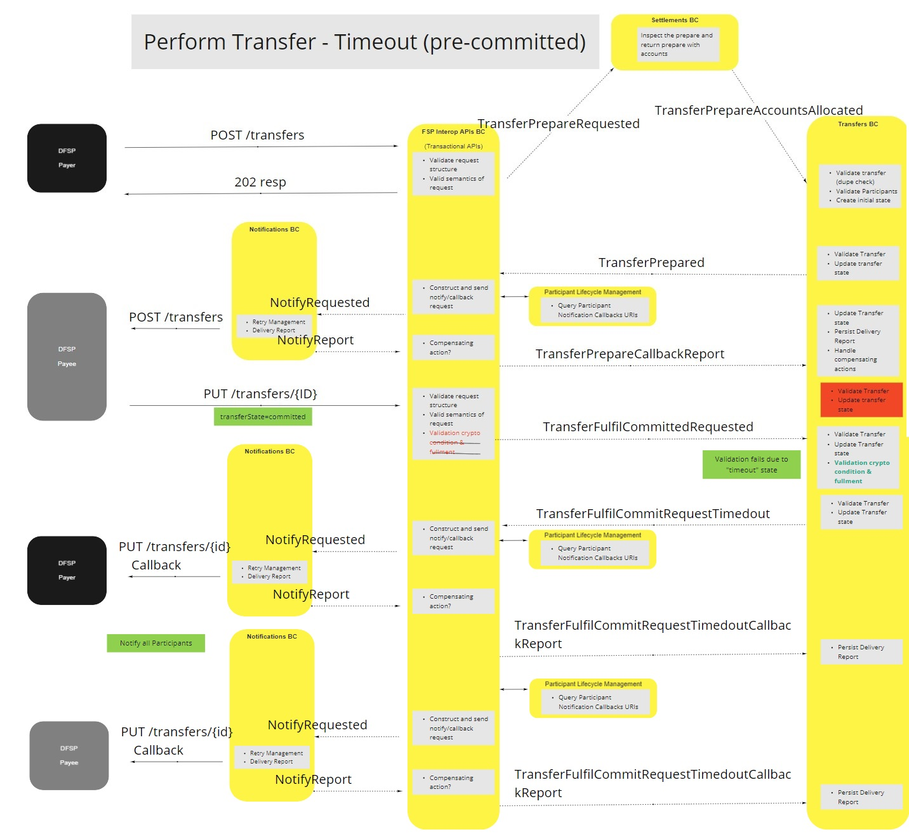

>

### Réaliser un Transfert - Timeout (Post-Engagé)

#### Description

Le FSP Payeur envoie une requête POST Transfers [^9] (POST /transfers) à l'API FSP IOP. Celle-ci envoie un évènement au BC des Règlements [^21]. L'API FSP IOP attend la préparation depuis le BC des Transferts [^22], puis transmet le POST au FSP Bénéficiaire qui répond par PUT Transfers [^23] (disant que le transfert est engagé – transferState = committed). Après validation, le transfert expire [^13]; le transfert est alors considéré rejeté.

#### Schéma de Flux

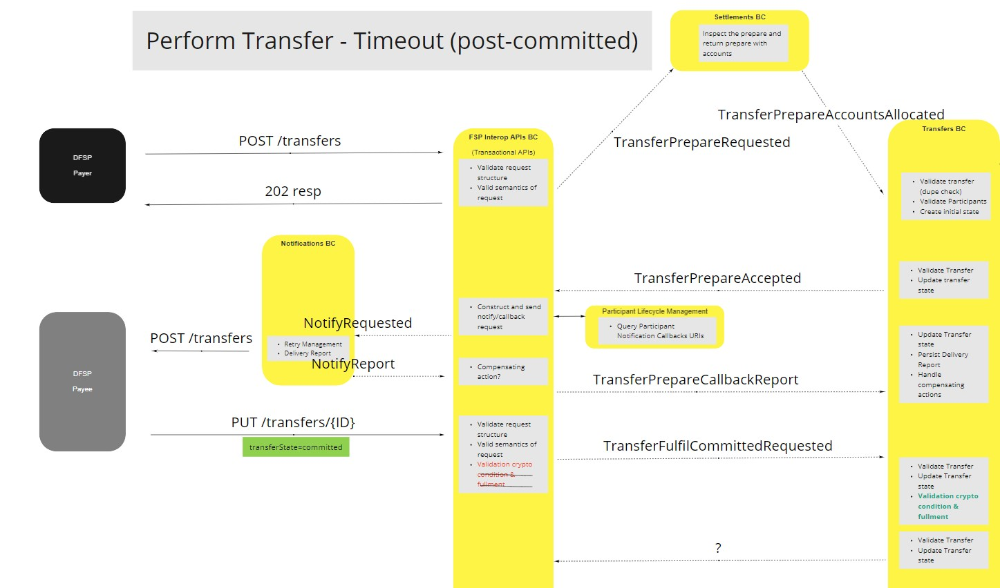

>

### Réaliser un Transfert - Post Doublon (Aucun correspondant)

#### Description

Une requête POST Transfers [^9] (POST /transfers) déjà traitée ; un rapport d'état est retourné au FSP Payeur via une requête PUT Transfer Error [^25] (PUT /transfers/{ID}/error).

#### Schéma de Flux

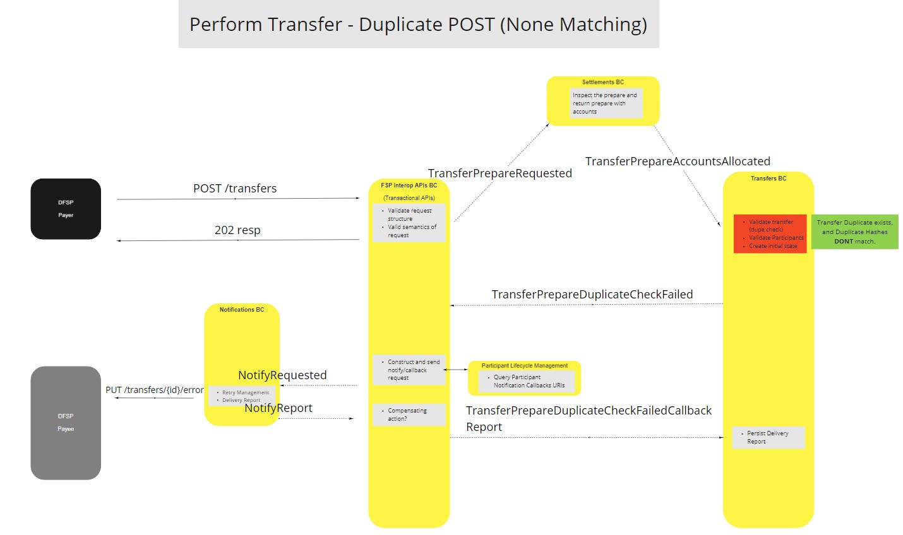

>

### Réaliser un Transfert - Liquidité Insuffisante du FSP Payeur

#### Description

Le FSP Payeur envoie une requête POST Transfers [^9] (POST /transfers) à l'API FSP IOP. Celle-ci émet un évènement au BC des Règlements [^21]. Après avoir reçu l'indication de préparation depuis le BC des Transferts [^22], un échec de contrôle de liquidité est détecté pour le FSP Payeur. L'API FSP OIP envoie alors une requête PUT Transfer Error [^25] au FSP Payeur.

#### Schéma de Flux

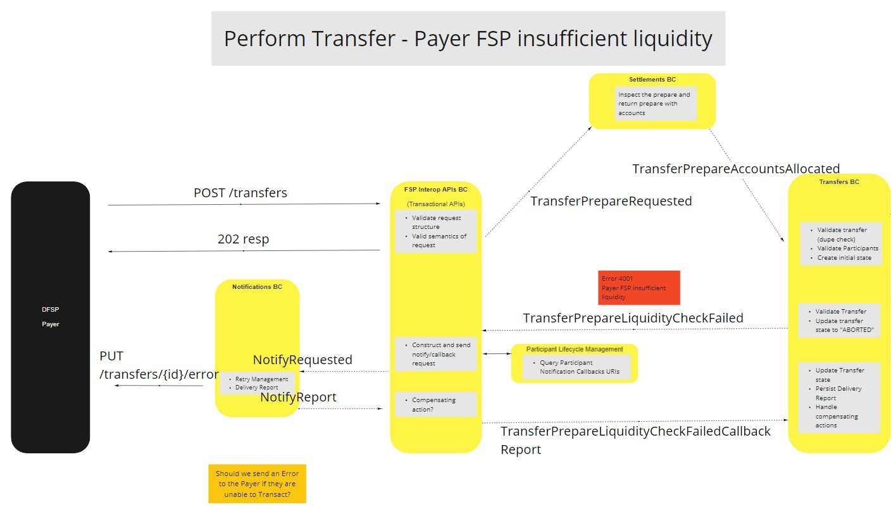

>

### Réaliser un Transfert - Préparation Rejetée

#### Description

Le FSP Payeur envoie une requête POST Transfers [^9] (POST /transfers) à l'API FSP IOP. Celle-ci prépare le transfert puis envoie le POST au FSP Bénéficiaire. Celui-ci décline le transfert avec une requête PUT Transfer Error [^25] (PUT /transfers/{ID}/error). L'API FSP IOP notifie alors le BC Transferts [^22] que le transfert a été rejeté et envoie une requête PUT Transfer Error [^25] (PUT /transfers/{ID}/error) au FSP Payeur.

#### Schéma de Flux

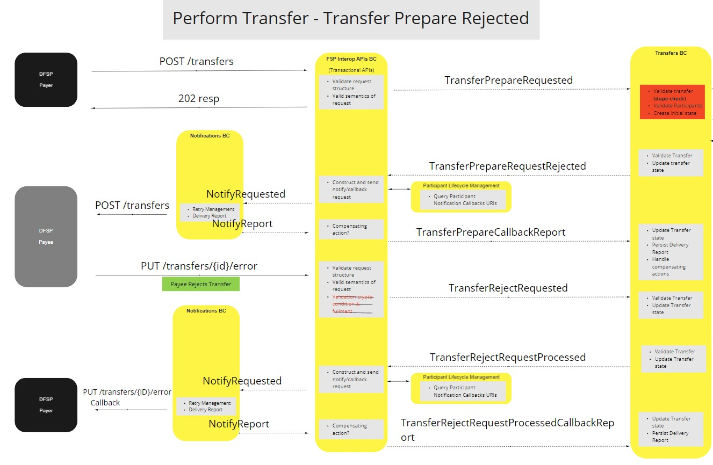

>

### Réaliser un Transfert - Échec de Validation à la Préparation (Participant Payeur Invalide)

#### Description

Le FSP Payeur envoie une requête POST Transfers [^9] (POST /transfers) à l'API FSP IOP. Le BC Transferts [^22] signale à l'API FSP IOP que le FSP Payeur est invalide. Selon le motif, l'API FSP IOP enverra une requête PUT Transfer Error [^25] (PUT /transfers/{ID}/error) au FSP Payeur.

#### Schéma de Flux

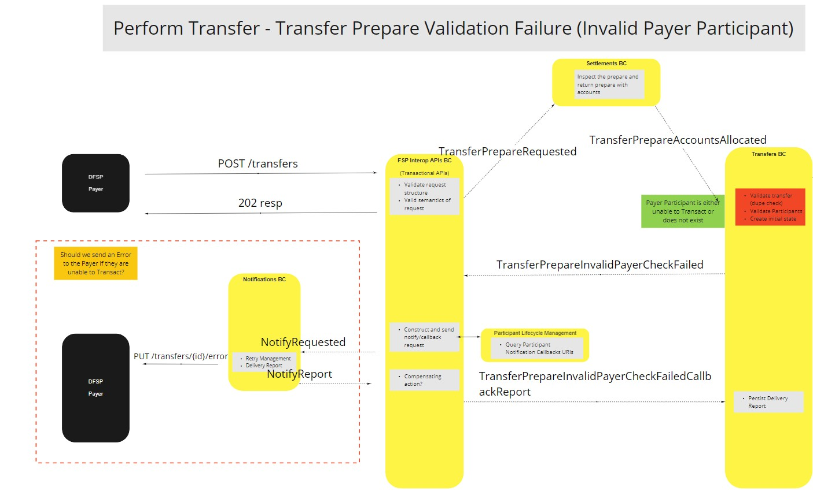

>

### Réaliser un Transfert - Échec de Validation à la Préparation (Participant Bénéficiaire Invalide)

#### Description

Le FSP Payeur envoie une requête POST Transfers [^9] (POST /transfers) à l'API FSP IOP. Le BC Transferts [^22] signale à l'API FSP IOP que le FSP Bénéficiaire est invalide. L'API FSP IOP enverra une requête PUT Transfer Error [^25] (PUT /transfers/{ID}/error) au FSP Payeur pour l'informer de l'échec.

#### Schéma de Flux

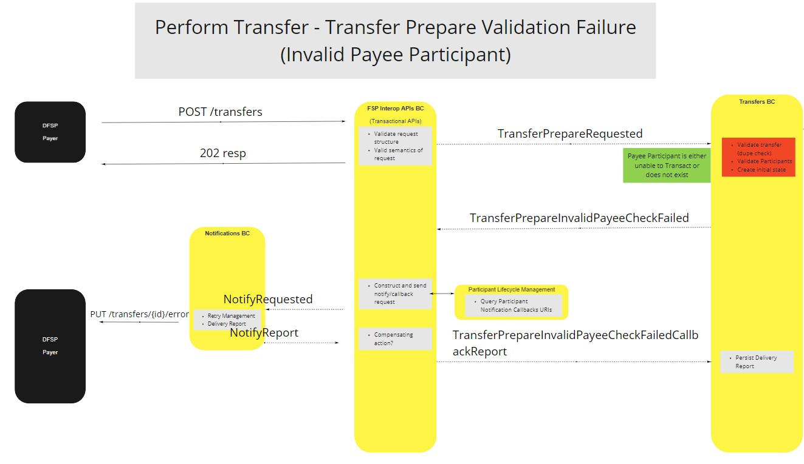

>

## Notes

### Validation de la structure sur les événements internes

De nombreux cas d'utilisation stipulent que la structure et la sémantique de la requête doivent être validées lors de la réception d'un événement provenant d'un contexte borné interne. Cela ne se produit pas à chaque requête, mais est une exigence à respecter lors de la construction de l'architecture de référence. Cela signifie qu'en interne, tous les événements et ressources disponibles doivent être standardisés et vérifiés.

[^1]: [Liste des Interfaces Communes Mojaloop](../../commonInterfaces.md)
[^2]: [Documentation Open API pour la Spécification d'Interopérabilité FSP](https://docs.mojaloop.io/mojaloop-specification/)
[^3]: [Post Quote - Définition](https://docs.mojaloop.io/mojaloop-specification/fspiop-api/documents/API%20Definition%20v1.1.html#6532-post-quotes)
[^4]: [Get Quote - Définition](https://docs.mojaloop.io/mojaloop-specification/fspiop-api/documents/API%20Definition%20v1.1.html#6531-get-quotesid)
[^5]: [Post Participant - Définition](https://docs.mojaloop.io/mojaloop-specification/fspiop-api/documents/API%20Definition%20v1.1.html#6233-post-participantstypeid)
[^6]: [Delete Participant - Définition](https://docs.mojaloop.io/mojaloop-specification/fspiop-api/documents/API%20Definition%20v1.1.html#6234-delete-participantstypeid)
[^7]: [Get Participant - Définition](https://docs.mojaloop.io/mojaloop-specification/fspiop-api/documents/API%20Definition%20v1.1.html#6231-get-participantstypeid)
[^8]: [Get Parties - Définition](https://docs.mojaloop.io/mojaloop-specification/fspiop-api/documents/API%20Definition%20v1.1.html#6331-get-partiestypeid)
[^9]: [Post Transfers - Définition](https://docs.mojaloop.io/mojaloop-specification/fspiop-api/documents/API%20Definition%20v1.1.html#6732-post-transfers)
[^10]: [Commit Notification - Définition](https://docs.mojaloop.io/mojaloop-specification/fspiop-api/documents/API%20Definition%20v1.1.html#6726-commit-notification)
[^11]: [Get Transfers - Définition](https://docs.mojaloop.io/mojaloop-specification/fspiop-api/documents/API%20Definition%20v1.1.html#6731-get-transfersid)
[^12]: [Transaction Irrevocability - Définition](https://docs.mojaloop.io/mojaloop-specification/fspiop-api/documents/API%20Definition%20v1.1.#6722-transaction-irrevocability)
[^13]: [Transfers Timeout and Expiry - Définition](https://docs.mojaloop.io/mojaloop-specification/fspiop-api/documents/API%20Definition%20v1.1.html#6724-timeout-and-expiry)
[^14]: [Contexte borné de Recherche et Découverte de Compte](../accountLookupAndDiscovery/index.md)
[^15]: [Put Participant - Définition](https://docs.mojaloop.io/mojaloop-specification/fspiop-api/documents/API%20Definition%20v1.1.html#6242-put-participantsid)
[^17]: [Put Party- Définition](https://docs.mojaloop.io/mojaloop-specification/fspiop-api/documents/API%20Definition%20v1.1.html#6341-put-partiestypeid)
[^18]: [Put Quote - Définition](https://docs.mojaloop.io/mojaloop-specification/fspiop-api/documents/API%20Definition%20v1.1.html#6541-put-quotesid)
[^19]: [Contexte borné Devis/Accord](../quotingAgreement/index.md)
[^20]: [Put Quote Error - Définition](https://docs.mojmojaloop.io/mojaloop-specification/fspiop-api/documents/API%20Definition%20v1.1.html#6551-put-quotesiderror)
[^21]: [Contexte borné Règlements](../settlements/index.md)
[^22]: [Contexte borné Transferts](../transfers/index.md)
[^23]: [Put Transfers - Définition](https://docs.mojaloop.io/mojaloop-specification/fspiop-api/documents/API%20Definition%20v1.1.html#6741-put-transfersid)
[^24]: [Patch Transfers - Définition](https://docs.mojaloop.io/mojaloop-specification/fspiop-api/documents/API%20Definition%20v1.1.html#6733-patch-transfersid)
[^25]: [Put Transfers Error - Définition](https://docs.mojaloop.io/mojaloop-specification/fspiop-api/documents/API%20Definition%20v1.1.html#6751-put-transfersiderror)
[^26]: [Contexte borné Gestion du Cycle de Vie du Participant](../participantLifecycleManagement/index.md)
[^27]: [Contexte borné Notifications et Alertes](../notificationsAndAlerts/index.md)
