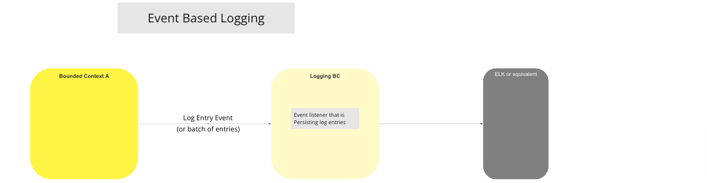

# BC Journalisation (Logging)

Le Contexte Borné de Journalisation (Logging BC) est utilisé pour stocker des informations techniques afin de faciliter le débogage, la recherche de pannes et la résolution des problèmes. Les journaux (logs) sont récupérés depuis n'importe quel autre Contexte Borné [^1] et stockés afin de pouvoir être interrogés ou utilisés pour des rapports. Les informations de journalisation sont considérées comme des « données techniques » ; toute éventuelle perte de ces informations ne devrait avoir pour conséquence que la perte de capacité technique à comprendre le comportement du système. Toutes les activités système sont journalisées et conservées, afin de permettre au Contexte Borné d’Audit [^2] d’effectuer des requêtes sur ces données de log.

Les Contextes Bornés doivent publier les événements dans un format défini et en utilisant le mécanisme disponible fourni par le BC Journalisation. La structure inclut implicitement une couche d’abstraction appliquée à l’événement reçu par le BC Journalisation, qui est alors utilisée pour persister les données de log.

## Cas d’Utilisation

### Journalisation Basée sur les Événements

#### Diagramme de flux

>Diagramme de Workflow UC : Journalisation basée sur les événements

<!-- Les notes de bas de page elles-mêmes se trouvent en bas. -->
## Notes

[^1] : [Liste des Interfaces Communes Mojaloop](../../refarch/commonInterfaces.md)
[^2] : [Contexte Borné Auditing](../auditing/index.md)
