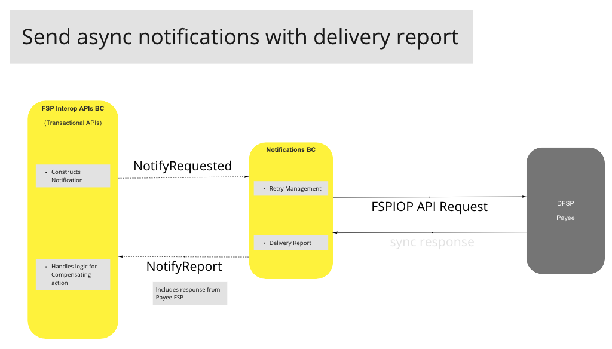
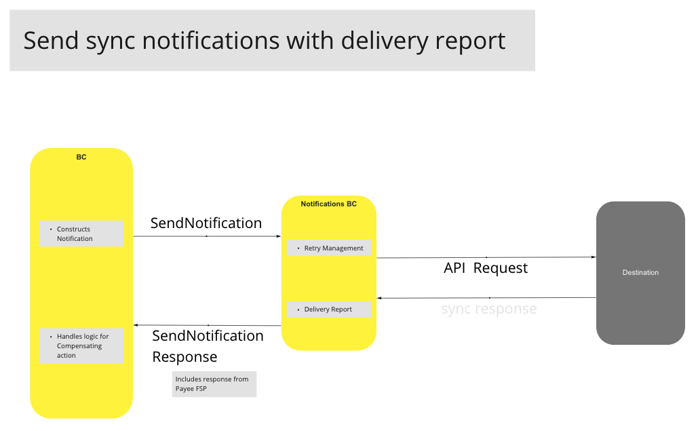
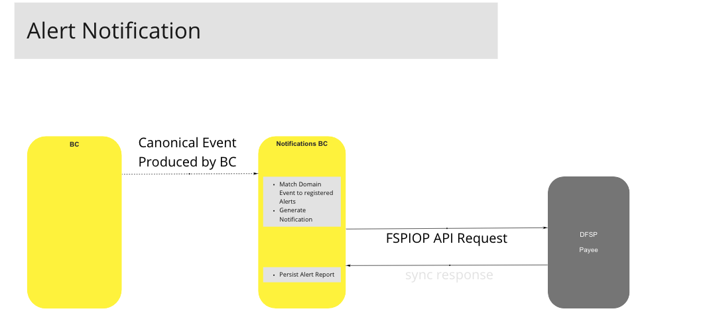
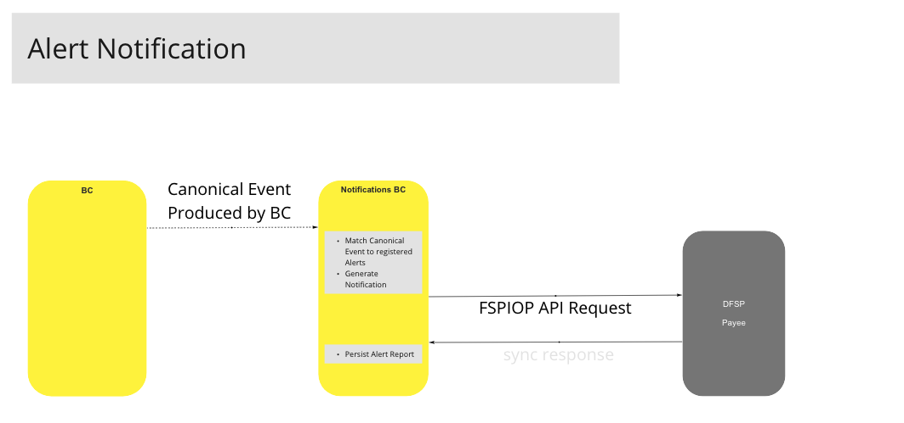

# BC Notifications et Alertes

Le BC Notifications et Alertes agit comme le moteur de notification de la plateforme Mojaloop. Il fournit des capacités complémentaires pour les callbacks FSPIOP fiables en veillant à ce que des rapports de livraison soient disponibles, à des fins de compensation et d’audit. De même, ces capacités peuvent être utilisées pour envoyer des alertes de manière fiable à des sous-systèmes internes ou à des consommateurs externes.

La fiabilité est assurée par plusieurs mécanismes :

- Chaque commande de Notification contient :
  - toutes les informations nécessaires (en-têtes, payload, transport, etc.) requises par le BC pour effectuer la livraison
  - une configuration de reprise et de livraison précisant comment le BC Notifications doit gérer les échecs de livraison
- Les rapports de Notification ou d’Alerte sont conservés et peuvent être interrogés.

## Termes

Termes ayant une signification spécifique et communément admise dans le Contexte Borné où ils sont utilisés.

| Terme | Description |
|---|---|
| **Notification** | Notification sortante envoyée par le BC Notifications et Alertes, généralement vers une destination externe, contenant des en-têtes contextuels et des charges utiles. Un exemple en est les callbacks FSPIOP dans le cadre de la spécification d’API Mojaloop. |
| **Alerte** | Similaire à une notification, mais une alerte sert généralement à informer des sous-systèmes internes (c.-à-d. d’autres BC) ou un opérateur de hub d’un « événement canonique » observé. Un exemple serait qu'un FSP a dépassé sa liquidité disponible. |
| **Rapport de Livraison** | Rapport produit par le BC Notifications et Alertes contenant des informations de livraison relatives à une Notification ou une Alerte spécifique, telles que le statut de livraison, la réponse reçue par la destination, le nombre de tentatives, ainsi que les informations sur les échecs. Ce rapport peut être généré sous la forme d’un événement du domaine, et/ou une réponse synchrone à une requête API. |
| **Événement Canonique** | Désigne tout événement de domaine produit par un Contexte Borné. |

## Cas d'Utilisation

### Envoi de notifications asynchrones avec rapport de livraison

#### Diagramme de flux

### Envoi de notifications synchrones avec rapport de livraison

#### Diagramme de flux

<!-- Les notes de bas de page elles-mêmes sont en bas. -->

### Enregistrement d’alerte

#### Description

Les opérateurs du hub ou les sous-systèmes pourront appeler l’API d’enregistrement d’alerte pour s’abonner à des alertes de notification spécifiques. L’opération AlertRegister inclura :

- Message/Événement de domaine à surveiller
- Informations d'endpoint / transport pour la livraison de la notification
- Modèle pour l’alerte qui sera utilisé pour générer la notification réelle

#### Diagramme de flux

### Notifications d’alerte

#### Diagramme de flux

<!-- Les notes de bas de page elles-mêmes sont en bas. -->
<!--## Notes

[^1]: Interfaces Communes : [Liste des interfaces communes Mojaloop](../../commonInterfaces.md)-->
