# BC Gestion du Cycle de Vie des Participants

Le Contexte Borné Gestion du Cycle de Vie des Participants (Participant Lifecycle Management) traite de tout ce qui concerne la gestion d’un Participant dans l’environnement Mojaloop. Lorsqu’on définit ce Contexte Borné, certains concepts clés doivent être identifiés clairement.

#### Processus Maker-Checker
Le processus Maker-Checker établit une vérification à 6 yeux, garantissant qu’aucune action d’écriture n’a lieu sans être validée par une personne disposant des autorisations adéquates. Ces autorisations sont définies par le Contexte Borné Gestion du Cycle de Vie des Participants, mais elles restent configurables et attribuables selon les règles du schéma. Il est recommandé que les utilisateurs/rôles titulaires des droits de "Maker" ne reçoivent pas ceux de "Checker", et que les droits de "Checker" soient attribués à des personnes différentes. Il reste possible d’attribuer les deux responsabilités au même utilisateur/rôle, mais cela annule alors la sécurité prévue par la séparation des rôles qui est au cœur du processus maker-checker.

#### États du Participant
La gestion des états du participant permet aux opérateurs administrateurs de contrôler les permissions d’un participant donné selon son état. Lors de la phase de configuration de la plateforme, le Contexte Borné attend que les états soient définis et paramétrés avec des rôles et/ou permissions. Un état peut ensuite être attribué à un participant via le processus de gestion du statut du participant.

## Termes

Termes ayant une signification précise et communément acceptée dans le Contexte Borné où ils sont utilisés.

| Terme         | Description  |
| ------------- | ------------ |
| **Participant** | Fournisseur de Services Financiers (FSP) qui s’inscrit sur l’écosystème Mojaloop et peut ainsi effectuer des transactions avec d’autres Participants. |
| **Maker**        | Représentant responsable de la création de structures de données via l’envoi de requêtes.   |
| **Checker**      | Représentant responsable de l’approbation et de l’acceptation des données ayant été demandées pour création. |

## Vue Fonctionnelle

Veuillez consulter la page des interfaces communes pour comprendre comment ces interactions ont lieu. [^1]

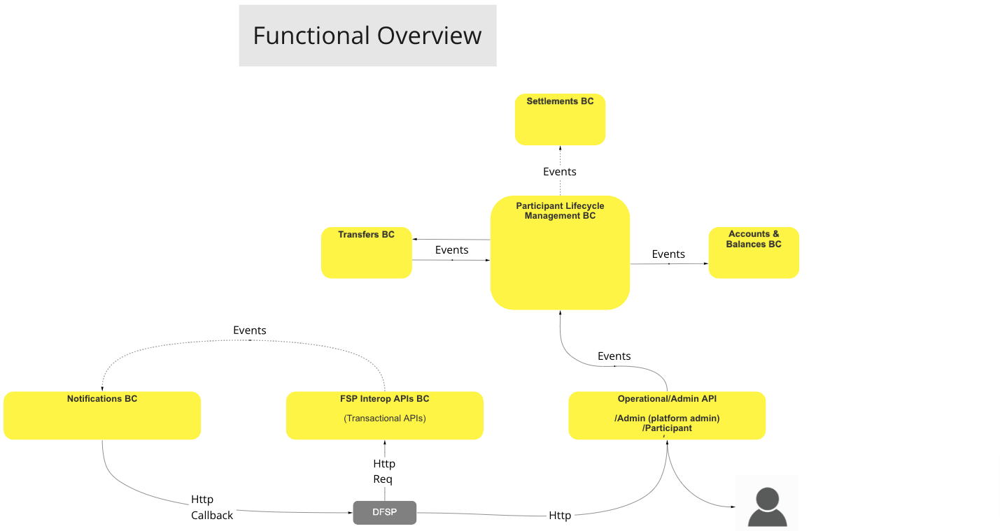
>Diagramme de workflow BC : Vue Fonctionnelle

## Cas d’Utilisation

### Création de Participant (Inscription en une seule étape)

#### Description

Ce flux permet au BC d’employer un processus afin de créer un Participant dans l’écosystème Mojaloop — cela nécessite généralement toutes les informations relatives au participant ainsi qu’aux comptes initiaux nécessaires.

#### Diagramme de flux

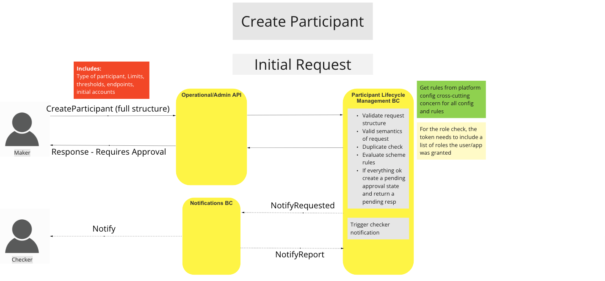
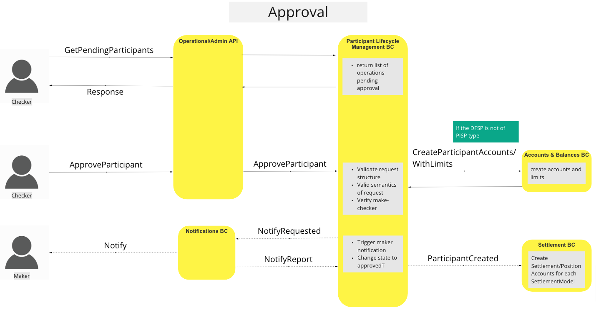
>Workflow UC : Création de Participant

### Gestion des Fonds

#### Description

Ce flux permet au BC de mettre en œuvre un processus pour permettre les retraits ou dépôts de fonds sur le(s) compte(s) du Participant.

#### Diagramme de flux

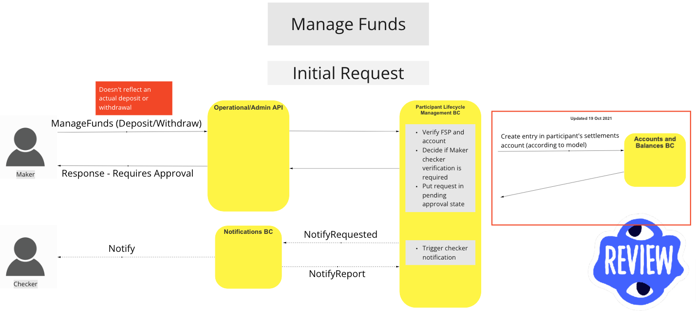
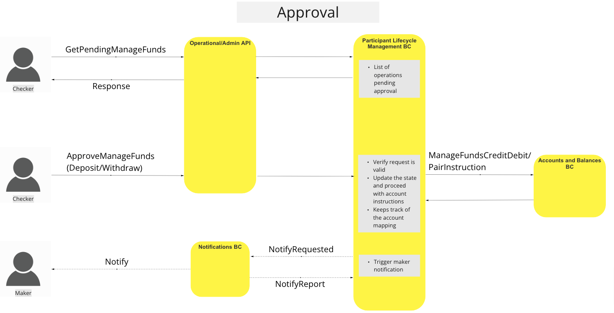
>Workflow UC : Gestion des Fonds

### Mise à Jour des Points de Terminaison

#### Description

Ce flux permet au BC de mettre à jour l’endpoint (adresse réseau) d’un participant donné. Une fois la demande approuvée, l’endpoint sera contacté (keep-alive) pour garantir la connectivité.

#### Diagramme de flux

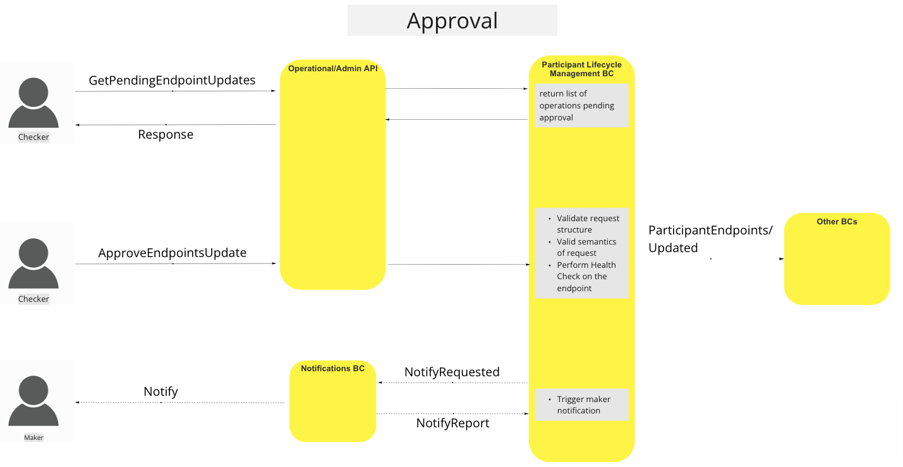
>Workflow UC : Mise à jour des Endpoints

### Mise à Jour du Statut du Participant

#### Description

Ce flux permet au BC de mettre en place un processus par lequel on change le statut d’un participant pour lui appliquer de nouveaux rôles ou règles de schéma.

#### Diagramme de flux

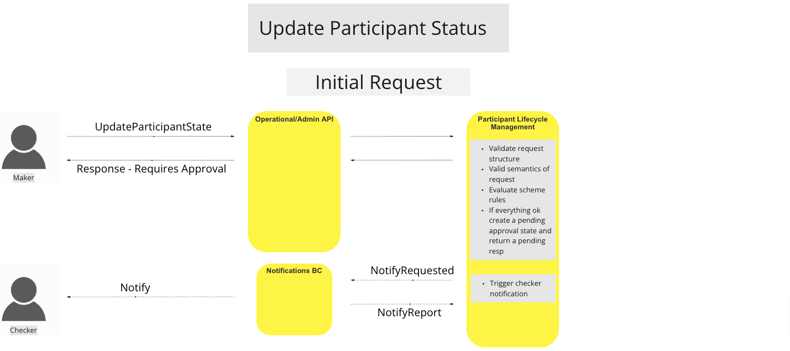
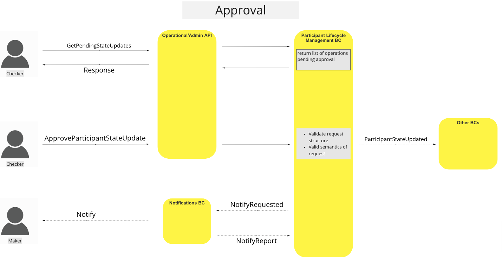
>Workflow UC : Mise à jour du statut du Participant

### Consultation d’un Participant

#### Description

Ce flux permet au BC de mettre en œuvre un processus pour obtenir des informations concernant un participant donné.

#### Diagramme de flux

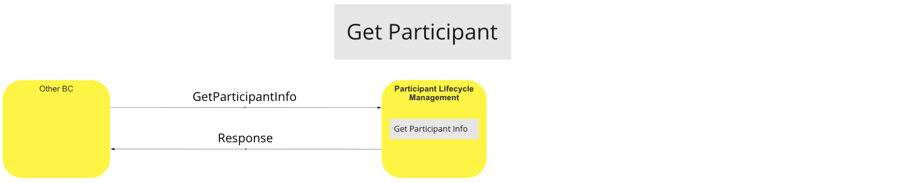
>Workflow UC : Consultation de Participant

### Ajout de Comptes Participant

#### Description

Ce flux permet au BC de contrôler divers aspects des comptes d’un Participant, notamment : création, activation/désactivation, mise à jour des plafonds et seuils d’alerte d’un compte.

- Ajouter un Compte Participant
- Mettre à Jour le Statut d’un Compte Participant (Activation/Désactivation)
- Mettre à Jour les Limites de Liquidité et Seuils d’Alerte

#### Diagramme de flux

<!-- Note d’avertissement aux développeurs & éditeurs : Les deux images suivantes sont générées par le BC Comptes & Soldes. -->

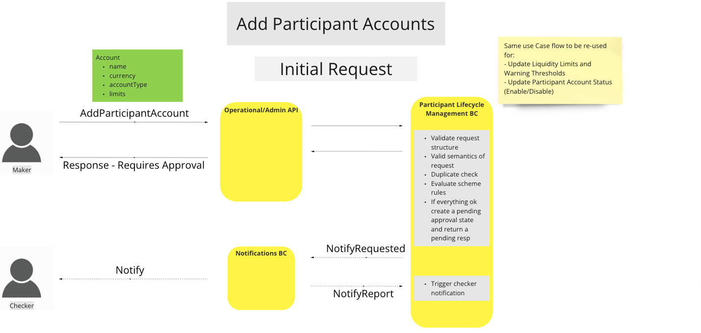
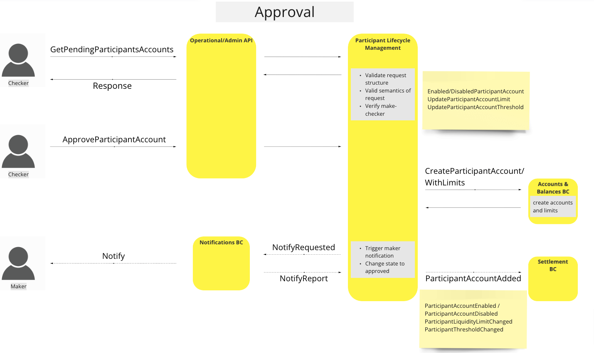
>Workflow UC : Ajout de Comptes Participants

### Réserve de Couverture de Liquidité

#### Description

Ce flux permet au BC de réserver une couverture de liquidité pour un Participant et de notifier le BC Comptes et Soldes de la mise à jour.

#### Diagramme de flux

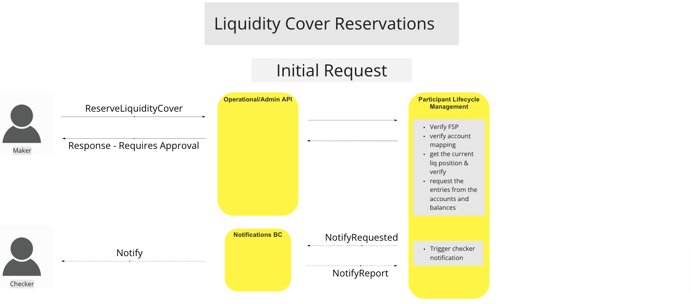
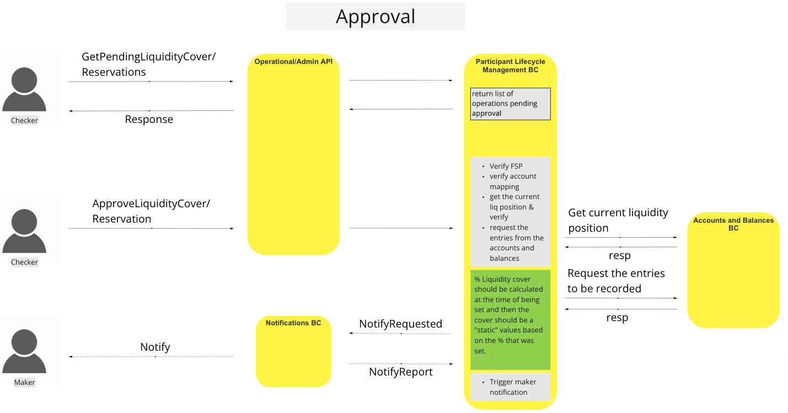
>Workflow UC : Réserve de Couverture de Liquidité

### Dépassement du Seuil de Liquidité

#### Description

Ce flux permet au BC de notifier le participant lorsqu’un seuil de liquidité prédéfini est atteint et qu’une action peut être requise.

#### Diagramme de flux

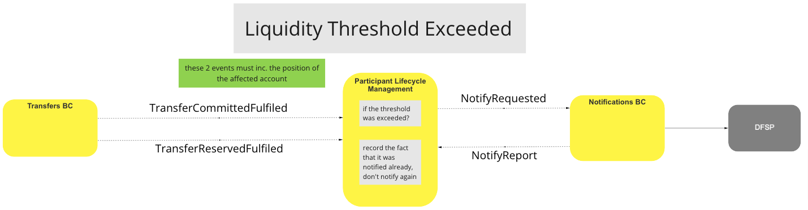
>Workflow UC : Dépassement du Seuil de Liquidité

### Dépassement de la Limite de Liquidité

#### Description

Ce flux permet au BC de notifier le participant lorsqu’il atteint la limite de liquidité prédéfinie pour un compte.

#### Diagramme de flux

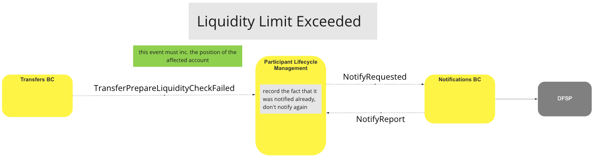
>Workflow UC : Dépassement de la Limite de Liquidité

### Réinitialisation des Seuils et Limites de Liquidité

#### Description

Ce flux permet au BC de réinitialiser les contrôles de notification de limite ou seuil de liquidité lorsque des transferts réussis ont été exécutés et que la position du compte du participant est devenue positive.

#### Diagramme de flux

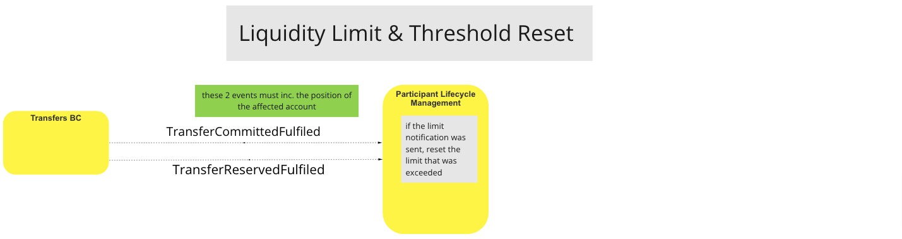
>Workflow UC : Réinitialisation des Seuils et Limites de Liquidité

### Requête de Couverture de Liquidité

#### Description

Ce flux permet au BC d’interroger la liquidité courante d’un compte participant, ainsi que d’effectuer d’autres opérations de lecture associées à la liquidité du participant.

#### Diagramme de flux

<!-- Note d’avertissement aux développeurs & éditeurs : Les deux images suivantes sont générées par le BC Comptes & Soldes. -->

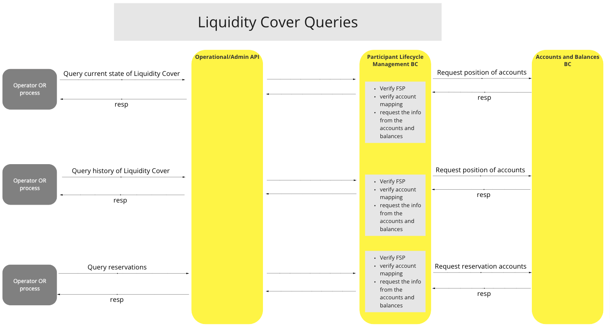
>Workflow UC : Requêtes de Couverture de Liquidité

## Modèle Canonique

-   Participant
    -   id
    -   participantAlias
    -   endpointURL
    -   state
    -   Comptes[]
        -   accountID
        -   ledgerAccountType
        -   accountCurrency
        -   isActive
        -   warningThreshold
        -   limit
            -   type
            -   value

## Commentaires de Conclusion

**Comptes Participants :** Les Participants ne peuvent avoir qu’un seul compte par devise autorisée.
**Cas d’Utilisation - Update Position :** A été remplacé par le cas d’utilisation Gestion des Fonds.
**Opérations Maker/Checker :** Le nombre de tentatives de reprise (retry) n’a aucun effet sur la manière dont nous traitons/retraitons les demandes.

<!-- Notes de bas de page elles-mêmes à la fin. -->

## Notes

[^1]: Interfaces communes : [Liste des interfaces communes Mojaloop](../../boundedContexts/commonInterfaces.md)
