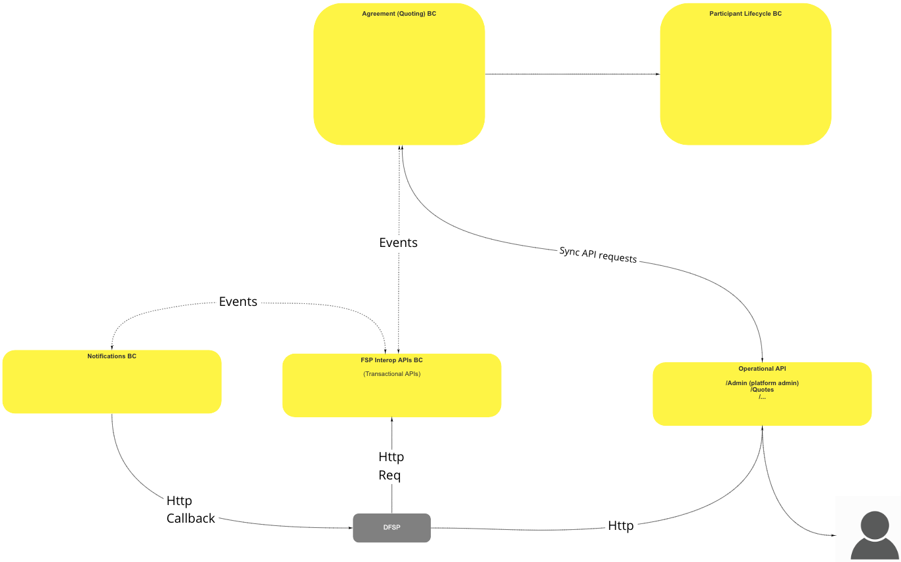
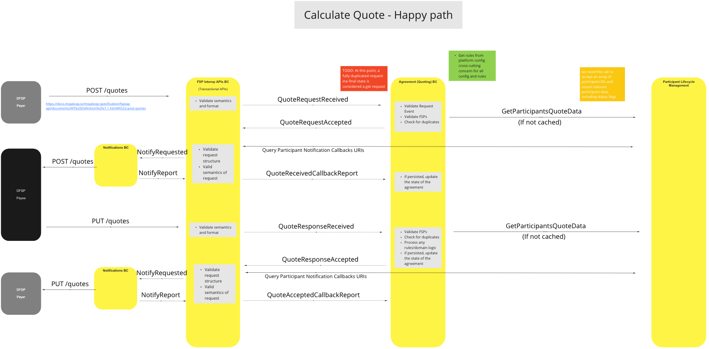
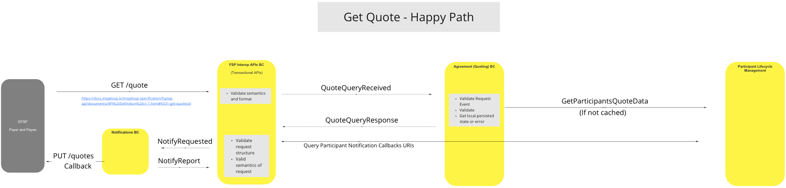
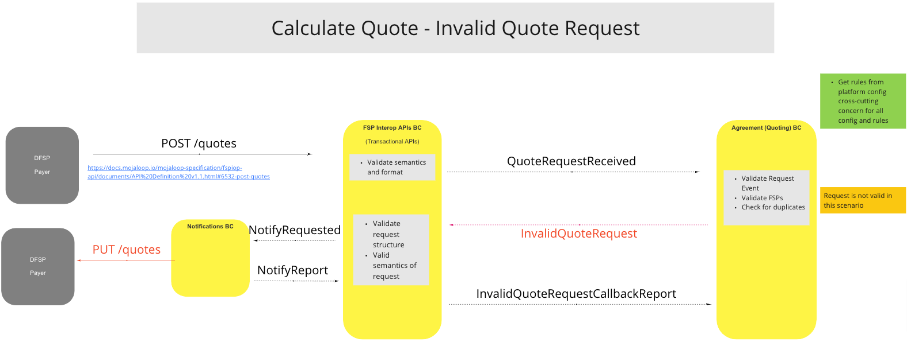
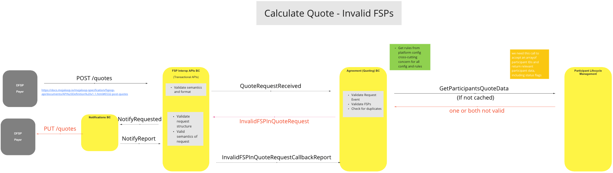
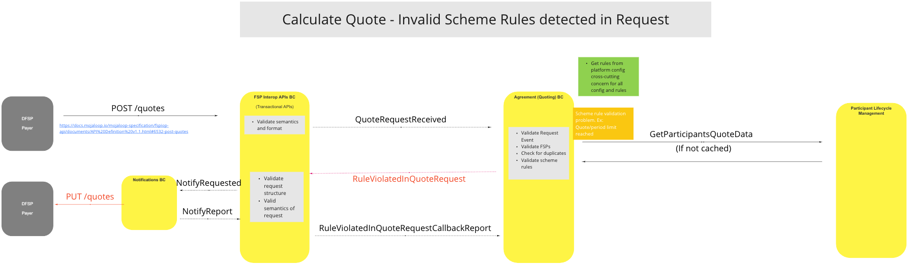
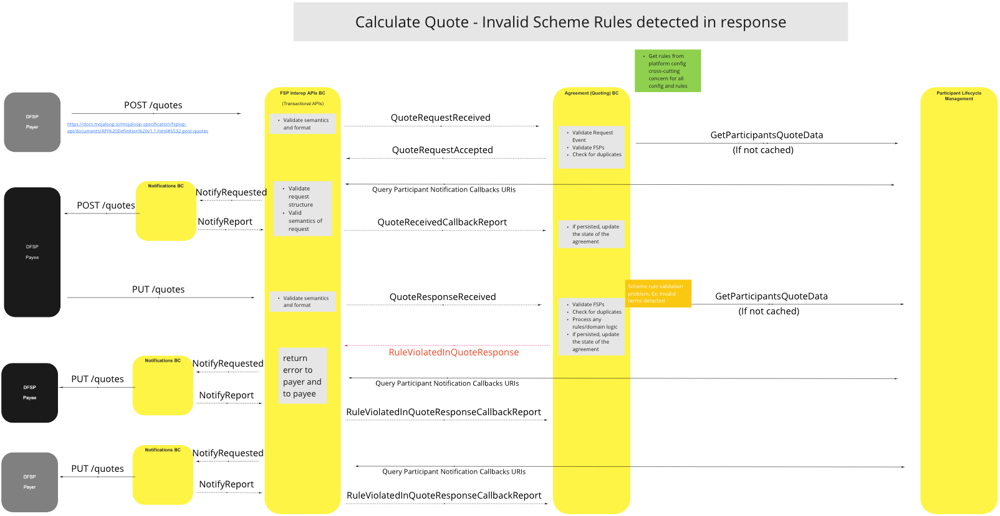

# BC Devis/Accords

Le Contexte Borné de Devis et Accords fournit aux Participants des devis pour effectuer des transferts, et enregistre les réponses d’acceptation ou de rejet des participants.

## Termes

Les termes suivants sont utilisés dans ce BC, également appelé domaine.

| Terme | Description |
|---|---|
| **(D)FSP** | Fournisseur de Services Financiers (Digital) |
| **Participant** | Fournisseur de Services Financiers |

## Vue Fonctionnelle

## Cas d’Utilisation

### Calculer le Devis - Parcours Nominal

#### Description

Ce processus collecte une série de données pertinentes sur le Participant, y compris les indicateurs de statut, calcule le coût du transfert (y compris les frais), et le fournit au(x) Participant(s). Il permet également d’enregistrer les demandes & réponses des Participants (par exemple, acceptation ou rejet du devis).

#### Diagramme de flux

### Obtenir un Devis - Parcours Nominal

#### Description

Processus pour obtenir et délivrer les détails d’un devis existant au(x) Participant(s) sur demande.

#### Diagramme de flux

### Calculer le Devis - Demande de Devis Invalide

#### Description

Processus permettant au système d’invalider des demandes de devis en surveillant et répondant à des événements de demande invalides, FSP invalides, ou demandes dupliquées.

#### Diagramme de flux

### Calculer le Devis - FSP Invalides

#### Description

Processus permettant au système d’invalider des demandes de devis FSP lorsque les informations du FSP ne correspondent pas au devis d’origine pour un ou les deux Participants.

#### Diagramme de flux

### Calculer le Devis - Règles du Schéma Invalides Détectées dans la Demande

#### Description

Processus permettant au système d’invalider une demande de devis lorsqu’une ou plusieurs règles du schéma sont violées par un ou plusieurs participants, par exemple lorsque la limite de période du devis est atteinte.

#### Diagramme de flux

### Calculer le Devis - Règles du Schéma Invalides Détectées dans la Réponse

#### Description

Processus permettant au système d’invalider les réponses de devis dans le cas où des règles du schéma sont violées par un ou plusieurs participants, par exemple lorsque des conditions invalides sont détectées.

#### Diagramme de flux

## Modèle Canonique de Devis

Le modèle canonique stocke les informations suivantes des devis dans le BC Devis & Accords :

- Identifiant du devis
- Identifiant de la transaction
- Participants
  - payerId
  - payeeId
- Payeur
  - Participant
    - participantId
    - roleType (ex. payeur)
  - Montant demandé (montant initial)
    - Valeur (nombre)
    - Devise (code de devise ISO)
  - Montant à envoyer (incluant frais, etc.)
    - Valeur (nombre)
    - Devise (code de devise ISO)
- Destinataire(s) (un ou plusieurs : tous doivent être ajoutés au « Montant à envoyer »)
  - '#'
    - Participant
      - participantId
      - roleType (identifier pourquoi ce « payee » reçoit ce montant, ex : frais, bénéficiaire, etc.)
      - motif (reason)
      - Montant à recevoir
        - valeur (nombre)
        - devise (code de devise ISO)
- Extensions

## Commentaires finaux

- Aucune anomalie majeure constatée dans le BC ou la conception de l’Architecture de Référence.
- Besoin de mieux comprendre/clarifier le modèle « GET » via « POST » :
  - Un événement « GET » doit-il être un simple « GET » Restful, ou le système doit-il prendre en charge le « GET » à partir de posts dupliqués ?
  - Devons-nous servir des requêtes « GET » incluant des détails FSP à une date ultérieure ?

<!--## Notes -->

<!-- Les notes de bas de page sont en bas. -->
[^1]: Interfaces Communes : [Liste des interfaces communes Mojaloop](../../commonInterfaces.md)
