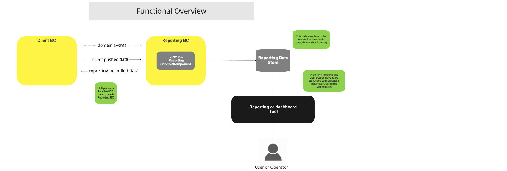
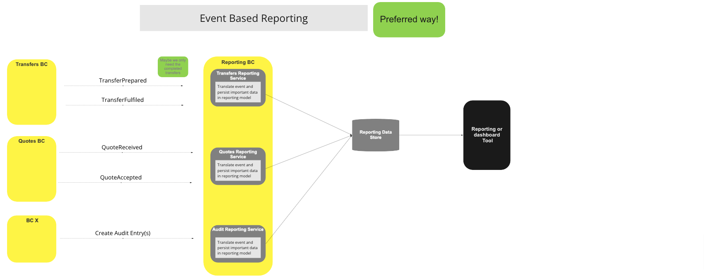
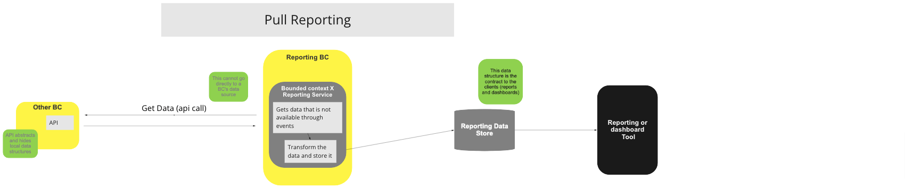
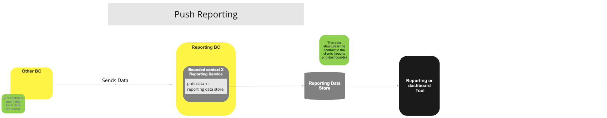

# BC Reporting

## Vue d'ensemble

### Stratégie & Règles

La stratégie de reporting pour cette architecture de référence est de décrire les mécanismes génériques par lesquels les données des BC clients peuvent être persistées et tenues à jour dans un Magasin de données de reporting, de sorte que les utilisateurs et les systèmes puissent ensuite consommer ces données directement du Magasin de données de reporting, ou via tout outil de reporting et/ou de tableau de bord connecté à ce Magasin de données de reporting.

- Ce Magasin de données de reporting doit être accessible en écriture uniquement du point de vue du switch, et en lecture seule par les composants externes.
- Les modèles de données du Magasin de données de reporting peuvent différer des modèles de données opérationnels internes utilisés par le switch ; si pertinent, pour des raisons de performance ou autres, plusieurs modèles pour les mêmes données peuvent être rendus disponibles dans le Magasin de données de reporting – à l'instar de plusieurs projections ou vues.
- Un Composant de Reporting du BC Client, fourni par le switch, traduira les événements internes et les modèles de données internes vers les modèles du magasin de données externe – ce composant peut être remplacé, ou il peut même en exister plusieurs pour un même BC client.
- Un tel composant doit exister dans le BC Reporting pour tout BC Client dont les données sont rendues disponibles dans le Magasin de données de reporting.
- Tout envoi ou récupération directe de données depuis le BC Client source, ou ses magasins de données internes, vers le Magasin de données de reporting constitue une violation du principe de découplage et affectera négativement la maintenabilité du système en raison de son couplage fort.

### Stratégies de reporting :

- Basé sur les événements – Méthode privilégiée – Sur le BC Reporting, un composant (gestionnaire d'événements) écoute les événements pertinents depuis son BC associé et transforme ces événements en entrées dans le magasin de données de reporting – il peut y avoir plusieurs de ces composants par BC client, toutefois chacun doit être le seul responsable de l'écriture d'un sous-ensemble des données de reporting.
- Push – Le BC client appelle l'API du Composant de Reporting correspondant afin d'envoyer les données ; cette API transforme et persiste les données dans le magasin de données de reporting ([^1] avec le BC source, c'est-à-dire, il doit y avoir une API par BC source).
- Pull – Sur le BC Reporting, un Composant de Reporting pour BC client (piloté par minuterie) appelle une API sur le BC source pour récupérer ses données, qui sont ensuite persistées dans le magasin de données de reporting ([^1] avec le BC source).

**Pour les BC critiques en performance, il faut toujours privilégier la stratégie de reporting pilotée par les événements.**

### Règles minimales à respecter :

- Seul le Magasin de données de reporting doit être utilisé pour le reporting et les tableaux de bord. Les systèmes externes ne sont pas autorisés à accéder directement aux magasins de données internes des Bounded Contexts. L'accès opérationnel pour les systèmes externes sera disponible via les API opérationnelles ou API d'interopérabilité.
- Les données sources internes des BC clients ne peuvent pas être « transmises » directement au Magasin de données de reporting : il doit y avoir une traduction entre la structure de données source et la structure de données de reporting, même s'il n'y a pas de différence de structure. L'objectif est d'éviter toute dépendance du côté reporting à la structure de données source.

### À faire

- Décider quels rapports initiaux et tableaux de bord doivent être inclus dans la fonctionnalité de reporting de base.
- Choisir des outils open source de reporting et de tableau de bord pour fournir cette fonctionnalité de base.
- Reporting de conformité/assurance – définir certains de ces rapports de base (KYC, AML)
- Discuter de la « Surveillance des processus (et SLA) » et décider si cela peut être fait au-dessus de la couche de reporting (la définition des chiffres critiques, SLI & SLO, se fait par la configuration de la plateforme)
- Ajouter un lien vers l'API opérationnelle BC dans la section des règles ci-dessus.

## Termes

Termes ayant une signification spécifique et communément acceptée dans le Contexte Borné dans lequel ils sont utilisés.

| Terme                         | Description |
|-------------------------------|-------------|
| **BC Client** | Contexte Borné source (ou propriétaire) des données persistées dans le Magasin de données de reporting |
| **Magasin de données de reporting** | Data store(s) externe(s) (il peut y en avoir plusieurs) où les données de reporting produites par les Composants de Reporting des BC Clients sont stockées et tenues à jour |
| **Composant de Reporting du BC Client** | Ce composant, qui peut prendre la forme d'un service, est responsable de la traduction du modèle interne vers le(s) modèle(s) externe(s) stocké(s) dans le Magasin de données de reporting |
| **Outil de reporting ou de tableau de bord** | Outils externes qui utilisent les données du Magasin de données de reporting comme source pour produire des rapports, des tableaux de bord ou toute autre tâche liée au reporting |

## Vue Fonctionnelle

> Diagramme des fonctions BC : Vue fonctionnelle

## Cas d'Utilisation

### Reporting par événements (méthode privilégiée)

#### Description

Stratégie pour alimenter le Magasin de données de reporting en ayant un Composant de Reporting du BC Client à l'écoute des événements internes et persistant les données de reporting correspondantes.

#### Diagramme de flux

> Diagramme du workflow UC : Reporting par événements (méthode privilégiée)

### Reporting par extraction (pull)

#### Description

Stratégie pour alimenter le Magasin de données de reporting en faisant en sorte que le Composant de Reporting du BC Client aille chercher les données auprès de l'API du BC Client.

#### Diagramme de flux

> Diagramme du workflow UC : Reporting par extraction (pull)

### Reporting par envoi (push)

#### Description

Stratégie pour alimenter le Magasin de données de reporting en ayant le BC client qui envoie à l'API du Composant de Reporting du BC Client les données à rapporter, puis ce composant traduit et persiste ces données.

#### Diagramme de flux

> Diagramme du workflow UC : Reporting par envoi (push)

### Consultation des rapports et tableaux de bord par l'utilisateur

#### Description

Exemple de la manière dont un utilisateur peut consommer des rapports et des tableaux de bord.

#### Diagramme de flux

> Diagramme du workflow UC : Consommation utilisateur – reporting & dashboard

<!-- Les notes de bas de page elles-mêmes sont en bas. -->
## Notes

[^1] : Interfaces communes : [Liste des interfaces communes Mojaloop](../../refarch/commonInterfaces.md)
